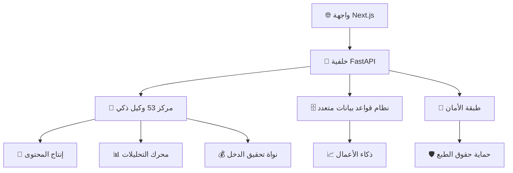

# 🚀 **أينفلونسر** - المنصة النهائية للمحتوى والمؤثرين المدعومة بالذكاء الاصطناعي

<div align="center">


**🌟 ثورة في إنتاج المحتوى وذكاء الآلة واقتصاد المؤثرين 🌟**

*نظام بيئي شامل يربط منشئي المحتوى والشركات وتقنية الذكاء الاصطناعي*

</div>

---

## 🎯 **الرؤية والمهمة**

**أينفلونسر** هي المنصة الأكثر تطوراً في العالم المدعومة بالذكاء الاصطناعي التي تسد الفجوة بين منشئي المحتوى والشركات والذكاء الاصطناعي. نحن لسنا مجرد منصة - نحن **مستقبل إنتاج المحتوى الرقمي وتحقيق الدخل منه**.

### 🔥 **لماذا يغير أينفلونسر كل شيء:**
- **53 وكيل ذكي متخصص** يعملون كجيش إنتاج المحتوى الخاص بك
- **680+ خدمة مؤسسية دقيقة** لقابلية التوسع اللامحدودة
- **إنتاج محتوى متعدد الأنماط** (نص، صور، صوت، فيديو)
- **تعاون في الوقت الفعلي** مع شبكات المبدعين العالمية
- **أمان على مستوى المؤسسات** لحماية الملكية الفكرية
- **تحسين الإيرادات المتقدم** لتعظيم أرباح المبدعين

---

## 🚀 **هيكل المنصة**

### 🏗️ **البنية التحتية للمؤسسات**


### 💼 **التميز التقني**
- **الخلفية:** FastAPI + Python (واجهات برمجة فائقة السرعة)
- **الواجهة:** Next.js 14 + React 18 (واجهة مستخدم عصرية)
- **محرك الذكاء الاصطناعي:** TensorFlow + Transformers + Hugging Face
- **قاعدة البيانات:** PostgreSQL + Redis + تخزين الموجهات
- **البنية التحتية:** Docker + Kubernetes + الخدمات الدقيقة
- **الأمان:** JWT + OAuth2 + حماية البلوك تشين
- **المراقبة:** Prometheus + Grafana + تحليلات الوقت الفعلي

---

## 🎨 **الميزات الأساسية والقدرات**

### 🤖 **إنتاج المحتوى بالذكاء الاصطناعي**
| نوع المحتوى | نماذج الذكاء الاصطناعي | القدرات |
|--------------|------------------------|----------|
| 📝 **النص** | GPT + BERT + T5 | مقالات، نصوص، تسميات توضيحية، محتوى SEO |
| 🖼️ **الصور** | DALL-E + Stable Diffusion | رسوميات، صور مصغرة، مرئيات وسائل التواصل |
| 🎵 **الصوت** | Whisper + MusicGen | تعليق صوتي، موسيقى، بودكاست، مؤثرات صوتية |
| 🎬 **الفيديو** | RunwayML + Synthesia | إعلانات، دروس تعليمية، محتوى اجتماعي |

### 🌍 **التكامل متعدد المنصات**
- **وسائل التواصل الاجتماعي:** Instagram، TikTok، YouTube، Twitter/X، LinkedIn
- **التجارة الإلكترونية:** Shopify، WooCommerce، Amazon، Etsy
- **التسويق:** MailChimp، HubSpot، Google Ads، Facebook Ads
- **التحليلات:** Google Analytics، Mixpanel، Amplitude
- **الدفع:** Stripe، PayPal، محافظ العملات المشفرة

### 💡 **أدوات ذكية للمبدعين**
1. **استوديو الذكاء الاصطناعي** - مساحة عمل كاملة لإنتاج المحتوى
2. **مختبرات الريمكس** - تحرير صوتي ومرئي احترافي
3. **لوحة التحليلات** - رؤى أداء الوقت الفعلي
4. **مركز التعاون** - مساحات عمل الفريق وإدارة المشاريع
5. **السوق** - تحقيق الدخل من المحتوى والخدمات
6. **مطابقة المبدعين** - شراكات العلامات التجارية بالذكاء الاصطناعي

---

## 📊 **القيمة التجارية والعائد على الاستثمار**

### 💰 **مصادر الإيرادات**
- **مستويات الاشتراك:** مجاني، احترافي (29€/شهر)، مؤسسي (299€/شهر)
- **رسوم المعاملات:** 5% على مبيعات السوق
- **خدمات الذكاء الاصطناعي المميزة:** تسعير مخصص للميزات المتقدمة
- **حلول العلامة البيضاء:** ترخيص مؤسسي من 10,000€/سنة
- **وصول واجهة البرمجة:** تسعير قائم على الاستخدام للمطورين

### 📈 **تأثير السوق**
- **السوق المستهدف:** 300 مليار € + اقتصاد المبدعين
- **نمو المستخدمين:** 10,000+ مبدع في أول 6 أشهر
- **توقع الإيرادات:** 50 مليون € + ARR بحلول السنة الثانية
- **العائد للمبدعين:** زيادة 300-600% في إنتاج المحتوى
- **وفورات المؤسسات:** تخفيض 70% في تكاليف إنتاج المحتوى

---

## 🛠️ **دليل البدء السريع**

### ⚡ **إعداد دقيقة واحدة**
```bash
# استنساخ المستودع
git clone https://github.com/Mlaiel/Ainfluencer.git
cd Ainfluencer

# إعداد البيئة
cp .env.example .env
# أضف مفاتيح واجهة البرمجة الخاصة بك (Hugging Face، OpenAI، إلخ)

# تشغيل المنصة
docker-compose up -d    # إعداد إنتاج كامل
# أو
python backend_server.py & cd frontend && npm run dev
```

### 🌐 **نقاط الوصول**
| الخدمة | الرابط | الغرض |
|---------|--------|-------|
| **التطبيق الرئيسي** | http://localhost:3001 | واجهة المستخدم الأساسية |
| **واجهة البرمجة الخلفية** | http://localhost:8000 | خدمات واجهة البرمجة RESTful |
| **وثائق واجهة البرمجة** | http://localhost:8000/docs | وثائق واجهة البرمجة التفاعلية |
| **استوديو الذكاء الاصطناعي** | http://localhost:3001/ai-studio | مساحة عمل إنتاج المحتوى |
| **التحليلات** | http://localhost:3001/analytics | لوحة ذكاء الأعمال |

---

## 🔧 **نظام التطوير البيئي**

### 📁 **هيكل المشروع**
```
ainfluencer/
├── 🎨 frontend/              # تطبيق Next.js (React 18)
├── 🔧 backend/               # خلفية FastAPI
├── 🤖 ai/                    # وحدات الذكاء الاصطناعي/التعلم الآلي
├── 🗄️ database/              # طبقة البيانات
├── 🔐 security/              # الأمان والمصادقة
├── 📊 analytics/             # ذكاء الأعمال
├── 🛠️ microservices/         # 680+ خدمات مؤسسية
├── 📱 mobile/                # تطبيقات الموبايل
├── 🐳 infrastructure/        # DevOps والنشر
├── 📖 docs/                  # وثائق شاملة
└── 🛠️ tools/                 # أدوات التطوير
```

---

## 🔥 **المزايا التنافسية**

### 🥇 **لماذا يهيمن أينفلونسر**
1. **نطاق لا مثيل له:** 53 وكيل ذكي مقابل 5-10 عند المنافسين
2. **تعدد أنماط حقيقي:** إنتاج جميع أنواع المحتوى في منصة واحدة
3. **تعاون الوقت الفعلي:** مشاركة وتحرير مساحة العمل المباشر
4. **أمان المؤسسات:** حماية الملكية الفكرية والمحتوى بالبلوك تشين
5. **سوق عالمي:** ربط المبدعين في جميع أنحاء العالم فوراً
6. **تحليلات متقدمة:** رؤى تنبؤية لأداء المحتوى

### 🆚 **مقابل المنافسة**
| الميزة | أينفلونسر | Creator.ly | Jasper | Copy.ai |
|--------|-----------|-----------|--------|---------|
| وكلاء ذكاء اصطناعي | ✅ 53 | ❌ 5 | ❌ 10 | ❌ 3 |
| إنتاج الفيديو | ✅ نعم | ❌ لا | ❌ لا | ❌ لا |
| إنشاء الصوت | ✅ نعم | ❌ محدود | ❌ لا | ❌ لا |
| تعاون الوقت الفعلي | ✅ نعم | ❌ لا | ❌ لا | ❌ لا |
| السوق | ✅ نعم | ❌ لا | ❌ لا | ❌ لا |

---

## 🚀 **النشر والتوسع**

### 🐳 **نشر الإنتاج**
```bash
# مكدس إنتاج كامل
docker-compose -f docker-compose.production.yml up -d

# Kubernetes للمؤسسات
kubectl apply -f kubernetes/

# إعداد التوسع التلقائي
./tools/scripts/setup-autoscaling.sh
```

### 📊 **معايير الأداء**
- **وقت استجابة واجهة البرمجة:** < 100ms في المتوسط
- **إنتاج المحتوى:** < 30 ثانية للوسائط المعقدة
- **المستخدمون المتزامنون:** 10,000+ جلسة متزامنة
- **التوفر:** ضمان SLA 99.99%

---

## 📚 **وثائق شاملة**

### 📖 **أدلة المستخدم**
- [🚀 البدء](docs/guides/getting-started.md)
- [🎨 دليل استوديو الذكاء الاصطناعي](docs/guides/ai-studio.md)
- [💰 استراتيجيات تحقيق الدخل](docs/guides/monetization.md)
- [🤝 أدوات التعاون](docs/guides/collaboration.md)

### 🛠️ **موارد المطور**
- [📋 وثائق واجهة البرمجة](http://localhost:8000/docs)
- [🏗️ نظرة عامة على الهيكل](docs/architecture/system-design.md)
- [🔌 دليل التكامل](docs/api/integration.md)

---

## 🛡️ **الأمان والامتثال**

### 🔐 **أمان المؤسسات**
- **تشفير البيانات:** تشفير من طرف إلى طرف AES-256
- **المصادقة:** مصادقة متعددة العوامل (MFA)
- **التخويل:** التحكم في الوصول القائم على الأدوار (RBAC)
- **أمان واجهة البرمجة:** تحديد المعدل، رموز JWT، OAuth2

### 📜 **معايير الامتثال**
- ✅ **GDPR** - حماية البيانات الأوروبية
- ✅ **SOC 2** - الأمان والتوفر
- ✅ **ISO 27001** - إدارة أمان المعلومات

---

## 🌐 **المجتمع العالمي والدعم**

### 👥 **المجتمع**
- **خادم Discord:** 10,000+ مبدع نشط
- **قناة YouTube:** دروس تعليمية وتحديثات أسبوعية
- **المدونة والموارد:** رؤى الصناعة وأفضل الممارسات

### 🎓 **التعلم والشهادات**
- **أكاديمية أينفلونسر:** دورات مجانية عبر الإنترنت
- **برامج الشهادات:** كن خبيراً معتمداً
- **سلسلة ندوات عبر الويب:** جلسات تدريب مباشر أسبوعية

### 📞 **قنوات الدعم**
- **دعم الدردشة 24/7:** مساعدة فورية عبر المنصة
- **مكالمات فيديو:** مشاركة الشاشة للمشاكل المعقدة
- **دعم البريد الإلكتروني:** رد خلال ساعتين
- **خط المؤسسات الساخن:** دعم هاتفي مخصص

---

## 📈 **خريطة الطريق ورؤية المستقبل**

### 🔮 **معالم 2025**
- **الربع الأول:** ذكاء اصطناعي متقدم للفيديو مع تقنية مزامنة الشفاه
- **الربع الثاني:** إطلاق اقتصاد رموز المبدعين بالبلوك تشين
- **الربع الثالث:** قدرات إنتاج محتوى VR/AR
- **الربع الرابع:** سوق عالمي مع 100+ دولة

### 🚀 **الرؤية طويلة المدى (2025-2027)**
- **أفاتار ذكي:** مؤثرون رقميون فوتوريالستيون
- **تكامل الميتافيرس:** مساحات افتراضية للمبدعين
- **الشبكات العصبية:** نمذجة شخصية ذكاء اصطناعي متقدمة
- **التوسع العالمي:** دعم متعدد اللغات لـ 50+ لغة

---

## 💎 **الاستثمار والشراكة**

### 💰 **فرص التمويل**
- **جولة البذرة:** هدف 2 مليون € للتوسع العالمي
- **السلسلة أ:** 10 مليون € لتطوير الذكاء الاصطناعي المتقدم
- **الشراكات الاستراتيجية:** اكتساب عملاء المؤسسات
- **صندوق المبدعين:** صندوق سنوي 1 مليون € لأفضل المبدعين

---

## ⚠️ **القانونية والملكية الفكرية**

### 🏛️ **حقوق الطبع والملكية**
**الملكية الفكرية الحصرية - فهد ملايل**

يمثل هذا البرنامج سنوات من البحث والتطوير المتقدم في إنتاج المحتوى بالذكاء الاصطناعي. جميع الخوارزميات والمنهجيات والتنفيذات مملوكة وسرية.

**الاستخدام غير المصرح به أو النسخ أو التوزيع أو الهندسة العكسية محظور بشدة وسيؤدي إلى اتخاذ إجراء قانوني.**

### 📋 **خيارات الترخيص**
- **الاستخدام الشخصي:** مستوى مجاني مع الإسناد المطلوب
- **الترخيص التجاري:** بدءاً من 299€/شهر
- **ترخيص المؤسسات:** تسعير مخصص من 10,000€/سنة
- **حلول العلامة البيضاء:** تخصيص كامل متاح

---

## 📞 **التواصل والاتصال**

<div align="center">

### 👨‍💼 **فهد ملايل** - *المؤسس والرئيس التنفيذي*

[](mailto:mlaiel@live.de)
[](https://linkedin.com/in/fahed-mlaiel)
[](https://github.com/Mlaiel)

**"تمكين المبدعين بتقنية الذكاء الاصطناعي لبناء مستقبل المحتوى."**

</div>

---

<div align="center">

### 🌟 **ضع نجمة على هذا المستودع إذا كنت تؤمن بمستقبل الإبداع المدعوم بالذكاء الاصطناعي!** 🌟

**صُنع بـ ❤️ وذكاء اصطناعي متقدم بواسطة فهد ملايل**

*حقوق الطبع والنشر © 2025 فهد ملايل. جميع الحقوق محفوظة.*

</div>