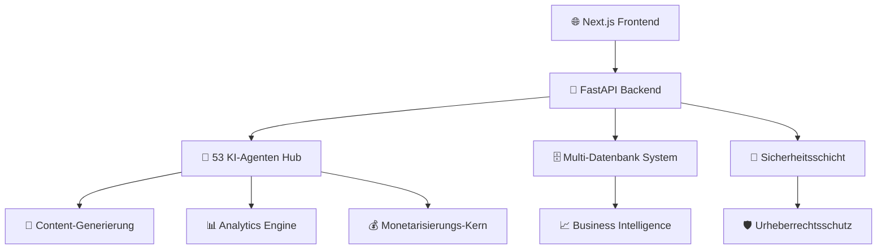

# 🚀 **IACHERIE** - Die Ultimative KI-gestützte Content & Influencer Plattform

<div align="center">


**🌟 Revolutionierung der Content-Erstellung, KI-Intelligenz & Influencer-Wirtschaft 🌟**

*Ein umfassendes Ökosystem, das Content-Ersteller, Unternehmen und KI-Technologie verbindet*

</div>

---

## 🎯 **VISION & MISSION**

**IA Chérie** ist die weltweit fortschrittlichste KI-gestützte Plattform, die die Lücke zwischen Content-Erstellern, Unternehmen und künstlicher Intelligenz schließt. Wir sind nicht nur eine Plattform - wir sind die **Zukunft der digitalen Content-Erstellung und Monetarisierung**.

### 🔥 **Warum IA Chérie alles verändert:**
- **53 Spezialisierte KI-Agenten** arbeiten als Ihre Content-Erstellungs-Armee
- **680+ Enterprise-Microservices** für unbegrenzte Skalierbarkeit
- **Multi-modale Content-Generierung** (Text, Bilder, Audio, Video)
- **Echtzeit-Kollaboration** mit globalen Creator-Netzwerken
- **Enterprise-Sicherheit** zum Schutz des geistigen Eigentums
- **Erweiterte Umsatzoptimierung** zur Maximierung der Creator-Einnahmen

---

## 🚀 **PLATTFORM-ARCHITEKTUR**

### 🏗️ **Enterprise-Infrastruktur**


### 💼 **Technische Exzellenz**
- **Backend:** FastAPI + Python (Ultra-schnelle APIs)
- **Frontend:** Next.js 14 + React 18 (Moderne UI/UX)
- **KI-Engine:** TensorFlow + Transformers + Hugging Face
- **Datenbank:** PostgreSQL + Redis + Vektor-Speicher
- **Infrastruktur:** Docker + Kubernetes + Microservices
- **Sicherheit:** JWT + OAuth2 + Blockchain-Schutz
- **Monitoring:** Prometheus + Grafana + Echtzeit-Analytics

---

## 🎨 **KERNFUNKTIONEN & FÄHIGKEITEN**

### 🤖 **KI-gestützte Content-Generierung**
| Content-Typ | KI-Modelle | Fähigkeiten |
|-------------|-----------|-------------|
| 📝 **Text** | GPT + BERT + T5 | Artikel, Skripte, Bildunterschriften, SEO-Content |
| 🖼️ **Bilder** | DALL-E + Stable Diffusion | Grafiken, Thumbnails, Social Media Visuals |
| 🎵 **Audio** | Whisper + MusicGen | Voice-overs, Musik, Podcasts, Soundeffekte |
| 🎬 **Video** | RunwayML + Synthesia | Werbespots, Tutorials, Social Content |

### 🌍 **Multi-Plattform Integration**
- **Social Media:** Instagram, TikTok, YouTube, Twitter/X, LinkedIn
- **E-Commerce:** Shopify, WooCommerce, Amazon, Etsy
- **Marketing:** MailChimp, HubSpot, Google Ads, Facebook Ads
- **Analytics:** Google Analytics, Mixpanel, Amplitude
- **Zahlung:** Stripe, PayPal, Krypto-Wallets

### 💡 **Intelligente Creator-Tools**
1. **KI-Studio** - Kompletter Content-Erstellungsarbeitsplatz
2. **Remix Labs** - Professionelle Audio-/Video-Bearbeitung
3. **Analytics Dashboard** - Echtzeit-Performance-Einblicke
4. **Kollaborations-Hub** - Team-Arbeitsbereiche und Projektmanagement
5. **Marktplatz** - Monetarisierung von Content und Services
6. **Creator-Matching** - KI-gestützte Markenpartnerschaften

---

## 📊 **GESCHÄFTSWERT & ROI**

### 💰 **Umsatzströme**
- **Abo-Stufen:** Kostenlos, Pro (29€/Monat), Enterprise (299€/Monat)
- **Transaktionsgebühren:** 5% auf Marktplatz-Verkäufe
- **Premium-KI-Services:** Individuelle Preise für erweiterte Funktionen
- **White-Label-Lösungen:** Enterprise-Lizenzierung ab 10.000€/Jahr
- **API-Zugang:** Nutzungsbasierte Preise für Entwickler

### 📈 **Markteinfluss**
- **Zielmarkt:** 300 Mrd.€+ Creator Economy
- **Nutzerwachstum:** 10.000+ Creators in den ersten 6 Monaten
- **Umsatzprognose:** 50 Mio.€+ ARR bis Jahr 2
- **ROI für Creators:** 300-600% Steigerung der Content-Ausgabe
- **Enterprise-Einsparungen:** 70% Reduzierung der Content-Produktionskosten

---

## 🛠️ **SCHNELLSTART-ANLEITUNG**

### ⚡ **1-Minuten-Setup**
```bash
# Repository klonen
git clone https://github.com/Mlaiel/IA Chérie.git
cd IA Chérie

# Umgebung einrichten
cp .env.example .env
# Fügen Sie Ihre API-Schlüssel hinzu (Hugging Face, OpenAI, etc.)

# Plattform starten
docker-compose up -d    # Vollständiges Produktions-Setup
# ODER
python backend_server.py & cd frontend && npm run dev
```

### 🌐 **Zugriffspunkte**
| Service | URL | Zweck |
|---------|-----|--------|
| **Haupt-App** | http://localhost:3001 | Primäre Benutzeroberfläche |
| **Backend API** | http://localhost:8000 | RESTful API-Services |
| **API Docs** | http://localhost:8000/docs | Interaktive API-Dokumentation |
| **KI-Studio** | http://localhost:3001/ai-studio | Content-Erstellungsarbeitsplatz |
| **Analytics** | http://localhost:3001/analytics | Business Intelligence Dashboard |

---

## 🔧 **ENTWICKLUNGS-ÖKOSYSTEM**

### 📁 **Projektstruktur**
```
iacherie/
├── 🎨 frontend/              # Next.js Anwendung (React 18)
├── 🔧 backend/               # FastAPI Backend
├── 🤖 ai/                    # KI/ML Module
├── 🗄️ database/              # Datenschicht
├── 🔐 security/              # Sicherheit & Authentifizierung
├── 📊 analytics/             # Business Intelligence
├── 🛠️ microservices/         # 680+ Enterprise Services
├── 📱 mobile/                # Mobile Anwendungen
├── 🐳 infrastructure/        # DevOps & Deployment
├── 📖 docs/                  # Umfassende Dokumentation
└── 🛠️ tools/                 # Entwicklungstools
```

---

## 🔥 **WETTBEWERBSVORTEILE**

### 🥇 **Warum IA Chérie dominiert**
1. **Unvergleichliche Größe:** 53 KI-Agenten vs. Konkurrenten mit 5-10
2. **Echte Multi-Modalität:** Generierung ALLER Content-Typen in einer Plattform
3. **Echtzeit-Kollaboration:** Live-Arbeitsbereich-Sharing und -Bearbeitung
4. **Enterprise-Sicherheit:** Blockchain-geschütztes IP und Content
5. **Globaler Marktplatz:** Sofortige weltweite Creator-Verbindung
6. **Erweiterte Analytics:** Predictive Insights für Content-Performance

---

## 🚀 **DEPLOYMENT & SKALIERUNG**

### 🐳 **Produktions-Deployment**
```bash
# Vollständiger Produktions-Stack
docker-compose -f docker-compose.production.yml up -d

# Enterprise Kubernetes
kubectl apply -f kubernetes/

# Auto-Scaling Setup
./tools/scripts/setup-autoscaling.sh
```

### 📊 **Performance-Benchmarks**
- **API-Antwortzeit:** < 100ms Durchschnitt
- **Content-Generierung:** < 30 Sekunden für komplexe Medien
- **Gleichzeitige Nutzer:** 10.000+ simultane Sessions
- **Verfügbarkeit:** 99,99% SLA-Garantie

---

## 📚 **UMFASSENDE DOKUMENTATION**

### 📖 **Benutzerhandbücher**
- [🚀 Erste Schritte](docs/guides/getting-started.md)
- [🎨 KI-Studio Anleitung](docs/guides/ai-studio.md)
- [💰 Monetarisierungs-Strategien](docs/guides/monetization.md)
- [🤝 Kollaborations-Tools](docs/guides/collaboration.md)

### 🛠️ **Entwickler-Ressourcen**
- [📋 API-Dokumentation](http://localhost:8000/docs)
- [🏗️ Architektur-Übersicht](docs/architecture/system-design.md)
- [🔌 Integrations-Anleitung](docs/api/integration.md)

---

## 🛡️ **SICHERHEIT & COMPLIANCE**

### 🔐 **Enterprise-Sicherheit**
- **Datenverschlüsselung:** AES-256 Ende-zu-Ende Verschlüsselung
- **Authentifizierung:** Multi-Faktor-Authentifizierung (MFA)
- **Autorisierung:** Rollenbasierte Zugriffskontrolle (RBAC)
- **API-Sicherheit:** Rate Limiting, JWT-Token, OAuth2

### 📜 **Compliance-Standards**
- ✅ **DSGVO** - Europäischer Datenschutz
- ✅ **SOC 2** - Sicherheit und Verfügbarkeit
- ✅ **ISO 27001** - Informationssicherheitsmanagement

---

## 🌐 **GLOBALE COMMUNITY & SUPPORT**

### 👥 **Community**
- **Discord Server:** 10.000+ aktive Creators
- **YouTube-Kanal:** Wöchentliche Tutorials und Updates
- **Blog & Ressourcen:** Brancheneinblicke und Best Practices

### 🎓 **Lernen & Zertifizierung**
- **IA Chérie Academy:** Kostenlose Online-Kurse
- **Zertifizierungsprogramme:** Werden Sie ein verifizierter Experte
- **Webinar-Serie:** Live-Trainings-Sessions wöchentlich

### 📞 **Support-Kanäle**
- **24/7 Chat-Support:** Sofortige Hilfe über die Plattform
- **Video-Anrufe:** Bildschirm-Sharing für komplexe Probleme
- **E-Mail-Support:** Antwort innerhalb von 2 Stunden
- **Enterprise-Hotline:** Dedizierte Telefon-Unterstützung

---

## 📈 **ROADMAP & ZUKUNFTSVISION**

### 🔮 **2025 Meilensteine**
- **Q1:** Erweiterte Video-KI mit Lip-Sync-Technologie
- **Q2:** Blockchain Creator Token Economy Launch
- **Q3:** VR/AR Content-Erstellungsfähigkeiten
- **Q4:** Globaler Marktplatz mit 100+ Ländern

### 🚀 **Langzeit-Vision (2025-2027)**
- **KI-Avatare:** Fotorealistische digitale Influencer
- **Metaverse-Integration:** Virtuelle Räume für Creators
- **Neuronale Netzwerke:** Erweiterte KI-Persönlichkeitsmodellierung
- **Globale Expansion:** Multi-Sprach-Support für 50+ Sprachen

---

## 💎 **INVESTITION & PARTNERSCHAFT**

### 💰 **Finanzierungsmöglichkeiten**
- **Seed-Runde:** Ziel 2 Mio.€ für globale Expansion
- **Serie A:** 10 Mio.€ für erweiterte KI-Entwicklung
- **Strategische Partnerschaften:** Enterprise-Kunden-Akquisition
- **Creator-Fonds:** 1 Mio.€ jährlicher Fonds für Top-Creators

---

## ⚠️ **RECHTLICHES & GEISTIGES EIGENTUM**

### 🏛️ **Urheberrecht & Eigentum**
**EXKLUSIVES GEISTIGES EIGENTUM - FAHED MLAIEL**

Diese Software repräsentiert jahrelange fortgeschrittene Forschung und Entwicklung in der KI-gestützten Content-Erstellung. Alle Algorithmen, Methoden und Implementierungen sind proprietär und vertraulich.

**Unbefugte Nutzung, Reproduktion, Verteilung oder Reverse Engineering ist strengstens untersagt und führt zu rechtlichen Schritten.**

### 📋 **Lizenzierungsoptionen**
- **Persönliche Nutzung:** Kostenlose Stufe mit erforderlicher Namensnennung
- **Kommerzielle Lizenz:** Ab 299€/Monat
- **Enterprise-Lizenz:** Individuelle Preise ab 10.000€/Jahr
- **White-Label-Lösungen:** Vollständige Anpassung verfügbar

---

## 📞 **KONTAKT & VERBINDUNG**

<div align="center">

### 👨‍💼 **Fahed Mlaiel** - *Gründer & CEO*

[](mailto:mlaiel@live.de)
[](https://linkedin.com/in/fahed-mlaiel)
[](https://github.com/Mlaiel)

**"Creators mit KI-Technologie befähigen, die Zukunft des Contents zu gestalten."**

</div>

---

<div align="center">

### 🌟 **Geben Sie diesem Repository einen Stern, wenn Sie an die Zukunft KI-gestützter Kreativität glauben!** 🌟

**Mit ❤️ und fortgeschrittener KI von Fahed Mlaiel erstellt**

*Copyright © 2025 Fahed Mlaiel. Alle Rechte vorbehalten.*

</div>