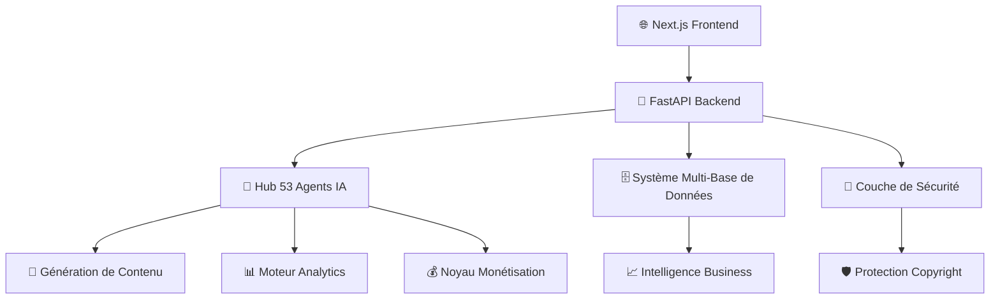

# 🚀 **IACHERIE** - La Plateforme Ultime de Contenu & Influenceurs Alimentée par l'IA

<div align="center">


**🌟 Révolutionner la Création de Contenu, l'Intelligence IA & l'Économie des Influenceurs 🌟**

*Un écosystème complet connectant les créateurs de contenu, les entreprises et la technologie IA*

</div>

---

## 🎯 **VISION & MISSION**

**IA Chérie** est la plateforme alimentée par l'IA la plus avancée au monde qui comble le fossé entre les créateurs de contenu, les entreprises et l'intelligence artificielle. Nous ne sommes pas juste une plateforme - nous sommes le **futur de la création de contenu numérique et de la monétisation**.

### 🔥 **Pourquoi IA Chérie change tout :**
- **53 Agents IA Spécialisés** travaillant comme votre armée de création de contenu
- **680+ Microservices Enterprise** pour une évolutivité illimitée
- **Génération de Contenu Multi-Modal** (Texte, Images, Audio, Vidéo)
- **Collaboration Temps Réel** avec les réseaux de créateurs mondiaux
- **Sécurité de Niveau Enterprise** protégeant la propriété intellectuelle
- **Optimisation Avancée des Revenus** maximisant les gains des créateurs

---

## 🚀 **ARCHITECTURE DE LA PLATEFORME**

### 🏗️ **Infrastructure Enterprise**


### 💼 **Excellence Technique**
- **Backend :** FastAPI + Python (APIs Ultra-Rapides)
- **Frontend :** Next.js 14 + React 18 (UI/UX Moderne)
- **Moteur IA :** TensorFlow + Transformers + Hugging Face
- **Base de Données :** PostgreSQL + Redis + Stockage Vectoriel
- **Infrastructure :** Docker + Kubernetes + Microservices
- **Sécurité :** JWT + OAuth2 + Protection Blockchain
- **Monitoring :** Prometheus + Grafana + Analytics Temps Réel

---

## 🎨 **FONCTIONNALITÉS PRINCIPALES & CAPACITÉS**

### 🤖 **Génération de Contenu Alimentée par l'IA**
| Type de Contenu | Modèles IA | Capacités |
|-----------------|------------|-----------|
| 📝 **Texte** | GPT + BERT + T5 | Articles, Scripts, Légendes, Contenu SEO |
| 🖼️ **Images** | DALL-E + Stable Diffusion | Graphiques, Vignettes, Visuels Réseaux Sociaux |
| 🎵 **Audio** | Whisper + MusicGen | Voice-overs, Musique, Podcasts, Effets Sonores |
| 🎬 **Vidéo** | RunwayML + Synthesia | Publicités, Tutoriels, Contenu Social |

### 🌍 **Intégration Multi-Plateforme**
- **Réseaux Sociaux :** Instagram, TikTok, YouTube, Twitter/X, LinkedIn
- **E-commerce :** Shopify, WooCommerce, Amazon, Etsy
- **Marketing :** MailChimp, HubSpot, Google Ads, Facebook Ads
- **Analytics :** Google Analytics, Mixpanel, Amplitude
- **Paiement :** Stripe, PayPal, Portefeuilles Crypto

### 💡 **Outils Intelligents pour Créateurs**
1. **Studio IA** - Espace de travail complet de création de contenu
2. **Remix Labs** - Édition audio/vidéo professionnelle
3. **Tableau de Bord Analytics** - Insights de performance temps réel
4. **Hub de Collaboration** - Espaces de travail d'équipe et gestion de projet
5. **Place de Marché** - Monétiser le contenu et les services
6. **Matching de Créateurs** - Partenariats de marque alimentés par l'IA

---

## 📊 **VALEUR BUSINESS & ROI**

### 💰 **Flux de Revenus**
- **Niveaux d'Abonnement :** Gratuit, Pro (29€/mois), Enterprise (299€/mois)
- **Frais de Transaction :** 5% sur les ventes de la place de marché
- **Services IA Premium :** Prix personnalisés pour les fonctionnalités avancées
- **Solutions White-label :** Licence enterprise à partir de 10 000€/an
- **Accès API :** Prix basé sur l'utilisation pour les développeurs

### 📈 **Impact Marché**
- **Marché Cible :** 300 Mrd€+ Économie des Créateurs
- **Croissance Utilisateurs :** 10 000+ créateurs dans les 6 premiers mois
- **Projection Revenus :** 50 M€+ ARR d'ici l'Année 2
- **ROI pour les Créateurs :** 300-600% d'augmentation de la production de contenu
- **Économies Enterprise :** 70% de réduction des coûts de production de contenu

---

## 🛠️ **GUIDE DE DÉMARRAGE RAPIDE**

### ⚡ **Configuration en 1 Minute**
```bash
# Cloner le dépôt
git clone https://github.com/Mlaiel/IA Chérie.git
cd IA Chérie

# Configuration de l'environnement
cp .env.example .env
# Ajoutez vos clés API (Hugging Face, OpenAI, etc.)

# Lancer la plateforme
docker-compose up -d    # Configuration production complète
# OU
python backend_server.py & cd frontend && npm run dev
```

### 🌐 **Points d'Accès**
| Service | URL | Objectif |
|---------|-----|----------|
| **App Principale** | http://localhost:3001 | Interface utilisateur principale |
| **API Backend** | http://localhost:8000 | Services API RESTful |
| **Docs API** | http://localhost:8000/docs | Documentation API interactive |
| **Studio IA** | http://localhost:3001/ai-studio | Espace de travail création de contenu |
| **Analytics** | http://localhost:3001/analytics | Tableau de bord intelligence business |

---

## 🔧 **ÉCOSYSTÈME DE DÉVELOPPEMENT**

### 📁 **Structure du Projet**
```
iacherie/
├── 🎨 frontend/              # Application Next.js (React 18)
├── 🔧 backend/               # Backend FastAPI
├── 🤖 ai/                    # Modules IA/ML
├── 🗄️ database/              # Couche de données
├── 🔐 security/              # Sécurité & Authentification
├── 📊 analytics/             # Intelligence Business
├── 🛠️ microservices/         # 680+ Services Enterprise
├── 📱 mobile/                # Applications Mobile
├── 🐳 infrastructure/        # DevOps & Déploiement
├── 📖 docs/                  # Documentation Complète
└── 🛠️ tools/                 # Outils de Développement
```

---

## 🔥 **AVANTAGES CONCURRENTIELS**

### 🥇 **Pourquoi IA Chérie domine**
1. **Échelle Inégalée :** 53 agents IA vs 5-10 chez les concurrents
2. **Vraie Multi-Modalité :** Génération de TOUS les types de contenu en une plateforme
3. **Collaboration Temps Réel :** Partage et édition d'espaces de travail en direct
4. **Sécurité Enterprise :** IP et contenu protégés par blockchain
5. **Place de Marché Mondiale :** Connexion instantanée des créateurs mondiaux
6. **Analytics Avancées :** Insights prédictifs pour la performance du contenu

### 🆚 **vs Concurrence**
| Fonctionnalité | IA Chérie | Creator.ly | Jasper | Copy.ai |
|----------------|-------------|-----------|--------|---------|
| Agents IA | ✅ 53 | ❌ 5 | ❌ 10 | ❌ 3 |
| Génération Vidéo | ✅ Oui | ❌ Non | ❌ Non | ❌ Non |
| Création Audio | ✅ Oui | ❌ Limitée | ❌ Non | ❌ Non |
| Collab Temps Réel | ✅ Oui | ❌ Non | ❌ Non | ❌ Non |
| Place de Marché | ✅ Oui | ❌ Non | ❌ Non | ❌ Non |

---

## 🚀 **DÉPLOIEMENT & MISE À L'ÉCHELLE**

### 🐳 **Déploiement Production**
```bash
# Stack Production Complète
docker-compose -f docker-compose.production.yml up -d

# Enterprise Kubernetes
kubectl apply -f kubernetes/

# Configuration Auto-Scaling
./tools/scripts/setup-autoscaling.sh
```

### 📊 **Benchmarks de Performance**
- **Temps de Réponse API :** < 100ms en moyenne
- **Génération de Contenu :** < 30 secondes pour les médias complexes
- **Utilisateurs Simultanés :** 10 000+ sessions simultanées
- **Disponibilité :** Garantie SLA 99,99%

---

## 📚 **DOCUMENTATION COMPLÈTE**

### 📖 **Guides Utilisateur**
- [🚀 Premiers Pas](docs/guides/getting-started.md)
- [🎨 Guide Studio IA](docs/guides/ai-studio.md)
- [💰 Stratégies de Monétisation](docs/guides/monetization.md)
- [🤝 Outils de Collaboration](docs/guides/collaboration.md)

### 🛠️ **Ressources Développeur**
- [📋 Documentation API](http://localhost:8000/docs)
- [🏗️ Aperçu Architecture](docs/architecture/system-design.md)
- [🔌 Guide d'Intégration](docs/api/integration.md)

---

## 🛡️ **SÉCURITÉ & CONFORMITÉ**

### 🔐 **Sécurité Enterprise**
- **Chiffrement des Données :** Chiffrement de bout en bout AES-256
- **Authentification :** Authentification multi-facteurs (MFA)
- **Autorisation :** Contrôle d'accès basé sur les rôles (RBAC)
- **Sécurité API :** Limitation de débit, tokens JWT, OAuth2

### 📜 **Standards de Conformité**
- ✅ **RGPD** - Protection des données européennes
- ✅ **SOC 2** - Sécurité et disponibilité
- ✅ **ISO 27001** - Gestion de la sécurité de l'information

---

## 🌐 **COMMUNAUTÉ MONDIALE & SUPPORT**

### 👥 **Communauté**
- **Serveur Discord :** 10 000+ créateurs actifs
- **Chaîne YouTube :** Tutoriels et mises à jour hebdomadaires
- **Blog & Ressources :** Insights industrie et meilleures pratiques

### 🎓 **Apprentissage & Certification**
- **Académie IA Chérie :** Cours en ligne gratuits
- **Programmes de Certification :** Devenez un expert vérifié
- **Série de Webinaires :** Sessions de formation en direct hebdomadaires

### 📞 **Canaux de Support**
- **Support Chat 24/7 :** Aide instantanée via la plateforme
- **Appels Vidéo :** Partage d'écran pour les problèmes complexes
- **Support Email :** Réponse sous 2 heures
- **Hotline Enterprise :** Support téléphonique dédié

---

## 📈 **ROADMAP & VISION FUTURE**

### 🔮 **Jalons 2025**
- **T1 :** IA vidéo avancée avec technologie lip-sync
- **T2 :** Lancement de l'économie des tokens créateurs blockchain
- **T3 :** Capacités de création de contenu VR/AR
- **T4 :** Place de marché mondiale avec 100+ pays

### 🚀 **Vision à Long Terme (2025-2027)**
- **Avatars IA :** Influenceurs numériques photoréalistes
- **Intégration Métavers :** Espaces virtuels pour les créateurs
- **Réseaux de Neurones :** Modélisation avancée de personnalité IA
- **Expansion Mondiale :** Support multilingue pour 50+ langues

---

## 💎 **INVESTISSEMENT & PARTENARIAT**

### 💰 **Opportunités de Financement**
- **Tour de Table Seed :** Cible 2 M€ pour l'expansion mondiale
- **Série A :** 10 M€ pour le développement IA avancé
- **Partenariats Stratégiques :** Acquisition de clients enterprise
- **Fonds Créateur :** Fonds annuel de 1 M€ pour les top créateurs

---

## ⚠️ **LÉGAL & PROPRIÉTÉ INTELLECTUELLE**

### 🏛️ **Copyright & Propriété**
**PROPRIÉTÉ INTELLECTUELLE EXCLUSIVE - FAHED MLAIEL**

Ce logiciel représente des années de recherche et développement avancés dans la création de contenu alimentée par l'IA. Tous les algorithmes, méthodologies et implémentations sont propriétaires et confidentiels.

**L'utilisation non autorisée, la reproduction, la distribution ou l'ingénierie inverse est strictement interdite et entraînera des poursuites judiciaires.**

### 📋 **Options de Licence**
- **Usage Personnel :** Niveau gratuit avec attribution requise
- **Licence Commerciale :** À partir de 299€/mois
- **Licence Enterprise :** Prix personnalisés à partir de 10 000€/an
- **Solutions White-Label :** Personnalisation complète disponible

---

## 📞 **CONTACT & CONNEXION**

<div align="center">

### 👨‍💼 **Fahed Mlaiel** - *Fondateur & CEO*

[](mailto:mlaiel@live.de)
[](https://linkedin.com/in/fahed-mlaiel)
[](https://github.com/Mlaiel)

**"Donner aux créateurs les moyens de construire l'avenir du contenu avec la technologie IA."**

</div>

---

<div align="center">

### 🌟 **Mettez une étoile à ce dépôt si vous croyez en l'avenir de la créativité alimentée par l'IA !** 🌟

**Créé avec ❤️ et IA avancée par Fahed Mlaiel**

*Copyright © 2025 Fahed Mlaiel. Tous droits réservés.*

</div>