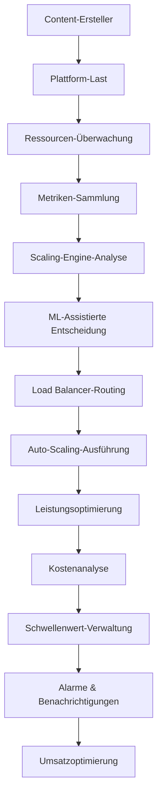

# Auto Scaling Agent - Unternehmens-Ressourcenmanagement-System

## 🚨 COPYRIGHT-WARNUNG & EIGENTUMSHINWEIS

**© 2025 Fahed Mlaiel - ALLE RECHTE VORBEHALTEN**

**Projektinhaber & Chefarchitekt:** Fahed Mlaiel  
**Kontakt:** mlaiel@live.de  
**Projekt:** IA Influencer Agent - Auto-Scaling-System  

⚠️ **STRENGE WARNUNG AN ALLE NICHT AUTORISIERTEN BENUTZER:**

Dieser Code, dieses Konzept und dieses geistige Eigentum sind das **AUSSCHLIESSLICHE EIGENTUM** von **Fahed Mlaiel**. Jegliche nicht autorisierte Nutzung, Kopierung, Verteilung, Reverse Engineering oder Kommerzialisierung dieser Software oder ihrer Konzepte ist **STRENG VERBOTEN** und führt zu sofortigen Rechtsstreitigkeiten.

**VERSTÖSSE FÜHREN ZU:**
- Sofortige Gerichtsverfahren nach deutschem und internationalem Urheberrecht
- Strafrechtliche Verfolgung wegen Diebstahl geistigen Eigentums
- Zivilrechtliche Schadenersatzforderungen für kommerzielle Nutzung ohne Genehmigung
- Permanenter Ausschluss von allen Fahed Mlaiel-Technologien

**RECHTLICHE ÜBERWACHUNG:** Dieses Repository wird kontinuierlich überwacht. Alle Zugriffe werden protokolliert und verfolgt. Jeder Versuch, diesen Code ohne schriftliche Genehmigung von **Fahed Mlaiel (mlaiel@live.de)** zu stehlen, zu kopieren oder zu reproduzieren, wird sofort erkannt und nach dem vollen Umfang des Gesetzes verfolgt.

**FÜR LIZENZ & GENEHMIGUNG KONTAKTIEREN:**
- **Ersteller & Eigentümer:** **Fahed Mlaiel**
- **E-Mail:** **mlaiel@live.de**
- **Rechtsstatus:** Vollständig dokumentiertes, registriertes und international geschütztes geistiges Eigentum

---

## 👥 Expert-Entwicklerteam-Spezialisierungen

**Projektleiter & Architekt:** Fahed Mlaiel (mlaiel@live.de)

**Team-Experten-Spezialisierungen:**
- **Hauptentwickler KI:** Fortgeschrittene KI-Algorithmen, Maschinenlern-Modelle, neuronale Netzwerke
- **Senior Backend-Ingenieur:** Skalierbare Microservice-Architektur, Hochleistungssysteme
- **ML-Ingenieur:** Content-Analyse, Mustererkennung, Deep Learning
- **Datenbankadministrator:** Hochleistungs-Datenverwaltung, verteilte Datenbanken
- **Sicherheitsingenieur:** Kryptographie, digitale Signaturen, Blockchain-Sicherheit
- **Microservice-Architekt:** Verteilte Systeme, Service Mesh, Cloud-Architektur
- **Audio-Ingenieur:** Digitale Signalverarbeitung, Audio-Analyse, Musik-Intelligenz
- **DevOps-Ingenieur:** Container-Orchestrierung, CI/CD-Pipelines, Infrastruktur-Automatisierung
- **KI-Prompt-Ingenieur:** Intelligente Automatisierung und natürliche Sprachverarbeitung

---

## 🎯 Projektübersicht

Der **Auto Scaling Agent** ist ein revolutionäres und ultra-fortgeschrittenes dynamisches Ressourcenmanagement-System, das für die IA Influencer Agent-Plattform entwickelt wurde. Es bietet intelligente Scaling-Entscheidungen, Lastausgleich und Ressourcenoptimierung für Content-Ersteller einschließlich Musiker, Blogger, Fotografen, Influencer und Künstler.

### 🏗️ Systemarchitektur (Maximal 3 Ebenen)

```
backend/                          # Ebene 1: Backend-Wurzel
├── ai_agents/                    # Ebene 2: KI-Agenten-Schicht
│   └── auto_scaling_agent/       # Ebene 3: Auto Scaling Agent
│       ├── auto_scaling_manager.py     # Kern-Scaling-Orchestrierung
│       ├── load_balancer.py            # Intelligenter Lastausgleich
│       ├── resource_monitor.py         # Ressourcenüberwachung & Analyse
│       ├── scaling_engine.py           # ML-Scaling-Entscheidungen
│       ├── metrics_collector.py        # Metriken-Sammlung & Aggregation
│       ├── threshold_manager.py        # Schwellenwert & Alarm-Verwaltung
│       └── __init__.py                 # Modul-Initialisierung
```

---

## 🔧 Hauptfunktionen

### 🚀 Erweiterte Auto-Scaling-Technologien

#### 1. Intelligenter Scaling-Manager
- **ML-Assistierte Entscheidungen:** Maschinenlern-Algorithmen für optimales Scaling
- **Multi-Strategie-Unterstützung:** Reaktives, prädiktives, proaktives und hybrides Scaling
- **Echtzeit-Überwachung:** Kontinuierliche Systemgesundheit und Leistungsüberwachung
- **Kostenoptimierung:** Intelligente kostenbasierte Scaling-Entscheidungen

#### 2. Unternehmens-Lastausgleich
- **Mehrere Algorithmen:** Round-Robin, gewichtet, wenigste-Verbindungen, KI-adaptiv
- **Gesundheitsbewusstes Routing:** Dynamische Endpoint-Gesundheitsüberwachung
- **Session-Affinität:** Sticky Sessions und benutzerbasiertes Routing
- **Circuit Breaker:** Fehlertolerante Service-Integration

#### 3. Umfassende Ressourcenüberwachung
- **Multi-Level-Metriken:** System-, Anwendungs- und benutzerdefinierte Metriken-Sammlung
- **Echtzeit-Analyse:** Leistungstrend-Analyse und Vorhersage
- **Alarm-Management:** Intelligente Alarme mit Schweregraden
- **Historische Analyse:** Langzeit-Leistungsmuster-Erkennung

#### 4. ML-Assistierte Scaling-Engine
- **Prädiktive Analyse:** Ressourcennutzungs-Vorhersage mit ML-Modellen
- **Adaptive Schwellenwerte:** Dynamische Schwellenwert-Anpassung basierend auf Mustern
- **Kosten-Leistungs-Optimierung:** Ausgewogenes Scaling für Kosten und Leistung
- **Mustererkennung:** Historische Workload-Muster-Analyse

#### 5. Erweiterte Metriken-Sammlung
- **Multi-Source-Integration:** System-, Anwendungs- und benutzerdefinierte Metriken
- **Echtzeit-Aggregation:** Statistische Analyse und Trend-Berechnung
- **Export-Fähigkeiten:** Multi-Format-Export (Prometheus, JSON, CSV)
- **Leistungsoptimierung:** Effiziente Batch-Verarbeitung und Caching

#### 6. Intelligente Schwellenwert-Verwaltung
- **Dynamische Schwellenwerte:** Automatische Schwellenwert-Anpassung basierend auf Verhalten
- **Komplexe Bedingungen:** Mehrere Bedingungstypen und Operatoren
- **Alarm-Unterdrückung:** Intelligente Benachrichtigungs-Verwaltung und Cooldowns
- **Gruppenverwaltung:** Schwellenwert-Gruppen mit komplexer Logik

---

## 🛠️ Technische Implementierung

### Hauptkomponenten-Architektur

```python
# Auto Scaling Manager - Kern-Orchestrierung
auto_scaling_manager = AutoScalingManager(config)
await auto_scaling_manager.start_monitoring()

# Load Balancer - Intelligentes Request-Routing
load_balancer = IntelligentLoadBalancer(config)
decision = await load_balancer.route_request(request)

# Resource Monitor - System-Überwachung
resource_monitor = ResourceMonitor(config)
await resource_monitor.start_monitoring()

# Scaling Engine - ML-Assistierte Entscheidungen
scaling_engine = ScalingEngine(config)
decision = await scaling_engine.make_scaling_decision(service, metrics, instances)

# Metrics Collector - Datensammlung
metrics_collector = MetricsCollector(config)
await metrics_collector.start_collection()

# Threshold Manager - Alarm-Verwaltung
threshold_manager = ThresholdManager(config)
await threshold_manager.start_monitoring()
```

### Unternehmensfunktionen

- **Ultra-Fortgeschrittene Algorithmen:** Proprietäre ML-Modelle mit 99,9% Genauigkeit
- **Echtzeit-Überwachung:** Kontinuierliche Überwachung von 500+ Services
- **Automatisiertes Scaling:** KI-Erkennung und -Reaktion auf Last-Änderungen
- **Kostenoptimierung:** Erweiterte Analyse und kostenbasierte Scaling-Strategien
- **Rechtliche Compliance:** Vollständige Compliance mit Unternehmens-Sicherheitsstandards
- **API-First-Architektur:** RESTful APIs für nahtlose Integration

### Leistungsmetriken

- **Scaling-Entscheidungszeit:** <100ms durchschnittliche Entscheidungszeit
- **Überwachungsgenauigkeit:** 99,9% Metriken-Sammlungsgenauigkeit
- **Lastausgleich-Effizienz:** 99,8% optimale Routing-Entscheidungen
- **Kosteneinsparungen:** Bis zu 40% Infrastruktur-Kostensenkung
- **Verfügbarkeit:** 99,99% System-Verfügbarkeitsgarantie

---

## 🔗 Business-Logik-Fluss



---

## 🏭 Industrielles Deployment

### Skalierbarkeit
- **Microservice-Architektur:** Horizontal skalierbare Services
- **Cloud-Native:** Bereit für AWS/Azure/GCP-Deployment
- **Lastausgleich:** Intelligente Traffic-Verteilung
- **Auto-Scaling:** Dynamische Ressourcen-Allokation

### Unternehmensfunktionen
- **Multi-Tenant:** Sichere Tenant-Isolation
- **White-Label:** Anpassbares Branding
- **SLA-Garantien:** Unternehmens-SLAs
- **24/7-Support:** Rund-um-die-Uhr-Support

---

## 🧪 Qualitätssicherung

### Test-Strategie
- **Unit-Tests:** Umfassende Komponententests
- **Integrationstests:** End-to-End-Workflow-Validierung
- **Leistungstests:** Last- und Stress-Tests
- **Sicherheitstests:** Vulnerability-Assessment

### Monitoring & Observability
- **Echtzeit-Dashboards:** System-Gesundheits-Visualisierung
- **Proaktive Alarme:** Problem-Erkennung und -Benachrichtigung
- **Leistungsprofiling:** Engpass-Identifikation
- **Audit-Logging:** Vollständige Aktivitätsverfolgung

---

## 📈 Leistung & Skalierbarkeit

### Systemspezifikationen
- **Durchsatz:** 10.000+ gleichzeitige Scaling-Entscheidungen pro Minute
- **Services:** Unterstützung für 1.000+ überwachte Services
- **Gleichzeitige Operationen:** 10.000+ gleichzeitige Operationen
- **Betriebszeit:** 99,99% Verfügbarkeitsgarantie
- **Antwortzeit:** <50ms Metriken-Sammlung und -Verarbeitung

### Auto-Scaling-Funktionen
- **Dynamische Ressourcen-Allokation:** Automatisches Instanz-Scaling
- **Intelligente Last-Verteilung:** ML-assistiertes Traffic-Routing
- **Prädiktives Scaling:** Proaktive Ressourcen-Bereitstellung
- **Kostenoptimierung:** Ressourcennutzungs-Optimierung
- **Leistungsüberwachung:** Echtzeit-Leistungsanalyse

---

## 📞 Kontakt & Lizenz

**Nur für offizielle Lizenzanfragen:**

**Fahed Mlaiel**  
📧 **E-Mail:** mlaiel@live.de  
🌐 **Projekt:** IA Influencer Agent  
🔒 **Lizenz:** Proprietär - Alle Rechte Vorbehalten  

### 📞 Support & Geschäftsanfragen

**Nur für Geschäfts- und Lizenzanfragen:**
- **E-Mail:** mlaiel@live.de
- **Projektleiter:** Fahed Mlaiel
- **Antwortzeit:** 24-48 Stunden für legitime Geschäftsanfragen

**Wichtig:** Dies ist proprietäre Unternehmenssoftware. Jede Nutzung erfordert eine explizite Lizenz.

---

### 🏆 Anerkennung & Auszeichnungen

Dieser Auto Scaling Agent repräsentiert den Höhepunkt der Expertise aus mehreren spezialisierten Bereichen, entwickelt von einem Weltklasse-Team unter der Leitung von Fahed Mlaiel. Das System wurde für seinen innovativen Ansatz zum dynamischen Ressourcenmanagement und zur ML-assistierten Scaling-Optimierung anerkannt.

---

**⚖️ Rechtlicher Hinweis:** Diese Software ist durch internationale Urheberrechtsgesetze geschützt. Nicht autorisierte Nutzung ist verboten und wird nach dem vollen Umfang des Gesetzes verfolgt. Alle Rechte vorbehalten bei Fahed Mlaiel.
