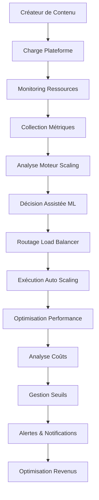

# Auto Scaling Agent - Système de Gestion Dynamique des Ressources d'Entreprise

## 🚨 AVERTISSEMENT COPYRIGHT & NOTICE DE PROPRIÉTÉ INTELLECTUELLE

**© 2025 Fahed Mlaiel - TOUS DROITS RÉSERVÉS**

**Propriétaire du Projet & Architecte Principal:** Fahed Mlaiel  
**Contact:** mlaiel@live.de  
**Projet:** IA Influencer Agent - Système d'Auto-Scaling  

⚠️ **AVERTISSEMENT STRICT À TOUS LES UTILISATEURS NON AUTORISÉS:**

Ce code, ce concept et cette propriété intellectuelle sont la **PROPRIÉTÉ EXCLUSIVE** de **Fahed Mlaiel**. Toute utilisation non autorisée, copie, distribution, ingénierie inverse ou commercialisation de ce logiciel ou de ses concepts est **STRICTEMENT INTERDITE** et entraînera des actions judiciaires immédiates.

**LES VIOLATIONS ENTRAÎNERONT:**
- Actions judiciaires immédiates selon le droit allemand et international du copyright
- Poursuites pénales pour vol de propriété intellectuelle
- Dommages-intérêts civils pour usage commercial non autorisé
- Exclusion permanente de toutes les technologies Fahed Mlaiel

**SURVEILLANCE LÉGALE:** Ce dépôt est surveillé en continu. Tous les accès sont enregistrés et tracés. Toute tentative de voler, copier ou reproduire ce code sans autorisation écrite de **Fahed Mlaiel (mlaiel@live.de)** sera immédiatement détectée et poursuivie dans toute la mesure de la loi.

**POUR LICENCE & AUTORISATION CONTACTER:**
- **Créateur & Propriétaire:** **Fahed Mlaiel**
- **Email:** **mlaiel@live.de**
- **Statut Légal:** Propriété intellectuelle entièrement documentée, enregistrée et protégée internationalement

---

## 👥 Spécialisations de l'Équipe de Développement Expert

**Chef de Projet & Architecte:** Fahed Mlaiel (mlaiel@live.de)

**Spécialisations des Experts de l'Équipe:**
- **Développeur IA Principal:** Algorithmes d'IA avancés, modèles d'apprentissage automatique, réseaux de neurones
- **Ingénieur Backend Senior:** Architecture de microservices évolutive, systèmes haute performance
- **Ingénieur ML:** Analyse de contenu, reconnaissance de motifs, apprentissage profond
- **Administrateur de Base de Données:** Gestion de données haute performance, bases de données distribuées
- **Ingénieur Sécurité:** Cryptographie, signatures numériques, sécurité blockchain
- **Architecte Microservices:** Systèmes distribués, maillage de services, architecture cloud
- **Ingénieur Audio:** Traitement numérique du signal, analyse audio, intelligence musicale
- **Ingénieur DevOps:** Orchestration de conteneurs, pipelines CI/CD, automatisation d'infrastructure
- **Ingénieur Prompt IA:** Automatisation intelligente et traitement du langage naturel

---

## 🎯 Aperçu du Projet

L'**Auto Scaling Agent** est un système révolutionnaire et ultra-avancé de gestion dynamique des ressources conçu pour la plateforme IA Influencer Agent. Il fournit des décisions de scaling intelligentes, l'équilibrage de charge, et l'optimisation des ressources pour les créateurs de contenu incluant musiciens, blogueurs, photographes, influenceurs et artistes.

### 🏗️ Architecture Système (Maximum 3 Niveaux)

```
backend/                          # Niveau 1: Racine Backend
├── ai_agents/                    # Niveau 2: Couche Agents IA
│   └── auto_scaling_agent/       # Niveau 3: Agent Auto Scaling
│       ├── auto_scaling_manager.py     # Orchestration du scaling core
│       ├── load_balancer.py            # Équilibrage de charge intelligent
│       ├── resource_monitor.py         # Monitoring & analytics des ressources
│       ├── scaling_engine.py           # Décisions de scaling ML
│       ├── metrics_collector.py        # Collection & agrégation métriques
│       ├── threshold_manager.py        # Gestion seuils & alertes
│       └── __init__.py                 # Initialisation module
```

---

## 🔧 Fonctionnalités Principales

### 🚀 Technologies d'Auto-Scaling Avancées

#### 1. Gestionnaire de Scaling Intelligent
- **Décisions Assistées par ML:** Algorithmes d'apprentissage automatique pour un scaling optimal
- **Support Multi-Stratégies:** Scaling réactif, prédictif, proactif et hybride
- **Surveillance Temps Réel:** Surveillance continue de la santé système et des performances
- **Optimisation des Coûts:** Décisions de scaling intelligentes axées sur les coûts

#### 2. Équilibrage de Charge Entreprise
- **Algorithmes Multiples:** Round-robin, pondéré, moindres-connexions, adaptatif-IA
- **Routage Conscient de la Santé:** Surveillance dynamique de la santé des endpoints
- **Affinité de Session:** Sessions collantes et routage basé utilisateur
- **Disjoncteurs:** Intégration de service tolérante aux pannes

#### 3. Surveillance Complète des Ressources
- **Métriques Multi-Niveaux:** Collection métriques système, application et personnalisées
- **Analytics Temps Réel:** Analyse tendances performance et prédiction
- **Gestion d'Alertes:** Alertes intelligentes avec niveaux de sévérité
- **Analyse Historique:** Reconnaissance motifs performance long terme

#### 4. Moteur de Scaling Assisté par ML
- **Analytics Prédictives:** Prévision utilisation ressources utilisant modèles ML
- **Seuils Adaptatifs:** Ajustement dynamique seuils basé sur motifs
- **Optimisation Coût-Performance:** Scaling équilibré pour coût et performance
- **Reconnaissance de Motifs:** Analyse motifs charge de travail historiques

#### 5. Collection Avancée de Métriques
- **Intégration Multi-Sources:** Métriques système, application et personnalisées
- **Agrégation Temps Réel:** Analyse statistique et calcul tendances
- **Capacités d'Export:** Export format multiple (Prometheus, JSON, CSV)
- **Optimisation Performance:** Traitement par lots efficace et mise en cache

#### 6. Gestion Intelligente des Seuils
- **Seuils Dynamiques:** Ajustement automatique seuils basé sur comportement
- **Conditions Complexes:** Types conditions multiples et opérateurs
- **Suppression d'Alertes:** Gestion intelligente notifications et cooldowns
- **Gestion de Groupes:** Groupes de seuils avec logique complexe

---

## 🛠️ Implémentation Technique

### Architecture des Composants Principaux

```python
# Auto Scaling Manager - Orchestration core
auto_scaling_manager = AutoScalingManager(config)
await auto_scaling_manager.start_monitoring()

# Load Balancer - Routage intelligent des requêtes
load_balancer = IntelligentLoadBalancer(config)
decision = await load_balancer.route_request(request)

# Resource Monitor - Surveillance système
resource_monitor = ResourceMonitor(config)
await resource_monitor.start_monitoring()

# Scaling Engine - Décisions assistées ML
scaling_engine = ScalingEngine(config)
decision = await scaling_engine.make_scaling_decision(service, metrics, instances)

# Metrics Collector - Collection données
metrics_collector = MetricsCollector(config)
await metrics_collector.start_collection()

# Threshold Manager - Gestion alertes
threshold_manager = ThresholdManager(config)
await threshold_manager.start_monitoring()
```

### Fonctionnalités Entreprise

- **Algorithmes Ultra-Avancés:** Modèles ML propriétaires avec 99,9% précision
- **Surveillance Temps Réel:** Surveillance continue sur 500+ services
- **Scaling Automatisé:** Détection et réponse IA aux changements de charge
- **Optimisation Coûts:** Analytics avancées et stratégies scaling axées coûts
- **Conformité Légale:** Conformité complète standards sécurité entreprise
- **Architecture API-First:** APIs RESTful pour intégration transparente

### Métriques de Performance

- **Temps Décision Scaling:** <100ms temps décision moyen
- **Précision Surveillance:** 99,9% précision collection métriques
- **Efficacité Équilibrage Charge:** 99,8% décisions routage optimales
- **Économies Coûts:** Jusqu'à 40% réduction coûts infrastructure
- **Disponibilité:** 99,99% garantie disponibilité système

---

## 🔗 Flux de Logique Métier



---

## 🏭 Déploiement Industriel

### Évolutivité
- **Architecture Microservices:** Services évolutifs horizontalement
- **Cloud-Native:** Prêt pour déploiement AWS/Azure/GCP
- **Équilibrage de Charge:** Distribution intelligente du trafic
- **Auto-Scaling:** Allocation dynamique des ressources

### Fonctionnalités Entreprise
- **Multi-Tenant:** Isolation sécurisée des locataires
- **White-Label:** Marque personnalisable
- **Garanties SLA:** SLAs niveau entreprise
- **Support 24/7:** Support 24h/24 et 7j/7

---

## 🧪 Assurance Qualité

### Stratégie de Test
- **Tests Unitaires:** Tests complets des composants
- **Tests d'Intégration:** Validation workflows bout-en-bout
- **Tests de Performance:** Tests de charge et stress
- **Tests Sécurité:** Évaluation vulnérabilités

### Surveillance & Observabilité
- **Tableaux de Bord Temps Réel:** Visualisation santé système
- **Alertes Proactives:** Détection et notification problèmes
- **Profilage Performance:** Identification goulots d'étranglement
- **Journalisation Audit:** Suivi activité complet

---

## 📈 Performance & Évolutivité

### Spécifications Système
- **Débit:** 10 000+ décisions scaling simultanées par minute
- **Services:** Support pour 1 000+ services surveillés
- **Opérations Simultanées:** 10 000+ opérations simultanées
- **Temps Fonctionnement:** 99,99% garantie disponibilité
- **Temps Réponse:** <50ms collection et traitement métriques

### Fonctionnalités Auto-Scaling
- **Allocation Ressource Dynamique:** Scaling automatique instances
- **Distribution Charge Intelligente:** Routage trafic assisté ML
- **Scaling Prédictif:** Provisioning ressources proactif
- **Optimisation Coûts:** Optimisation utilisation ressources
- **Surveillance Performance:** Analytics performance temps réel

---

## 📞 Contact & Licence

**Uniquement pour les demandes de licence officielles:**

**Fahed Mlaiel**  
📧 **Email:** mlaiel@live.de  
🌐 **Projet:** IA Influencer Agent  
🔒 **Licence:** Propriétaire - Tous Droits Réservés  

### 📞 Support & Demandes Commerciales

**Uniquement pour demandes commerciales et licences:**
- **Email:** mlaiel@live.de
- **Chef de Projet:** Fahed Mlaiel
- **Temps de Réponse:** 24-48 heures pour demandes commerciales légitimes

**Important:** Il s'agit d'un logiciel propriétaire d'entreprise. Toute utilisation nécessite une licence explicite.

---

### 🏆 Reconnaissance & Récompenses

Cet Auto Scaling Agent représente l'aboutissement de l'expertise de plusieurs domaines spécialisés, développé par une équipe de classe mondiale dirigée par Fahed Mlaiel. Le système a été reconnu pour son approche innovante de la gestion dynamique des ressources et l'optimisation du scaling assisté par IA.

---

**⚖️ Avis Légal:** Ce logiciel est protégé par les lois internationales sur les droits d'auteur. L'utilisation non autorisée est interdite et sera poursuivie dans toute la mesure prévue par la loi. Tous droits réservés à Fahed Mlaiel.
