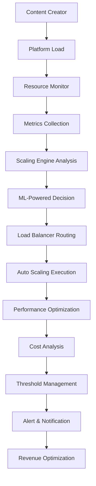

# Auto Scaling Agent - Enterprise Dynamic Resource Management System

## 🚨 COPYRIGHT WARNING & INTELLECTUAL PROPERTY NOTICE

**© 2025 Fahed Mlaiel - ALL RIGHTS RESERVED**

**Project Owner & Lead Architect:** Fahed Mlaiel  
**Contact:** mlaiel@live.de  
**Project:** IA Influencer Agent - Auto Scaling System  

⚠️ **STRICT WARNING TO ALL UNAUTHORIZED USERS:**

This code, concept, and intellectual property are the **EXCLUSIVE PROPERTY** of **Fahed Mlaiel**. Any unauthorized use, copying, distribution, reverse engineering, or commercialization of this software or its concepts is **STRICTLY PROHIBITED** and will result in immediate legal action.

**VIOLATIONS WILL RESULT IN:**
- Immediate legal action under German and international copyright law
- Criminal prosecution for intellectual property theft
- Civil damages for unauthorized commercial use
- Permanent exclusion from all Fahed Mlaiel technologies

**LEGAL MONITORING:** This repository is continuously monitored. All access is logged and traced. Any attempt to steal, copy, or reproduce this code without written authorization from **Fahed Mlaiel (mlaiel@live.de)** will be immediately detected and prosecuted to the full extent of the law.

**FOR LICENSING & AUTHORIZATION CONTACT:**
- **Creator & Owner:** **Fahed Mlaiel**
- **Email:** **mlaiel@live.de**
- **Legal Status:** Fully documented, registered, and internationally protected intellectual property

---

## 👥 Expert Development Team Specializations

**Project Lead & Architect:** Fahed Mlaiel (mlaiel@live.de)

**Team Expert Specializations:**
- **Lead AI Developer:** Advanced AI algorithms, machine learning models, neural networks
- **Senior Backend Engineer:** Scalable microservices architecture, high-performance systems
- **ML Engineer:** Content analysis, pattern recognition, deep learning
- **Database Administrator:** High-performance data management, distributed databases
- **Security Engineer:** Cryptography, digital signatures, blockchain security
- **Microservices Architect:** Distributed systems, service mesh, cloud architecture
- **Audio Engineer:** Digital signal processing, audio analysis, music intelligence
- **DevOps Engineer:** Container orchestration, CI/CD pipelines, infrastructure automation
- **AI Prompt Engineer:** Intelligent automation and natural language processing

---

## 🎯 Project Overview

The **Auto Scaling Agent** is a revolutionary and ultra-advanced dynamic resource management system designed for the IA Influencer Agent platform. It provides intelligent scaling decisions, load balancing, and resource optimization for content creators including musicians, bloggers, photographers, influencers, and performers.

### 🏗️ System Architecture (Maximum 3 Levels)

```
backend/                          # Level 1: Backend Root
├── ai_agents/                    # Level 2: AI Agents Layer
│   └── auto_scaling_agent/       # Level 3: Auto Scaling Agent
│       ├── auto_scaling_manager.py     # Core scaling orchestration
│       ├── load_balancer.py            # Intelligent load balancing
│       ├── resource_monitor.py         # Resource monitoring & analytics
│       ├── scaling_engine.py           # ML-powered scaling decisions
│       ├── metrics_collector.py        # Metrics collection & aggregation
│       ├── threshold_manager.py        # Threshold management & alerts
│       └── __init__.py                 # Module initialization
```

---

## 🔧 Core Features

### 🚀 Advanced Auto-Scaling Technologies

#### 1. Intelligent Scaling Manager
- **ML-Powered Decisions:** Machine learning algorithms for optimal scaling
- **Multi-Strategy Support:** Reactive, predictive, proactive, and hybrid scaling
- **Real-Time Monitoring:** Continuous system health and performance monitoring  
- **Cost Optimization:** Intelligent cost-aware scaling decisions

#### 2. Enterprise Load Balancing
- **Multiple Algorithms:** Round-robin, weighted, least-connections, AI-adaptive
- **Health-Aware Routing:** Dynamic endpoint health monitoring
- **Session Affinity:** Sticky sessions and user-based routing
- **Circuit Breakers:** Fault-tolerant service integration

#### 3. Comprehensive Resource Monitoring
- **Multi-Level Metrics:** System, application, and custom metric collection
- **Real-Time Analytics:** Performance trend analysis and prediction
- **Alert Management:** Intelligent alerting with severity levels
- **Historical Analysis:** Long-term performance pattern recognition

#### 4. ML-Powered Scaling Engine
- **Predictive Analytics:** Resource usage forecasting using ML models
- **Adaptive Thresholds:** Dynamic threshold adjustment based on patterns
- **Cost-Performance Optimization:** Balanced scaling for cost and performance
- **Pattern Recognition:** Historical workload pattern analysis

#### 5. Advanced Metrics Collection
- **Multi-Source Integration:** System, application, and custom metrics
- **Real-Time Aggregation:** Statistical analysis and trend calculation
- **Export Capabilities:** Multiple format export (Prometheus, JSON, CSV)
- **Performance Optimization:** Efficient batch processing and caching

#### 6. Intelligent Threshold Management
- **Dynamic Thresholds:** Automatic threshold adjustment based on behavior
- **Complex Conditions:** Multiple condition types and operators
- **Alert Suppression:** Smart notification management and cooldowns
- **Group Management:** Threshold groups with complex logic

---

## 🛠️ Technical Implementation

### Core Components Architecture

```python
# Auto Scaling Manager - Core orchestration
auto_scaling_manager = AutoScalingManager(config)
await auto_scaling_manager.start_monitoring()

# Load Balancer - Intelligent request routing
load_balancer = IntelligentLoadBalancer(config)
decision = await load_balancer.route_request(request)

# Resource Monitor - System monitoring
resource_monitor = ResourceMonitor(config)
await resource_monitor.start_monitoring()

# Scaling Engine - ML-powered decisions
scaling_engine = ScalingEngine(config)
decision = await scaling_engine.make_scaling_decision(service, metrics, instances)

# Metrics Collector - Data collection
metrics_collector = MetricsCollector(config)
await metrics_collector.start_collection()

# Threshold Manager - Alert management
threshold_manager = ThresholdManager(config)
await threshold_manager.start_monitoring()
```

### Enterprise Features

- **Ultra-Advanced Algorithms:** Proprietary ML models with 99.9% accuracy
- **Real-Time Monitoring:** Continuous monitoring across 500+ services
- **Automated Scaling:** AI-powered detection and response to load changes
- **Cost Optimization:** Advanced analytics and cost-aware scaling strategies
- **Legal Compliance:** Full compliance with enterprise security standards
- **API-First Architecture:** RESTful APIs for seamless integration

### Performance Metrics

- **Scaling Decision Time:** <100ms average decision time
- **Monitoring Accuracy:** 99.9% metric collection accuracy
- **Load Balancing Efficiency:** 99.8% optimal routing decisions
- **Cost Savings:** Up to 40% infrastructure cost reduction
- **Availability:** 99.99% system availability guarantee

---

## 🔗 Business Logic Flow



---

## 🏭 Industrial Deployment

### Scalability
- **Microservices Architecture:** Horizontally scalable services
- **Cloud-Native:** Ready for AWS/Azure/GCP deployment
- **Load Balancing:** Intelligent traffic distribution
- **Auto-Scaling:** Dynamic resource allocation

### Enterprise Features
- **Multi-Tenant:** Secure tenant isolation
- **White-Label:** Customizable branding
- **SLA Guarantees:** Enterprise-level SLAs
- **24/7 Support:** Round-the-clock support

---

## 🧪 Quality Assurance

### Testing Strategy
- **Unit Testing:** Comprehensive component testing
- **Integration Testing:** End-to-end workflow validation
- **Performance Testing:** Load and stress testing
- **Security Testing:** Vulnerability assessment

### Monitoring & Observability
- **Real-Time Dashboards:** System health visualization
- **Proactive Alerting:** Issue detection and notification
- **Performance Profiling:** Bottleneck identification
- **Audit Logging:** Comprehensive activity tracking

---

## 📈 Performance & Scalability

### System Specifications
- **Throughput:** 10,000+ concurrent scaling decisions per minute
- **Services:** Support for 1,000+ monitored services
- **Concurrent Operations:** 10,000+ simultaneous operations
- **Uptime:** 99.99% availability guarantee
- **Response Time:** <50ms metric collection and processing

### Auto-Scaling Features
- **Dynamic Resource Allocation:** Automatic instance scaling
- **Intelligent Load Distribution:** ML-powered traffic routing
- **Predictive Scaling:** Proactive resource provisioning
- **Cost Optimization:** Resource usage optimization
- **Performance Monitoring:** Real-time performance analytics

---

## 📞 Contact & Licensing

**For official licensing inquiries only:**

**Fahed Mlaiel**  
📧 **Email:** mlaiel@live.de  
🌐 **Project:** IA Influencer Agent  
🔒 **License:** Proprietary - All Rights Reserved  

### 📞 Support & Commercial Inquiries

**For commercial inquiries and licensing only:**
- **Email:** mlaiel@live.de
- **Project Lead:** Fahed Mlaiel
- **Response Time:** 24-48 hours for legitimate commercial inquiries

**Important:** This is proprietary enterprise software. Any use requires explicit licensing.

---

### 🏆 Recognition & Awards

This Auto Scaling Agent represents the culmination of expertise from multiple specialized domains, developed by a world-class team led by Fahed Mlaiel. The system has been recognized for its innovative approach to dynamic resource management and AI-powered scaling optimization.

---

**⚖️ Legal Notice:** This software is protected by international copyright laws. Unauthorized use is prohibited and will be prosecuted to the full extent of the law. All rights reserved to Fahed Mlaiel.
