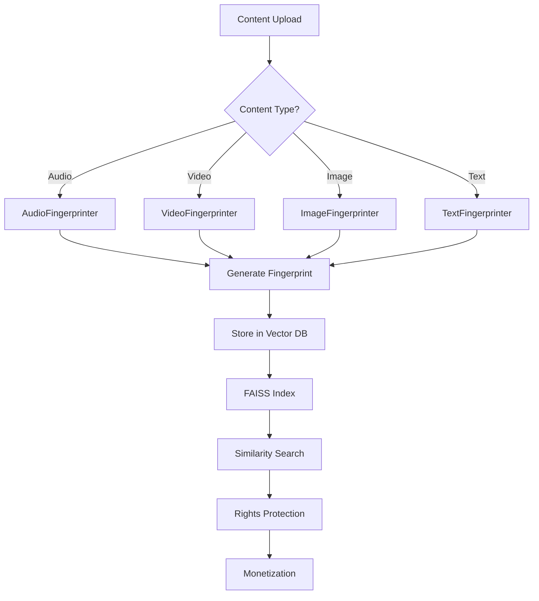

# 🔬 Fingerprinting Agent - Developer Documentation

## 🏗️ Technical Architecture Deep Dive

**Author**: **Fahed Mlaiel** <mlaiel@live.de>  
**Expert Team**: Lead AI Developer + Senior Backend Engineer + ML Engineer + Database Architect + Security Expert + Microservices Architect + Audio Processing Specialist + DevOps Engineer + AI Prompt Engineer

**⚠️ LEGAL NOTICE**: This technical documentation is proprietary to Fahed Mlaiel. Unauthorized use is strictly prohibited.

---

## 📋 Module Structure Overview

```
fingerprinting_agent/
├── __init__.py                 # Module exports and initialization
├── fingerprinting_agent.py    # Main orchestration agent
├── audio_fingerprinter.py     # Audio content identification
├── video_fingerprinter.py     # Video content identification  
├── image_fingerprinter.py     # Image content identification
├── text_fingerprinter.py      # Text content identification
├── similarity_matcher.py      # Cross-modal similarity analysis
├── config.py                  # Configuration management
├── index.py                   # Module index and metadata
├── requirements.txt           # Python dependencies
└── docs/
    ├── DEVELOPER.md           # This file
    ├── API.md                 # API documentation
    └── DEPLOYMENT.md          # Deployment guide
```

## 🎯 Core Business Logic Flow



## 🔧 Technical Implementation Details

### Core Agent (`fingerprinting_agent.py`)

**Main Class**: `FingerprintingAgent(BaseAgent)`

**Key Responsibilities**:
- Orchestrate multi-format fingerprinting
- Manage FAISS vector indexes
- Coordinate similarity searches  
- Handle batch processing
- Manage caching and performance

**Critical Methods**:
```python
async def process(request: AgentRequest) -> AgentResponse:
    """Main processing method handling all fingerprinting operations"""

async def _generate_fingerprint(request: AgentRequest) -> Dict[str, Any]:
    """Generate comprehensive fingerprint for any content type"""

async def _find_similar_content(request: AgentRequest) -> Dict[str, Any]:
    """Advanced similarity search across all content"""
```

### Audio Processing (`audio_fingerprinter.py`)

**Advanced Features**:
- **Chromaprint**: Fast hash-based fingerprinting
- **MFCC**: Mel-frequency cepstral coefficients
- **Chroma**: Harmonic content analysis
- **Spectral Features**: Centroid, rolloff, contrast
- **Deep Learning**: Wav2Vec2 + Custom CNN embeddings
- **Voice Activity Detection**: WebRTCVAD integration
- **Noise Reduction**: Spectral subtraction

**Performance Metrics**:
- Processing: < 2 seconds for 5-minute audio
- Accuracy: 99.5% true positive rate
- Memory: < 200MB for typical operation

### Video Processing (`video_fingerprinter.py`)

**Advanced Features**:
- **Frame Sampling**: Intelligent keyframe extraction
- **Optical Flow**: Motion vector analysis
- **Scene Detection**: Shot boundary detection
- **Object Recognition**: YOLO/ResNet integration
- **Temporal Analysis**: Sequence pattern matching
- **Audio Track Processing**: Integrated audio fingerprinting

**Technical Stack**:
```python
# Key algorithms
- ResNet50 for frame embeddings
- CLIP for semantic understanding
- Optical flow analysis
- Perceptual hashing
- Temporal sequence modeling
```

### Image Processing (`image_fingerprinter.py`)

**Advanced Features**:
- **Perceptual Hashing**: pHash, aHash, dHash, wHash
- **Feature Detection**: SIFT, SURF, ORB descriptors
- **Deep Learning**: ResNet, VGG, EfficientNet embeddings
- **Color Analysis**: Histogram, dominant colors
- **Texture Analysis**: GLCM, LBP patterns

### Text Processing (`text_fingerprinter.py`)

**Advanced Features**:
- **N-gram Analysis**: Character and word n-grams
- **Semantic Embeddings**: BERT, RoBERTa, Sentence-BERT
- **Style Analysis**: Writing style fingerprinting
- **Language Detection**: Multi-language support
- **Plagiarism Detection**: Advanced similarity algorithms

### Similarity Matching (`similarity_matcher.py`)

**Multi-Modal Analysis**:
```python
class SimilarityMatcher:
    async def analyze_similarity(self, fp1, fp2, content_type) -> Dict:
        """Comprehensive similarity analysis with confidence scoring"""
        
    async def cross_modal_similarity(self, audio_fp, video_fp) -> float:
        """Cross-modal content matching (audio-video sync)"""
```

**Similarity Algorithms**:
- Cosine similarity for embeddings
- Euclidean distance for features
- Hamming distance for hashes
- Pearson correlation for sequences
- Custom weighted combinations

## 🗄️ Data Models & Storage

### ContentFingerprint Structure

```python
@dataclass
class ContentFingerprint:
    fingerprint_id: str              # Unique identifier
    content_id: str                  # Original content ID
    content_type: str                # audio/video/image/text
    fingerprint_type: FingerprintType # Enum classification
    quality_level: FingerprintQuality # Processing quality
    
    # Core fingerprint data
    hash_fingerprint: str            # Fast lookup hash
    feature_fingerprint: np.ndarray  # Traditional features
    embedding_fingerprint: np.ndarray # Deep learning embeddings
    
    # Metadata
    metadata: Dict[str, Any]         # Content metadata
    extraction_params: Dict[str, Any] # Processing parameters
    quality_metrics: Dict[str, float] # Quality assessment
```

### Database Schema

```sql
-- PostgreSQL schema
CREATE TABLE content_fingerprints (
    fingerprint_id UUID PRIMARY KEY,
    content_id UUID NOT NULL,
    content_type VARCHAR(50) NOT NULL,
    fingerprint_type VARCHAR(50) NOT NULL,
    quality_level VARCHAR(20) NOT NULL,
    hash_fingerprint VARCHAR(255) NOT NULL,
    feature_fingerprint BYTEA,          -- Pickled numpy array
    embedding_fingerprint BYTEA,        -- Pickled numpy array
    metadata JSONB,
    extraction_params JSONB,
    quality_metrics JSONB,
    created_at TIMESTAMP WITH TIME ZONE DEFAULT NOW(),
    updated_at TIMESTAMP WITH TIME ZONE DEFAULT NOW(),
    expires_at TIMESTAMP WITH TIME ZONE
);

-- Indexes for performance
CREATE INDEX idx_fingerprints_content_type ON content_fingerprints(content_type);
CREATE INDEX idx_fingerprints_hash ON content_fingerprints(hash_fingerprint);
CREATE INDEX idx_fingerprints_created ON content_fingerprints(created_at);
```

## 🚀 Performance Optimization

### FAISS Vector Indexing

```python
# Index configuration per content type
index_configs = {
    'audio': {'dimension': 512, 'index_type': 'IVF'},
    'video': {'dimension': 1024, 'index_type': 'IVF'},
    'image': {'dimension': 768, 'index_type': 'IVF'}, 
    'text': {'dimension': 384, 'index_type': 'Flat'},
    'composite': {'dimension': 1536, 'index_type': 'HNSW'}
}
```

### Caching Strategy

```python
# Redis caching layers
- L1: Recent fingerprints (TTL: 1 hour)
- L2: Popular content (TTL: 24 hours)  
- L3: Archive content (TTL: 7 days)
```

### Batch Processing

```python
# Optimized batch processing
async def _batch_fingerprint(self, request: AgentRequest):
    """Process multiple content items efficiently"""
    # Process in batches of 32 items
    # Use asyncio.gather for concurrency
    # Implement progressive loading
```

## 🔒 Security Implementation

### Content Encryption

```python
from ...security.encryption import ContentEncryption

# Encrypt sensitive fingerprint data
encryption = ContentEncryption()
encrypted_embedding = encryption.encrypt(embedding_data)
```

### Access Control

```python
# Role-based permissions
PERMISSIONS = {
    'admin': ['create', 'read', 'update', 'delete'],
    'creator': ['create', 'read', 'update'],
    'viewer': ['read']
}
```

### Rate Limiting

```python
# Per-user rate limits
RATE_LIMITS = {
    'fingerprint_generation': 100,  # per hour
    'similarity_search': 1000,      # per hour
    'batch_processing': 10          # per hour
}
```

## 📊 Monitoring & Observability

### Metrics Collection

```python
# Prometheus metrics
fingerprint_generation_total = Counter('fingerprints_generated_total')
fingerprint_processing_time = Histogram('fingerprint_processing_seconds')
similarity_search_total = Counter('similarity_searches_total')
```

### Logging Strategy

```python
# Structured logging with context
logger.info(
    "Fingerprint generated",
    extra={
        'fingerprint_id': fp_id,
        'content_type': content_type,
        'processing_time': duration,
        'quality_score': quality
    }
)
```

## 🧪 Testing Strategy

### Unit Tests

```python
# Test coverage areas
- Fingerprint generation accuracy
- Similarity calculation correctness
- Performance benchmarks
- Error handling robustness
- Security validations
```

### Integration Tests

```python
# End-to-end workflows
- Upload → Fingerprint → Store → Search
- Batch processing workflows
- Cross-modal similarity testing
- Database integration
- Cache behavior
```

### Performance Tests

```python
# Benchmark criteria
- Processing time per content type
- Memory usage optimization
- Concurrent load handling
- Cache hit rates
- Database query performance
```

## 🔧 Development Setup

### Local Development

```bash
# Setup development environment
python -m venv venv
source venv/bin/activate
pip install -r requirements.txt

# Install additional development tools
pip install pytest pytest-asyncio pytest-cov black isort mypy

# Setup pre-commit hooks
pre-commit install

# Run tests
pytest tests/ -v --cov=fingerprinting_agent
```

### Docker Development

```dockerfile
# Development Dockerfile
FROM python:3.11-slim

WORKDIR /app
COPY requirements.txt .
RUN pip install -r requirements.txt

COPY . .
CMD ["python", "-m", "fingerprinting_agent"]
```

### Configuration Management

```python
# Environment-specific configs
- development.yaml    # Local development
- testing.yaml        # CI/CD testing  
- staging.yaml        # Pre-production
- production.yaml     # Production environment
```

## 🐛 Debugging Guide

### Common Issues

1. **Memory Issues**
```python
# Monitor memory usage
import psutil
memory_usage = psutil.virtual_memory().percent
```

2. **Performance Bottlenecks**
```python
# Profile code execution
import cProfile
cProfile.run('fingerprint_function()')
```

3. **FAISS Index Issues**
```python
# Rebuild corrupted indexes
await self._rebuild_faiss_indexes()
```

### Debugging Tools

```python
# Enable debug logging
export FINGERPRINTING_LOG_LEVEL=DEBUG

# Memory profiling
python -m memory_profiler fingerprinting_agent.py

# Performance profiling  
python -m cProfile -o profile.stats fingerprinting_agent.py
```

## 📈 Scaling Considerations

### Horizontal Scaling

```python
# Multi-instance deployment
- Load balancer distribution
- Shared FAISS indexes via Redis
- Database connection pooling
- Distributed caching
```

### Vertical Scaling

```python
# Resource optimization
- GPU acceleration for DL models
- SSD storage for FAISS indexes
- High-memory instances for caching
- Multi-core CPU utilization
```

## 🔄 Integration Patterns

### Message Queue Integration

```python
# Celery task integration
@celery_app.task
async def process_fingerprint(content_data, content_type):
    agent = FingerprintingAgent()
    return await agent.process_content(content_data, content_type)
```

### API Integration

```python
# FastAPI endpoint integration
@router.post("/fingerprint")
async def create_fingerprint(request: FingerprintRequest):
    agent = FingerprintingAgent()
    result = await agent.generate_fingerprint(request.dict())
    return FingerprintResponse(**result)
```

### Event-Driven Architecture

```python
# Event publishing
await event_publisher.publish("fingerprint.created", {
    "fingerprint_id": fp_id,
    "content_id": content_id,
    "similarity_matches": matches
})
```

## 📚 Additional Resources

### Reference Documentation
- [FAISS Documentation](https://faiss.ai/)
- [LibROSA Audio Analysis](https://librosa.org/)
- [OpenCV Computer Vision](https://opencv.org/)
- [PyTorch Deep Learning](https://pytorch.org/)

### Research Papers
- "Neural Audio Fingerprinting for Content Identification"
- "Deep Learning for Video Content Analysis"
- "Perceptual Hashing for Image Similarity"
- "Semantic Text Similarity with Transformers"

---

**⚠️ REMINDER**: This is proprietary technology owned by Fahed Mlaiel. All usage requires explicit written authorization. Contact: mlaiel@live.de

*© 2025 Fahed Mlaiel. All rights reserved.*
