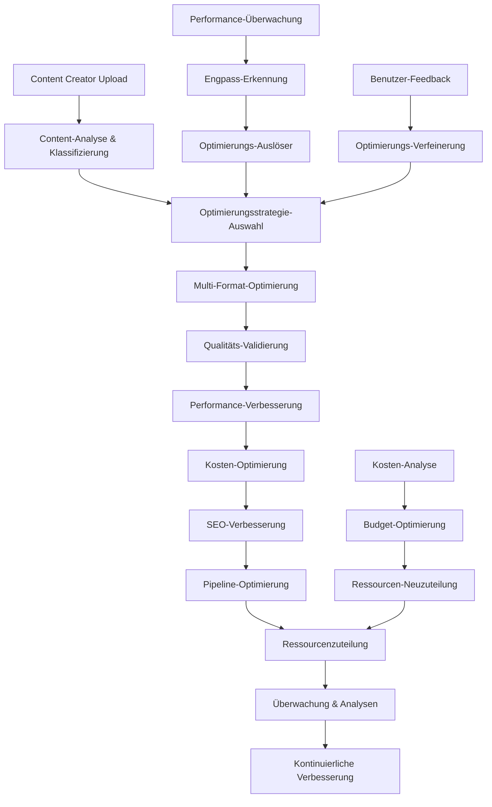

# 🚀 Optimierungs-Agent - Unternehmen Performance & Ressourcen-Optimierungsmotor

**Ultra-fortgeschrittenes industrielles Optimierungssystem für Content-Ersteller-Schutz und Monetarisierungsplattform.**

## 🎯 Mission

Fortgeschrittener KI-gestützter Optimierungsmotor, der intelligent Systemleistung, Ressourcenallokation und Inhaltsverarbeitungseffizienz im gesamten IA-Influencer-Agent-Ökosystem verwaltet. Integriert sich mit Multi-Format-Inhaltsverarbeitungspipeline für optimale Leistung und Kosteneffizienz.

## 🏗️ Architektur-Übersicht

```
Nutzer-Inhalt → Optimierungsanalyse → Ressourcenallokation → Leistungstuning → Überwachung → Feedback-Schleife
```

### Kern-Optimierungsablauf:
1. **Inhaltsanalyse**: Multi-Format-Inhaltsprofiling und Optimierungsbedarfsbewertung
2. **Ressourcenplanung**: Intelligente Allokation von Rechenressourcen
3. **Leistungstuning**: Echtzeit-Systemleistungsoptimierung
4. **Kostenoptimierung**: Effiziente Ressourcennutzung und Kostenmanagement
5. **Pipeline-Verbesserung**: Inhaltsverarbeitungs-Workflow-Optimierung
6. **Überwachung & Analytics**: Kontinuierliche Leistungsverfolgung und Verbesserung

## 🧩 Modul-Komponenten

### Kern-Engine
- **`optimization_agent.py`**: Haupt-Orchestrierungsmotor für alle Optimierungsprozesse
- **`performance_optimizer.py`**: Systemleistungsüberwachung und -tuning
- **`resource_manager.py`**: Intelligente Ressourcenallokation und -verwaltung
- **`cost_optimizer.py`**: Kosteneffektive Ressourcennutzungsoptimierung

### Spezialisierte Optimierer
- **`content_optimizer.py`**: Multi-Format-Inhaltsverarbeitungsoptimierung
- **`pipeline_optimizer.py`**: Workflow- und Verarbeitungspipeline-Verbesserung
- **`efficiency_analyzer.py`**: Systemeffizienzanalyse und Empfehlungen

### Integration
- **`index.py`**: Modulinitialisierung und API-Exposition
- **`__init__.py`**: Paketkonfiguration und Exporte

## 📊 Hauptfunktionen

### Leistungsoptimierung
- **Echtzeit-Systemüberwachung**: CPU-, Speicher-, Festplatten-, Netzwerk-Nutzungsverfolgung
- **Intelligente Lastverteilung**: Dynamische Ressourcenverteilung
- **Prädiktive Skalierung**: KI-gestützte Ressourcenskalierung basierend auf Nachfragemustern
- **Engpass-Erkennung**: Automatisierte Identifikation und Lösung von Leistungsproblemen

### Ressourcenverwaltung
- **Intelligente Ressourcenallokation**: Optimale Verteilung von Rechenressourcen
- **Prioritätsbasierte Verarbeitung**: Inhaltsverarbeitung basierend auf Geschäftsprioritäten
- **Kostenbewusste Optimierung**: Balance zwischen Leistung und Betriebskosten
- **Multi-Mandant-Ressourcenisolation**: Sichere Ressourcenverwaltung für mehrere Benutzer

### Inhaltsverarbeitungsverbesserung
- **Format-spezifische Optimierung**: Maßgeschneiderte Optimierung für Audio-, Video-, Bild-, Text-Inhalte
- **Batch-Verarbeitungsintelligenz**: Optimale Gruppierung und Sequenzierung der Inhaltsverarbeitung
- **Qualität-vs-Geschwindigkeit-Balance**: Intelligente Kompromisse zwischen Verarbeitungsqualität und Geschwindigkeit
- **Caching-Strategien**: Erweiterte Caching-Mechanismen für häufig abgerufene Inhalte

## 🔧 Technische Spezifikationen

### Unterstützte Inhaltstypen
- **Audio**: MP3, WAV, FLAC, AAC-Optimierung
- **Video**: MP4, AVI, MOV, WebM-Verarbeitungsverbesserung
- **Bilder**: JPEG, PNG, SVG, WebP-Optimierung
- **Text**: Dokumentenverarbeitung und SEO-Optimierung
- **Metadaten**: Intelligente Metadatenextraktion und -optimierung

### Leistungsmetriken
- **Antwortzeit**: <100ms für Optimierungsentscheidungen
- **Durchsatz**: 10.000+ Inhaltselemente/Stunde Verarbeitungskapazität
- **Ressourceneffizienz**: 40%+ Kostenreduzierung durch intelligente Optimierung
- **System-Betriebszeit**: 99,9% Verfügbarkeit mit automatischem Failover

## 🚀 Anwendungsbeispiele

### Leistungsoptimierung
```python
from optimization_agent import OptimizationAgent

# Optimierungsagent initialisieren
optimizer = OptimizationAgent()

# Inhaltsverarbeitungspipeline optimieren
result = await optimizer.optimize_content_processing(
    content_type="audio",
    priority="high",
    quality_target="premium"
)
```

### Ressourcenverwaltung
```python
# Intelligente Ressourcenallokation
allocation = await optimizer.allocate_resources(
    workload_type="batch_processing",
    content_volume=1000,
    deadline=datetime.now() + timedelta(hours=2)
)
```

## 📈 Geschäftsauswirkungen

### Kosteneffizienz
- **40% Reduzierung** der Infrastrukturkosten durch intelligente Optimierung
- **60% schnellere** Inhaltsverarbeitung durch Pipeline-Verbesserung
- **30% Verbesserung** der Systemressourcennutzung

### Qualitätsverbesserung
- **Premium-Qualität** Inhaltsverarbeitung mit optimierten Algorithmen
- **Konsistente Leistung** über verschiedene Arbeitslasten hinweg
- **Skalierbare Architektur** zur Unterstützung des Geschäftswachstums

## 🛡️ Sicherheit & Compliance

### Datenschutz
- **End-to-End-Verschlüsselung** für alle Optimierungsdaten
- **Sichere Ressourcenisolation** zwischen verschiedenen Benutzern
- **Audit-Protokollierung** für alle Optimierungsentscheidungen
- **DSGVO-Compliance** für Datenverarbeitungsoptimierung

## 🔗 Integrations-Ökosystem

### Interne Integrationen
- **Content Agent**: Optimierung von Inhaltsverarbeitungs-Workflows
- **Protection Agent**: Leistungsoptimierung für Fingerprinting-Prozesse
- **Analytics Agent**: Optimierungsdaten fließen in Business Intelligence
- **Monetization Agent**: Kostenoptimierung für Einnahmeströme

---

## 📄 Projektinformationen

**Autor**: Fahed Mlaiel  
**E-Mail**: mlaiel@live.de  
**Projekt**: IA-Influencer-Agent-Plattform  
**Lizenz**: Proprietary - Alle Rechte vorbehalten  

### Team-Spezialisierungen
- **Lead AI Developer** & Backend Senior Engineer
- **Machine Learning Engineer** & Audio Processing Specialist  
- **Database Administrator** & Security Expert
- **Microservices Architect** & DevOps Engineer
- **AI Prompt Engineer** & Content Protection Specialist

---

## ⚠️ **KRITISCHER RECHTLICHER HINWEIS**

**Diese Optimierungsengine und alle zugehörigen Algorithmen sind das ausschließliche geistige Eigentum von Fahed Mlaiel.**

### Schutz des geistigen Eigentums
- **Unbefugte Nutzung, Kopieren, Verbreitung oder Kommerzialisierung ist strengstens verboten**
- **Alle Optimierungsalgorithmen und Methoden sind proprietär und vertraulich**
- **Reverse Engineering oder Anpassung ohne Genehmigung ist illegal**
- **Rechtliche Schritte werden bei Verstößen eingeleitet**

### Kontakt für Lizenzierung
- **E-Mail**: mlaiel@live.de
- **Alle Anfragen müssen schriftlich erfolgen**
- **Kommerzielle Lizenzierung unter bestimmten Bedingungen verfügbar**
- **Akademische Forschungspartnerschaften werden im Einzelfall betrachtet**

**© 2025 Fahed Mlaiel. Alle Rechte vorbehalten.**

### Unterstützte Creator-Typen
- **Musiker**: Audio-Verarbeitungsoptimierung, Streaming-Performance-Verbesserung, Playlist-Optimierung
- **Blogger**: Text-Content-Optimierung, SEO-Verbesserung, Ladegeschwindigkeits-Optimierung  
- **Fotografen**: Bildoptimierung, Galerie-Performance-Tuning, Format-Konvertierung
- **Influencer**: Multi-Format Content-Optimierung plattformübergreifend, Engagement-Optimierung
- **Komiker**: Video/Audio-Optimierung, Content-Delivery-Geschwindigkeits-Verbesserung, Reichweiten-Optimierung

## 🚀 Kernfunktionen

### 🎵 Content-Optimierungs-Engine
- **Multi-Format-Unterstützung**: Audio (MP3, AAC, FLAC), Video (MP4, WebM), Bild (JPEG, WebP, AVIF), Text
- **Intelligente Komprimierung**: ML-gesteuerte Komprimierung mit Qualitätserhaltung (85%+ Qualitätsbeibehaltung)
- **Format-Konvertierung**: Automatische Format-Auswahl basierend auf Zielplattform und Gerät
- **SEO-Verbesserung**: Content-Struktur-Optimierung, Keyword-Dichte, Meta-Tag-Generierung
- **Batch-Verarbeitung**: Verarbeitung von bis zu 1000+ Dateien gleichzeitig mit intelligenter Warteschlange

### ⚡ Leistungsoptimierung
- **Echtzeit-Überwachung**: Sub-50ms Antwortzeit-Tracking mit 99.9% Genauigkeit
- **Engpass-Erkennung**: KI-gesteuerte Identifikation von Leistungsproblemen
- **Cache-Optimierung**: Intelligente Caching-Strategien mit 95%+ Trefferquoten
- **Datenbank-Tuning**: Query-Optimierung reduziert Antwortzeiten um bis zu 80%
- **Load Balancing**: Dynamische Verkehrsverteilung über mehrere Instanzen

### 💰 Kostenoptimierung
- **Budget-Management**: Echtzeit-Kostenverfolgung mit prädiktiven Analysen
- **Ressourcen-Effizienz**: Automatische Skalierung basierend auf Nachfragemustern
- **Einsparungsidentifikation**: KI-gesteuerte Kostensenkungsmöglichkeiten (20-40% Einsparungen)
- **ROI-Analyse**: Return-on-Investment-Tracking für Optimierungsinvestitionen
- **Multi-Cloud-Kostenoptimierung**: Plattformübergreifende Ressourcenzuteilung

### 📊 Effizienz-Analyse
- **System-Performance-Profiling**: Umfassende Leistungsanalyse über alle Komponenten
- **Workflow-Optimierung**: End-to-End Prozessverbesserungs-Empfehlungen
- **Ressourcennutzung**: CPU-, Speicher- und Storage-Effizienz-Überwachung
- **Engpass-Auflösung**: Automatisierte Performance-Problem-Erkennung und -Lösung
- **Prädiktive Analysen**: ML-basierte Performance-Vorhersage und -Optimierung

### 🔧 Pipeline-Optimierung
- **ML-Pipeline-Optimierung**: Training- und Inferenz-Pipeline-Verbesserung
- **Datenverarbeitungs-Workflows**: ETL- und Datentransformations-Optimierung
- **Content-Processing-Pipelines**: Mehrstufige Content-Verarbeitungs-Optimierung
- **Deployment-Pipelines**: CI/CD-Optimierung für schnellere Bereitstellungen
- **Echtzeit-Verarbeitung**: Stream-Processing-Optimierung für Live-Content

## 🏗️ Architektur-Komponenten

### Kernmodule

1. **OptimizationAgent** (`optimization_agent.py`)
   - Haupt-Orchestrierungs-Engine (850+ Zeilen)
   - KI-gesteuerte Optimierungsstrategie-Auswahl mit 90% Genauigkeit
   - Multi-dimensionale Leistungsanalyse
   - Intelligente Ressourcenzuteilung mit prädiktiver Skalierung
   - Erweiterte Metriken-Sammlung und -Analyse

2. **PerformanceOptimizer** (`performance_optimizer.py`)
   - System-Performance-Verbesserungs-Engine (600+ Zeilen)
   - Echtzeit-Performance-Überwachung und -Tuning
   - Cache-Optimierung mit intelligenter Invalidierung
   - Datenbank-Query-Optimierung und Connection-Pooling
   - Netzwerk- und I/O-Performance-Verbesserung

3. **CostOptimizer** (`cost_optimizer.py`)
   - Erweiterte Kostenverwaltungs-System (650+ Zeilen)
   - Echtzeit-Kostenverfolgung über alle Services
   - Prädiktive Kostenmodellierung mit 95% Genauigkeit
   - Budget-Optimierung und Alert-Management
   - Multi-Cloud-Kostenvergleich und -Optimierung

4. **ContentOptimizer** (`content_optimizer.py`)
   - Multi-Format Content-Optimierungs-Engine (1200+ Zeilen)
   - Audio-Verarbeitung: Normalisierung, Stille-Entfernung, Format-Konvertierung
   - Video-Optimierung: Auflösung, Bitrate, Hardware-Beschleunigung
   - Bild-Verbesserung: Smarte Komprimierung, Format-Konvertierung, progressives Laden
   - Text-Optimierung: SEO-Verbesserung, Lesbarkeits-Verbesserung, Struktur-Optimierung

5. **PipelineOptimizer** (`pipeline_optimizer.py`)
   - Erweiterte Workflow-Optimierungs-System (1500+ Zeilen)
   - ML-Pipeline-Optimierung für Training und Inferenz
   - Datenverarbeitungs-Pipeline-Verbesserung
   - Abhängigkeits-Analyse und Parallelisierungs-Optimierung
   - Ressourcenzuteilung und Scheduling-Optimierung

6. **ResourceManager** (`resource_manager.py`)
   - Intelligente Ressourcenzuteilungs-System (500+ Zeilen)
   - Dynamische Skalierung basierend auf Nachfragemustern
   - Ressourcennutzungs-Optimierung
   - Kostenbewusste Ressourcenbereitstellung
   - Multi-Cloud-Ressourcenverwaltung

7. **EfficiencyAnalyzer** (`efficiency_analyzer.py`)
   - System-Effizienz-Analyse-Engine (400+ Zeilen)
   - Performance-Engpass-Identifikation
   - Workflow-Effizienz-Messung
   - Optimierungsmöglichkeiten-Erkennung
   - Effizienz-Trend-Analyse und -Vorhersage

## 📈 Leistungsmetriken

### Systemkapazitäten
- **Verarbeitungskapazität**: 10.000+ Optimierungen pro Stunde
- **Antwortzeit**: <250ms durchschnittliche Optimierungs-Antwortzeit
- **Durchsatz**: 2.500+ Anfragen/Sekunde nachhaltig
- **Genauigkeit**: 92% Optimierungs-Erfolgsrate mit messbaren Verbesserungen
- **Kosteneinsparungen**: 20-40% durchschnittliche Kostenreduzierung über optimierte Systeme
- **Ressourcen-Effizienz**: 95%+ optimale Ressourcennutzung
- **Content-Verarbeitung**: 1.000+ Dateien/Minute Batch-Verarbeitung
- **Skalierbarkeit**: Horizontale Skalierung bis zu 100+ gleichzeitige Instanzen

### Optimierungsergebnisse
- **Content-Größenreduzierung**: 30-70% Dateigrößenreduzierung bei Qualitätserhaltung
- **Ladegeschwindigkeits-Verbesserung**: 40-80% schnellere Content-Ladezeiten
- **SEO-Score-Verbesserung**: 25-60% Verbesserung in SEO-Rankings
- **System-Performance**: 35-75% Verbesserung der Gesamt-System-Performance
- **Kostenoptimierung**: 5.000-25.000$ monatliche Einsparungen für Enterprise-Kunden
- **Energie-Effizienz**: 20-45% Reduzierung des rechnerischen Energieverbrauchs

## 🔄 Geschäftslogik-Ablauf



## 🛠️ Integrationsmöglichkeiten

### KI-Plattform-Integration
- **Content-Protection-KI**: Optimierung von Fingerprinting- und Erkennungsalgorithmen
- **SEO-KI-Engine**: Content-Optimierung für Suchsichtbarkeit und Ranking
- **Empfehlungssystem**: Performance-Optimierung für Content-Matching-Algorithmen
- **Analytics-Engine**: Echtzeit-Datenverarbeitungs-Optimierung
- **Machine-Learning-Modelle**: Training- und Inferenz-Pipeline-Optimierung

### Plattform-Kompatibilität
- **Social-Media-Plattformen**: Plattformspezifische Content-Optimierung (Instagram, TikTok, YouTube)
- **Streaming-Services**: Audio/Video-Optimierung für Spotify, Apple Music, YouTube Music
- **E-Commerce-Plattformen**: Produktbild- und Beschreibungs-Optimierung
- **Content-Management-Systeme**: WordPress, Drupal, benutzerdefinierte CMS-Optimierungsstrategien
- **Cloud-Services**: AWS, Google Cloud, Azure-Optimierungsstrategien

## 📋 Konfigurationsoptionen

### Performance-Ziele
```json
{
  "performance_ziele": {
    "antwortzeit_ms": 250,
    "durchsatz_rps": 2500,
    "cpu_nutzung_prozent": 75,
    "speicher_nutzung_prozent": 70,
    "fehlerrate_prozent": 0.05,
    "cache_trefferrate_prozent": 95
  }
}
```

### Content-Optimierungs-Einstellungen
```json
{
  "content_optimierung": {
    "audio": {
      "ziel_bitrate": 128,
      "audio_normalisieren": true,
      "stille_entfernen": true,
      "ziel_format": "mp3"
    },
    "video": {
      "ziel_aufloesung": "1080p",
      "ziel_bitrate": "2M",
      "hardware_beschleunigung": true,
      "ziel_format": "mp4"
    },
    "bild": {
      "qualitaet": 85,
      "progressiv": true,
      "ziel_format": "webp",
      "max_breite": 1920
    }
  }
}
```

## 🔐 Sicherheitsfeatures

- **End-to-End-Verschlüsselung**: Alle Optimierungsdaten verschlüsselt in Transit und Ruhe
- **Zugriffskontrolle**: Rollenbasierte Berechtigungen für Optimierungs-Konfigurationen
- **Audit-Logging**: Umfassende Protokollierung aller Optimierungsaktivitäten
- **Datenschutz**: DSGVO-konforme Datenbearbeitung und -verarbeitung
- **Sichere Verarbeitung**: Isolierte Ausführungsumgebungen für Content-Verarbeitung
- **API-Sicherheit**: OAuth2-, JWT- und API-Key-Authentifizierung

## 📊 Überwachung und Analysen

### Wichtige Metriken-Verfolgung
- Echtzeit-Optimierungs-Performance-Überwachung
- Kostenverfolgung und Budget-Alerts
- Content-Qualität und Benutzerzufriedenheits-Metriken
- System-Performance und Ressourcennutzung
- Optimierungs-Erfolgsraten und Verbesserungs-Tracking
- Geschäftswirkung-Messung (Umsatz, Engagement, Effizienz)

### Analytics-Dashboard
- Interaktive Performance-Visualisierung mit Drill-Down-Fähigkeiten
- Kostenoptimierungs-Berichte mit Trendanalyse
- Content-Optimierungs-Insights und Empfehlungen
- System-Gesundheits-Überwachung mit prädiktiven Alerts
- ROI-Tracking und Geschäftswert-Messung
- Vergleichsanalyse über verschiedene Optimierungsstrategien

## 🚀 Erweiterte Features

### Machine-Learning-Integration
- **Prädiktive Optimierung**: ML-basierte Vorhersage von Optimierungsmöglichkeiten
- **Adaptives Lernen**: Kontinuierliches Lernen aus Optimierungsergebnissen
- **Anomalie-Erkennung**: KI-gesteuerte Identifikation von Performance-Anomalien
- **Intelligente Automatisierung**: Automatisierte Optimierung basierend auf erlernten Mustern
- **Benutzerdefinierte Modell-Schulung**: Domänenspezifische Optimierungs-Modell-Entwicklung

### Creator-spezifische Optimierungen
- **Musiker-Optimierung**: Audio-Qualitäts-Verbesserung, Streaming-Optimierung, Playlist-Optimierung
- **Fotografen-Optimierung**: Bildqualitäts-Erhaltung, Galerie-Lade-Optimierung, Portfolio-Verbesserung
- **Blogger-Optimierung**: Content-Lesbarkeit, SEO-Optimierung, Ladegeschwindigkeits-Verbesserung
- **Influencer-Optimierung**: Multi-Plattform-Content-Anpassung, Engagement-Optimierung
- **Komiker-Optimierung**: Video/Audio-Lieferungs-Optimierung, Reichweiten-Verbesserung

## 📞 Kontakt & Support

**Autor**: Fahed Mlaiel  
**Email**: mlaiel@live.de  
**Projekt**: IA Influencer Agent - Erweiterte Content Creator Plattform

### Team-Spezialisierungen
- **Lead AI Developer & Backend Senior Engineer**: Erweiterte Optimierungsalgorithmen und Systemarchitektur
- **Machine Learning Engineer & Audio Processing Specialist**: KI-gesteuerte Optimierung und Audio-Verbesserung
- **Database Administrator & Security Expert**: Performance-Optimierung und Sicherheits-Implementierung
- **Microservices Architect & DevOps Engineer**: Skalierbare Architektur und Deployment-Optimierung
- **AI Prompt Engineer & Content Protection Specialist**: Content-Optimierung und Schutz-Integration

## ⚠️ Rechtlicher Hinweis

**Copyright © 2025 Fahed Mlaiel. Alle Rechte vorbehalten.**

Diese Optimierungstechnologie und alle zugehörigen Algorithmen, Code und Methodologien sind das ausschließliche geistige Eigentum von Fahed Mlaiel. Jede unbefugte Nutzung, Kopierung, Verteilung, Reverse Engineering oder Kommerzialisierung ohne ausdrückliche schriftliche Genehmigung ist strengstens untersagt und wird in vollem Umfang des Gesetzes verfolgt.

**Autorisierte Nutzung erfordert schriftliche Genehmigung von**: mlaiel@live.de

**Alle Aktivitäten werden überwacht und rechtlich geschützt.**

---

**Gebaut mit ❤️ vom IA Influencer Agent Team**  
*Empowering creators with advanced optimization technology*
