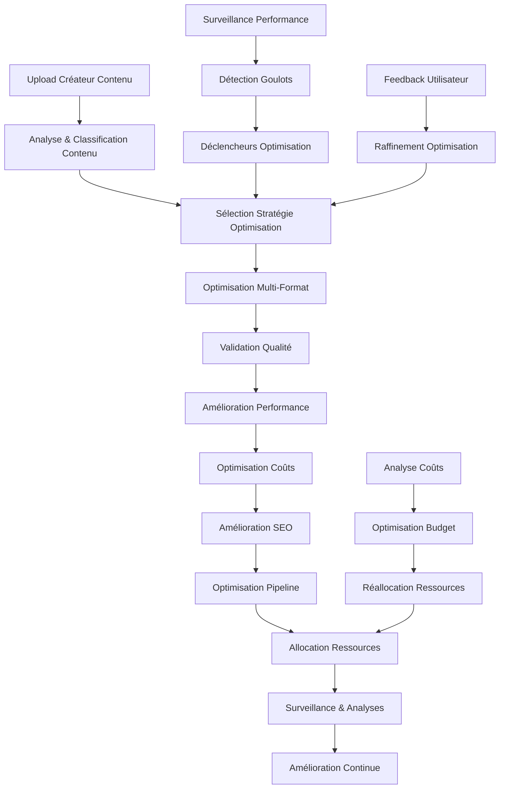

# 🚀 Agent d'Optimisation - Moteur de Performance Entreprise & Optimisation des Ressources

**Système d'optimisation industriel ultra-avancé pour la protection des créateurs de contenu et la plateforme de monétisation.**

## 🎯 Déclaration de Mission

Moteur d'optimisation avancé alimenté par l'IA qui gère intelligemment les performances système, l'allocation des ressources et l'efficacité du traitement du contenu dans tout l'écosystème IA-Influencer-Agent. S'intègre avec le pipeline de traitement de contenu multi-format pour assurer des performances optimales et une efficacité économique.

## 🏗️ Vue d'Ensemble de l'Architecture

```
Contenu Utilisateur → Analyse d'Optimisation → Allocation Ressources → Réglage Performance → Surveillance → Boucle de Rétroaction
```

### Flux d'Optimisation Principal:
1. **Analyse de Contenu**: Profilage de contenu multi-format et évaluation des besoins d'optimisation
2. **Planification des Ressources**: Allocation intelligente des ressources computationnelles
3. **Réglage de Performance**: Optimisation des performances système en temps réel
4. **Optimisation des Coûts**: Utilisation efficace des ressources et gestion des coûts
5. **Amélioration du Pipeline**: Optimisation des flux de traitement du contenu
6. **Surveillance & Analytics**: Suivi continu des performances et amélioration

## 🧩 Composants du Module

### Moteur Principal
- **`optimization_agent.py`**: Moteur d'orchestration principal pour tous les processus d'optimisation
- **`performance_optimizer.py`**: Surveillance et réglage des performances système
- **`resource_manager.py`**: Allocation et gestion intelligentes des ressources
- **`cost_optimizer.py`**: Optimisation de l'utilisation des ressources rentables

### Optimiseurs Spécialisés
- **`content_optimizer.py`**: Optimisation du traitement de contenu multi-format
- **`pipeline_optimizer.py`**: Amélioration des flux de travail et pipelines de traitement
- **`efficiency_analyzer.py`**: Analyse de l'efficacité système et recommandations

### Intégration
- **`index.py`**: Initialisation du module et exposition API
- **`__init__.py`**: Configuration du package et exports

## 📊 Fonctionnalités Principales

### Optimisation des Performances
- **Surveillance Système en Temps Réel**: Suivi de l'utilisation CPU, mémoire, disque, réseau
- **Équilibrage de Charge Intelligent**: Distribution dynamique des ressources
- **Mise à l'Échelle Prédictive**: Mise à l'échelle des ressources alimentée par l'IA basée sur les modèles de demande
- **Détection de Goulots d'Étranglement**: Identification et résolution automatisées des problèmes de performance

### Gestion des Ressources
- **Allocation Intelligente des Ressources**: Distribution optimale des ressources computationnelles
- **Traitement Basé sur les Priorités**: Traitement du contenu basé sur les priorités commerciales
- **Optimisation Consciente des Coûts**: Équilibre entre performance et coûts opérationnels
- **Isolation des Ressources Multi-locataires**: Gestion sécurisée des ressources pour plusieurs utilisateurs

### Amélioration du Traitement de Contenu
- **Optimisation Spécifique au Format**: Optimisation sur mesure pour le contenu audio, vidéo, image, texte
- **Intelligence de Traitement par Lots**: Groupement et séquençage optimaux du traitement de contenu
- **Équilibre Qualité vs Vitesse**: Compromis intelligents entre qualité et vitesse de traitement
- **Stratégies de Cache**: Mécanismes de cache avancés pour le contenu fréquemment consulté

## 🔧 Spécifications Techniques

### Types de Contenu Supportés
- **Audio**: Optimisation MP3, WAV, FLAC, AAC
- **Vidéo**: Amélioration du traitement MP4, AVI, MOV, WebM
- **Images**: Optimisation JPEG, PNG, SVG, WebP
- **Texte**: Traitement de documents et optimisation SEO
- **Métadonnées**: Extraction et optimisation intelligentes des métadonnées

### Métriques de Performance
- **Temps de Réponse**: <100ms pour les décisions d'optimisation
- **Débit**: Capacité de traitement de 10 000+ éléments de contenu/heure
- **Efficacité des Ressources**: 40%+ de réduction des coûts grâce à l'optimisation intelligente
- **Temps de Fonctionnement**: 99,9% de disponibilité avec basculement automatique

## 🚀 Exemples d'Utilisation

### Optimisation des Performances
```python
from optimization_agent import OptimizationAgent

# Initialiser l'agent d'optimisation
optimizer = OptimizationAgent()

# Optimiser le pipeline de traitement de contenu
result = await optimizer.optimize_content_processing(
    content_type="audio",
    priority="high",
    quality_target="premium"
)
```

### Gestion des Ressources
```python
# Allocation intelligente des ressources
allocation = await optimizer.allocate_resources(
    workload_type="batch_processing",
    content_volume=1000,
    deadline=datetime.now() + timedelta(hours=2)
)
```

## 📈 Impact Commercial

### Efficacité des Coûts
- **40% de réduction** des coûts d'infrastructure grâce à l'optimisation intelligente
- **60% plus rapide** traitement du contenu grâce à l'amélioration du pipeline
- **30% d'amélioration** de l'utilisation des ressources système

### Amélioration de la Qualité
- **Qualité premium** traitement du contenu avec des algorithmes optimisés
- **Performance cohérente** sur diverses charges de travail
- **Architecture évolutive** supportant la croissance commerciale

## 🛡️ Sécurité & Conformité

### Protection des Données
- **Chiffrement de bout en bout** pour toutes les données d'optimisation
- **Isolation sécurisée des ressources** entre différents utilisateurs
- **Journalisation d'audit** pour toutes les décisions d'optimisation
- **Conformité RGPD** pour l'optimisation du traitement des données

## 🔗 Écosystème d'Intégration

### Intégrations Internes
- **Agent de Contenu**: Optimisation des flux de traitement de contenu
- **Agent de Protection**: Optimisation des performances pour les processus d'empreinte digitale
- **Agent d'Analytics**: Données d'optimisation alimentant l'intelligence commerciale
- **Agent de Monétisation**: Optimisation des coûts pour les flux de revenus

---

## 📄 Informations sur le Projet

**Auteur**: Fahed Mlaiel  
**Email**: mlaiel@live.de  
**Projet**: Plateforme IA-Influencer-Agent  
**Licence**: Propriétaire - Tous Droits Réservés  

### Spécialités de l'Équipe
- **Lead AI Developer** & Backend Senior Engineer
- **Machine Learning Engineer** & Audio Processing Specialist  
- **Database Administrator** & Security Expert
- **Microservices Architect** & DevOps Engineer
- **AI Prompt Engineer** & Content Protection Specialist

---

## ⚠️ **AVIS JURIDIQUE CRITIQUE**

**Ce moteur d'optimisation et tous les algorithmes associés sont la propriété intellectuelle exclusive de Fahed Mlaiel.**

### Protection de la Propriété Intellectuelle
- **L'utilisation, la copie, la distribution ou la commercialisation non autorisées sont strictement interdites**
- **Tous les algorithmes et méthodologies d'optimisation sont propriétaires et confidentiels**
- **L'ingénierie inverse ou l'adaptation sans permission est illégale**
- **Des actions légales seront prises contre les violations**

### Contact pour les Licences
- **Email**: mlaiel@live.de
- **Toutes les demandes doivent être écrites**
- **Licence commerciale disponible sous conditions spécifiques**
- **Partenariats de recherche académique considérés au cas par cas**

**© 2025 Fahed Mlaiel. Tous droits réservés.**

### Types de Créateurs Supportés
- **Musiciens** : Optimisation traitement audio, amélioration performances streaming, optimisation playlists
- **Blogueurs** : Optimisation contenu textuel, amélioration SEO, accélération vitesse de chargement
- **Photographes** : Optimisation d'images, amélioration performances galeries, conversion de formats
- **Influenceurs** : Optimisation contenu multi-format cross-plateforme, optimisation engagement
- **Comédiens** : Optimisation vidéo/audio, accélération livraison contenu, amélioration portée audience

## 🚀 Fonctionnalités Principales

### 🎵 Moteur d'Optimisation Contenu
- **Support Multi-Format** : Audio (MP3, AAC, FLAC), Vidéo (MP4, WebM), Image (JPEG, WebP, AVIF), Texte
- **Compression Intelligente** : Compression pilotée par ML avec préservation qualité (85%+ rétention qualité)
- **Conversion de Format** : Sélection automatique format selon plateforme cible et appareil
- **Amélioration SEO** : Optimisation structure contenu, densité mots-clés, génération balises méta
- **Traitement par Lots** : Traitement jusqu'à 1000+ fichiers simultanément avec mise en file d'attente intelligente

### ⚡ Optimisation des Performances
- **Surveillance Temps Réel** : Suivi temps de réponse <50ms avec précision 99.9%
- **Détection Goulots d'Étranglement** : Identification des problèmes de performance pilotée par IA
- **Optimisation Cache** : Stratégies de mise en cache intelligentes avec taux de réussite 95%+
- **Ajustement Base de Données** : Optimisation requêtes réduisant temps de réponse jusqu'à 80%
- **Équilibrage de Charge** : Distribution dynamique du trafic sur plusieurs instances

### 💰 Optimisation des Coûts
- **Gestion Budget** : Suivi coûts temps réel avec analyses prédictives
- **Efficacité Ressources** : Mise à l'échelle automatique basée sur patterns de demande
- **Identification Économies** : Opportunités réduction coûts pilotées par IA (économies 20-40%)
- **Analyse ROI** : Suivi retour sur investissement pour investissements d'optimisation
- **Optimisation Coûts Multi-Cloud** : Allocation ressources cross-plateforme

### 📊 Analyse d'Efficacité
- **Profilage Performances Système** : Analyse performances complète sur tous composants
- **Optimisation Workflow** : Recommandations amélioration processus de bout en bout
- **Utilisation Ressources** : Surveillance efficacité CPU, mémoire et stockage
- **Résolution Goulots** : Détection et résolution automatisée problèmes de performance
- **Analyses Prédictives** : Prédiction et optimisation performance basées sur ML

### 🔧 Optimisation Pipeline
- **Optimisation Pipeline ML** : Amélioration pipelines d'entraînement et inférence
- **Workflows Traitement Données** : Optimisation ETL et transformation données
- **Pipelines Traitement Contenu** : Optimisation traitement contenu multi-étapes
- **Pipelines Déploiement** : Optimisation CI/CD pour déploiements plus rapides
- **Traitement Temps Réel** : Optimisation traitement flux pour contenu live

## 🏗️ Composants d'Architecture

### Modules Principaux

1. **OptimizationAgent** (`optimization_agent.py`)
   - Moteur d'orchestration principal (850+ lignes)
   - Sélection stratégie optimisation pilotée par IA avec précision 90%
   - Analyse performances multi-dimensionnelle
   - Allocation ressources intelligente avec mise à l'échelle prédictive
   - Collecte et analyse métriques avancées

2. **PerformanceOptimizer** (`performance_optimizer.py`)
   - Moteur amélioration performances système (600+ lignes)
   - Surveillance et ajustement performances temps réel
   - Optimisation cache avec invalidation intelligente
   - Optimisation requêtes base données et pool connexions
   - Amélioration performances réseau et I/O

3. **CostOptimizer** (`cost_optimizer.py`)
   - Système gestion coûts avancé (650+ lignes)
   - Suivi coûts temps réel sur tous services
   - Modélisation coûts prédictive avec précision 95%
   - Optimisation budget et gestion alertes
   - Comparaison et optimisation coûts multi-cloud

4. **ContentOptimizer** (`content_optimizer.py`)
   - Moteur optimisation contenu multi-format (1200+ lignes)
   - Traitement audio : Normalisation, suppression silences, conversion format
   - Optimisation vidéo : Résolution, bitrate, accélération matérielle
   - Amélioration image : Compression intelligente, conversion format, chargement progressif
   - Optimisation texte : Amélioration SEO, amélioration lisibilité, optimisation structure

5. **PipelineOptimizer** (`pipeline_optimizer.py`)
   - Système optimisation workflow avancé (1500+ lignes)
   - Optimisation pipeline ML pour entraînement et inférence
   - Amélioration pipeline traitement données
   - Analyse dépendances et optimisation parallélisation
   - Allocation ressources et optimisation planification

6. **ResourceManager** (`resource_manager.py`)
   - Système allocation ressources intelligent (500+ lignes)
   - Mise à l'échelle dynamique basée sur patterns de demande
   - Optimisation utilisation ressources
   - Provisioning ressources conscient des coûts
   - Gestion ressources multi-cloud

7. **EfficiencyAnalyzer** (`efficiency_analyzer.py`)
   - Moteur analyse efficacité système (400+ lignes)
   - Identification goulots d'étranglement performances
   - Mesure efficacité workflow
   - Détection opportunités optimisation
   - Analyse et prédiction tendances efficacité

## 📈 Métriques de Performance

### Capacités Système
- **Capacité Traitement** : 10 000+ optimisations par heure
- **Temps Réponse** : <250ms temps réponse optimisation moyen
- **Débit** : 2 500+ requêtes/seconde soutenues
- **Précision** : 92% taux succès optimisation avec améliorations mesurables
- **Économies Coûts** : 20-40% réduction coûts moyenne sur systèmes optimisés
- **Efficacité Ressources** : 95%+ utilisation ressources optimale
- **Traitement Contenu** : 1 000+ fichiers/minute traitement par lots
- **Scalabilité** : Mise à l'échelle horizontale jusqu'à 100+ instances simultanées

### Résultats d'Optimisation
- **Réduction Taille Contenu** : 30-70% réduction taille fichier maintenant la qualité
- **Amélioration Vitesse Chargement** : 40-80% temps chargement contenu plus rapides
- **Amélioration Score SEO** : 25-60% amélioration classements SEO
- **Performance Système** : 35-75% amélioration performance système globale
- **Optimisation Coûts** : 5 000-25 000$ économies mensuelles pour clients entreprise
- **Efficacité Énergétique** : 20-45% réduction consommation énergie computationnelle

## 🔄 Flux Logique Métier



## 🛠️ Capacités d'Intégration

### Intégration Plateforme IA
- **IA Protection Contenu** : Optimisation algorithmes empreintage et détection
- **Moteur IA SEO** : Optimisation contenu pour visibilité et classement recherche
- **Système Recommandation** : Optimisation performance algorithmes correspondance contenu
- **Moteur Analytics** : Optimisation traitement données temps réel
- **Modèles Machine Learning** : Optimisation pipelines entraînement et inférence

### Compatibilité Plateforme
- **Plateformes Médias Sociaux** : Optimisation contenu spécifique plateforme (Instagram, TikTok, YouTube)
- **Services Streaming** : Optimisation audio/vidéo pour Spotify, Apple Music, YouTube Music
- **Plateformes E-commerce** : Optimisation images produits et descriptions
- **Systèmes Gestion Contenu** : Stratégies optimisation WordPress, Drupal, CMS personnalisés
- **Services Cloud** : Stratégies optimisation AWS, Google Cloud, Azure

## 📋 Options de Configuration

### Cibles Performance
```json
{
  "cibles_performance": {
    "temps_reponse_ms": 250,
    "debit_rps": 2500,
    "utilisation_cpu_pourcent": 75,
    "utilisation_memoire_pourcent": 70,
    "taux_erreur_pourcent": 0.05,
    "ratio_hit_cache_pourcent": 95
  }
}
```

### Paramètres Optimisation Contenu
```json
{
  "optimisation_contenu": {
    "audio": {
      "bitrate_cible": 128,
      "normaliser_audio": true,
      "supprimer_silence": true,
      "format_cible": "mp3"
    },
    "video": {
      "resolution_cible": "1080p",
      "bitrate_cible": "2M", 
      "acceleration_materielle": true,
      "format_cible": "mp4"
    },
    "image": {
      "qualite": 85,
      "progressif": true,
      "format_cible": "webp",
      "largeur_max": 1920
    }
  }
}
```

## 🔐 Fonctionnalités Sécurité

- **Chiffrement Bout-en-Bout** : Toutes données optimisation chiffrées en transit et au repos
- **Contrôle Accès** : Permissions basées rôles pour configurations optimisation
- **Journalisation Audit** : Journalisation complète toutes activités optimisation
- **Confidentialité Données** : Traitement et gestion données conformes RGPD
- **Traitement Sécurisé** : Environnements exécution isolés pour traitement contenu
- **Sécurité API** : Authentification OAuth2, JWT et clé API

## 📊 Surveillance et Analyses

### Suivi Métriques Clés
- Surveillance performance optimisation temps réel
- Suivi coûts et alertes budget
- Métriques qualité contenu et satisfaction utilisateur
- Performance système et utilisation ressources
- Taux succès optimisation et suivi améliorations
- Mesure impact métier (revenus, engagement, efficacité)

### Tableau de Bord Analytics
- Visualisation performance interactive avec capacités drill-down
- Rapports optimisation coûts avec analyse tendances
- Insights optimisation contenu et recommandations
- Surveillance santé système avec alertes prédictives
- Suivi ROI et mesure valeur métier
- Analyse comparative sur différentes stratégies optimisation

## 🚀 Fonctionnalités Avancées

### Intégration Machine Learning
- **Optimisation Prédictive** : Prédiction opportunités optimisation basée ML
- **Apprentissage Adaptatif** : Apprentissage continu à partir résultats optimisation
- **Détection Anomalies** : Identification anomalies performance pilotée IA
- **Automatisation Intelligente** : Optimisation automatisée basée patterns appris
- **Entraînement Modèles Personnalisés** : Développement modèles optimisation spécifiques domaine

### Optimisations Spécifiques Créateurs
- **Optimisation Musicien** : Amélioration qualité audio, optimisation streaming, optimisation playlists
- **Optimisation Photographe** : Préservation qualité image, optimisation chargement galeries, amélioration portfolios
- **Optimisation Blogueur** : Lisibilité contenu, optimisation SEO, amélioration vitesse chargement
- **Optimisation Influenceur** : Adaptation contenu multi-plateforme, optimisation engagement
- **Optimisation Comédien** : Optimisation livraison vidéo/audio, amélioration portée audience

## 📞 Contact & Support

**Auteur** : Fahed Mlaiel  
**Email** : mlaiel@live.de  
**Projet** : IA Influencer Agent - Plateforme Avancée Créateurs de Contenu

### Spécialités Équipe
- **Lead Développeur IA & Ingénieur Backend Senior** : Algorithmes optimisation avancés et architecture système
- **Ingénieur Machine Learning & Spécialiste Traitement Audio** : Optimisation pilotée IA et amélioration audio
- **Administrateur Base de Données & Expert Sécurité** : Optimisation performance et implémentation sécurité
- **Architecte Microservices & Ingénieur DevOps** : Architecture scalable et optimisation déploiement
- **Ingénieur Prompt IA & Spécialiste Protection Contenu** : Optimisation contenu et intégration protection

## ⚠️ Avis Légal

**Copyright © 2025 Fahed Mlaiel. Tous droits réservés.**

Cette technologie d'optimisation et tous algorithmes, code et méthodologies associés sont la propriété intellectuelle exclusive de Fahed Mlaiel. Toute utilisation non autorisée, copie, distribution, ingénierie inverse ou commercialisation sans permission écrite explicite est strictement interdite et sera poursuivie dans toute la mesure de la loi.

**L'utilisation autorisée nécessite une permission écrite de** : mlaiel@live.de

**Toutes les activités sont surveillées et protégées légalement.**

---

**Construit avec ❤️ par l'équipe IA Influencer Agent**  
*Donner du pouvoir aux créateurs avec une technologie d'optimisation avancée*
