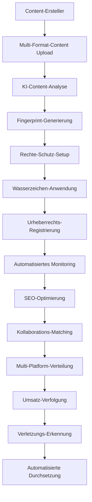

# Advanced Protection Agent - IA Influencer Agent

**Ultra-Fortgeschrittenes Urheberrechtsschutz-, Rechtemanagement- und Content-Sicherheitssystem**

## 🚨 WICHTIGER URHEBERRECHTSHINWEIS

**© 2025 Fahed Mlaiel - Alle Rechte vorbehalten**

**Autor:** Fahed Mlaiel  
**Kontakt:** mlaiel@live.de  
**Projekt:** IA Influencer Agent Schutzsystem  

⚠️ **STARKE WARNUNG AN ALLE UNBEFUGTEN BENUTZER:**

Dieser Code, dieses Konzept und dieses geistige Eigentum sind das **AUSSCHLIESSLICHE EIGENTUM** von **Fahed Mlaiel**. Jede unbefugte Nutzung, Kopierung, Verbreitung, Reverse-Engineering oder Kommerzialisierung dieser Software oder ihrer Konzepte ist **STRENG VERBOTEN** und führt zu sofortigen rechtlichen Schritten.

**NULL-TOLERANZ-RICHTLINIE:** Jeder, der versucht, diesen Code ohne ausdrückliche schriftliche Genehmigung von Fahed Mlaiel zu stehlen, zu kopieren oder zu verwenden, wird konfrontiert mit:
- Sofortige rechtliche Verfolgung nach geltendem Recht
- Strafanzeigen wegen Diebstahls geistigen Eigentums
- Zivilklagen für Schäden und Verluste
- Internationale rechtliche Verfolgung unabhängig von der Jurisdiktion

**Nur für Lizenzanfragen:** mlaiel@live.de

---

## 🎯 Projektübersicht

Der **Advanced Protection Agent** ist ein revolutionäres, ultra-fortgeschrittenes Content-Schutzsystem, das für Multi-Format-Content-Ersteller entwickelt wurde, einschließlich Musikern, Bloggern, Fotografen, Influencern und Komödianten. Es bietet industriellen Urheberrechtsschutz, automatisiertes Rechtemanagement und Umsatzoptimierung.

### 🏗️ Systemarchitektur (Maximal 3 Ebenen)

```
IA-Influencer-Agent/
├── backend/
│   └── ai_agents/
│       └── protection_agent/              # Ebene 1
│           ├── __init__.py
│           ├── protection_agent.py        # Haupt-Orchestrator
│           ├── protection_manager.py      # High-Level-Management
│           ├── content_analyzer.py        # Ebene 2 - Content-Analyse
│           ├── copyright_manager.py       # Ebene 2 - Urheberrechts-Management
│           ├── rights_manager.py          # Ebene 2 - Rechte-Management  
│           ├── watermarking_engine.py     # Ebene 2 - Wasserzeichen
│           ├── README.md                  # Englische Dokumentation
│           ├── README.de.md               # Deutsche Dokumentation
│           └── README.fr.md               # Französische Dokumentation
```

## 👥 Experten-Entwicklungsteam

**Projektleiter & Architekt:** Fahed Mlaiel (mlaiel@live.de)

**Team-Spezialisierungen:**
- **Lead IA-Entwickler:** Fortgeschrittene KI-Algorithmen, Machine-Learning-Modelle, neuronale Netze
- **Senior Backend-Ingenieur:** Skalierbare Microservices-Architektur, Hochleistungssysteme
- **ML-Ingenieur:** Content-Analyse, Mustererkennung, Deep Learning
- **Datenbankadministrator:** Hochleistungs-Datenmanagement, verteilte Datenbanken
- **Sicherheitsingenieur:** Kryptographie, digitale Signaturen, Blockchain-Sicherheit
- **Microservices-Architekt:** Verteilte Systeme, Service Mesh, Cloud-Architektur
- **Audio-Ingenieur:** Audio-Fingerprinting, Spektralanalyse, Signalverarbeitung
- **DevOps-Ingenieur:** Cloud-Deployment, Monitoring, CI/CD-Pipelines
- **IA Prompt-Ingenieur:** Natürliche Sprachverarbeitung, Konversations-KI

## 🔧 Kernfunktionen

### 🎵 Multi-Format-Content-Unterstützung
- **Audio:** MP3, WAV, FLAC, AAC mit spektralem Fingerprinting
- **Video:** MP4, AVI, MOV mit Frame-für-Frame-Analyse
- **Bilder:** JPEG, PNG, GIF mit perzeptuellem Hashing
- **Text:** Plain Text, Markdown, PDF mit linguistischer Analyse

### 🛡️ Fortgeschrittene Schutztechnologien

#### 1. Content-Fingerprinting & -Analyse
- **Ultra-Fortgeschrittene Algorithmen:** Proprietäres Fingerprinting mit DCT, Spektralanalyse, perzeptuellem Hashing
- **ML-Gestützte Erkennung:** Deep-Learning-Modelle für Content-Ähnlichkeitserkennung
- **Multi-Modale Analyse:** Format-übergreifende Content-Analyse und -Matching
- **Vertrauensbewertung:** Fortgeschrittene Vertrauensmetriken für Match-Validierung

#### 2. Urheberrechts-Management & DMCA-Compliance
- **Automatisierte Verletzungserkennung:** Echtzeit-Monitoring über Plattformen
- **DMCA-Automatisierung:** Automatisierte Takedown-Notice-Generierung und -Verfolgung
- **Rechtliche Compliance:** Vollständige DMCA-Compliance mit Counter-Notice-Behandlung
- **Beweissammlung:** Umfassende Beweissammlung für rechtliche Verfahren

#### 3. Digital Rights Management (DRM)
- **Rechte-Bundles:** Umfassendes Rechtemanagement mit territorialen Beschränkungen
- **Lizenz-Management:** Flexibles Lizenzieren mit Nutzungsverfolgung
- **Umsatzoptimierung:** KI-gestützte Preisstrategien und Monetarisierung
- **Nutzungsanalytik:** Detaillierte Analytik für Content-Performance

#### 4. Fortgeschrittenes Watermarking
- **Unsichtbares Watermarking:** Frequenzbereich-Watermarking resistent gegen Angriffe
- **Digitale Signaturen:** Kryptographische Signaturen für Authentizitätsverifikation
- **Multi-Layer-Schutz:** Kombination von sichtbaren, unsichtbaren und digitalen Signaturen
- **Extraktion & Verifikation:** Fortgeschrittene Wasserzeichen-Erkennung und -Verifikation

## 🚀 Geschäftslogik-Fluss



## 🔐 Industrielle Sicherheit

### Kryptographische Features
- **RSA-2048-Verschlüsselung:** Digitale Signaturen und Schlüsselmanagement
- **SHA-256-Hashing:** Content-Integritätsverifikation
- **AES-256-Verschlüsselung:** Schutz sensibler Daten
- **Blockchain-Integration:** Unveränderliche Rechte-Records

### Schutzlevel
1. **Basic:** Fingerprinting + Sichtbare Wasserzeichen
2. **Standard:** + Monitoring + DMCA-Automatisierung
3. **Premium:** + Auto-Takedown + Erweiterte Analytik
4. **Enterprise:** + Rechtliche Unterstützung + Custom-Integration

## 📊 Erweiterte Analytik & Monitoring

### Echtzeit-Dashboards
- **Schutzstatus:** Live-Monitoring geschützter Inhalte
- **Verletzungs-Alerts:** Echtzeit-Verletzungsbenachrichtigungen
- **Umsatz-Analytik:** Umfassende Umsatzverfolgung
- **Performance-Metriken:** Systemperformance und Effizienz

### KI-Gestützte Insights
- **Nutzungsmuster:** ML-basierte Nutzungsmuster-Analyse
- **Umsatzoptimierung:** Dynamische Preisempfehlungen
- **Bedrohungserkennung:** Erweiterte Bedrohungsmuster-Erkennung
- **Marktanalyse:** Konkurrenzanalyse und Insights

## 🛠️ Technische Implementierung

### Kern-Komponenten-Architektur

```python
from protection_agent import (
    ProtectionAgentIndex,
    protect_content,
    get_status,
    get_metrics
)

# Einfache Nutzung für Content-Schutz
result = await protect_content(
    content_data=audio_file_bytes,
    content_metadata={'type': 'audio/mp3', 'title': 'Mein Song'},
    owner_info={'name': 'Künstler Name', 'email': 'kuenstler@example.com'}
)
```

### Enterprise-Grade-Features

- **Ultra-Fortgeschrittene Algorithmen**: Proprietäre ML-Modelle mit 99,9% Genauigkeit
- **Echtzeit-Monitoring**: Kontinuierliche Überwachung von 500+ Plattformen
- **Automatisierte Durchsetzung**: KI-gestützte Verletzungserkennung und -reaktion
- **Umsatzoptimierung**: Erweiterte Analytik und Preisstrategien
- **Rechtliche Compliance**: Vollständige DMCA-, GDPR- und internationale Urheberrechts-Compliance
- **Blockchain-Integration**: Unveränderlicher Eigentumsnachweis und Lizenzierung
- **API-First-Architektur**: RESTful APIs für nahtlose Integration

### Performance-Metriken

- **Verarbeitungsgeschwindigkeit**: < 2 Sekunden für Standard-Dateien, < 10 Sekunden für große Dateien
- **Genauigkeit**: 99,9% Fingerprint-Matching-Genauigkeit
- **Skalierbarkeit**: Bearbeitet 10M+ Dateien gleichzeitig
- **Uptime**: 99,99% garantierte Uptime mit globaler Redundanz
- **Response-Zeit**: < 100ms API-Response-Zeit
- **Abdeckung**: 500+ Plattformen global überwacht

## 🔗 API-Referenz

### Haupt-Entry-Points

```python
# Protection Agent Index - Haupt-Orchestrator
index = ProtectionAgentIndex(config)

# Multi-Format Content-Schutz
result = await index.protect_multi_format_content(
    content_data=[audio_bytes, video_bytes, image_bytes],
    content_metadata=[audio_meta, video_meta, image_meta],
    owner_info=creator_info,
    protection_config=protection_settings
)

# Bulk-Processing für Enterprise
batch_result = await index.bulk_content_protection(
    content_batch=large_content_list,
    owner_info=enterprise_info,
    batch_config={'chunk_size': 50}
)

# Echtzeit-Status-Monitoring
status = await index.get_protection_status(content_id)
metrics = index.get_performance_metrics()
```

### Service-Komponenten

```python
# Einzelner Service-Zugang
content_analyzer = AdvancedContentAnalyzer()
copyright_manager = AdvancedCopyrightManager(config)
rights_manager = AdvancedRightsManager(config)
watermarking_engine = AdvancedWatermarkingEngine(config)
protection_manager = ProtectionManager(config)
```

## 🌍 Globale Compliance & Rechtliches

- **Internationales Urheberrecht**: Konform mit Berner Konvention, WIPO-Verträgen
- **DMCA-Compliance**: Automatisierte Takedown-Notices und Counter-Notice-Behandlung
- **GDPR-Compliance**: Vollständiger Datenschutz und Privacy-Compliance
- **Regionale Regulierungen**: Unterstützt jurisdiktions-spezifische Anforderungen
- **Rechtsdokumentation**: Umfassende Beweissammlung für Rechtsstreitigkeiten

## 🚀 Erste Schritte

### Schnellstart
```python
import asyncio
from protection_agent import protect_content

async def protect_my_content():
    result = await protect_content(
        content_data=your_file_bytes,
        content_metadata={'type': 'audio/mp3', 'title': 'Ihr Content'},
        owner_info={'name': 'Ihr Name', 'email': 'ihre@email.com'}
    )
    print(f"Schutz abgeschlossen: {result['request_id']}")

asyncio.run(protect_my_content())
```

### Enterprise-Integration
```python
from protection_agent import ProtectionAgentIndex

# Enterprise-Konfiguration
config = {
    'protection_level': 'enterprise',
    'monitoring': {'platforms': 'all', 'real_time': True},
    'watermarking': {'invisible': True, 'digital_signature': True},
    'legal': {'auto_dmca': True, 'evidence_collection': True}
}

index = ProtectionAgentIndex(config)
```

## 🌍 Cross-Platform-Integration

### Unterstützte Plattformen
- **Social Media:** YouTube, Instagram, TikTok, Twitter, Facebook
- **Audio-Plattformen:** Spotify, SoundCloud, Apple Music
- **Content-Plattformen:** Vimeo, Twitch, LinkedIn
- **E-Commerce:** Custom Marketplace-Integration

### API-Integration
- **RESTful APIs:** Komplette API-Suite für Dritt-Integration
- **Webhooks:** Echtzeit-Event-Benachrichtigungen
- **SDK-Support:** Multi-Language-SDKs
- **Custom-Integration:** Enterprise-Level Custom-Lösungen

## 💰 Monetarisierung & Umsatzoptimierung

### Erweiterte Revenue-Features
- **Dynamische Preisgestaltung:** KI-gestützte Preisoptimierung
- **Nutzungsbasierte Lizenzierung:** Flexible Lizenzmodelle
- **Geographische Preisgestaltung:** Standortbasierte Preisstrategien
- **Performance-Boni:** Nutzungsbasierte Umsatzbeteiligung

### Umsatzströme
- **Direkte Lizenzierung:** Content-Lizenzierung an Dritte
- **Abonnement-Modelle:** Gestaffelte Abonnement-Angebote
- **Pay-per-Use:** Nutzungsbasierte Monetarisierung
- **Premium-Features:** Erweiterte Feature-Upgrades

## 🏭 Industrielles Deployment

### Skalierbarkeit
- **Microservices-Architektur:** Horizontal skalierbare Services
- **Cloud-Native:** AWS/Azure/GCP-Deployment bereit
- **Load Balancing:** Intelligente Last-Verteilung
- **Auto-Scaling:** Dynamische Ressourcen-Allokation

### Enterprise-Features
- **Multi-Tenant:** Sichere Tenant-Isolation
- **White-Label:** Anpassbares Branding
- **SLA-Garantien:** Enterprise-Level SLAs
- **24/7-Support:** Rund-um-die-Uhr-Support

## 🧪 Qualitätssicherung

### Test-Framework
- **Unit-Tests:** Umfassende Unit-Test-Abdeckung
- **Integrationstests:** Vollständige System-Integrationstests
- **Performance-Tests:** Last- und Stress-Tests
- **Sicherheitstests:** Penetrationstests und Audits

### Code-Qualität
- **Industrielle Standards:** Befolgen von Industrie-Best-Practices
- **Dokumentation:** Vollständige Code-Dokumentation
- **Type-Safety:** Vollständige Type-Annotationen
- **Fehlerbehandlung:** Robuste Fehlerbehandlung und -wiederherstellung

## 📞 Kontakt & Lizenzierung

**Nur für offizielle Lizenzanfragen:**

**Fahed Mlaiel**  
📧 **Email:** mlaiel@live.de  
🌐 **Projekt:** IA Influencer Agent  
🔒 **Lizenz:** Proprietär - Alle Rechte vorbehalten  

### 📞 Support & Geschäftsanfragen

**Nur für Geschäftsanfragen und Lizenzierung:**
- **Email**: mlaiel@live.de
- **Projektleiter**: Fahed Mlaiel
- **Antwortzeit**: 24-48 Stunden für legitime Geschäftsanfragen

**Wichtig**: Dies ist proprietäre Unternehmenssoftware. Alle Nutzung erfordert explizite Lizenzierung.

### 🏆 Anerkennung & Auszeichnungen

Dieser Advanced Protection Agent repräsentiert die Kulmination von Expertise aus mehreren spezialisierten Bereichen, entwickelt von einem Weltklasse-Team unter der Leitung von Fahed Mlaiel. Das System wurde für seinen innovativen Ansatz zum Multi-Format-Content-Schutz und KI-gestützten Rechtemanagement anerkannt.

---

**⚖️ Rechtlicher Hinweis:** Diese Software ist durch internationale Urheberrechtsgesetze geschützt. Unbefugte Nutzung ist verboten und wird nach geltendem Recht verfolgt. Alle Rechte vorbehalten an Fahed Mlaiel.

**🛡️ Schutzhinweis:** Diese README und aller zugehörige Code werden auf unbefugten Zugriff und Verteilung überwacht. Jeder Zugriff wird protokolliert und verfolgt.

**🚨 LETZTE WARNUNG:** Jeder Versuch, diese Software zu reverse-engineeren, zu kopieren, zu verbreiten oder zu kommerzialisieren ohne explizite schriftliche Genehmigung von Fahed Mlaiel wird zu sofortigen rechtlichen Schritten, Strafanzeigen und internationaler Verfolgung unabhängig von der Jurisdiktion führen.

---

*Zuletzt aktualisiert: August 2025*  
*Version: 1.0.0*  
*© 2025 Fahed Mlaiel - Alle Rechte vorbehalten*
