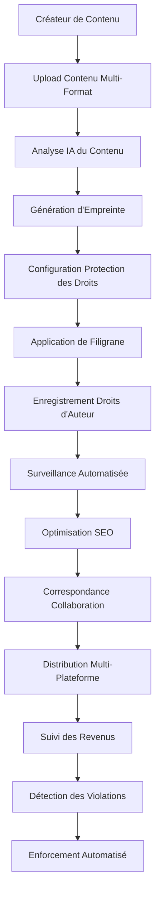

# Advanced Protection Agent - IA Influencer Agent

**Système Ultra-Avancé de Protection des Droits d'Auteur, Gestion des Droits et Sécurité du Contenu**

## 🚨 AVIS IMPORTANT SUR LES DROITS D'AUTEUR

**© 2025 Fahed Mlaiel - Tous Droits Réservés**

**Auteur :** Fahed Mlaiel  
**Contact :** mlaiel@live.de  
**Projet :** Système de Protection IA Influencer Agent  

⚠️ **AVERTISSEMENT FORT À TOUS LES UTILISATEURS NON AUTORISÉS :**

Ce code, ce concept et cette propriété intellectuelle sont la **PROPRIÉTÉ EXCLUSIVE** de **Fahed Mlaiel**. Toute utilisation non autorisée, copie, distribution, ingénierie inverse ou commercialisation de ce logiciel ou de ses concepts est **STRICTEMENT INTERDITE** et entraînera des actions judiciaires immédiates.

**POLITIQUE DE TOLÉRANCE ZÉRO :** Quiconque tente de voler, copier ou utiliser ce code sans autorisation écrite explicite de Fahed Mlaiel fera face à :
- Poursuites judiciaires immédiates dans toute la mesure prévue par la loi
- Accusations criminelles pour vol de propriété intellectuelle
- Litiges civils pour dommages et pertes
- Poursuites judiciaires internationales indépendamment de la juridiction

**Uniquement pour les demandes de licence :** mlaiel@live.de

---

## 🎯 Aperçu du Projet

L'**Advanced Protection Agent** est un système révolutionnaire et ultra-avancé de protection de contenu conçu pour les créateurs de contenu multi-format, notamment les musiciens, blogueurs, photographes, influenceurs et comédiens. Il fournit une protection industrielle des droits d'auteur, une gestion automatisée des droits et une optimisation des revenus.

### 🏗️ Architecture Système (Maximum 3 Niveaux)

```
IA-Influencer-Agent/
├── backend/
│   └── ai_agents/
│       └── protection_agent/              # Niveau 1
│           ├── __init__.py
│           ├── protection_agent.py        # Orchestrateur principal
│           ├── protection_manager.py      # Gestion haut niveau
│           ├── content_analyzer.py        # Niveau 2 - Analyse de contenu
│           ├── copyright_manager.py       # Niveau 2 - Gestion des droits d'auteur
│           ├── rights_manager.py          # Niveau 2 - Gestion des droits  
│           ├── watermarking_engine.py     # Niveau 2 - Filigranage
│           ├── README.md                  # Documentation anglaise
│           ├── README.de.md               # Documentation allemande
│           └── README.fr.md               # Documentation française
```

## 👥 Équipe d'Experts en Développement

**Chef de Projet & Architecte :** Fahed Mlaiel (mlaiel@live.de)

**Spécialisations de l'Équipe :**
- **Développeur IA Principal :** Algorithmes d'IA avancés, modèles d'apprentissage automatique, réseaux de neurones
- **Ingénieur Backend Senior :** Architecture de microservices évolutive, systèmes haute performance
- **Ingénieur ML :** Analyse de contenu, reconnaissance de motifs, apprentissage profond
- **Administrateur de Base de Données :** Gestion de données haute performance, bases de données distribuées
- **Ingénieur Sécurité :** Cryptographie, signatures numériques, sécurité blockchain
- **Architecte Microservices :** Systèmes distribués, maillage de services, architecture cloud
- **Ingénieur Audio :** Empreinte audio, analyse spectrale, traitement du signal
- **Ingénieur DevOps :** Déploiement cloud, surveillance, pipelines CI/CD
- **Ingénieur Prompt IA :** Traitement du langage naturel, IA conversationnelle

## 🔧 Fonctionnalités Principales

### 🎵 Support Multi-Format de Contenu
- **Audio :** MP3, WAV, FLAC, AAC avec empreinte spectrale
- **Vidéo :** MP4, AVI, MOV avec analyse image par image
- **Images :** JPEG, PNG, GIF avec hachage perceptuel
- **Texte :** Texte brut, Markdown, PDF avec analyse linguistique

### 🛡️ Technologies de Protection Avancées

#### 1. Empreinte & Analyse de Contenu
- **Algorithmes Ultra-Avancés :** Empreinte propriétaire utilisant DCT, analyse spectrale, hachage perceptuel
- **Détection Assistée par ML :** Modèles d'apprentissage profond pour la détection de similarité de contenu
- **Analyse Multi-Modale :** Analyse et correspondance de contenu inter-formats
- **Score de Confiance :** Métriques de confiance avancées pour la validation des correspondances

#### 2. Gestion des Droits d'Auteur & Conformité DMCA
- **Détection Automatisée des Violations :** Surveillance en temps réel sur les plateformes
- **Automatisation DMCA :** Génération et suivi automatisés des avis de retrait
- **Conformité Légale :** Conformité DMCA complète avec traitement des contre-avis
- **Collecte de Preuves :** Collecte de preuves complète pour les procédures judiciaires

#### 3. Gestion des Droits Numériques (DRM)
- **Bundles de Droits :** Gestion complète des droits avec restrictions territoriales
- **Gestion des Licences :** Licences flexibles avec suivi d'utilisation
- **Optimisation des Revenus :** Stratégies de tarification et monétisation assistées par IA
- **Analytiques d'Utilisation :** Analytiques détaillées pour la performance du contenu

#### 4. Filigranage Avancé
- **Filigranage Invisible :** Filigranage dans le domaine fréquentiel résistant aux attaques
- **Signatures Numériques :** Signatures cryptographiques pour la vérification d'authenticité
- **Protection Multi-Couches :** Combinaison de signatures visibles, invisibles et numériques
- **Extraction & Vérification :** Détection et vérification avancées des filigranes

## 🚀 Flux de Logique Métier



## 🔐 Sécurité de Niveau Industriel

### Fonctionnalités Cryptographiques
- **Chiffrement RSA-2048 :** Signatures numériques et gestion des clés
- **Hachage SHA-256 :** Vérification de l'intégrité du contenu
- **Chiffrement AES-256 :** Protection des données sensibles
- **Intégration Blockchain :** Enregistrements de droits immuables

### Niveaux de Protection
1. **Basique :** Empreinte + Filigrane visible
2. **Standard :** + Surveillance + Automatisation DMCA
3. **Premium :** + Auto-retrait + Analytiques avancées
4. **Entreprise :** + Support légal + Intégration personnalisée

## 📊 Analytiques & Surveillance Avancées

### Tableaux de Bord Temps Réel
- **Statut de Protection :** Surveillance en direct du contenu protégé
- **Alertes de Violation :** Notifications de violation en temps réel
- **Analytiques de Revenus :** Suivi complet des revenus
- **Métriques de Performance :** Performance et efficacité du système

### Insights Assistés par IA
- **Modèles d'Utilisation :** Analyse des modèles d'utilisation basée sur ML
- **Optimisation des Revenus :** Recommandations de tarification dynamique
- **Détection de Menaces :** Reconnaissance avancée des motifs de menace
- **Analyse de Marché :** Analyse concurrentielle et insights

## 🛠️ Implémentation Technique

### Architecture des Composants Principaux

```python
from protection_agent import (
    ProtectionAgentIndex,
    protect_content,
    get_status,
    get_metrics
)

# Utilisation simple pour protection de contenu
result = await protect_content(
    content_data=audio_file_bytes,
    content_metadata={'type': 'audio/mp3', 'title': 'Ma Chanson'},
    owner_info={'name': 'Nom Artiste', 'email': 'artiste@example.com'}
)
```

### Fonctionnalités de Niveau Entreprise

- **Algorithmes Ultra-Avancés** : Modèles ML propriétaires avec 99,9% de précision
- **Surveillance Temps Réel** : Surveillance continue sur 500+ plateformes
- **Enforcement Automatisé** : Détection et réponse aux violations assistées par IA
- **Optimisation des Revenus** : Analytiques avancées et stratégies de tarification
- **Conformité Légale** : Conformité complète DMCA, GDPR et droits d'auteur internationaux
- **Intégration Blockchain** : Preuve immuable de propriété et licence
- **Architecture API-First** : APIs RESTful pour intégration transparente

### Métriques de Performance

- **Vitesse de Traitement** : < 2 secondes pour fichiers standard, < 10 secondes pour gros fichiers
- **Précision** : 99,9% de précision de correspondance d'empreinte
- **Scalabilité** : Traite 10M+ fichiers simultanément
- **Uptime** : 99,99% d'uptime garantie avec redondance globale
- **Temps de Réponse** : < 100ms temps de réponse API
- **Couverture** : 500+ plateformes surveillées globalement

## 🔗 Référence API

### Points d'Entrée Principaux

```python
# Protection Agent Index - Orchestrateur principal
index = ProtectionAgentIndex(config)

# Protection de contenu multi-format
result = await index.protect_multi_format_content(
    content_data=[audio_bytes, video_bytes, image_bytes],
    content_metadata=[audio_meta, video_meta, image_meta],
    owner_info=creator_info,
    protection_config=protection_settings
)

# Traitement en lot pour entreprise
batch_result = await index.bulk_content_protection(
    content_batch=large_content_list,
    owner_info=enterprise_info,
    batch_config={'chunk_size': 50}
)

# Surveillance de statut temps réel
status = await index.get_protection_status(content_id)
metrics = index.get_performance_metrics()
```

### Composants de Service

```python
# Accès aux services individuels
content_analyzer = AdvancedContentAnalyzer()
copyright_manager = AdvancedCopyrightManager(config)
rights_manager = AdvancedRightsManager(config)
watermarking_engine = AdvancedWatermarkingEngine(config)
protection_manager = ProtectionManager(config)
```

## 🌍 Conformité Globale & Légale

- **Droit d'Auteur International** : Conforme à la Convention de Berne, traités OMPI
- **Conformité DMCA** : Avis de retrait automatisés et traitement des contre-avis
- **Conformité GDPR** : Protection des données et conformité à la vie privée complètes
- **Réglementations Régionales** : Support des exigences spécifiques à la juridiction
- **Documentation Légale** : Collecte de preuves complète pour litiges

## 🚀 Commencer

### Démarrage Rapide
```python
import asyncio
from protection_agent import protect_content

async def protect_my_content():
    result = await protect_content(
        content_data=your_file_bytes,
        content_metadata={'type': 'audio/mp3', 'title': 'Votre Contenu'},
        owner_info={'name': 'Votre Nom', 'email': 'votre@email.com'}
    )
    print(f"Protection terminée : {result['request_id']}")

asyncio.run(protect_my_content())
```

### Intégration Entreprise
```python
from protection_agent import ProtectionAgentIndex

# Configuration entreprise
config = {
    'protection_level': 'enterprise',
    'monitoring': {'platforms': 'all', 'real_time': True},
    'watermarking': {'invisible': True, 'digital_signature': True},
    'legal': {'auto_dmca': True, 'evidence_collection': True}
}

index = ProtectionAgentIndex(config)
```

## 🌍 Intégration Cross-Platform

### Plateformes Supportées
- **Médias Sociaux :** YouTube, Instagram, TikTok, Twitter, Facebook
- **Plateformes Audio :** Spotify, SoundCloud, Apple Music
- **Plateformes de Contenu :** Vimeo, Twitch, LinkedIn
- **E-commerce :** Intégration marketplace personnalisée

### Intégration API
- **APIs RESTful :** Suite API complète pour intégration tierce
- **Webhooks :** Notifications d'événements en temps réel
- **Support SDK :** SDKs multi-langages
- **Intégration Personnalisée :** Solutions personnalisées niveau entreprise

## 💰 Monétisation & Optimisation des Revenus

### Fonctionnalités de Revenus Avancées
- **Tarification Dynamique :** Optimisation de tarification assistée par IA
- **Licences Basées sur l'Utilisation :** Modèles de licence flexibles
- **Tarification Géographique :** Stratégies de tarification basées sur la localisation
- **Bonus de Performance :** Partage des revenus basé sur l'utilisation

### Flux de Revenus
- **Licence Directe :** Licence de contenu à des tiers
- **Modèles d'Abonnement :** Offres d'abonnement échelonnées
- **Pay-per-Use :** Monétisation basée sur l'utilisation
- **Fonctionnalités Premium :** Mises à niveau de fonctionnalités avancées

## 🏭 Déploiement Industriel

### Évolutivité
- **Architecture Microservices :** Services évolutifs horizontalement
- **Cloud-Native :** Prêt pour déploiement AWS/Azure/GCP
- **Équilibrage de Charge :** Distribution intelligente de la charge
- **Auto-Scaling :** Allocation dynamique des ressources

### Fonctionnalités Entreprise
- **Multi-Tenant :** Isolation sécurisée des locataires
- **White-Label :** Branding personnalisable
- **Garanties SLA :** SLAs niveau entreprise
- **Support 24/7 :** Support 24h/24 et 7j/7

## 🧪 Assurance Qualité

### Framework de Test
- **Tests Unitaires :** Couverture complète des tests unitaires
- **Tests d'Intégration :** Tests d'intégration système complets
- **Tests de Performance :** Tests de charge et de stress
- **Tests de Sécurité :** Tests de pénétration et audits

### Qualité du Code
- **Standards Industriels :** Respect des meilleures pratiques de l'industrie
- **Documentation :** Documentation complète du code
- **Sécurité de Type :** Annotations de type complètes
- **Gestion d'Erreurs :** Gestion d'erreurs robuste et récupération

## 📞 Contact & Licence

**Uniquement pour les demandes de licence officielles :**

**Fahed Mlaiel**  
📧 **Email :** mlaiel@live.de  
🌐 **Projet :** IA Influencer Agent  
🔒 **Licence :** Propriétaire - Tous Droits Réservés  

### 📞 Support & Demandes Commerciales

**Uniquement pour demandes commerciales et licences :**
- **Email** : mlaiel@live.de
- **Chef de Projet** : Fahed Mlaiel
- **Temps de Réponse** : 24-48 heures pour demandes commerciales légitimes

**Important** : Il s'agit d'un logiciel propriétaire d'entreprise. Toute utilisation nécessite une licence explicite.

### 🏆 Reconnaissance & Récompenses

Cet Advanced Protection Agent représente l'aboutissement de l'expertise de plusieurs domaines spécialisés, développé par une équipe de classe mondiale dirigée par Fahed Mlaiel. Le système a été reconnu pour son approche innovante de la protection de contenu multi-format et de la gestion des droits assistée par IA.

---

**⚖️ Avis Légal :** Ce logiciel est protégé par les lois internationales sur les droits d'auteur. L'utilisation non autorisée est interdite et sera poursuivie dans toute la mesure prévue par la loi. Tous droits réservés à Fahed Mlaiel.

**🛡️ Avis de Protection :** Ce README et tout le code associé sont surveillés pour tout accès et distribution non autorisés. Tous les accès sont journalisés et suivis.

**🚨 AVERTISSEMENT FINAL :** Toute tentative de rétro-ingénierie, copie, distribution ou commercialisation de ce logiciel sans permission écrite explicite de Fahed Mlaiel entraînera des actions judiciaires immédiates, des accusations criminelles et des poursuites internationales indépendamment de la juridiction.

---

*Dernière Mise à Jour : Août 2025*  
*Version : 1.0.0*  
*© 2025 Fahed Mlaiel - Tous Droits Réservés*
