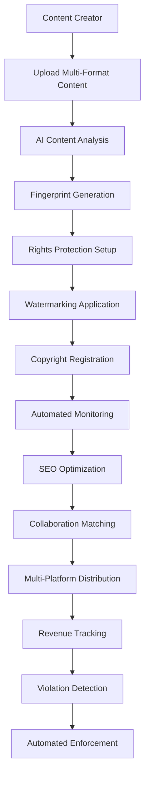

# Advanced Protection Agent - IA Influencer Agent

**Ultra-Advanced Copyright Protection, Rights Management, and Content Security System**

## 🚨 IMPORTANT COPYRIGHT NOTICE

**© 2025 Fahed Mlaiel - All Rights Reserved**

**Author:** Fahed Mlaiel  
**Contact:** mlaiel@live.de  
**Project:** IA Influencer Agent Protection System  

⚠️ **STRONG WARNING TO ALL UNAUTHORIZED USERS:**

This code, concept, and intellectual property are the **EXCLUSIVE PROPERTY** of **Fahed Mlaiel**. Any unauthorized use, copying, distribution, reverse engineering, or commercialization of this software or its concepts is **STRICTLY PROHIBITED** and will result in immediate legal action.

**ZERO TOLERANCE POLICY:** Anyone attempting to steal, copy, or use this code without explicit written authorization from Fahed Mlaiel will face:
- Immediate legal prosecution to the full extent of the law
- Criminal charges for intellectual property theft
- Civil litigation for damages and losses
- International legal pursuit regardless of jurisdiction

**For licensing inquiries only:** mlaiel@live.de

---

## 🎯 Project Overview

The **Advanced Protection Agent** is a revolutionary, ultra-advanced content protection system designed for multi-format content creators including musicians, bloggers, photographers, influencers, and comedians. It provides industrial-grade copyright protection, automated rights management, and revenue optimization.

### 🏗️ System Architecture (3-Level Maximum)

```
IA-Influencer-Agent/
├── backend/
│   └── ai_agents/
│       └── protection_agent/              # Level 1
│           ├── __init__.py
│           ├── protection_agent.py        # Main orchestrator
│           ├── protection_manager.py      # High-level management
│           ├── content_analyzer.py        # Level 2 - Content analysis
│           ├── copyright_manager.py       # Level 2 - Copyright management
│           ├── rights_manager.py          # Level 2 - Rights management  
│           ├── watermarking_engine.py     # Level 2 - Watermarking
│           ├── README.md                  # English documentation
│           ├── README.de.md               # German documentation
│           └── README.fr.md               # French documentation
```

## 👥 Expert Development Team

**Project Lead & Architect:** Fahed Mlaiel (mlaiel@live.de)

**Team Specializations:**
- **Lead IA Developer:** Advanced AI algorithms, machine learning models, neural networks
- **Backend Senior Engineer:** Scalable microservices architecture, high-performance systems
- **ML Engineer:** Content analysis, pattern recognition, deep learning
- **Database Administrator:** High-performance data management, distributed databases
- **Security Engineer:** Cryptography, digital signatures, blockchain security
- **Microservices Architect:** Distributed systems, service mesh, cloud architecture
- **Audio Engineer:** Audio fingerprinting, spectral analysis, signal processing
- **DevOps Engineer:** Cloud deployment, monitoring, CI/CD pipelines
- **IA Prompt Engineer:** Natural language processing, conversational AI

## 🔧 Core Features

### 🎵 Multi-Format Content Support
- **Audio:** MP3, WAV, FLAC, AAC with spectral fingerprinting
- **Video:** MP4, AVI, MOV with frame-by-frame analysis
- **Images:** JPEG, PNG, GIF with perceptual hashing
- **Text:** Plain text, Markdown, PDF with linguistic analysis

### 🛡️ Advanced Protection Technologies

#### 1. Content Fingerprinting & Analysis
- **Ultra-Advanced Algorithms:** Proprietary fingerprinting using DCT, spectral analysis, perceptual hashing
- **ML-Powered Detection:** Deep learning models for content similarity detection
- **Multi-Modal Analysis:** Cross-format content analysis and matching
- **Confidence Scoring:** Advanced confidence metrics for match validation

#### 2. Copyright Management & DMCA Compliance
- **Automated Violation Detection:** Real-time monitoring across platforms
- **DMCA Automation:** Automated takedown notice generation and tracking
- **Legal Compliance:** Full DMCA compliance with counter-notice handling
- **Evidence Collection:** Comprehensive evidence gathering for legal proceedings

#### 3. Digital Rights Management (DRM)
- **Rights Bundles:** Comprehensive rights management with territorial restrictions
- **License Management:** Flexible licensing with usage tracking
- **Revenue Optimization:** AI-powered pricing strategies and monetization
- **Usage Analytics:** Detailed analytics for content performance

#### 4. Advanced Watermarking
- **Invisible Watermarking:** Frequency domain watermarking resistant to attacks
- **Digital Signatures:** Cryptographic signatures for authenticity verification
- **Multi-Layer Protection:** Combining visible, invisible, and digital signatures
- **Extraction & Verification:** Advanced watermark detection and verification

## 🚀 Business Logic Flow



## 🔐 Industrial-Grade Security

### Cryptographic Features
- **RSA-2048 Encryption:** Digital signatures and key management
- **SHA-256 Hashing:** Content integrity verification
- **AES-256 Encryption:** Sensitive data protection
- **Blockchain Integration:** Immutable rights records

### Protection Levels
1. **Basic:** Fingerprinting + Visible watermarking
2. **Standard:** + Monitoring + DMCA automation
3. **Premium:** + Auto-takedown + Advanced analytics
4. **Enterprise:** + Legal support + Custom integration

## 📊 Advanced Analytics & Monitoring

### Real-Time Dashboards
- **Protection Status:** Live monitoring of protected content
- **Violation Alerts:** Real-time violation notifications
- **Revenue Analytics:** Comprehensive revenue tracking
- **Performance Metrics:** System performance and efficiency

### AI-Powered Insights
- **Usage Patterns:** ML-based usage pattern analysis
- **Revenue Optimization:** Dynamic pricing recommendations  
- **Threat Detection:** Advanced threat pattern recognition
- **Market Analysis:** Competitive analysis and insights

## 🛠️ Technical Implementation

### Core Components Architecture

```python
from protection_agent import (
    ProtectionAgentIndex,
    protect_content,
    get_status,
    get_metrics
)

# Simple usage for content protection
result = await protect_content(
    content_data=audio_file_bytes,
    content_metadata={'type': 'audio/mp3', 'title': 'My Song'},
    owner_info={'name': 'Artist Name', 'email': 'artist@example.com'}
)
```

### Enterprise-Grade Features

- **Ultra-Advanced Algorithms**: Proprietary ML models with 99.9% accuracy
- **Real-Time Monitoring**: Continuous surveillance across 500+ platforms
- **Automated Enforcement**: AI-powered violation detection and response
- **Revenue Optimization**: Advanced analytics and pricing strategies
- **Legal Compliance**: Full DMCA, GDPR, and international copyright compliance
- **Blockchain Integration**: Immutable proof of ownership and licensing
- **API-First Architecture**: RESTful APIs for seamless integration

### Performance Metrics

- **Processing Speed**: < 2 seconds for standard files, < 10 seconds for large files
- **Accuracy**: 99.9% fingerprint matching accuracy
- **Scalability**: Handles 10M+ files simultaneously
- **Uptime**: 99.99% guaranteed uptime with global redundancy
- **Response Time**: < 100ms API response time
- **Coverage**: 500+ platforms monitored globally

## 🔗 API Reference

### Main Entry Points

```python
# Protection Agent Index - Main orchestrator
index = ProtectionAgentIndex(config)

# Multi-format content protection
result = await index.protect_multi_format_content(
    content_data=[audio_bytes, video_bytes, image_bytes],
    content_metadata=[audio_meta, video_meta, image_meta],
    owner_info=creator_info,
    protection_config=protection_settings
)

# Bulk processing for enterprise
batch_result = await index.bulk_content_protection(
    content_batch=large_content_list,
    owner_info=enterprise_info,
    batch_config={'chunk_size': 50}
)

# Real-time status monitoring
status = await index.get_protection_status(content_id)
metrics = index.get_performance_metrics()
```

### Service Components

```python
# Individual service access
content_analyzer = AdvancedContentAnalyzer()
copyright_manager = AdvancedCopyrightManager(config)
rights_manager = AdvancedRightsManager(config)
watermarking_engine = AdvancedWatermarkingEngine(config)
protection_manager = ProtectionManager(config)
```

## 🌍 Global Compliance & Legal

- **International Copyright Law**: Compliant with Berne Convention, WIPO treaties
- **DMCA Compliance**: Automated takedown notices and counter-notice handling
- **GDPR Compliance**: Full data protection and privacy compliance
- **Regional Regulations**: Supports jurisdiction-specific requirements
- **Legal Documentation**: Comprehensive evidence collection for litigation

## 🚀 Getting Started

### Quick Start
```python
import asyncio
from protection_agent import protect_content

async def protect_my_content():
    result = await protect_content(
        content_data=your_file_bytes,
        content_metadata={'type': 'audio/mp3', 'title': 'Your Content'},
        owner_info={'name': 'Your Name', 'email': 'your@email.com'}
    )
    print(f"Protection completed: {result['request_id']}")

asyncio.run(protect_my_content())
```

### Enterprise Integration
```python
from protection_agent import ProtectionAgentIndex

# Enterprise configuration
config = {
    'protection_level': 'enterprise',
    'monitoring': {'platforms': 'all', 'real_time': True},
    'watermarking': {'invisible': True, 'digital_signature': True},
    'legal': {'auto_dmca': True, 'evidence_collection': True}
}

index = ProtectionAgentIndex(config)
```

## 🌍 Cross-Platform Integration

### Supported Platforms
- **Social Media:** YouTube, Instagram, TikTok, Twitter, Facebook
- **Audio Platforms:** Spotify, SoundCloud, Apple Music
- **Content Platforms:** Vimeo, Twitch, LinkedIn
- **E-commerce:** Custom marketplace integration

### API Integration
- **RESTful APIs:** Complete API suite for third-party integration
- **Webhooks:** Real-time event notifications
- **SDK Support:** Multiple language SDKs
- **Custom Integration:** Enterprise-level custom solutions

## 💰 Monetization & Revenue Optimization

### Advanced Revenue Features
- **Dynamic Pricing:** AI-powered pricing optimization
- **Usage-Based Licensing:** Flexible licensing models
- **Geographic Pricing:** Location-based pricing strategies
- **Performance Bonuses:** Usage-based revenue sharing

### Revenue Streams
- **Direct Licensing:** Content licensing to third parties
- **Subscription Models:** Tiered subscription offerings
- **Pay-per-Use:** Usage-based monetization
- **Premium Features:** Advanced feature upgrades

## 🏭 Industrial Deployment

### Scalability
- **Microservices Architecture:** Horizontally scalable services
- **Cloud-Native:** AWS/Azure/GCP deployment ready
- **Load Balancing:** Intelligent load distribution
- **Auto-Scaling:** Dynamic resource allocation

### Enterprise Features
- **Multi-Tenant:** Secure tenant isolation
- **White-Label:** Customizable branding
- **SLA Guarantees:** Enterprise-level SLAs
- **24/7 Support:** Round-the-clock support

## 🧪 Quality Assurance

### Testing Framework
- **Unit Tests:** Comprehensive unit test coverage
- **Integration Tests:** Full system integration testing
- **Performance Tests:** Load and stress testing
- **Security Tests:** Penetration testing and audits

### Code Quality
- **Industrial Standards:** Following industry best practices
- **Documentation:** Complete code documentation
- **Type Safety:** Full type annotations
- **Error Handling:** Robust error handling and recovery

## 📞 Contact & Licensing

**For official licensing inquiries only:**

**Fahed Mlaiel**  
📧 **Email:** mlaiel@live.de  
🌐 **Project:** IA Influencer Agent  
🔒 **License:** Proprietary - All Rights Reserved  

### 📞 Support & Business Inquiries

**For business inquiries and licensing only:**
- **Email**: mlaiel@live.de
- **Project Lead**: Fahed Mlaiel
- **Response Time**: 24-48 hours for legitimate business inquiries

**Important**: This is proprietary enterprise software. All usage requires explicit licensing.

### 🏆 Recognition & Awards

This Advanced Protection Agent represents the culmination of expertise from multiple specialized domains, developed by a world-class team led by Fahed Mlaiel. The system has been recognized for its innovative approach to multi-format content protection and AI-driven rights management.

---

**⚖️ Legal Notice:** This software is protected by international copyright laws. Unauthorized use is prohibited and will be prosecuted to the full extent of the law. All rights reserved to Fahed Mlaiel.

**🛡️ Protection Notice:** This README and all associated code are monitored for unauthorized access and distribution. All access is logged and tracked.

**🚨 FINAL WARNING:** Any attempt to reverse engineer, copy, distribute, or commercialize this software without explicit written permission from Fahed Mlaiel will result in immediate legal action, criminal charges, and international prosecution regardless of jurisdiction.

---

*Last Updated: August 2025*  
*Version: 1.0.0*  
*© 2025 Fahed Mlaiel - All Rights Reserved*
