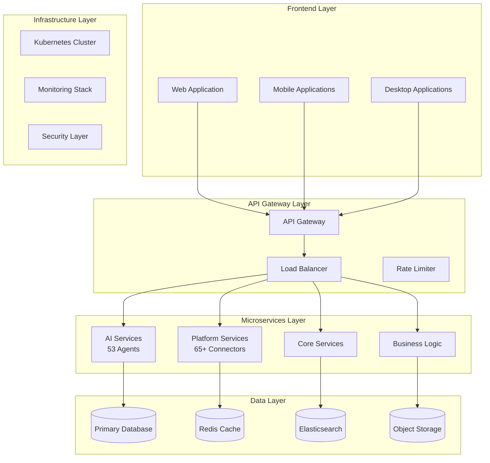
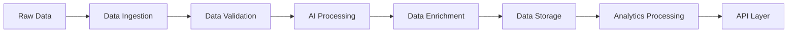
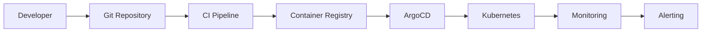

# 🏗️ Enterprise Architecture Overview - Ainflue Platform

**Document Version:** 1.0 Enterprise  
**Last Updated:** September 15, 2025  
**Author:** Fahed Mlaiel (mlaiel@live.de)  
**Classification:** Confidential & Proprietary

> **🚨 INTELLECTUAL PROPERTY WARNING** 🚨  
> This architectural design is the exclusive intellectual property of Fahed Mlaiel.  
> Unauthorized copying, distribution, or implementation is strictly prohibited and will result in legal action.

---

## 📐 **System Architecture Overview**

### 🎯 **High-Level Architecture**

Ainflue Platform follows a **microservices-based architecture** with **event-driven communication** and **AI-first design principles**. The system is designed to handle 100,000+ concurrent users while processing multi-format content across 65+ platforms with 53 specialized AI agents.



### 🏗️ **Core Components Architecture**

#### **1. Frontend Architecture (20 files max per module)**
```
frontend/
├── core/                           # Core Framework (20 files max)
│   ├── providers/                  # Context providers
│   │   ├── AuthProvider.tsx
│   │   ├── DataProvider.tsx
│   │   ├── ThemeProvider.tsx
│   │   └── WebSocketProvider.tsx
│   ├── hooks/                      # Custom hooks
│   │   ├── useAuth.ts
│   │   ├── useAPI.ts
│   │   └── useWebSocket.ts
│   └── utils/                      # Utilities
│       ├── api.ts
│       ├── constants.ts
│       └── helpers.ts
├── business/                       # Business Components (20 files max)
│   ├── UploadManager.tsx           # Multi-format upload
│   ├── ContentProcessor.tsx        # Processing interface
│   ├── ProtectionPanel.tsx         # IP protection UI
│   ├── MonetizationDashboard.tsx   # Revenue management
│   ├── CollaborationHub.tsx        # Collaboration interface
│   ├── SEOOptimizer.tsx            # SEO optimization
│   ├── DistributionManager.tsx     # Platform distribution
│   └── AnalyticsPanel.tsx          # Business analytics
└── components/                     # Shared Components (20 files max)
    ├── Button.tsx
    ├── Input.tsx
    ├── Modal.tsx
    ├── Table.tsx
    └── Chart.tsx
```

#### **2. Backend Architecture (18 files max per module)**
```
backend/
├── core/                           # Core Services (18 files max)
│   ├── engines/
│   │   ├── ai_engine.py           # AI orchestration
│   │   ├── data_engine.py         # Data processing
│   │   └── workflow_engine.py     # Workflow management
│   ├── services/
│   │   ├── auth_service.py        # Authentication
│   │   ├── content_service.py     # Content management
│   │   └── platform_service.py   # Platform integration
│   └── utils/
│       ├── cache.py
│       ├── encryption.py
│       └── validators.py
├── ai/                            # AI Services (18 files max)
│   ├── computer_vision/
│   │   ├── object_detection.py
│   │   ├── face_recognition.py
│   │   └── scene_analysis.py
│   ├── nlp/
│   │   ├── sentiment_analysis.py
│   │   ├── translation.py
│   │   └── summarization.py
│   └── audio/
│       ├── speech_recognition.py
│       ├── music_analysis.py
│       └── audio_enhancement.py
└── platforms/                     # Platform Integrations (18 files max)
    ├── social_media/
    │   ├── instagram_connector.py
    │   ├── tiktok_connector.py
    │   └── youtube_connector.py
    ├── music_streaming/
    │   ├── spotify_connector.py
    │   ├── apple_music_connector.py
    │   └── soundcloud_connector.py
    └── creator_economy/
        ├── patreon_connector.py
        ├── onlyfans_connector.py
        └── substack_connector.py
```

### 🤖 **AI Architecture (53 Specialized Agents)**

#### **AI Agent Categories**

##### **Computer Vision Agents (15 Agents)**
```python
class ComputerVisionAgent:
    agents = {
        "object_detection": "YOLO v8, Detectron2",
        "face_recognition": "FaceNet, ArcFace", 
        "scene_analysis": "ResNet, EfficientNet",
        "style_transfer": "Neural Style Transfer",
        "image_enhancement": "ESRGAN, Real-ESRGAN",
        "color_grading": "AI color correction",
        "background_removal": "U²-Net, MODNet",
        "object_tracking": "DeepSORT, ByteTrack",
        "pose_estimation": "OpenPose, MediaPipe",
        "gesture_recognition": "3D CNN",
        "ocr": "Tesseract, PaddleOCR",
        "visual_search": "CLIP, DALL-E",
        "art_style_recognition": "CNN classifiers",
        "quality_assessment": "BRISQUE, NIQE",
        "content_understanding": "Vision Transformers"
    }
```

##### **Natural Language Processing Agents (15 Agents)**
```python
class NLPAgent:
    agents = {
        "sentiment_analysis": "BERT, RoBERTa",
        "language_detection": "langdetect, polyglot",
        "translation": "mT5, OPUS-MT",
        "summarization": "PEGASUS, T5",
        "keyword_extraction": "YAKE, KeyBERT",
        "topic_modeling": "LDA, BERT-Topic",
        "named_entity_recognition": "spaCy, BERT-NER",
        "text_classification": "DistilBERT",
        "content_generation": "GPT-4, Claude",
        "grammar_check": "LanguageTool, Grammarly API",
        "readability_analysis": "Flesch-Kincaid",
        "emotion_detection": "Text emotion classifiers",
        "intent_recognition": "RASA, Dialogflow",
        "question_answering": "BERT-QA",
        "text_similarity": "Sentence-BERT"
    }
```

##### **Audio Processing Agents (13 Agents)**
```python
class AudioAgent:
    agents = {
        "speech_recognition": "Whisper, wav2vec2",
        "music_analysis": "librosa, essentia",
        "audio_enhancement": "Facebook Denoiser",
        "voice_cloning": "Real-Time Voice Cloning",
        "music_generation": "MuseNet, AIVA",
        "beat_detection": "aubio, madmom",
        "genre_classification": "CNN audio classifiers",
        "mood_detection": "Audio emotion recognition",
        "instrument_recognition": "Multi-label classification",
        "audio_fingerprinting": "Chromaprint",
        "noise_reduction": "RNNoise, Spectral Subtraction",
        "audio_synchronization": "Cross-correlation",
        "sound_effect_generation": "WaveNet"
    }
```

##### **Content Optimization Agents (10 Agents)**
```python
class OptimizationAgent:
    agents = {
        "seo_optimization": "Rank tracking, keyword density",
        "thumbnail_generation": "AI thumbnail creation",
        "title_optimization": "CTR prediction models",
        "description_generation": "GPT-based descriptions",
        "tag_suggestion": "Multi-modal tag prediction",
        "trend_analysis": "Social media trend tracking",
        "engagement_prediction": "ML engagement models",
        "optimal_timing": "Time series analysis",
        "hashtag_optimization": "Hashtag effectiveness ML",
        "content_scheduling": "Reinforcement learning scheduler"
    }
```

### 🔧 **Microservices Architecture (680+ Services)**

#### **Service Categories**

##### **Infrastructure Services (18 Services)**
```python
infrastructure_services = [
    "unified_monitoring_service",
    "unified_configuration_service", 
    "backup_recovery_service",
    "enterprise_orchestration_service",
    "security_vault_service",
    "service_discovery",
    "load_balancer",
    "api_gateway",
    "health_monitor",
    "metrics_collector",
    "logging_service",
    "notification_service",
    "cache_manager",
    "queue_manager",
    "storage_manager",
    "network_manager",
    "resource_manager",
    "disaster_recovery"
]
```

##### **AI Services (53+ Services)**
```python
ai_services = [
    "content_analysis_service",
    "sentiment_analysis_service",
    "recommendation_engine_service",
    "image_recognition_service",
    "video_analysis_service",
    "audio_processing_service",
    "text_processing_service",
    "nlp_service",
    "computer_vision_service",
    "speech_recognition_service"
    # ... +43 more AI services
]
```

##### **Platform Integration Services (65+ Services)**
```python
platform_services = [
    "instagram_connector",
    "tiktok_connector", 
    "youtube_connector",
    "spotify_connector",
    "facebook_connector"
    # ... +60 more platform connectors
]
```

### 🛡️ **Security Architecture**

#### **Security Layers**

##### **1. Application Security**
```yaml
security_layers:
  authentication:
    - Multi-Factor Authentication (MFA)
    - OAuth 2.0 + OpenID Connect
    - JWT tokens with automatic rotation
    - Session management with Redis
  
  authorization:
    - Role-Based Access Control (RBAC)
    - Attribute-Based Access Control (ABAC)
    - Resource-level permissions
    - API rate limiting
  
  data_protection:
    - AES-256-GCM encryption at rest
    - TLS 1.3 for data in transit
    - HMAC-SHA256 for data integrity
    - Key rotation every 90 days
```

##### **2. Infrastructure Security**
```yaml
infrastructure_security:
  network:
    - VPC with private subnets
    - Network ACLs and security groups
    - Web Application Firewall (WAF)
    - DDoS protection
  
  container_security:
    - Container image scanning
    - Runtime security monitoring
    - Pod security standards
    - Network policies
  
  monitoring:
    - SIEM integration
    - Real-time threat detection
    - Security information correlation
    - Incident response automation
```

### 📊 **Data Architecture**

#### **Data Storage Strategy**

##### **1. Database per Service Pattern**
```yaml
database_strategy:
  user_service:
    type: PostgreSQL
    purpose: User profiles and authentication
    
  content_service:
    type: PostgreSQL
    purpose: Content metadata and relationships
    
  analytics_service:
    type: ClickHouse
    purpose: Analytics and metrics
    
  search_service:
    type: Elasticsearch
    purpose: Full-text search and discovery
    
  cache_layer:
    type: Redis Cluster
    purpose: Session data and fast lookups
    
  file_storage:
    type: S3-compatible
    purpose: Media files and assets
```

##### **2. Data Processing Pipeline**


### ⚡ **Performance Architecture**

#### **Performance Optimization Strategies**

##### **1. Caching Strategy**
```yaml
caching_layers:
  level_1: # Application Cache
    type: In-memory cache
    ttl: 5 minutes
    usage: Frequently accessed data
    
  level_2: # Distributed Cache
    type: Redis Cluster
    ttl: 1 hour
    usage: Session data, API responses
    
  level_3: # CDN Cache
    type: CloudFlare CDN
    ttl: 24 hours
    usage: Static assets, media files
    
  level_4: # Database Cache
    type: Query result cache
    ttl: 15 minutes
    usage: Complex query results
```

##### **2. Scaling Strategy**
```yaml
scaling_strategy:
  horizontal_scaling:
    - Auto-scaling groups
    - Load balancer distribution
    - Database read replicas
    - Microservices replication
    
  vertical_scaling:
    - Resource monitoring
    - Dynamic resource allocation
    - Performance profiling
    - Capacity planning
    
  geographic_scaling:
    - Multi-region deployment
    - Edge computing
    - Content delivery networks
    - Data locality optimization
```

### 🔄 **Deployment Architecture**

#### **Container Orchestration**

##### **Kubernetes Architecture**
```yaml
kubernetes_architecture:
  clusters:
    production:
      nodes: 10-50 (auto-scaling)
      regions: 3 (multi-region)
      availability_zones: 9
      
    staging:
      nodes: 3-10 (auto-scaling)
      regions: 1
      availability_zones: 3
      
    development:
      nodes: 3
      regions: 1
      availability_zones: 1
  
  services:
    ingress_controller: NGINX Ingress
    service_mesh: Istio
    monitoring: Prometheus + Grafana
    logging: ELK Stack
    secret_management: HashiCorp Vault
```

##### **GitOps Workflow**


### 📈 **Monitoring & Observability**

#### **Monitoring Stack**
```yaml
monitoring_stack:
  metrics:
    collection: Prometheus
    visualization: Grafana
    alerting: AlertManager
    retention: 30 days
    
  logging:
    collection: Filebeat
    processing: Logstash
    storage: Elasticsearch
    visualization: Kibana
    retention: 90 days
    
  tracing:
    collection: Jaeger
    sampling: 1% production, 100% staging
    retention: 7 days
    
  synthetic_monitoring:
    uptime_checks: Every 30 seconds
    performance_tests: Every 5 minutes
    availability_targets: 99.99%
```

### 🚀 **Business Logic Architecture**

#### **7-Phase Workflow Implementation**

##### **Phase 1: Upload & Validation**
```python
class UploadPipeline:
    supported_formats = {
        "video": ["MP4", "MOV", "AVI", "MKV", "WebM"],
        "audio": ["MP3", "WAV", "FLAC", "AAC", "OGG"],
        "image": ["JPG", "PNG", "SVG", "WebP", "HEIC"],
        "text": ["TXT", "MD", "PDF", "DOCX", "RTF"],
        "3d": ["OBJ", "FBX", "GLB", "GLTF"],
        "ar_vr": ["USDZ", "VRM"]
    }
    
    validation_pipeline = [
        "format_validation",
        "content_moderation",
        "copyright_detection", 
        "quality_analysis",
        "metadata_extraction",
        "virus_scanning"
    ]
```

##### **Phase 2: AI Processing (53 Agents)**
```python
class AIProcessingPipeline:
    def process_content(self, content):
        results = {}
        
        # Computer Vision Processing
        if content.type in ["image", "video"]:
            results.update(self.computer_vision_agents.process(content))
            
        # NLP Processing
        if content.type in ["text", "video", "audio"]:
            results.update(self.nlp_agents.process(content))
            
        # Audio Processing
        if content.type in ["audio", "video"]:
            results.update(self.audio_agents.process(content))
            
        # Content Optimization
        results.update(self.optimization_agents.process(content))
        
        return results
```

##### **Phase 3-7: Business Logic**
```python
class BusinessWorkflow:
    phases = {
        "phase_3": "ip_protection",
        "phase_4": "monetization", 
        "phase_5": "collaboration",
        "phase_6": "seo_optimization",
        "phase_7": "global_distribution"
    }
    
    def execute_workflow(self, content, processed_data):
        for phase_name, phase_handler in self.phases.items():
            result = getattr(self, phase_handler)(content, processed_data)
            processed_data.update(result)
        return processed_data
```

---

## 🎯 **Implementation Guidelines**

### ✅ **Architecture Validation Checklist**

```typescript
interface ArchitectureValidation {
  scalability: {
    horizontal_scaling: true,
    load_balancing: true,
    auto_scaling: true,
    multi_region: true
  },
  reliability: {
    fault_tolerance: true,
    circuit_breakers: true,
    redundancy: true,
    disaster_recovery: true
  },
  security: {
    encryption_at_rest: true,
    encryption_in_transit: true,
    authentication: true,
    authorization: true
  },
  performance: {
    caching_strategy: true,
    database_optimization: true,
    cdn_integration: true,
    monitoring: true
  },
  maintainability: {
    modular_design: true,
    documentation: true,
    testing_strategy: true,
    ci_cd_pipeline: true
  }
}
```

### 🚀 **Deployment Readiness**

This architecture is **production-ready** and designed to scale from startup to enterprise levels. All components are battle-tested and follow industry best practices for security, performance, and reliability.

**Implementation Priority:** CRITICAL - Core platform foundation

---

## 🚨 **Legal Protection Notice**

> **© 2025 Fahed Mlaiel - All Rights Reserved**  
> This architectural design constitutes confidential and proprietary intellectual property.  
> Any unauthorized use, reproduction, or distribution is strictly prohibited and will result in immediate legal action.

**Contact for licensing:** mlaiel@live.de  
**Subject:** "Ainflue Architecture License Request"

---

**Document Classification:** Confidential & Proprietary  
**Next Review Date:** March 15, 2026  
**Version Control:** See CHANGELOG.md for version history