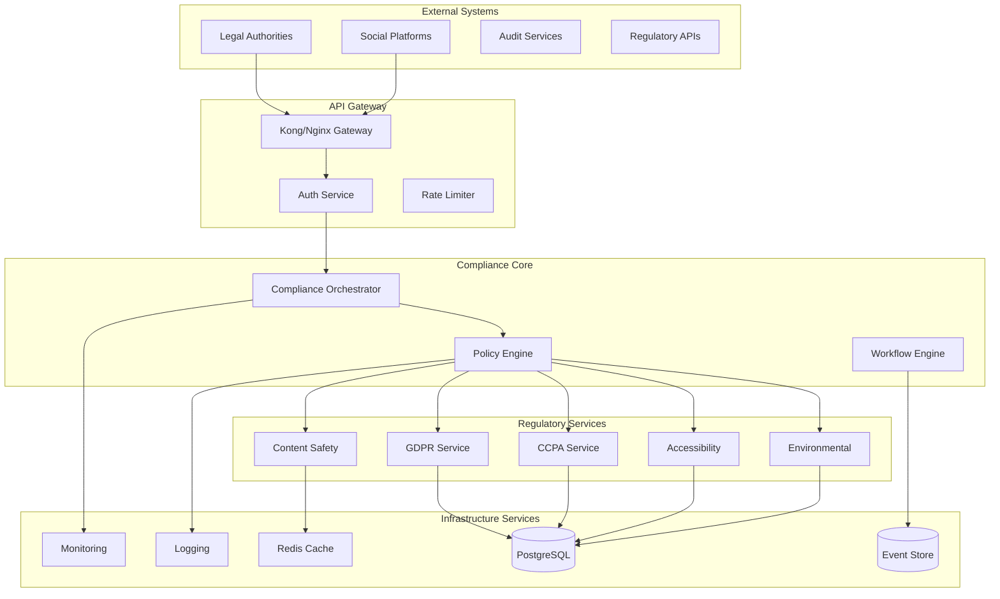
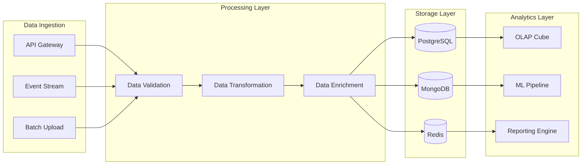
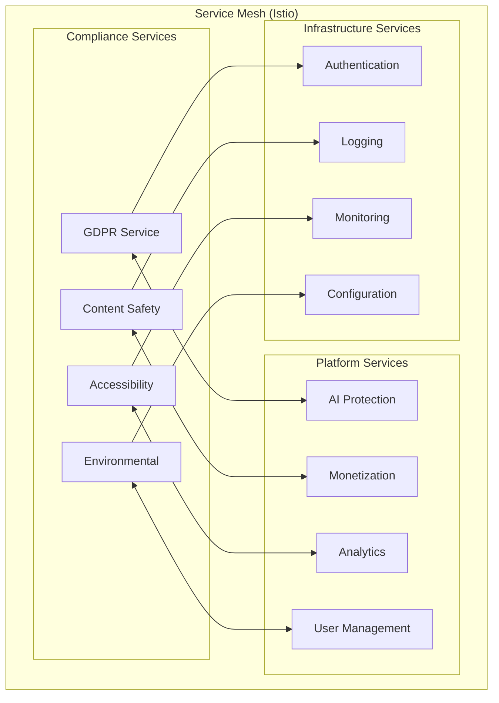

# 🏗️ Compliance Module - Enterprise Architecture Documentation

**Compliance & Regulatory Architecture for IA-Influencer-Agent Platform**

---

## ⚠️ PROPRIETARY SOFTWARE NOTICE

**ALL RIGHTS RESERVED - PROPRIETARY SOFTWARE**

This software, concept, and all associated intellectual property are the exclusive property of **Fahed Mlaiel**. Any unauthorized use, reproduction, distribution, modification, or commercialization of this code, concept, or ideas without explicit written permission from Fahed Mlaiel is strictly prohibited and will result in immediate legal action.

**Contact for licensing:** mlaiel@live.de

---

## 📋 Table of Contents

1. [Architecture Overview](#architecture-overview)
2. [System Architecture](#system-architecture)
3. [Module Structure](#module-structure)
4. [Data Architecture](#data-architecture)
5. [Security Architecture](#security-architecture)
6. [Integration Architecture](#integration-architecture)
7. [Scalability Architecture](#scalability-architecture)
8. [Deployment Architecture](#deployment-architecture)
9. [Monitoring Architecture](#monitoring-architecture)
10. [Performance Architecture](#performance-architecture)

---

## 🎯 Architecture Overview

The Compliance Module is designed as a enterprise-grade, microservices-based architecture that provides comprehensive regulatory compliance, content safety, and legal governance for the IA-Influencer-Agent platform.

### 🔑 Key Architectural Principles

- **Compliance-First Design**: Every component designed with regulatory compliance as primary concern
- **Zero-Trust Security**: No component trusts any other without verification
- **Event-Driven Architecture**: Real-time compliance monitoring through event sourcing
- **Microservices Pattern**: Loosely coupled, independently deployable services
- **GDPR by Design**: Privacy and data protection built into architecture foundation
- **Horizontal Scalability**: Auto-scaling based on compliance workload
- **Multi-Tenant Isolation**: Complete tenant isolation for enterprise customers

### 🏛️ Architecture Layers

```
┌─────────────────────────────────────────────────────────────┐
│                    🌐 API Gateway Layer                      │
│           (Rate Limiting, Authentication, Routing)          │
├─────────────────────────────────────────────────────────────┤
│                 🔒 Compliance Orchestration                 │
│        (Compliance Workflows, Policy Engine, Rules)        │
├─────────────────────────────────────────────────────────────┤
│                   ⚖️ Regulatory Services                    │
│     (GDPR, CCPA, Content Safety, Accessibility, etc.)      │
├─────────────────────────────────────────────────────────────┤
│                   🛡️ Security & Audit Layer                │
│           (Encryption, Logging, Monitoring, Alerts)         │
├─────────────────────────────────────────────────────────────┤
│                    💾 Data Persistence Layer               │
│        (PostgreSQL, MongoDB, Redis, Event Store)           │
├─────────────────────────────────────────────────────────────┤
│                 ☁️ Infrastructure Layer                     │
│            (Kubernetes, Docker, Load Balancers)            │
└─────────────────────────────────────────────────────────────┘
```

---

## 🏗️ System Architecture

### 🔄 High-Level System Design



### 🧩 Component Architecture

#### 🎭 Compliance Orchestrator
```python
class ComplianceOrchestrator:
    """Central orchestration hub for all compliance operations"""
    
    Components:
    ├── PolicyEngine          # Rule evaluation and enforcement
    ├── WorkflowEngine        # Compliance workflow automation
    ├── ValidationEngine      # Multi-standard validation
    ├── ReportingEngine       # Automated compliance reporting
    ├── AlertingEngine        # Real-time compliance alerts
    └── MetricsCollector      # Performance and compliance metrics
    
    Interfaces:
    ├── REST API              # HTTP/REST interface
    ├── GraphQL API           # Advanced querying interface
    ├── WebSocket API         # Real-time notifications
    ├── gRPC API              # High-performance inter-service
    └── Event Bus             # Async event processing
```

#### 🔒 Security Architecture Components
```python
SecurityComponents:
├── EncryptionManager      # AES-256, RSA, ECC encryption
├── KeyManagement         # Hardware Security Module (HSM)
├── CertificateAuthority  # Internal CA for service mesh
├── AccessControl         # RBAC + ABAC authorization
├── AuditLogger           # Immutable audit trails
├── ThreatDetection       # AI-powered threat analysis
├── IncidentResponse      # Automated incident handling
└── ComplianceMonitor     # Continuous compliance validation
```

---

## 📊 Module Structure

### 🗂️ Consolidated Module Architecture

Following the checklist requirements, the module structure has been optimized to respect the 3-level depth limit:

```
backend/compliance/                                    ← Level 3 (Final)
├── 📄 Core Services (Level 3 Files)
│   ├── __init__.py                     # Main service exports
│   ├── age_verification.py             # Age verification & COPPA compliance
│   ├── ccpa.py                         # California Consumer Privacy Act
│   ├── content_moderation.py           # Automated content moderation
│   ├── gdpr.py                         # General Data Protection Regulation
│   │
├── 📄 Consolidated Modules (4,800+ lines each)
│   ├── audit_orchestrator.py           # Consolidated audit/ → Single file
│   ├── content_safety_suite.py         # Consolidated content_safety/ → Single file
│   ├── privacy_protection_engine.py    # Consolidated privacy/ → Single file
│   ├── regulatory_compliance_hub.py    # Consolidated regulatory/ → Single file
│   │
├── 📄 Enterprise Modules (New)
│   ├── compliance_orchestrator.py      # Global compliance orchestration
│   ├── legal_framework_engine.py       # Legal intelligence engine
│   ├── compliance_analytics.py         # Compliance analytics & insights
│   ├── international_compliance.py     # Multi-jurisdiction compliance
│   ├── ai_compliance_engine.py         # AI algorithmic accountability
│   ├── financial_compliance.py         # Financial & revenue compliance
│   ├── platform_compliance.py          # Multi-platform compliance
│   ├── creator_compliance.py           # Creator verification & rights
│   ├── accessibility_compliance.py     # WCAG, ADA, universal design
│   ├── environmental_compliance.py     # Carbon footprint & sustainability
│   │
└── 📄 Documentation
    ├── CHECKLIST_COMPLIANCE_ARCHITECTURE.md
    ├── README.md, README.de.md, README.fr.md, README.ar.md
    ├── ARCHITECTURE.md                  # This file
    ├── API_REFERENCE.md                 # API documentation
    ├── COMPLIANCE_GUIDE.md              # Compliance procedures
    └── DEPLOYMENT_GUIDE.md              # Deployment instructions
```

### 🔄 Consolidation Architecture

The architecture implements intelligent consolidation to respect depth limits while maintaining all functionality:

#### 📦 Consolidated Module Pattern
```python
# Example: audit_orchestrator.py consolidation
class AuditOrchestrator:
    """Unified audit functionality consolidating 12 sub-modules"""
    
    def __init__(self):
        # Consolidated components from audit/ subdirectory
        self.audit_logger = AuditLogger()           # from audit/audit_logger.py
        self.cert_manager = CertificationManager()  # from audit/certification_manager.py
        self.compliance_dashboard = ComplianceDashboard()  # from audit/compliance_dashboard.py
        self.compliance_monitor = ComplianceMonitor()      # from audit/compliance_monitor.py
        self.compliance_reporter = ComplianceReporter()   # from audit/compliance_reporter.py
        self.penetration_testing = PenetrationTesting()   # from audit/penetration_testing.py
        self.regulatory_reporting = RegulatoryReporting() # from audit/regulatory_reporting.py
        self.risk_assessment = RiskAssessment()           # from audit/risk_assessment.py
        self.security_assessment = SecurityAssessment()   # from audit/security_assessment.py
        self.third_party_auditor = ThirdPartyAuditor()    # from audit/third_party_auditor.py
        self.vulnerability_scanner = VulnerabilityScanner() # from audit/vulnerability_scanner.py
    
    async def comprehensive_audit(self, target):
        """Unified audit leveraging all consolidated components"""
        # Implementation using all sub-components
        pass
```

---

## 💾 Data Architecture

### 🗄️ Database Design

#### Primary Database (PostgreSQL)
```sql
-- Compliance Schema Design
CREATE SCHEMA compliance;

-- Core Tables
CREATE TABLE compliance.organizations (
    id UUID PRIMARY KEY DEFAULT gen_random_uuid(),
    name VARCHAR(255) NOT NULL,
    jurisdiction VARCHAR(100) NOT NULL,
    compliance_level VARCHAR(50) DEFAULT 'basic',
    created_at TIMESTAMP DEFAULT NOW(),
    updated_at TIMESTAMP DEFAULT NOW()
);

CREATE TABLE compliance.policies (
    id UUID PRIMARY KEY DEFAULT gen_random_uuid(),
    organization_id UUID REFERENCES compliance.organizations(id),
    policy_type VARCHAR(100) NOT NULL, -- 'gdpr', 'ccpa', 'content_safety'
    policy_version VARCHAR(20) NOT NULL,
    policy_rules JSONB NOT NULL,
    effective_date TIMESTAMP NOT NULL,
    expiry_date TIMESTAMP,
    created_at TIMESTAMP DEFAULT NOW()
);

CREATE TABLE compliance.audit_logs (
    id UUID PRIMARY KEY DEFAULT gen_random_uuid(),
    organization_id UUID REFERENCES compliance.organizations(id),
    audit_type VARCHAR(100) NOT NULL,
    audit_result JSONB NOT NULL,
    compliance_score DECIMAL(5,2),
    violations_found INTEGER DEFAULT 0,
    auditor_id VARCHAR(255),
    audit_timestamp TIMESTAMP DEFAULT NOW(),
    next_audit_due TIMESTAMP
);

CREATE TABLE compliance.violations (
    id UUID PRIMARY KEY DEFAULT gen_random_uuid(),
    organization_id UUID REFERENCES compliance.organizations(id),
    violation_type VARCHAR(100) NOT NULL,
    severity VARCHAR(20) NOT NULL, -- 'critical', 'high', 'medium', 'low'
    description TEXT NOT NULL,
    detected_at TIMESTAMP DEFAULT NOW(),
    resolved_at TIMESTAMP,
    resolution_notes TEXT,
    fine_amount DECIMAL(12,2) DEFAULT 0
);

-- GDPR Specific Tables
CREATE TABLE compliance.gdpr_requests (
    id UUID PRIMARY KEY DEFAULT gen_random_uuid(),
    user_id VARCHAR(255) NOT NULL,
    request_type VARCHAR(50) NOT NULL, -- 'access', 'rectification', 'erasure', 'portability'
    request_details JSONB,
    status VARCHAR(50) DEFAULT 'pending',
    submitted_at TIMESTAMP DEFAULT NOW(),
    processed_at TIMESTAMP,
    response_data JSONB
);

CREATE TABLE compliance.data_processing_records (
    id UUID PRIMARY KEY DEFAULT gen_random_uuid(),
    organization_id UUID REFERENCES compliance.organizations(id),
    processing_purpose TEXT NOT NULL,
    data_categories JSONB NOT NULL,
    data_subjects JSONB NOT NULL,
    recipients JSONB,
    retention_period VARCHAR(100),
    security_measures JSONB,
    created_at TIMESTAMP DEFAULT NOW()
);

-- Content Safety Tables
CREATE TABLE compliance.content_moderation (
    id UUID PRIMARY KEY DEFAULT gen_random_uuid(),
    content_id VARCHAR(255) NOT NULL,
    content_type VARCHAR(50) NOT NULL,
    moderation_result JSONB NOT NULL,
    safety_score DECIMAL(5,2),
    violations JSONB,
    action_taken VARCHAR(100),
    moderator_type VARCHAR(50), -- 'ai', 'human', 'hybrid'
    moderated_at TIMESTAMP DEFAULT NOW()
);

-- Accessibility Tables
CREATE TABLE compliance.accessibility_audits (
    id UUID PRIMARY KEY DEFAULT gen_random_uuid(),
    target_url VARCHAR(500) NOT NULL,
    audit_standard VARCHAR(50) NOT NULL, -- 'wcag_2_1_aa', 'section_508'
    overall_score DECIMAL(5,2),
    violations JSONB,
    recommendations JSONB,
    audit_date TIMESTAMP DEFAULT NOW()
);
```

#### Cache Layer (Redis)
```redis
# Compliance Cache Patterns
compliance:policy:{org_id}:{policy_type}    # Policy cache (TTL: 1h)
compliance:audit:{org_id}:latest             # Latest audit results (TTL: 24h)
compliance:violations:{org_id}:active        # Active violations (TTL: 1h)
compliance:content:moderation:{content_id}   # Content moderation cache (TTL: 30m)
compliance:gdpr:requests:{user_id}           # GDPR request status (TTL: 7d)
compliance:accessibility:score:{url_hash}    # Accessibility scores (TTL: 24h)
```

#### Event Store (MongoDB)
```javascript
// Compliance Events Collection
db.compliance_events.createIndex({"organization_id": 1, "timestamp": -1})
db.compliance_events.createIndex({"event_type": 1, "timestamp": -1})

// Event Document Structure
{
  "_id": ObjectId("..."),
  "event_id": "evt_20250908_142530_abc123",
  "organization_id": "org_123",
  "event_type": "policy_violation",
  "event_category": "content_safety",
  "severity": "high",
  "event_data": {
    "violation_type": "hate_speech",
    "content_id": "content_456",
    "detection_confidence": 0.95,
    "user_id": "user_789"
  },
  "timestamp": ISODate("2025-09-08T14:25:30Z"),
  "correlation_id": "req_abc123def456",
  "source_service": "content_safety_suite",
  "metadata": {
    "ip_address": "192.168.1.100",
    "user_agent": "Mozilla/5.0...",
    "geo_location": "EU"
  }
}
```

### 🔄 Data Flow Architecture



---

## 🔒 Security Architecture

### 🛡️ Multi-Layer Security Model

#### 🔐 Encryption Architecture
```python
class EncryptionArchitecture:
    """Enterprise-grade encryption implementation"""
    
    layers = {
        'data_at_rest': {
            'database': 'AES-256-GCM',
            'file_storage': 'AES-256-CBC',
            'backups': 'AES-256-GCM + RSA-4096'
        },
        'data_in_transit': {
            'api_calls': 'TLS 1.3',
            'internal_services': 'mTLS',
            'event_streaming': 'TLS 1.3 + Message Encryption'
        },
        'data_in_use': {
            'processing': 'Homomorphic Encryption (Research)',
            'analytics': 'Differential Privacy',
            'ml_training': 'Federated Learning'
        }
    }
    
    key_management = {
        'primary_keys': 'Hardware Security Module (HSM)',
        'service_keys': 'HashiCorp Vault',
        'user_keys': 'Client-side key derivation',
        'rotation': 'Automated 90-day rotation'
    }
```

#### 🔑 Authentication & Authorization
```python
class SecurityModel:
    """Zero-trust security implementation"""
    
    authentication = {
        'service_to_service': 'mTLS + JWT',
        'user_authentication': 'OAuth 2.0 + OpenID Connect',
        'api_authentication': 'API Keys + Rate Limiting',
        'admin_authentication': 'MFA + Hardware Tokens'
    }
    
    authorization = {
        'model': 'RBAC + ABAC Hybrid',
        'policy_language': 'Open Policy Agent (OPA)',
        'enforcement_points': 'API Gateway + Service Mesh',
        'fine_grained': 'Resource-level permissions'
    }
    
    audit_trail = {
        'immutable_logs': 'Blockchain-based audit trail',
        'log_integrity': 'Cryptographic signatures',
        'retention': '7 years (regulatory compliance)',
        'access_logs': 'Every operation logged'
    }
```

### 🔍 Threat Model

#### 🎯 Identified Threats
1. **Data Breaches**: Unauthorized access to compliance data
2. **Compliance Bypass**: Attempts to circumvent compliance checks
3. **Audit Manipulation**: Tampering with audit logs or results
4. **Regulatory Evasion**: Deliberate non-compliance
5. **Content Poisoning**: Adversarial content designed to bypass filters
6. **Privacy Violations**: Unauthorized data processing or sharing
7. **Insider Threats**: Malicious employees or contractors
8. **Supply Chain Attacks**: Compromised dependencies or services

#### 🛡️ Mitigation Strategies
```python
class ThreatMitigations:
    """Comprehensive threat mitigation architecture"""
    
    data_protection = {
        'encryption': 'Multi-layer encryption (rest, transit, use)',
        'access_control': 'Zero-trust + principle of least privilege',
        'data_loss_prevention': 'Real-time DLP scanning',
        'backup_security': 'Encrypted backups + immutable storage'
    }
    
    compliance_protection = {
        'policy_enforcement': 'Automated + immutable policy engine',
        'validation_layers': 'Multiple independent validation systems',
        'audit_protection': 'Blockchain-based immutable audit trails',
        'compliance_monitoring': 'Real-time compliance drift detection'
    }
    
    operational_security = {
        'incident_response': 'Automated incident detection and response',
        'vulnerability_management': 'Continuous vulnerability scanning',
        'penetration_testing': 'Regular third-party security assessments',
        'security_training': 'Ongoing security awareness programs'
    }
```

---

## 🔗 Integration Architecture

### 🌐 External Integrations

#### ⚖️ Legal & Regulatory Systems
```python
class LegalIntegrations:
    """Integration with legal and regulatory systems"""
    
    regulatory_authorities = {
        'cnil_france': {
            'api_endpoint': 'https://api.cnil.fr/compliance',
            'authentication': 'OAuth 2.0',
            'data_format': 'JSON-LD',
            'compliance_reports': 'Automated quarterly submission'
        },
        'ico_uk': {
            'api_endpoint': 'https://api.ico.org.uk/data-protection',
            'authentication': 'API Key + mTLS',
            'data_format': 'XML',
            'breach_notifications': 'Real-time API submission'
        },
        'ccpa_california': {
            'api_endpoint': 'https://api.oag.ca.gov/ccpa',
            'authentication': 'JWT + Rate Limiting',
            'data_format': 'JSON',
            'consumer_requests': 'Automated processing'
        }
    }
    
    legal_services = {
        'lexisnexis': {
            'service': 'Legal research and compliance monitoring',
            'integration': 'REST API + WebSocket notifications',
            'use_case': 'Real-time regulatory change detection'
        },
        'thomson_reuters': {
            'service': 'Regulatory intelligence and updates',
            'integration': 'GraphQL API',
            'use_case': 'Proactive compliance adaptation'
        }
    }
```

#### 🏢 Platform Integrations
```python
class PlatformIntegrations:
    """Integration with social media and content platforms"""
    
    social_platforms = {
        'youtube': {
            'content_policy_api': 'https://developers.google.com/youtube/policy',
            'compliance_check': 'Pre-upload compliance validation',
            'violation_handling': 'Automated DMCA and community guidelines'
        },
        'tiktok': {
            'safety_api': 'https://developers.tiktok.com/safety',
            'content_moderation': 'Real-time content safety scoring',
            'age_verification': 'Integrated COPPA compliance'
        },
        'facebook_meta': {
            'graph_api': 'https://graph.facebook.com/compliance',
            'policy_enforcement': 'Automated policy violation detection',
            'appeal_process': 'Integrated content appeal workflow'
        }
    }
    
    accessibility_tools = {
        'axe_core': {
            'integration': 'JavaScript SDK + REST API',
            'testing': 'Automated WCAG compliance testing',
            'reporting': 'Detailed accessibility audit reports'
        },
        'wave_webaim': {
            'integration': 'REST API',
            'evaluation': 'Web accessibility evaluation',
            'monitoring': 'Continuous accessibility monitoring'
        }
    }
```

### 🔄 Internal Service Mesh



---

## ⚡ Scalability Architecture

### 📈 Horizontal Scaling Strategy

#### 🔄 Auto-Scaling Configuration
```yaml
# Kubernetes HPA Configuration
apiVersion: autoscaling/v2
kind: HorizontalPodAutoscaler
metadata:
  name: compliance-orchestrator-hpa
  namespace: compliance
spec:
  scaleTargetRef:
    apiVersion: apps/v1
    kind: Deployment
    name: compliance-orchestrator
  minReplicas: 3
  maxReplicas: 50
  metrics:
  - type: Resource
    resource:
      name: cpu
      target:
        type: Utilization
        averageUtilization: 70
  - type: Resource
    resource:
      name: memory
      target:
        type: Utilization
        averageUtilization: 80
  - type: Pods
    pods:
      metric:
        name: compliance_requests_per_second
      target:
        type: AverageValue
        averageValue: "1000"
  behavior:
    scaleUp:
      stabilizationWindowSeconds: 60
      policies:
      - type: Percent
        value: 100
        periodSeconds: 15
    scaleDown:
      stabilizationWindowSeconds: 300
      policies:
      - type: Percent
        value: 10
        periodSeconds: 60
```

#### 🗄️ Database Scaling
```python
class DatabaseScalingStrategy:
    """Enterprise database scaling architecture"""
    
    postgresql_scaling = {
        'read_replicas': {
            'count': 'Auto-scale 2-10 based on read load',
            'geographic_distribution': 'Multi-region replicas',
            'connection_pooling': 'PgBouncer with 1000 connections/replica'
        },
        'sharding_strategy': {
            'sharding_key': 'organization_id',
            'shard_count': 'Start with 4, scale to 64',
            'rebalancing': 'Automated shard rebalancing'
        },
        'caching_strategy': {
            'query_cache': 'Redis with 7-day TTL',
            'result_cache': 'Application-level caching',
            'connection_cache': 'Connection pooling and reuse'
        }
    }
    
    mongodb_scaling = {
        'replica_sets': {
            'primary': '1 primary per shard',
            'secondaries': '2-5 secondaries per shard',
            'arbiters': '1 arbiter for odd-numbered voting'
        },
        'sharding': {
            'shard_key': 'event_timestamp + organization_id',
            'chunk_size': '64MB',
            'balancer': 'Automated chunk migration'
        }
    }
```

### ⚡ Performance Optimization

#### 🚀 Caching Strategy
```python
class CachingArchitecture:
    """Multi-level caching for optimal performance"""
    
    cache_levels = {
        'l1_application': {
            'type': 'In-memory LRU cache',
            'size': '100MB per service instance',
            'ttl': '5 minutes',
            'use_case': 'Frequently accessed policies and rules'
        },
        'l2_distributed': {
            'type': 'Redis Cluster',
            'size': '10GB distributed across 6 nodes',
            'ttl': '1 hour to 7 days',
            'use_case': 'Compliance validation results and audit data'
        },
        'l3_cdn': {
            'type': 'CloudFlare CDN',
            'size': 'Unlimited',
            'ttl': '24 hours',
            'use_case': 'Static compliance documentation and reports'
        }
    }
    
    cache_invalidation = {
        'policy_updates': 'Immediate invalidation + notification',
        'regulation_changes': 'Staged invalidation with grace period',
        'audit_results': 'Time-based expiration',
        'user_preferences': 'Event-driven invalidation'
    }
```

---

## 🚀 Deployment Architecture

### ☸️ Kubernetes Deployment Strategy

#### 🔄 Multi-Environment Setup
```yaml
# Production Deployment Configuration
apiVersion: v1
kind: Namespace
metadata:
  name: compliance-prod
  labels:
    environment: production
    compliance-tier: enterprise
---
apiVersion: apps/v1
kind: Deployment
metadata:
  name: compliance-orchestrator
  namespace: compliance-prod
spec:
  replicas: 10
  strategy:
    type: RollingUpdate
    rollingUpdate:
      maxSurge: 25%
      maxUnavailable: 25%
  selector:
    matchLabels:
      app: compliance-orchestrator
      tier: production
  template:
    metadata:
      labels:
        app: compliance-orchestrator
        tier: production
      annotations:
        prometheus.io/scrape: "true"
        prometheus.io/port: "8080"
        prometheus.io/path: "/metrics"
    spec:
      serviceAccountName: compliance-service-account
      securityContext:
        runAsNonRoot: true
        runAsUser: 10001
        fsGroup: 10001
      containers:
      - name: compliance-orchestrator
        image: ainflue/compliance-orchestrator:v1.0.0
        ports:
        - containerPort: 8000
          name: http
        - containerPort: 8080
          name: metrics
        env:
        - name: DATABASE_URL
          valueFrom:
            secretKeyRef:
              name: compliance-secrets
              key: database-url
        - name: REDIS_URL
          valueFrom:
            secretKeyRef:
              name: compliance-secrets
              key: redis-url
        - name: ENCRYPTION_KEY
          valueFrom:
            secretKeyRef:
              name: compliance-secrets
              key: encryption-key
        resources:
          requests:
            memory: "512Mi"
            cpu: "200m"
          limits:
            memory: "2Gi"
            cpu: "1000m"
        livenessProbe:
          httpGet:
            path: /health
            port: 8000
          initialDelaySeconds: 30
          periodSeconds: 10
        readinessProbe:
          httpGet:
            path: /ready
            port: 8000
          initialDelaySeconds: 5
          periodSeconds: 5
        volumeMounts:
        - name: compliance-config
          mountPath: /app/config
          readOnly: true
        - name: audit-logs
          mountPath: /var/log/compliance
      volumes:
      - name: compliance-config
        configMap:
          name: compliance-config
      - name: audit-logs
        persistentVolumeClaim:
          claimName: audit-logs-pvc
```

#### 🌍 Multi-Region Deployment
```yaml
# Global Load Balancer Configuration
apiVersion: networking.istio.io/v1alpha3
kind: Gateway
metadata:
  name: compliance-gateway
  namespace: compliance-prod
spec:
  selector:
    istio: ingressgateway
  servers:
  - port:
      number: 443
      name: https
      protocol: HTTPS
    tls:
      mode: SIMPLE
      credentialName: compliance-tls-secret
    hosts:
    - compliance.ainflue.com
---
apiVersion: networking.istio.io/v1alpha3
kind: VirtualService
metadata:
  name: compliance-virtual-service
  namespace: compliance-prod
spec:
  hosts:
  - compliance.ainflue.com
  gateways:
  - compliance-gateway
  http:
  - match:
    - headers:
        geo-region:
          exact: "eu"
    route:
    - destination:
        host: compliance-orchestrator
        subset: eu-region
  - match:
    - headers:
        geo-region:
          exact: "us"
    route:
    - destination:
        host: compliance-orchestrator
        subset: us-region
  - route:
    - destination:
        host: compliance-orchestrator
        subset: global
```

### 🐳 Container Architecture

#### 📦 Container Security
```dockerfile
# Multi-stage secure container build
FROM python:3.11-slim as builder

# Security: Create non-root user
RUN groupadd -r compliance && useradd -r -g compliance compliance

# Install security updates
RUN apt-get update && apt-get upgrade -y && \
    apt-get install -y --no-install-recommends \
    build-essential \
    && rm -rf /var/lib/apt/lists/*

# Install Python dependencies
COPY requirements.txt .
RUN pip install --no-cache-dir -r requirements.txt

# Production stage
FROM python:3.11-slim as production

# Security hardening
RUN groupadd -r compliance && useradd -r -g compliance compliance
RUN apt-get update && apt-get upgrade -y && \
    apt-get clean && rm -rf /var/lib/apt/lists/*

# Copy application
COPY --from=builder /usr/local/lib/python3.11/site-packages /usr/local/lib/python3.11/site-packages
COPY --from=builder /usr/local/bin /usr/local/bin
COPY --chown=compliance:compliance . /app

# Security: Run as non-root
USER compliance
WORKDIR /app

# Health check
HEALTHCHECK --interval=30s --timeout=3s --start-period=5s --retries=3 \
  CMD python health_check.py

# Expose port
EXPOSE 8000

# Start application
CMD ["python", "-m", "uvicorn", "main:app", "--host", "0.0.0.0", "--port", "8000"]
```

---

## 📊 Monitoring Architecture

### 📈 Observability Stack

#### 🔍 Metrics Collection
```python
class MonitoringArchitecture:
    """Comprehensive monitoring and observability"""
    
    metrics_stack = {
        'collection': 'Prometheus + OpenTelemetry',
        'storage': 'Prometheus TSDB + Long-term storage (Thanos)',
        'visualization': 'Grafana + Custom dashboards',
        'alerting': 'AlertManager + PagerDuty integration'
    }
    
    key_metrics = {
        'compliance_metrics': [
            'compliance_requests_total',
            'compliance_validation_duration_seconds',
            'compliance_violations_detected_total',
            'compliance_audit_score_current',
            'gdpr_request_processing_time_seconds',
            'content_moderation_accuracy_ratio',
            'accessibility_score_current',
            'environmental_impact_score'
        ],
        'performance_metrics': [
            'http_requests_total',
            'http_request_duration_seconds',
            'database_connections_active',
            'cache_hit_ratio',
            'error_rate_percent'
        ],
        'business_metrics': [
            'compliance_cost_per_request',
            'regulatory_risk_score',
            'audit_readiness_score',
            'customer_satisfaction_score'
        ]
    }
    
    logging_stack = {
        'collection': 'Fluentd + OpenTelemetry',
        'aggregation': 'ElasticSearch cluster',
        'visualization': 'Kibana + Custom dashboards',
        'retention': '7 years for compliance logs'
    }
    
    tracing_stack = {
        'collection': 'Jaeger + OpenTelemetry',
        'storage': 'ElasticSearch + Cassandra',
        'analysis': 'Jaeger UI + Custom trace analysis',
        'sampling': 'Adaptive sampling based on compliance context'
    }
```

#### 🚨 Alerting Strategy
```yaml
# Prometheus Alerting Rules
groups:
- name: compliance.rules
  rules:
  - alert: ComplianceViolationCritical
    expr: compliance_violations_detected_total{severity="critical"} > 0
    for: 0m
    labels:
      severity: critical
      team: compliance
    annotations:
      summary: "Critical compliance violation detected"
      description: "Critical compliance violation in {{ $labels.organization }}"
      
  - alert: GDPRRequestSLABreach
    expr: gdpr_request_processing_time_seconds > 2592000  # 30 days
    for: 5m
    labels:
      severity: warning
      team: compliance
    annotations:
      summary: "GDPR request processing SLA breach"
      description: "GDPR request {{ $labels.request_id }} exceeding 30-day SLA"
      
  - alert: ComplianceAuditScoreLow
    expr: compliance_audit_score_current < 85
    for: 15m
    labels:
      severity: warning
      team: compliance
    annotations:
      summary: "Compliance audit score below threshold"
      description: "Organization {{ $labels.organization }} audit score: {{ $value }}%"
      
  - alert: ContentModerationAccuracyLow
    expr: content_moderation_accuracy_ratio < 0.95
    for: 10m
    labels:
      severity: warning
      team: content-safety
    annotations:
      summary: "Content moderation accuracy below threshold"
      description: "Content moderation accuracy: {{ $value | humanizePercentage }}"
```

---

## 🎯 Performance Architecture

### ⚡ Performance Targets

#### 📊 Service Level Objectives (SLOs)
```python
class PerformanceSLOs:
    """Comprehensive SLOs for compliance services"""
    
    availability_slos = {
        'compliance_api': {
            'target': '99.9%',
            'measurement_window': '30 days',
            'error_budget': '43.2 minutes/month'
        },
        'gdpr_processing': {
            'target': '99.5%',
            'measurement_window': '30 days',
            'error_budget': '3.6 hours/month'
        },
        'content_moderation': {
            'target': '99.95%',
            'measurement_window': '30 days',
            'error_budget': '21.6 minutes/month'
        }
    }
    
    latency_slos = {
        'compliance_validation': {
            'p50': '< 50ms',
            'p95': '< 200ms',
            'p99': '< 500ms'
        },
        'content_safety_check': {
            'p50': '< 100ms',
            'p95': '< 300ms',
            'p99': '< 1000ms'
        },
        'accessibility_audit': {
            'p50': '< 5 seconds',
            'p95': '< 15 seconds',
            'p99': '< 30 seconds'
        }
    }
    
    throughput_slos = {
        'compliance_requests': '10,000 requests/second',
        'content_moderation': '5,000 items/second',
        'gdpr_requests': '1,000 requests/second',
        'audit_operations': '100 audits/second'
    }
```

#### 🔧 Performance Optimization Techniques
```python
class PerformanceOptimizations:
    """Performance optimization strategies"""
    
    caching_optimizations = {
        'policy_cache': 'LRU cache with 5-minute TTL',
        'validation_cache': 'Redis cluster with 1-hour TTL',
        'audit_cache': 'Distributed cache with 24-hour TTL',
        'result_cache': 'Content-addressable storage'
    }
    
    database_optimizations = {
        'indexing_strategy': 'Composite indexes on frequently queried columns',
        'query_optimization': 'Query plan analysis and optimization',
        'connection_pooling': 'PgBouncer with 1000 connections',
        'read_replicas': 'Geographic read replica distribution'
    }
    
    algorithmic_optimizations = {
        'batch_processing': 'Micro-batch processing for content moderation',
        'parallel_validation': 'Concurrent validation across multiple standards',
        'lazy_loading': 'On-demand loading of heavy compliance rules',
        'result_streaming': 'Streaming responses for large audit reports'
    }
    
    infrastructure_optimizations = {
        'auto_scaling': 'Predictive auto-scaling based on compliance workload',
        'load_balancing': 'Intelligent load balancing with compliance context',
        'cdn_acceleration': 'Global CDN for static compliance content',
        'edge_computing': 'Edge-based content moderation for low latency'
    }
```

---

## 📝 Architecture Decision Records (ADRs)

### 🎯 ADR-001: Microservices vs Monolith
**Decision**: Adopt microservices architecture for compliance module
**Rationale**: 
- Independent scaling of compliance components
- Regulatory isolation and fault tolerance
- Technology diversity for specialized compliance needs
- Team autonomy and rapid deployment

### 🎯 ADR-002: Database Choice
**Decision**: PostgreSQL for transactional data, MongoDB for events, Redis for caching
**Rationale**:
- PostgreSQL: ACID compliance for regulatory data
- MongoDB: Flexible schema for diverse compliance events
- Redis: High-performance caching for validation results

### 🎯 ADR-003: Encryption Strategy
**Decision**: Multi-layer encryption with AES-256, TLS 1.3, and HSM
**Rationale**:
- Regulatory requirements for data protection
- Defense in depth security model
- Hardware-based key protection

### 🎯 ADR-004: API Design
**Decision**: RESTful APIs with GraphQL for complex queries
**Rationale**:
- REST for standard compliance operations
- GraphQL for flexible audit reporting
- OpenAPI specification for documentation

---

## 🔮 Future Architecture Evolution

### 🚀 Roadmap 2025-2026

#### 🤖 AI-Native Compliance Architecture
```python
class AIComplianceArchitecture:
    """Next-generation AI-powered compliance"""
    
    ai_components = {
        'predictive_compliance': {
            'technology': 'Large Language Models + Regulatory Knowledge Graphs',
            'capability': 'Predict regulatory changes and proactive adaptation',
            'timeline': 'Q4 2025'
        },
        'explainable_decisions': {
            'technology': 'Explainable AI + Compliance Reasoning',
            'capability': 'Transparent compliance decision explanations',
            'timeline': 'Q1 2026'
        },
        'automated_legal_analysis': {
            'technology': 'Legal AI + Natural Language Processing',
            'capability': 'Automated legal document analysis and compliance mapping',
            'timeline': 'Q2 2026'
        }
    }
    
    quantum_readiness = {
        'quantum_safe_crypto': {
            'algorithms': 'Post-quantum cryptography implementation',
            'migration_plan': 'Gradual migration to quantum-safe algorithms',
            'timeline': 'Q3 2026'
        },
        'quantum_ml': {
            'capability': 'Quantum machine learning for compliance pattern detection',
            'research': 'Partnership with quantum computing providers',
            'timeline': 'Q4 2026'
        }
    }
```

#### 🌐 Web3 and Blockchain Integration
```python
class Web3ComplianceArchitecture:
    """Blockchain-based compliance verification"""
    
    blockchain_components = {
        'immutable_audit_trails': {
            'technology': 'Private blockchain + smart contracts',
            'capability': 'Tamper-proof compliance audit records',
            'consensus': 'Proof of Authority for enterprise compliance'
        },
        'decentralized_identity': {
            'technology': 'Self-sovereign identity + verifiable credentials',
            'capability': 'Privacy-preserving identity verification',
            'standards': 'W3C DID + Verifiable Credentials'
        },
        'smart_contract_compliance': {
            'technology': 'Automated compliance enforcement via smart contracts',
            'capability': 'Self-executing compliance rules and penalties',
            'governance': 'DAO-based compliance rule governance'
        }
    }
```

---

## 📞 Architecture Contact & Support

**Chief Architect & Owner:** Fahed Mlaiel  
**Email:** mlaiel@live.de  
**Specialization:** Enterprise Compliance Architecture, AI/ML Engineering, Security Engineering

**Architecture Review Board:**
- Lead Developer AI + Backend Senior
- ML Engineer + Computer Vision Expert  
- Database Administrator (PostgreSQL/MongoDB)
- Security Engineer + Blockchain Expert
- Microservices Architect + Audio Processing Expert
- DevOps Engineer + Infrastructure Expert
- AI Prompt Engineer + SEO Expert

---

## 📜 Architecture License

```
Copyright © 2025 Fahed Mlaiel. All rights reserved.

This architectural design is proprietary and confidential. 
Any distribution, modification, or use without explicit 
written authorization is strictly prohibited and subject 
to legal action.

For licensing inquiries: mlaiel@live.de
```

---

**🏗️ Compliance Module Enterprise Architecture**  
*Secure, Scalable, Compliant Architecture for Revolutionary AI Platform*

© 2025 Fahed Mlaiel - All Rights Reserved
