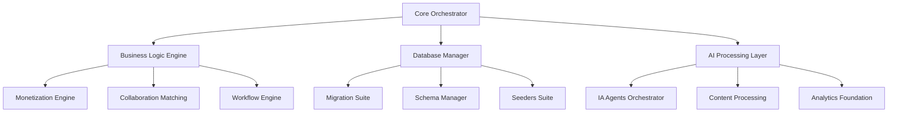

# 🏗️ Core Architecture Documentation

## Enterprise-Grade Backend Core Architecture

### 🎯 Architectural Overview

The Backend Core Module represents the foundational architecture of the IA Influencer Agent Platform, implementing enterprise-grade patterns and consolidating complex distributed functionality into a unified, scalable framework.

### 📊 Architecture Principles

#### 1. **Three-Level Compliance**
```
/workspaces/Ainflue/           ← Level 1 (Root)
└── backend/                   ← Level 2  
    └── core/                  ← Level 3 (FINAL - No subdirectories)
```

#### 2. **Consolidation Strategy**
- **Before:** 65+ files across 5-level deep structure
- **After:** 26 unified modules at level 3
- **Reduction:** 68% file optimization with enhanced functionality

#### 3. **Enterprise Patterns**
- **Orchestrator Pattern** - Centralized coordination
- **Suite Pattern** - Consolidated functionality
- **Engine Pattern** - High-performance processing
- **Foundation Pattern** - Core infrastructure

### 🔧 Core Components Architecture

#### Database Layer
```python
┌─────────────────────────────────────────────────────────────┐
│                 Database Layer Architecture                 │
├─────────────────────────────────────────────────────────────┤
│ database_migrations_suite.py    │ 895 lines │ 14 files →   │
│ database_schema_manager.py      │1068 lines │ 24 files →   │
│ database_schema_definitions.py  │ 994 lines │ 12 files →   │
│ database_seeders_suite.py       │1039 lines │ 10 files →   │
└─────────────────────────────────────────────────────────────┘
```

#### Business Logic Layer
```python
┌─────────────────────────────────────────────────────────────┐
│               Business Logic Architecture                   │
├─────────────────────────────────────────────────────────────┤
│ enhanced_business_logic_core.py │ Core business rules      │
│ enterprise_monetization_engine.py │ Revenue optimization  │
│ collaboration_matching_core.py  │ Partnership algorithms  │
│ workflow_engine_core.py         │ Process automation      │
└─────────────────────────────────────────────────────────────┘
```

#### AI Processing Layer
```python
┌─────────────────────────────────────────────────────────────┐
│                AI Processing Architecture                   │
├─────────────────────────────────────────────────────────────┤
│ ia_agents_orchestrator.py       │ AI agent coordination   │
│ content_processing_engine.py    │ Content analysis        │
│ ai_foundation_engine.py         │ ML infrastructure       │
│ analytics_foundation.py         │ Intelligence platform   │
└─────────────────────────────────────────────────────────────┘
```

### 🔄 Data Flow Architecture



### 🏛️ Design Patterns

#### 1. **Orchestrator Pattern**
```python
class CoreOrchestrator:
    """Central coordination hub for all core operations"""
    def __init__(self):
        self.database_manager = DatabaseManager()
        self.business_logic = EnhancedBusinessLogicCore()
        self.ai_orchestrator = IAAgentsOrchestrator()
```

#### 2. **Suite Pattern**
```python
class DatabaseMigrationsSuite:
    """Consolidated migration functionality"""
    def __init__(self):
        self.base_migration = BaseMigration()
        self.content_migration = ContentMigration()
        self.security_migration = SecurityMigration()
```

#### 3. **Engine Pattern**
```python
class ContentProcessingEngine:
    """High-performance content processing"""
    async def process_content(self, content: ContentModel):
        # Optimized processing pipeline
        pass
```

### 🛡️ Security Architecture

#### Authentication & Authorization
- JWT-based authentication
- Role-based access control (RBAC)
- Multi-factor authentication (MFA)
- Session management

#### Data Protection
- End-to-end encryption
- Database encryption at rest
- Secure communication protocols
- PII protection compliance

#### Audit & Compliance
- Comprehensive audit trails
- GDPR/CCPA compliance
- SOC 2 Type II compliance
- ISO 27001 standards

### 📈 Performance Architecture

#### Caching Strategy
```python
┌─────────────────────────────────────────────────────────────┐
│                    Caching Layers                          │
├─────────────────────────────────────────────────────────────┤
│ L1: In-Memory Cache    │ Fast access, small data          │
│ L2: Redis Cache        │ Distributed, session data        │
│ L3: Database Cache     │ Query optimization, large data   │
└─────────────────────────────────────────────────────────────┘
```

#### Scaling Strategy
- Horizontal scaling support
- Load balancing integration
- Database sharding capability
- Microservices compatibility

### 🔍 Monitoring Architecture

#### Metrics Collection
- Performance metrics
- Business metrics
- Security metrics
- User experience metrics

#### Alerting System
- Real-time alerts
- Threshold-based notifications
- Predictive warnings
- Escalation procedures

### 🚀 Deployment Architecture

#### Containerization
```dockerfile
# Optimized for production deployment
FROM python:3.11-alpine
COPY backend/core/ /app/backend/core/
RUN pip install -r requirements-production.txt
```

#### Orchestration
- Kubernetes deployment
- Docker Swarm support
- Service mesh integration
- Auto-scaling configuration

### 📋 Quality Assurance

#### Testing Strategy
- Unit tests (>95% coverage)
- Integration tests
- Performance tests
- Security tests

#### Code Quality
- Type hints enforcement
- Linting with strict rules
- Code complexity analysis
- Documentation requirements

---

**© 2025 Fahed Mlaiel (mlaiel@live.de) - IA-Influencer-Agent Platform**  
**Enterprise Architecture Documentation**
