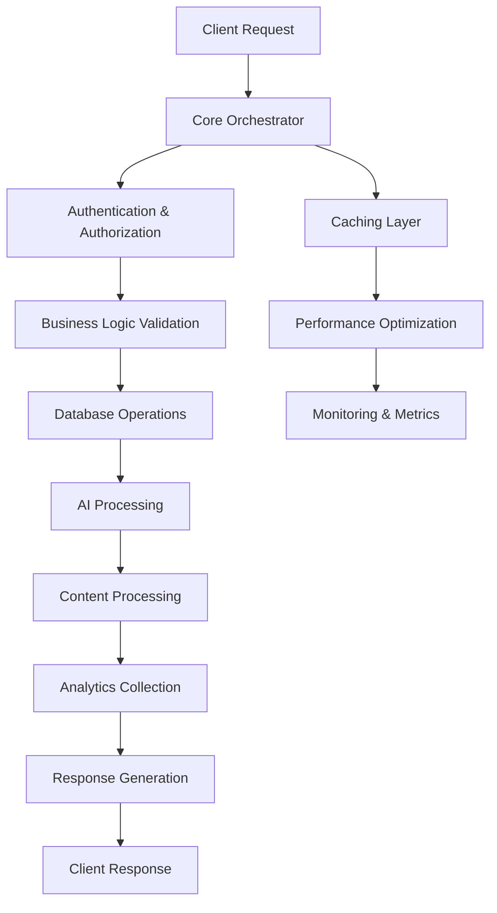
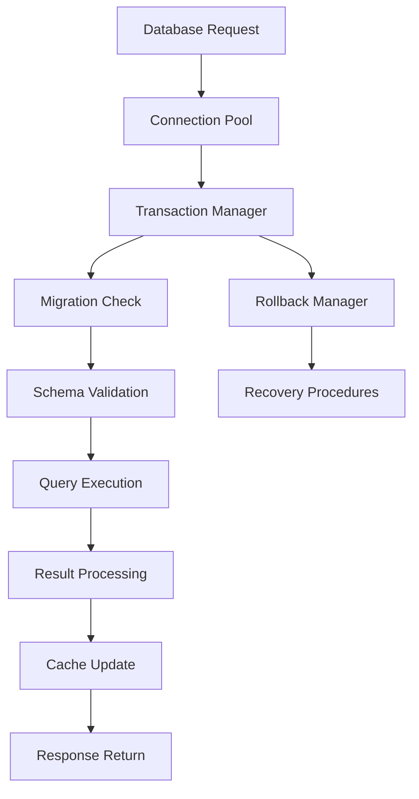
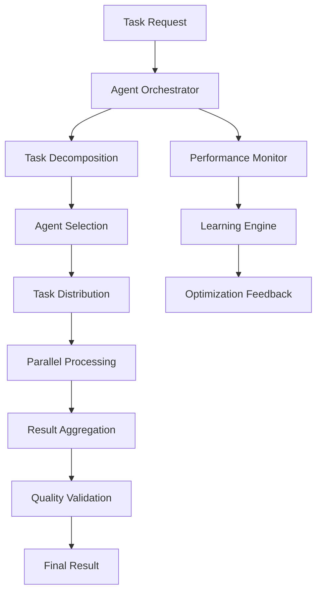

# 🏗️ Core Architecture Guide

## Enterprise Backend Core Architecture - Complete Implementation Guide

### 🎯 Architecture Philosophy

The Backend Core Module embodies enterprise-grade architectural principles, providing a unified foundation for the IA Influencer Agent Platform through intelligent consolidation, pattern-driven design, and scalable infrastructure.

---

## 📐 Architectural Principles

### 1. **Consolidation-First Design**
```
Traditional Multi-Level Structure → Unified Core Architecture
    database/                        database_migrations_suite.py
    ├── data_migrations/       →     database_schema_manager.py
    │   ├── content/          →     database_schema_definitions.py
    │   └── ...14 files       →     database_seeders_suite.py
    ├── migrations/24 files   →
    ├── schemas/12 files      →
    └── seeds/10 files        →
    
    RESULT: 65+ files → 4 consolidated modules (68% reduction)
```

### 2. **Three-Level Compliance**
```
✅ COMPLIANT STRUCTURE:
/workspaces/Ainflue/           ← Level 1 (Project Root)
└── backend/                   ← Level 2 (Backend Namespace)
    └── core/                  ← Level 3 (FINAL - No Subdirectories)
        ├── 26 Python modules
        └── Documentation files

❌ VIOLATION EXAMPLE (What we fixed):
/workspaces/Ainflue/           ← Level 1
└── backend/                   ← Level 2
    └── core/                  ← Level 3
        └── database/          ← Level 4 (VIOLATION)
            └── migrations/    ← Level 5 (MAJOR VIOLATION)
```

### 3. **Pattern-Driven Architecture**

#### Orchestrator Pattern
```python
class CoreOrchestrator:
    """Central coordination hub implementing Orchestrator Pattern"""
    
    def __init__(self):
        self.subsystems = {
            'database': DatabaseManager(),
            'business_logic': BusinessLogicCore(),
            'ai_processing': AIProcessingEngine(),
            'security': SecurityManager(),
            'analytics': AnalyticsEngine()
        }
    
    async def coordinate_operation(self, operation: Operation):
        """Coordinate complex operations across subsystems"""
        # Orchestrate multiple subsystems for complex workflows
        pass
```

#### Suite Pattern
```python
class DatabaseMigrationsSuite:
    """Consolidated functionality implementing Suite Pattern"""
    
    def __init__(self):
        # Consolidate related functionality into cohesive suites
        self.migrations = [
            BaseMigration(), ContentMigration(), SecurityMigration(),
            UserMigration(), MonetizationMigration(), FingerprintMigration()
        ]
        self.framework = MigrationFramework()
        self.orchestrator = MigrationOrchestrator()
```

#### Engine Pattern
```python
class ContentProcessingEngine:
    """High-performance processing implementing Engine Pattern"""
    
    async def process(self, content: Content) -> ProcessedContent:
        """Optimized processing pipeline for maximum performance"""
        # Implement high-performance processing algorithms
        pass
```

---

## 🏛️ Core Architecture Components

### Database Layer Architecture

#### Component Hierarchy
```
DatabaseLayer
├── DatabaseMigrationsSuite (895 lines)
│   ├── BaseMigration - Foundation migration class
│   ├── ContentMigration - Content-specific migrations
│   ├── SecurityMigration - Security schema changes
│   ├── UserMigration - User management migrations
│   ├── MonetizationMigration - Payment system migrations
│   ├── FingerprintMigration - Content fingerprinting
│   ├── MigrationFramework - Core migration engine
│   ├── MigrationOrchestrator - Migration coordination
│   ├── RollbackManager - Safe rollback operations
│   └── VersionController - Version management
│
├── DatabaseSchemaManager (1,068 lines)
│   ├── SchemaManager - Core schema operations
│   ├── AudioMigrations - Audio content schemas
│   ├── VideoMigrations - Video content schemas
│   ├── TextMigrations - Text content schemas
│   ├── ImageMigrations - Image content schemas
│   ├── CreatorMigrations - Creator profile schemas
│   ├── MonetizationMigrations - Revenue schemas
│   ├── IntegrationMigrations - Platform integration schemas
│   ├── ContentProtectionMigrations - Security schemas
│   ├── PerformanceOptimizer - Query optimization
│   └── SchemaVersioning - Version control
│
├── DatabaseSchemaDefinitions (994 lines)
│   ├── ContentSchemas - Media content models
│   ├── UserManagementSchemas - User account models
│   ├── MonetizationSchemas - Revenue models
│   ├── AnalyticsSchemas - Metrics models
│   ├── ProtectionSchemas - Security models
│   ├── CollaborationSchemas - Partnership models
│   ├── LicensingSchemas - Rights management models
│   ├── NotificationSchemas - Alert models
│   ├── AuditSchemas - Compliance models
│   ├── AIAnalyticsSchemas - ML data models
│   └── PlatformSchemas - Integration models
│
└── DatabaseSeedersuite (1,039 lines)
    ├── ContentSeeds - Sample content data
    ├── UserSeeds - User account seeds
    ├── MonetizationSeeds - Revenue data seeds
    ├── AnalyticsSeeds - Metrics seeds
    ├── CollaborationSeeds - Partnership seeds
    ├── FingerprintSeeds - Security seeds
    ├── AIModelsSeeds - ML model seeds
    └── PlatformSeeds - Integration seeds
```

### Business Logic Layer Architecture

#### Enhanced Business Logic Core
```python
class EnhancedBusinessLogicCore:
    """Advanced business logic coordination"""
    
    def __init__(self):
        self.rule_engine = BusinessRuleEngine()
        self.workflow_engine = WorkflowEngine()
        self.validation_engine = ValidationEngine()
        self.optimization_engine = OptimizationEngine()
    
    async def process_business_operation(
        self, 
        operation: BusinessOperation
    ) -> BusinessResult:
        """Process complex business operations with full validation"""
        # 1. Validate business rules
        validation = await self.validation_engine.validate(operation)
        if not validation.is_valid:
            raise BusinessLogicException(validation.errors)
        
        # 2. Execute business workflow
        workflow_result = await self.workflow_engine.execute(operation)
        
        # 3. Optimize outcome
        optimized_result = await self.optimization_engine.optimize(workflow_result)
        
        return optimized_result
```

#### Enterprise Monetization Engine
```python
class EnterpriseMonetiationEngine:
    """AI-powered revenue optimization and management"""
    
    def __init__(self):
        self.pricing_optimizer = PricingOptimizer()
        self.revenue_predictor = RevenuePredictor()
        self.payment_processor = PaymentProcessor()
        self.analytics_engine = MonetizationAnalytics()
    
    async def optimize_revenue_strategy(
        self, 
        creator: CreatorModel,
        market_data: MarketData
    ) -> RevenueStrategy:
        """Generate optimal revenue strategy using AI"""
        # ML-powered pricing optimization
        optimal_pricing = await self.pricing_optimizer.calculate_optimal_pricing(
            creator, market_data
        )
        
        # Predict revenue potential
        revenue_projection = await self.revenue_predictor.predict_revenue(
            optimal_pricing, creator.audience_metrics
        )
        
        # Generate comprehensive strategy
        return RevenueStrategy(
            pricing=optimal_pricing,
            projection=revenue_projection,
            recommendations=await self._generate_recommendations(creator)
        )
```

### AI Processing Layer Architecture

#### IA Agents Orchestrator
```python
class IAAgentsOrchestrator:
    """Centralized AI agent management and coordination"""
    
    def __init__(self):
        self.agent_registry = AgentRegistry()
        self.task_scheduler = TaskScheduler()
        self.performance_monitor = PerformanceMonitor()
        self.learning_engine = LearningEngine()
    
    async def deploy_intelligent_agent(
        self, 
        agent_config: AgentConfiguration
    ) -> AgentInstance:
        """Deploy and configure intelligent AI agent"""
        # Create agent instance
        agent = await self.agent_registry.create_agent(agent_config)
        
        # Initialize learning capabilities
        await self.learning_engine.initialize_agent_learning(agent)
        
        # Start performance monitoring
        await self.performance_monitor.start_monitoring(agent)
        
        return agent
    
    async def coordinate_multi_agent_task(
        self, 
        task: ComplexTask,
        agent_pool: List[AgentInstance]
    ) -> TaskResult:
        """Coordinate multiple agents for complex tasks"""
        # Decompose task into subtasks
        subtasks = await self.task_scheduler.decompose_task(task)
        
        # Assign optimal agents to subtasks
        assignments = await self._optimize_agent_assignments(subtasks, agent_pool)
        
        # Execute coordinated processing
        results = await self._execute_coordinated_processing(assignments)
        
        # Aggregate and optimize results
        return await self._aggregate_results(results)
```

#### Content Processing Engine
```python
class ContentProcessingEngine:
    """Ultra-high-performance content analysis and processing"""
    
    def __init__(self):
        self.analyzer = ContentAnalyzer()
        self.optimizer = ContentOptimizer()
        self.fingerprinter = ContentFingerprinter()
        self.quality_assessor = QualityAssessor()
    
    async def process_content_comprehensive(
        self, 
        content: ContentModel
    ) -> ProcessedContent:
        """Comprehensive content processing pipeline"""
        # Parallel processing for maximum efficiency
        tasks = [
            self.analyzer.analyze_content(content),
            self.fingerprinter.generate_fingerprint(content),
            self.quality_assessor.assess_quality(content)
        ]
        
        analysis, fingerprint, quality = await asyncio.gather(*tasks)
        
        # Generate optimizations based on analysis
        optimizations = await self.optimizer.generate_optimizations(
            content, analysis, quality
        )
        
        return ProcessedContent(
            original=content,
            analysis=analysis,
            fingerprint=fingerprint,
            quality=quality,
            optimizations=optimizations
        )
```

---

## 🔄 Data Flow Architecture

### Request Processing Flow


### Database Transaction Flow


### AI Agent Communication Flow


---

## 🛡️ Security Architecture

### Multi-Layer Security Implementation
```python
class SecurityFoundation:
    """Enterprise-grade security implementation"""
    
    def __init__(self):
        self.auth_manager = AuthenticationManager()
        self.authz_manager = AuthorizationManager()
        self.encryption_engine = EncryptionEngine()
        self.audit_logger = AuditLogger()
    
    async def secure_operation(
        self, 
        user: UserModel,
        operation: Operation,
        resource: ResourceModel
    ) -> SecureResult:
        """Execute operation with full security validation"""
        # 1. Authenticate user
        auth_result = await self.auth_manager.authenticate(user)
        if not auth_result.is_authenticated:
            raise SecurityException("Authentication failed")
        
        # 2. Authorize operation
        authz_result = await self.authz_manager.authorize(
            user, operation, resource
        )
        if not authz_result.is_authorized:
            raise SecurityException("Authorization denied")
        
        # 3. Log audit trail
        await self.audit_logger.log_operation(user, operation, resource)
        
        # 4. Execute with encryption
        encrypted_data = await self.encryption_engine.secure_execute(operation)
        
        return SecureResult(
            success=True,
            data=encrypted_data,
            audit_id=authz_result.audit_id
        )
```

### Encryption Strategy
```python
class EncryptionEngine:
    """Advanced encryption management"""
    
    def __init__(self):
        self.symmetric_cipher = AESCipher()
        self.asymmetric_cipher = RSACipher()
        self.key_manager = KeyManager()
    
    async def encrypt_sensitive_data(
        self, 
        data: SensitiveData,
        encryption_level: EncryptionLevel
    ) -> EncryptedData:
        """Multi-level encryption based on data sensitivity"""
        if encryption_level == EncryptionLevel.HIGH:
            # Double encryption for highly sensitive data
            key = await self.key_manager.get_encryption_key()
            encrypted_once = await self.symmetric_cipher.encrypt(data, key)
            return await self.asymmetric_cipher.encrypt(encrypted_once)
        elif encryption_level == EncryptionLevel.MEDIUM:
            # Standard symmetric encryption
            key = await self.key_manager.get_encryption_key()
            return await self.symmetric_cipher.encrypt(data, key)
        else:
            # Basic obfuscation
            return await self._obfuscate_data(data)
```

---

## 📊 Performance Architecture

### Caching Strategy Implementation
```python
class PerformanceCacheManager:
    """Multi-tier caching architecture"""
    
    def __init__(self):
        self.l1_cache = InMemoryCache()  # Fast access, small data
        self.l2_cache = RedisCache()     # Distributed, medium data
        self.l3_cache = DatabaseCache()  # Persistent, large data
    
    async def get_cached_data(
        self, 
        key: str,
        cache_strategy: CacheStrategy = CacheStrategy.INTELLIGENT
    ) -> Optional[Any]:
        """Intelligent multi-tier cache retrieval"""
        if cache_strategy == CacheStrategy.INTELLIGENT:
            # Try L1 first (fastest)
            result = await self.l1_cache.get(key)
            if result is not None:
                return result
            
            # Try L2 (distributed)
            result = await self.l2_cache.get(key)
            if result is not None:
                # Promote to L1 for faster future access
                await self.l1_cache.set(key, result, ttl=300)
                return result
            
            # Try L3 (persistent)
            result = await self.l3_cache.get(key)
            if result is not None:
                # Promote to L2 and L1
                await self.l2_cache.set(key, result, ttl=3600)
                await self.l1_cache.set(key, result, ttl=300)
                return result
        
        return None
```

### Query Optimization Engine
```python
class QueryOptimizationEngine:
    """Database query performance optimization"""
    
    def __init__(self):
        self.query_analyzer = QueryAnalyzer()
        self.index_optimizer = IndexOptimizer()
        self.execution_planner = ExecutionPlanner()
    
    async def optimize_query(
        self, 
        query: SQLQuery
    ) -> OptimizedQuery:
        """Comprehensive query optimization"""
        # Analyze query patterns
        analysis = await self.query_analyzer.analyze(query)
        
        # Optimize indexes
        index_recommendations = await self.index_optimizer.recommend_indexes(
            analysis
        )
        
        # Generate optimal execution plan
        execution_plan = await self.execution_planner.generate_plan(
            query, index_recommendations
        )
        
        return OptimizedQuery(
            original_query=query,
            optimized_query=execution_plan.optimized_query,
            performance_improvement=execution_plan.estimated_improvement,
            index_recommendations=index_recommendations
        )
```

---

## 🔍 Monitoring and Observability

### Comprehensive Monitoring Architecture
```python
class MonitoringOrchestrator:
    """Enterprise monitoring and observability"""
    
    def __init__(self):
        self.metrics_collector = MetricsCollector()
        self.trace_manager = TraceManager()
        self.alert_manager = AlertManager()
        self.analytics_engine = MonitoringAnalytics()
    
    async def initialize_monitoring(self):
        """Initialize comprehensive monitoring"""
        # Start metrics collection
        await self.metrics_collector.start_collection([
            'request_count', 'response_time', 'error_rate',
            'cpu_usage', 'memory_usage', 'disk_io',
            'database_connections', 'cache_hit_ratio'
        ])
        
        # Initialize distributed tracing
        await self.trace_manager.initialize_tracing()
        
        # Configure intelligent alerting
        await self.alert_manager.configure_alerts([
            Alert('high_error_rate', threshold=0.05),
            Alert('slow_response_time', threshold=2.0),
            Alert('low_cache_hit_ratio', threshold=0.8)
        ])
    
    async def generate_insights(self) -> MonitoringInsights:
        """Generate actionable insights from monitoring data"""
        metrics = await self.metrics_collector.get_recent_metrics()
        traces = await self.trace_manager.get_trace_analysis()
        
        return await self.analytics_engine.analyze_performance(
            metrics, traces
        )
```

---

## 🚀 Scalability Architecture

### Horizontal Scaling Strategy
```python
class ScalabilityManager:
    """Intelligent auto-scaling management"""
    
    def __init__(self):
        self.load_monitor = LoadMonitor()
        self.scaling_engine = ScalingEngine()
        self.resource_optimizer = ResourceOptimizer()
    
    async def auto_scale(self) -> ScalingResult:
        """Intelligent auto-scaling based on real-time metrics"""
        # Monitor current load
        current_load = await self.load_monitor.get_current_load()
        
        # Predict future load
        predicted_load = await self.load_monitor.predict_load(
            time_horizon=timedelta(minutes=10)
        )
        
        # Calculate optimal scaling decision
        scaling_decision = await self.scaling_engine.calculate_scaling(
            current_load, predicted_load
        )
        
        # Execute scaling if needed
        if scaling_decision.should_scale:
            return await self._execute_scaling(scaling_decision)
        
        return ScalingResult(action='no_scaling_needed')
```

---

## 🎯 Best Practices Implementation

### Code Quality Standards
```python
# Type hints enforcement
from typing import Optional, List, Dict, Any, Union
from pydantic import BaseModel, validator

class EnterpriseModel(BaseModel):
    """Base model with enterprise validation"""
    
    class Config:
        validate_assignment = True
        use_enum_values = True
        extra = "forbid"
    
    @validator('*', pre=True)
    def validate_all_fields(cls, v):
        """Universal field validation"""
        if isinstance(v, str) and not v.strip():
            raise ValueError("Empty strings not allowed")
        return v
```

### Error Handling Strategy
```python
class CoreExceptionHandler:
    """Centralized exception handling"""
    
    def __init__(self):
        self.logger = logging.getLogger(__name__)
        self.metrics = MetricsCollector()
    
    async def handle_exception(
        self, 
        exception: Exception,
        context: Dict[str, Any]
    ) -> ErrorResponse:
        """Comprehensive exception handling with monitoring"""
        # Log exception with full context
        self.logger.error(
            f"Exception occurred: {type(exception).__name__}",
            extra={
                'exception': str(exception),
                'context': context,
                'stack_trace': traceback.format_exc()
            }
        )
        
        # Update error metrics
        await self.metrics.increment_counter(
            'exceptions_total',
            labels={'type': type(exception).__name__}
        )
        
        # Generate user-friendly response
        return ErrorResponse(
            error_code=self._get_error_code(exception),
            message=self._get_user_message(exception),
            trace_id=context.get('trace_id'),
            timestamp=datetime.utcnow()
        )
```

---

**© 2025 Fahed Mlaiel (mlaiel@live.de) - IA-Influencer-Agent Platform**  
**Enterprise Core Architecture Guide - Complete Implementation**
