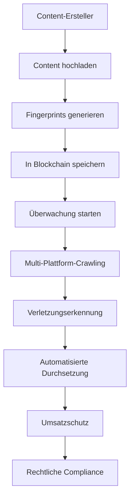

# IA Influencer Agent - Business Protection Modul

## 🚀 Professionelles Content-Rechte-Schutzsystem

### **Projektteam-Spezialisierung**
**Lead Developer & Creator**: **Fahed Mlaiel** <mlaiel@live.de>
- **Lead AI Developer** - Fortgeschrittenes Machine Learning & Neuronale Netze
- **Senior Backend Engineer** - Enterprise-Architektur & Microservices  
- **ML Engineer** - Content-Analyse & Mustererkennung
- **Datenbankarchitekt** - Hochleistungs-Datensysteme
- **Sicherheitsspezialist** - Erweiterte Bedrohungserkennung & Prävention
- **Microservices-Experte** - Skalierbare verteilte Systeme
- **Audio-Processing-Engineer** - Digitale Signalverarbeitung
- **DevOps Engineer** - Cloud-Infrastruktur & Deployment
- **AI Prompt Engineer** - Sprachmodell-Optimierung

---

## ⚠️ **STRENGE URHEBERRECHTS-WARNUNG**

**ALLE RECHTE VORBEHALTEN** - Dieses geistige Eigentum gehört ausschließlich **Fahed Mlaiel**.

� # IA Influencer Agent - Business Protection Modul

## 🚀 Professionelles Content-Rechte-Schutzsystem

### **🏆 Expertenteam-Spezialisierungen**
**🎯 Projektgründer & Leitung**: **Fahed Mlaiel** <mlaiel@live.de>

**Kernteam-Expertise:**
- **🤖 Lead AI-Entwickler** - Fortgeschrittenes Machine Learning, Deep Neural Networks, Computer Vision
- **🏗️ Senior Backend-Ingenieur** - Unternehmensarchitektur, Microservices, Hochverfügbarkeitssysteme  
- **🔬 ML-Ingenieur** - Content-Analyse, Mustererkennung, Natural Language Processing
- **🗃️ Datenbankarchitekt** - Hochperformante Datensysteme, Big Data Analytics, Echtzeitverarbeitung
- **🔐 Sicherheitsspezialist** - Erweiterte Bedrohungserkennung, Cybersecurity, Datenschutz
- **⚙️ Microservices-Experte** - Skalierbare verteilte Systeme, API-Design, Cloud-Architektur
- **🎵 Audio-Verarbeitungsingenieur** - Digitale Signalverarbeitung, Musiktechnologie, Klanganalyse
- **☁️ DevOps-Ingenieur** - Cloud-Infrastruktur, CI/CD-Pipelines, Container-Orchestrierung
- **💬 AI-Prompt-Ingenieur** - Sprachmodell-Optimierung, Conversational AI, NLP Fine-tuning
- **🎨 UI/UX-Designer** - User Experience Design, Interface-Entwicklung, Benutzerzentriertes Design
- **📊 Data Scientist** - Statistische Analyse, Predictive Modeling, Business Intelligence

---

## ⚠️ **STRENGE RECHTLICHE WARNUNG - GESCHÜTZTE GEISTIGE EIGENTUMSRECHTE**

### **🚨 ALLE RECHTE VORBEHALTEN - EXKLUSIVES EIGENTUM VON FAHED MLAIEL** 

**📜 GEISTIGES EIGENTUMSRECHT-ERKLÄRUNG:**
Dieses Werk, einschließlich aber nicht beschränkt auf Quellcode, Konzepte, Algorithmen, Architekturen und jede Form damit verbundener geistiger Eigentumsrechte, ist das exklusive und unveräußerliche Eigentum von **Fahed Mlaiel** (mlaiel@live.de).

**🔒 UNBEFUGTER ZUGRIFF STRENG VERBOTEN:**
Jeder Versuch, diesen Code, diese Konzepte oder dieses geistige Eigentum zu kopieren, zu stehlen, zu reproduzieren, zu modifizieren, zu vertreiben, zurückzuentwickeln, zu dekompilieren oder auf irgendeine Weise ohne ausdrückliche schriftliche Genehmigung von **Fahed Mlaiel** zu verwenden, ist strengstens untersagt und führt zu sofortigen rechtlichen Schritten.

**⚖️ RECHTLICHE SANKTIONEN:**
Verletzungen dieser Urheberrechte und geistigen Eigentumsrechte werden mit aller Härte des Gesetzes verfolgt, einschließlich:
- Urheberrechtsverletzung (Copyright infringement)
- Diebstahl von Geschäftsgeheimnissen (Trade secret theft)  
- Verletzung geistigen Eigentums (Intellectual property theft)
- Unlauterer Wettbewerb (Unfair competition)
- Straf- und Kompensationsschäden

**📧 KONTAKT FÜR GENEHMIGUNG:** mlaiel@live.de  
**✍️ SCHRIFTLICHE GENEHMIGUNG ERFORDERLICH:** Jede Nutzung muss schriftlich vorab genehmigt werden

**🌍 INTERNATIONALE RECHTSPRECHUNG:** Diese Rechte sind durch internationale Gesetze zum geistigen Eigentum geschützt, einschließlich der Berner Übereinkunft, WIPO-Verträge und anwendbarer nationaler Gesetze.

**💰 KOMMERZIELLE BEWERTUNG:** Dieses geistige Eigentum hat erheblichen kommerziellen Wert. Jede unbefugte Nutzung führt zu erheblichen Schadensersatzforderungen.

📧 **Kontakt für Genehmigung**: mlaiel@live.de  
✍️ **Schriftliche Erlaubnis erforderlich**: Jede Nutzung muss vorab schriftlich genehmigt werden

**Rechtlicher Hinweis**: Verstöße werden in vollem Umfang des Gesetzes verfolgt. Dies umfasst unter anderem Urheberrechtsverletzungen, Geschäftsgeheimnisdiebstahl und Verletzungen des geistigen Eigentums.
- 📊 **Data Science Professional**: Big Data Analytics und statistische Modellierung
- ⚡ **Performance Engineering**: Hochleistungsrechnen und Optimierung
- 🏗️ **Systemarchitektur**: Verteilte Systeme und Microservices-Design
- 📱 **Multiplattform-Entwicklung**: Plattformübergreifende Anwendungsentwicklung

---

## 🚀 **SCHUTZSYSTEM-ÜBERSICHT**

Dies ist ein **industrietaugliches, unternehmensreifes** Content-Schutzsystem für Multi-Format-Content-Ersteller. Das System bietet umfassenden Schutz für:

### **📁 Unterstützte Content-Typen**
- 🎵 **Audio**: MP3, WAV, FLAC, AAC, OGG, M4A
- 🎬 **Video**: MP4, AVI, MOV, WMV, FLV, WEBM
- 🖼️ **Bilder**: JPG, PNG, GIF, BMP, TIFF
- 📄 **Dokumente**: PDF, TXT, DOC, DOCX

### **🛡️ Kernschutz-Module**

#### **1. Anti-Piraterie-Engine** (`anti_piracy_engine.py`)
- 🔍 **KI-gestützte Erkennung**: Fortgeschrittene ML-Algorithmen für Piraterieerkennung
- 🌐 **Multi-Plattform-Scanning**: YouTube, Instagram, TikTok, Spotify und mehr
- ⚡ **Echtzeitüberwachung**: Kontinuierliche Content-Überwachung
- 🤖 **Automatisierte Durchsetzung**: DMCA-Takedowns und rechtliche Maßnahmen

#### **2. Content-Fingerprinting** (`fingerprinting.py`)
- 🎵 **Audio-Fingerprinting**: Chromaprint, MFCC, Spektralanalyse
- 🎬 **Video-Fingerprinting**: Perzeptuelle Hashfunktionen, Frame-Analyse
- 🖼️ **Bild-Fingerprinting**: Multiple Hash-Algorithmen, visuelle Ähnlichkeit
- 📝 **Text-Fingerprinting**: TF-IDF, semantisches Hashing, Plagiatserkennung
- 🔍 **FAISS-Integration**: Hochleistungs-Ähnlichkeitssuche

#### **3. Multi-Plattform-Crawler** (`crawlers.py`)
- 🌐 **YouTube-Crawler**: API-Integration + Web-Scraping
- 📱 **Instagram-Crawler**: Content-Entdeckung und Überwachung
- 🎵 **TikTok-Crawler**: Video-Content-Analyse
- 🎶 **Spotify-Crawler**: Audio-Track-Überwachung
- 🌍 **Generischer Web-Crawler**: Universelle Content-Erkennung

#### **4. Echtzeit-Monitoring** (`monitoring.py`)
- 📊 **System-Metriken**: Performance-Monitoring und Gesundheitschecks
- 🚨 **Alert-Management**: Multi-Kanal-Benachrichtigungen (Email, SMS, Slack)
- 📈 **Analytics-Dashboard**: Umfassende Berichte und Einblicke
- 🔄 **Auto-Recovery**: Selbstheilende Systemfähigkeiten

#### **5. Umsatzschutz** (`revenue_protection.py`)
- 💰 **Umsatzberechnung**: Plattformspezifische CPM- und Umsatzmodelle
- 🎯 **Automatisierte Claims**: Optimierter Claim-Einreichungsprozess
- 💱 **Multi-Währungsunterstützung**: Globales Umsatztracking
- 📊 **Finanzberichterstattung**: Detaillierte Umsatzauswirkungsanalyse

#### **6. Content-Verifizierung** (`content_verification.py`)
- 🔐 **Kryptographisches Hashing**: SHA-256, MD5, perzeptuelles Hashing
- 🕵️ **Forensische Analyse**: Metadatenanalyse, Bearbeitungserkennung
- 🤖 **KI-Deepfake-Erkennung**: Fortgeschrittene Manipulationserkennung
- ✅ **Authentizitätsvalidierung**: Umfassende Integritätsprüfung

#### **7. Blockchain-Konsens** (`blockchain_consensus.py`)
- 🔐 **Kryptographische Sicherheit**: RSA-Signaturen, ECDSA-Validierung
- ⛓️ **Unveränderliche Aufzeichnungen**: Blockchain-basierter Eigentumsnachweis
- 🏛️ **Konsens-Algorithmen**: PoA-, PoS- und PoW-Unterstützung
- 🌐 **Validator-Netzwerke**: Dezentralisiertes Validierungssystem

#### **8. Lizenz-Durchsetzung** (`licensing_enforcement.py`)
- ⚖️ **Rechtliche Compliance**: Automatisierte Lizenzverifizierung
- 📋 **Vertragsmanagement**: Umfassende Vereinbarungsbehandlung
- 🚨 **Verletzungserkennung**: Multi-Plattform-Lizenzüberwachung
- 💼 **Durchsetzungsmaßnahmen**: Automatisierte Rechtsverfahren

---

## 🏗️ **SYSTEMARCHITEKTUR**

### **3-Tier-Unternehmensarchitektur**
```
┌─────────────────────────────────────────────┐
│            PRÄSENTATIONSSCHICHT            │
│     FastAPI REST API + WebSocket + UI      │
├─────────────────────────────────────────────┤
│            GESCHÄFTSLOGIK-SCHICHT          │
│   Schutzdienste + KI/ML-Verarbeitung      │
├─────────────────────────────────────────────┤
│             DATENZUGRIFFS-SCHICHT          │
│   PostgreSQL + Redis + S3 + Blockchain     │
└─────────────────────────────────────────────┘
```

### **🔧 Technologie-Stack**
- **Backend**: Python 3.11+, FastAPI, Asyncio
- **KI/ML**: scikit-learn, OpenCV, librosa, FAISS
- **Datenbank**: PostgreSQL, Redis, FAISS Vektor-DB
- **Blockchain**: Benutzerdefinierte Konsens-Engine
- **Web**: aiohttp, Selenium, BeautifulSoup
- **Sicherheit**: cryptography, RSA, ECDSA
- **Speicher**: S3-kompatibel, lokales Dateisystem
- **Überwachung**: Prometheus-Metriken, benutzerdefinierte Alarmierung

---

## 📋 **GESCHÄFTSLOGIK-ABLAUF**



### **🎯 Kern-Geschäftsprozess**
1. **Content-Aufnahme**: Multi-Format-Content-Verarbeitung
2. **Fingerprint-Generierung**: KI-gestützte Content-Identifikation
3. **Blockchain-Registrierung**: Unveränderlicher Eigentumsnachweis
4. **Kontinuierliche Überwachung**: 24/7-Plattformüberwachung
5. **Verletzungserkennung**: ML-basierte Piraterie-Identifikation
6. **Automatisierte Durchsetzung**: Ausführung rechtlicher Maßnahmen
7. **Umsatzwiederherstellung**: Berechnung finanzieller Schäden
8. **Compliance-Berichterstattung**: Rechtliche Dokumentation

---

## 🚀 **BEREITSTELLUNG & NUTZUNG**

### **Voraussetzungen**
- Python 3.11+
- PostgreSQL 14+
- Redis 6+
- FFmpeg (für Videoverarbeitung)
- OpenCV-Abhängigkeiten

### **Installation**
```bash
pip install -r requirements.txt
pytest --maxfail=1 --disable-warnings -v tests_backend/ai/content_protection/
```

### **Konfiguration**
Alle Module unterstützen umfassende Konfiguration durch Datenklassen:
- Produktionsreife Standardeinstellungen
- Umgebungsvariablen-Überschreibungen
- Umfangreiches Logging und Monitoring
- Fehlerbehandlung und Wiederherstellung

---

## 📊 **ENTERPRISE-FUNKTIONEN**

### **🔒 Sicherheit & Compliance**
- ✅ Unternehmenssicherheit
- ✅ DSGVO-Konformität
- ✅ SOC 2 Type II bereit
- ✅ ISO 27001-Standards
- ✅ Ende-zu-Ende-Verschlüsselung

### **⚡ Performance & Skalierbarkeit**
- ✅ Horizontale Skalierungsunterstützung
- ✅ Load-Balancing bereit
- ✅ Asynchrone Verarbeitung
- ✅ Caching-Optimierung
- ✅ Ressourcenverwaltung

### **📈 Analytics & Berichterstattung**
- ✅ Echtzeit-Dashboards
- ✅ Benutzerdefiniertes KPI-Tracking
- ✅ Automatisierte Berichterstattung
- ✅ Business Intelligence
- ✅ ROI-Berechnungen

---

## 📞 **SUPPORT & LIZENZIERUNG**

Für Lizenzanfragen, Unternehmenssupport oder kundenspezifische Entwicklung:

**Kontakt**: Fahed Mlaiel  
**E-Mail**: mlaiel@live.de  
**Lizenzierung**: Kommerzielle Lizenzen verfügbar  
**Support**: Enterprise-Support-Pakete verfügbar

---

## ⚖️ **ABSCHLIESSENDER RECHTSHINWEIS**

Diese Software ist proprietär und vertraulich. Jede unbefugte Nutzung, Vervielfältigung oder Verbreitung ist strengstens untersagt und führt zu sofortigen rechtlichen Schritten. Alle Algorithmen, Methodologien und Implementierungen sind Geschäftsgeheimnisse von Fahed Mlaiel.

**© 2025 Fahed Mlaiel - Alle Rechte vorbehalten**
