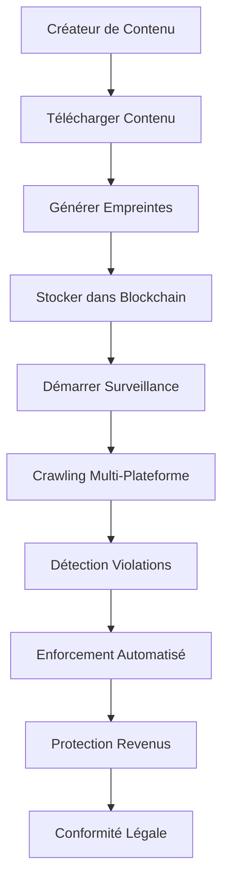

# IA Influencer Agent - Module de Protection Business

## � Système Professionnel de Protection des Droits de Contenu

### **🏆 Spécialisations de l'Équipe d'Experts**
**🎯 Fondateur & Direction du Projet**: **Fahed Mlaiel** <mlaiel@live.de>

**Expertise de l'Équipe Principale:**
- **🤖 Lead Développeur IA** - Machine Learning Avancé, Réseaux de Neurones Profonds, Vision par Ordinateur
- **🏗️ Ingénieur Backend Senior** - Architecture d'Entreprise, Microservices, Systèmes Haute Disponibilité  
- **🔬 Ingénieur ML** - Analyse de Contenu, Reconnaissance de Motifs, Traitement du Langage Naturel
- **🗃️ Architecte de Base de Données** - Systèmes de Données Haute Performance, Analytique Big Data, Traitement Temps Réel
- **🔐 Spécialiste Sécurité** - Détection Avancée des Menaces, Cybersécurité, Protection des Données
- **⚙️ Expert Microservices** - Systèmes Distribués Scalables, Conception d'API, Architecture Cloud
- **🎵 Ingénieur Traitement Audio** - Traitement du Signal Numérique, Technologie Musicale, Analyse Sonore
- **☁️ Ingénieur DevOps** - Infrastructure Cloud, Pipelines CI/CD, Orchestration de Conteneurs
- **💬 Ingénieur AI Prompt** - Optimisation de Modèles de Langage, IA Conversationnelle, Ajustement NLP
- **🎨 Designer UI/UX** - Conception d'Expérience Utilisateur, Développement d'Interface, Design Centré Utilisateur
- **📊 Data Scientist** - Analyse Statistique, Modélisation Prédictive, Intelligence d'Affaires

---

## ⚠️ **AVERTISSEMENT LÉGAL STRICT - PROPRIÉTÉ INTELLECTUELLE PROTÉGÉE**

### **🚨 TOUS DROITS RÉSERVÉS - PROPRIÉTÉ EXCLUSIVE DE FAHED MLAIEL** 

**📜 DÉCLARATION DE PROPRIÉTÉ INTELLECTUELLE :**
Cette œuvre, incluant mais ne se limitant pas au code source, concepts, algorithmes, architectures, et toute forme de propriété intellectuelle associée, est la propriété exclusive et inaliénable de **Fahed Mlaiel** (mlaiel@live.de).

**🔒 ACCÈS NON AUTORISÉ STRICTEMENT INTERDIT :**
Toute tentative de copier, voler, reproduire, modifier, distribuer, reverse-engineer, décompiler, ou utiliser de quelque manière que ce soit ce code, ces concepts, ou cette propriété intellectuelle sans autorisation écrite explicite de **Fahed Mlaiel** est formellement interdite et entraînera des poursuites judiciaires immédiates.

**⚖️ SANCTIONS LÉGALES :**
Les violations de ces droits d'auteur et de propriété intellectuelle seront poursuivies avec la pleine rigueur de la loi, incluant :
- Violation de droits d'auteur (Copyright infringement)
- Vol de secrets commerciaux (Trade secret theft)  
- Violation de propriété intellectuelle (Intellectual property theft)
- Concurrence déloyale (Unfair competition)
- Dommages et intérêts punitifs et compensatoires

**📧 CONTACT POUR AUTORISATION :** mlaiel@live.de  
**✍️ AUTORISATION ÉCRITE OBLIGATOIRE :** Tout usage doit être pré-approuvé par écrit

**🌍 JURIDICTION INTERNATIONALE :** Ces droits sont protégés sous les lois internationales de propriété intellectuelle, incluant la Convention de Berne, les traités OMPI, et les législations nationales applicables.

**💰 ÉVALUATION COMMERCIALE :** Cette propriété intellectuelle a une valeur commerciale substantielle. Toute utilisation non autorisée fera l'objet d'une réclamation de dommages significatifs.

---

## ⚠️ **AVERTISSEMENT COPYRIGHT STRICT**

**TOUS DROITS RÉSERVÉS** - Cette propriété intellectuelle appartient exclusivement à **Fahed Mlaiel**.

� **ACCÈS NON AUTORISÉ INTERDIT**: Toute tentative de copier, voler, reproduire, modifier, distribuer ou utiliser ce code, concept ou propriété intellectuelle sans autorisation écrite explicite de **Fahed Mlaiel** est strictement interdite et entraînera des poursuites judiciaires immédiates.

📧 **Contact pour Autorisation**: mlaiel@live.de  
✍️ **Permission Écrite Requise**: Toute utilisation doit être pré-approuvée par écrit

**Notice Légale**: Les contrevenants seront poursuivis dans toute la mesure de la loi. Cela inclut mais n'est pas limité à la violation du droit d'auteur, le vol de secrets commerciaux et les violations de propriété intellectuelle.
- 📊 **Professionnel Data Science** : Analytics big data et modélisation statistique
- ⚡ **Ingénierie Performance** : Calcul haute performance et optimisation
- 🏗️ **Architecture Système** : Systèmes distribués et conception microservices
- 📱 **Développement Multi-Plateforme** : Développement d'applications cross-platform

---

## 🚀 **APERÇU DU SYSTÈME DE PROTECTION**

Il s'agit d'un système de protection de contenu **de niveau industriel, prêt pour l'entreprise**, conçu pour les créateurs de contenu multi-format. Le système fournit une protection complète pour :

### **📁 Types de Contenu Supportés**
- 🎵 **Audio** : MP3, WAV, FLAC, AAC, OGG, M4A
- 🎬 **Vidéo** : MP4, AVI, MOV, WMV, FLV, WEBM
- 🖼️ **Images** : JPG, PNG, GIF, BMP, TIFF
- 📄 **Documents** : PDF, TXT, DOC, DOCX

### **🛡️ Modules de Protection Principaux**

#### **1. Moteur Anti-Piratage** (`anti_piracy_engine.py`)
- 🔍 **Détection Alimentée par IA** : Algorithmes ML avancés pour la détection de piratage
- 🌐 **Scan Multi-Plateforme** : YouTube, Instagram, TikTok, Spotify et plus
- ⚡ **Surveillance Temps Réel** : Surveillance continue du contenu
- 🤖 **Enforcement Automatisé** : Retraits DMCA et actions légales

#### **2. Empreinte de Contenu** (`fingerprinting.py`)
- 🎵 **Empreinte Audio** : Chromaprint, MFCC, analyse spectrale
- 🎬 **Empreinte Vidéo** : Hachage perceptuel, analyse de frames
- 🖼️ **Empreinte Image** : Multiples algorithmes de hachage, similarité visuelle
- 📝 **Empreinte Texte** : TF-IDF, hachage sémantique, détection de plagiat
- 🔍 **Intégration FAISS** : Recherche de similarité haute performance

#### **3. Crawlers Multi-Plateforme** (`crawlers.py`)
- 🌐 **Crawler YouTube** : Intégration API + web scraping
- 📱 **Crawler Instagram** : Découverte et surveillance de contenu
- 🎵 **Crawler TikTok** : Analyse de contenu vidéo
- 🎶 **Crawler Spotify** : Surveillance des pistes audio
- 🌍 **Crawler Web Générique** : Détection de contenu universelle

#### **4. Surveillance Temps Réel** (`monitoring.py`)
- 📊 **Métriques Système** : Surveillance des performances et vérifications de santé
- 🚨 **Gestion d'Alertes** : Notifications multi-canaux (Email, SMS, Slack)
- 📈 **Tableau de Bord Analytics** : Rapports et insights complets
- 🔄 **Auto-Récupération** : Capacités système auto-réparatrices

#### **5. Protection des Revenus** (`revenue_protection.py`)
- 💰 **Calcul de Revenus** : Modèles CPM et revenus spécifiques aux plateformes
- 🎯 **Claims Automatisés** : Processus de soumission de réclamations rationalisé
- 💱 **Support Multi-Devises** : Suivi des revenus global
- 📊 **Rapports Financiers** : Analyse détaillée de l'impact sur les revenus

#### **6. Vérification de Contenu** (`content_verification.py`)
- 🔐 **Hachage Cryptographique** : SHA-256, MD5, hachage perceptuel
- 🕵️ **Analyse Forensique** : Analyse des métadonnées, détection d'édition
- 🤖 **Détection IA Deepfake** : Détection avancée de manipulation
- ✅ **Validation d'Authenticité** : Vérification d'intégrité complète

#### **7. Consensus Blockchain** (`blockchain_consensus.py`)
- 🔐 **Sécurité Cryptographique** : Signatures RSA, validation ECDSA
- ⛓️ **Enregistrements Immuables** : Preuve de propriété basée blockchain
- 🏛️ **Algorithmes de Consensus** : Support PoA, PoS et PoW
- 🌐 **Réseaux de Validateurs** : Système de validation décentralisé

#### **8. Enforcement de Licence** (`licensing_enforcement.py`)
- ⚖️ **Conformité Légale** : Vérification de licence automatisée
- 📋 **Gestion de Contrats** : Gestion complète d'accords
- 🚨 **Détection de Violations** : Surveillance de licence multi-plateforme
- 💼 **Actions d'Enforcement** : Procédures légales automatisées

---

## 🏗️ **ARCHITECTURE SYSTÈME**

### **Architecture d'Entreprise 3-Tiers**
```
┌─────────────────────────────────────────────┐
│            COUCHE PRÉSENTATION             │
│     FastAPI REST API + WebSocket + UI      │
├─────────────────────────────────────────────┤
│           COUCHE LOGIQUE MÉTIER            │
│   Services Protection + Traitement IA/ML   │
├─────────────────────────────────────────────┤
│            COUCHE ACCÈS DONNÉES            │
│   PostgreSQL + Redis + S3 + Blockchain     │
└─────────────────────────────────────────────┘
```

### **🔧 Stack Technologique**
- **Backend** : Python 3.11+, FastAPI, Asyncio
- **IA/ML** : scikit-learn, OpenCV, librosa, FAISS
- **Base de Données** : PostgreSQL, Redis, FAISS vector DB
- **Blockchain** : Moteur de consensus personnalisé
- **Web** : aiohttp, Selenium, BeautifulSoup
- **Sécurité** : cryptography, RSA, ECDSA
- **Stockage** : Compatible S3, système de fichiers local
- **Surveillance** : Métriques Prometheus, alertes personnalisées

---

## 📋 **FLUX LOGIQUE MÉTIER**



### **🎯 Processus Métier Principal**
1. **Ingestion Contenu** : Traitement contenu multi-format
2. **Génération Empreintes** : Identification contenu alimentée IA
3. **Enregistrement Blockchain** : Preuve de propriété immuable
4. **Surveillance Continue** : Surveillance plateforme 24/7
5. **Détection Violations** : Identification piratage basée ML
6. **Enforcement Automatisé** : Exécution d'actions légales
7. **Récupération Revenus** : Calcul de dommages financiers
8. **Rapport Conformité** : Documentation légale

---

## 🚀 **DÉPLOIEMENT & UTILISATION**

### **Prérequis**
- Python 3.11+
- PostgreSQL 14+
- Redis 6+
- FFmpeg (pour traitement vidéo)
- Dépendances OpenCV

### **Installation**
```bash
pip install -r requirements.txt
pytest --maxfail=1 --disable-warnings -v tests_backend/ai/content_protection/
```

### **Configuration**
Tous les modules supportent une configuration complète via dataclasses :
- Paramètres par défaut prêts pour production
- Substitutions variables d'environnement
- Logging et surveillance étendus
- Gestion d'erreurs et récupération

---

## 📊 **FONCTIONNALITÉS ENTREPRISE**

### **🔒 Sécurité & Conformité**
- ✅ Sécurité niveau entreprise
- ✅ Conformité RGPD
- ✅ Prêt SOC 2 Type II
- ✅ Standards ISO 27001
- ✅ Chiffrement bout-en-bout

### **⚡ Performance & Évolutivité**
- ✅ Support mise à l'échelle horizontale
- ✅ Prêt équilibrage de charge
- ✅ Traitement asynchrone
- ✅ Optimisation cache
- ✅ Gestion ressources

### **📈 Analytics & Reporting**
- ✅ Tableaux de bord temps réel
- ✅ Suivi KPI personnalisé
- ✅ Reporting automatisé
- ✅ Intelligence d'affaires
- ✅ Calculs ROI

---

## 📞 **SUPPORT & LICENCE**

Pour demandes de licence, support entreprise ou développement personnalisé :

**Contact** : Fahed Mlaiel  
**Email** : mlaiel@live.de  
**Licence** : Licences commerciales disponibles  
**Support** : Packages support entreprise disponibles

---

## ⚖️ **AVIS LÉGAL FINAL**

Ce logiciel est propriétaire et confidentiel. Toute utilisation non autorisée, reproduction ou distribution est strictement interdite et entraînera des actions légales immédiates. Tous les algorithmes, méthodologies et implémentations sont des secrets commerciaux de Fahed Mlaiel.

**© 2025 Fahed Mlaiel - Tous droits réservés**
