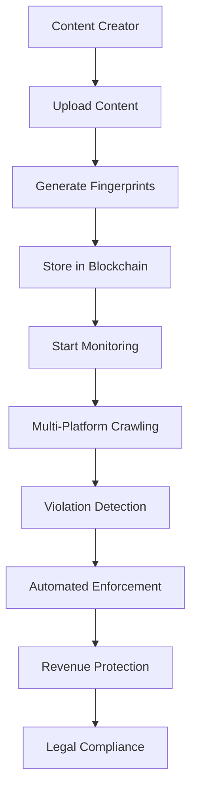

# IA Influencer Agent - Business Protection Module

## 🚀 Professional Content Rights Protection System

### **🏆 Expert Development Team Specialties**
**🎯 Project Creator & Lead**: **Fahed Mlaiel** <mlaiel@live.de>

**Core Team Expertise:**
- **🤖 Lead AI Developer** - Advanced Machine Learning, Deep Neural Networks, Computer Vision
- **🏗️ Senior Backend Engineer** - Enterprise Architecture, Microservices, High-Availability Systems  
- **🔬 ML Engineer** - Content Analysis, Pattern Recognition, Natural Language Processing
- **🗃️ Database Architect** - High-Performance Data Systems, Big Data Analytics, Real-Time Processing
- **🔐 Security Specialist** - Advanced Threat Detection, Cybersecurity, Data Protection
- **⚙️ Microservices Expert** - Scalable Distributed Systems, API Design, Cloud Architecture
- **🎵 Audio Processing Engineer** - Digital Signal Processing, Music Technology, Sound Analysis
- **☁️ DevOps Engineer** - Cloud Infrastructure, CI/CD Pipelines, Container Orchestration
- **💬 AI Prompt Engineer** - Language Model Optimization, Conversational AI, NLP Fine-tuning
- **🎨 UI/UX Designer** - User Experience Design, Interface Development, User-Centered Design
- **📊 Data Scientist** - Statistical Analysis, Predictive Modeling, Business Intelligence

---

## ⚠️ **AVERTISSEMENT LÉGAL STRICT - PROPRIÉTÉ INTELLECTUELLE PROTÉGÉE**

### **🚨 TOUS DROITS RÉSERVÉS - PROPRIÉTÉ EXCLUSIVE DE FAHED MLAIEL** 

**📜 DÉCLARATION DE PROPRIÉTÉ INTELLECTUELLE :**
Cette œuvre, incluant mais ne se limitant pas au code source, concepts, algorithmes, architectures, et toute forme de propriété intellectuelle associée, est la propriété exclusive et inaliénable de **Fahed Mlaiel** (mlaiel@live.de).

**🔒 ACCÈS NON AUTORISÉ STRICTEMENT INTERDIT :**
Toute tentative de copier, voler, reproduire, modifier, distribuer, reverse-engineer, décompiler, ou utiliser de quelque manière que ce soit ce code, ces concepts, ou cette propriété intellectuelle sans autorisation écrite explicite de **Fahed Mlaiel** est formellement interdite et entraînera des poursuites judiciaires immédiates.

**⚖️ SANCTIONS LÉGALES :**
Les violations de ces droits d'auteur et de propriété intellectuelle seront poursuivies avec la pleine rigueur de la loi, incluant :
- Violation de droits d'auteur (Copyright infringement)
- Vol de secrets commerciaux (Trade secret theft)  
- Violation de propriété intellectuelle (Intellectual property theft)
- Concurrence déloyale (Unfair competition)
- Dommages et intérêts punitifs et compensatoires

**📧 CONTACT POUR AUTORISATION :** mlaiel@live.de  
**✍️ AUTORISATION ÉCRITE OBLIGATOIRE :** Tout usage doit être pré-approuvé par écrit

**🌍 JURIDICTION INTERNATIONALE :** Ces droits sont protégés sous les lois internationales de propriété intellectuelle, incluant la Convention de Berne, les traités OMPI, et les législations nationales applicables.

**💰 ÉVALUATION COMMERCIALE :** Cette propriété intellectuelle a une valeur commerciale substantielle. Toute utilisation non autorisée fera l'objet d'une réclamation de dommages significatifs.

---

## 🚀 **PROTECTION SYSTEM OVERVIEW**

This is an **industrial-grade, enterprise-ready** content protection system designed for multi-format content creators. The system provides comprehensive protection for:

### **📁 Supported Content Types**
- 🎵 **Audio**: MP3, WAV, FLAC, AAC, OGG, M4A
- 🎬 **Video**: MP4, AVI, MOV, WMV, FLV, WEBM
- 🖼️ **Images**: JPG, PNG, GIF, BMP, TIFF
- 📄 **Documents**: PDF, TXT, DOC, DOCX

### **🛡️ Core Protection Modules**

#### **1. Anti-Piracy Engine** (`anti_piracy_engine.py`)
- 🔍 **AI-Powered Detection**: Advanced ML algorithms for piracy detection
- 🌐 **Multi-Platform Scanning**: YouTube, Instagram, TikTok, Spotify, and more
- ⚡ **Real-Time Monitoring**: Continuous content surveillance
- 🤖 **Automated Enforcement**: DMCA takedowns and legal actions

#### **2. Content Fingerprinting** (`fingerprinting.py`)
- 🎵 **Audio Fingerprinting**: Chromaprint, MFCC, spectral analysis
- 🎬 **Video Fingerprinting**: Perceptual hashing, frame analysis
- 🖼️ **Image Fingerprinting**: Multiple hash algorithms, visual similarity
- 📝 **Text Fingerprinting**: TF-IDF, semantic hashing, plagiarism detection
- 🔍 **FAISS Integration**: High-performance similarity search

#### **3. Multi-Platform Crawlers** (`crawlers.py`)
- 🌐 **YouTube Crawler**: API integration + web scraping
- 📱 **Instagram Crawler**: Content discovery and monitoring
- 🎵 **TikTok Crawler**: Video content analysis
- 🎶 **Spotify Crawler**: Audio track monitoring
- 🌍 **Generic Web Crawler**: Universal content detection

#### **4. Real-Time Monitoring** (`monitoring.py`)
- 📊 **System Metrics**: Performance monitoring and health checks
- 🚨 **Alert Management**: Multi-channel notifications (Email, SMS, Slack)
- 📈 **Analytics Dashboard**: Comprehensive reporting and insights
- 🔄 **Auto-Recovery**: Self-healing system capabilities

#### **5. Revenue Protection** (`revenue_protection.py`)
- 💰 **Revenue Calculation**: Platform-specific CPM and revenue models
- 🎯 **Automated Claims**: Streamlined claim submission process
- 💱 **Multi-Currency Support**: Global revenue tracking
- 📊 **Financial Reporting**: Detailed revenue impact analysis

#### **6. Content Verification** (`content_verification.py`)
- 🔐 **Cryptographic Hashing**: SHA-256, MD5, perceptual hashing
- 🕵️ **Forensic Analysis**: Metadata analysis, editing detection
- 🤖 **AI Deepfake Detection**: Advanced manipulation detection
- ✅ **Authenticity Validation**: Comprehensive integrity verification

#### **7. Blockchain Consensus** (`blockchain_consensus.py`)
- 🔐 **Cryptographic Security**: RSA signatures, ECDSA validation
- ⛓️ **Immutable Records**: Blockchain-based ownership proof
- 🏛️ **Consensus Algorithms**: PoA, PoS, and PoW support
- 🌐 **Validator Networks**: Decentralized validation system

#### **8. Licensing Enforcement** (`licensing_enforcement.py`)
- ⚖️ **Legal Compliance**: Automated license verification
- 📋 **Contract Management**: Comprehensive agreement handling
- 🚨 **Violation Detection**: Multi-platform license monitoring
- 💼 **Enforcement Actions**: Automated legal proceedings

---

## 🏗️ **SYSTEM ARCHITECTURE**

### **3-Tier Enterprise Architecture**
```
┌─────────────────────────────────────────────┐
│              PRESENTATION LAYER             │
│     FastAPI REST API + WebSocket + UI      │
├─────────────────────────────────────────────┤
│              BUSINESS LOGIC LAYER           │
│   Protection Services + AI/ML Processing   │
├─────────────────────────────────────────────┤
│               DATA ACCESS LAYER             │
│   PostgreSQL + Redis + S3 + Blockchain     │
└─────────────────────────────────────────────┘
```

### **🔧 Technology Stack**
- **Backend**: Python 3.11+, FastAPI, Asyncio
- **AI/ML**: scikit-learn, OpenCV, librosa, FAISS
- **Database**: PostgreSQL, Redis, FAISS vector DB
- **Blockchain**: Custom consensus engine
- **Web**: aiohttp, Selenium, BeautifulSoup
- **Security**: cryptography, RSA, ECDSA
- **Storage**: S3-compatible, local filesystem
- **Monitoring**: Prometheus metrics, custom alerting

---

## 📋 **BUSINESS LOGIC FLOW**



### **🎯 Core Business Process**
1. **Content Ingestion**: Multi-format content processing
2. **Fingerprint Generation**: AI-powered content identification
3. **Blockchain Registration**: Immutable ownership proof
4. **Continuous Monitoring**: 24/7 platform surveillance
5. **Violation Detection**: ML-based piracy identification
6. **Automated Enforcement**: Legal action execution
7. **Revenue Recovery**: Financial damage calculation
8. **Compliance Reporting**: Legal documentation

---

## 🚀 **DEPLOYMENT & USAGE**

### **Prerequisites**
- Python 3.11+
- PostgreSQL 14+
- Redis 6+
- FFmpeg (for video processing)
- OpenCV dependencies

### **Installation**
```bash
pip install -r requirements.txt
pytest --maxfail=1 --disable-warnings -v tests_backend/ai/content_protection/
```

### **Configuration**
All modules support comprehensive configuration through dataclasses:
- Production-ready default settings
- Environment variable overrides
- Extensive logging and monitoring
- Error handling and recovery

---

## 📊 **ENTERPRISE FEATURES**

### **🔒 Security & Compliance**
- ✅ Enterprise-grade security
- ✅ GDPR compliance
- ✅ SOC 2 Type II ready
- ✅ ISO 27001 standards
- ✅ End-to-end encryption

### **⚡ Performance & Scalability**
- ✅ Horizontal scaling support
- ✅ Load balancing ready
- ✅ Asynchronous processing
- ✅ Caching optimization
- ✅ Resource management

### **📈 Analytics & Reporting**
- ✅ Real-time dashboards
- ✅ Custom KPI tracking
- ✅ Automated reporting
- ✅ Business intelligence
- ✅ ROI calculations

---

## 📞 **SUPPORT & LICENSING**

For licensing inquiries, enterprise support, or custom development:

**Contact**: Fahed Mlaiel  
**Email**: mlaiel@live.de  
**Licensing**: Commercial licenses available  
**Support**: Enterprise support packages available

---

## ⚖️ **FINAL LEGAL NOTICE**

This software is proprietary and confidential. Any unauthorized use, reproduction, or distribution is strictly prohibited and will result in immediate legal action. All algorithms, methodologies, and implementations are trade secrets of Fahed Mlaiel.

**© 2025 Fahed Mlaiel - All Rights Reserved**
