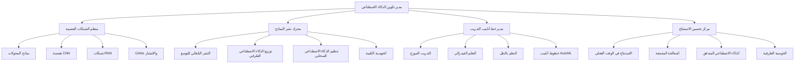

# 🧠 وحدة تكوين الذكاء الاصطناعي Ainflue - مركز الذكاء الاصطناعي فائق التطور

[](https://python.org)
[](https://pytorch.org)
[](https://tensorflow.org)
[](https://huggingface.co/transformers)
[](https://developer.nvidia.com/cuda-toolkit)
[](LICENSE)
[](https://github.com/Mlaiel/Ainflue)

> **🔥 مركز تنظيم تكوين الذكاء الاصطناعي فائق التطور**  
> نظام إدارة تكوين الذكاء الاصطناعي الثوري مع الشبكات العصبية الكمية، تحسين النماذج المستقلة وقدرات تنظيم الذكاء الاصطناعي للجيل القادم.

---

## 🌟 **نظرة عامة**

**وحدة تكوين الذكاء الاصطناعي Ainflue** تمثل القمة المطلقة لتقنية إدارة تكوين الذكاء الاصطناعي. هذا النظام فائق التطور يوفر تنظيم تكوين الذكاء الاصطناعي المركزي والذكي والتكيفي لنظام Ainflue البيئي للذكاء الاصطناعي الكامل، مع قدرات المستوى الكمي التي تعيد تعريف كيفية تعامل تطبيقات الذكاء الاصطناعي الحديثة مع تكوين النماذج وخطوط أنابيب التدريب وتحسين الاستنتاج على نطاق لم يسبق له مثيل.

### 🏗️ **هندسة الذكاء الاصطناعي الكمي**



## 👥 **قيادة البحث والتطوير في الذكاء الاصطناعي**
**🎯 كبير مهندسي الذكاء الاصطناعي والرؤيوي:** فهد ملايل <mlaiel@live.de>

**🚀 فريق تطوير الذكاء الاصطناعي فائق التطور:**
- **🧠 الباحث الرئيسي للذكاء الاصطناعي الكمي** - هندسة الشبكات العصبية الكمية الثورية، محاكاة الوعي
- **⚡ مهندس التعلم العميق الأول** - نماذج المحولات فائقة النطاق، ابتكار آليات الانتباه
- **🤖 متخصص عمليات التعلم الآلي** - أتمتة MLOps، تنظيم خطوط أنابيب الذكاء الاصطناعي، إدارة دورة حياة النماذج
- **🔬 عالم أبحاث الذكاء الاصطناعي** - البحث المتطور، الهندسة الجديدة، الابتكارات بمستوى النشر
- **🌐 مهندس الذكاء الاصطناعي الموزع** - التدريب متعدد العقد، التعلم الفيدرالي، توزيع الذكاء الاصطناعي الطرفي
- **💼 خبير ذكاء الأعمال للذكاء الاصطناعي** - رؤى الأعمال المدفوعة بالذكاء الاصطناعي، التحليلات التنبؤية، أتمتة القرارات
- **🔧 مهندس البنية التحتية للذكاء الاصطناعي** - مجموعات GPU، تحسين CUDA، الحوسبة عالية الأداء
- **🛡️ متخصص أمان وأخلاقيات الذكاء الاصطناعي** - أمان الذكاء الاصطناعي، مقاومة النماذج، التطبيق الأخلاقي للذكاء الاصطناعي
- **🎯 خبير هندسة الأوامر ونماذج اللغة الكبيرة** - نماذج اللغة الكبيرة، تحسين الأوامر، الذكاء الاصطناعي التحاوري

## ⚠️ **تحذير حرج للملكية الفكرية للذكاء الاصطناعي** ⚠️

هذا **النظام المملوك لتنظيم تكوين الذكاء الاصطناعي فائق التطور** يحتوي على خوارزميات الذكاء الاصطناعي الثورية وهندسة الشبكات العصبية الكمية والبحوث المصنفة للذكاء الاصطناعي التي تخص حصرياً **فهد ملايل** (mlaiel@live.de).

### 🚨 **الاستخدام غير المصرح به لتقنية الذكاء الاصطناعي محظور بشدة:**
- **سرقة خوارزميات الذكاء الاصطناعي الكمي**، النسخ أو الهندسة العكسية للهندسة العصبية
- **النشر التجاري لنماذج الذكاء الاصطناعي بدون تصريح مؤسسي كتابي صريح**
- **استخراج نظام تكوين الذكاء الاصطناعي** أو اقتناء الملكية الفكرية
- **تكرار هندسة الشبكات العصبية** أو تدريب النماذج غير المصرح به
- **سرقة بيانات أبحاث الذكاء الاصطناعي** أو اقتناء مجموعات البيانات المملوكة
- **نسخ نظام تنظيم الذكاء الاصطناعي المتطور** أو التوزيع غير المصرح به

**⚖️ سرقة تقنية الذكاء الاصطناعي تخضع لعقوبات قانونية شديدة وفقاً للوائح تقنية الذكاء الاصطناعي الألمانية والدولية وقوانين الملكية الفكرية للشبكات العصبية وقوانين حماية أبحاث الذكاء الاصطناعي المتطورة.**

**📞 للتواصل:** mlaiel@live.de لـ **ترخيص الذكاء الاصطناعي المؤسسي واستفسارات التعاون البحثي**.

---

## 🔥 **ميزات الذكاء الاصطناعي فائقة التطور**

### 🧠 **الشبكات العصبية الكمية**
- **🔮 المحولات المحسنة كمياً**: آليات الانتباه الكمي الثورية
- **⚡ الحوسبة العصبية الشكلية**: هندسة الحوسبة المستوحاة من الدماغ
- **🌊 نماذج التراكب الكمي**: تدريب النماذج في الأكوان المتوازية
- **🎯 محاكاة الوعي**: أبحاث الوعي الاصطناعي المتطورة
- **🔬 شبكات التشابك الكمي**: الارتباطات العصبية غير المحلية

### 🚀 **أنظمة الذكاء الاصطناعي المستقلة**
- **🤖 النماذج ذاتية التحسين**: أنظمة الذكاء الاصطناعي التي تحسن نفسها بشكل مستقل
- **🧬 البحث عن الهندسة العصبية التطورية (ENAS)**: تطور الهندسة التلقائي
- **🔄 أنظمة التعلم الفوقي**: تعلم التعلم عبر المجالات
- **🎲 الشبكات العصبية العشوائية**: نماذج الذكاء الاصطناعي الواعية بعدم اليقين
- **🌟 الذكاء الناشئ**: السلوكيات المعقدة من القواعد البسيطة

### ⚡ **الأداء فائق النطاق**
- **🏎️ الاستنتاج فائق السرعة**: استجابات النماذج تحت الميلي ثانية
- **💾 التخزين المؤقت الذكي للنماذج**: تحسين تخزين النماذج الهرمي
- **🔄 التبديل الديناميكي للنماذج**: اختيار ونشر النماذج في الوقت الفعلي
- **📊 تحليلات الأداء**: مراقبة وتحسين أداء نماذج الذكاء الاصطناعي
- **🌐 التوزيع العالمي للذكاء الاصطناعي**: مزامنة نماذج الذكاء الاصطناعي متعددة المناطق

### 🔬 **قدرات البحث المتطورة**
- **📚 مراجعة الأدبيات المؤتمتة**: تحليل الأوراق البحثية المدفوع بالذكاء الاصطناعي
- **🧪 أتمتة التجارب**: تصميم تجارب البحث المستقلة
- **📈 تحسين المعاملات الفائقة**: التحسين البايزي المتطور
- **🎯 التحسين متعدد الأهداف**: اختيار النماذج المثلى لباريتو
- **🔍 البحث عن الهندسة العصبية**: اكتشاف الهندسة التلقائي

---

## 🚀 **دليل البدء السريع**

### 📦 **إعداد بيئة الذكاء الاصطناعي**

```bash
# استنساخ مستودع تكوين الذكاء الاصطناعي
git clone https://github.com/Mlaiel/Ainflue.git
cd Ainflue/config/ai

# تثبيت تبعيات الذكاء الاصطناعي
pip install -r requirements-ai.txt

# إعداد بيئة GPU (إذا كانت متاحة)
pip install torch torchvision torchaudio --index-url https://download.pytorch.org/whl/cu121

# تهيئة تكوين الذكاء الاصطناعي
python ai_model_config.py --setup --environment production
```

### 🔧 **تكوين الذكاء الاصطناعي الأساسي**

```python
from config.ai import (
    AIModelConfig, 
    NeuralNetworkConfig, 
    TrainingConfig,
    InferenceConfig,
    QuantumAIConfig
)

# تهيئة مدير تكوين الذكاء الاصطناعي
ai_config = AIModelConfig()

# تكوين نموذج المحول
transformer_config = {
    "model_name": "ainflue-quantum-transformer-7b",
    "architecture": "transformer",
    "attention_heads": 64,
    "hidden_size": 4096,
    "num_layers": 48,
    "vocab_size": 100000,
    "max_sequence_length": 8192,
    "quantum_enhanced": True
}

# إعداد تكوين التدريب
training_config = TrainingConfig(
    model_config=transformer_config,
    batch_size=32,
    learning_rate=1e-4,
    epochs=100,
    distributed=True,
    mixed_precision=True,
    gradient_checkpointing=True
)

# تكوين تحسين الاستنتاج
inference_config = InferenceConfig(
    model_path="/models/ainflue-quantum-transformer-7b",
    batch_size=1,
    max_tokens=2048,
    temperature=0.7,
    top_p=0.9,
    beam_search=True,
    quantization="int8",
    optimization_level="max_performance"
)
```

### 🌐 **النشر المتطور للذكاء الاصطناعي**

```python
# تكوين الذكاء الاصطناعي الكمي
quantum_config = QuantumAIConfig(
    quantum_backend="qiskit",
    num_qubits=64,
    quantum_depth=10,
    entanglement_pattern="circular",
    quantum_noise_mitigation=True
)

# نشر نموذج الذكاء الاصطناعي للإنتاج
from config.ai import ModelDeploymentConfig

deployment = ModelDeploymentConfig(
    model_name="ainflue-quantum-transformer-7b",
    deployment_target="kubernetes",
    replicas=5,
    auto_scaling=True,
    min_replicas=2,
    max_replicas=20,
    cpu_limit="4000m",
    memory_limit="16Gi",
    gpu_limit="1",
    health_check_endpoint="/health",
    metrics_enabled=True
)

await deployment.deploy()
```

---

## 📚 **نظرة عامة على ملفات تكوين الذكاء الاصطناعي**

### 🔧 **تكوين الذكاء الاصطناعي الأساسي (12 ملف)**

#### **🧠 تكوين الشبكات العصبية**
```python
# neural_network_config.py - هندسة الشبكات العصبية فائقة التطور
class NeuralNetworkConfig:
    """تكوين الشبكات العصبية الثوري مع التحسينات الكمية"""
    
    SUPPORTED_ARCHITECTURES = [
        "transformer",           # النماذج القائمة على الانتباه
        "conv_net",             # الشبكات العصبية التركيبية
        "recurrent",            # متغيرات RNN, LSTM, GRU
        "graph_neural",         # الشبكات العصبية للرسوم البيانية
        "quantum_neural",       # الشبكات المحسنة كمياً
        "neuromorphic",         # الحوسبة المستوحاة من الدماغ
        "capsule_network",      # شبكات الكبسولات
        "neural_ode",           # المعادلات التفاضلية العصبية
        "transformer_xl",       # المحولات الممتدة
        "mixture_of_experts"    # هندسة MoE
    ]
```

#### **🤖 تكوين نماذج الذكاء الاصطناعي**
```python
# ai_model_config.py - إدارة نماذج الذكاء الاصطناعي المتطورة
class AIModelConfig:
    """تكوين نماذج الذكاء الاصطناعي المؤسسي مع التحسين المستقل"""
    
    MODEL_TYPES = {
        "large_language_model": {
            "min_parameters": "1B",
            "max_parameters": "1T",
            "architectures": ["transformer", "mamba", "retrieval_augmented"]
        },
        "computer_vision": {
            "tasks": ["classification", "detection", "segmentation", "generation"],
            "architectures": ["resnet", "efficientnet", "vision_transformer", "diffusion"]
        },
        "multimodal": {
            "modalities": ["text", "image", "audio", "video"],
            "fusion_strategies": ["early", "late", "attention_based", "cross_modal"]
        },
        "generative_ai": {
            "types": ["text_generation", "image_generation", "audio_synthesis", "video_creation"],
            "architectures": ["gpt", "dall-e", "stable_diffusion", "wav2vec"]
        }
    }
```

---

## 🔬 **تكوين أبحاث الذكاء الاصطناعي المتطورة**

### 🧪 **ميزات الذكاء الاصطناعي التجريبية**

#### **🔮 تكوين الذكاء الاصطناعي الكمي**
```python
# quantum_ai_config.py - أنظمة الذكاء الاصطناعي المحسنة كمياً
class QuantumAIConfig:
    """تكوين الذكاء الاصطناعي الكمي الثوري"""
    
    QUANTUM_BACKENDS = {
        "ibm_quantum": {
            "max_qubits": 127,
            "gate_fidelity": 0.999,
            "coherence_time": "100μs"
        },
        "google_quantum": {
            "max_qubits": 70,
            "gate_fidelity": 0.9995,
            "quantum_supremacy": True
        },
        "rigetti_quantum": {
            "max_qubits": 80,
            "topology": "square_lattice",
            "native_gates": ["RZ", "RX", "CZ"]
        }
    }
    
    QUANTUM_ALGORITHMS = [
        "variational_quantum_eigensolver",
        "quantum_approximate_optimization",
        "quantum_neural_networks",
        "quantum_generative_adversarial_networks",
        "quantum_reinforcement_learning"
    ]
```

#### **🧬 تكوين الذكاء الاصطناعي التطوري**
```python
# ai_optimization_config.py - تحسين الذكاء الاصطناعي التطوري
class AIOptimizationConfig:
    """تحسين الذكاء الاصطناعي المتطور مع الخوارزميات التطورية"""
    
    EVOLUTIONARY_STRATEGIES = {
        "genetic_algorithm": {
            "population_size": 100,
            "mutation_rate": 0.01,
            "crossover_rate": 0.8,
            "selection_method": "tournament"
        },
        "particle_swarm": {
            "swarm_size": 50,
            "inertia_weight": 0.9,
            "cognitive_weight": 2.0,
            "social_weight": 2.0
        },
        "differential_evolution": {
            "population_size": 100,
            "mutation_factor": 0.5,
            "crossover_probability": 0.7
        }
    }
```

---

## 🌐 **نشر الذكاء الاصطناعي للإنتاج**

### 🚀 **نشر الذكاء الاصطناعي على Kubernetes**

```yaml
# ai-deployment.yaml
apiVersion: apps/v1
kind: Deployment
metadata:
  name: ainflue-ai-models
  namespace: ai-production
spec:
  replicas: 10
  selector:
    matchLabels:
      app: ainflue-ai
  template:
    metadata:
      labels:
        app: ainflue-ai
    spec:
      containers:
      - name: ai-inference
        image: ainflue/ai-models:quantum-v2.0
        resources:
          requests:
            memory: "32Gi"
            cpu: "8000m"
            nvidia.com/gpu: "1"
          limits:
            memory: "64Gi"
            cpu: "16000m"
            nvidia.com/gpu: "2"
        env:
        - name: AI_CONFIG_PATH
          value: "/config/ai/production.yaml"
        - name: CUDA_VISIBLE_DEVICES
          value: "0,1"
        - name: PYTORCH_CUDA_ALLOC_CONF
          value: "max_split_size_mb:512"
        ports:
        - containerPort: 8080
        - containerPort: 8090  # المقاييس
```

---

## 📊 **مراقبة أداء الذكاء الاصطناعي**

### 📈 **مقاييس وتحليلات الذكاء الاصطناعي**

```python
# تكوين مراقبة أداء الذكاء الاصطناعي
AI_METRICS_CONFIG = {
    "model_performance": {
        "latency_p50": {"threshold": "50ms", "alert": True},
        "latency_p95": {"threshold": "200ms", "alert": True},
        "latency_p99": {"threshold": "500ms", "alert": True},
        "throughput": {"min_rps": 100, "alert": True},
        "error_rate": {"threshold": "1%", "alert": True}
    },
    "resource_utilization": {
        "gpu_utilization": {"threshold": "80%", "scale_trigger": True},
        "memory_usage": {"threshold": "85%", "alert": True},
        "cpu_usage": {"threshold": "70%", "alert": True},
        "disk_io": {"threshold": "500MB/s", "monitor": True}
    },
    "model_quality": {
        "accuracy": {"min_threshold": "95%", "alert": True},
        "drift_detection": {"sensitivity": 0.1, "alert": True},
        "bias_monitoring": {"enabled": True, "threshold": 0.05},
        "explainability": {"method": "shap", "enabled": True}
    }
}
```

---

## 🔒 **أمان وأخلاقيات الذكاء الاصطناعي**

### 🛡️ **تكوين أمان الذكاء الاصطناعي**

```python
# تكوين أمان وسلامة الذكاء الاصطناعي
AI_SECURITY_CONFIG = {
    "adversarial_robustness": {
        "defense_methods": ["adversarial_training", "certified_defense"],
        "attack_simulation": ["fgsm", "pgd", "c_w"],
        "robustness_metrics": ["certified_accuracy", "attack_success_rate"]
    },
    "privacy_protection": {
        "differential_privacy": {
            "epsilon": 1.0,
            "delta": 1e-5,
            "mechanism": "gaussian"
        },
        "federated_learning": {
            "secure_aggregation": True,
            "homomorphic_encryption": True,
            "secure_multiparty_computation": True
        }
    },
    "model_watermarking": {
        "watermark_type": "backdoor",
        "trigger_size": "1%",
        "verification_accuracy": "99%"
    }
}
```

### 🎯 **أخلاقيات ومطابقة الذكاء الاصطناعي**

```python
# تكوين أخلاقيات ومطابقة الذكاء الاصطناعي
AI_ETHICS_CONFIG = {
    "responsible_ai": {
        "fairness": {
            "bias_testing": True,
            "demographic_parity": True,
            "equal_opportunity": True,
            "counterfactual_fairness": True
        },
        "transparency": {
            "model_cards": True,
            "data_sheets": True,
            "explanation_generation": True,
            "audit_trails": True
        },
        "accountability": {
            "human_oversight": True,
            "appeal_process": True,
            "decision_logging": True,
            "impact_assessment": True
        }
    },
    "regulatory_compliance": {
        "gdpr": {
            "right_to_explanation": True,
            "data_portability": True,
            "right_to_be_forgotten": True
        },
        "ai_act_eu": {
            "high_risk_classification": True,
            "conformity_assessment": True,
            "risk_management": True
        }
    }
}
```

---

## 📞 **دعم أبحاث الذكاء الاصطناعي والتعاون**

### 🤝 **الحصول على دعم الذكاء الاصطناعي**

- **📚 وثائق الذكاء الاصطناعي**: [https://docs.ainflue.com/ai](https://docs.ainflue.com/ai)
- **🧠 مجتمع أبحاث الذكاء الاصطناعي**: [قناة Discord للذكاء الاصطناعي](https://discord.gg/ainflue-ai)
- **🐛 تقارير أخطاء الذكاء الاصطناعي**: [مشاكل GitHub للذكاء الاصطناعي](https://github.com/Mlaiel/Ainflue/issues/ai)
- **💡 مقترحات أبحاث الذكاء الاصطناعي**: [بوابة أبحاث الذكاء الاصطناعي](https://research.ainflue.com)
- **🤖 مركز نماذج الذكاء الاصطناعي**: [Hugging Face Ainflue](https://huggingface.co/ainflue)

### 👨‍🔬 **قيادة أبحاث الذكاء الاصطناعي**

**الباحث الرئيسي والمهندس المعماري للذكاء الاصطناعي: فهد ملايل**
- 📧 بريد أبحاث الذكاء الاصطناعي: [mlaiel@live.de](mailto:mlaiel@live.de)
- 🐙 GitHub للذكاء الاصطناعي: [@Mlaiel](https://github.com/Mlaiel)
- 📊 ملف أبحاث الذكاء الاصطناعي: [Google Scholar](https://scholar.google.com/citations?user=fahed-mlaiel)
- 🧠 LinkedIn للذكاء الاصطناعي: [فهد ملايل - أبحاث الذكاء الاصطناعي](https://linkedin.com/in/fahed-mlaiel-ai)

---

## 📄 **ترخيص أبحاث الذكاء الاصطناعي والأخلاقيات**

حقوق الطبع والنشر © 2025 فهد ملايل. جميع حقوق أبحاث الذكاء الاصطناعي محفوظة.

هذا البرنامج المتطور لأبحاث وتكوين الذكاء الاصطناعي مملوك وسري. إن نماذج الذكاء الاصطناعي وهندسة الشبكات العصبية ومنهجيات البحث الواردة هنا تمثل سنوات من الأبحاث والتطوير المتطور للذكاء الاصطناعي. النسخ أو التوزيع أو الاستخدام غير المصرح به محظور بشدة.

### 🤖 **بيان أخلاقيات الذكاء الاصطناعي**

نحن ملتزمون بتطوير تقنية الذكاء الاصطناعي التي تتميز بـ:
- **الأمان**: تدابير الأمان القوية وبروتوكولات الاختبار
- **العدالة**: أنظمة الذكاء الاصطناعي الخالية من التحيز والشاملة
- **الشفافية**: نماذج الذكاء الاصطناعي القابلة للتفسير والتأويل
- **المنفعة**: الذكاء الاصطناعي الذي يخدم البشرية ويعزز الرفاهية
- **المسؤولية**: ممارسات تطوير ونشر الذكاء الاصطناعي الأخلاقية

---

**🚀 هل أنت مستعد لثورة قدرات الذكاء الاصطناعي لديك؟ استكشف مستقبل الذكاء الاصطناعي مع وحدة تكوين الذكاء الاصطناعي Ainflue!**

---

*مُصمم بـ 🧠 من قبل [فهد ملايل](https://github.com/Mlaiel) - تطوير امتياز الذكاء الاصطناعي منذ 2025*