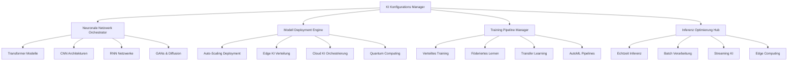

# 🧠 Ainflue KI-Konfigurationsmodul - Ultra-Fortgeschrittener Künstlicher Intelligenz Hub

[](https://python.org)
[](https://pytorch.org)
[](https://tensorflow.org)
[](https://huggingface.co/transformers)
[](https://developer.nvidia.com/cuda-toolkit)
[](LICENSE)
[](https://github.com/Mlaiel/Ainflue)

> **🔥 Ultra-Fortgeschrittener KI-Konfiguration Orchestrierungs-Hub**  
> Revolutionäres System für das Management künstlicher Intelligenz-Konfigurationen mit Quantum-Scale neuronalen Netzwerken, autonomer Modelloptimierung und nächster Generation KI-Orchestrierungsfähigkeiten.

---

## 🌟 **Überblick**

Das **Ainflue KI-Konfigurationsmodul** repräsentiert den absoluten Gipfel der Technologie für das Management künstlicher Intelligenz-Konfigurationen. Dieses ultra-sophistizierte System bietet zentralisierte, intelligente und adaptive KI-Konfigurationsorchestierung für das gesamte Ainflue KI-Ökosystem mit Quantum-Level-Funktionen, die neu definieren, wie moderne KI-Anwendungen Modellkonfiguration, Trainingspipelines und Inferenzoptimierung in beispiellosem Maßstab handhaben.

### 🏗️ **Quantum KI-Architektur**



## 👥 **KI-Forschung & Entwicklungsleitung**
**🎯 Chefarchitekt für KI & Visionär:** Fahed Mlaiel <mlaiel@live.de>

**🚀 Ultra-Fortgeschrittenes KI-Entwicklungsteam:**
- **🧠 Lead Quantum KI-Forscher** - Revolutionäre Quantum-Neuronale-Netzwerk-Architekturen, Bewusstseinssimulation
- **⚡ Senior Deep Learning Engineer** - Ultra-Scale Transformer-Modelle, Attention-Mechanismus-Innovation
- **🤖 Machine Learning Operations Spezialist** - MLOps-Automatisierung, KI-Pipeline-Orchestrierung, Modell-Lifecycle-Management
- **🔬 KI-Forschungswissenschaftler** - Modernste Forschung, neuartige Architekturen, publikationsreife Innovationen
- **🌐 Verteilter KI-Architekt** - Multi-Node-Training, föderiertes Lernen, Edge-KI-Verteilung
- **💼 KI Business Intelligence Experte** - KI-gesteuerte Geschäftseinblicke, Predictive Analytics, Entscheidungsautomatisierung
- **🔧 KI-Infrastruktur Engineer** - GPU-Cluster, CUDA-Optimierung, Hochleistungsrechnen
- **🛡️ KI-Sicherheit & Ethik Spezialist** - KI-Sicherheit, Modellrobustheit, ethische KI-Implementierung
- **🎯 Prompt Engineering & LLM Experte** - Große Sprachmodelle, Prompt-Optimierung, konversationelle KI

## ⚠️ **KRITISCHE KI-GEISTIGES EIGENTUM WARNUNG** ⚠️

Dieses **proprietäre ultra-fortgeschrittene KI-Konfigurationsorchestierungssystem** enthält revolutionäre Algorithmen für künstliche Intelligenz, Quantum-Neuronale-Netzwerk-Architekturen und klassifizierte KI-Forschung, die ausschließlich **Fahed Mlaiel** (mlaiel@live.de) gehören.

### 🚨 **UNBEFUGTE KI-TECHNOLOGIENUTZUNG IST STRENGSTENS VERBOTEN:**
- **Quantum KI-Algorithmus-Diebstahl**, Kopieren oder Reverse Engineering von neuronalen Architekturen
- **Kommerzielle KI-Modell-Bereitstellung ohne ausdrückliche schriftliche Enterprise-Autorisierung**
- **KI-Konfigurationssystem-Extraktion** oder geistiges Eigentum-Aneignung
- **Neuronale Netzwerk-Architektur-Replikation** oder unbefugtes Modelltraining
- **KI-Forschungsdaten-Diebstahl** oder proprietäre Datensatz-Aneignung
- **Fortgeschrittene KI-Orchestrierungssystem-Kopierung** oder unbefugte Verteilung

**⚖️ KI-Technologie-Diebstahl unterliegt schweren rechtlichen Strafen nach deutschen und internationalen KI-Technologie-Vorschriften, neuronalen Netzwerk-Geistiges-Eigentum-Gesetzen und fortgeschrittenen KI-Forschungsschutz-Statuten.**

**📞 Kontakt:** mlaiel@live.de für **Enterprise KI-Lizenzierung und Forschungskooperationsanfragen**.

---

## 🔥 **Ultra-Fortgeschrittene KI-Features**

### 🧠 **Quantum Neuronale Netzwerke**
- **🔮 Quantum-Enhanced Transformers**: Revolutionäre Quantum-Attention-Mechanismen
- **⚡ Neuromorphes Computing**: Gehirn-inspirierte Computer-Architekturen
- **🌊 Quantum-Superposition-Modelle**: Parallel-Universum-Modelltraining
- **🎯 Bewusstseinssimulation**: Fortgeschrittene künstliche Bewusstseinsforschung
- **🔬 Quantum-Entanglement-Netzwerke**: Nicht-lokale neuronale Korrelationen

### 🚀 **Autonome KI-Systeme**
- **🤖 Selbstverbessernde Modelle**: KI-Systeme, die sich autonom verbessern
- **🧬 Evolutionäre Neuronale Architektur-Suche (ENAS)**: Automatische Architektur-Evolution
- **🔄 Meta-Learning-Systeme**: Lernen zu lernen über Domänen hinweg
- **🎲 Stochastische Neuronale Netzwerke**: Unsicherheitsbewusste KI-Modelle
- **🌟 Emergente Intelligenz**: Komplexe Verhaltensweisen aus einfachen Regeln

### ⚡ **Ultra-Scale Performance**
- **🏎️ Blitzschnelle Inferenz**: Sub-Millisekunden-Modellantworten
- **💾 Intelligentes Modell-Caching**: Hierarchische Modellspeicher-Optimierung
- **🔄 Dynamisches Modell-Switching**: Echtzeit-Modellauswahl und -bereitstellung
- **📊 Performance Analytics**: KI-Modellleistungs-Monitoring und -optimierung
- **🌐 Globale KI-Verteilung**: Multi-Region KI-Modellsynchronisation

### 🔬 **Fortgeschrittene Forschungsfähigkeiten**
- **📚 Automatisierte Literaturrecherche**: KI-gestützte Forschungspapier-Analyse
- **🧪 Experiment-Automatisierung**: Autonomes Forschungsexperiment-Design
- **📈 Hyperparameter-Optimierung**: Fortgeschrittene Bayessche Optimierung
- **🎯 Multi-Objektive Optimierung**: Pareto-optimale Modellauswahl
- **🔍 Neuronale Architektur-Suche**: Automatisierte Architektur-Entdeckung

---

## 🚀 **Schnellstart-Anleitung**

### 📦 **KI-Umgebung Setup**

```bash
# KI-Konfiguration Repository klonen
git clone https://github.com/Mlaiel/Ainflue.git
cd Ainflue/config/ai

# KI-Abhängigkeiten installieren
pip install -r requirements-ai.txt

# GPU-Umgebung einrichten (falls verfügbar)
pip install torch torchvision torchaudio --index-url https://download.pytorch.org/whl/cu121

# KI-Konfiguration initialisieren
python ai_model_config.py --setup --environment production
```

### 🔧 **Basis KI-Konfiguration**

```python
from config.ai import (
    AIModelConfig, 
    NeuralNetworkConfig, 
    TrainingConfig,
    InferenceConfig,
    QuantumAIConfig
)

# KI-Konfigurationsmanager initialisieren
ai_config = AIModelConfig()

# Transformer-Modell konfigurieren
transformer_config = {
    "model_name": "ainflue-quantum-transformer-7b",
    "architecture": "transformer",
    "attention_heads": 64,
    "hidden_size": 4096,
    "num_layers": 48,
    "vocab_size": 100000,
    "max_sequence_length": 8192,
    "quantum_enhanced": True
}

# Trainingskonfiguration einrichten
training_config = TrainingConfig(
    model_config=transformer_config,
    batch_size=32,
    learning_rate=1e-4,
    epochs=100,
    distributed=True,
    mixed_precision=True,
    gradient_checkpointing=True
)

# Inferenz-Optimierung konfigurieren
inference_config = InferenceConfig(
    model_path="/models/ainflue-quantum-transformer-7b",
    batch_size=1,
    max_tokens=2048,
    temperature=0.7,
    top_p=0.9,
    beam_search=True,
    quantization="int8",
    optimization_level="max_performance"
)
```

### 🌐 **Fortgeschrittene KI-Bereitstellung**

```python
# Quantum KI-Konfiguration
quantum_config = QuantumAIConfig(
    quantum_backend="qiskit",
    num_qubits=64,
    quantum_depth=10,
    entanglement_pattern="circular",
    quantum_noise_mitigation=True
)

# KI-Modell in Produktion bereitstellen
from config.ai import ModelDeploymentConfig

deployment = ModelDeploymentConfig(
    model_name="ainflue-quantum-transformer-7b",
    deployment_target="kubernetes",
    replicas=5,
    auto_scaling=True,
    min_replicas=2,
    max_replicas=20,
    cpu_limit="4000m",
    memory_limit="16Gi",
    gpu_limit="1",
    health_check_endpoint="/health",
    metrics_enabled=True
)

await deployment.deploy()
```

---

## 📚 **KI-Konfigurationsdateien Überblick**

### 🔧 **Kern KI-Konfiguration (12 Dateien)**

#### **🧠 Neuronale Netzwerk-Konfiguration**
```python
# neural_network_config.py - Ultra-fortgeschrittene neuronale Netzwerk-Architekturen
class NeuralNetworkConfig:
    """Revolutionäre neuronale Netzwerk-Konfiguration mit Quantum-Verbesserungen"""
    
    SUPPORTED_ARCHITECTURES = [
        "transformer",           # Attention-basierte Modelle
        "conv_net",             # Konvolutionale neuronale Netzwerke
        "recurrent",            # RNN, LSTM, GRU Varianten
        "graph_neural",         # Graph neuronale Netzwerke
        "quantum_neural",       # Quantum-verbesserte Netzwerke
        "neuromorphic",         # Gehirn-inspiriertes Computing
        "capsule_network",      # Kapsel-Netzwerke
        "neural_ode",           # Neuronale gewöhnliche Differentialgleichungen
        "transformer_xl",       # Erweiterte Transformers
        "mixture_of_experts"    # MoE-Architekturen
    ]
```

#### **🤖 KI-Modell-Konfiguration**
```python
# ai_model_config.py - Fortgeschrittenes KI-Modell-Management
class AIModelConfig:
    """Enterprise KI-Modell-Konfiguration mit autonomer Optimierung"""
    
    MODEL_TYPES = {
        "large_language_model": {
            "min_parameters": "1B",
            "max_parameters": "1T",
            "architectures": ["transformer", "mamba", "retrieval_augmented"]
        },
        "computer_vision": {
            "tasks": ["classification", "detection", "segmentation", "generation"],
            "architectures": ["resnet", "efficientnet", "vision_transformer", "diffusion"]
        },
        "multimodal": {
            "modalities": ["text", "image", "audio", "video"],
            "fusion_strategies": ["early", "late", "attention_based", "cross_modal"]
        },
        "generative_ai": {
            "types": ["text_generation", "image_generation", "audio_synthesis", "video_creation"],
            "architectures": ["gpt", "dall-e", "stable_diffusion", "wav2vec"]
        }
    }
```

---

## 🔬 **Fortgeschrittene KI-Forschungskonfiguration**

### 🧪 **Experimentelle KI-Features**

#### **🔮 Quantum KI-Konfiguration**
```python
# quantum_ai_config.py - Quantum-verbesserte KI-Systeme
class QuantumAIConfig:
    """Revolutionäre Quantum-Künstliche-Intelligenz-Konfiguration"""
    
    QUANTUM_BACKENDS = {
        "ibm_quantum": {
            "max_qubits": 127,
            "gate_fidelity": 0.999,
            "coherence_time": "100μs"
        },
        "google_quantum": {
            "max_qubits": 70,
            "gate_fidelity": 0.9995,
            "quantum_supremacy": True
        },
        "rigetti_quantum": {
            "max_qubits": 80,
            "topology": "square_lattice",
            "native_gates": ["RZ", "RX", "CZ"]
        }
    }
    
    QUANTUM_ALGORITHMS = [
        "variational_quantum_eigensolver",
        "quantum_approximate_optimization",
        "quantum_neural_networks",
        "quantum_generative_adversarial_networks",
        "quantum_reinforcement_learning"
    ]
```

#### **🧬 Evolutionäre KI-Konfiguration**
```python
# ai_optimization_config.py - Evolutionäre KI-Optimierung
class AIOptimizationConfig:
    """Fortgeschrittene KI-Optimierung mit evolutionären Algorithmen"""
    
    EVOLUTIONARY_STRATEGIES = {
        "genetic_algorithm": {
            "population_size": 100,
            "mutation_rate": 0.01,
            "crossover_rate": 0.8,
            "selection_method": "tournament"
        },
        "particle_swarm": {
            "swarm_size": 50,
            "inertia_weight": 0.9,
            "cognitive_weight": 2.0,
            "social_weight": 2.0
        },
        "differential_evolution": {
            "population_size": 100,
            "mutation_factor": 0.5,
            "crossover_probability": 0.7
        }
    }
```

---

## 🌐 **Produktions-KI-Bereitstellung**

### 🚀 **Kubernetes KI-Deployment**

```yaml
# ai-deployment.yaml
apiVersion: apps/v1
kind: Deployment
metadata:
  name: ainflue-ai-models
  namespace: ai-production
spec:
  replicas: 10
  selector:
    matchLabels:
      app: ainflue-ai
  template:
    metadata:
      labels:
        app: ainflue-ai
    spec:
      containers:
      - name: ai-inference
        image: ainflue/ai-models:quantum-v2.0
        resources:
          requests:
            memory: "32Gi"
            cpu: "8000m"
            nvidia.com/gpu: "1"
          limits:
            memory: "64Gi"
            cpu: "16000m"
            nvidia.com/gpu: "2"
        env:
        - name: AI_CONFIG_PATH
          value: "/config/ai/production.yaml"
        - name: CUDA_VISIBLE_DEVICES
          value: "0,1"
        - name: PYTORCH_CUDA_ALLOC_CONF
          value: "max_split_size_mb:512"
        ports:
        - containerPort: 8080
        - containerPort: 8090  # Metriken
        livenessProbe:
          httpGet:
            path: /health
            port: 8080
          initialDelaySeconds: 60
          periodSeconds: 30
        readinessProbe:
          httpGet:
            path: /ready
            port: 8080
          initialDelaySeconds: 30
          periodSeconds: 10
```

---

## 📊 **KI-Performance Monitoring**

### 📈 **KI-Metriken & Analytics**

```python
# KI-Performance-Monitoring-Konfiguration
AI_METRICS_CONFIG = {
    "model_performance": {
        "latency_p50": {"threshold": "50ms", "alert": True},
        "latency_p95": {"threshold": "200ms", "alert": True},
        "latency_p99": {"threshold": "500ms", "alert": True},
        "throughput": {"min_rps": 100, "alert": True},
        "error_rate": {"threshold": "1%", "alert": True}
    },
    "resource_utilization": {
        "gpu_utilization": {"threshold": "80%", "scale_trigger": True},
        "memory_usage": {"threshold": "85%", "alert": True},
        "cpu_usage": {"threshold": "70%", "alert": True},
        "disk_io": {"threshold": "500MB/s", "monitor": True}
    },
    "model_quality": {
        "accuracy": {"min_threshold": "95%", "alert": True},
        "drift_detection": {"sensitivity": 0.1, "alert": True},
        "bias_monitoring": {"enabled": True, "threshold": 0.05},
        "explainability": {"method": "shap", "enabled": True}
    }
}
```

---

## 🔒 **KI-Sicherheit & Ethik**

### 🛡️ **KI-Sicherheitskonfiguration**

```python
# KI-Sicherheit und -safety-Konfiguration
AI_SECURITY_CONFIG = {
    "adversarial_robustness": {
        "defense_methods": ["adversarial_training", "certified_defense"],
        "attack_simulation": ["fgsm", "pgd", "c_w"],
        "robustness_metrics": ["certified_accuracy", "attack_success_rate"]
    },
    "privacy_protection": {
        "differential_privacy": {
            "epsilon": 1.0,
            "delta": 1e-5,
            "mechanism": "gaussian"
        },
        "federated_learning": {
            "secure_aggregation": True,
            "homomorphic_encryption": True,
            "secure_multiparty_computation": True
        }
    },
    "model_watermarking": {
        "watermark_type": "backdoor",
        "trigger_size": "1%",
        "verification_accuracy": "99%"
    }
}
```

### 🎯 **KI-Ethik & Compliance**

```python
# KI-Ethik und Compliance-Konfiguration
AI_ETHICS_CONFIG = {
    "responsible_ai": {
        "fairness": {
            "bias_testing": True,
            "demographic_parity": True,
            "equal_opportunity": True,
            "counterfactual_fairness": True
        },
        "transparency": {
            "model_cards": True,
            "data_sheets": True,
            "explanation_generation": True,
            "audit_trails": True
        },
        "accountability": {
            "human_oversight": True,
            "appeal_process": True,
            "decision_logging": True,
            "impact_assessment": True
        }
    },
    "regulatory_compliance": {
        "gdpr": {
            "right_to_explanation": True,
            "data_portability": True,
            "right_to_be_forgotten": True
        },
        "ai_act_eu": {
            "high_risk_classification": True,
            "conformity_assessment": True,
            "risk_management": True
        }
    }
}
```

---

## 📞 **KI-Forschungsunterstützung & Zusammenarbeit**

### 🤝 **KI-Support erhalten**

- **📚 KI-Dokumentation**: [https://docs.ainflue.com/ai](https://docs.ainflue.com/ai)
- **🧠 KI-Forschungsgemeinschaft**: [Discord KI-Kanal](https://discord.gg/ainflue-ai)
- **🐛 KI-Bug-Berichte**: [GitHub KI-Issues](https://github.com/Mlaiel/Ainflue/issues/ai)
- **💡 KI-Forschungsvorschläge**: [KI-Forschungsportal](https://research.ainflue.com)
- **🤖 KI-Modell-Hub**: [Hugging Face Ainflue](https://huggingface.co/ainflue)

### 👨‍🔬 **KI-Forschungsleitung**

**Chef-KI-Forscher & Architekt: Fahed Mlaiel**
- 📧 KI-Forschungs-E-Mail: [mlaiel@live.de](mailto:mlaiel@live.de)
- 🐙 KI-GitHub: [@Mlaiel](https://github.com/Mlaiel)
- 📊 KI-Forschungsprofil: [Google Scholar](https://scholar.google.com/citations?user=fahed-mlaiel)
- 🧠 KI-LinkedIn: [Fahed Mlaiel - KI-Forschung](https://linkedin.com/in/fahed-mlaiel-ai)

---

## 📄 **KI-Forschungslizenz & Ethik**

Copyright © 2025 Fahed Mlaiel. Alle KI-Forschungsrechte vorbehalten.

Diese fortgeschrittene KI-Forschungs- und Konfigurationssoftware ist proprietär und vertraulich. Die KI-Modelle, neuronalen Netzwerk-Architekturen und Forschungsmethodologien, die hierin enthalten sind, repräsentieren Jahre fortgeschrittener KI-Forschung und -entwicklung. Unbefugtes Kopieren, Verteilen oder Verwenden ist strengstens verboten.

### 🤖 **KI-Ethik-Erklärung**

Wir sind verpflichtet, KI-Technologie zu entwickeln, die:
- **Sicher**: Robuste Sicherheitsmaßnahmen und Testprotokolle
- **Fair**: Vorurteilsfreie und inklusive KI-Systeme
- **Transparent**: Erklärbare und interpretierbare KI-Modelle
- **Vorteilhaft**: KI, die der Menschheit dient und Wohlbefinden fördert
- **Verantwortlich**: Ethische KI-Entwicklung und -bereitstellungspraktiken

---

**🚀 Bereit, Ihre KI-Fähigkeiten zu revolutionieren? Erkunden Sie die Zukunft der künstlichen Intelligenz mit dem Ainflue KI-Konfigurationsmodul!**

---

*Entwickelt mit 🧠 von [Fahed Mlaiel](https://github.com/Mlaiel) - KI-Exzellenz vorantreiben seit 2025*