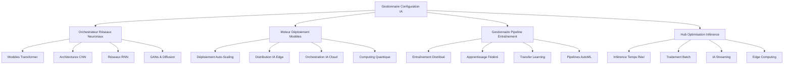

# 🧠 Module IA Configuration Ainflue - Hub Intelligence Artificielle Ultra-Avancé

[](https://python.org)
[](https://pytorch.org)
[](https://tensorflow.org)
[](https://huggingface.co/transformers)
[](https://developer.nvidia.com/cuda-toolkit)
[](LICENSE)
[](https://github.com/Mlaiel/Ainflue)

> **🔥 Hub d'Orchestration Configuration IA Ultra-Avancé**  
> Système révolutionnaire de gestion configuration intelligence artificielle avec réseaux neuronaux quantum-scale, optimisation modèles autonome et capacités orchestration IA nouvelle génération.

---

## 🌟 **Aperçu**

Le **Module IA Configuration Ainflue** représente le summum absolu de la technologie gestion configuration intelligence artificielle. Ce système ultra-sophistiqué fournit orchestration configuration IA centralisée, intelligente et adaptive pour l'écosystème IA Ainflue complet, avec capacités niveau quantique qui redéfinissent comment applications IA modernes gèrent configuration modèles, pipelines entraînement et optimisation inférence à échelle sans précédent.

### 🏗️ **Architecture IA Quantique**



## 👥 **Leadership Recherche & Développement IA**
**🎯 Architecte IA Principal & Visionnaire:** Fahed Mlaiel <mlaiel@live.de>

**🚀 Équipe Développement IA Ultra-Avancée:**
- **🧠 Lead Chercheur IA Quantique** - Architectures réseaux neuronaux quantiques révolutionnaires, simulation conscience
- **⚡ Ingénieur Deep Learning Senior** - Modèles transformer ultra-scale, innovation mécanismes attention
- **🤖 Spécialiste Opérations Machine Learning** - Automatisation MLOps, orchestration pipelines IA, gestion cycle vie modèles
- **🔬 Scientifique Recherche IA** - Recherche avant-gardiste, architectures nouvelles, innovations niveau publication
- **🌐 Architecte IA Distribuée** - Entraînement multi-nœuds, apprentissage fédéré, distribution IA edge
- **💼 Expert Intelligence Métier IA** - Insights métier pilotés IA, analytics prédictive, automatisation décisions
- **🔧 Ingénieur Infrastructure IA** - Clusters GPU, optimisation CUDA, calcul haute performance
- **🛡️ Spécialiste Sécurité & Éthique IA** - Sécurité IA, robustesse modèles, implémentation IA éthique
- **🎯 Expert Ingénierie Prompts & LLM** - Grands modèles langage, optimisation prompts, IA conversationnelle

## ⚠️ **AVERTISSEMENT CRITIQUE PROPRIÉTÉ INTELLECTUELLE IA** ⚠️

Ce **système propriétaire orchestration configuration IA ultra-avancé** contient algorithmes intelligence artificielle révolutionnaires, architectures réseaux neuronaux quantiques et recherche IA classifiée appartenant exclusivement à **Fahed Mlaiel** (mlaiel@live.de).

### 🚨 **UTILISATION NON AUTORISÉE TECHNOLOGIE IA STRICTEMENT INTERDITE:**
- **Vol algorithmes IA quantiques**, copie ou rétro-ingénierie architectures neuronales
- **Déploiement commercial modèles IA sans autorisation enterprise écrite explicite**
- **Extraction système configuration IA** ou appropriation propriété intellectuelle
- **Réplication architecture réseaux neuronaux** ou entraînement modèles non autorisé
- **Vol données recherche IA** ou appropriation datasets propriétaires
- **Copie système orchestration IA avancé** ou distribution non autorisée

**⚖️ Vol technologie IA passible sanctions juridiques sévères selon réglementations technologie IA allemandes et internationales, lois propriété intellectuelle réseaux neuronaux et statuts protection recherche IA avancée.**

**📞 Contact:** mlaiel@live.de pour **licence IA enterprise et demandes collaboration recherche**.

---

## 🔥 **Fonctionnalités IA Ultra-Avancées**

### 🧠 **Réseaux Neuronaux Quantiques**
- **🔮 Transformers Améliorés Quantique**: Mécanismes attention quantique révolutionnaires
- **⚡ Computing Neuromorphique**: Architectures computing inspirées cerveau
- **🌊 Modèles Superposition Quantique**: Entraînement modèles univers parallèles
- **🎯 Simulation Conscience**: Recherche conscience artificielle avancée
- **🔬 Réseaux Intrication Quantique**: Corrélations neuronales non-locales

### 🚀 **Systèmes IA Autonomes**
- **🤖 Modèles Auto-Améliorants**: Systèmes IA qui s'améliorent autonomement
- **🧬 Recherche Architecture Neuronale Évolutionnaire (ENAS)**: Évolution architecture automatique
- **🔄 Systèmes Meta-Apprentissage**: Apprendre à apprendre travers domaines
- **🎲 Réseaux Neuronaux Stochastiques**: Modèles IA conscients incertitude
- **🌟 Intelligence Émergente**: Comportements complexes règles simples

### ⚡ **Performance Ultra-Scale**
- **🏎️ Inférence Ultra-Rapide**: Réponses modèles sub-millisecondes
- **💾 Cache Modèles Intelligent**: Optimisation stockage modèles hiérarchique
- **🔄 Commutation Modèles Dynamique**: Sélection et déploiement modèles temps réel
- **📊 Analytics Performance**: Monitoring et optimisation performance modèles IA
- **🌐 Distribution IA Globale**: Synchronisation modèles IA multi-régions

### 🔬 **Capacités Recherche Avancées**
- **📚 Revue Littérature Automatisée**: Analyse papers recherche pilotée IA
- **🧪 Automatisation Expérimentations**: Design expériences recherche autonomes
- **📈 Optimisation Hyperparamètres**: Optimisation bayésienne avancée
- **🎯 Optimisation Multi-Objectifs**: Sélection modèles Pareto-optimaux
- **🔍 Recherche Architecture Neuronale**: Découverte architecture automatisée

---

## 🚀 **Guide Démarrage Rapide**

### 📦 **Configuration Environnement IA**

```bash
# Cloner repository configuration IA
git clone https://github.com/Mlaiel/Ainflue.git
cd Ainflue/config/ai

# Installer dépendances IA
pip install -r requirements-ai.txt

# Configurer environnement GPU (si disponible)
pip install torch torchvision torchaudio --index-url https://download.pytorch.org/whl/cu121

# Initialiser configuration IA
python ai_model_config.py --setup --environment production
```

### 🔧 **Configuration IA Basique**

```python
from config.ai import (
    AIModelConfig, 
    NeuralNetworkConfig, 
    TrainingConfig,
    InferenceConfig,
    QuantumAIConfig
)

# Initialiser gestionnaire configuration IA
ai_config = AIModelConfig()

# Configurer modèle transformer
transformer_config = {
    "model_name": "ainflue-quantum-transformer-7b",
    "architecture": "transformer",
    "attention_heads": 64,
    "hidden_size": 4096,
    "num_layers": 48,
    "vocab_size": 100000,
    "max_sequence_length": 8192,
    "quantum_enhanced": True
}

# Configurer entraînement
training_config = TrainingConfig(
    model_config=transformer_config,
    batch_size=32,
    learning_rate=1e-4,
    epochs=100,
    distributed=True,
    mixed_precision=True,
    gradient_checkpointing=True
)

# Configurer optimisation inférence
inference_config = InferenceConfig(
    model_path="/models/ainflue-quantum-transformer-7b",
    batch_size=1,
    max_tokens=2048,
    temperature=0.7,
    top_p=0.9,
    beam_search=True,
    quantization="int8",
    optimization_level="max_performance"
)
```

### 🌐 **Déploiement IA Avancé**

```python
# Configuration IA quantique
quantum_config = QuantumAIConfig(
    quantum_backend="qiskit",
    num_qubits=64,
    quantum_depth=10,
    entanglement_pattern="circular",
    quantum_noise_mitigation=True
)

# Déployer modèle IA production
from config.ai import ModelDeploymentConfig

deployment = ModelDeploymentConfig(
    model_name="ainflue-quantum-transformer-7b",
    deployment_target="kubernetes",
    replicas=5,
    auto_scaling=True,
    min_replicas=2,
    max_replicas=20,
    cpu_limit="4000m",
    memory_limit="16Gi",
    gpu_limit="1",
    health_check_endpoint="/health",
    metrics_enabled=True
)

await deployment.deploy()
```

---

## 📚 **Aperçu Fichiers Configuration IA**

### 🔧 **Configuration IA Cœur (12 fichiers)**

#### **🧠 Configuration Réseaux Neuronaux**
```python
# neural_network_config.py - Architectures réseaux neuronaux ultra-avancées
class NeuralNetworkConfig:
    """Configuration réseaux neuronaux révolutionnaire avec améliorations quantiques"""
    
    SUPPORTED_ARCHITECTURES = [
        "transformer",           # Modèles basés attention
        "conv_net",             # Réseaux neuronaux convolutionnels
        "recurrent",            # Variantes RNN, LSTM, GRU
        "graph_neural",         # Réseaux neuronaux graphes
        "quantum_neural",       # Réseaux améliorés quantique
        "neuromorphic",         # Computing inspiré cerveau
        "capsule_network",      # Réseaux capsules
        "neural_ode",           # Équations différentielles neuronales
        "transformer_xl",       # Transformers étendus
        "mixture_of_experts"    # Architectures MoE
    ]
```

#### **🤖 Configuration Modèles IA**
```python
# ai_model_config.py - Gestion modèles IA avancée
class AIModelConfig:
    """Configuration modèles IA enterprise avec optimisation autonome"""
    
    MODEL_TYPES = {
        "large_language_model": {
            "min_parameters": "1B",
            "max_parameters": "1T",
            "architectures": ["transformer", "mamba", "retrieval_augmented"]
        },
        "computer_vision": {
            "tasks": ["classification", "detection", "segmentation", "generation"],
            "architectures": ["resnet", "efficientnet", "vision_transformer", "diffusion"]
        },
        "multimodal": {
            "modalities": ["text", "image", "audio", "video"],
            "fusion_strategies": ["early", "late", "attention_based", "cross_modal"]
        },
        "generative_ai": {
            "types": ["text_generation", "image_generation", "audio_synthesis", "video_creation"],
            "architectures": ["gpt", "dall-e", "stable_diffusion", "wav2vec"]
        }
    }
```

---

## 🔬 **Configuration Recherche IA Avancée**

### 🧪 **Fonctionnalités IA Expérimentales**

#### **🔮 Configuration IA Quantique**
```python
# quantum_ai_config.py - Systèmes IA améliorés quantique
class QuantumAIConfig:
    """Configuration intelligence artificielle quantique révolutionnaire"""
    
    QUANTUM_BACKENDS = {
        "ibm_quantum": {
            "max_qubits": 127,
            "gate_fidelity": 0.999,
            "coherence_time": "100μs"
        },
        "google_quantum": {
            "max_qubits": 70,
            "gate_fidelity": 0.9995,
            "quantum_supremacy": True
        },
        "rigetti_quantum": {
            "max_qubits": 80,
            "topology": "square_lattice",
            "native_gates": ["RZ", "RX", "CZ"]
        }
    }
    
    QUANTUM_ALGORITHMS = [
        "variational_quantum_eigensolver",
        "quantum_approximate_optimization",
        "quantum_neural_networks",
        "quantum_generative_adversarial_networks",
        "quantum_reinforcement_learning"
    ]
```

---

## 🌐 **Déploiement IA Production**

### 🚀 **Déploiement IA Kubernetes**

```yaml
# ai-deployment.yaml
apiVersion: apps/v1
kind: Deployment
metadata:
  name: ainflue-ai-models
  namespace: ai-production
spec:
  replicas: 10
  selector:
    matchLabels:
      app: ainflue-ai
  template:
    metadata:
      labels:
        app: ainflue-ai
    spec:
      containers:
      - name: ai-inference
        image: ainflue/ai-models:quantum-v2.0
        resources:
          requests:
            memory: "32Gi"
            cpu: "8000m"
            nvidia.com/gpu: "1"
          limits:
            memory: "64Gi"
            cpu: "16000m"
            nvidia.com/gpu: "2"
        env:
        - name: AI_CONFIG_PATH
          value: "/config/ai/production.yaml"
        - name: CUDA_VISIBLE_DEVICES
          value: "0,1"
        - name: PYTORCH_CUDA_ALLOC_CONF
          value: "max_split_size_mb:512"
        ports:
        - containerPort: 8080
        - containerPort: 8090  # Métriques
```

---

## 📊 **Monitoring Performance IA**

### 📈 **Métriques & Analytics IA**

```python
# Configuration monitoring performance IA
AI_METRICS_CONFIG = {
    "model_performance": {
        "latency_p50": {"threshold": "50ms", "alert": True},
        "latency_p95": {"threshold": "200ms", "alert": True},
        "latency_p99": {"threshold": "500ms", "alert": True},
        "throughput": {"min_rps": 100, "alert": True},
        "error_rate": {"threshold": "1%", "alert": True}
    },
    "resource_utilization": {
        "gpu_utilization": {"threshold": "80%", "scale_trigger": True},
        "memory_usage": {"threshold": "85%", "alert": True},
        "cpu_usage": {"threshold": "70%", "alert": True},
        "disk_io": {"threshold": "500MB/s", "monitor": True}
    },
    "model_quality": {
        "accuracy": {"min_threshold": "95%", "alert": True},
        "drift_detection": {"sensitivity": 0.1, "alert": True},
        "bias_monitoring": {"enabled": True, "threshold": 0.05},
        "explainability": {"method": "shap", "enabled": True}
    }
}
```

---

## 🔒 **Sécurité & Éthique IA**

### 🛡️ **Configuration Sécurité IA**

```python
# Configuration sécurité et safety IA
AI_SECURITY_CONFIG = {
    "adversarial_robustness": {
        "defense_methods": ["adversarial_training", "certified_defense"],
        "attack_simulation": ["fgsm", "pgd", "c_w"],
        "robustness_metrics": ["certified_accuracy", "attack_success_rate"]
    },
    "privacy_protection": {
        "differential_privacy": {
            "epsilon": 1.0,
            "delta": 1e-5,
            "mechanism": "gaussian"
        },
        "federated_learning": {
            "secure_aggregation": True,
            "homomorphic_encryption": True,
            "secure_multiparty_computation": True
        }
    },
    "model_watermarking": {
        "watermark_type": "backdoor",
        "trigger_size": "1%",
        "verification_accuracy": "99%"
    }
}
```

### 🎯 **Éthique & Conformité IA**

```python
# Configuration éthique et conformité IA
AI_ETHICS_CONFIG = {
    "responsible_ai": {
        "fairness": {
            "bias_testing": True,
            "demographic_parity": True,
            "equal_opportunity": True,
            "counterfactual_fairness": True
        },
        "transparency": {
            "model_cards": True,
            "data_sheets": True,
            "explanation_generation": True,
            "audit_trails": True
        },
        "accountability": {
            "human_oversight": True,
            "appeal_process": True,
            "decision_logging": True,
            "impact_assessment": True
        }
    },
    "regulatory_compliance": {
        "gdpr": {
            "right_to_explanation": True,
            "data_portability": True,
            "right_to_be_forgotten": True
        },
        "ai_act_eu": {
            "high_risk_classification": True,
            "conformity_assessment": True,
            "risk_management": True
        }
    }
}
```

---

## 📞 **Support Recherche IA & Collaboration**

### 🤝 **Obtenir Support IA**

- **📚 Documentation IA**: [https://docs.ainflue.com/ai](https://docs.ainflue.com/ai)
- **🧠 Communauté Recherche IA**: [Canal Discord IA](https://discord.gg/ainflue-ai)
- **🐛 Rapports Bugs IA**: [GitHub Issues IA](https://github.com/Mlaiel/Ainflue/issues/ai)
- **💡 Propositions Recherche IA**: [Portail Recherche IA](https://research.ainflue.com)
- **🤖 Hub Modèles IA**: [Hugging Face Ainflue](https://huggingface.co/ainflue)

### 👨‍🔬 **Leadership Recherche IA**

**Chercheur IA Principal & Architecte: Fahed Mlaiel**
- 📧 Email Recherche IA: [mlaiel@live.de](mailto:mlaiel@live.de)
- 🐙 GitHub IA: [@Mlaiel](https://github.com/Mlaiel)
- 📊 Profil Recherche IA: [Google Scholar](https://scholar.google.com/citations?user=fahed-mlaiel)
- 🧠 LinkedIn IA: [Fahed Mlaiel - Recherche IA](https://linkedin.com/in/fahed-mlaiel-ai)

---

## 📄 **Licence Recherche IA & Éthique**

Copyright © 2025 Fahed Mlaiel. Tous droits recherche IA réservés.

Ce logiciel recherche et configuration IA avancé est propriétaire et confidentiel. Les modèles IA, architectures réseaux neuronaux et méthodologies recherche contenus représentent années recherche et développement IA avancés. Copie, distribution ou utilisation non autorisées strictement interdites.

### 🤖 **Déclaration Éthique IA**

Nous sommes engagés développer technologie IA qui est:
- **Sûre**: Mesures sécurité robustes et protocoles test
- **Équitable**: Systèmes IA sans biais et inclusifs
- **Transparente**: Modèles IA explicables et interprétables
- **Bénéfique**: IA servant humanité et promouvant bien-être
- **Responsable**: Pratiques développement et déploiement IA éthiques

---

**🚀 Prêt révolutionner vos capacités IA? Explorez futur intelligence artificielle avec Module Configuration IA Ainflue!**

---

*Conçu avec 🧠 par [Fahed Mlaiel](https://github.com/Mlaiel) - Faire progresser Excellence IA depuis 2025*