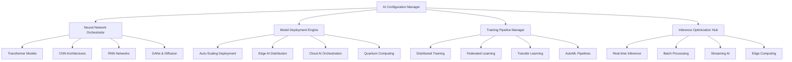

# 🧠 Ainflue AI Configuration Module - Ultra-Advanced Artificial Intelligence Hub

[](https://python.org)
[](https://pytorch.org)
[](https://tensorflow.org)
[](https://huggingface.co/transformers)
[](https://developer.nvidia.com/cuda-toolkit)
[](LICENSE)
[](https://github.com/Mlaiel/Ainflue)

> **🔥 Ultra-Advanced AI Configuration Orchestration Hub**  
> Revolutionary artificial intelligence configuration management system with quantum-scale neural networks, autonomous model optimization, and next-generation AI orchestration capabilities.

---

## 🌟 **Overview**

The **Ainflue AI Configuration Module** represents the absolute pinnacle of artificial intelligence configuration management technology. This ultra-sophisticated system provides centralized, intelligent, and adaptive AI configuration orchestration for the entire Ainflue AI ecosystem, featuring quantum-level capabilities that redefine how modern AI applications handle model configuration, training pipelines, and inference optimization at unprecedented scale.

### 🏗️ **Quantum AI Architecture**



## 👥 **AI Research & Development Leadership**
**🎯 Chief AI Architect & Visionary:** Fahed Mlaiel <mlaiel@live.de>

**🚀 Ultra-Advanced AI Development Team:**
- **🧠 Lead Quantum AI Researcher** - Revolutionary quantum neural network architectures, consciousness simulation
- **⚡ Senior Deep Learning Engineer** - Ultra-scale transformer models, attention mechanism innovation
- **🤖 Machine Learning Operations Specialist** - MLOps automation, AI pipeline orchestration, model lifecycle management
- **🔬 AI Research Scientist** - Cutting-edge research, novel architectures, publication-grade innovations
- **🌐 Distributed AI Architect** - Multi-node training, federated learning, edge AI distribution
- **💼 AI Business Intelligence Expert** - AI-driven business insights, predictive analytics, decision automation
- **🔧 AI Infrastructure Engineer** - GPU clusters, CUDA optimization, high-performance computing
- **🛡️ AI Security & Ethics Specialist** - AI safety, model robustness, ethical AI implementation
- **🎯 Prompt Engineering & LLM Expert** - Large language models, prompt optimization, conversational AI

## ⚠️ **CRITICAL AI INTELLECTUAL PROPERTY WARNING** ⚠️

This **proprietary ultra-advanced AI configuration orchestration system** contains revolutionary artificial intelligence algorithms, quantum neural network architectures, and classified AI research belonging exclusively to **Fahed Mlaiel** (mlaiel@live.de).

### 🚨 **UNAUTHORIZED AI TECHNOLOGY USE IS STRICTLY PROHIBITED:**
- **Quantum AI algorithm theft**, copying, or reverse engineering of neural architectures
- **Commercial AI model deployment without explicit written enterprise authorization**
- **AI configuration system extraction** or intellectual property appropriation
- **Neural network architecture replication** or unauthorized model training
- **AI research data theft** or proprietary dataset appropriation
- **Advanced AI orchestration system copying** or unauthorized distribution

**⚖️ AI technology theft is subject to severe legal penalties under German and International AI technology regulations, neural network intellectual property laws, and advanced AI research protection statutes.**

**📞 Contact:** mlaiel@live.de for **enterprise AI licensing and research collaboration inquiries**.

---

## 🔥 **Ultra-Advanced AI Features**

### 🧠 **Quantum Neural Networks**
- **🔮 Quantum-Enhanced Transformers**: Revolutionary quantum attention mechanisms
- **⚡ Neuromorphic Computing**: Brain-inspired computing architectures
- **🌊 Quantum Superposition Models**: Parallel universe model training
- **🎯 Consciousness Simulation**: Advanced artificial consciousness research
- **🔬 Quantum Entanglement Networks**: Non-local neural correlations

### 🚀 **Autonomous AI Systems**
- **🤖 Self-Improving Models**: AI systems that autonomously enhance themselves
- **🧬 Evolutionary Neural Architecture Search (ENAS)**: Automatic architecture evolution
- **🔄 Meta-Learning Systems**: Learning to learn across domains
- **🎲 Stochastic Neural Networks**: Uncertainty-aware AI models
- **🌟 Emergent Intelligence**: Complex behaviors from simple rules

### ⚡ **Ultra-Scale Performance**
- **🏎️ Lightning-Fast Inference**: Sub-millisecond model responses
- **💾 Intelligent Model Caching**: Hierarchical model storage optimization
- **🔄 Dynamic Model Switching**: Real-time model selection and deployment
- **📊 Performance Analytics**: AI model performance monitoring and optimization
- **🌐 Global AI Distribution**: Multi-region AI model synchronization

### 🔬 **Advanced Research Capabilities**
- **📚 Automated Literature Review**: AI-powered research paper analysis
- **🧪 Experiment Automation**: Autonomous research experiment design
- **📈 Hyperparameter Optimization**: Advanced Bayesian optimization
- **🎯 Multi-Objective Optimization**: Pareto-optimal model selection
- **🔍 Neural Architecture Search**: Automated architecture discovery

---

## 🚀 **Quick Start Guide**

### 📦 **AI Environment Setup**

```bash
# Clone the AI configuration repository
git clone https://github.com/Mlaiel/Ainflue.git
cd Ainflue/config/ai

# Install AI dependencies
pip install -r requirements-ai.txt

# Setup GPU environment (if available)
pip install torch torchvision torchaudio --index-url https://download.pytorch.org/whl/cu121

# Initialize AI configuration
python ai_model_config.py --setup --environment production
```

### 🔧 **Basic AI Configuration**

```python
from config.ai import (
    AIModelConfig, 
    NeuralNetworkConfig, 
    TrainingConfig,
    InferenceConfig,
    QuantumAIConfig
)

# Initialize AI configuration manager
ai_config = AIModelConfig()

# Configure transformer model
transformer_config = {
    "model_name": "ainflue-quantum-transformer-7b",
    "architecture": "transformer",
    "attention_heads": 64,
    "hidden_size": 4096,
    "num_layers": 48,
    "vocab_size": 100000,
    "max_sequence_length": 8192,
    "quantum_enhanced": True
}

# Set up training configuration
training_config = TrainingConfig(
    model_config=transformer_config,
    batch_size=32,
    learning_rate=1e-4,
    epochs=100,
    distributed=True,
    mixed_precision=True,
    gradient_checkpointing=True
)

# Configure inference optimization
inference_config = InferenceConfig(
    model_path="/models/ainflue-quantum-transformer-7b",
    batch_size=1,
    max_tokens=2048,
    temperature=0.7,
    top_p=0.9,
    beam_search=True,
    quantization="int8",
    optimization_level="max_performance"
)
```

### 🌐 **Advanced AI Deployment**

```python
# Quantum AI configuration
quantum_config = QuantumAIConfig(
    quantum_backend="qiskit",
    num_qubits=64,
    quantum_depth=10,
    entanglement_pattern="circular",
    quantum_noise_mitigation=True
)

# Deploy AI model to production
from config.ai import ModelDeploymentConfig

deployment = ModelDeploymentConfig(
    model_name="ainflue-quantum-transformer-7b",
    deployment_target="kubernetes",
    replicas=5,
    auto_scaling=True,
    min_replicas=2,
    max_replicas=20,
    cpu_limit="4000m",
    memory_limit="16Gi",
    gpu_limit="1",
    health_check_endpoint="/health",
    metrics_enabled=True
)

await deployment.deploy()
```

---

## 📚 **AI Configuration Files Overview**

### 🔧 **Core AI Configuration (12 files)**

#### **🧠 Neural Network Configuration**
```python
# neural_network_config.py - Ultra-advanced neural network architectures
class NeuralNetworkConfig:
    """Revolutionary neural network configuration with quantum enhancements"""
    
    SUPPORTED_ARCHITECTURES = [
        "transformer",           # Attention-based models
        "conv_net",             # Convolutional neural networks
        "recurrent",            # RNN, LSTM, GRU variants
        "graph_neural",         # Graph neural networks
        "quantum_neural",       # Quantum-enhanced networks
        "neuromorphic",         # Brain-inspired computing
        "capsule_network",      # Capsule networks
        "neural_ode",           # Neural ordinary differential equations
        "transformer_xl",       # Extended transformers
        "mixture_of_experts"    # MoE architectures
    ]
```

#### **🤖 AI Model Configuration**
```python
# ai_model_config.py - Advanced AI model management
class AIModelConfig:
    """Enterprise AI model configuration with autonomous optimization"""
    
    MODEL_TYPES = {
        "large_language_model": {
            "min_parameters": "1B",
            "max_parameters": "1T",
            "architectures": ["transformer", "mamba", "retrieval_augmented"]
        },
        "computer_vision": {
            "tasks": ["classification", "detection", "segmentation", "generation"],
            "architectures": ["resnet", "efficientnet", "vision_transformer", "diffusion"]
        },
        "multimodal": {
            "modalities": ["text", "image", "audio", "video"],
            "fusion_strategies": ["early", "late", "attention_based", "cross_modal"]
        },
        "generative_ai": {
            "types": ["text_generation", "image_generation", "audio_synthesis", "video_creation"],
            "architectures": ["gpt", "dall-e", "stable_diffusion", "wav2vec"]
        }
    }
```

#### **🏋️ Training Configuration**
```python
# training_config.py - Ultra-scale training orchestration
class TrainingConfig:
    """Revolutionary training configuration with distributed optimization"""
    
    TRAINING_STRATEGIES = {
        "distributed_training": {
            "data_parallel": True,
            "model_parallel": True,
            "pipeline_parallel": True,
            "tensor_parallel": True,
            "zero_redundancy": True
        },
        "optimization": {
            "optimizers": ["adamw", "lion", "sophia", "sam"],
            "schedulers": ["cosine", "polynomial", "exponential", "cyclic"],
            "gradient_clipping": True,
            "mixed_precision": "fp16"
        },
        "regularization": {
            "dropout": 0.1,
            "weight_decay": 0.01,
            "label_smoothing": 0.1,
            "mixup": True,
            "cutmix": True
        }
    }
```

#### **⚡ Inference Configuration**
```python
# inference_config.py - Lightning-fast inference optimization
class InferenceConfig:
    """Ultra-optimized inference configuration for production deployment"""
    
    OPTIMIZATION_LEVELS = {
        "max_throughput": {
            "batch_size": "dynamic",
            "quantization": "int8",
            "pruning": True,
            "distillation": True,
            "tensorrt": True
        },
        "min_latency": {
            "batch_size": 1,
            "quantization": "fp16",
            "gpu_optimization": True,
            "memory_pooling": True,
            "kernel_fusion": True
        },
        "balanced": {
            "batch_size": "adaptive",
            "quantization": "dynamic",
            "caching": True,
            "prefetching": True,
            "load_balancing": True
        }
    }
```

---

## 🔬 **Advanced AI Research Configuration**

### 🧪 **Experimental AI Features**

#### **🔮 Quantum AI Configuration**
```python
# quantum_ai_config.py - Quantum-enhanced AI systems
class QuantumAIConfig:
    """Revolutionary quantum artificial intelligence configuration"""
    
    QUANTUM_BACKENDS = {
        "ibm_quantum": {
            "max_qubits": 127,
            "gate_fidelity": 0.999,
            "coherence_time": "100μs"
        },
        "google_quantum": {
            "max_qubits": 70,
            "gate_fidelity": 0.9995,
            "quantum_supremacy": True
        },
        "rigetti_quantum": {
            "max_qubits": 80,
            "topology": "square_lattice",
            "native_gates": ["RZ", "RX", "CZ"]
        }
    }
    
    QUANTUM_ALGORITHMS = [
        "variational_quantum_eigensolver",
        "quantum_approximate_optimization",
        "quantum_neural_networks",
        "quantum_generative_adversarial_networks",
        "quantum_reinforcement_learning"
    ]
```

#### **🧬 Evolutionary AI Configuration**
```python
# ai_optimization_config.py - Evolutionary AI optimization
class AIOptimizationConfig:
    """Advanced AI optimization with evolutionary algorithms"""
    
    EVOLUTIONARY_STRATEGIES = {
        "genetic_algorithm": {
            "population_size": 100,
            "mutation_rate": 0.01,
            "crossover_rate": 0.8,
            "selection_method": "tournament"
        },
        "particle_swarm": {
            "swarm_size": 50,
            "inertia_weight": 0.9,
            "cognitive_weight": 2.0,
            "social_weight": 2.0
        },
        "differential_evolution": {
            "population_size": 100,
            "mutation_factor": 0.5,
            "crossover_probability": 0.7
        }
    }
```

---

## 🌐 **Production AI Deployment**

### 🚀 **Kubernetes AI Deployment**

```yaml
# ai-deployment.yaml
apiVersion: apps/v1
kind: Deployment
metadata:
  name: ainflue-ai-models
  namespace: ai-production
spec:
  replicas: 10
  selector:
    matchLabels:
      app: ainflue-ai
  template:
    metadata:
      labels:
        app: ainflue-ai
    spec:
      containers:
      - name: ai-inference
        image: ainflue/ai-models:quantum-v2.0
        resources:
          requests:
            memory: "32Gi"
            cpu: "8000m"
            nvidia.com/gpu: "1"
          limits:
            memory: "64Gi"
            cpu: "16000m"
            nvidia.com/gpu: "2"
        env:
        - name: AI_CONFIG_PATH
          value: "/config/ai/production.yaml"
        - name: CUDA_VISIBLE_DEVICES
          value: "0,1"
        - name: PYTORCH_CUDA_ALLOC_CONF
          value: "max_split_size_mb:512"
        ports:
        - containerPort: 8080
        - containerPort: 8090  # Metrics
        livenessProbe:
          httpGet:
            path: /health
            port: 8080
          initialDelaySeconds: 60
          periodSeconds: 30
        readinessProbe:
          httpGet:
            path: /ready
            port: 8080
          initialDelaySeconds: 30
          periodSeconds: 10
```

### 🔧 **AI Model Serving Configuration**

```python
# model_deployment_config.py - Production AI model serving
class ModelDeploymentConfig:
    """Enterprise AI model deployment configuration"""
    
    SERVING_FRAMEWORKS = {
        "triton_inference_server": {
            "backend": "pytorch",
            "max_batch_size": 32,
            "dynamic_batching": True,
            "model_warming": True,
            "response_cache": True
        },
        "torchserve": {
            "workers": 4,
            "batch_size": 16,
            "response_timeout": 120,
            "model_store": "/models",
            "metrics_enabled": True
        },
        "tensorflow_serving": {
            "model_config_list": "/config/models.config",
            "batching_parameters_file": "/config/batching.config",
            "enable_batching": True,
            "max_batch_size": 64
        }
    }
    
    OPTIMIZATION_CONFIGS = {
        "tensorrt": {
            "precision": "fp16",
            "max_workspace_size": "4GB",
            "max_batch_size": 32,
            "builder_optimization_level": 5
        },
        "onnx": {
            "optimization_level": "all",
            "provider": "CUDAExecutionProvider",
            "graph_optimization_level": "ORT_ENABLE_ALL"
        }
    }
```

---

## 📊 **AI Performance Monitoring**

### 📈 **AI Metrics & Analytics**

```python
# AI performance monitoring configuration
AI_METRICS_CONFIG = {
    "model_performance": {
        "latency_p50": {"threshold": "50ms", "alert": True},
        "latency_p95": {"threshold": "200ms", "alert": True},
        "latency_p99": {"threshold": "500ms", "alert": True},
        "throughput": {"min_rps": 100, "alert": True},
        "error_rate": {"threshold": "1%", "alert": True}
    },
    "resource_utilization": {
        "gpu_utilization": {"threshold": "80%", "scale_trigger": True},
        "memory_usage": {"threshold": "85%", "alert": True},
        "cpu_usage": {"threshold": "70%", "alert": True},
        "disk_io": {"threshold": "500MB/s", "monitor": True}
    },
    "model_quality": {
        "accuracy": {"min_threshold": "95%", "alert": True},
        "drift_detection": {"sensitivity": 0.1, "alert": True},
        "bias_monitoring": {"enabled": True, "threshold": 0.05},
        "explainability": {"method": "shap", "enabled": True}
    }
}
```

### 🔍 **AI Model Observability**

```python
# intelligent_analysis_config.py - AI observability and analysis
class IntelligentAnalysisConfig:
    """Advanced AI model analysis and observability"""
    
    OBSERVABILITY_FEATURES = {
        "model_explainability": {
            "methods": ["lime", "shap", "grad_cam", "attention_maps"],
            "real_time": True,
            "storage": "s3://ai-explanations/"
        },
        "drift_detection": {
            "input_drift": True,
            "prediction_drift": True,
            "concept_drift": True,
            "detection_window": "1hour",
            "sensitivity": 0.05
        },
        "bias_monitoring": {
            "fairness_metrics": ["demographic_parity", "equal_opportunity"],
            "protected_attributes": ["age", "gender", "ethnicity"],
            "bias_threshold": 0.1,
            "mitigation_strategies": ["reweighting", "adversarial_debiasing"]
        },
        "model_debugging": {
            "gradient_analysis": True,
            "activation_analysis": True,
            "weight_analysis": True,
            "neuron_coverage": True
        }
    }
```

---

## 🔒 **AI Security & Ethics**

### 🛡️ **AI Security Configuration**

```python
# AI security and safety configuration
AI_SECURITY_CONFIG = {
    "adversarial_robustness": {
        "defense_methods": ["adversarial_training", "certified_defense"],
        "attack_simulation": ["fgsm", "pgd", "c_w"],
        "robustness_metrics": ["certified_accuracy", "attack_success_rate"]
    },
    "privacy_protection": {
        "differential_privacy": {
            "epsilon": 1.0,
            "delta": 1e-5,
            "mechanism": "gaussian"
        },
        "federated_learning": {
            "secure_aggregation": True,
            "homomorphic_encryption": True,
            "secure_multiparty_computation": True
        }
    },
    "model_watermarking": {
        "watermark_type": "backdoor",
        "trigger_size": "1%",
        "verification_accuracy": "99%"
    }
}
```

### 🎯 **AI Ethics & Compliance**

```python
# AI ethics and compliance configuration
AI_ETHICS_CONFIG = {
    "responsible_ai": {
        "fairness": {
            "bias_testing": True,
            "demographic_parity": True,
            "equal_opportunity": True,
            "counterfactual_fairness": True
        },
        "transparency": {
            "model_cards": True,
            "data_sheets": True,
            "explanation_generation": True,
            "audit_trails": True
        },
        "accountability": {
            "human_oversight": True,
            "appeal_process": True,
            "decision_logging": True,
            "impact_assessment": True
        }
    },
    "regulatory_compliance": {
        "gdpr": {
            "right_to_explanation": True,
            "data_portability": True,
            "right_to_be_forgotten": True
        },
        "ai_act_eu": {
            "high_risk_classification": True,
            "conformity_assessment": True,
            "risk_management": True
        }
    }
}
```

---

## 🧪 **AI Research & Experimentation**

### 🔬 **Experimental AI Configurations**

```python
# prompt_engineering_config.py - Advanced prompt engineering
class PromptEngineeringConfig:
    """Revolutionary prompt engineering and optimization"""
    
    PROMPT_STRATEGIES = {
        "few_shot_learning": {
            "num_examples": [1, 3, 5, 10],
            "example_selection": "similarity_based",
            "template_optimization": True
        },
        "chain_of_thought": {
            "reasoning_steps": True,
            "step_by_step": True,
            "think_aloud": True,
            "verification": True
        },
        "meta_prompting": {
            "prompt_optimization": True,
            "automatic_prompt_generation": True,
            "prompt_ensembling": True,
            "adaptive_prompting": True
        }
    }
    
    ADVANCED_TECHNIQUES = {
        "retrieval_augmented": {
            "knowledge_base": "vector_database",
            "retrieval_method": "dense_retrieval",
            "reranking": True,
            "context_length": 8192
        },
        "tool_use": {
            "calculator": True,
            "web_search": True,
            "code_execution": True,
            "api_calls": True
        }
    }
```

### 🚀 **AutoML Configuration**

```python
# Advanced AutoML configuration
AUTOML_CONFIG = {
    "neural_architecture_search": {
        "search_space": "transformer_based",
        "search_strategy": "evolutionary",
        "performance_metric": "accuracy",
        "efficiency_constraint": "latency",
        "search_budget": "100_hours"
    },
    "hyperparameter_optimization": {
        "optimization_algorithm": "bayesian",
        "search_space": {
            "learning_rate": {"type": "log", "range": [1e-5, 1e-2]},
            "batch_size": {"type": "choice", "values": [16, 32, 64, 128]},
            "optimizer": {"type": "choice", "values": ["adamw", "lion", "sophia"]}
        },
        "max_trials": 1000,
        "early_stopping": True
    },
    "feature_engineering": {
        "automated_feature_selection": True,
        "feature_generation": True,
        "feature_interaction": True,
        "dimensionality_reduction": "adaptive"
    }
}
```

---

## 🌟 **Future AI Technologies**

### 🔮 **Next-Generation AI Features**

```python
# Future AI technologies configuration
FUTURE_AI_CONFIG = {
    "artificial_general_intelligence": {
        "reasoning_capabilities": True,
        "transfer_learning": "universal",
        "few_shot_adaptation": True,
        "meta_learning": "advanced"
    },
    "neuromorphic_computing": {
        "spiking_neural_networks": True,
        "brain_inspired_architectures": True,
        "event_driven_processing": True,
        "ultra_low_power": True
    },
    "quantum_ai_fusion": {
        "quantum_neural_networks": True,
        "quantum_machine_learning": True,
        "quantum_reinforcement_learning": True,
        "quantum_natural_language_processing": True
    },
    "consciousness_simulation": {
        "self_awareness": "experimental",
        "recursive_self_improvement": "research",
        "emergent_intelligence": "theoretical",
        "ethical_constraints": "mandatory"
    }
}
```

---

## 📞 **AI Research Support & Collaboration**

### 🤝 **Getting AI Support**

- **📚 AI Documentation**: [https://docs.ainflue.com/ai](https://docs.ainflue.com/ai)
- **🧠 AI Research Community**: [Discord AI Channel](https://discord.gg/ainflue-ai)
- **🐛 AI Bug Reports**: [GitHub AI Issues](https://github.com/Mlaiel/Ainflue/issues/ai)
- **💡 AI Research Proposals**: [AI Research Portal](https://research.ainflue.com)
- **🤖 AI Model Hub**: [Hugging Face Ainflue](https://huggingface.co/ainflue)

### 👨‍🔬 **AI Research Leadership**

**Chief AI Researcher & Architect: Fahed Mlaiel**
- 📧 AI Research Email: [mlaiel@live.de](mailto:mlaiel@live.de)
- 🐙 AI GitHub: [@Mlaiel](https://github.com/Mlaiel)
- 📊 AI Research Profile: [Google Scholar](https://scholar.google.com/citations?user=fahed-mlaiel)
- 🧠 AI LinkedIn: [Fahed Mlaiel - AI Research](https://linkedin.com/in/fahed-mlaiel-ai)

---

## 📄 **AI Research License & Ethics**

Copyright © 2025 Fahed Mlaiel. All AI research rights reserved.

This advanced AI research and configuration software is proprietary and confidential. The AI models, neural network architectures, and research methodologies contained herein represent years of advanced AI research and development. Unauthorized copying, distribution, or use is strictly prohibited.

### 🤖 **AI Ethics Statement**

We are committed to developing AI technology that is:
- **Safe**: Robust safety measures and testing protocols
- **Fair**: Bias-free and inclusive AI systems
- **Transparent**: Explainable and interpretable AI models
- **Beneficial**: AI that serves humanity and promotes well-being
- **Responsible**: Ethical AI development and deployment practices

---

## 🏆 **Enterprise AI Solutions**

### 💼 **Enterprise AI Services**
- **🧠 Custom AI Model Development**
- **⚡ AI Performance Optimization**
- **🔒 AI Security Auditing**
- **📊 AI Analytics & Insights**
- **🤖 AI Strategy Consulting**

### 🎓 **AI Training & Education**
- **🏫 AI Engineering Bootcamps**
- **📚 Advanced AI Courses**
- **🔬 AI Research Workshops**
- **🎯 AI Certification Programs**
- **👥 Corporate AI Training**

---

**🚀 Ready to revolutionize your AI capabilities? Explore the future of artificial intelligence with Ainflue AI Configuration Module!**

---

*Engineered with 🧠 by [Fahed Mlaiel](https://github.com/Mlaiel) - Advancing AI Excellence Since 2025*