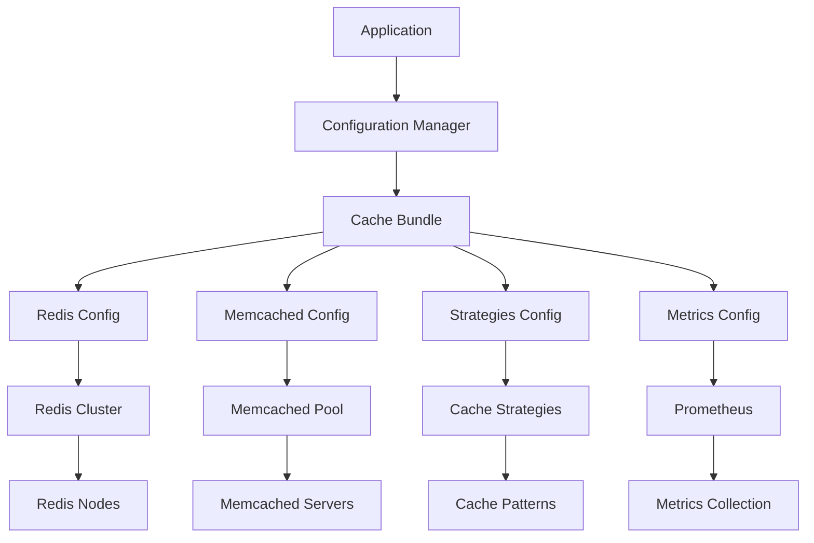

# Cache Configuration Technical Documentation

## IA-Influencer Agent Platform - Enterprise Cache System

**Author:** Fahed Mlaiel <mlaiel@live.de>  
**Project:** IA-Influencer Agent + Content Protection Platform  
**Team:** Lead Dev IA + Backend Senior + ML Engineer + DBA + Security + Microservices + Audio + DevOps  

**Copyright Notice:** This documentation is the intellectual property of Fahed Mlaiel. Any unauthorized use, reproduction, or distribution without explicit written permission is strictly prohibited. Contact: mlaiel@live.de for licensing inquiries.

---

## Table of Contents

1. [Overview](#overview)
2. [Architecture](#architecture)
3. [Configuration Modules](#configuration-modules)
4. [Usage Patterns](#usage-patterns)
5. [Performance Optimization](#performance-optimization)
6. [Security Considerations](#security-considerations)
7. [Monitoring & Metrics](#monitoring--metrics)
8. [Deployment Strategies](#deployment-strategies)
9. [Troubleshooting](#troubleshooting)
10. [API Reference](#api-reference)

---

## Overview

The IA-Influencer Agent cache configuration system provides enterprise-grade caching capabilities with support for multiple backends, distributed architectures, intelligent warming, and comprehensive monitoring. The system is designed for high-availability, scalability, and performance optimization.

### Key Features

- **Multi-Backend Support**: Redis, Memcached, and hybrid configurations
- **Distributed Caching**: Multi-region support with consistent hashing
- **Intelligent Cache Warming**: ML-driven predictive cache population
- **Advanced Compression**: Multiple algorithms with content-aware optimization
- **Comprehensive Monitoring**: Prometheus integration with custom metrics
- **Event-Driven Invalidation**: Smart cache invalidation with pattern matching
- **High Availability**: Failover, circuit breakers, and health monitoring
- **Security**: SSL/TLS, authentication, and access control

---

## Architecture

### System Architecture

```
┌─────────────────────────────────────────────────────────────┐
│                 IA-Influencer Agent Platform                │
├─────────────────────────────────────────────────────────────┤
│                    Application Layer                         │
├─────────────────────────────────────────────────────────────┤
│              Cache Configuration Manager                     │
│  ┌─────────────┬─────────────┬─────────────┬─────────────┐  │
│  │   Bundles   │  Strategies │ Invalidation│   Metrics   │  │
│  └─────────────┴─────────────┴─────────────┴─────────────┘  │
├─────────────────────────────────────────────────────────────┤
│                    Cache Backends                           │
│  ┌─────────────┬─────────────┬─────────────┬─────────────┐  │
│  │    Redis    │  Memcached  │ Distributed │ Compression │  │
│  │   Cluster   │    Pool     │   Regions   │   Engine    │  │
│  └─────────────┴─────────────┴─────────────┴─────────────┘  │
├─────────────────────────────────────────────────────────────┤
│                Infrastructure Layer                         │
│         ┌─────────────┬─────────────┬─────────────┐         │
│         │  Monitoring │   Security  │  Networking │         │
│         │ Prometheus  │   SSL/TLS   │     LB      │         │
│         └─────────────┴─────────────┴─────────────┘         │
└─────────────────────────────────────────────────────────────┘
```

### Component Relationships



---

## Configuration Modules

### 1. Redis Cache Configuration

**File:** `redis_cache_config.py`

Provides enterprise Redis configuration with clustering, SSL, and high availability.

#### Key Components:

- **Connection Management**: Pool-based connections with health monitoring
- **Cluster Support**: Master-slave replication and automatic failover  
- **SSL/TLS**: Secure connections with certificate validation
- **Multi-Tenant**: Namespace isolation for different applications

#### Example Usage:

```python
from backend.config.cache import RedisCacheConfig, REDIS_PRODUCTION_CONFIG

# Use pre-configured production settings
redis_config = REDIS_PRODUCTION_CONFIG

# Or create custom configuration
custom_redis = RedisCacheConfig(
    connection_config=RedisConnectionConfig(
        host="redis-cluster.internal",
        port=6379,
        database=0
    ),
    cluster_config=RedisClusterConfig(
        enabled=True,
        nodes=[
            RedisNode(host="redis-1.internal", port=6379),
            RedisNode(host="redis-2.internal", port=6379),
            RedisNode(host="redis-3.internal", port=6379)
        ]
    )
)
```

### 2. Memcached Configuration

**File:** `memcached_config.py`

Distributed Memcached setup with consistent hashing and failover.

#### Key Components:

- **Server Pool**: Multiple Memcached servers with load balancing
- **Consistent Hashing**: Minimizes key redistribution during scaling
- **Connection Pooling**: Efficient connection reuse
- **Failover**: Automatic server failure detection and recovery

#### Example Usage:

```python
from backend.config.cache import MemcachedConfig, MEMCACHED_PRODUCTION_CONFIG

# Production configuration with multiple servers
memcached_config = MEMCACHED_PRODUCTION_CONFIG

# Check server configuration
for server in memcached_config.servers:
    print(f"Server: {server.host}:{server.port} (weight: {server.weight})")
```

### 3. Cache Strategies Configuration

**File:** `cache_strategies_config.py`

Advanced caching patterns and strategies for different use cases.

#### Available Strategies:

- **Cache-Aside**: Application manages cache population
- **Write-Through**: Writes to cache and storage simultaneously
- **Write-Behind**: Asynchronous writes to storage
- **Read-Through**: Cache automatically loads missing data
- **Refresh-Ahead**: Proactive cache refresh before expiration

#### Example Usage:

```python
from backend.config.cache import CacheStrategiesConfig, STRATEGIES_PRODUCTION_CONFIG

strategies_config = STRATEGIES_PRODUCTION_CONFIG

# Use specific strategy
cache_aside = strategies_config.strategies['cache_aside']
print(f"TTL: {cache_aside.ttl}s, Max Size: {cache_aside.max_size}")
```

### 4. Cache Invalidation Configuration

**File:** `cache_invalidation_config.py`

Event-driven intelligent cache invalidation system.

#### Features:

- **Pattern-Based Rules**: Invalidate by key patterns
- **Event-Driven**: React to application events
- **Dependency Tracking**: Cascade invalidation for related data
- **Bulk Operations**: Efficient batch invalidation

#### Example Usage:

```python
from backend.config.cache import CacheInvalidationConfig, INVALIDATION_PRODUCTION_CONFIG

invalidation_config = INVALIDATION_PRODUCTION_CONFIG

# Check invalidation rules
for rule in invalidation_config.rules:
    print(f"Rule: {rule.name} - Pattern: {rule.pattern}")
```

### 5. Distributed Cache Configuration

**File:** `distributed_cache_config.py`

Multi-region distributed caching with topology management.

#### Features:

- **Multi-Region**: Geographic distribution for global applications
- **Consistency Models**: Choose between strong and eventual consistency
- **Health Monitoring**: Automatic node health checks
- **Circuit Breakers**: Prevent cascade failures

#### Example Usage:

```python
from backend.config.cache import DistributedCacheConfig, MULTI_REGION_CONFIG

distributed_config = MULTI_REGION_CONFIG

# Check regions
for region in distributed_config.regions:
    print(f"Region: {region.name} - Nodes: {len(region.nodes)}")
```

### 6. Cache Warming Configuration

**File:** `cache_warming_config.py`

Proactive cache population with ML-driven predictions.

#### Features:

- **Predictive Warming**: ML algorithms predict cache needs
- **Scheduled Warming**: Time-based cache population
- **Priority-Based**: Warm most important data first
- **Resource Management**: Control warming resource usage

#### Example Usage:

```python
from backend.config.cache import CacheWarmingConfig, WARMING_PRODUCTION_CONFIG

warming_config = WARMING_PRODUCTION_CONFIG

# Check warming rules
for rule in warming_config.rules:
    print(f"Warming Rule: {rule.name} - Priority: {rule.priority}")
```

### 7. Cache Metrics Configuration

**File:** `cache_metrics_config.py`

Comprehensive monitoring and alerting system.

#### Features:

- **Prometheus Integration**: Standard metrics format
- **Custom Metrics**: Application-specific measurements
- **Alert Rules**: Threshold-based alerting
- **Performance Analytics**: Detailed performance insights

#### Example Usage:

```python
from backend.config.cache import CacheMetricsConfig, METRICS_PRODUCTION_CONFIG

metrics_config = METRICS_PRODUCTION_CONFIG

# Check available metrics
for metric in metrics_config.metrics:
    print(f"Metric: {metric.name} ({metric.metric_type})")

# Check alert rules
for alert in metrics_config.alerts:
    print(f"Alert: {alert.name} - Severity: {alert.severity}")
```

### 8. Cache Compression Configuration

**File:** `cache_compression_config.py`

Advanced compression for memory optimization.

#### Supported Algorithms:

- **GZIP**: General-purpose compression
- **ZLIB**: Fast compression for real-time data
- **BZIP2**: High compression ratio for storage
- **LZMA**: Maximum compression for archival
- **LZ4**: Ultra-fast compression for high throughput
- **ZSTD**: Balanced speed and compression ratio
- **SNAPPY**: Google's fast compression algorithm

#### Example Usage:

```python
from backend.config.cache import CacheCompressionConfig, COMPRESSION_PRODUCTION_CONFIG

compression_config = COMPRESSION_PRODUCTION_CONFIG

# Check compression profiles
for profile_name, profile in compression_config.profiles.items():
    print(f"Profile: {profile_name}")
    print(f"  Algorithm: {profile.algorithm}")
    print(f"  Level: {profile.level}")
    print(f"  Content Types: {[ct.value for ct in profile.content_types]}")
```

---

## Usage Patterns

### 1. Quick Development Setup

```python
from backend.config.cache import setup_cache_config, CacheType

# Auto-detect environment and setup
config = setup_cache_config(cache_type=CacheType.REDIS)
print(f"Configured for {config.environment} with {config.cache_type}")
```

### 2. Production Enterprise Setup

```python
from backend.config.cache import (
    CacheConfigurationFactory, 
    CacheType, 
    config_manager
)

# Create enterprise production bundle
bundle = CacheConfigurationFactory.create_production_bundle(
    cache_type=CacheType.HYBRID,
    multi_region=True
)

# Register and activate
config_manager.register_bundle("production", bundle)
config_manager.set_active_bundle("production")
```

### 3. Custom Configuration

```python
from backend.config.cache import (
    CacheConfigurationFactory,
    Environment,
    CacheType,
    RedisCacheConfig
)

# Create custom Redis configuration
custom_redis = RedisCacheConfig(
    connection_config=RedisConnectionConfig(
        host="custom-redis.company.com",
        port=6380,
        password="secure_password"
    )
)

# Create custom bundle
bundle = CacheConfigurationFactory.create_custom_bundle(
    environment=Environment.PRODUCTION,
    cache_type=CacheType.REDIS,
    redis_config=custom_redis
)
```

### 4. Environment-Specific Configuration

```python
import os
from backend.config.cache import get_default_config, Environment, CacheType

# Set environment
os.environ["ENVIRONMENT"] = "production"

# Get appropriate configuration
config = get_default_config(
    environment=Environment.PRODUCTION,
    cache_type=CacheType.HYBRID
)
```

---

## Performance Optimization

### 1. Connection Pooling

Configure appropriate connection pool sizes based on your application's concurrency:

```python
# High-traffic applications
pool_config = RedisPoolConfig(
    max_connections=100,
    min_connections=10,
    connection_timeout=5.0,
    pool_timeout=10.0
)
```

### 2. Compression Strategies

Choose compression algorithms based on your data characteristics:

```python
# For text-heavy data (JSON, HTML)
text_profile = CompressionProfile(
    algorithm=CompressionAlgorithm.GZIP,
    level=CompressionLevel.BALANCED,
    content_types=[ContentType.TEXT, ContentType.JSON]
)

# For binary data
binary_profile = CompressionProfile(
    algorithm=CompressionAlgorithm.LZ4,
    level=CompressionLevel.FAST,
    content_types=[ContentType.BINARY, ContentType.IMAGE]
)
```

### 3. Cache Warming

Optimize cache warming for your access patterns:

```python
# High-priority user data
user_warming_rule = WarmingRule(
    name="user_profiles",
    pattern="user:*:profile",
    priority=WarmingPriority.HIGH,
    ttl=3600,
    triggers=[WarmingTrigger.SCHEDULED, WarmingTrigger.ACCESS_PATTERN]
)
```

---

## Security Considerations

### 1. SSL/TLS Configuration

Always use encrypted connections in production:

```python
ssl_config = RedisSSLConfig(
    enabled=True,
    cert_file="/path/to/client.crt",
    key_file="/path/to/client.key",
    ca_cert_file="/path/to/ca.crt",
    verify_mode=SSLVerifyMode.REQUIRED
)
```

### 2. Authentication

Configure strong authentication:

```python
redis_config = RedisCacheConfig(
    connection_config=RedisConnectionConfig(
        host="secure-redis.internal",
        port=6379,
        password="strong_random_password_here",
        username="cache_user"  # Redis 6+ ACL support
    )
)
```

### 3. Network Security

Use private networks and firewall rules:

```python
# Internal network configuration
connection_config = RedisConnectionConfig(
    host="redis.internal.company.com",  # Internal hostname
    port=6379,
    bind_interface="10.0.0.0/8"  # Private network only
)
```

---

## Monitoring & Metrics

### 1. Standard Metrics

The system automatically collects standard cache metrics:

- **Hit Rate**: Cache hit percentage
- **Miss Rate**: Cache miss percentage  
- **Latency**: Response time metrics
- **Memory Usage**: Cache memory consumption
- **Connection Count**: Active connections
- **Error Rate**: Error occurrence rate

### 2. Custom Metrics

Define application-specific metrics:

```python
custom_metric = MetricDefinition(
    name="user_session_cache_hits",
    metric_type=MetricType.COUNTER,
    description="User session cache hit count",
    labels=["user_type", "region"]
)
```

### 3. Alerting

Set up intelligent alerts:

```python
high_latency_alert = AlertRule(
    name="high_cache_latency",
    metric_name="cache_latency_p95",
    condition="value > 100",  # 100ms threshold
    severity=AlertSeverity.WARNING,
    duration=300  # 5 minutes
)
```

---

## Deployment Strategies

### 1. Development Environment

```yaml
# docker-compose.dev.yml
version: '3.8'
services:
  redis:
    image: redis:7-alpine
    ports:
      - "6379:6379"
    command: redis-server --appendonly yes
    
  memcached:
    image: memcached:1.6-alpine
    ports:
      - "11211:11211"
    command: memcached -m 64
```

### 2. Production Environment

```yaml
# kubernetes deployment
apiVersion: apps/v1
kind: Deployment
metadata:
  name: redis-cluster
spec:
  replicas: 3
  selector:
    matchLabels:
      app: redis-cluster
  template:
    metadata:
      labels:
        app: redis-cluster
    spec:
      containers:
      - name: redis
        image: redis:7-alpine
        ports:
        - containerPort: 6379
        env:
        - name: REDIS_PASSWORD
          valueFrom:
            secretKeyRef:
              name: redis-secret
              key: password
```

### 3. High Availability Setup

```python
# Multi-region configuration
ha_config = DistributedCacheConfig(
    regions=[
        CacheRegion(
            name="us-east-1",
            nodes=[
                CacheNode(host="redis-1.us-east-1.internal", port=6379),
                CacheNode(host="redis-2.us-east-1.internal", port=6379)
            ],
            is_primary=True
        ),
        CacheRegion(
            name="us-west-2",
            nodes=[
                CacheNode(host="redis-1.us-west-2.internal", port=6379),
                CacheNode(host="redis-2.us-west-2.internal", port=6379)
            ],
            is_primary=False
        )
    ],
    consistency_model=ConsistencyModel.EVENTUAL,
    replication_factor=2
)
```

---

## Troubleshooting

### 1. Common Issues

#### Connection Timeouts

**Problem**: Cache operations timing out

**Solution**:
```python
# Increase timeout values
connection_config = RedisConnectionConfig(
    host="redis.internal",
    port=6379,
    connection_timeout=10.0,  # Increased from 5.0
    socket_timeout=10.0       # Added socket timeout
)
```

#### Memory Issues

**Problem**: High memory usage

**Solution**:
```python
# Enable compression
compression_config = CacheCompressionConfig(
    enabled=True,
    min_size_threshold=1024,  # Compress objects > 1KB
    profiles={
        "default": CompressionProfile(
            algorithm=CompressionAlgorithm.GZIP,
            level=CompressionLevel.BALANCED
        )
    }
)
```

#### Cache Misses

**Problem**: High cache miss rate

**Solution**:
```python
# Implement cache warming
warming_config = CacheWarmingConfig(
    enabled=True,
    rules=[
        WarmingRule(
            name="popular_content",
            pattern="content:popular:*",
            priority=WarmingPriority.HIGH,
            ttl=7200
        )
    ]
)
```

### 2. Debugging

#### Enable Debug Logging

```python
import logging

# Enable debug logging
logging.getLogger("backend.config.cache").setLevel(logging.DEBUG)

# Check configuration
bundle = config_manager.get_active_bundle()
if bundle:
    summary = bundle.get_summary()
    print(f"Configuration Summary: {summary}")
```

#### Validate Configuration

```python
# Validate all configurations
validation_results = config_manager.validate_all_bundles()
for bundle_name, is_valid in validation_results.items():
    if not is_valid:
        print(f"Invalid bundle: {bundle_name}")
```

### 3. Performance Monitoring

```python
# Monitor cache performance
metrics_config = config_manager.get_active_bundle().metrics_config
if metrics_config:
    for metric in metrics_config.metrics:
        if "latency" in metric.name:
            print(f"Monitoring latency metric: {metric.name}")
```

---

## API Reference

### Configuration Manager

#### `CacheConfigurationManager`

Main manager class for cache configurations.

**Methods:**

- `register_bundle(name: str, bundle: CacheConfigurationBundle)`: Register a configuration bundle
- `get_bundle(name: str) -> Optional[CacheConfigurationBundle]`: Retrieve a registered bundle
- `set_active_bundle(name: str)`: Set the active configuration bundle
- `get_active_bundle() -> Optional[CacheConfigurationBundle]`: Get the current active bundle
- `auto_configure(cache_type: CacheType = None) -> CacheConfigurationBundle`: Auto-configure based on environment
- `get_configuration_summary() -> Dict[str, Any]`: Get complete configuration summary
- `validate_all_bundles() -> Dict[str, bool]`: Validate all registered bundles

#### `CacheConfigurationFactory`

Factory class for creating configuration bundles.

**Static Methods:**

- `create_development_bundle(cache_type: CacheType = CacheType.REDIS) -> CacheConfigurationBundle`
- `create_production_bundle(cache_type: CacheType = CacheType.HYBRID, multi_region: bool = True) -> CacheConfigurationBundle`
- `create_testing_bundle(cache_type: CacheType = CacheType.REDIS) -> CacheConfigurationBundle`
- `create_custom_bundle(environment: Environment, cache_type: CacheType, **component_configs) -> CacheConfigurationBundle`

### Configuration Bundle

#### `CacheConfigurationBundle`

Complete cache configuration bundle.

**Properties:**

- `environment: Environment`: Deployment environment
- `cache_type: CacheType`: Cache system type
- `redis_config: Optional[RedisCacheConfig]`: Redis configuration
- `memcached_config: Optional[MemcachedConfig]`: Memcached configuration
- `strategies_config: Optional[CacheStrategiesConfig]`: Caching strategies
- `invalidation_config: Optional[CacheInvalidationConfig]`: Cache invalidation rules
- `distributed_config: Optional[DistributedCacheConfig]`: Distributed cache topology
- `warming_config: Optional[CacheWarmingConfig]`: Cache warming rules
- `metrics_config: Optional[CacheMetricsConfig]`: Monitoring configuration
- `compression_config: Optional[CacheCompressionConfig]`: Compression settings

**Methods:**

- `validate() -> bool`: Validate bundle configuration
- `get_summary() -> Dict[str, Any]`: Get configuration summary

### Helper Functions

#### `get_default_config(environment: Environment = None, cache_type: CacheType = None) -> CacheConfigurationBundle`

Get default configuration for specified environment and cache type.

#### `setup_cache_config(environment: Environment = None, cache_type: CacheType = None, auto_activate: bool = True) -> CacheConfigurationBundle`

Setup cache configuration with automatic detection and activation.

---

## Conclusion

The IA-Influencer Agent cache configuration system provides a comprehensive, enterprise-grade caching solution with advanced features for performance, scalability, and monitoring. The modular design allows for flexible deployment across different environments while maintaining consistency and reliability.

For additional support or questions, contact: mlaiel@live.de

---

**Last Updated:** December 2024  
**Version:** 1.0.0  
**License:** Proprietary - All Rights Reserved
