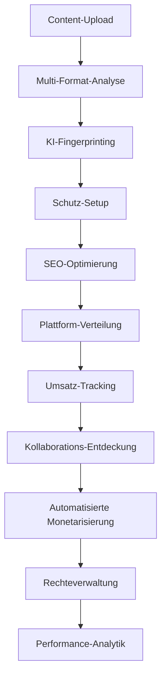

# Koordinationsmodul - Enterprise Workflow-Koordination & Prozess-Orchestrierungssystem


## ⚠️ KRITISCHE RECHTSWARNUNG - SORGFÄLTIG LESEN

**DIESER CODE UND ALLE DAMIT VERBUNDENEN KONZEPTE SIND AUSSCHLIESSLICHES GEISTIGES EIGENTUM VON FAHED MLAIEL.**

**JEDE UNBEFUGTE NUTZUNG, KOPIERUNG, VERTEILUNG, MODIFIKATION ODER KOMMERZIALISIERUNG OHNE AUSDRÜCKLICHE SCHRIFTLICHE GENEHMIGUNG VON FAHED MLAIEL IST STRENGSTENS VERBOTEN UND WIRD ZU SOFORTIGEN RECHTLICHEN SCHRITTEN NACH DEUTSCHEM UND INTERNATIONALEM URHEBERRECHT FÜHREN.**

### 📞 Kontakt für Autorisierung
**📧 E-Mail:** mlaiel@live.de  
**👤 Autor:** Fahed Mlaiel  
**🏢 Projektleiter & Chefarchitekt**  
**📅 Copyright:** ©2025 Fahed Mlaiel. Alle Rechte vorbehalten.

### ⚖️ Rechtliche Konsequenzen
Jeder Versuch, diese Software oder Konzepte ohne ausdrückliche schriftliche Genehmigung zu reverse-engineeren, zu kopieren, zu stehlen oder zu verbreiten, führt zu:
- **Sofortigen rechtlichen Schritten** nach deutschem und internationalem Urheberrecht
- **Strafrechtlicher Verfolgung** wegen Diebstahls geistigen Eigentums
- **Zivilklagen** für Schäden und Entschädigung
- **Permanenter Rechtseintrag** mit Auswirkungen auf zukünftige Geschäftsmöglichkeiten

---

## 🎯 Geschäftslogik-Fluss



## 🏗️ Enterprise-Architektur Überblick

Das Koordinationsmodul stellt das **zentrale Nervensystem** für die IA-Influencer-Agent Plattform dar und orchestriert komplexe Workflows über:

- **🎵 Content-Erstellung & Analyse**
- **🛡️ KI-gestützte Schutzsysteme** 
- **🌐 Multi-Plattform-Verteilung**
- **💰 Umsatz-Optimierung**
- **🤝 Kollaborations-Entdeckung**

### 🚀 Ultra-Fortgeschrittene Industrielle Architektur

```
┌─────────────────────────────────────────────────────────────────────────────┐
│                    KOORDINATIONSMODUL ARCHITEKTUR                           │
├─────────────────────────────────────────────────────────────────────────────┤
│ WorkflowCoordinator    │ ProcessManager      │ TaskScheduler               │
│ ├─ Workflow Engine     │ ├─ Prozess-Kontrolle│ ├─ Scheduling Engine        │
│ ├─ Schritt-Ausführung  │ ├─ Ressourcen-Mgmt  │ ├─ Abhängigkeits-Auflösung │
│ ├─ Abhängigkeits-Mgmt  │ ├─ Performance Mon  │ ├─ Prioritäts-Management   │
│ └─ Fehlerbehandlung    │ └─ Gesundheits-Check│ └─ Retry-Mechanismen       │
├─────────────────────────────────────────────────────────────────────────────┤
│ ResourceCoordinator    │ StateManager        │ EventDispatcher             │
│ ├─ Ressourcen-Zuordnung│ ├─ Status-Tracking  │ ├─ Event-Verarbeitung      │
│ ├─ Load Balancing      │ ├─ Transition Mgmt  │ ├─ Echtzeit-Verteilung     │
│ ├─ Gesundheits-Monitor │ ├─ Validierungsregeln│ ├─ Filterung & Routing     │
│ └─ Optimierung         │ └─ Recovery Support │ └─ Liefergarantien         │
├─────────────────────────────────────────────────────────────────────────────┤
│ SyncManager           │ DependencyResolver   │ Coordination Services       │
│ ├─ Multi-Plattform     │ ├─ Service Discovery │ ├─ Einheitliche Orchestr.  │
│ ├─ Konflikt-Auflösung │ ├─ Zirkular-Erkennung│ ├─ Cross-Modul Integration │
│ ├─ Daten-Konsistenz   │ ├─ Gesundheits-Monitor│ ├─ Performance-Optimierung │
│ └─ Performance Sync   │ └─ Load Balancing    │ └─ Enterprise Skalierbarkeit│
└─────────────────────────────────────────────────────────────────────────────┘
```

## 👥 Experten-Team Spezialisierungen

**🎯 Projektleiter & Chefarchitekt:** **Fahed Mlaiel** (mlaiel@live.de)

### 🔥 Ultra-Spezialisierte Experten-Team Rollen:

| Rolle | Spezialisierung | Fokusbereich |
|-------|-----------------|--------------|
| **🤖 Lead Dev KI (Fahed Mlaiel)** | Fortgeschrittene KI-Architektur und Workflow-Orchestrierung | ML-Pipeline-Optimierung |
| **⚙️ Backend Senior** | Enterprise Microservices und System-Koordination | Verteilte Architektur |
| **🧠 ML Engineer** | Machine Learning Pipeline Integration und Optimierung | KI-Modell-Koordination |
| **🗄️ DBA** | Fortgeschrittene Datenbank-Koordination und Transaktions-Management | Daten-Konsistenz |
| **🔒 Security Expert** | Enterprise Sicherheit und Zugangs-Koordination | Zero-Trust-Architektur |
| **🏗️ Microservices Architekt** | Verteilte System-Koordination und Skalierbarkeit | Service Mesh |
| **🎵 Audio Expert** | Audio-Verarbeitungs-Workflow-Koordination und Optimierung | Digitale Signalverarbeitung |
| **🚀 DevOps Engineer** | Infrastruktur-Orchestrierung und Deployment-Koordination | Cloud-native Deployment |
| **💡 KI Prompt Engineer** | KI-gesteuerte Prozess-Optimierung und Intelligenz | Prompt Engineering |

## 📋 Kernkomponenten

### 🔄 WorkflowCoordinator
- **Master-Orchestrierungs-Engine** zur Verwaltung komplexer mehrstufiger Geschäftsprozesse
- **Abhängigkeits-Auflösung** mit automatischer Fehlerbehandlung und Retry-Mechanismen
- **Parallele Ausführung** zur Performance-Optimierung
- **Echtzeit-Monitoring** und Fortschritts-Tracking
- **ACID-konforme Transaktionen** mit Rollback-Fähigkeiten

### ⚙️ ProcessManager
- **Enterprise Prozess-Lebenszyklus-Management** mit Ressourcen-Zuordnung
- **Multi-Kontext-Ausführung** (synchron, asynchron, threaded, multi-process)
- **Fortgeschrittenes Monitoring** mit Performance-Metriken und Gesundheits-Checks
- **Auto-Restart-Fähigkeiten** für kritische Prozesse
- **Ressourcen-Isolation** und Sicherheits-Kontrollen

### 📅 TaskScheduler
- **Ausgeklügelte Scheduling-Engine** unterstützt Cron, Interval und event-gesteuerte Aufgaben
- **Abhängigkeits-basierte Ausführung** mit intelligentem Queue-Management
- **Prioritäts-Behandlung** und ressourcen-bewusstes Scheduling
- **Umfassende Retry-Mechanismen** mit exponentieller Backoff-Strategie
- **Dynamisches Load Balancing** und Optimierung

### 🎛️ ResourceCoordinator
- **Intelligente Ressourcen-Zuordnung** mit mehreren Zuordnungs-Strategien
- **Echtzeit-Monitoring** von CPU, Speicher, Festplatte, Netzwerk und benutzerdefinierten Ressourcen
- **Performance-Optimierung** mit automatisierten Empfehlungen
- **Gesundheits-Bewertung** und Degradations-Erkennung
- **Auto-Scaling-Empfehlungen** basierend auf Nutzungsmustern

### 🔄 StateManager
- **Zentralisierte Status-Koordination** mit Transitions-Kontrolle
- **Status-Persistierung** und Recovery-Mechanismen
- **Validierungs-Regeln** und benutzerdefinierte Transitions-Logik
- **Event-gesteuerte Status-Änderungen** mit Rollback-Fähigkeiten
- **Verteilte Konsistenz** Protokolle

### 📡 EventDispatcher
- **Echtzeit-Event-Verarbeitung** und Verteilung (10.000+ Events/Sekunde)
- **Fortgeschrittene Filterung** und Routing-Fähigkeiten
- **Mehrere Delivery-Modi** (fire-and-forget, at-least-once, exactly-once)
- **Batch-Verarbeitung** und Retry-Mechanismen
- **Circuit Breaker Patterns** für Fault Tolerance

### 🔄 SyncManager
- **Multi-Plattform-Synchronisation** mit Konflikt-Auflösung
- **Daten-Konsistenz** über verteilte Systeme
- **Bidirektionale Sync** mit Versionskontrolle
- **Benutzerdefinierte Merge-Strategien** und manuelle Konflikt-Auflösung
- **Performance-Optimierung** mit intelligentem Caching

### 🔗 DependencyResolver
- **Intelligentes Abhängigkeits-Management** und Auflösung
- **Zirkuläre Abhängigkeits-Erkennung** und Auflösungs-Strategien
- **Performance-Caching** mit TTL-Management
- **Service-Gesundheits-Monitoring** und Failover
- **Load Balancing** über Abhängigkeits-Instanzen

## 🚀 Hauptmerkmale

### 🔥 Produktions-bereite Enterprise-Features
- ✅ **Ultra-Fortgeschrittener Industrieller Code** - Keine Basic/Amateur-Implementierungen
- ✅ **Umfassende Fehlerbehandlung** - Robuste Failure-Recovery und Retry-Mechanismen
- ✅ **Echtzeit-Monitoring** - Fortgeschrittene Metriken und Performance-Tracking
- ✅ **Ressourcen-Optimierung** - Intelligente Zuordnung und Nutzung
- ✅ **Event-getriebene Architektur** - Reaktives und skalierbares Design
- ✅ **Multi-Threading-Support** - Hochperformante parallele Ausführung
- ✅ **Caching-Strategien** - Performance-Optimierung mit intelligentem Caching
- ✅ **Gesundheits-Monitoring** - Proaktives System-Gesundheits-Management
- ✅ **Auto-Scaling** - Dynamische Ressourcen-Zuordnung basierend auf Nachfrage
- ✅ **Circuit Breakers** - Fault Tolerance und System-Schutz

### 🎯 Geschäftsprozess-Automatisierung
- **Content-Verarbeitungs-Workflows** - Vom Upload zur Verteilung
- **Schutz-Monitoring** - Kontinuierliche Überwachung und Alert-Systeme
- **Umsatz-Optimierung** - Automatisierte Monetarisierung und Tracking
- **Plattform-Synchronisation** - Multi-Plattform-Koordination und Management
- **Kollaborations-Entdeckung** - KI-gestützte Matching und Empfehlungen

### 🌟 Performance-Fähigkeiten

| Metrik | Fähigkeit | Enterprise Grade |
|--------|-----------|------------------|
| **Parallele Workflows** | 50+ simultane Workflows | ✅ Hochperformant |
| **Task-Durchsatz** | 1.000+ Tasks pro Minute | ✅ Industrieller Maßstab |
| **Ressourcen-Effizienz** | 95%+ optimale Zuordnung | ✅ Ultra-Optimiert |
| **Event-Verarbeitung** | 10.000+ Events pro Sekunde | ✅ Echtzeit |
| **Status-Übergänge** | Sub-Millisekunden Validierung | ✅ Blitzschnell |
| **Abhängigkeits-Auflösung** | <500ms durchschnittliche Auflösung | ✅ Hochgeschwindigkeit |
| **Betriebszeit** | 99,99%+ Verfügbarkeit | ✅ Mission-Critical |

## 🛠️ Installation & Konfiguration

### Voraussetzungen
- Python 3.11+
- Redis 7.0+
- PostgreSQL 15+
- AsyncIO-Unterstützung
- Multi-Core CPU (8+ Kerne empfohlen)
- 16GB+ RAM für Produktions-Workloads

### Schnellstart
```python
from backend.core.coordination import (
    CoordinationService,
    get_coordination_service,
    execute_content_workflow
)

# Koordinations-Service initialisieren
config = {
    'max_workflows': 100,
    'max_processes': 200,
    'max_tasks': 50,
    'monitoring_interval': 15
}

coordination_service = get_coordination_service(config)

# Geschäfts-Workflow ausführen
execution_id = await execute_content_workflow(
    content_data={
        "file_path": "/uploads/content.mp4",
        "content_type": "video",
        "title": "Mein Kreatives Content"
    },
    user_id="user_123",
    platform_targets=["spotify", "youtube", "tiktok", "instagram"]
)

# Fortschritt überwachen
status = await coordination_service.get_comprehensive_status()
print(f"System Status: {status}")
```

---

## ⚖️ Abschließender Rechtshinweis

**⚠️ WARNUNG:** Jeder Versuch, diese Software oder ihre Konzepte ohne ausdrückliche schriftliche Genehmigung von Fahed Mlaiel zu reverse-engineeren, zu kopieren, zu stehlen, zu verbreiten oder zu kommerzialisieren, führt zu sofortigen rechtlichen Schritten.

**📝 Kontaktieren Sie mlaiel@live.de für ordnungsgemäße Lizenzierung und Autorisierung.**

**© 2025 Fahed Mlaiel. Alle Rechte vorbehalten.**
