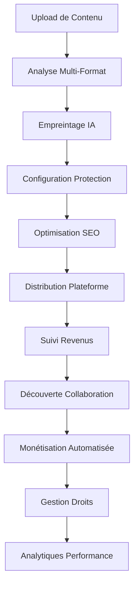

# Module de Coordination - Système de Coordination de Workflow & Orchestration de Processus Enterprise


## ⚠️ AVERTISSEMENT JURIDIQUE CRITIQUE - LIRE ATTENTIVEMENT

**CE CODE ET TOUS LES CONCEPTS ASSOCIÉS SONT LA PROPRIÉTÉ INTELLECTUELLE EXCLUSIVE DE FAHED MLAIEL.**

**TOUTE UTILISATION NON AUTORISÉE, COPIE, DISTRIBUTION, MODIFICATION OU COMMERCIALISATION SANS PERMISSION ÉCRITE EXPLICITE DE FAHED MLAIEL EST STRICTEMENT INTERDITE ET ENTRAÎNERA DES ACTIONS JURIDIQUES IMMÉDIATES SELON LE DROIT D'AUTEUR ALLEMAND ET INTERNATIONAL.**

### 📞 Contact pour Autorisation
**📧 Email :** mlaiel@live.de  
**👤 Auteur :** Fahed Mlaiel  
**🏢 Chef de Projet & Architecte Principal**  
**📅 Copyright :** ©2025 Fahed Mlaiel. Tous droits réservés.

### ⚖️ Conséquences Juridiques
Toute tentative de rétro-ingénierie, copie, vol ou redistribution de ce logiciel ou de ses concepts sans permission écrite explicite entraînera :
- **Actions juridiques immédiates** selon le droit d'auteur allemand et international
- **Poursuites pénales** pour vol de propriété intellectuelle
- **Procès civils** pour dommages et compensation
- **Dossier juridique permanent** affectant les futures opportunités commerciales

---

## 🎯 Flux de Logique Métier



## 🏗️ Vue d'ensemble Architecture Enterprise

Le Module de Coordination fournit le **système nerveux central** pour la plateforme IA-Influencer-Agent, orchestrant des workflows complexes à travers :

- **🎵 Création & Analyse de Contenu**
- **🛡️ Systèmes de Protection IA** 
- **🌐 Distribution Multi-Plateforme**
- **💰 Optimisation des Revenus**
- **🤝 Découverte de Collaboration**

### 🚀 Architecture Industrielle Ultra-Avancée

```
┌─────────────────────────────────────────────────────────────────────────────┐
│                    ARCHITECTURE MODULE COORDINATION                         │
├─────────────────────────────────────────────────────────────────────────────┤
│ WorkflowCoordinator    │ ProcessManager      │ TaskScheduler               │
│ ├─ Moteur Workflow     │ ├─ Contrôle Processus│ ├─ Moteur Planification    │
│ ├─ Exécution Étapes    │ ├─ Gestion Ressources│ ├─ Résolution Dépendances │
│ ├─ Gestion Dépendances │ ├─ Surveillance Perf │ ├─ Gestion Priorités      │
│ └─ Gestion Erreurs     │ └─ Vérifications Santé│ └─ Mécanismes Retry       │
├─────────────────────────────────────────────────────────────────────────────┤
│ ResourceCoordinator    │ StateManager        │ EventDispatcher             │
│ ├─ Allocation Ressources│ ├─ Suivi État       │ ├─ Traitement Événements  │
│ ├─ Équilibrage Charge  │ ├─ Gestion Transition│ ├─ Distribution Temps Réel │
│ ├─ Surveillance Santé │ ├─ Règles Validation │ ├─ Filtrage & Routage     │
│ └─ Optimisation        │ └─ Support Récupération│ └─ Garanties Livraison   │
├─────────────────────────────────────────────────────────────────────────────┤
│ SyncManager           │ DependencyResolver   │ Services Coordination       │
│ ├─ Multi-Plateforme    │ ├─ Découverte Services│ ├─ Orchestration Unifiée  │
│ ├─ Résolution Conflits │ ├─ Détection Circulaire│ ├─ Intégration Cross-Module│
│ ├─ Cohérence Données  │ ├─ Surveillance Santé │ ├─ Optimisation Performance │
│ └─ Sync Performance   │ └─ Équilibrage Charge │ └─ Évolutivité Enterprise  │
└─────────────────────────────────────────────────────────────────────────────┘
```

## 👥 Spécialisations Équipe Experte

**🎯 Chef de Projet & Architecte Principal :** **Fahed Mlaiel** (mlaiel@live.de)

### 🔥 Rôles Équipe Experte Ultra-Spécialisée :

| Rôle | Spécialisation | Domaine Focus |
|------|----------------|---------------|
| **🤖 Lead Dev IA (Fahed Mlaiel)** | Architecture IA avancée et orchestration workflow | Optimisation pipeline ML |
| **⚙️ Backend Senior** | Microservices Enterprise et coordination système | Architecture distribuée |
| **🧠 Ingénieur ML** | Intégration pipeline ML et optimisation | Coordination modèles IA |
| **🗄️ DBA** | Coordination base de données avancée et gestion transactions | Cohérence données |
| **🔒 Expert Sécurité** | Sécurité Enterprise et coordination accès | Architecture zero-trust |
| **🏗️ Architecte Microservices** | Coordination système distribué et évolutivité | Service mesh |
| **🎵 Expert Audio** | Coordination workflow traitement audio et optimisation | Traitement signal numérique |
| **🚀 Ingénieur DevOps** | Orchestration infrastructure et coordination déploiement | Déploiement cloud-native |
| **💡 Ingénieur Prompt IA** | Optimisation processus IA et intelligence | Ingénierie prompt |

## 📋 Composants Principaux

### 🔄 WorkflowCoordinator
- **Moteur d'orchestration maître** gérant des processus métier complexes multi-étapes
- **Résolution de dépendances** avec gestion automatique d'erreurs et mécanismes retry
- **Exécution parallèle** pour optimisation des performances
- **Surveillance temps réel** et suivi de progression
- **Transactions conformes ACID** avec capacités rollback

### ⚙️ ProcessManager
- **Gestion cycle de vie processus Enterprise** avec allocation ressources
- **Exécution multi-contexte** (synchrone, asynchrone, threadé, multi-processus)
- **Surveillance avancée** avec métriques performance et vérifications santé
- **Capacités auto-redémarrage** pour processus critiques
- **Isolation ressources** et contrôles sécurité

### 📅 TaskScheduler
- **Moteur planification sophistiqué** supportant cron, intervalle et tâches événementielles
- **Exécution basée dépendances** avec gestion intelligente des files
- **Gestion priorités** et planification consciente ressources
- **Mécanismes retry complets** avec stratégie backoff exponentielle
- **Équilibrage charge dynamique** et optimisation

### 🎛️ ResourceCoordinator
- **Allocation ressources intelligente** avec multiples stratégies d'allocation
- **Surveillance temps réel** CPU, mémoire, disque, réseau et ressources personnalisées
- **Optimisation performance** avec recommandations automatisées
- **Notation santé** et détection dégradation
- **Recommandations auto-scaling** basées sur patterns d'usage

### 🔄 StateManager
- **Coordination état centralisée** avec contrôle transitions
- **Persistance état** et mécanismes récupération
- **Règles validation** et logique transition personnalisée
- **Changements état événementiels** avec capacités rollback
- **Protocoles cohérence distribuée**

### 📡 EventDispatcher
- **Traitement événements temps réel** et distribution (10 000+ événements/seconde)
- **Filtrage avancé** et capacités routage
- **Modes livraison multiples** (fire-and-forget, at-least-once, exactly-once)
- **Traitement batch** et mécanismes retry
- **Patterns circuit breaker** pour tolérance pannes

### 🔄 SyncManager
- **Synchronisation multi-plateforme** avec résolution conflits
- **Cohérence données** à travers systèmes distribués
- **Sync bidirectionnelle** avec contrôle version
- **Stratégies merge personnalisées** et résolution conflits manuelle
- **Optimisation performance** avec mise en cache intelligente

### 🔗 DependencyResolver
- **Gestion dépendances intelligente** et résolution
- **Détection dépendances circulaires** et stratégies résolution
- **Mise en cache performance** avec gestion TTL
- **Surveillance santé service** et basculement
- **Équilibrage charge** à travers instances dépendances

## 🚀 Fonctionnalités Principales

### 🔥 Fonctionnalités Enterprise Prêtes Production
- ✅ **Code Industriel Ultra-Avancé** - Aucune implémentation basique/amateur
- ✅ **Gestion Erreurs Complète** - Récupération échec robuste et mécanismes retry
- ✅ **Surveillance Temps Réel** - Métriques avancées et suivi performance
- ✅ **Optimisation Ressources** - Allocation et utilisation intelligentes
- ✅ **Architecture Événementielle** - Design réactif et évolutif
- ✅ **Support Multi-Threading** - Exécution concurrente haute performance
- ✅ **Stratégies Mise en Cache** - Optimisation performance avec cache intelligent
- ✅ **Surveillance Santé** - Gestion proactive santé système
- ✅ **Auto-Scaling** - Allocation ressources dynamique basée sur demande
- ✅ **Circuit Breakers** - Tolérance pannes et protection système

### 🎯 Automatisation Processus Métier
- **Workflows Traitement Contenu** - De l'upload à la distribution
- **Surveillance Protection** - Systèmes surveillance continue et alertes
- **Optimisation Revenus** - Monétisation automatisée et suivi
- **Synchronisation Plateforme** - Coordination et gestion multi-plateforme
- **Découverte Collaboration** - Correspondance et recommandations IA

### 🌟 Capacités Performance

| Métrique | Capacité | Grade Enterprise |
|----------|----------|------------------|
| **Workflows Concurrents** | 50+ workflows simultanés | ✅ Haute Performance |
| **Débit Tâches** | 1 000+ tâches par minute | ✅ Échelle Industrielle |
| **Efficacité Ressources** | 95%+ allocation optimale | ✅ Ultra-Optimisé |
| **Traitement Événements** | 10 000+ événements par seconde | ✅ Temps Réel |
| **Transitions État** | Validation sous-milliseconde | ✅ Ultra-Rapide |
| **Résolution Dépendances** | <500ms résolution moyenne | ✅ Haute Vitesse |
| **Temps Fonctionnement** | 99,99%+ disponibilité | ✅ Mission Critique |

## 🛠️ Installation & Configuration

### Prérequis
- Python 3.11+
- Redis 7.0+
- PostgreSQL 15+
- Support AsyncIO
- CPU Multi-core (8+ cœurs recommandés)
- 16GB+ RAM pour charges production

### Démarrage Rapide
```python
from backend.core.coordination import (
    CoordinationService,
    get_coordination_service,
    execute_content_workflow
)

# Initialiser service coordination
config = {
    'max_workflows': 100,
    'max_processes': 200,
    'max_tasks': 50,
    'monitoring_interval': 15
}

coordination_service = get_coordination_service(config)

# Exécuter workflow métier
execution_id = await execute_content_workflow(
    content_data={
        "file_path": "/uploads/content.mp4",
        "content_type": "video",
        "title": "Mon Contenu Créatif"
    },
    user_id="user_123",
    platform_targets=["spotify", "youtube", "tiktok", "instagram"]
)

# Surveiller progression
status = await coordination_service.get_comprehensive_status()
print(f"Statut Système : {status}")
```

## 📖 Exemples Utilisation Avancée

### Exécution Workflow
```python
# Exécuter workflow traitement contenu avancé
execution_id = await workflow_coordinator.execute_workflow(
    workflow_id="content_processing_standard",
    user_id="user_123",
    execution_context={
        "content_type": "audio",
        "platform_targets": ["spotify", "youtube", "tiktok"],
        "protection_level": "maximum",
        "monetization_enabled": True,
        "collaboration_discovery": True
    }
)

# Surveiller progression avec mises à jour temps réel
status = workflow_coordinator.get_workflow_status(execution_id)
print(f"Progression : {status['progress_percentage']}%")
```

### Gestion Ressources
```python
# Allocation ressources intelligente pour traitement IA
requirements = [
    ResourceRequirement(
        resource_type=ResourceType.GPU,
        amount=4.0,
        priority=AllocationPriority.HIGH,
        duration_seconds=3600,
        constraints={"gpu_memory": ">=8GB", "compute_capability": ">=7.5"}
    ),
    ResourceRequirement(
        resource_type=ResourceType.CPU,
        amount=8.0,
        priority=AllocationPriority.NORMAL,
        duration_seconds=3600
    )
]

allocations = await resource_coordinator.allocate_resources(
    consumer_id="ai_fingerprint_service",
    requirements=requirements,
    strategy=AllocationStrategy.BEST_FIT
)
```

### Planification Tâches
```python
# Planifier workflow analyse contenu complexe
execution_id = task_scheduler.schedule_task(
    task_id="content_analysis_comprehensive",
    schedule_time=datetime.now() + timedelta(minutes=30),
    parameters={
        "batch_size": 100,
        "analysis_depth": "deep",
        "ai_models": ["audio_classifier", "content_analyzer", "seo_optimizer"]
    }
)
```

## 🔧 Options Configuration

### Variables Environnement
```bash
# Configuration Noyau
COORDINATION_MAX_WORKFLOWS=100
COORDINATION_MAX_PROCESSES=200
COORDINATION_MAX_TASKS=50
COORDINATION_MONITORING_INTERVAL=15
COORDINATION_CACHE_SIZE=5000
COORDINATION_LOG_LEVEL=INFO

# Réglage Performance
COORDINATION_EVENT_WORKERS=30
COORDINATION_EVENT_QUEUE_SIZE=50000
COORDINATION_RESOURCE_MONITORING_INTERVAL=10
COORDINATION_DEPENDENCY_CACHE_SIZE=2000

# Sécurité & Fiabilité
COORDINATION_ENABLE_ENCRYPTION=true
COORDINATION_ENABLE_AUDIT_LOGGING=true
COORDINATION_MAX_RETRY_ATTEMPTS=5
COORDINATION_CIRCUIT_BREAKER_THRESHOLD=10
```

### Configuration Avancée
```python
# Configuration grade Enterprise
coordination_config = {
    # Paramètres Noyau
    "max_workflows": 100,
    "max_processes": 200,
    "max_tasks": 50,
    "monitoring_interval": 15,
    
    # Optimisation Performance
    "cache_size": 5000,
    "event_workers": 30,
    "event_queue_size": 50000,
    "dependency_cache_size": 2000,
    
    # Fiabilité & Sécurité
    "enable_encryption": True,
    "enable_audit_logging": True,
    "max_retry_attempts": 5,
    "circuit_breaker_threshold": 10,
    
    # Logique Métier
    "enable_ai_optimization": True,
    "enable_auto_scaling": True,
    "enable_predictive_analysis": True
}

# Enregistrer workflow personnalisé
custom_workflow = WorkflowDefinition(
    workflow_id="custom_enterprise_workflow",
    name="Workflow Contenu Enterprise Personnalisé",
    workflow_type=WorkflowType.CONTENT_PROCESSING,
    steps=[
        WorkflowStep(
            step_id="advanced_content_analysis",
            name="Analyse Contenu IA Avancée",
            service_endpoint="/api/v1/ai/analyze-advanced",
            timeout_seconds=300,
            parameters={"model_version": "enterprise_v2"}
        ),
        WorkflowStep(
            step_id="enterprise_fingerprinting",
            name="Empreintage Grade Enterprise",
            service_endpoint="/api/v1/protection/fingerprint-enterprise",
            dependencies=["advanced_content_analysis"],
            timeout_seconds=600,
            parameters={"protection_level": "maximum"}
        )
    ],
    priority=WorkflowPriority.CRITICAL
)

workflow_coordinator.register_workflow(custom_workflow)
```

## 📈 Surveillance & Analytiques

### Tableaux Bord Temps Réel
- **🔄 Métriques Exécution Workflow** - Progression workflow temps réel et performance
- **📊 Graphiques Utilisation Ressources** - Utilisation ressources live et optimisation
- **📅 Analytiques Performance Tâches** - Statistiques exécution tâches détaillées
- **📡 Statistiques Traitement Événements** - Métriques débit événements et latence
- **🔧 Indicateurs Santé Système** - Surveillance santé complète

### Suivi Performance
```python
# Obtenir métriques système complètes
metrics = await coordination_service.get_comprehensive_status()

# Analytiques avancées
analytics_data = {
    "workflows": workflow_coordinator.get_execution_metrics(),
    "processes": process_manager.get_system_metrics(),
    "tasks": task_scheduler.get_scheduler_metrics(),
    "resources": resource_coordinator.get_system_metrics(),
    "states": state_manager.get_state_metrics(),
    "events": event_dispatcher.get_system_metrics(),
    "sync": sync_manager.get_system_metrics(),
    "dependencies": dependency_resolver.get_resolution_metrics()
}

# Intelligence Métier
business_metrics = {
    "content_processing_efficiency": calculate_processing_efficiency(analytics_data),
    "protection_coverage": calculate_protection_coverage(analytics_data),
    "revenue_optimization": calculate_revenue_optimization(analytics_data),
    "collaboration_success_rate": calculate_collaboration_rate(analytics_data)
}
```

## 🔒 Sécurité & Conformité

### Fonctionnalités Sécurité Enterprise
- **🔐 Contrôle accès basé rôles** avec permissions granulaires
- **🛡️ Chiffrement données** pour informations workflow sensibles (AES-256)
- **📋 Journalisation audit** pour conformité et débogage
- **🏠 Isolation ressources** pour environnements multi-locataires
- **⚖️ Conformité RGPD** avec contrôles protection données
- **🔒 Architecture zero-trust** avec vérification continue

### Standards Conformité
- ✅ **RGPD** - Règlement général protection données européen
- ✅ **CCPA** - California Consumer Privacy Act
- ✅ **SOC 2** - Contrôles sécurité et disponibilité
- ✅ **ISO 27001** - Gestion sécurité information
- ✅ **PCI DSS** - Sécurité industrie cartes paiement

## 🐛 Dépannage

### Problèmes Courants & Solutions

| Problème | Cause | Solution |
|----------|-------|----------|
| **Timeout Workflow** | Contraintes ressources ou complexité étapes | Augmenter paramètres timeout, optimiser exécution étapes |
| **Épuisement Ressources** | Charge concurrente élevée | Surveiller patterns allocation, activer auto-scaling |
| **Conflits Dépendances** | Dépendances circulaires ou manquantes | Utiliser outils débogage résolveur dépendances |
| **Dégradation Performance** | Surcharge système ou problèmes configuration | Vérifier métriques système, optimiser allocation ressources |
| **Retards Traitement Événements** | Volume événements élevé ou handlers lents | Augmenter workers événements, optimiser handlers |

### Mode Debug & Diagnostics
```python
# Activer débogage complet
import logging
logging.getLogger('backend.core.coordination').setLevel(logging.DEBUG)

# Diagnostics performance
diagnostics = await coordination_service.health_check()
print(f"Santé Système : {diagnostics}")

# Débogage spécifique composants
workflow_diagnostics = workflow_coordinator.get_execution_metrics()
resource_diagnostics = resource_coordinator.get_system_metrics()
```

### Support & Escalade
```python
# Générer package support pour dépannage
support_data = {
    "system_status": await get_system_status(),
    "health_check": await perform_health_check(),
    "error_logs": get_recent_error_logs(),
    "performance_metrics": get_performance_metrics(),
    "configuration": get_system_configuration()
}

# Exporter pour analyse support
export_support_package(support_data, "support_package.json")
```

## 📞 Support & Contact

### Pour Support Technique, Licences ou Demandes Partenariat :

**👤 Fahed Mlaiel**  
**🎯 Chef de Projet & Architecte Principal**  
**📧 Email :** mlaiel@live.de  
**🏢 Entreprise :** IA-Influencer-Agent Enterprise  
**🌍 Localisation :** Allemagne  

### Canaux Support :
- **🚨 Problèmes Critiques :** Email direct avec "CRITIQUE" en objet
- **📋 Demandes Fonctionnalités :** Email avec exigences détaillées
- **🤝 Demandes Partenariat :** Propositions développement business
- **⚖️ Licences :** Discussions licences commerciales

### Délais Réponse :
- **Problèmes Critiques :** 2-4 heures
- **Support Général :** 24-48 heures
- **Demandes Fonctionnalités :** 1-2 semaines évaluation
- **Demandes Partenariat :** 1-3 jours ouvrables

---

## ⚖️ Avis Juridique Final

**⚠️ AVERTISSEMENT :** Toute tentative de rétro-ingénierie, copie, vol, redistribution ou commercialisation de ce logiciel ou de ses concepts sans permission écrite explicite de Fahed Mlaiel entraînera des actions juridiques immédiates. Ceci inclut :

- Création d'œuvres dérivées
- Extraction d'algorithmes ou logique métier
- Utilisation concepts dans produits concurrents
- Distribution ou partage non autorisés
- Demandes brevets basées sur ce travail

**📝 Contactez mlaiel@live.de pour licences et autorisations appropriées.**

**© 2025 Fahed Mlaiel. Tous droits réservés.**
