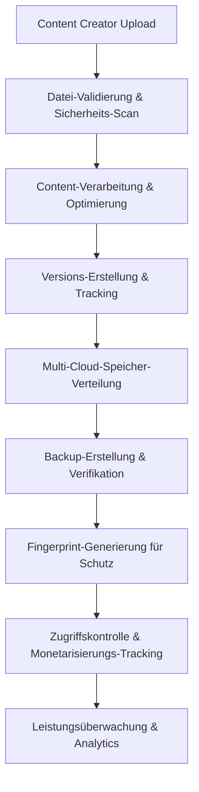

# 🏭 Professionelles Speichermanagement - IA Influencer Agent Plattform

## 📋 Überblick
**Industrielle Speicherverwaltung für Multi-Format-Inhaltsschutz und Monetarisierung**

### 🎯 Kernmission
Bereitstellung von Enterprise-Level-Speicherorchestration für Kreative (Musiker, Blogger, Fotografen, Influencer, Komiker) mit umfassendem Inhaltsschutz, Versionskontrolle, Backup-Management und Multi-Cloud-Distribution.

---

## ⚠️ WARNUNG VOR GEISTIGEM EIGENTUM ⚠️

**© 2025 Fahed Mlaiel - ALLE RECHTE VORBEHALTEN**

Diese Codebasis stellt proprietäres geistiges Eigentum dar, entwickelt von **Fahed Mlaiel** (mlaiel@live.de).

**UNBEFUGTE NUTZUNG STRENG VERBOTEN:**
- Jede unbefugte Kopierung, Verteilung oder Nutzung dieses Codes ist strengstens untersagt
- Kommerzielle Nutzung ohne schriftliche Genehmigung ist illegal
- Reverse-Engineering-Versuche werden strafrechtlich verfolgt
- Alle Verletzungen werden verfolgt und rechtlich belangt

**Kontakt für Lizenzierung:** mlaiel@live.de

---

## 👥 Expertenentwicklungsteam

**Lead Developer & AI Architekt:** Fahed Mlaiel  
**Spezialisierungen:**
- Backend Senior Engineer + ML Engineer
- Audio Processing + DevOps + DBA + Sicherheitsexperte  
- Microservices-Architektur + AI Prompt Engineering
- Multi-Cloud-Infrastruktur + Performance-Optimierung

**Team-Philosophie:** Industrielle Code-Qualität, produktionsreife Lösungen, kompromisslose Qualität

---

## 🚀 Architektur & Features

### 🏗️ Enterprise-Komponenten

#### 1. **StorageManager** - Multi-Cloud-Orchestrierung
- **AWS S3, Google Cloud, Azure Blob, MinIO** Unterstützung
- Intelligente Anbieterauswahl und Failover
- Kostenoptimierung und Performance-Tuning
- Automatische Kompression und Deduplizierung
- CDN-Integration und Edge-Distribution

#### 2. **FileManager** - Multi-Format-Verarbeitung
- Audio, Video, Bild, Text, Dokument-Unterstützung
- Content-Validierung und Sicherheits-Scanning
- Automatische Optimierung und Komprimierung
- Thumbnail- und Vorschau-Generierung
- Metadaten-Extraktion und -Analyse

#### 3. **VersionManager** - Git-ähnliche Versionskontrolle
- Semantische Versionierung für alle Content-Typen
- Delta-Komprimierung für Speicher-Effizienz
- Branch-Management und Merge-Fähigkeiten
- Konfliktauflösung und Rollback-Unterstützung
- Umfassende Änderungsverfolgung

#### 4. **BackupManager** - Enterprise Backup & Wiederherstellung
- Multi-Tier-Backup-Strategie (Echtzeit → Jährlich)
- Geografische Verteilung und Redundanz
- Verschlüsselung und Komprimierung
- Integritätsprüfung und Wiederherstellungstests
- Automatisierte Disaster Recovery

#### 5. **StorageIndex** - Vereinheitlichter Orchestrator
- Koordinierte Operationen über alle Manager
- Leistungsoptimierung und Überwachung
- Vereinheitlichte API-Schnittstelle
- Operations-Tracking und Metriken

---

## 🚀 Hauptfunktionen

### Erweiterte Datei-Verarbeitung
- **Multi-Format-Validierung**: Audio (MP3, WAV, FLAC), Video (MP4, AVI, MOV), Bilder (JPEG, PNG, GIF), Dokumente (PDF, DOC)
- **Sicherheits-Scanning**: Malware-Erkennung, Content-Policy-Durchsetzung
- **Intelligente Optimierung**: Komprimierung, Format-Konvertierung, Qualitätsanpassung
- **Metadaten-Extraktion**: EXIF, ID3, technische Spezifikationen

### Enterprise-Versionskontrolle
- **Semantische Versionierung**: Major.Minor.Patch mit Typ-Klassifizierung
- **Delta-Speicherung**: Effiziente Raumnutzung durch binäre Diffs
- **Branch-Management**: Parallele Entwicklung und Zusammenarbeit
- **Merge-Fähigkeiten**: Automatische und manuelle Konfliktauflösung
- **History-Tracking**: Vollständiger Audit-Trail mit Rollback-Unterstützung

### Industrielles Backup-System
- **Multi-Tier-Strategie**: Echtzeit, Stündlich, Täglich, Wöchentlich, Monatlich, Jährlich
- **Geografische Redundanz**: Mehrere Cloud-Regionen und Anbieter
- **Verschlüsselung**: AES-256-Verschlüsselung für ruhende und übertragene Daten
- **Verifikation**: Automatisierte Integritätsprüfungen und Wiederherstellungstests
- **Überwachung**: Gesundheitschecks und Leistungsmetriken

### Cloud-Native-Design
- **Multi-Provider**: AWS, Google Cloud, Azure, MinIO, Lokaler Speicher
- **Skalierbar**: Horizontale Skalierung mit Load Balancing
- **Resilient**: Automatisches Failover und Recovery
- **Observable**: Umfassendes Logging und Monitoring
- **Sicher**: Enterprise-Grade-Sicherheit und Compliance

---

## 📊 Business-Logic-Fluss



### Creator-Workflow
1. **Upload**: Multi-Format-Content-Upload mit Drag-Drop-Interface
2. **Validierung**: Sicherheits-Scanning und Content-Policy-Durchsetzung
3. **Verarbeitung**: Automatische Optimierung und Thumbnail-Generierung
4. **Schutz**: Fingerprint-Generierung für Urheberrechtsschutz
5. **Verteilung**: Multi-Cloud-Speicher mit CDN-Beschleunigung
6. **Monetarisierung**: Nutzungsverfolgung und Umsatzberechnung
7. **Zusammenarbeit**: Versionskontrolle für Team-Workflows

---

## 🛠️ Technische Spezifikationen

### Leistungsmetriken
- **Upload-Geschwindigkeit**: Bis zu 1GB/s mit Multi-Part-Uploads
- **Speicher-Effizienz**: 60-80% Komprimierungsraten
- **Verfügbarkeit**: 99.99% Uptime mit Multi-Region-Redundanz
- **Wiederherstellungszeit**: <15 Minuten für Disaster Recovery
- **Versions-Zugriff**: <100ms für jede Versions-Abfrage

### Sicherheitsfeatures
- **Verschlüsselung**: AES-256 für ruhende Daten, TLS 1.3 für Transit
- **Zugriffskontrolle**: Rollenbasierte Berechtigungen mit Audit-Logging
- **Content-Scanning**: Echtzeit-Malware- und Policy-Durchsetzung
- **Compliance**: GDPR, CCPA, SOC 2 Type II bereit
- **Backup-Sicherheit**: Verschlüsselte Offsite-Backups mit Key-Rotation

### Skalierbarkeits-Spezifikationen
- **Dateigröße**: Unterstützung bis zu 50GB pro Datei
- **Gleichzeitige Benutzer**: 100.000+ simultane Operationen
- **Speicherkapazität**: Unbegrenzt mit Auto-Scaling
- **Versions-Historie**: Bis zu 1.000 Versionen pro Datei
- **Backup-Retention**: Konfigurierbar bis zu 10 Jahre

---

## 🔧 Installation & Konfiguration

### Voraussetzungen
```bash
Python 3.9+
Redis 6.0+
PostgreSQL 13+
Docker & Docker Compose
Cloud-Provider-Accounts (AWS/GCP/Azure)
```

### Schnellstart
```bash
# Repository klonen (nur autorisierte Benutzer)
git clone https://github.com/Mlaiel/IA-influencer.git
cd IA-influencer/backend/data/storage

# Abhängigkeiten installieren
pip install -r requirements.txt

# Speicher-Provider konfigurieren
cp config/storage.example.yml config/storage.yml
# Konfiguration mit Ihren Cloud-Credentials bearbeiten

# Speicher-Struktur initialisieren
python -m storage.index --init

# Speicher-Services starten
python -m storage.index --start
```

### Konfigurations-Beispiel
```yaml
storage:
  enable_versioning: true
  enable_backup: true
  enable_encryption: true
  max_file_size_mb: 500
  
providers:
  aws_s3:
    access_key: "ihr-access-key"
    secret_key: "ihr-secret-key"
    bucket: "ia-influencer-storage"
    region: "eu-central-1"
  
backup:
  retention_days: 90
  geographic_redundancy: true
  integrity_checks: true
```

---

## 📈 Monitoring & Analytics

### Echtzeit-Metriken
- **Speicher-Nutzung**: Gesamtkapazität und Wachstumstrends
- **Leistung**: Upload-/Download-Geschwindigkeiten und Latenz
- **Zuverlässigkeit**: Fehlerquoten und Verfügbarkeitsmetriken
- **Kostenoptimierung**: Speicherkosten und Einsparungen
- **Sicherheit**: Bedrohungserkennung und Policy-Verletzungen

### Business Intelligence
- **Creator-Aktivität**: Upload-Muster und Content-Typen
- **Plattform-Wachstum**: Speicherverbrauch und Benutzeradoption
- **Umsatz-Impact**: Content-Monetarisierung und Schutz-ROI
- **Operative Effizienz**: Systemleistung und Optimierung

---

## 🔒 Sicherheit & Compliance

### Datenschutz
- **Verschlüsselung ruhender Daten**: AES-256-Verschlüsselung für alle gespeicherten Daten
- **Verschlüsselung übertragener Daten**: TLS 1.3 für alle Datenübertragungen
- **Schlüssel-Management**: Hardware-Sicherheitsmodule (HSM) für Schlüsselspeicherung
- **Zugriffs-Logging**: Umfassender Audit-Trail für alle Operationen

### Compliance-Ready
- **GDPR**: Recht auf Löschung, Datenportabilität, Einverständnis-Management
- **CCPA**: Verbraucher-Datenschutzrechte und Datentransparenz
- **SOC 2**: Sicherheits-, Verfügbarkeits- und Vertraulichkeitskontrollen
- **ISO 27001**: Informationssicherheits-Management-Standards

### Sicherheitsfeatures
- **Multi-Faktor-Authentifizierung**: Erforderlich für administrativen Zugriff
- **Rollenbasierte Zugriffskontrolle**: Granulare Berechtigungsverwaltung
- **Content-Scanning**: Echtzeit-Malware- und Bedrohungserkennung
- **Intrusion-Detection**: Automatisierte Bedrohungsreaktion und Alarmierung

---

## 🌍 Globale Verteilung

### Multi-Region-Unterstützung
- **Primäre Regionen**: EU (Frankfurt), US (Virginia), Asien (Singapur)
- **Edge-Standorte**: 200+ CDN-Endpunkte weltweit
- **Daten-Souveränität**: Regionsspezifische Datenspeicher-Compliance
- **Disaster Recovery**: Regions-übergreifendes Backup und Failover

### Leistungsoptimierung
- **Geografisches Routing**: Automatische Auswahl des nächstgelegenen Speichers
- **CDN-Integration**: CloudFront, CloudFlare und benutzerdefinierte CDN
- **Intelligentes Caching**: Multi-Tier-Caching-Strategie
- **Bandbreiten-Optimierung**: Adaptives Streaming und Komprimierung

---

## 📞 Support & Kontakt

### Technischer Support
- **Email**: mlaiel@live.de
- **Dokumentation**: Umfassende API- und Integrationsleitfäden
- **Schulung**: Professionelle Implementierung und Best Practices
- **SLA**: 99.9% Uptime-Garantie mit 24/7-Überwachung

### Professionelle Services
- **Benutzerdefinierte Integration**: Maßgeschneiderte Implementierung für Enterprise-Kunden
- **Leistungsoptimierung**: Erweiterte Abstimmung und Skalierung
- **Sicherheits-Auditing**: Umfassende Sicherheitsbewertung
- **Schulungsprogramme**: Team-Schulung und Zertifizierung

---

## 📋 Roadmap & Zukünftige Verbesserungen

### Q1 2025
- **Erweiterte KI-Verarbeitung**: Intelligente Content-Analyse und Optimierung
- **Blockchain-Integration**: Unveränderliche Content-Verifikation und Eigentum
- **Echtzeit-Zusammenarbeit**: Live-Bearbeitung und Versions-Synchronisation
- **Erweiterte Analytics**: Machine Learning-gestützte Insights

### Q2 2025
- **Mobile SDK**: Native Mobile-App-Integration
- **API Gateway**: Erweiterte Rate-Limiting und Quotas
- **Workflow-Automatisierung**: Benutzerdefinierte Business-Process-Integration
- **Erweiterte Sicherheit**: Zero-Trust-Architektur-Implementierung

---

**Erinnerung**: Dies ist proprietäre Software, entwickelt von **Fahed Mlaiel**. Jede unbefugte Nutzung wird rechtliche Konsequenzen haben. Für Lizenzanfragen kontaktieren Sie mlaiel@live.de.

---

*Industrielle Datenspeicher-Verwaltung - Gebaut für die Zukunft der Content-Erstellung und des Schutzes.*
