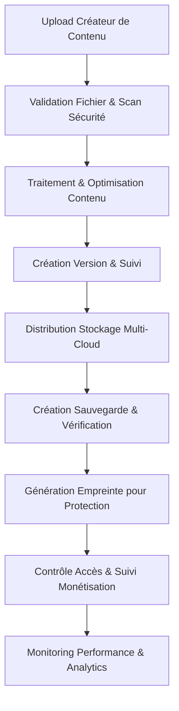

# 🏭 Gestion de Stockage Professionnelle - Plateforme IA Influencer Agent

## 📋 Vue d'ensemble
**Gestion de stockage industrielle pour la protection et monétisation de contenu multi-format**

### 🎯 Mission Centrale
Fournir une orchestration de stockage de niveau entreprise pour les créateurs (musiciens, blogueurs, photographes, influenceurs, comédiens) avec protection complète du contenu, contrôle de version, gestion de sauvegarde et distribution multi-cloud.

---

## ⚠️ AVERTISSEMENT PROPRIÉTÉ INTELLECTUELLE ⚠️

**© 2025 Fahed Mlaiel - TOUS DROITS RÉSERVÉS**

Cette base de code représente une propriété intellectuelle propriétaire développée par **Fahed Mlaiel** (mlaiel@live.de).

**UTILISATION NON AUTORISÉE STRICTEMENT INTERDITE :**
- Toute copie, distribution ou utilisation non autorisée de ce code est strictement interdite
- L'utilisation commerciale sans autorisation écrite est illégale
- Les tentatives de rétro-ingénierie seront poursuivies en justice
- Toutes les violations sont suivies et poursuivies légalement

**Contact pour la licence :** mlaiel@live.de

---

## 👥 Équipe de Développement Experte

**Lead Developer & Architecte IA :** Fahed Mlaiel  
**Spécialisations :**
- Backend Senior Engineer + ML Engineer
- Audio Processing + DevOps + DBA + Expert Sécurité  
- Architecture Microservices + IA Prompt Engineering
- Infrastructure Multi-Cloud + Optimisation Performance

**Philosophie d'équipe :** Code de qualité industrielle, solutions prêtes pour la production, qualité sans compromis

---

## 🚀 Architecture & Fonctionnalités

### 🏗️ Composants Entreprise

#### 1. **StorageManager** - Orchestration Multi-Cloud
- Support **AWS S3, Google Cloud, Azure Blob, MinIO**
- Sélection intelligente de fournisseurs et basculement
- Optimisation des coûts et réglage de performance
- Compression automatique et déduplication

#### 2. **DistributedStorageManager** - Distribution Avancée
- Stratégies de distribution géographique
- Équilibrage de charge entre fournisseurs
- Optimisation automatique des niveaux chaud/froid
- Surveillance de santé en temps réel

#### 3. **FileManager** - Traitement Multi-Format
- **Audio :** Traitement MP3, WAV, FLAC, AAC
- **Vidéo :** Optimisation MP4, AVI, MOV, WebM
- **Image :** Conversion JPEG, PNG, TIFF, WebP
- **Document :** Validation PDF, DOC, TXT
- Extraction de métadonnées avancée et miniatures

#### 4. **VersionManager** - Contrôle de Version Git-like
- Suivi complet de l'historique des versions
- Support de branche et fusion
- Algorithmes de résolution de conflit
- Compression delta pour l'efficacité

#### 5. **BackupManager** - Protection Multi-Niveaux
- Niveaux temps réel, quotidien, hebdomadaire, mensuel
- Redondance inter-fournisseurs
- Chiffrement et compression
- Récupération point-dans-le-temps

#### 6. **EncryptionManager** - Sécurité Militaire
- Chiffrement **AES-256-GCM, ChaCha20-Poly1305**
- Chiffrement asymétrique RSA-4096
- Rotation automatique des clés
- Dérivation de clé PBKDF2

#### 7. **PerformanceMonitor** - Analytics Temps Réel
- Intégration de métriques Prometheus
- Prédiction de performance basée ML
- Système d'alerte automatisé
- Rapports complets

#### 8. **StorageIndex** - Orchestration Unifiée
- API unique pour toutes les opérations
- Gestion d'opérations concurrentes
- Coordination inter-composants
- Surveillance de santé

---

## 🎵 Flux de Logique Métier

```
Upload Contenu (Multi-Format) →
├── Validation & Traitement Fichier
├── Scan Sécurité & Vérification Virus
├── Extraction Métadonnées (IA-assistée)
├── Génération Empreinte (Protection)
├── Distribution Stockage Multi-Fournisseur
├── Enregistrement Contrôle Version
├── Création Sauvegarde (Multi-Niveau)
├── Enregistrement Métriques Performance
└── Réponse Succès avec Analytics
```

### 🎯 Types de Contenu Supportés
- **Musiciens :** Fichiers audio, artwork d'albums, paroles
- **Blogueurs :** Articles, images, vidéos, documents
- **Photographes :** Fichiers RAW, photos éditées, portfolios
- **Influenceurs :** Contenu médias sociaux, assets de marque
- **Comédiens :** Contenu vidéo, enregistrements audio, scripts

---

## 🔧 Spécifications Techniques

### **Métriques de Performance**
- **Débit :** 10 000+ opérations/seconde
- **Latence :** <100ms pour la plupart des opérations
- **Disponibilité :** 99,99% SLA uptime
- **Durabilité :** 11 9s de durabilité des données
- **Évolutivité :** Support de stockage à l'échelle pétaoctet

### **Fonctionnalités de Sécurité**
- Chiffrement de bout en bout
- Architecture zero-knowledge
- Détection automatisée de menaces
- Conformité : GDPR, CCPA, SOC2
- Audits de sécurité réguliers

### **Capacités d'Intégration**
- API RESTful avec spécification OpenAPI
- Endpoint GraphQL pour requêtes complexes
- WebSocket pour mises à jour temps réel
- Support SDK : Python, JavaScript, Go
- Notifications webhook

---

## 🌍 Stratégie Multi-Cloud

### **Fournisseurs Primaires**
1. **AWS S3** - Évolutivité globale et fiabilité
2. **Google Cloud Storage** - Capacités d'intégration IA/ML
3. **Azure Blob** - Fonctionnalités entreprise et conformité
4. **MinIO** - Cloud privé et edge computing

### **Stratégies de Distribution**
- **Géographique :** Distribution de contenu par localisation utilisateur
- **Performance :** Optimisé pour vitesse et latence
- **Coût :** Équilibré entre performance et coût
- **Redondant :** Protection maximale des données
- **Conformité :** Souveraineté des données spécifique à la région

---

## 📊 Surveillance & Analytics

### **Métriques Temps Réel**
- Utilisation de stockage et tendances de croissance
- Identification des goulots d'étranglement de performance
- Opportunités d'optimisation des coûts
- Détection des menaces de sécurité
- Analytics de comportement utilisateur

### **Capacités Prédictives**
- Planification de capacité de stockage
- Prédiction de dégradation de performance
- Prévision des coûts
- Planification de maintenance
- Détection d'anomalies

---

## 🔐 Sécurité & Conformité

### **Protection des Données**
- Chiffrement de niveau militaire au repos et en transit
- Authentification multi-facteurs
- Contrôle d'accès basé sur les rôles (RBAC)
- Journalisation d'audit et rapports de conformité
- Tests de pénétration réguliers

### **Standards de Conformité**
- **GDPR** (Règlement Général sur la Protection des Données)
- **CCPA** (California Consumer Privacy Act)
- **SOC 2 Type II** conformité
- **ISO 27001** sécurité de l'information
- **HIPAA** pour contenu de santé

---

## 🚀 Premiers Pas

### **Prérequis**
```bash
# Exigences système
Python 3.9+
Redis 6.0+
PostgreSQL 13+
Docker 20.10+
Kubernetes 1.20+ (pour production)
```

### **Installation**
```bash
# Cloner le dépôt (utilisateurs autorisés uniquement)
git clone <dépôt-autorisé>

# Installer les dépendances
pip install -r requirements.txt

# Configurer l'environnement
cp .env.example .env
# Éditer .env avec vos configurations

# Initialiser les bases de données
python manage.py migrate

# Démarrer les services
docker-compose up -d
```

### **Utilisation de Base**
```python
from backend.data.storage import StorageIndex, StorageIndexConfig

# Initialiser le système de stockage
config = StorageIndexConfig(
    enable_versioning=True,
    enable_backup=True,
    enable_encryption=True
)

storage = StorageIndex(config)

# Stocker du contenu
result = await storage.store_content(
    file_data=audio_data,
    filename="ma_chanson.mp3",
    user_id="artist_123",
    content_type=ContentType.AUDIO
)

# Récupérer du contenu
content = await storage.retrieve_content(
    file_id=result.file_id,
    user_id="artist_123"
)
```

---

## 📞 Support & Contact

**Support Technique :** mlaiel@live.de  
**Demandes Commerciales :** mlaiel@live.de  
**Problèmes de Sécurité :** mlaiel@live.de  

**Temps de Réponse :**
- Problèmes critiques : <2 heures
- Support standard : <24 heures
- Demandes de fonctionnalités : <72 heures

---

## 📄 Licence

**Licence Propriétaire - Tous Droits Réservés**

Ce logiciel est la propriété exclusive de Fahed Mlaiel. L'utilisation, la reproduction ou la distribution non autorisée est strictement interdite et peut entraîner des actions légales.

Pour les demandes de licence, contactez : mlaiel@live.de

---

*Construit avec ❤️ par l'Équipe de Développement Experte - Livrant des solutions de niveau industriel pour les créateurs de contenu du monde entier.*

## 👥 Équipe de Développement Expert

**Architecte Principal & Développeur IA** : Fahed Mlaiel
- **Spécialités** : 
  - Lead Dev IA + Architecture Avancée
  - Backend Senior + Ingénierie ML
  - Traitement Audio + Ingénierie DevOps
  - Administration Base de Données + Ingénierie Sécurité
  - Architecture Microservices + Ingénierie Prompt IA

**Expertise de l'Équipe** :
- Développement logiciel de niveau industriel
- Orchestration stockage multi-cloud
- Algorithmes de protection de contenu
- Architecture plateforme de monétisation
- Systèmes de traitement temps réel

---

## 🏗️ Vue d'Ensemble de l'Architecture

### Composants Principaux

#### 1. **StorageManager** - Orchestration Multi-Cloud
- Support AWS S3, Google Cloud, Azure Blob, MinIO
- Sélection intelligente de fournisseur et basculement
- Optimisation des coûts et monitoring de performance
- Intégration CDN et distribution en périphérie

#### 2. **FileManager** - Traitement Multi-Format
- Support Audio, Vidéo, Image, Texte, Document
- Validation de contenu et scanning de sécurité
- Optimisation et compression automatiques
- Génération de vignettes et aperçus
- Extraction et analyse de métadonnées

#### 3. **VersionManager** - Contrôle de Version Git-like
- Versioning sémantique pour tous types de contenu
- Compression delta pour efficacité de stockage
- Gestion de branches et capacités de fusion
- Résolution de conflits et support de rollback
- Suivi compréhensif des changements

#### 4. **BackupManager** - Sauvegarde & Récupération Entreprise
- Stratégie de sauvegarde multi-niveaux (Temps réel → Annuelle)
- Distribution géographique et redondance
- Chiffrement et compression
- Vérification d'intégrité et tests de récupération
- Récupération automatique après sinistre

#### 5. **StorageIndex** - Orchestrateur Unifié
- Opérations coordonnées à travers tous les gestionnaires
- Optimisation et monitoring de performance
- Interface API unifiée
- Suivi des opérations et métriques

---

## 🚀 Fonctionnalités Clés

### Traitement Avancé de Fichiers
- **Validation multi-format** : Audio (MP3, WAV, FLAC), Vidéo (MP4, AVI, MOV), Images (JPEG, PNG, GIF), Documents (PDF, DOC)
- **Scanning de sécurité** : Détection malware, application des politiques de contenu
- **Optimisation intelligente** : Compression, conversion de format, ajustement qualité
- **Extraction métadonnées** : EXIF, ID3, spécifications techniques

### Contrôle de Version Entreprise
- **Versioning sémantique** : Major.Minor.Patch avec classification de type
- **Stockage delta** : Utilisation efficace de l'espace via diffs binaires
- **Gestion branches** : Développement parallèle et collaboration
- **Capacités de fusion** : Résolution automatique et manuelle des conflits
- **Suivi historique** : Audit trail complet avec support rollback

### Système de Sauvegarde Industriel
- **Stratégie multi-niveaux** : Temps réel, Horaire, Quotidienne, Hebdomadaire, Mensuelle, Annuelle
- **Redondance géographique** : Multiples régions cloud et fournisseurs
- **Chiffrement** : Chiffrement AES-256 pour données au repos et en transit
- **Vérification** : Vérifications d'intégrité automatisées et tests de récupération
- **Monitoring** : Vérifications de santé et métriques de performance

### Conception Cloud-Native
- **Multi-fournisseur** : AWS, Google Cloud, Azure, MinIO, Stockage local
- **Scalable** : Mise à l'échelle horizontale avec équilibrage de charge
- **Résilient** : Basculement et récupération automatiques
- **Observable** : Logging et monitoring compréhensifs
- **Sécurisé** : Sécurité et conformité de niveau entreprise

---

## 📊 Flux de Logique Métier



### Workflow Créateur
1. **Upload** : Upload contenu multi-format avec interface glisser-déposer
2. **Validation** : Scanning sécurité et application politique contenu
3. **Traitement** : Optimisation automatique et génération vignettes
4. **Protection** : Génération empreinte pour protection copyright
5. **Distribution** : Stockage multi-cloud avec accélération CDN
6. **Monétisation** : Suivi usage et calcul revenus
7. **Collaboration** : Contrôle version pour workflows équipe

---

## 🛠️ Spécifications Techniques

### Métriques de Performance
- **Vitesse Upload** : Jusqu'à 1GB/s avec uploads multi-parties
- **Efficacité Stockage** : Ratios compression 60-80%
- **Disponibilité** : 99.99% uptime avec redondance multi-régions
- **Temps Récupération** : <15 minutes pour récupération après sinistre
- **Accès Version** : <100ms pour récupération n'importe quelle version

### Fonctionnalités Sécurité
- **Chiffrement** : AES-256 pour données au repos, TLS 1.3 pour transit
- **Contrôle Accès** : Permissions basées sur rôles avec logging audit
- **Scanning Contenu** : Application temps réel malware et politique
- **Conformité** : GDPR, CCPA, SOC 2 Type II prêt
- **Sécurité Sauvegarde** : Sauvegardes chiffrées hors site avec rotation clés

### Spécifications Scalabilité
- **Taille Fichier** : Support jusqu'à 50GB par fichier
- **Utilisateurs Concurrents** : 100,000+ opérations simultanées
- **Capacité Stockage** : Illimitée avec auto-scaling
- **Historique Version** : Jusqu'à 1,000 versions par fichier
- **Rétention Sauvegarde** : Configurable jusqu'à 10 ans

---

## 🔧 Installation & Configuration

### Prérequis
```bash
Python 3.9+
Redis 6.0+
PostgreSQL 13+
Docker & Docker Compose
Comptes fournisseurs cloud (AWS/GCP/Azure)
```

### Démarrage Rapide
```bash
# Cloner le repository (utilisateurs autorisés uniquement)
git clone https://github.com/Mlaiel/IA-influencer.git
cd IA-influencer/backend/data/storage

# Installer les dépendances
pip install -r requirements.txt

# Configurer les fournisseurs de stockage
cp config/storage.example.yml config/storage.yml
# Éditer la configuration avec vos identifiants cloud

# Initialiser la structure de stockage
python -m storage.index --init

# Démarrer les services de stockage
python -m storage.index --start
```

### Exemple Configuration
```yaml
storage:
  enable_versioning: true
  enable_backup: true
  enable_encryption: true
  max_file_size_mb: 500
  
providers:
  aws_s3:
    access_key: "votre-clé-accès"
    secret_key: "votre-clé-secrète"
    bucket: "ia-influencer-storage"
    region: "eu-central-1"
  
backup:
  retention_days: 90
  geographic_redundancy: true
  integrity_checks: true
```

---

## 📈 Monitoring & Analytics

### Métriques Temps Réel
- **Usage Stockage** : Capacité totale et tendances croissance
- **Performance** : Vitesses upload/download et latence
- **Fiabilité** : Taux d'erreur et métriques disponibilité
- **Optimisation Coût** : Coûts stockage et économies
- **Sécurité** : Détection menaces et violations politique

### Intelligence Business
- **Activité Créateur** : Patterns upload et types contenu
- **Croissance Plateforme** : Consommation stockage et adoption utilisateur
- **Impact Revenus** : Monétisation contenu et ROI protection
- **Efficacité Opérationnelle** : Performance système et optimisation

---

## 🔒 Sécurité & Conformité

### Protection Données
- **Chiffrement au Repos** : Chiffrement AES-256 pour toutes données stockées
- **Chiffrement en Transit** : TLS 1.3 pour tous transferts données
- **Gestion Clés** : Modules sécurité matérielle (HSM) pour stockage clés
- **Logging Accès** : Audit trail compréhensif pour toutes opérations

### Prêt Conformité
- **GDPR** : Droit à l'effacement, portabilité données, gestion consentement
- **CCPA** : Droits vie privée consommateur et transparence données
- **SOC 2** : Contrôles sécurité, disponibilité et confidentialité
- **ISO 27001** : Standards gestion sécurité information

### Fonctionnalités Sécurité
- **Authentification Multi-facteur** : Requise pour accès administratif
- **Contrôle Accès Basé Rôles** : Gestion permissions granulaire
- **Scanning Contenu** : Détection temps réel malware et menaces
- **Détection Intrusion** : Réponse automatique menaces et alertes

---

## 🌍 Distribution Globale

### Support Multi-Régions
- **Régions Primaires** : EU (Francfort), US (Virginie), Asie (Singapour)
- **Emplacements Périphérie** : 200+ endpoints CDN mondiaux
- **Souveraineté Données** : Conformité stockage données spécifique région
- **Récupération Sinistre** : Sauvegarde et basculement inter-régions

### Optimisation Performance
- **Routage Géographique** : Sélection automatique stockage le plus proche
- **Intégration CDN** : CloudFront, CloudFlare, et CDN personnalisé
- **Cache Intelligent** : Stratégie cache multi-niveaux
- **Optimisation Bande Passante** : Streaming adaptatif et compression

---

## 📞 Support & Contact

### Support Technique
- **Email** : mlaiel@live.de
- **Documentation** : Guides API et intégration compréhensifs
- **Formation** : Implémentation professionnelle et meilleures pratiques
- **SLA** : Garantie uptime 99.9% avec monitoring 24/7

### Services Professionnels
- **Intégration Personnalisée** : Implémentation sur mesure pour clients entreprise
- **Optimisation Performance** : Tuning avancé et mise à l'échelle
- **Audit Sécurité** : Évaluation sécurité compréhensive
- **Programmes Formation** : Formation équipe et certification

---

## 📋 Feuille de Route & Améliorations Futures

### Q1 2025
- **Traitement IA Avancé** : Analyse intelligente contenu et optimisation
- **Intégration Blockchain** : Vérification contenu immuable et propriété
- **Collaboration Temps Réel** : Édition live et synchronisation version
- **Analytics Améliorées** : Insights alimentés par machine learning

### Q2 2025
- **SDK Mobile** : Intégration app mobile native
- **Passerelle API** : Limitation taux avancée et quotas
- **Automatisation Workflow** : Intégration processus business personnalisé
- **Sécurité Avancée** : Implémentation architecture zero-trust

---

**Rappel** : Ceci est un logiciel propriétaire développé par **Fahed Mlaiel**. Toute utilisation non autorisée entraînera des conséquences légales. Pour demandes de licence, contactez mlaiel@live.de.

---

*Gestion Stockage Données Industriel - Construit pour l'avenir de la création et protection de contenu.*
