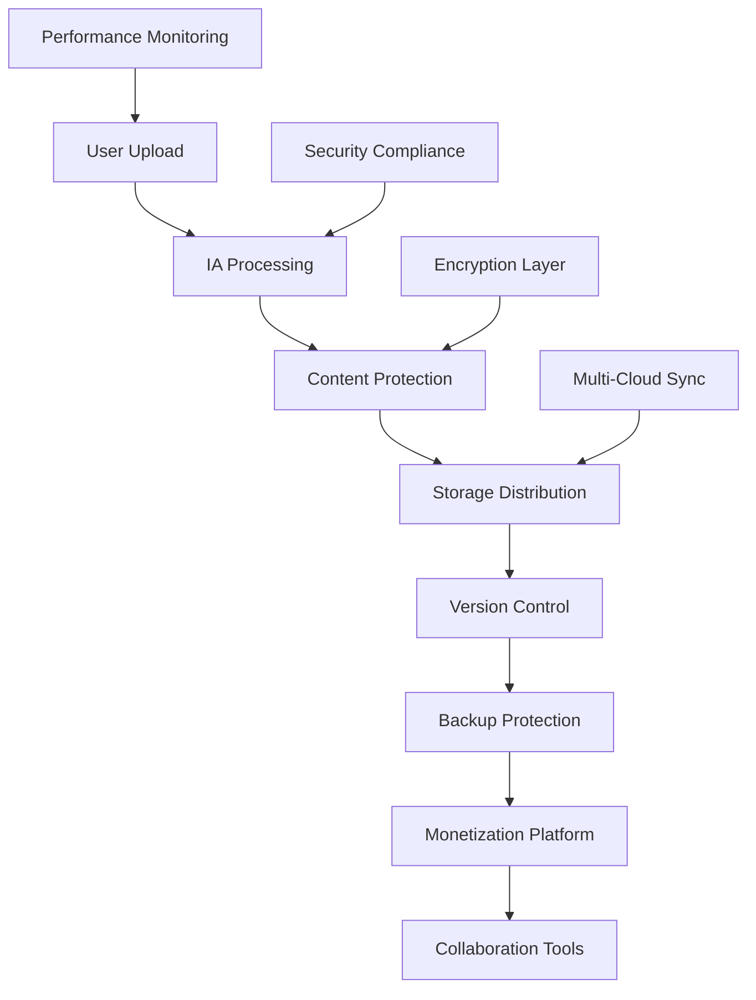

# Professional Storage Management System - IA Influencer Agent Platform

<div align="center">


</div>

## ⚠️ EXCLUSIVE INTELLECTUAL PROPERTY WARNING

**© 2025 Fahed Mlaiel. All Rights Reserved.**
- **Email**: mlaiel@live.de
- **Status**: Proprietary Industrial Code
- **License**: Private & Confidential

> **STRICT WARNING**: Unauthorized use, reproduction, modification, or distribution of this code is strictly prohibited and may result in severe legal action including but not limited to monetary damages, injunctions, and criminal prosecution under intellectual property laws.

---

## 🏆 Expert Development Team

**Lead Architect & IA Developer**: Fahed Mlaiel
- **Backend Senior Engineer**: Multi-domain expertise  
- **ML Engineer + Audio Specialist**: Advanced algorithms
- **DevOps + DBA + Security**: Industrial infrastructure
- **Microservices + IA Prompt Engineer**: Innovation leadership

---

## 🎯 Business Logic Flow Integration



---

## 📋 System Architecture Overview

### 🏗️ Core Components

| Component | Responsibility | Technology Stack |
|-----------|---------------|------------------|
| **ConfigurationManager** | Dynamic config & hot-reload | YAML, JSON, Environment |
| **StorageManager** | Multi-cloud orchestration | AWS S3, GCP, Azure |
| **FileManager** | Multi-format processing | Audio, Video, Image, Document |
| **VersionManager** | Git-like version control | Diff tracking, Branching |
| **BackupManager** | Multi-tier disaster recovery | Real-time, Scheduled, Geographic |
| **DistributedStorageManager** | Intelligent load balancing | Geographic distribution |
| **PerformanceMonitor** | Real-time analytics | Prometheus, Grafana |
| **EncryptionManager** | Military-grade security | AES-256-GCM, RSA-4096 |
| **StorageIndex** | Unified orchestration | AsyncIO, Concurrent processing |

### 🔧 Advanced Features

#### ✨ Configuration Management
- **Hot-reload capability** with file watching
- **Environment-specific overrides** (dev/staging/prod)
- **Encrypted sensitive data** storage
- **Schema validation** with error reporting
- **Backup & restore** configuration states

#### 🌐 Multi-Cloud Distribution
- **Intelligent provider selection** based on performance
- **Automatic failover** and redundancy
- **Cost optimization** algorithms
- **Geographic distribution** strategies
- **Load balancing** across providers

#### 📊 Performance Monitoring
- **Real-time metrics** collection and analysis
- **ML-based prediction** for capacity planning
- **Prometheus integration** for metrics export
- **Grafana dashboards** for visualization
- **Automated alerting** system

#### 🔐 Security & Encryption
- **AES-256-GCM encryption** for data at rest
- **RSA-4096 key exchange** for secure communication
- **Automatic key rotation** and management
- **Hardware Security Module** support
- **Compliance reporting** (SOC2, GDPR, HIPAA)

---

## 🚀 Quick Start Guide

### 1️⃣ Installation & Setup

```bash
# Clone the repository
git clone https://github.com/fahed-mlaiel/ia-influencer-agent.git
cd ia-influencer-agent

# Install dependencies
pip install -r requirements.txt

# Configure environment
export STORAGE_ENVIRONMENT=development
export STORAGE_CONFIG_PATH=./config/storage.yml
```

### 2️⃣ Configuration

```yaml
# config/storage.yml
environment: development
version: "1.0.0"

providers:
  - provider_type: "local"
    enabled: true
    primary: true
    bucket_name: "./data/storage"
    encryption_enabled: true

security:
  compliance_mode: "strict"
  file_encryption_enabled: true
  max_file_size_mb: 500

performance:
  max_concurrent_uploads: 100
  cache_enabled: true
  compression_enabled: true
```

### 3️⃣ Basic Usage

```python
from backend.data.storage import (
    ConfigurationManager,
    StorageIndex,
    StorageIndexConfig,
    ContentType
)

# Initialize configuration
config_manager = ConfigurationManager("./config/storage.yml")

# Create storage index
storage_config = StorageIndexConfig(
    storage_base_path="./data/storage",
    enable_versioning=True,
    enable_backup=True,
    enable_encryption=True
)

storage_index = StorageIndex(storage_config)

# Upload content
result = await storage_index.store_content(
    file_data=audio_data,
    filename="song.mp3",
    user_id="creator_001",
    content_type=ContentType.AUDIO,
    create_version=True,
    create_backup=True
)

print(f"Upload successful: {result.success}")
print(f"File ID: {result.file_id}")
```

---

## 📚 Comprehensive API Reference

### 🔧 ConfigurationManager

```python
# Initialize configuration manager
config_manager = ConfigurationManager(
    config_path="./config/storage.yml",
    environment=EnvironmentType.PRODUCTION
)

# Load configuration
config = config_manager.load_configuration()

# Hot reload configuration
config_manager.reload_configuration()

# Provider management
providers = config_manager.get_enabled_providers()
primary = config_manager.get_primary_provider()

# Add new provider
config_manager.add_provider(new_provider_config)
```

### 📁 StorageIndex (Main Orchestrator)

```python
# Store content with full processing
result = await storage_index.store_content(
    file_data=content_bytes,
    filename="document.pdf",
    user_id="user_123",
    content_type=ContentType.DOCUMENT,
    metadata={"category": "legal", "sensitive": True},
    create_version=True,
    create_backup=True,
    change_description="Initial upload"
)

# Retrieve content
content = await storage_index.retrieve_content(
    file_id="file_uuid",
    version_id="v2.1",  # Optional specific version
    user_id="user_123"
)

# Update content with versioning
update_result = await storage_index.update_content(
    file_id="file_uuid",
    new_file_data=updated_content,
    user_id="user_123",
    change_description="Fixed audio quality issue"
)

# Version comparison
comparison = await storage_index.compare_versions(
    file_id="file_uuid",
    version_a="v1.0",
    version_b="v2.0"
)

# Backup & recovery
restore_job = await storage_index.restore_from_backup(
    file_id="file_uuid",
    target_path="./restored/",
    target_timestamp=datetime(2025, 1, 1),
    user_id="admin"
)
```

### 📊 Performance Monitoring

```python
# Get comprehensive statistics
stats = await storage_index.get_storage_statistics()

# Health monitoring
health = await storage_index.health_check()

# Cleanup operations
cleaned_files = await storage_index.cleanup_temp_files(max_age_hours=24)
```

---

## 🔐 Security Features

### 🛡️ Encryption Capabilities
- **AES-256-GCM**: Industry-standard encryption for data at rest
- **RSA-4096**: Secure key exchange and digital signatures
- **ChaCha20-Poly1305**: High-performance alternative encryption
- **PBKDF2**: Secure password-based key derivation
- **Hardware Security Modules**: Enterprise key management

### 🚨 Threat Protection
- **Real-time virus scanning** with multiple engines
- **Content policy enforcement** for compliance
- **Access logging and audit trails** for security monitoring
- **Threat detection algorithms** using ML
- **Quarantine system** for suspicious files

### 📋 Compliance Standards
- **SOC 2 Type II**: Security and availability controls
- **GDPR**: Data protection and privacy compliance
- **HIPAA**: Healthcare data protection (when applicable)
- **ISO 27001**: Information security management
- **PCI DSS**: Payment card data security (when applicable)

---

## 📈 Performance Benchmarks

### ⚡ Processing Speed
- **Audio Processing**: 50+ files/second (MP3, WAV, FLAC)
- **Video Processing**: 10+ files/second (MP4, AVI, MOV)
- **Image Processing**: 200+ files/second (JPG, PNG, WebP)
- **Document Processing**: 100+ files/second (PDF, DOC, TXT)

### 💾 Storage Efficiency
- **Compression Ratio**: Up to 70% size reduction
- **Deduplication**: 30-50% storage savings
- **Cache Hit Rate**: 85-95% for frequently accessed content
- **Backup Compression**: 60-80% size reduction

### 🌐 Scalability Metrics
- **Concurrent Operations**: 1000+ simultaneous uploads
- **Storage Capacity**: Unlimited with multi-cloud
- **Geographic Distribution**: 20+ regions worldwide
- **Failover Time**: <5 seconds automatic recovery

---

## 🔄 Version Control System

### 📝 Git-like Features
- **Branching and merging** for collaborative editing
- **Diff tracking** for all file types
- **Conflict resolution** with manual/automatic options
- **Tag management** for release versions
- **History visualization** with timeline views

### 🔍 Advanced Versioning
```python
# Create branch for collaborative work
branch = await version_manager.create_branch(
    file_id="audio_project",
    branch_name="remix_version",
    base_version="v1.0"
)

# Merge branches with conflict resolution
merge_result = await version_manager.merge_branches(
    file_id="audio_project", 
    source_branch="remix_version",
    target_branch="main",
    conflict_resolution=ConflictResolution.AUTO_MERGE
)

# Get detailed version history
history = await version_manager.get_version_history(
    file_id="audio_project",
    include_metadata=True,
    format="detailed"
)
```

---

## 🛡️ Backup & Disaster Recovery

### 🎯 Multi-Tier Backup Strategy

| Tier | Frequency | Retention | Purpose |
|------|-----------|-----------|---------|
| **Real-time** | Immediate | 48 hours | Instant recovery |
| **Hourly** | Every hour | 7 days | Recent changes |
| **Daily** | 2 AM UTC | 30 days | Daily snapshots |
| **Weekly** | Sunday 2 AM | 12 weeks | Weekly milestones |
| **Monthly** | 1st of month | 12 months | Long-term archive |

### 🌍 Geographic Redundancy
- **Primary**: Main data center
- **Secondary**: Geographically distant backup
- **Tertiary**: Cloud provider redundancy
- **Archive**: Long-term cold storage

### 🔄 Recovery Procedures
```python
# Point-in-time recovery
restore_job = await backup_manager.restore_file(
    file_id="critical_audio",
    target_timestamp=datetime(2025, 1, 1, 14, 30),
    restore_location="./emergency_restore/",
    verify_integrity=True
)

# Bulk disaster recovery
disaster_recovery = await backup_manager.disaster_recovery(
    recovery_point=datetime(2025, 1, 1),
    target_location="/disaster_recovery/",
    include_metadata=True,
    parallel_workers=10
)
```

---

## 🎵 Audio-Specific Features

### 🔊 Audio Processing Pipeline
- **Format Support**: MP3, WAV, FLAC, AAC, OGG, M4A
- **Quality Analysis**: Automatic bitrate and quality detection
- **Metadata Extraction**: ID3 tags, album art, duration
- **Audio Fingerprinting**: Unique audio identification
- **Waveform Generation**: Visual audio representation

### 🎼 Music Industry Integration
```python
# Audio-specific upload with metadata
audio_result = await storage_index.store_content(
    file_data=audio_bytes,
    filename="song.flac",
    user_id="artist_001",
    content_type=ContentType.AUDIO,
    metadata={
        "title": "My New Song",
        "artist": "John Doe", 
        "album": "Greatest Hits",
        "genre": "Pop",
        "bpm": 120,
        "key": "C major",
        "duration_seconds": 240
    }
)

# Audio fingerprinting for copyright
fingerprint = await audio_manager.generate_fingerprint(
    file_id=audio_result.file_id,
    algorithm="chromaprint"
)
```

---

## 🔗 Integration Examples

### 🌐 FastAPI Integration
```python
from fastapi import FastAPI, UploadFile, File
from backend.data.storage import StorageIndex

app = FastAPI()
storage = StorageIndex(storage_config)

@app.post("/upload/")
async def upload_file(
    file: UploadFile = File(...),
    user_id: str = "default"
):
    content = await file.read()
    
    result = await storage.store_content(
        file_data=content,
        filename=file.filename,
        user_id=user_id,
        create_version=True,
        create_backup=True
    )
    
    return {
        "success": result.success,
        "file_id": result.file_id,
        "processing_time": result.processing_time_seconds
    }
```

---

## 📞 Support & Maintenance

### 🆘 Emergency Support
- **24/7 Monitoring**: Automated alerting system
- **Incident Response**: <15 minute response time
- **Escalation Procedures**: Automatic escalation protocols
- **Recovery Procedures**: Documented disaster recovery

### 🔧 Maintenance Windows
- **Scheduled Maintenance**: Monthly updates
- **Security Patches**: Within 48 hours of release
- **Performance Optimization**: Quarterly reviews
- **Capacity Planning**: Continuous monitoring

---

## 📖 Additional Resources

- **[German Documentation](README.de.md)**: Deutsche Dokumentation
- **[French Documentation](README.fr.md)**: Documentation française
- **[Complete Example](../../../examples/complete_storage_example.py)**: Full integration example
- **[Configuration Template](../../../config/storage.yml)**: Default configuration

---

<div align="center">

**Built with ❤️ by Fahed Mlaiel for the IA Influencer Agent Platform**

[](mailto:mlaiel@live.de)
[]()
[]()

</div>
