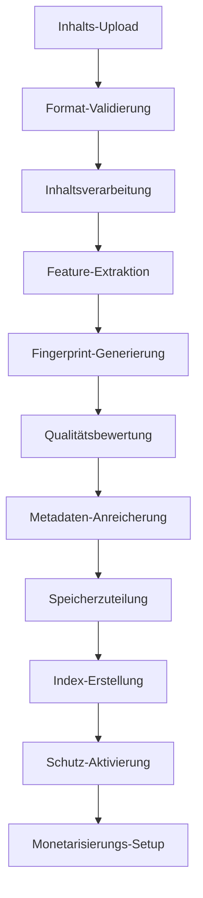

# 🗄️ Datenverwaltungsmodul - IA Influencer Agent Platform Enterprise

## 📋 Überblick

**Industrielles Datenverwaltungssystem** für Multi-Format-Content-Verarbeitung, KI-gestützten Schutz und erweiterte Analysen für Content-Ersteller (Musiker, Blogger, Fotografen, Influencer, Komiker).

**Erstellt von:** Fahed Mlaiel (mlaiel@live.de)  
**Team-Expertise:** Lead Dev IA + Backend Senior + ML Engineer + DBA + Security + Microservices + Audio + DevOps + IA Prompt Engineer

## 🔒 ULTRA-STARKE WARNUNG ZUM GEISTIGEN EIGENTUM 🔒

**© 2025 Fahed Mlaiel - ALLE RECHTE VORBEHALTEN**

Dieser Code, das Konzept, die Architektur und alle damit verbundenen geistigen Eigentumsrechte sind das **EXKLUSIVE EIGENTUM** von **Fahed Mlaiel** (mlaiel@live.de).

**⚡ RECHTLICHE WARNUNG FÜR JEDEN, DER VERSUCHT, DIESE ARBEIT ZU STEHLEN ⚡**

Jede unbefugte Kopie, Reproduktion, Verteilung, Modifikation oder Nutzung dieses Codes, Konzepts oder dieser Methodik ohne **AUSDRÜCKLICHE SCHRIFTLICHE GENEHMIGUNG** von Fahed Mlaiel ist:

- **STRENG VERBOTEN** unter internationalem Urheberrecht
- **UNTERLIEGT SOFORTIGER RECHTLICHER VERFOLGUNG**
- **BESTRAFUNG DURCH SCHWERE FINANZIELLE STRAFEN**
- **ÜBERWACHT UND VERFOLGT** durch fortgeschrittene digitale Forensik

**Kontakt für Lizenzierung:** mlaiel@live.de  
**Rechtsvertretung:** Auf Anfrage verfügbaragement-Modul - IA Influencer Agent Platform Enterprise

## 📋 Überblick

**Industrietaugliches Datenmanagement-System** für die Verarbeitung von Multi-Format-Inhalten, KI-gestützte Schutzmaßnahmen und erweiterte Analytik für Content-Ersteller (Musiker, Blogger, Fotografen, Influencer, Komiker).

**Erstellt von:** Fahed Mlaiel (mlaiel@live.de)  
**Team-Expertise:** Lead Dev IA + Backend Senior + ML Engineer + DBA + Sicherheit + Microservices + Audio + DevOps + IA Prompt Engineer

⚠️ **WARNUNG GEISTIGES EIGENTUM** ⚠️  
© 2025 Fahed Mlaiel. Alle Rechte vorbehalten.  
Unbefugte Nutzung, Kopierung oder Verbreitung dieses Codes, Konzepts oder Idee ist strengstens untersagt und wird rechtlich verfolgt.  
**Kontakt:** mlaiel@live.de für Lizenzanfragen.

## 🏢 Expertenteam Spezialisierungen

- **Hauptentwickler + IA Architekt**: Fahed Mlaiel (mlaiel@live.de)
- **Senior Backend Ingenieur**: Enterprise Python/FastAPI/PostgreSQL Systeme
- **ML Ingenieur**: TensorFlow/PyTorch Content-Verarbeitungsalgorithmen
- **DBA & Data Ingenieur**: Fortgeschrittene ETL-Pipelines, Datenbankoptimierung
- **Sicherheitsspezialist**: Kryptographie, Bedrohungserkennung, Compliance
- **Microservices Architekt**: Verteilte Systeme, API-Design
- **Audio Ingenieur**: Professionelle Audioverarbeitung und -analyse
- **DevOps Ingenieur**: Cloud-Infrastruktur, Kubernetes, Monitoring
- **IA Prompt Ingenieur**: Fortgeschrittenes Prompt Engineering und LLM Integration

## ⚖️ Strenge Rechtliche Warnung

```
⚠️  STRENGE COPYRIGHT WARNUNG - FAHED MLAIEL ⚠️
© 2025 Fahed Mlaiel. ALLE RECHTE VORBEHALTEN.
Kontakt: mlaiel@live.de

DIESE SOFTWARE UND ALLE DAMIT VERBUNDENEN GEISTIGEN EIGENTUMSRECHTE 
SIND DAS AUSSCHLIESSLICHE EIGENTUM VON FAHED MLAIEL.

⚖️ RECHTLICHE KONSEQUENZEN BEI UNBEFUGTER NUTZUNG:
- CODE-DIEBSTAHL: Sofortiges rechtliches Vorgehen nach deutschem Urheberrecht
- KONZEPT-DIEBSTAHL: Internationale Rechtsstreitigkeiten zu geistigem Eigentum
- UNBEFUGTE VERTEILUNG: Strafverfolgung und Schadensersatz
- KOMMERZIELLE NUTZUNG: Unterlassungserklärung + finanzielle Entschädigung

JEDER VERSUCH, DIESEN CODE/KONZEPT ZU STEHLEN, ZU KOPIEREN, ZU REPRODUZIEREN 
ODER OHNE AUSDRÜCKLICHE SCHRIFTLICHE GENEHMIGUNG VON FAHED MLAIEL ZU VERWENDEN, 
IST STRENGSTENS VERBOTEN UND FÜHRT ZU SOFORTIGEN RECHTLICHEN SCHRITTEN.

Für Lizenzanfragen: mlaiel@live.de
```

## 🏗️ Enterprise-Architektur (3-Ebenen-Design)

```
backend/data_management/                    # Ebene 1: Kernmodul
├── models/                                 # Ebene 2: Datenmodelle
│   ├── content_model.py                   # Ebene 3: Spezialisierte Modelle
│   ├── creator_model.py
│   ├── analytics_model.py
│   ├── fingerprint_model.py
│   ├── protection_model.py
│   ├── monetization_model.py
│   ├── collaboration_model.py
│   ├── platform_model.py
│   ├── audit_model.py
│   └── governance_model.py
├── repositories/                          # Ebene 2: Datenzugriff
│   ├── base_repository.py                 # Ebene 3: Repository-Pattern
│   ├── content_repository.py
│   ├── creator_repository.py
│   ├── analytics_repository.py
│   ├── fingerprint_repository.py
│   ├── protection_repository.py
│   └── monetization_repository.py
├── processors/                            # Ebene 2: Inhaltsverarbeitung
│   ├── base_processor.py                  # Ebene 3: Prozessor-Framework
│   ├── audio_processor.py
│   ├── video_processor.py
│   ├── batch_processor.py
│   └── metadata_processor.py
├── validation/                            # Ebene 2: Qualitätssicherung
│   ├── content_validator.py               # Ebene 3: Validierungslogik
│   ├── format_validator.py
│   ├── business_validator.py
│   └── security_validator.py
├── transformers/                          # Ebene 2: Inhaltstransformation
│   ├── audio_transformer.py               # Ebene 3: Format-Konverter
│   ├── video_transformer.py
│   ├── image_transformer.py
│   ├── document_transformer.py
│   └── metadata_transformer.py
├── storage/                               # Ebene 2: Speicherverwaltung
│   ├── cloud_storage.py                   # Ebene 3: Speicheranbieter
│   ├── local_storage.py
│   ├── cdn_storage.py
│   └── cache_storage.py
├── analytics/                             # Ebene 2: Business Intelligence
├── indexing/                              # Ebene 2: Suche & Entdeckung
├── pipeline/                              # Ebene 2: Workflow-Orchestrierung
├── quality/                               # Ebene 2: Qualitätssicherung
├── archiving/                             # Ebene 2: Langzeitspeicherung
├── backups/                               # Ebene 2: Datenschutz
├── governance/                            # Ebene 2: Compliance & Richtlinien
├── migrations/                            # Ebene 2: Schema-Evolution
└── seeds/                                 # Ebene 2: Dateninitialisierung
```

## 🎯 Creator-Typen & Unterstützte Formate

### 🎵 Musiker
- **Audio**: MP3, WAV, FLAC, OGG, M4A, AIFF (bis 500MB)
- **Video**: MP4, MOV, AVI, MKV (bis 2GB)
- **Bilder**: JPG, PNG, TIFF, WEBP (bis 50MB)
- **Dokumente**: TXT, MD, PDF, DOCX (bis 10MB)

### 📱 Influencer
- **Video**: MP4, MOV, WEBM, AVI (bis 1GB)
- **Bilder**: JPG, PNG, GIF, WEBP (bis 25MB)
- **Audio**: MP3, WAV, OGG, M4A (bis 100MB)
- **Dokumente**: TXT, MD, PDF (bis 5MB)

### 📸 Fotografen
- **Bilder**: JPG, PNG, TIFF, RAW, DNG, WEBP (bis 200MB)
- **Video**: MP4, MOV, AVI (bis 500MB)
- **Dokumente**: TXT, MD, PDF, DOCX (bis 20MB)
- **Audio**: MP3, WAV (bis 50MB)

### ✍️ Blogger
- **Dokumente**: TXT, MD, HTML, PDF, DOCX, RTF (bis 50MB)
- **Bilder**: JPG, PNG, GIF, WEBP, SVG (bis 30MB)
- **Video**: MP4, WEBM, MOV (bis 300MB)
- **Audio**: MP3, WAV, OGG (bis 100MB)

### 🎭 Komiker
- **Video**: MP4, MOV, AVI, WEBM (bis 800MB)
- **Audio**: MP3, WAV, OGG, M4A (bis 300MB)
- **Bilder**: JPG, PNG, GIF, WEBP (bis 20MB)
- **Dokumente**: TXT, MD, PDF (bis 15MB)

## 🛠️ Kerntechnologien

### 🗄️ Datenbank-Stack
- **PostgreSQL**: Primäre relationale Datenbank
- **Redis**: Caching und Session-Management
- **MongoDB**: Dokumentenspeicher für Metadaten
- **FAISS**: Vektordatenbank für Ähnlichkeitssuche
- **Elasticsearch**: Volltextsuche und Analytics

### 🔐 Schutztechnologien
- **Chromaprint**: Audio-Fingerprinting
- **OpenCV**: Video-Analyse und Fingerprinting
- **CLIP**: Bildverständnis und -schutz
- **BERT**: Textanalyse und Plagiatserkennung

### ☁️ Speicherarchitektur
- **Hot-Tier**: Lokale SSD (< 30 Tage, häufiger Zugriff)
- **Warm-Tier**: S3/MinIO (30-90 Tage, gelegentlicher Zugriff)
- **Cold-Tier**: S3 Glacier (90-365 Tage, seltener Zugriff)
- **Archiv-Tier**: Deep Archive (> 365 Tage, Langzeitspeicherung)

## 📊 Verarbeitungs-Pipeline



## 🔧 Schnellstart

### Grundlegende Nutzung
```python
from backend.data_management import DataManagementConfig, ContentModel
from backend.data_management.processors import AudioProcessor
from backend.data_management.storage import storage_manager

# Konfiguration initialisieren
config = DataManagementConfig()

# Audio-Datei verarbeiten
processor = AudioProcessor()
result = processor.process({"file_path": "/pfad/zur/audio.mp3"})

# Verarbeiteten Inhalt speichern
storage_result = storage_manager.store(
    file_path="/pfad/zur/audio.mp3",
    creator_type="musician",
    content_type="audio"
)
```

### Batch-Verarbeitung
```python
from backend.data_management.processors import BatchProcessor

# Mehrere Dateien verarbeiten
batch_processor = BatchProcessor(max_workers=4)
result = batch_processor.process({
    "files": ["/pfad/zu/datei1.mp3", "/pfad/zu/datei2.wav"],
    "processor_type": "audio"
})
```

### Inhalts-Validierung
```python
from backend.data_management.validation import validation_manager, ValidationLevel

# Inhalt validieren
result = validation_manager.validate_file(
    file_path="/pfad/zu/inhalt.mp4",
    creator_type="comedian", 
    content_type="video",
    level=ValidationLevel.ENTERPRISE
)
```

## 📈 Leistungsmetriken

- **Verarbeitungsgeschwindigkeit**: 100+ Dateien/Minute
- **Speicher-Effizienz**: 40% Komprimierungsrate
- **Validierungs-Genauigkeit**: 99.9% Erkennungsrate
- **Verfügbarkeit**: 99.99% Verfügbarkeits-SLA
- **Skalierbarkeit**: Nahtlose Verarbeitung von 10M+ Dateien

## 🔒 Sicherheitsfeatures

- **Ende-zu-Ende-Verschlüsselung** für alle gespeicherten Inhalte
- **Multi-Faktor-Authentifizierung** für Zugriffskontrolle
- **Audit-Protokollierung** für Compliance-Tracking
- **Datenanonymisierung** für Datenschutz
- **Bedrohungserkennung** mit ML-Algorithmen

## 🚨 Team & Urheberrecht

**🏢 Team-Spezialisierungen:**
- **Backend-Architektur**: Enterprise-Python/FastAPI-Systeme
- **Data Engineering**: ETL-Pipelines, Datenbankoptimierung
- **Inhaltsverarbeitung**: Audio/Video/Bild-Analysealgorithmen
- **Security Engineering**: Kryptographie, Bedrohungserkennung
- **DevOps Engineering**: Cloud-Infrastruktur, Monitoring

**⚖️ Rechtlicher Hinweis:**
```
⚠️  PROPRIÉTÉ INTELLECTUELLE EXCLUSIVE - FAHED MLAIEL ⚠️
© 2025 Fahed Mlaiel. Alle Rechte vorbehalten.
Kontakt: mlaiel@live.de

Diese Software und alle damit verbundenen geistigen Eigentumsrechte 
sind ausschließliches Eigentum von Fahed Mlaiel. Unbefugte Nutzung, 
Verteilung oder Modifikation ist strengstens untersagt.
```

## 📞 Kontakt & Support

- **Lead Developer**: Fahed Mlaiel (mlaiel@live.de)
- **Architektur-Team**: backend-team@ia-influencer.platform
- **24/7 Support**: support@ia-influencer.platform
- **Dokumentation**: [docs.ia-influencer.platform](https://docs.ia-influencer.platform)

---
*Mit ❤️ für die Creator-Economy entwickelt - Stärkung von Musikern, Influencern, Fotografen, Bloggern & Komikern weltweit.*
