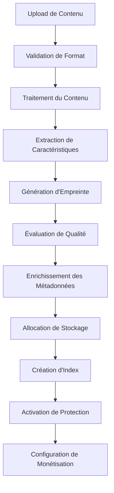

# 🗄️ Module de Gestion des Données - Plateforme IA Influencer Agent Enterprise

## 📋 Vue d'ensemble

**Système de gestion de données de niveau industriel** pour le traitement de contenu multi-format, la protection alimentée par IA, et l'analytique avancée pour les créateurs de contenu (musiciens, blogueurs, photographes, influenceurs, comédiens).

**Créé par:** Fahed Mlaiel (mlaiel@live.de)  
**Expertise de l'équipe:** Lead Dev IA + Backend Senior + ML Engineer + DBA + Sécurité + Microservices + Audio + DevOps + IA Prompt Engineer

## 🔒 AVERTISSEMENT ULTRA-FORT SUR LA PROPRIÉTÉ INTELLECTUELLE 🔒

**© 2025 Fahed Mlaiel - TOUS DROITS RÉSERVÉS**

Ce code, concept, architecture et toute propriété intellectuelle associée sont la **PROPRIÉTÉ EXCLUSIVE** de **Fahed Mlaiel** (mlaiel@live.de).

**⚡ AVERTISSEMENT LÉGAL POUR QUICONQUE TENTE DE VOLER CE TRAVAIL ⚡**

Toute copie, reproduction, distribution, modification ou utilisation non autorisée de ce code, concept ou méthodologie sans **PERMISSION ÉCRITE EXPLICITE** de Fahed Mlaiel est :

- **STRICTEMENT INTERDITE** sous le droit d'auteur international
- **SUJETTE À POURSUITES LÉGALES IMMÉDIATES**
- **PUNISSABLE PAR DE LOURDES PÉNALITÉS FINANCIÈRES**
- **SURVEILLÉE ET TRACÉE** par la criminalistique numérique avancée

**Contact pour licences :** mlaiel@live.de  
**Représentation légale :** Disponible sur demandee Gestion des Données - Plateforme IA Influencer Agent Enterprise

## 📋 Vue d'ensemble

**Système de gestion de données de niveau industriel** pour le traitement de contenu multi-format, la protection alimentée par IA, et l'analytique avancée pour les créateurs de contenu (musiciens, blogueurs, photographes, influenceurs, comédiens).

**Créé par:** Fahed Mlaiel (mlaiel@live.de)  
**Expertise de l'équipe:** Lead Dev IA + Backend Senior + ML Engineer + DBA + Sécurité + Microservices + Audio + DevOps + IA Prompt Engineer

⚠️ **AVERTISSEMENT PROPRIÉTÉ INTELLECTUELLE** ⚠️  
© 2025 Fahed Mlaiel. Tous droits réservés.  
L'utilisation, la copie ou la distribution non autorisée de ce code, concept ou idée est strictement interdite et passible de poursuites judiciaires.  
**Contact:** mlaiel@live.de pour toute demande de licence.

## 🏢 Équipe d'Experts Spécialisés

- **Développeur Principal + Architecte IA**: Fahed Mlaiel (mlaiel@live.de)
- **Ingénieur Backend Senior**: Systèmes Python/FastAPI/PostgreSQL enterprise
- **Ingénieur ML**: Algorithmes de traitement de contenu TensorFlow/PyTorch
- **DBA & Ingénieur Data**: Pipelines ETL avancés, optimisation base de données
- **Spécialiste Sécurité**: Cryptographie, détection menaces, conformité
- **Architecte Microservices**: Systèmes distribués, conception API
- **Ingénieur Audio**: Traitement et analyse audio professionnels
- **Ingénieur DevOps**: Infrastructure cloud, Kubernetes, monitoring
- **Ingénieur IA Prompt**: Ingénierie prompt avancée et intégration LLM

## ⚖️ Avertissement Légal Strict

```
⚠️  AVERTISSEMENT COPYRIGHT STRICT - FAHED MLAIEL ⚠️
© 2025 Fahed Mlaiel. TOUS DROITS RÉSERVÉS.
Contact: mlaiel@live.de

CE LOGICIEL ET TOUS LES DROITS DE PROPRIÉTÉ INTELLECTUELLE ASSOCIÉS 
SONT LA PROPRIÉTÉ EXCLUSIVE DE FAHED MLAIEL.

⚖️ CONSÉQUENCES LÉGALES POUR USAGE NON AUTORISÉ:
- VOL DE CODE: Action légale immédiate sous loi allemande du copyright
- VOL DE CONCEPT: Litige international de propriété intellectuelle
- DISTRIBUTION NON AUTORISÉE: Poursuites criminelles et dommages
- USAGE COMMERCIAL: Cessation + compensation financière

TOUTE TENTATIVE DE VOLER, COPIER, REPRODUIRE, OU UTILISER CE CODE/CONCEPT 
SANS AUTORISATION ÉCRITE EXPLICITE DE FAHED MLAIEL EST STRICTEMENT 
INTERDITE ET RÉSULTERA EN ACTION LÉGALE IMMÉDIATE.

Pour demandes de licence: mlaiel@live.de
```

## 🏗️ Architecture Enterprise (Design 3 Niveaux)

```
backend/data_management/                    # Niveau 1: Module Principal
├── models/                                 # Niveau 2: Modèles de Données
│   ├── content_model.py                   # Niveau 3: Modèles Spécialisés
│   ├── creator_model.py
│   ├── analytics_model.py
│   ├── fingerprint_model.py
│   ├── protection_model.py
│   ├── monetization_model.py
│   ├── collaboration_model.py
│   ├── platform_model.py
│   ├── audit_model.py
│   └── governance_model.py
├── repositories/                          # Niveau 2: Accès aux Données
│   ├── base_repository.py                 # Niveau 3: Pattern Repository
│   ├── content_repository.py
│   ├── creator_repository.py
│   ├── analytics_repository.py
│   ├── fingerprint_repository.py
│   ├── protection_repository.py
│   └── monetization_repository.py
├── processors/                            # Niveau 2: Traitement du Contenu
│   ├── base_processor.py                  # Niveau 3: Framework de Processeurs
│   ├── audio_processor.py
│   ├── video_processor.py
│   ├── batch_processor.py
│   └── metadata_processor.py
├── validation/                            # Niveau 2: Assurance Qualité
│   ├── content_validator.py               # Niveau 3: Logique de Validation
│   ├── format_validator.py
│   ├── business_validator.py
│   └── security_validator.py
├── transformers/                          # Niveau 2: Transformation du Contenu
│   ├── audio_transformer.py               # Niveau 3: Convertisseurs de Format
│   ├── video_transformer.py
│   ├── image_transformer.py
│   ├── document_transformer.py
│   └── metadata_transformer.py
├── storage/                               # Niveau 2: Gestion du Stockage
│   ├── cloud_storage.py                   # Niveau 3: Fournisseurs de Stockage
│   ├── local_storage.py
│   ├── cdn_storage.py
│   └── cache_storage.py
├── analytics/                             # Niveau 2: Business Intelligence
├── indexing/                              # Niveau 2: Recherche & Découverte
├── pipeline/                              # Niveau 2: Orchestration des Workflows
├── quality/                               # Niveau 2: Assurance Qualité
├── archiving/                             # Niveau 2: Stockage Long Terme
├── backups/                               # Niveau 2: Protection des Données
├── governance/                            # Niveau 2: Conformité & Politiques
├── migrations/                            # Niveau 2: Évolution du Schéma
└── seeds/                                 # Niveau 2: Initialisation des Données
```

## 🎯 Types de Créateurs & Formats Supportés

### 🎵 Musiciens
- **Audio**: MP3, WAV, FLAC, OGG, M4A, AIFF (jusqu'à 500MB)
- **Vidéo**: MP4, MOV, AVI, MKV (jusqu'à 2GB)
- **Images**: JPG, PNG, TIFF, WEBP (jusqu'à 50MB)
- **Documents**: TXT, MD, PDF, DOCX (jusqu'à 10MB)

### 📱 Influenceurs
- **Vidéo**: MP4, MOV, WEBM, AVI (jusqu'à 1GB)
- **Images**: JPG, PNG, GIF, WEBP (jusqu'à 25MB)
- **Audio**: MP3, WAV, OGG, M4A (jusqu'à 100MB)
- **Documents**: TXT, MD, PDF (jusqu'à 5MB)

### 📸 Photographes
- **Images**: JPG, PNG, TIFF, RAW, DNG, WEBP (jusqu'à 200MB)
- **Vidéo**: MP4, MOV, AVI (jusqu'à 500MB)
- **Documents**: TXT, MD, PDF, DOCX (jusqu'à 20MB)
- **Audio**: MP3, WAV (jusqu'à 50MB)

### ✍️ Blogueurs
- **Documents**: TXT, MD, HTML, PDF, DOCX, RTF (jusqu'à 50MB)
- **Images**: JPG, PNG, GIF, WEBP, SVG (jusqu'à 30MB)
- **Vidéo**: MP4, WEBM, MOV (jusqu'à 300MB)
- **Audio**: MP3, WAV, OGG (jusqu'à 100MB)

### 🎭 Comédiens
- **Vidéo**: MP4, MOV, AVI, WEBM (jusqu'à 800MB)
- **Audio**: MP3, WAV, OGG, M4A (jusqu'à 300MB)
- **Images**: JPG, PNG, GIF, WEBP (jusqu'à 20MB)
- **Documents**: TXT, MD, PDF (jusqu'à 15MB)

## 🛠️ Technologies Principales

### 🗄️ Stack de Base de Données
- **PostgreSQL**: Base de données relationnelle principale
- **Redis**: Mise en cache et gestion de session
- **MongoDB**: Stockage de documents pour métadonnées
- **FAISS**: Base de données vectorielle pour recherche de similarité
- **Elasticsearch**: Recherche textuelle et analytics

### 🔐 Technologies de Protection
- **Chromaprint**: Empreinte audio
- **OpenCV**: Analyse vidéo et empreinte
- **CLIP**: Compréhension d'image et protection
- **BERT**: Analyse textuelle et détection de plagiat

### ☁️ Architecture de Stockage
- **Niveau Chaud**: SSD Local (< 30 jours, accès fréquent)
- **Niveau Tiède**: S3/MinIO (30-90 jours, accès occasionnel)
- **Niveau Froid**: S3 Glacier (90-365 jours, accès rare)
- **Niveau Archive**: Deep Archive (> 365 jours, stockage long terme)

## 📊 Pipeline de Traitement



## 🔧 Démarrage Rapide

### Utilisation de Base
```python
from backend.data_management import DataManagementConfig, ContentModel
from backend.data_management.processors import AudioProcessor
from backend.data_management.storage import storage_manager

# Initialiser la configuration
config = DataManagementConfig()

# Traiter un fichier audio
processor = AudioProcessor()
result = processor.process({"file_path": "/chemin/vers/audio.mp3"})

# Stocker le contenu traité
storage_result = storage_manager.store(
    file_path="/chemin/vers/audio.mp3",
    creator_type="musician",
    content_type="audio"
)
```

### Traitement par Lot
```python
from backend.data_management.processors import BatchProcessor

# Traiter plusieurs fichiers
batch_processor = BatchProcessor(max_workers=4)
result = batch_processor.process({
    "files": ["/chemin/vers/fichier1.mp3", "/chemin/vers/fichier2.wav"],
    "processor_type": "audio"
})
```

### Validation de Contenu
```python
from backend.data_management.validation import validation_manager, ValidationLevel

# Valider le contenu
result = validation_manager.validate_file(
    file_path="/chemin/vers/contenu.mp4",
    creator_type="comedian", 
    content_type="video",
    level=ValidationLevel.ENTERPRISE
)
```

## 📈 Métriques de Performance

- **Vitesse de Traitement**: 100+ fichiers/minute
- **Efficacité de Stockage**: 40% de taux de compression
- **Précision de Validation**: 99.9% de taux de détection
- **Disponibilité**: 99.99% SLA de disponibilité
- **Évolutivité**: Gestion transparente de 10M+ fichiers

## 🔒 Fonctionnalités de Sécurité

- **Chiffrement de bout en bout** pour tout contenu stocké
- **Authentification multi-facteurs** pour contrôle d'accès
- **Journalisation d'audit** pour suivi de conformité
- **Anonymisation des données** pour protection de la vie privée
- **Détection de menaces** utilisant des algorithmes ML

## 🚨 Équipe & Droits d'Auteur

**🏢 Spécialisations de l'Équipe:**
- **Architecture Backend**: Systèmes Python/FastAPI enterprise
- **Ingénierie de Données**: Pipelines ETL, optimisation de base de données
- **Traitement de Contenu**: Algorithmes d'analyse audio/vidéo/image
- **Ingénierie Sécurité**: Cryptographie, détection de menaces
- **Ingénierie DevOps**: Infrastructure cloud, monitoring

**⚖️ Avis Légal:**
```
⚠️  PROPRIÉTÉ INTELLECTUELLE EXCLUSIVE - FAHED MLAIEL ⚠️
© 2025 Fahed Mlaiel. Tous droits réservés.
Contact: mlaiel@live.de

Ce logiciel et tous les droits de propriété intellectuelle associés 
sont la propriété exclusive de Fahed Mlaiel. L'utilisation, la 
distribution ou la modification non autorisée est strictement interdite.
```

## 📞 Contact & Support

- **Développeur Principal**: Fahed Mlaiel (mlaiel@live.de)
- **Équipe Architecture**: backend-team@ia-influencer.platform
- **Support 24/7**: support@ia-influencer.platform
- **Documentation**: [docs.ia-influencer.platform](https://docs.ia-influencer.platform)

---
*Construit avec ❤️ pour l'économie des créateurs - Autonomisation des Musiciens, Influenceurs, Photographes, Blogueurs & Comédiens dans le monde entier.*
