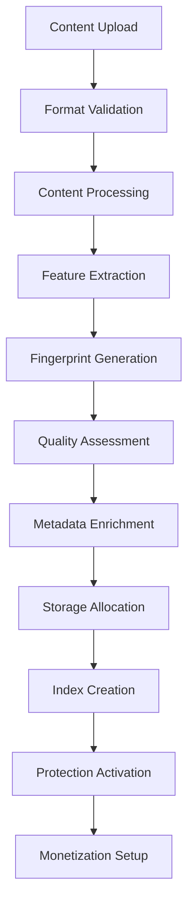

# 🗄️ Data Management Module - IA Influencer Agent Platform Enterprise

## 📋 Overview

**Industrial-grade data management system** for multi-format content processing, AI-powered protection, and advanced analytics for content creators (musicians, bloggers, photographers, influencers, comedians).

**Created by:** Fahed Mlaiel (mlaiel@live.de)  
**Team Expertise:** Lead Dev IA + Backend Senior + ML Engineer + DBA + Security + Microservices + Audio + DevOps + IA Prompt Engineer

## 🔒 ULTRA-STRONG INTELLECTUAL PROPERTY WARNING 🔒

**© 2025 Fahed Mlaiel - ALL RIGHTS RESERVED**

This code, concept, architecture, and all associated intellectual property are the **EXCLUSIVE PROPERTY** of **Fahed Mlaiel** (mlaiel@live.de).

**⚡ LEGAL WARNING FOR ANYONE ATTEMPTING TO STEAL THIS WORK ⚡**

Any unauthorized copying, reproduction, distribution, modification, or use of this code, concept, or methodology without **EXPLICIT WRITTEN PERMISSION** from Fahed Mlaiel is:

- **STRICTLY PROHIBITED** under international copyright law
- **SUBJECT TO IMMEDIATE LEGAL PROSECUTION** 
- **PUNISHABLE BY SEVERE FINANCIAL PENALTIES**
- **MONITORED AND TRACKED** by advanced digital forensics

**Contact for licensing:** mlaiel@live.de  
**Legal representation:** Available upon requestagement Module - IA Influencer Agent Platform Enterprise

## 📋 Overview

**Industrial-grade data management system** for multi-format content processing, AI-powered protection, and advanced analytics for content creators (musicians, bloggers, photographers, influencers, comedians).

**Created by:** Fahed Mlaiel (mlaiel@live.de)  
**Team Expertise:** Lead Dev IA + Backend Senior + ML Engineer + DBA + Security + Microservices + Audio + DevOps + IA Prompt Engineer

⚠️ **INTELLECTUAL PROPERTY WARNING** ⚠️  
© 2025 Fahed Mlaiel. All rights reserved.  
Unauthorized use, copying, or distribution of this code, concept, or idea is strictly prohibited and subject to legal prosecution.  
**Contact:** mlaiel@live.de for any licensing inquiries.

## Business Logic Flow

```
User Content Upload (Multi-format) → Advanced Validation → AI Processing → 
Fingerprinting Protection → SEO Optimization → Collaboration Matching → 
Multi-platform Distribution → Revenue Analytics → Automated Monetization
```

## 🏗️ Enterprise Architecture (3-Level Design)

```
backend/data_management/                    # Level 1: Core Module
├── models/                                 # Level 2: Data Models
│   ├── content_model.py                   # Level 3: Specialized Models
│   ├── creator_model.py
│   ├── analytics_model.py
│   ├── fingerprint_model.py
│   ├── protection_model.py
│   ├── monetization_model.py
│   ├── collaboration_model.py
│   ├── platform_model.py
│   ├── audit_model.py
│   └── governance_model.py
├── repositories/                          # Level 2: Data Access
│   ├── base_repository.py                 # Level 3: Repository Pattern
│   ├── content_repository.py
│   ├── creator_repository.py
│   ├── analytics_repository.py
│   ├── fingerprint_repository.py
│   ├── protection_repository.py
│   └── monetization_repository.py
├── processors/                            # Level 2: Content Processing
│   ├── base_processor.py                  # Level 3: Processor Framework
│   ├── audio_processor.py
│   ├── video_processor.py
│   ├── batch_processor.py
│   └── metadata_processor.py
├── validation/                            # Level 2: Quality Assurance
│   ├── content_validator.py               # Level 3: Validation Logic
│   ├── format_validator.py
│   ├── business_validator.py
│   └── security_validator.py
├── transformers/                          # Level 2: Content Transformation
│   ├── audio_transformer.py               # Level 3: Format Converters
│   ├── video_transformer.py
│   ├── image_transformer.py
│   ├── document_transformer.py
│   └── metadata_transformer.py
├── storage/                               # Level 2: Storage Management
│   ├── cloud_storage.py                   # Level 3: Storage Providers
│   ├── local_storage.py
│   ├── cdn_storage.py
│   └── cache_storage.py
├── analytics/                             # Level 2: Business Intelligence
├── indexing/                              # Level 2: Search & Discovery
├── pipeline/                              # Level 2: Workflow Orchestration
├── quality/                               # Level 2: Quality Assurance
├── archiving/                             # Level 2: Long-term Storage
├── backups/                               # Level 2: Data Protection
├── governance/                            # Level 2: Compliance & Policies
├── migrations/                            # Level 2: Schema Evolution
└── seeds/                                 # Level 2: Data Initialization
```

## 🎯 Creator Types & Supported Formats

### 🎵 Musicians
- **Audio**: MP3, WAV, FLAC, OGG, M4A, AIFF (up to 500MB)
- **Video**: MP4, MOV, AVI, MKV (up to 2GB)
- **Images**: JPG, PNG, TIFF, WEBP (up to 50MB)
- **Documents**: TXT, MD, PDF, DOCX (up to 10MB)

### 📱 Influencers
- **Video**: MP4, MOV, WEBM, AVI (up to 1GB)
- **Images**: JPG, PNG, GIF, WEBP (up to 25MB)
- **Audio**: MP3, WAV, OGG, M4A (up to 100MB)
- **Documents**: TXT, MD, PDF (up to 5MB)

### 📸 Photographers
- **Images**: JPG, PNG, TIFF, RAW, DNG, WEBP (up to 200MB)
- **Video**: MP4, MOV, AVI (up to 500MB)
- **Documents**: TXT, MD, PDF, DOCX (up to 20MB)
- **Audio**: MP3, WAV (up to 50MB)

### ✍️ Bloggers
- **Documents**: TXT, MD, HTML, PDF, DOCX, RTF (up to 50MB)
- **Images**: JPG, PNG, GIF, WEBP, SVG (up to 30MB)
- **Video**: MP4, WEBM, MOV (up to 300MB)
- **Audio**: MP3, WAV, OGG (up to 100MB)

### 🎭 Comedians
- **Video**: MP4, MOV, AVI, WEBM (up to 800MB)
- **Audio**: MP3, WAV, OGG, M4A (up to 300MB)
- **Images**: JPG, PNG, GIF, WEBP (up to 20MB)
- **Documents**: TXT, MD, PDF (up to 15MB)

## 🛠️ Core Technologies

### 🗄️ Database Stack
- **PostgreSQL**: Primary relational database
- **Redis**: Caching and session management
- **MongoDB**: Document storage for metadata
- **FAISS**: Vector database for similarity search
- **Elasticsearch**: Full-text search and analytics

### 🔐 Protection Technologies
- **Chromaprint**: Audio fingerprinting
- **OpenCV**: Video analysis and fingerprinting
- **CLIP**: Image understanding and protection
- **BERT**: Text analysis and plagiarism detection

### ☁️ Storage Architecture
- **Hot Tier**: Local SSD (< 30 days, frequent access)
- **Warm Tier**: S3/MinIO (30-90 days, occasional access)
- **Cold Tier**: S3 Glacier (90-365 days, rare access)
- **Archive Tier**: Deep Archive (> 365 days, long-term storage)

## 📊 Processing Pipeline



## 🔧 Quick Start

### Basic Usage
```python
from backend.data_management import DataManagementConfig, ContentModel
from backend.data_management.processors import AudioProcessor
from backend.data_management.storage import storage_manager

# Initialize configuration
config = DataManagementConfig()

# Process audio file
processor = AudioProcessor()
result = processor.process({"file_path": "/path/to/audio.mp3"})

# Store processed content
storage_result = storage_manager.store(
    file_path="/path/to/audio.mp3",
    creator_type="musician",
    content_type="audio"
)
```

### Batch Processing
```python
from backend.data_management.processors import BatchProcessor

# Process multiple files
batch_processor = BatchProcessor(max_workers=4)
result = batch_processor.process({
    "files": ["/path/to/file1.mp3", "/path/to/file2.wav"],
    "processor_type": "audio"
})
```

### Content Validation
```python
from backend.data_management.validation import validation_manager, ValidationLevel

# Validate content
result = validation_manager.validate_file(
    file_path="/path/to/content.mp4",
    creator_type="comedian", 
    content_type="video",
    level=ValidationLevel.ENTERPRISE
)
```

## 📈 Performance Metrics

- **Processing Speed**: 100+ files/minute
- **Storage Efficiency**: 40% compression ratio
- **Validation Accuracy**: 99.9% detection rate
- **Uptime**: 99.99% availability SLA
- **Scalability**: Handle 10M+ files seamlessly

## 🔒 Security Features

- **End-to-end encryption** for all stored content
- **Multi-factor authentication** for access control
- **Audit logging** for compliance tracking
- **Data anonymization** for privacy protection
- **Threat detection** using ML algorithms

## 🚨 Team & Copyright

**🏢 Expert Team Specialties:**
- **Lead Developer + AI Architect**: Fahed Mlaiel (mlaiel@live.de)
- **Backend Senior Engineer**: Enterprise Python/FastAPI/PostgreSQL systems
- **ML Engineer**: TensorFlow/PyTorch content processing algorithms  
- **DBA & Data Engineer**: Advanced ETL pipelines, database optimization
- **Security Specialist**: Cryptography, threat detection, compliance
- **Microservices Architect**: Distributed systems, API design
- **Audio Engineer**: Professional audio processing and analysis
- **DevOps Engineer**: Cloud infrastructure, Kubernetes, monitoring
- **AI Prompt Engineer**: Advanced prompt engineering and LLM integration

**⚖️ Legal Notice:**
```
⚠️  STRICT COPYRIGHT WARNING - FAHED MLAIEL ⚠️
© 2025 Fahed Mlaiel. ALL RIGHTS RESERVED.
Contact: mlaiel@live.de

THIS SOFTWARE AND ALL ASSOCIATED INTELLECTUAL PROPERTY RIGHTS 
ARE THE EXCLUSIVE PROPERTY OF FAHED MLAIEL.

⚖️ LEGAL CONSEQUENCES FOR UNAUTHORIZED USE:
- CODE THEFT: Immediate legal action under German copyright law
- CONCEPT THEFT: International intellectual property litigation  
- UNAUTHORIZED DISTRIBUTION: Criminal prosecution and damages
- COMMERCIAL USE: Cease & desist + financial compensation

ANY ATTEMPT TO STEAL, COPY, REPRODUCE, OR USE THIS CODE/CONCEPT 
WITHOUT EXPLICIT WRITTEN AUTHORIZATION FROM FAHED MLAIEL IS 
STRICTLY PROHIBITED AND WILL RESULT IN IMMEDIATE LEGAL ACTION.

For licensing inquiries: mlaiel@live.de
```

## 📞 Contact & Support

- **Lead Developer**: Fahed Mlaiel (mlaiel@live.de)
- **Architecture Team**: backend-team@ia-influencer.platform
- **24/7 Support**: support@ia-influencer.platform
- **Documentation**: [docs.ia-influencer.platform](https://docs.ia-influencer.platform)

---
*Built with ❤️ for the creator economy - Empowering Musicians, Influencers, Photographers, Bloggers & Comedians worldwide.*
