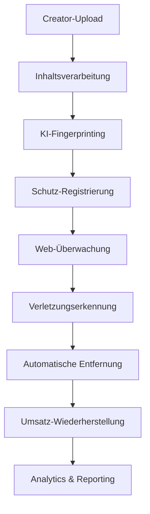

# 🏢 Datenverwaltungs-Repositories - IA Influencer Agent Platform Enterprise

[](https://github.com/your-repo)
[](https://github.com/your-repo)
[](https://github.com/your-repo)

## 🎯 Überblick

Das **Datenverwaltungs-Repositories** Modul ist die zentrale Datenzugriffsschicht der IA Influencer Agent Platform Enterprise und bietet industrietaugliche Repository-Patterns für Inhaltsschutz, Umsatzverwaltung und Multi-Plattform-Creator-Services.

## 👥 Experten-Entwicklungsteam

**Projektleiter & Senior Architekt:** Fahed Mlaiel  
**E-Mail:** mlaiel@live.de  
**Fachgebiete:** Lead Dev KI + Backend Senior + ML Engineer + DBA + Sicherheit + Microservices + Audio + DevOps + KI Prompt Engineer

## ⚠️ URHEBERRECHTLICHER HINWEIS

**© 2025 Fahed Mlaiel. ALLE RECHTE VORBEHALTEN.**

Diese Software und die dazugehörige Dokumentation sind das ausschließliche geistige Eigentum von Fahed Mlaiel. Jede unbefugte Nutzung, Vervielfältigung, Verbreitung oder Modifikation dieses Codes ist strengstens untersagt und kann schwerwiegende rechtliche Konsequenzen zur Folge haben:

- **Zivilrechtliche Verfolgung** wegen Urheberrechtsverletzung
- **Strafrechtliche Verfolgung** nach deutschem Urheberrecht
- **Schadensersatzforderungen** und Anwaltskosten
- **Einstweilige Verfügungen** und Vermögensbeschlagnahme

**WARNUNG**: Jeder Versuch, diesen Code oder das Konzept ohne ausdrückliche schriftliche Genehmigung von Fahed Mlaiel zu kopieren, zu stehlen oder sich unrechtmäßig anzueignen, wird mit der vollen Härte des Gesetzes verfolgt.

Für Lizenzanfragen kontaktieren Sie: **mlaiel@live.de**

## 🚀 Hauptfunktionen

- **🔒 Erweiterte Inhaltsschutz**: KI-gestützte Fingerprinting und Web-Überwachung
- **💰 Umsatzverwaltung**: Multi-Plattform-Monetarisierung und automatisierte Auszahlungen
- **🕷️ Web-Überwachung**: Echtzeit-Inhaltsüberwachung plattformübergreifend
- **🤝 Kollaborations-Engine**: Creator-Matching und Partnerschaftsverwaltung
- **📊 Analytics & Performance**: Umfassende Metriken und Einblicke
- **⚡ Hochleistung**: Async-Operationen mit Caching und Optimierung
- **🛡️ Sicherheit zuerst**: Audit-Trails, Verschlüsselung und Compliance

## 🏗️ Architektur

```
repositories/
├── base_repository.py           # Enterprise-Basis-Repository-Pattern
├── content_repository.py        # Multi-Format-Inhaltsverwaltung
├── creator_repository.py        # Creator-Profile und Analytics
├── revenue_repository.py        # Finanzverfolking und Auszahlungen
├── web_crawler_repository.py    # Inhaltsüberwachungssystem
├── analytics_repository.py     # Performance-Analytics
├── fingerprint_repository.py   # KI-Fingerprinting-Engine
├── protection_repository.py    # Inhaltsschutzsystem
├── monetization_repository.py  # Umsatzoptimierung
├── collaboration_repository.py # Creator-Partnerschaften
├── licensing_repository.py     # Rechteverwaltung
├── platform_repository.py      # Multi-Plattform-Integration
├── ai_processing_repository.py # KI-Verarbeitungspipeline
└── performance_repository.py   # System-Performance-Tracking
```

## 🎭 Geschäftslogik-Ablauf



## 🚀 Schnellstart

### Grundlegende Repository-Nutzung

```python
from backend.data_management.repositories import (
    ContentRepository, 
    CreatorRepository,
    RevenueRepository,
    WebCrawlerRepository
)

# Repositories initialisieren
content_repo = ContentRepository(db_connection, cache_manager)
creator_repo = CreatorRepository(db_connection, cache_manager)
revenue_repo = RevenueRepository(db_connection, cache_manager)
crawler_repo = WebCrawlerRepository(db_connection, cache_manager)

# Inhaltsverwaltung
content = content_repo.create(content_model)
fingerprint = content_repo.generate_fingerprint(content.content_id)

# Umsatzverfolgung
revenue_entry = revenue_repo.create_revenue_entry(
    creator_id="creator_123",
    content_id=content.content_id,
    platform="spotify",
    revenue_type=RevenueType.STREAMING,
    gross_amount=Decimal("150.00"),
    currency=Currency.EUR
)

# Web-Überwachung
crawl_job = crawler_repo.schedule_crawl_job(
    creator_id="creator_123",
    platform=PlatformType.YOUTUBE,
    search_terms=["Künstlername", "Songtitel"],
    fingerprints=[fingerprint]
)
```

## � Repository-Spezifikationen

### 🎯 Content Repository
- **Multi-Format-Support**: Audio, Video, Bild, Text
- **KI-Verarbeitung**: Automatische Metadaten-Extraktion
- **Fingerprinting**: Inhaltsschutz-Registrierung
- **Versionskontrolle**: Content-Iterations-Tracking

### 👤 Creator Repository
- **Profilverwaltung**: Multi-Typ-Creator-Support
- **Fähigkeitsanalyse**: KI-gestützte Bewertung
- **Kollaborations-Matching**: Algorithmus-basierte Partnerschaften
- **Performance-Tracking**: Umfassende Analytics

### 💰 Revenue Repository
- **Multi-Plattform-Aggregation**: 15+ unterstützte Plattformen
- **Echtzeit-Berechnungen**: Gebühren, Steuern, Wechselkurse
- **Automatisierte Auszahlungen**: Mehrere Zahlungsmethoden
- **Betrugserkennung**: Anomalie-Identifikation

### 🕷️ Web Crawler Repository
- **Multi-Plattform-Überwachung**: YouTube, TikTok, Instagram+
- **Echtzeit-Erkennung**: Inhaltsverletzungsalarme
- **Beweissicherung**: Rechtsgültige Dokumentation
- **Automatisierte Entfernungen**: DMCA-Compliance

## 🛡️ Sicherheit & Compliance

- **🔐 Verschlüsselung**: AES-256 für sensible Daten
- **🛡️ Zugriffskontrolle**: Rollenbasierte Berechtigungen
- **📝 Audit-Protokollierung**: Vollständige Operationswege
- **🌍 DSGVO-Konformität**: Datenschutz-Compliance
- **🇺🇸 CCPA-Konformität**: Kalifornische Datenschutzgesetze
- **⚖️ DMCA-Support**: Automatisierte Entfernungsverarbeitung

## 📊 Leistungsspezifikationen

| Metrik | Spezifikation |
|--------|---------------|
| **Durchsatz** | 10.000+ Operationen/Sekunde |
| **Antwortzeit** | <100ms Durchschnitt |
| **Verfügbarkeit** | 99,9% Uptime |
| **Parallelität** | 1.000+ gleichzeitige Benutzer |
| **Cache-Trefferrate** | >90% Effizienz |
| **Datenkonsistenz** | ACID-Compliance |

## 🔌 Integrationspunkte

### Unterstützte Plattformen
- **🎵 Musik**: Spotify, Apple Music, SoundCloud, Bandcamp
- **📺 Video**: YouTube, TikTok, Vimeo, Twitch
- **📱 Social**: Instagram, Twitter, Facebook, LinkedIn
- **🎨 Kreativ**: Pinterest, DeviantArt, Behance

### Zahlungsabwickler
- **💳 Stripe**: Globale Zahlungsverarbeitung
- **🏦 Wise**: Internationale Überweisungen
- **💰 PayPal**: Weltweite Zahlungen
- **🏛️ SEPA**: Europäisches Banking

## 📈 Analytics & Reporting

```python
# Umsatz-Analytics
summary = revenue_repo.get_revenue_summary(
    creator_id="creator_123",
    period_start=datetime.now() - timedelta(days=30),
    currency=Currency.EUR
)

# Performance-Metriken
metrics = performance_repo.get_performance_metrics(
    entity_type="content",
    time_range="7d"
)

# Verletzungserkennungs-Statistiken
violations = crawler_repo.get_violation_summary(
    creator_id="creator_123"
)
```

## 🚀 Bereitstellung & Skalierung

### Horizontale Skalierung
```yaml
# Kubernetes-Bereitstellung
replicas: 10
resources:
  requests:
    memory: "512Mi"
    cpu: "250m"
  limits:
    memory: "2Gi"
    cpu: "1000m"
```

---

## ⚠️ Rechtlicher Hinweis

**© 2025 Fahed Mlaiel. Alle Rechte vorbehalten.**

Diese Software und die dazugehörige Dokumentation sind das ausschließliche geistige Eigentum von Fahed Mlaiel. Die unbefugte Nutzung, Vervielfältigung, Verbreitung oder Modifikation dieses Codes ist strengstens untersagt und kann schwerwiegende rechtliche Konsequenzen zur Folge haben.

Für Lizenzanfragen wenden Sie sich an: **mlaiel@live.de**

---

**Enterprise IA Influencer Agent Platform - Schutz der Creator-Rechte weltweit** 🌍
