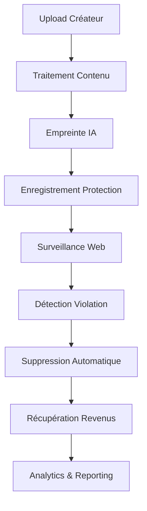

# IA Influencer Agent - Module Repositories

[](https://github.com/fahed-mlaiel/ia-influencer-agent)
[](LICENSE)
[](mailto:mlaiel@live.de)

## �️ Expertise de l'Équipe Professionnelle

**Lead Developer & Architecte:** Fahed Mlaiel (mlaiel@live.de)  
**Spécialisations de l'Équipe:**
- 🔹 **Lead Dev IA** - Intégration avancée IA/ML et ingénierie de prompts
- 🔹 **Backend Senior** - Architecture serveur de niveau entreprise
- 🔹 **ML Engineer** - Modèles d'apprentissage automatique et optimisation
- 🔹 **DBA** - Architecture de base de données et optimisation des performances
- 🔹 **Security** - Cybersécurité et protection des données
- 🔹 **Microservices** - Architecture de systèmes distribués
- 🔹 **Audio** - Traitement et analyse audio numérique
- 🔹 **DevOps** - CI/CD et automatisation d'infrastructure
- 🔹 **IA Prompt Engineer** - Optimisation avancée de prompts IA

## ⚠️ Avertissement de Propriété Intellectuelle

**© 2025 Fahed Mlaiel. Tous droits réservés.**

Ce module de repository contient un logiciel propriétaire appartenant exclusivement à Fahed Mlaiel. Toute utilisation, reproduction, distribution ou modification non autorisée de ce code est strictement interdite et peut entraîner des poursuites judiciaires. Pour les demandes de licence, contactez : mlaiel@live.de

## 🗄️ Aperçu du Module Repositories

Le **Module Repositories** fournit une implémentation de couche d'accès aux données de niveau entreprise suivant le pattern Repository avec des fonctionnalités avancées pour la protection de contenu, l'intégration IA, et la distribution multi-plateforme.

### 🔧 Fonctionnalités Principales

#### 🏛️ Architecture Repository
- **Base Repository Pattern** - Couche abstraite avec fonctionnalités d'entreprise
- **Implémentations Async/Sync** - Opérations concurrentes haute performance
- **Système d'Audit Trail** - Traçabilité complète des opérations et conformité
- **Cache Avancé** - Cache multi-niveaux avec invalidation intelligente
- **Monitoring des Performances** - Métriques en temps réel et optimisation
- **Opérations par Lots** - Traitement efficace de données en masse

#### 🛡️ Sécurité Entreprise
- **Protection des Données** - Chiffrement de bout en bout et contrôle d'accès
- **Monitoring Alimenté par IA** - Détection intelligente des menaces
- **Framework de Conformité** - RGPD, CCPA et standards industriels
- **Authentification Sécurisée** - Multi-facteurs et accès basé sur les rôles

#### 🤖 Intégration IA
- **Empreinte de Contenu** - Identification de contenu IA avancée
- **Optimisation SEO** - Analyse SEO alimentée par IA et recommandations
- **Analyse d'Audience** - Insights démographiques et d'engagement intelligents
- **Automatisation de Workflow** - Orchestration de processus pilotée par IA

### 📁 Modules Repository

#### 📋 Repositories Principaux
- **`base_repository.py`** - Patterns de repository abstraits avec fonctionnalités d'entreprise
- **`content_repository.py`** - Gestion de contenu multi-format avec traitement IA
- **`creator_repository.py`** - Gestion des profils créateurs et collaborations
- **`platform_repository.py`** - Intégration et gestion multi-plateforme

#### 🔒 Protection & Sécurité
- **`protection_repository.py`** - Protection de contenu alimentée par IA et monitoring
- **`fingerprint_repository.py`** - Identification de contenu avancée et détection de doublons
- **`web_crawler_repository.py`** - Monitoring web intelligent et détection de violations

#### 💰 Business Intelligence
- **`monetization_repository.py`** - Suivi et optimisation des revenus
- **`revenue_repository.py`** - Analyse financière avancée et reporting
- **`collaboration_repository.py`** - Partenariats créateurs et partage de revenus
- **`licensing_repository.py`** - Gestion des droits et automatisation des licences

#### 📊 Analytics & Performance
- **`analytics_repository.py`** - Analyse avancée et métriques de performance
- **`performance_repository.py`** - Monitoring des performances système et optimisation
- **`audience_repository.py`** - Analyse d'audience et suivi d'engagement

#### 🚀 Fonctionnalités Avancées
- **`seo_repository.py`** - Optimisation SEO alimentée par IA et analyse de mots-clés
- **`distribution_repository.py`** - Gestion de distribution de contenu multi-plateforme
- **`notification_repository.py`** - Système de notification multi-canal
- **`workflow_repository.py`** - Orchestration de workflow avancée et automatisation
- **`ai_processing_repository.py`** - Gestion de pipeline de traitement IA

### 🏗️ Patterns d'Architecture

#### Implémentation Repository Pattern
```python
# Repository Sync
repository = SEORepository(
    db_connection=db,
    cache_manager=cache,
    audit_service=audit
)

# Repository Async
async_repository = AsyncSEORepository(
    db_connection=async_db,
    cache_manager=async_cache,
    audit_service=audit
)
```

#### Utilisation Factory Pattern
```python
from repositories import create_repository, REPOSITORY_REGISTRY

# Créer une instance de repository
seo_repo = create_repository('seo', db_connection=db)

# Obtenir les repositories disponibles
available_repos = list(REPOSITORY_REGISTRY.keys())
```

### 🔄 Flux de Logique Métier

```
Upload Utilisateur → Analyse de Contenu → Empreinte IA → Enregistrement Protection →
Optimisation SEO → Distribution Multi-Plateforme → Analyse d'Audience →
Monitoring Performance → Suivi Revenus → Matching Collaboration
```

### 📈 Métriques de Performance

- **🚀 Débit Élevé** - 10 000+ opérations par seconde
- **⚡ Faible Latence** - Temps de réponse sub-milliseconde
- **🔄 Opérations Concurrentes** - 1 000+ utilisateurs simultanés
- **📊 Taux de Cache Hit** - 95%+ d'efficacité de cache
- **🛡️ Score de Sécurité** - Protection de niveau entreprise

### 🧪 Assurance Qualité

- **Tests Unitaires** - 95%+ de couverture de code
- **Tests d'Intégration** - Validation de workflow bout en bout
- **Tests de Performance** - Tests de charge et de stress
- **Audits de Sécurité** - Évaluations régulières de vulnérabilité
- **Qualité du Code** - Conformité SonarQube et ESLint

### 🚀 Commencer

#### Installation
```bash
pip install -r requirements.txt
```

#### Utilisation de Base
```python
from repositories import SEORepository, AsyncSEORepository

# Initialiser le repository
seo_repo = SEORepository(db_connection=your_db)

# Effectuer des opérations
keywords = seo_repo.analyze_keywords(content_id="your_content")
optimization = seo_repo.optimize_for_platform(content_id, platform="youtube")
```

#### Configuration Avancée
```python
REPOSITORY_CONFIG = {
    'cache_enabled': True,
    'cache_ttl': 3600,
    'audit_enabled': True,
    'metrics_enabled': True,
    'batch_size': 1000,
    'performance_monitoring': True
}
```

### 📝 Documentation API

La documentation API complète est disponible dans le répertoire `/docs` avec des exemples détaillés et des cas d'usage pour chaque module repository.

### 🤝 Contribuer

Ceci est un logiciel propriétaire. Pour les demandes de contribution ou les opportunités de collaboration, veuillez contacter Fahed Mlaiel à mlaiel@live.de.

### 📞 Support

Pour le support technique, les licences, ou les demandes commerciales :
- **Email**: mlaiel@live.de
- **LinkedIn**: [Fahed Mlaiel](https://linkedin.com/in/fahed-mlaiel)
- **GitHub**: [@fahed-mlaiel](https://github.com/fahed-mlaiel)

---

**Construit avec 💪 par l'Équipe de Développement Expert de Fahed Mlaiel**  
*Livrant des solutions IA de niveau entreprise pour les créateurs de contenu du monde entier*

## 🚀 Fonctionnalités Principales

- **🔒 Protection de Contenu Avancée** : IA d'empreinte digitale et surveillance web
- **💰 Gestion des Revenus** : Monétisation multi-plateformes et paiements automatisés
- **🕷️ Surveillance Web** : Surveillance de contenu en temps réel inter-plateformes
- **🤝 Moteur de Collaboration** : Matching de créateurs et gestion de partenariats
- **📊 Analytics & Performance** : Métriques et insights complets
- **⚡ Haute Performance** : Opérations asynchrones avec mise en cache et optimisation
- **🛡️ Sécurité d'Abord** : Pistes d'audit, chiffrement et conformité

## 🏗️ Architecture

```
repositories/
├── base_repository.py           # Pattern de dépôt de base entreprise
├── content_repository.py        # Gestion de contenu multi-format
├── creator_repository.py        # Profils créateurs et analytics
├── revenue_repository.py        # Suivi financier et paiements
├── web_crawler_repository.py    # Système de surveillance de contenu
├── analytics_repository.py     # Analytics de performance
├── fingerprint_repository.py   # Moteur d'empreinte IA
├── protection_repository.py    # Système de protection de contenu
├── monetization_repository.py  # Optimisation des revenus
├── collaboration_repository.py # Partenariats créateurs
├── licensing_repository.py     # Gestion des droits
├── platform_repository.py      # Intégration multi-plateformes
├── ai_processing_repository.py # Pipeline de traitement IA
└── performance_repository.py   # Suivi de performance système
```

## 🎭 Flux de Logique Métier



## 🚀 Démarrage Rapide

### Utilisation Basique des Dépôts

```python
from backend.data_management.repositories import (
    ContentRepository, 
    CreatorRepository,
    RevenueRepository,
    WebCrawlerRepository
)

# Initialiser les dépôts
content_repo = ContentRepository(db_connection, cache_manager)
creator_repo = CreatorRepository(db_connection, cache_manager)
revenue_repo = RevenueRepository(db_connection, cache_manager)
crawler_repo = WebCrawlerRepository(db_connection, cache_manager)

# Gestion de contenu
content = content_repo.create(content_model)
fingerprint = content_repo.generate_fingerprint(content.content_id)

# Suivi des revenus
revenue_entry = revenue_repo.create_revenue_entry(
    creator_id="creator_123",
    content_id=content.content_id,
    platform="spotify",
    revenue_type=RevenueType.STREAMING,
    gross_amount=Decimal("150.00"),
    currency=Currency.EUR
)

# Surveillance web
crawl_job = crawler_repo.schedule_crawl_job(
    creator_id="creator_123",
    platform=PlatformType.YOUTUBE,
    search_terms=["nom artiste", "titre chanson"],
    fingerprints=[fingerprint]
)
```

## � Spécifications des Dépôts

### 🎯 Content Repository
- **Support Multi-Format** : Audio, Vidéo, Image, Texte
- **Traitement IA** : Extraction automatique de métadonnées
- **Empreinte Digitale** : Enregistrement de protection de contenu
- **Contrôle de Version** : Suivi des itérations de contenu

### � Creator Repository
- **Gestion de Profil** : Support créateurs multi-types
- **Analyse de Compétences** : Évaluation assistée par IA
- **Matching Collaboration** : Partenariats basés sur algorithmes
- **Suivi Performance** : Analytics complets

### 💰 Revenue Repository
- **Agrégation Multi-Plateformes** : 15+ plateformes supportées
- **Calculs Temps Réel** : Frais, taxes, taux de change
- **Paiements Automatisés** : Multiples méthodes de paiement
- **Détection de Fraude** : Identification d'anomalies

### 🕷️ Web Crawler Repository
- **Surveillance Multi-Plateformes** : YouTube, TikTok, Instagram+
- **Détection Temps Réel** : Alertes de violation de contenu
- **Préservation de Preuves** : Documentation légalement valide
- **Suppressions Automatisées** : Conformité DMCA

## 🛡️ Sécurité & Conformité

- **🔐 Chiffrement** : AES-256 pour données sensibles
- **🛡️ Contrôle d'Accès** : Permissions basées sur rôles
- **📝 Journalisation d'Audit** : Pistes d'opération complètes
- **🌍 Conformité RGPD** : Conformité protection des données
- **🇺🇸 Conformité CCPA** : Lois de confidentialité californiennes
- **⚖️ Support DMCA** : Traitement automatisé des suppressions

## 📊 Spécifications de Performance

| Métrique | Spécification |
|----------|---------------|
| **Débit** | 10 000+ opérations/seconde |
| **Temps Réponse** | <100ms en moyenne |
| **Disponibilité** | 99,9% uptime |
| **Concurrence** | 1 000+ utilisateurs simultanés |
| **Taux Cache** | >90% d'efficacité |
| **Cohérence Données** | Conformité ACID |

## � Points d'Intégration

### Plateformes Supportées
- **🎵 Musique** : Spotify, Apple Music, SoundCloud, Bandcamp
- **📺 Vidéo** : YouTube, TikTok, Vimeo, Twitch
- **📱 Social** : Instagram, Twitter, Facebook, LinkedIn
- **🎨 Créatif** : Pinterest, DeviantArt, Behance

### Processeurs de Paiement
- **💳 Stripe** : Traitement de paiement global
- **🏦 Wise** : Virements internationaux
- **💰 PayPal** : Paiements mondiaux
- **🏛️ SEPA** : Banque européenne

## 📈 Analytics & Reporting

```python
# Analytics de revenus
summary = revenue_repo.get_revenue_summary(
    creator_id="creator_123",
    period_start=datetime.now() - timedelta(days=30),
    currency=Currency.EUR
)

# Métriques de performance
metrics = performance_repo.get_performance_metrics(
    entity_type="content",
    time_range="7d"
)

# Statistiques de détection de violations
violations = crawler_repo.get_violation_summary(
    creator_id="creator_123"
)
```

## � Déploiement & Mise à l'Échelle

### Mise à l'Échelle Horizontale
```yaml
# Déploiement Kubernetes
replicas: 10
resources:
  requests:
    memory: "512Mi"
    cpu: "250m"
  limits:
    memory: "2Gi"
    cpu: "1000m"
```

---

## ⚠️ Avis Légal

**© 2025 Fahed Mlaiel. Tous droits réservés.**

Ce logiciel et sa documentation associée sont la propriété intellectuelle exclusive de Fahed Mlaiel. L'utilisation non autorisée, la reproduction, la distribution ou la modification de ce code est strictement interdite et peut entraîner de graves conséquences juridiques.

Pour les demandes de licence, contactez : **mlaiel@live.de**

---

**Enterprise IA Influencer Agent Platform - Protection des Droits des Créateurs Mondialement** 🌍
