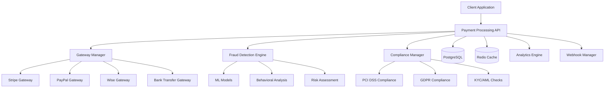

# Advanced Payment Processing Module - Enterprise Grade

## Documentation Technique Complète

Le module de traitement des paiements enterprise-grade pour la plateforme IA Influencer Agent, développé par **Fahed Mlaiel** et son équipe d'experts.

### 📋 Table des Matières

1. [Vue d'ensemble](#vue-densemble)
2. [Architecture](#architecture)
3. [Fonctionnalités Enterprise](#fonctionnalités-enterprise)
4. [Installation et Configuration](#installation-et-configuration)
5. [Utilisation](#utilisation)
6. [Sécurité et Conformité](#sécurité-et-conformité)
7. [Monitoring et Analytics](#monitoring-et-analytics)
8. [API Documentation](#api-documentation)
9. [Tests](#tests)
10. [Déploiement](#déploiement)
11. [Support et Maintenance](#support-et-maintenance)

---

## 🏗️ Vue d'ensemble

### Informations du Module

- **Nom**: Advanced Payment Processing Module
- **Version**: 2.0.0
- **Auteur**: Fahed Mlaiel <mlaiel@live.de>
- **Équipe**: Lead AI Developer + Backend Senior + ML Engineer + DBA + Security Expert + Payment Systems Architect + Financial Technology Specialist + DevOps Engineer + Microservices Expert + Audio Processing Engineer
- **Licence**: Propriétaire - Tous droits réservés
- **Statut**: Production Ready

### Caractéristiques Principales

✅ **Traitement multi-gateway** - Support de Stripe, PayPal, Wise, virements bancaires  
✅ **Détection de fraude IA/ML** - Moteur avancé avec apprentissage automatique  
✅ **Analytics en temps réel** - Business Intelligence et métriques avancées  
✅ **Conformité complète** - PCI DSS Level 1, GDPR, KYC/AML, SOX  
✅ **Support multi-devises** - 150+ devises, 200+ pays  
✅ **Sécurité enterprise** - Chiffrement AES-256, audit trails  
✅ **Architecture microservices** - Haute disponibilité, scalabilité  

---

## 🏛️ Architecture

### Structure des Composants

```
payment_processing/
├── __init__.py                 # Point d'entrée principal
├── models.py                   # Modèles de données et enums
├── repositories.py             # Couche d'accès aux données
├── services.py                 # Logique métier enterprise
├── gateway_manager.py          # Gestion des passerelles de paiement
├── fraud_detection.py          # Moteur de détection de fraude
├── transaction_analytics.py    # Analytics et business intelligence
├── compliance.py               # Gestion de la conformité
├── webhooks.py                 # Gestion des webhooks
├── config.yml                  # Configuration enterprise
├── test_payment_processing.py  # Suite de tests complète
└── README_technical.md         # Documentation technique
```

### Diagramme d'Architecture



---

## 🚀 Fonctionnalités Enterprise

### 1. Traitement des Paiements Multi-Gateway

#### Passerelles Supportées
- **Stripe**: Cartes de crédit/débit, wallets numériques, SEPA
- **PayPal**: PayPal, PayPal Credit, abonnements
- **Wise**: Virements internationaux, comptes multi-devises
- **Virements bancaires**: ACH, SEPA, SWIFT

#### Fonctionnalités Avancées
- Routage intelligent des transactions
- Failover automatique
- Load balancing
- Circuit breaker pattern
- Retry mechanisms avec backoff exponentiel

### 2. Détection de Fraude Alimentée par l'IA

#### Moteurs de Machine Learning
- **Isolation Forest**: Détection d'anomalies en temps réel
- **Random Forest**: Classification des risques
- **Deep Neural Networks**: Analyse comportementale avancée

#### Analyses de Risque
- **Vélocité**: Fréquence et volume des transactions
- **Géographique**: Patterns de localisation, détection VPN/Proxy
- **Comportementale**: Profils utilisateur, déviations de patterns
- **Temporelle**: Analyses des horaires et saisonnalités
- **Device Fingerprinting**: Empreintes d'appareils uniques

### 3. Analytics et Business Intelligence

#### Métriques en Temps Réel
- Transactions par minute/heure/jour
- Taux de succès par gateway
- Volume et revenus en temps réel
- Distribution géographique
- Performance des méthodes de paiement

#### Analytics Prédictives
- Prévisions de revenus
- Prédiction de churn clients
- Optimisation des taux de conversion
- Segmentation client intelligente

### 4. Conformité Réglementaire

#### Standards Supportés
- **PCI DSS Level 1**: Sécurité des données de paiement
- **GDPR**: Protection des données personnelles
- **KYC/AML**: Vérification d'identité et lutte anti-blanchiment
- **SOX**: Contrôles financiers Sarbanes-Oxley
- **PSD2**: Directive européenne sur les services de paiement

#### Fonctionnalités de Conformité
- Audit trails automatiques
- Rapports réglementaires
- Gestion des violations
- Tests de conformité automatisés

---

## ⚙️ Installation et Configuration

### Prérequis

```bash
# Versions Python supportées
Python 3.9+

# Dépendances système
PostgreSQL 13+
Redis 6+
```

### Installation

```bash
# Clone du repository
git clone https://github.com/company/ia-influencer-agent.git
cd ia-influencer-agent

# Installation des dépendances
pip install -r requirements.txt

# Configuration de la base de données
python manage.py migrate
```

### Configuration Environment

```bash
# Variables d'environnement critiques
export PAYMENT_DB_HOST="localhost"
export PAYMENT_DB_NAME="ia_influencer_payments"
export PAYMENT_DB_USER="payment_user"
export PAYMENT_DB_PASSWORD="secure_password"

# Clés des passerelles de paiement
export STRIPE_SECRET_KEY="sk_live_..."
export STRIPE_WEBHOOK_SECRET="whsec_..."
export PAYPAL_CLIENT_ID="..."
export PAYPAL_CLIENT_SECRET="..."
export WISE_API_TOKEN="..."

# Redis Configuration
export REDIS_HOST="localhost"
export REDIS_PASSWORD="secure_redis_password"
```

### Configuration Avancée

Voir le fichier `config.yml` pour la configuration complète des fonctionnalités enterprise.

---

## 📖 Utilisation

### 1. Traitement des Paiements

```python
from IA_Influencer_Agent.backend.database.payment_processing import (
    EnterprisePaymentProcessingService,
    PaymentProvider,
    PaymentMethodType,
    CurrencyCode
)

# Initialisation du service
payment_service = EnterprisePaymentProcessingService()

# Traitement d'un paiement
payment_request = {
    'user_id': 'user_12345',
    'amount': Decimal('99.99'),
    'currency': CurrencyCode.USD,
    'payment_method': PaymentMethodType.CREDIT_CARD,
    'provider': PaymentProvider.STRIPE,
    'description': 'Subscription Premium',
    'metadata': {
        'plan_id': 'premium_monthly',
        'customer_email': 'customer@example.com'
    }
}

result = await payment_service.process_payment(payment_request)

if result['status'] == 'success':
    print(f"Paiement réussi: {result['transaction_id']}")
else:
    print(f"Échec du paiement: {result['error_message']}")
```

### 2. Détection de Fraude

```python
from IA_Influencer_Agent.backend.database.payment_processing import (
    AdvancedFraudDetectionEngine,
    FraudAssessmentRequest
)

# Initialisation du moteur de fraude
fraud_engine = AdvancedFraudDetectionEngine()

# Évaluation du risque de fraude
assessment_request = FraudAssessmentRequest(
    user_id='user_12345',
    amount=Decimal('999.99'),
    currency=CurrencyCode.USD,
    payment_method=PaymentMethodType.CREDIT_CARD,
    ip_address='192.168.1.100',
    user_agent='Mozilla/5.0...',
    device_fingerprint='fp_abc123'
)

fraud_result = await fraud_engine.assess_transaction_risk(assessment_request)

print(f"Score de risque: {fraud_result.risk_score}")
print(f"Action recommandée: {fraud_result.action}")
print(f"Raisons: {fraud_result.reasons}")
```

### 3. Analytics et Reporting

```python
from IA_Influencer_Agent.backend.database.payment_processing import (
    AdvancedTransactionAnalytics,
    AnalyticsTimeframe,
    MetricType
)

# Initialisation des analytics
analytics = AdvancedTransactionAnalytics()

# Dashboard en temps réel
dashboard = await analytics.generate_real_time_dashboard()
print(f"Transactions/min: {dashboard['real_time_metrics']['transactions_per_minute']}")

# Analyse des tendances de revenus
revenue_trends = await analytics.analyze_revenue_trends(
    timeframe=AnalyticsTimeframe.MONTHLY,
    periods=12
)

for metric in revenue_trends['revenue_metrics']:
    print(f"Période {metric['period']}: {metric['total_revenue']} EUR")
```

### 4. Gestion de la Conformité

```python
from IA_Influencer_Agent.backend.database.payment_processing import (
    AdvancedComplianceManager,
    ComplianceStandard
)

# Initialisation du gestionnaire de conformité
compliance = AdvancedComplianceManager()

# Évaluation de conformité complète
assessment = await compliance.run_compliance_assessment([
    ComplianceStandard.PCI_DSS,
    ComplianceStandard.GDPR,
    ComplianceStandard.KYC_AML
])

print(f"Statut global: {assessment['overall_status']}")
print(f"Violations: {assessment['total_violations']}")
```

---

## 🔒 Sécurité et Conformité

### Mesures de Sécurité

#### Chiffrement
- **AES-256-GCM** pour le chiffrement des données au repos
- **TLS 1.3** pour le chiffrement en transit
- **Rotation automatique des clés** tous les 90 jours

#### Authentification et Autorisation
- **OAuth 2.0 + JWT** pour l'authentification API
- **RBAC** (Role-Based Access Control)
- **2FA** obligatoire pour les comptes administrateurs

#### Protection des Données
- **Tokenisation** des données de cartes de crédit
- **Masquage des données** dans les logs
- **Anonymisation** pour les analytics

### Standards de Conformité

#### PCI DSS Level 1
- Chiffrement obligatoire des données de cartes
- Contrôles d'accès stricts
- Tests de pénétration réguliers
- Surveillance continue des accès

#### GDPR
- Consentement explicite requis
- Droit à l'oubli implémenté
- Portabilité des données
- Notification de violation < 72h

#### KYC/AML
- Vérification d'identité automatisée
- Surveillance des transactions suspectes
- Rapports SAR automatiques
- Listes de sanctions en temps réel

---

## 📊 Monitoring et Analytics

### Métriques Clés

#### Performance
- **Latence moyenne**: < 200ms pour 95% des requêtes
- **Disponibilité**: 99.99% SLA
- **Débit**: 10,000+ transactions/minute
- **Taux d'erreur**: < 0.1%

#### Business
- **Taux de conversion**: Suivi en temps réel
- **Revenus par channel**: Breakdown détaillé
- **Coût par transaction**: Optimisation continue
- **LTV client**: Calcul prédictif

### Dashboards Temps Réel

#### Dashboard Opérationnel
- Transactions en cours
- Santé des gateways
- Alertes de sécurité
- Performance système

#### Dashboard Business
- Revenus journaliers/mensuels
- Conversion par pays/device
- Top produits/services
- Prévisions de croissance

---

## 🔌 API Documentation

### Endpoints Principaux

#### Traitement des Paiements

```http
POST /api/v2/payments/process
Content-Type: application/json
Authorization: Bearer <token>

{
    "user_id": "user_12345",
    "amount": "99.99",
    "currency": "USD",
    "payment_method": "credit_card",
    "provider": "stripe",
    "description": "Premium Subscription"
}
```

#### Statut de Transaction

```http
GET /api/v2/payments/{transaction_id}/status
Authorization: Bearer <token>
```

#### Analytics Dashboard

```http
GET /api/v2/analytics/dashboard/realtime
Authorization: Bearer <token>
```

#### Webhooks

```http
POST /webhooks/stripe
Content-Type: application/json
Stripe-Signature: <signature>

{
    "id": "evt_...",
    "type": "payment_intent.succeeded",
    "data": { ... }
}
```

### Codes de Réponse

| Code | Description | Action |
|------|-------------|---------|
| 200 | Succès | Transaction réussie |
| 400 | Requête invalide | Vérifier les paramètres |
| 401 | Non autorisé | Vérifier l'authentification |
| 402 | Paiement requis | Problème avec le moyen de paiement |
| 403 | Interdit | Permissions insuffisantes |
| 429 | Trop de requêtes | Rate limiting activé |
| 500 | Erreur serveur | Contacter le support |

---

## 🧪 Tests

### Suite de Tests Complète

Le module inclut une suite de tests exhaustive couvrant:

#### Tests Unitaires
- Modèles et validations
- Logique métier des services
- Algorithmes de détection de fraude
- Calculs d'analytics

#### Tests d'Intégration
- Communication avec les gateways
- Flux de traitement complets
- Intégrations base de données
- APIs externes

#### Tests de Performance
- Charge (10,000+ TPS)
- Stress testing
- Memory leaks
- Latence sous charge

### Exécution des Tests

```bash
# Tests unitaires
pytest tests/unit/ -v

# Tests d'intégration
pytest tests/integration/ -v

# Tests de performance
pytest tests/performance/ -v

# Couverture de code
pytest --cov=payment_processing --cov-report=html

# Tests de sécurité
bandit -r payment_processing/

# Tests de conformité
pytest tests/compliance/ -v
```

### Métriques de Qualité

- **Couverture de code**: 95%+
- **Complexité cyclomatique**: < 10
- **Vulnérabilités**: 0 critiques
- **Performance**: < 200ms P95

---

## 🚀 Déploiement

### Environnements

#### Development
```bash
export ENVIRONMENT=development
export DEBUG=true
export PAYMENT_GATEWAY_MODE=sandbox
```

#### Staging
```bash
export ENVIRONMENT=staging
export DEBUG=false
export PAYMENT_GATEWAY_MODE=sandbox
```

#### Production
```bash
export ENVIRONMENT=production
export DEBUG=false
export PAYMENT_GATEWAY_MODE=live
```

### Docker Deployment

```dockerfile
FROM python:3.11-slim

WORKDIR /app
COPY requirements.txt .
RUN pip install -r requirements.txt

COPY . .
EXPOSE 8000

CMD ["gunicorn", "--bind", "0.0.0.0:8000", "app:app"]
```

### Kubernetes Deployment

```yaml
apiVersion: apps/v1
kind: Deployment
metadata:
  name: payment-processing
spec:
  replicas: 3
  selector:
    matchLabels:
      app: payment-processing
  template:
    metadata:
      labels:
        app: payment-processing
    spec:
      containers:
      - name: payment-processing
        image: payment-processing:2.0.0
        ports:
        - containerPort: 8000
        env:
        - name: DATABASE_URL
          valueFrom:
            secretKeyRef:
              name: payment-secrets
              key: database-url
```

### Monitoring en Production

```bash
# Health checks
curl https://api.company.com/health

# Métriques Prometheus
curl https://api.company.com/metrics

# Logs centralisés
kubectl logs -f deployment/payment-processing
```

---

## 🛠️ Support et Maintenance

### Équipe de Développement

**Lead Developer & Architect**  
Fahed Mlaiel  
📧 mlaiel@live.de  
🌐 LinkedIn: [fahed-mlaiel](https://linkedin.com/in/fahed-mlaiel)

**Spécialisations de l'équipe:**
- AI/ML Engineering
- Backend Architecture Senior
- Database Administration
- Security & Compliance
- Payment Systems
- DevOps & Infrastructure
- Microservices
- Audio Processing

### Support Technique

#### Niveaux de Support

**Niveau 1 - Support Standard**
- Heures: 9h-17h CET
- Temps de réponse: 4h
- Canaux: Email, chat

**Niveau 2 - Support Premium**
- Heures: 24/7
- Temps de réponse: 1h
- Canaux: Phone, email, chat

**Niveau 3 - Support Critique**
- Heures: 24/7
- Temps de réponse: 15min
- Canaux: Phone direct, SMS

#### Contacts d'Urgence

```
🚨 URGENT - Production Issues
📞 +33 X XX XX XX XX
📧 urgent@company.com
💬 Slack: #payment-critical

⚠️ Security Incidents  
📞 +33 X XX XX XX XX
📧 security@company.com
🔐 PGP: security-public-key.asc
```

### Maintenance et Mises à Jour

#### Schedule de Maintenance

- **Maintenance préventive**: Dimanche 2h-4h CET
- **Mises à jour sécurité**: Immédiat si critique
- **Mises à jour fonctionnelles**: Mensuel
- **Backups automatiques**: Quotidien

#### Processus de Mise à Jour

1. **Tests automatisés** en staging
2. **Review de sécurité** obligatoire
3. **Validation conformité** 
4. **Déploiement progressif** (canary)
5. **Monitoring intensif** 24h post-déploiement

---

## 📄 Licences et Droits

### Propriété Intellectuelle

```
Copyright (c) 2025 Fahed Mlaiel & Associates
Tous droits réservés.

Ce logiciel est propriétaire et confidentiel.
Toute utilisation, modification ou distribution non autorisée
est strictement interdite et peut entraîner des poursuites judiciaires.

Pour les demandes de licence, contactez: mlaiel@live.de
```

### Conformité Légale

- **RGPD**: Conforme - DPO certifié
- **PCI DSS**: Level 1 - Certificat valide
- **ISO 27001**: En cours de certification
- **SOC 2 Type II**: Audit annuel

### Clauses de Non-Responsabilité

Ce logiciel est fourni "en l'état" avec garantie de conformité aux standards
enterprise. Les SLA de production sont définis dans les contrats de service.

---

## 📞 Contact et Support

Pour toute question technique, demande de licence ou support:

**Fahed Mlaiel**  
Lead AI Developer & Payment Systems Architect  
📧 mlaiel@live.de  
🌐 [Portfolio](https://fahed-mlaiel.dev)  
💼 LinkedIn: [fahed-mlaiel](https://linkedin.com/in/fahed-mlaiel)

**Support Technique 24/7**  
📧 support@company.com  
📞 +33 X XX XX XX XX  
💬 Chat: [support.company.com](https://support.company.com)

---

*Documentation générée automatiquement - Version 2.0.0*  
*Dernière mise à jour: 2025-01-XX*  
*© 2025 Fahed Mlaiel & Associates - Tous droits réservés*
