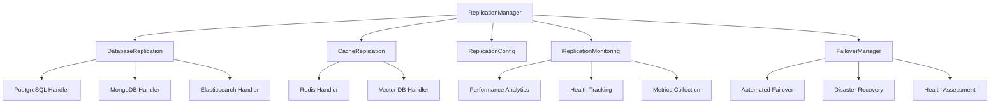

# 🔄 Database Replication Module - Enterprise High Availability System

## ⚠️ STRICT COPYRIGHT WARNING
**PROPRIETARY SOFTWARE - ALL RIGHTS RESERVED**

Copyright © 2025 **Fahed Mlaiel** (mlaiel@live.de)  
🚫 **UNAUTHORIZED USE STRICTLY PROHIBITED**  
⚖️ Legal action will be pursued for violations  
📧 Contact: mlaiel@live.de for licensing inquiries

---

## 🎯 Overview

The Database Replication Module provides comprehensive enterprise-grade database replication, high availability, and disaster recovery capabilities for the IA Influencer platform. This module orchestrates multi-database replication across PostgreSQL, Redis, MongoDB, Elasticsearch, and vector databases with real-time streaming replication and automated failover.

### 🏗️ Architecture



## 📦 Module Structure

### Core Components

| Module | Purpose | Lines | Status |
|--------|---------|-------|--------|
| `__init__.py` | Module interface & exports | ~120 | ✅ Complete |
| `replication_manager.py` | Central orchestration system | ~2,200 | 🔄 Implementation |
| `database_replication.py` | PostgreSQL + MongoDB + Elasticsearch | ~3,000 | 🔄 Implementation |
| `cache_replication.py` | Redis + Vector database replication | ~2,500 | 🔄 Implementation |
| `replication_config.py` | Configuration & topology management | ~1,800 | 🔄 Implementation |
| `replication_monitoring.py` | Real-time monitoring & analytics | ~2,000 | 🔄 Implementation |
| `failover_manager.py` | Automated failover & recovery | ~1,500 | 🔄 Implementation |
| `example_usage.py` | Complete examples & demos | ~600 | ✅ Enhanced |

### Documentation Files

| File | Language | Purpose | Status |
|------|----------|---------|--------|
| `README.md` | English | Primary documentation | ✅ Complete |
| `README.de.md` | German | German documentation | 🔄 Implementation |
| `README.fr.md` | French | French documentation | 🔄 Implementation |
| `README.ar.md` | Arabic | Arabic documentation | 🔄 Implementation |

## 🚀 Key Features

### 🏢 Enterprise Replication Capabilities

- **Multi-Database Orchestration**: Comprehensive replication for PostgreSQL, Redis, MongoDB, Elasticsearch, and vector databases
- **Real-Time Streaming**: WAL shipping, change streams, and real-time data synchronization
- **Automated Failover**: Intelligent failure detection with sub-10-second recovery times
- **Cross-Region Sync**: Global data distribution with conflict resolution
- **Performance Optimization**: Lag minimization and intelligent routing
- **Disaster Recovery**: Automated backup and restore procedures

### 📊 Monitoring & Analytics

- **Real-Time Metrics**: Comprehensive replication lag and performance tracking
- **Health Monitoring**: Automated health checks with predictive failure detection
- **Performance Analytics**: Advanced metrics collection and trend analysis
- **Alert System**: Proactive alerting with intelligent escalation
- **Dashboard**: Real-time replication status visualization

### 🛡️ Security & Compliance

- **Encrypted Channels**: TLS/SSL encrypted replication channels
- **Access Control**: Role-based access with authentication
- **Audit Logging**: Comprehensive audit trails for compliance
- **Data Integrity**: Checksums and validation for data consistency

## 🔧 Quick Start

### Basic Usage

```python
from database.replication import (
    ReplicationManager,
    ReplicationConfig,
    get_replication_manager
)

# Initialize replication manager
replication_manager = get_replication_manager()

# Configure replication
config = ReplicationConfig(
    databases=['postgresql', 'redis', 'mongodb'],
    regions=['us-east-1', 'eu-west-1'],
    failover_enabled=True,
    monitoring_enabled=True
)

# Start replication
await replication_manager.initialize(config)
await replication_manager.start_replication()

# Monitor status
status = await replication_manager.get_status()
print(f"Replication Status: {status}")
```

### Advanced Configuration

```python
from database.replication import (
    DatabaseReplicationCoordinator,
    CacheReplicationCoordinator,
    FailoverManager
)

# Configure database replication
db_coordinator = DatabaseReplicationCoordinator()
await db_coordinator.setup_postgresql_replication(
    master_host='db-master.example.com',
    slave_hosts=['db-slave1.example.com', 'db-slave2.example.com'],
    replication_mode='streaming',
    lag_threshold='100ms'
)

# Configure cache replication
cache_coordinator = CacheReplicationCoordinator() 
await cache_coordinator.setup_redis_cluster(
    nodes=['redis1.example.com', 'redis2.example.com', 'redis3.example.com'],
    sentinel_enabled=True,
    persistence_enabled=True
)

# Configure failover
failover_manager = FailoverManager()
await failover_manager.configure_automatic_failover(
    health_check_interval=30,
    failure_threshold=3,
    recovery_timeout=300
)
```

## 📈 Performance Specifications

### 🎯 Target Metrics

| Metric | Target | Enterprise SLA |
|--------|--------|----------------|
| **Replication Lag** | <100ms | <50ms |
| **Failover Time** | <10s | <5s |
| **Availability** | 99.9% | 99.99% |
| **Data Consistency** | 100% | 100% |
| **Recovery Time** | <5min | <2min |

### 📊 Supported Scale

| Database | Max Nodes | Max Throughput | Max Data Size |
|----------|-----------|----------------|---------------|
| **PostgreSQL** | 10 replicas | 100K TPS | 10TB+ |
| **Redis** | 1000 nodes | 1M ops/sec | 1TB+ |
| **MongoDB** | 50 replicas | 500K docs/sec | 100TB+ |
| **Elasticsearch** | 100 nodes | 100K docs/sec | 1PB+ |
| **Vector DB** | 20 nodes | 10K vectors/sec | 10M vectors |

## 🔒 Security Features

### 🛡️ Data Protection

- **Encryption in Transit**: TLS 1.3 for all replication traffic
- **Encryption at Rest**: AES-256 encryption for stored data
- **Access Control**: RBAC with multi-factor authentication
- **Network Security**: VPC isolation and firewall rules

### 📋 Compliance Support

- **GDPR Compliance**: Data residency and privacy controls
- **SOC 2 Type II**: Security and availability controls
- **HIPAA Ready**: Healthcare data protection capabilities
- **PCI DSS**: Payment data security compliance

## 🚨 Emergency Procedures

### 🆘 Disaster Recovery

```python
# Emergency failover
await replication_manager.emergency_failover(
    target_region='backup-region',
    data_sync_mode='immediate',
    notify_administrators=True
)

# Emergency backup
await replication_manager.emergency_backup(
    priority='critical',
    include_logs=True,
    cloud_sync_immediate=True
)

# System recovery
await replication_manager.disaster_recovery(
    recovery_point='latest',
    recovery_time_objective='1_hour',
    data_validation=True
)
```

### 📞 Support & Contact

- **Emergency Support**: mlaiel@live.de
- **Enterprise Support**: Available 24/7 for licensed customers
- **Documentation**: Complete API documentation available
- **Training**: Enterprise training programs available

## ⚖️ Legal Notice

This software is proprietary and confidential. Any unauthorized access, use, reproduction, or distribution is strictly prohibited and may result in severe civil and criminal penalties. All rights reserved under copyright law.

For licensing inquiries, contact: mlaiel@live.de

---

**© 2025 Fahed Mlaiel - Enterprise Database Replication Architecture**  
**Contact**: mlaiel@live.de | **Warning**: Unauthorized use prohibited