# 🏗️ Ainflue Platform Architecture Documentation

## Overview

The Ainflue AI Platform is a comprehensive microservices-based system designed for AI-powered content protection, monetization, and analytics. This document provides a complete architectural overview for developers.

## System Architecture

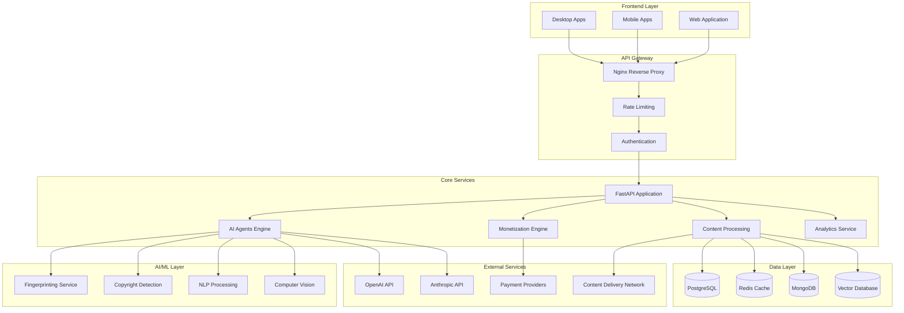

## Component Architecture

### 1. API Gateway Layer

#### Nginx Reverse Proxy
- **Purpose**: Load balancing, SSL termination, static file serving
- **Configuration**: `/nginx/nginx.conf`
- **Features**:
  - SSL/TLS termination
  - Load balancing across API instances
  - Static file caching
  - Request routing

#### Rate Limiting
- **Implementation**: Redis-based sliding window
- **Limits**: Configurable per user tier
- **Monitoring**: Real-time rate limit metrics

#### Authentication
- **Methods**: API Key, JWT, OAuth2
- **Implementation**: FastAPI middleware
- **Security**: bcrypt hashing, JWT signing

### 2. Core Services

#### FastAPI Application
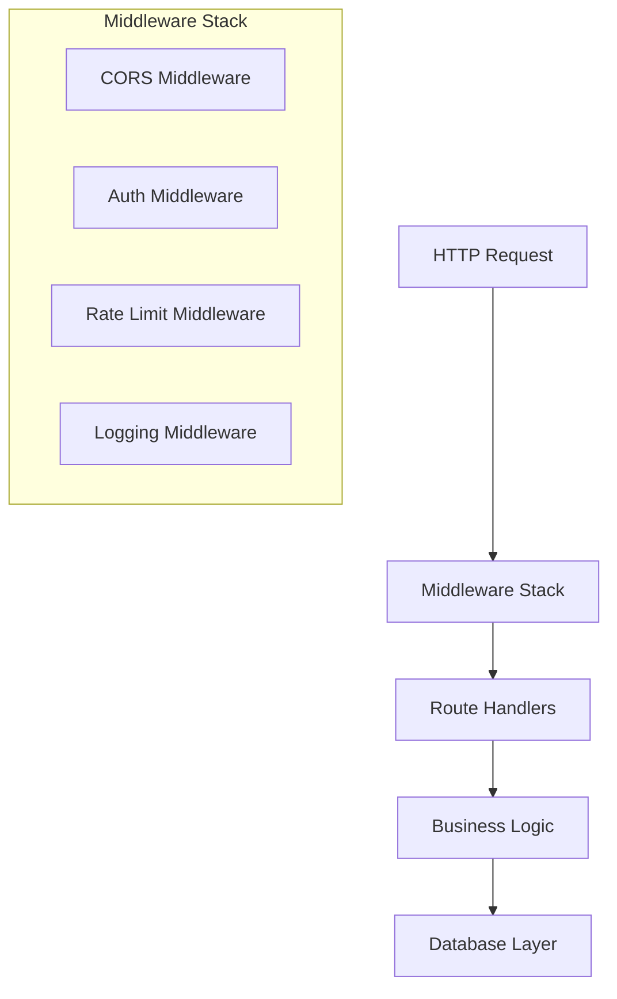

**Key Components**:
- `api/asgi.py` - Application factory
- `api/routes/` - Route handlers
- `core/middleware/` - Custom middleware
- `core/dependencies/` - Dependency injection

#### AI Agents Engine
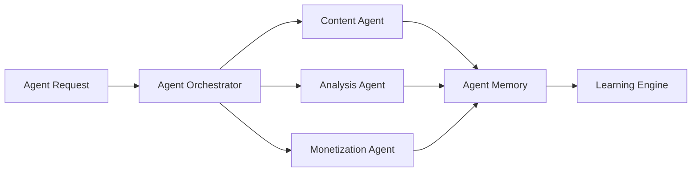

**Architecture**:
- **Base Agent**: Common functionality and interface
- **Specialized Agents**: Domain-specific intelligence
- **Memory System**: Conversation and learning memory
- **Tool Registry**: Reusable agent tools

### 3. Data Architecture

#### Database Design
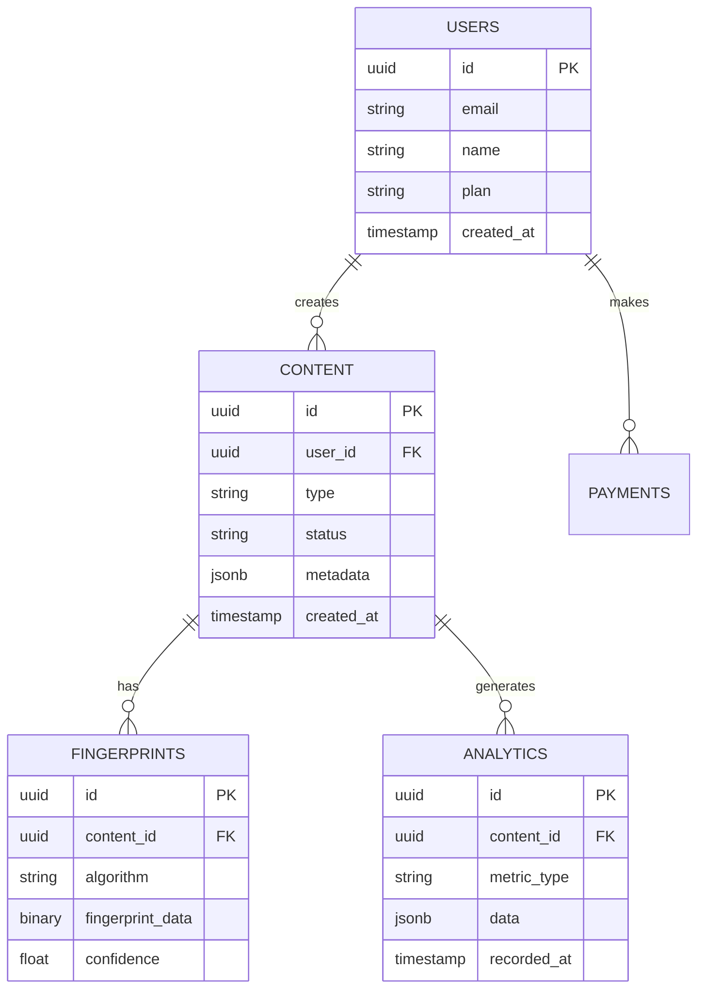

#### Caching Strategy
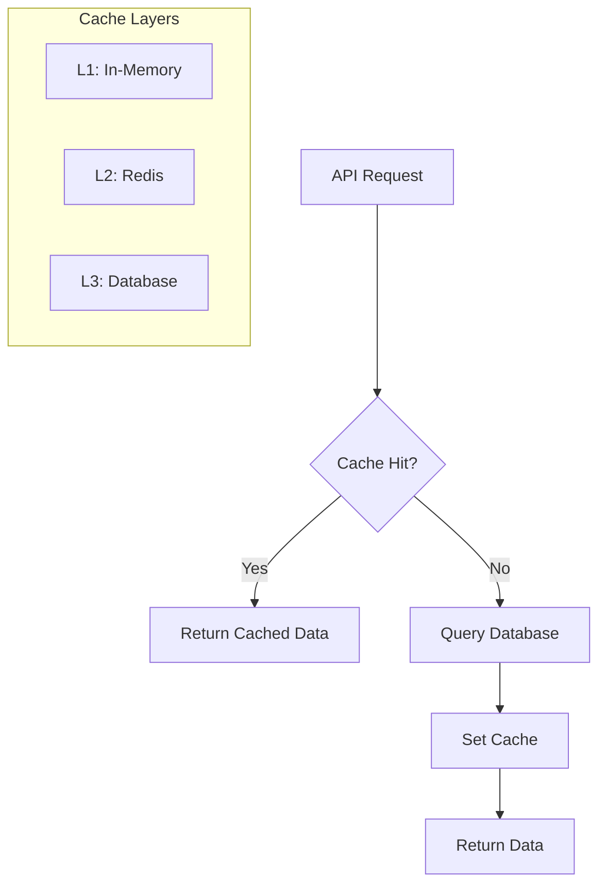

**Cache Layers**:
- **L1 Cache**: In-memory application cache
- **L2 Cache**: Redis distributed cache
- **L3 Cache**: Database query optimization

### 4. AI/ML Pipeline

#### Content Processing Pipeline
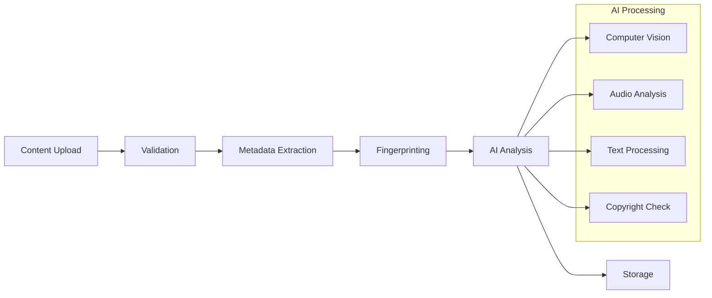

#### AI Model Integration
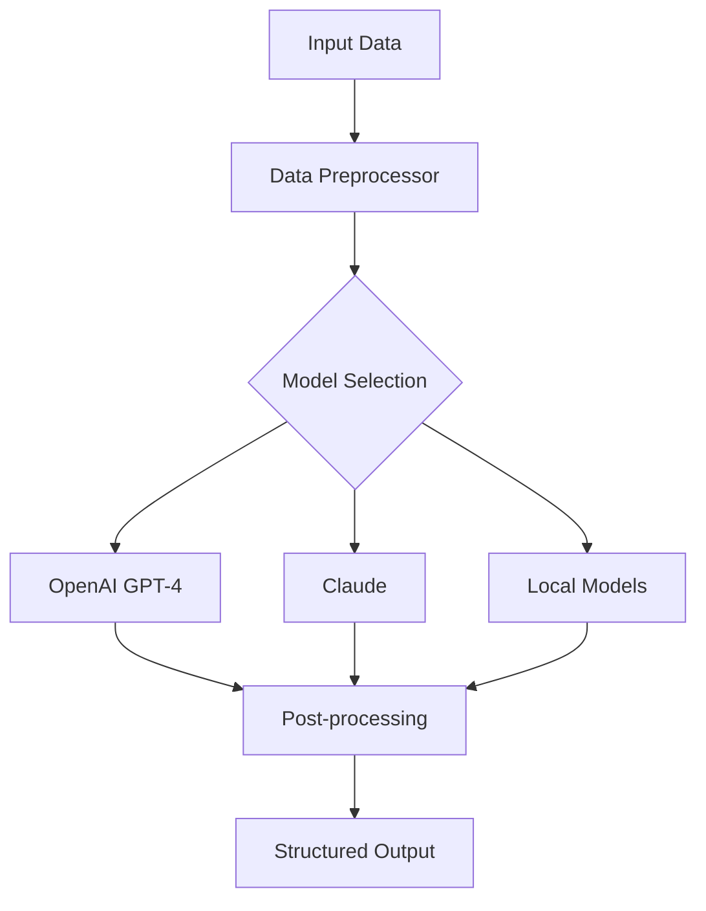

## Development Architecture

### Development Environment
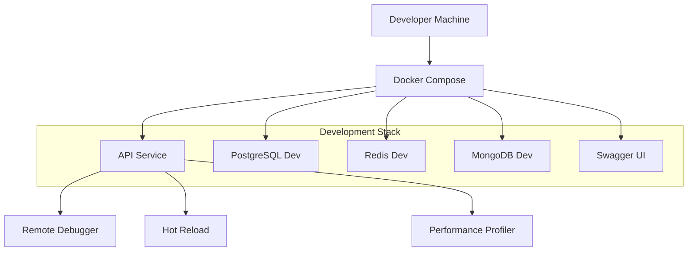

### CI/CD Pipeline
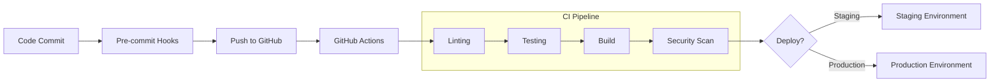

## Deployment Architecture

### Container Architecture
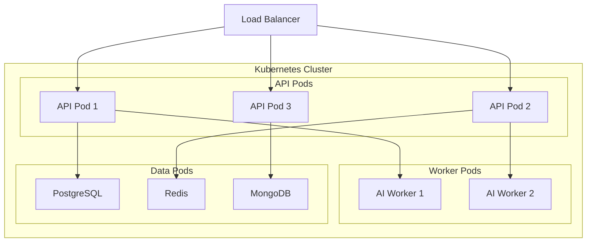

### Monitoring Architecture
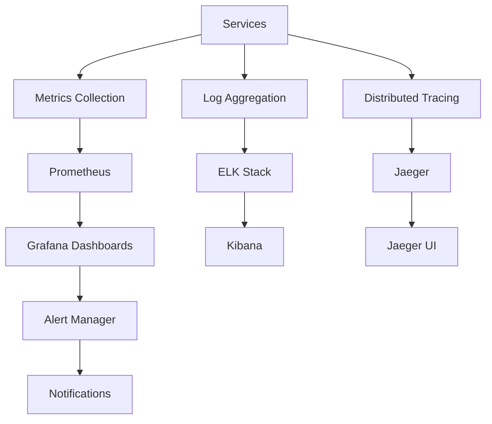

## Security Architecture

### Authentication Flow
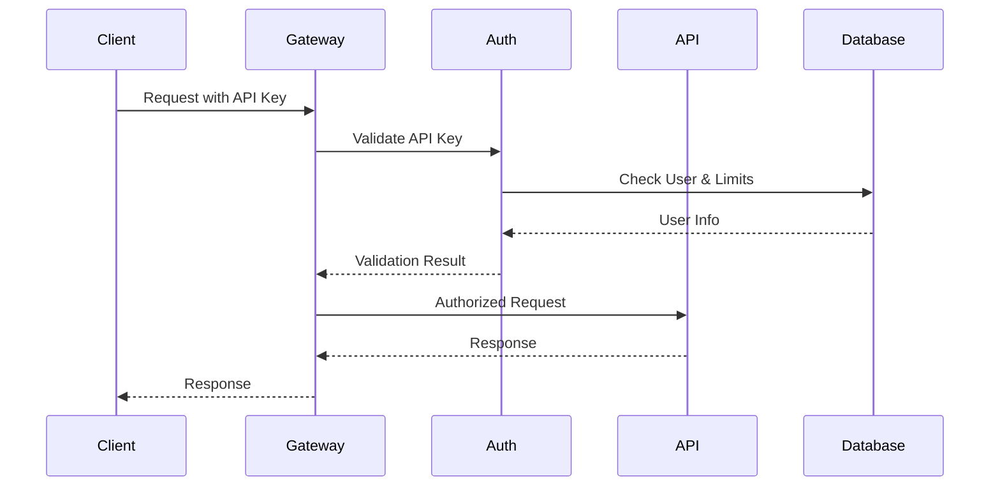

### Data Security
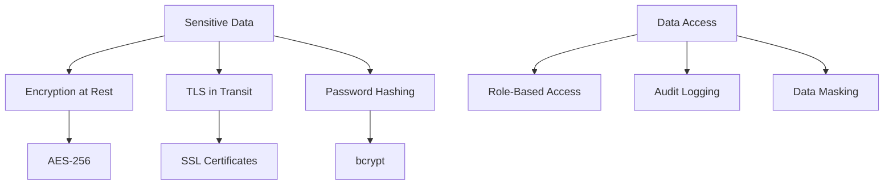

## Performance Architecture

### Scaling Strategy
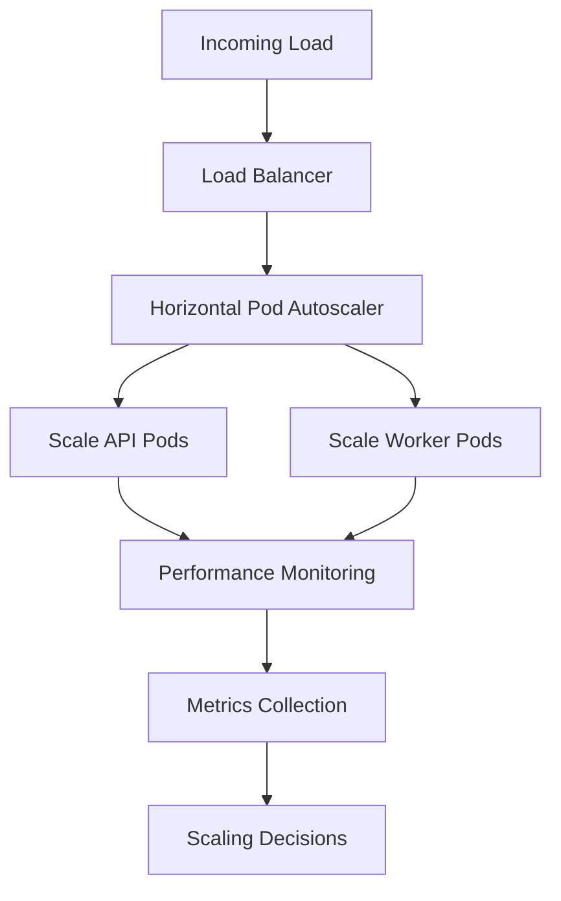

### Caching Architecture
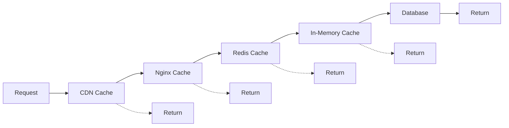

## API Architecture

### RESTful API Design
```
/api/v1/
├── auth/
│   ├── login
│   ├── logout
│   ├── refresh
│   └── validate
├── content/
│   ├── upload
│   ├── analyze
│   ├── fingerprint
│   └── {id}/
├── agents/
│   ├── {agent_name}/chat
│   ├── {agent_name}/info
│   └── list
├── monetization/
│   ├── payments/
│   ├── analytics/
│   └── subscriptions/
└── analytics/
    ├── metrics/
    ├── reports/
    └── dashboards/
```

### GraphQL Schema
```graphql
type Query {
  user: User
  content(id: ID!): Content
  analytics(filter: AnalyticsFilter): Analytics
}

type Mutation {
  uploadContent(input: ContentInput!): Content
  createPayment(input: PaymentInput!): Payment
  chatWithAgent(agent: String!, message: String!): AgentResponse
}

type Subscription {
  contentProcessed(userId: ID!): Content
  realTimeMetrics: Metrics
}
```

## Integration Architecture

### Third-Party Integrations
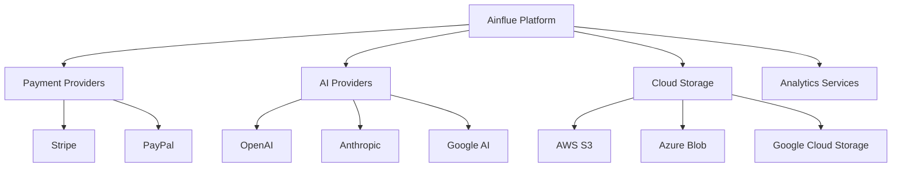

### SDK Architecture
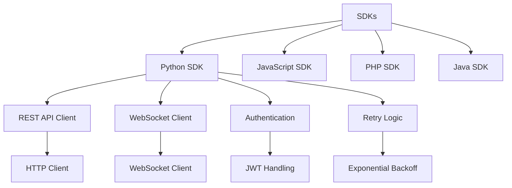

## Development Workflow

### Git Workflow


### Testing Strategy
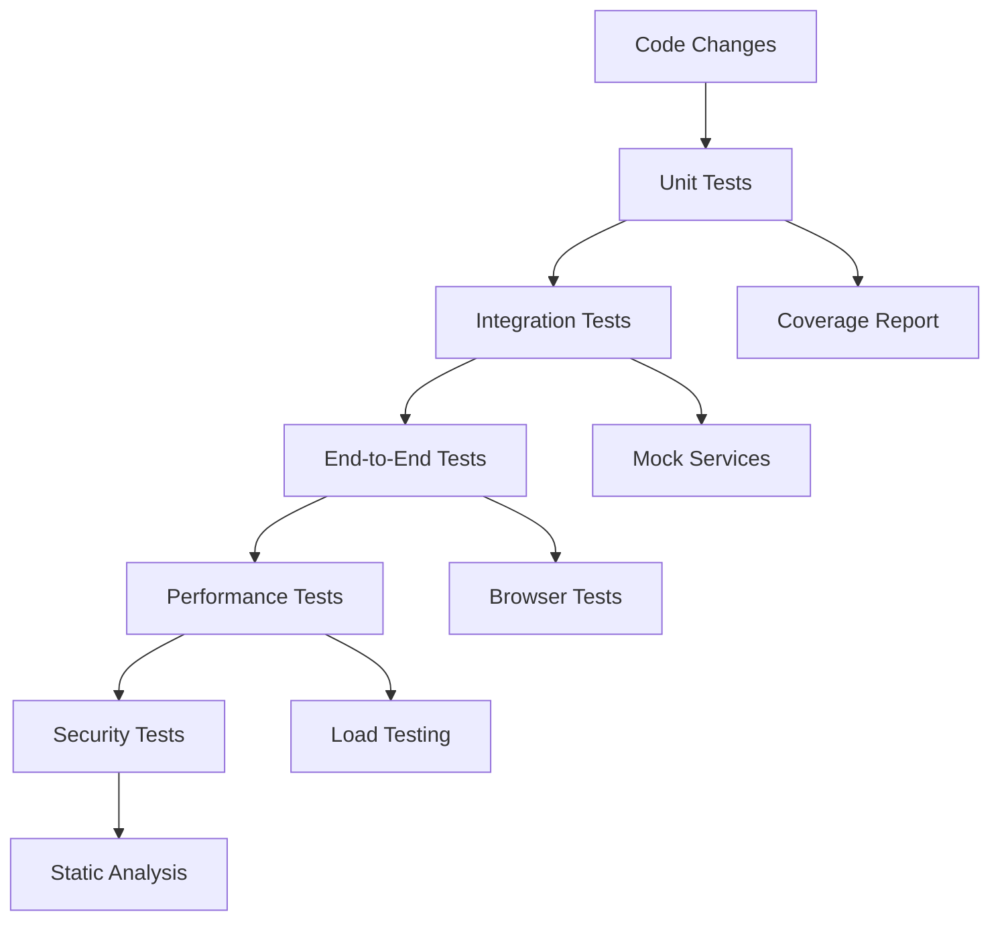

## Configuration Management

### Environment Configuration
```yaml
# Development
debug: true
database:
  host: postgres-dev
  port: 5433
ai_providers:
  openai:
    api_key: ${OPENAI_API_KEY}
  anthropic:
    api_key: ${ANTHROPIC_API_KEY}

# Production
debug: false
database:
  host: postgres-prod
  port: 5432
  ssl: true
monitoring:
  enabled: true
  prometheus:
    endpoint: https://prometheus.ainflue.com
```

### Feature Flags
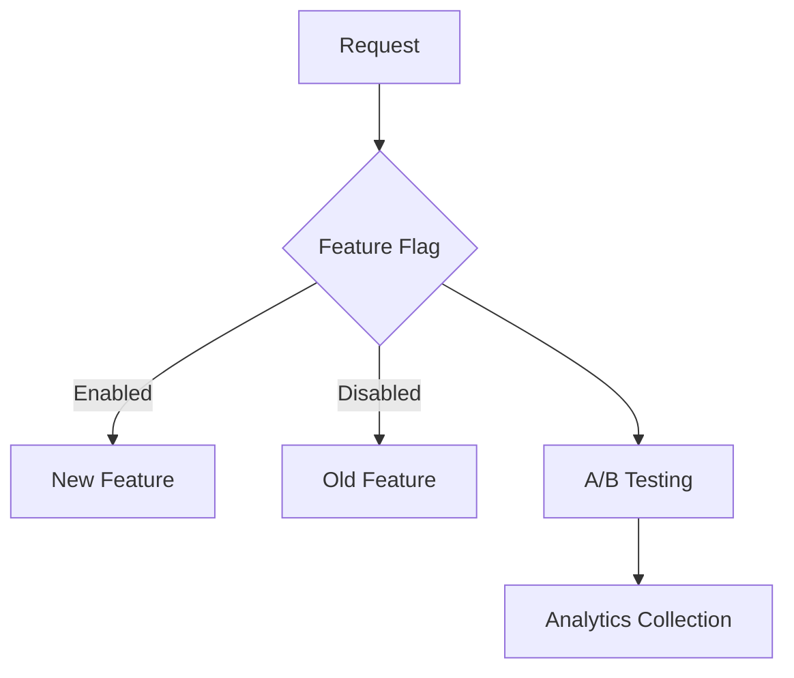

## Troubleshooting Guide

### Common Issues

#### High Latency
```mermaid
graph TD
    LATENCY[High Latency] --> CHECK_DB[Check Database]
    LATENCY --> CHECK_CACHE[Check Cache Hit Rate]
    LATENCY --> CHECK_AI[Check AI API Response Time]
    
    CHECK_DB --> QUERY_OPT[Query Optimization]
    CHECK_CACHE --> CACHE_WARM[Cache Warming]
    CHECK_AI --> API_TIMEOUT[Adjust Timeouts]
```

#### Memory Issues
```mermaid
graph TD
    MEMORY[Memory Issues] --> PROFILE[Memory Profiling]
    PROFILE --> LEAKS[Memory Leaks]
    PROFILE --> CACHE_SIZE[Cache Size]
    PROFILE --> MODEL_SIZE[AI Model Size]
    
    LEAKS --> FIX_LEAKS[Fix Memory Leaks]
    CACHE_SIZE --> TUNE_CACHE[Tune Cache Settings]
    MODEL_SIZE --> MODEL_OPT[Model Optimization]
```

### Monitoring Dashboards

#### System Health Dashboard
- CPU/Memory usage across all services
- Request rate and response times
- Error rates and types
- Database performance metrics

#### Business Metrics Dashboard
- User registrations and activity
- Content upload and processing rates
- Revenue and payment metrics
- AI agent usage statistics

## Future Architecture Considerations

### Scalability Roadmap
1. **Phase 1**: Microservices optimization
2. **Phase 2**: Multi-region deployment
3. **Phase 3**: Edge computing integration
4. **Phase 4**: Serverless migration

### Technology Evolution
- **AI/ML**: Integration of new models and capabilities
- **Storage**: Object storage and CDN optimization
- **Compute**: Serverless and edge computing
- **Monitoring**: Advanced observability and AIOps

---

**Document Version**: 1.0  
**Last Updated**: January 2025  
**Maintained By**: Fahed Mlaiel (mlaiel@live.de)