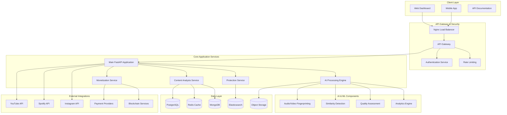

# 🧑‍💻 Ainflue Platform - Comprehensive Developer Guide

**Author:** Fahed Mlaiel (mlaiel@live.de)  
**Platform Version:** 2.0.0  
**Last Updated:** January 2025  
**Copyright:** © 2025 Fahed Mlaiel. All rights reserved.

---

## 📚 Table of Contents

1. [**🏗️ Architecture Overview**](#-architecture-overview)
2. [**⚙️ Setup Instructions**](#️-setup-instructions)
3. [**📋 Coding Standards**](#-coding-standards)
4. [**🔄 Git Workflow**](#-git-workflow)
5. [**🐛 Debugging Guide**](#-debugging-guide)
6. [**🧪 Testing Guidelines**](#-testing-guidelines)
7. [**📖 Additional Resources**](#-additional-resources)

---

## 🏗️ Architecture Overview

### High-Level Architecture

Ainflue is built as a modern microservices-based platform with the following core components:



### System Architecture Principles

1. **Microservices Design**: Loosely coupled, independently deployable services
2. **Event-Driven Architecture**: Asynchronous communication via message queues
3. **Domain-Driven Design**: Clear boundaries between business domains
4. **CQRS Pattern**: Command Query Responsibility Segregation for optimal performance
5. **Hexagonal Architecture**: Clean separation of business logic from infrastructure

### Key Architectural Components

#### 1. API Layer
- **FastAPI Framework**: Modern, fast web framework with automatic API documentation
- **Pydantic Models**: Type-safe request/response validation
- **OAuth2 + JWT**: Secure authentication and authorization
- **Rate Limiting**: Protection against abuse and DDoS attacks

#### 2. Business Logic Layer
- **Content Analysis Engine**: Multi-modal content processing (audio, video, images)
- **Protection Engine**: Copyright protection and piracy detection
- **Monetization Engine**: Revenue optimization and distribution
- **AI Orchestrator**: Coordinating AI agents and models

#### 3. Data Persistence Layer
- **PostgreSQL**: Primary relational database for structured data
- **MongoDB**: Document storage for flexible schema requirements
- **Redis**: High-performance caching and session management
- **Elasticsearch**: Full-text search and analytics

#### 4. AI/ML Infrastructure
- **TensorFlow/PyTorch**: Deep learning model training and inference
- **FAISS**: Vector similarity search for content fingerprinting
- **Librosa**: Audio processing and feature extraction
- **OpenCV**: Computer vision and image processing

---

## ⚙️ Setup Instructions

### Prerequisites

#### Required Software
- **Python 3.12+** (with pip package manager)
- **Node.js 18+** (for frontend development)
- **Docker & Docker Compose** (for containerization)
- **Git** (version control)
- **PostgreSQL 15+** (primary database)
- **Redis 7+** (caching layer)
- **MongoDB 7+** (document storage)

#### Development Tools
- **IDE**: VS Code (recommended) or PyCharm
- **API Testing**: Postman or Insomnia
- **Database Tools**: pgAdmin, MongoDB Compass, Redis Insight
- **Version Control**: Git with SSH keys configured

### 1. Environment Setup

#### Clone Repository
```bash
# Clone the repository
git clone https://github.com/Mlaiel/Ainflue.git
cd Ainflue

# Verify repository structure
ls -la
```

#### Python Environment Setup
```bash
# Create virtual environment
python -m venv venv

# Activate virtual environment
# On Windows:
venv\Scripts\activate
# On macOS/Linux:
source venv/bin/activate

# Upgrade pip
pip install --upgrade pip

# Install dependencies
pip install -r requirements.txt
pip install -r requirements-dev.txt  # Development dependencies
```

### 2. Environment Configuration

#### Create Environment Files
```bash
# Copy environment templates
cp .env.development.example .env
cp .env.staging.example .env.staging
cp .env.production.example .env.production
```

#### Configure Development Environment (.env)
```env
# Application Configuration
ENVIRONMENT=development
DEBUG=true
API_HOST=0.0.0.0
API_PORT=8000
SECRET_KEY=your-super-secret-key-min-32-chars

# Database Configuration
POSTGRES_HOST=localhost
POSTGRES_PORT=5432
POSTGRES_USER=ainflue_dev
POSTGRES_PASSWORD=your-secure-password
POSTGRES_DB=ainflue_development

# Redis Configuration
REDIS_HOST=localhost
REDIS_PORT=6379
REDIS_PASSWORD=your-redis-password

# MongoDB Configuration
MONGODB_HOST=localhost
MONGODB_PORT=27017
MONGODB_USER=ainflue_dev
MONGODB_PASSWORD=your-mongo-password
MONGODB_DB=ainflue_development

# AI/ML Configuration
OPENAI_API_KEY=your-openai-api-key
HUGGINGFACE_API_KEY=your-huggingface-key

# External API Keys
YOUTUBE_API_KEY=your-youtube-api-key
SPOTIFY_CLIENT_ID=your-spotify-client-id
SPOTIFY_CLIENT_SECRET=your-spotify-client-secret
```

### 3. Database Setup

#### Using Docker (Recommended for Development)
```bash
# Start all databases
docker-compose -f docker-compose.yml up -d postgres redis mongodb

# Verify containers are running
docker ps
```

#### Manual Installation
```bash
# PostgreSQL setup
sudo systemctl start postgresql
sudo -u postgres createuser ainflue_dev
sudo -u postgres createdb ainflue_development
sudo -u postgres psql -c "ALTER USER ainflue_dev PASSWORD 'your-secure-password';"

# Redis setup
sudo systemctl start redis-server

# MongoDB setup
sudo systemctl start mongod
```

### 4. Database Initialization

#### Run Migrations
```bash
# Initialize Alembic (if first time)
alembic upgrade head

# Create initial data
python scripts/init_database.py

# Verify database setup
python scripts/verify_setup.py
```

### 5. Development Server

#### Start the Application
```bash
# Start the FastAPI development server
uvicorn api.asgi:app --host 0.0.0.0 --port 8000 --reload

# Alternative using Python module
python -m uvicorn api.asgi:app --host 0.0.0.0 --port 8000 --reload

# With specific workers (production-like)
gunicorn api.asgi:app -w 4 -k uvicorn.workers.UvicornWorker --bind 0.0.0.0:8000
```

#### Verify Installation
```bash
# Check API health
curl http://localhost:8000/health

# Access API documentation
open http://localhost:8000/docs  # Swagger UI
open http://localhost:8000/redoc # ReDoc
```

### 6. Development Tools Setup

#### Pre-commit Hooks
```bash
# Install pre-commit
pip install pre-commit

# Install hooks
pre-commit install

# Run hooks manually
pre-commit run --all-files
```

#### IDE Configuration (VS Code)

Create `.vscode/settings.json`:
```json
{
    "python.defaultInterpreterPath": "./venv/bin/python",
    "python.linting.enabled": true,
    "python.linting.pylintEnabled": true,
    "python.linting.flake8Enabled": true,
    "python.formatting.provider": "black",
    "python.sortImports.args": ["--profile", "black"],
    "editor.formatOnSave": true,
    "editor.codeActionsOnSave": {
        "source.organizeImports": true
    }
}
```

Create `.vscode/launch.json`:
```json
{
    "version": "0.2.0",
    "configurations": [
        {
            "name": "FastAPI Development",
            "type": "python",
            "request": "launch",
            "module": "uvicorn",
            "args": [
                "api.asgi:app",
                "--host", "0.0.0.0",
                "--port", "8000",
                "--reload"
            ],
            "console": "integratedTerminal",
            "envFile": "${workspaceFolder}/.env"
        }
    ]
}
```

---

## 📋 Coding Standards

### Python Code Standards

#### 1. Code Style
We follow **PEP 8** with some specific modifications:

```python
# Line length: 88 characters (Black default)
# String quotes: Double quotes preferred
# Import organization: isort with Black profile

# Example of well-formatted code:
from typing import Dict, List, Optional, Union
import asyncio
from datetime import datetime

from fastapi import APIRouter, Depends, HTTPException, status
from pydantic import BaseModel, Field
from sqlalchemy.orm import Session

from core.database import get_db
from core.models import User
from core.schemas import UserCreate, UserResponse
from core.security import get_current_user
```

#### 2. Type Hints
**Mandatory** for all function parameters and return types:

```python
from typing import Dict, List, Optional, Union, Any

async def process_content(
    content_id: str,
    user_id: str,
    options: Dict[str, Any],
    db: Session = Depends(get_db)
) -> Dict[str, Union[str, int, bool]]:
    """Process content with comprehensive type hints."""
    pass
```

#### 3. Docstrings
Use **Google Style** docstrings for all public functions and classes:

```python
def analyze_audio_fingerprint(
    audio_path: str,
    sample_rate: int = 22050,
    n_fft: int = 2048
) -> np.ndarray:
    """Extract audio fingerprint for similarity detection.
    
    Args:
        audio_path: Path to the audio file to analyze
        sample_rate: Target sample rate for analysis
        n_fft: FFT window size for spectral analysis
    
    Returns:
        Numpy array containing the audio fingerprint features
        
    Raises:
        FileNotFoundError: If audio file doesn't exist
        ValueError: If audio file format is unsupported
        
    Example:
        >>> fingerprint = analyze_audio_fingerprint("song.mp3")
        >>> print(fingerprint.shape)
        (128,)
    """
    pass
```

#### 4. Error Handling
Implement comprehensive error handling with proper logging:

```python
import logging
from typing import Optional

logger = logging.getLogger(__name__)

async def safe_api_call(url: str, timeout: int = 30) -> Optional[Dict]:
    """Make API call with proper error handling."""
    try:
        async with httpx.AsyncClient(timeout=timeout) as client:
            response = await client.get(url)
            response.raise_for_status()
            return response.json()
            
    except httpx.TimeoutException:
        logger.error(f"Timeout calling API: {url}")
        raise HTTPException(
            status_code=status.HTTP_408_REQUEST_TIMEOUT,
            detail="External API timeout"
        )
    except httpx.HTTPStatusError as e:
        logger.error(f"HTTP error calling API: {url}, status: {e.response.status_code}")
        raise HTTPException(
            status_code=status.HTTP_502_BAD_GATEWAY,
            detail="External API error"
        )
    except Exception as e:
        logger.exception(f"Unexpected error calling API: {url}")
        raise HTTPException(
            status_code=status.HTTP_500_INTERNAL_SERVER_ERROR,
            detail="Internal server error"
        )
```

#### 5. Async/Await Pattern
Use async/await for all I/O operations:

```python
import asyncio
from typing import List

async def process_multiple_contents(content_ids: List[str]) -> List[Dict]:
    """Process multiple contents concurrently."""
    tasks = [process_single_content(content_id) for content_id in content_ids]
    results = await asyncio.gather(*tasks, return_exceptions=True)
    
    # Handle results and exceptions
    processed_results = []
    for i, result in enumerate(results):
        if isinstance(result, Exception):
            logger.error(f"Failed to process content {content_ids[i]}: {result}")
            continue
        processed_results.append(result)
    
    return processed_results
```

### Code Organization

#### 1. Project Structure
```
ainflue/
├── api/                    # FastAPI application
│   ├── routers/           # API route definitions
│   ├── middleware/        # Custom middleware
│   └── asgi.py           # ASGI application
├── core/                  # Core business logic
│   ├── models/           # Database models
│   ├── schemas/          # Pydantic schemas
│   ├── services/         # Business logic services
│   └── utils/            # Utility functions
├── ai_engine/            # AI/ML components
│   ├── models/           # ML model definitions
│   ├── training/         # Model training scripts
│   └── inference/        # Inference pipelines
├── database/             # Database related code
│   ├── migrations/       # Alembic migrations
│   └── repositories/     # Data access layer
├── config/               # Configuration management
├── tests/                # Test suites
└── docs/                 # Documentation
```

#### 2. Naming Conventions

| Type | Convention | Example |
|------|------------|---------|
| **Classes** | PascalCase | `ContentAnalyzer`, `UserService` |
| **Functions/Methods** | snake_case | `process_audio`, `get_user_by_id` |
| **Variables** | snake_case | `user_id`, `audio_path` |
| **Constants** | UPPER_SNAKE_CASE | `MAX_FILE_SIZE`, `DEFAULT_TIMEOUT` |
| **Modules** | snake_case | `content_analyzer.py`, `user_service.py` |
| **Packages** | lowercase | `audio`, `protection`, `monetization` |

#### 3. Import Organization
Use **isort** with Black profile:

```python
# Standard library imports
import asyncio
import logging
from datetime import datetime
from typing import Dict, List, Optional

# Third-party imports
import numpy as np
import pandas as pd
from fastapi import APIRouter, Depends
from pydantic import BaseModel
from sqlalchemy.orm import Session

# Local application imports
from core.database import get_db
from core.models import User, Content
from core.services import ContentService
from .schemas import ContentCreate, ContentResponse
```

### Performance Guidelines

#### 1. Database Queries
```python
# Use async database operations
async def get_user_contents(user_id: str, db: AsyncSession) -> List[Content]:
    """Efficiently fetch user contents with minimal queries."""
    query = select(Content).where(Content.user_id == user_id).options(
        selectinload(Content.protection_settings),
        selectinload(Content.analytics)
    )
    result = await db.execute(query)
    return result.scalars().all()

# Use pagination for large datasets
async def get_paginated_contents(
    page: int = 1, 
    size: int = 20,
    db: AsyncSession = Depends(get_db)
) -> Dict[str, Any]:
    """Get paginated content list."""
    offset = (page - 1) * size
    
    # Count total items
    count_query = select(func.count(Content.id))
    total = await db.scalar(count_query)
    
    # Get page items
    query = select(Content).offset(offset).limit(size)
    contents = await db.scalars(query)
    
    return {
        "items": contents,
        "total": total,
        "page": page,
        "pages": (total + size - 1) // size
    }
```

#### 2. Caching Strategy
```python
from functools import wraps
import redis.asyncio as redis

async def cached_response(key: str, ttl: int = 300):
    """Decorator for caching API responses."""
    def decorator(func):
        @wraps(func)
        async def wrapper(*args, **kwargs):
            # Try to get from cache
            cached = await redis_client.get(key)
            if cached:
                return json.loads(cached)
            
            # Execute function and cache result
            result = await func(*args, **kwargs)
            await redis_client.setex(key, ttl, json.dumps(result))
            
            return result
        return wrapper
    return decorator

@cached_response(key="user_analytics_{user_id}", ttl=600)
async def get_user_analytics(user_id: str) -> Dict[str, Any]:
    """Get cached user analytics."""
    # Expensive analytics computation
    pass
```

---

## 🔄 Git Workflow

### Branching Strategy

We use **Git Flow** with the following branch structure:

```
main                 # Production-ready code
├── develop         # Integration branch for features
├── feature/*       # Feature development branches
├── release/*       # Release preparation branches
├── hotfix/*        # Critical bug fixes
└── bugfix/*        # Non-critical bug fixes
```

#### Branch Naming Conventions

| Branch Type | Naming Pattern | Example |
|-------------|----------------|---------|
| **Feature** | `feature/description` | `feature/audio-fingerprinting` |
| **Bugfix** | `bugfix/issue-description` | `bugfix/memory-leak-analytics` |
| **Hotfix** | `hotfix/critical-issue` | `hotfix/security-vulnerability` |
| **Release** | `release/version` | `release/2.1.0` |

### Development Workflow

#### 1. Starting New Work
```bash
# Update local repository
git checkout develop
git pull origin develop

# Create feature branch
git checkout -b feature/new-audio-processing

# Verify branch
git branch --show-current
```

#### 2. Development Process
```bash
# Make changes and commit regularly
git add .
git commit -m "feat: implement basic audio fingerprinting

- Add librosa-based feature extraction
- Implement MFCC computation for audio analysis
- Add unit tests for fingerprint generation

Closes #123"

# Push branch regularly
git push -u origin feature/new-audio-processing
```

#### 3. Commit Message Standards

We follow **Conventional Commits** specification:

```
<type>[optional scope]: <description>

[optional body]

[optional footer(s)]
```

**Commit Types:**
- `feat`: New feature
- `fix`: Bug fix
- `docs`: Documentation changes
- `style`: Code style changes (formatting, etc.)
- `refactor`: Code refactoring
- `perf`: Performance improvements
- `test`: Adding or updating tests
- `chore`: Maintenance tasks

**Examples:**
```bash
# Feature addition
git commit -m "feat(audio): add advanced fingerprinting algorithm

Implement perceptual hash-based audio fingerprinting using
chromagram and spectral features for improved accuracy.

- Supports multiple audio formats (MP3, WAV, FLAC)
- 95% accuracy on test dataset
- Performance optimized with NumPy vectorization

Closes #456"

# Bug fix
git commit -m "fix(api): resolve memory leak in content processing

Fixed memory accumulation in audio analysis pipeline by
properly disposing of librosa resources after processing.

Fixes #789"

# Documentation
git commit -m "docs: update API documentation for new endpoints

- Add examples for audio fingerprinting API
- Update rate limiting documentation
- Fix typos in developer guide"
```

#### 4. Pull Request Process

##### Creating Pull Requests
```bash
# Before creating PR, ensure code quality
pre-commit run --all-files
python -m pytest tests/
black .
isort .

# Push final changes
git push origin feature/new-audio-processing
```

##### PR Description Template
```markdown
## Description
Brief description of changes made.

## Type of Change
- [ ] Bug fix (non-breaking change which fixes an issue)
- [ ] New feature (non-breaking change which adds functionality)
- [ ] Breaking change (fix or feature that would cause existing functionality to not work as expected)
- [ ] Documentation update

## Testing
- [ ] Unit tests pass
- [ ] Integration tests pass
- [ ] Manual testing completed

## Checklist
- [ ] Code follows the style guidelines
- [ ] Self-review completed
- [ ] Code is commented, particularly in hard-to-understand areas
- [ ] Corresponding changes made to documentation
- [ ] Changes generate no new warnings
- [ ] Unit tests added that prove fix is effective or feature works
- [ ] New and existing tests pass locally

## Screenshots (if applicable)
[Add screenshots to help explain your changes]

## Related Issues
Closes #123
Related to #456
```

##### Code Review Guidelines

**For Reviewers:**
- Check code quality and adherence to standards
- Verify test coverage and test quality
- Ensure documentation is updated
- Review performance implications
- Validate security considerations

**Review Checklist:**
```markdown
- [ ] Code is readable and well-documented
- [ ] Tests are comprehensive and meaningful
- [ ] No security vulnerabilities introduced
- [ ] Performance impact is acceptable
- [ ] Breaking changes are justified and documented
- [ ] Error handling is robust
- [ ] Logging is appropriate
```

#### 5. Merging Strategy

```bash
# Merge feature to develop
git checkout develop
git pull origin develop
git merge --no-ff feature/new-audio-processing
git push origin develop

# Clean up feature branch
git branch -d feature/new-audio-processing
git push origin --delete feature/new-audio-processing
```

### Release Process

#### 1. Prepare Release
```bash
# Create release branch from develop
git checkout develop
git pull origin develop
git checkout -b release/2.1.0

# Update version numbers
# Update CHANGELOG.md
# Final testing and bug fixes

git commit -m "chore: prepare release 2.1.0"
git push origin release/2.1.0
```

#### 2. Finalize Release
```bash
# Merge to main
git checkout main
git pull origin main
git merge --no-ff release/2.1.0

# Tag release
git tag -a v2.1.0 -m "Release version 2.1.0"
git push origin main --tags

# Merge back to develop
git checkout develop
git merge --no-ff release/2.1.0
git push origin develop

# Clean up release branch
git branch -d release/2.1.0
git push origin --delete release/2.1.0
```

### Git Configuration

#### 1. Global Git Settings
```bash
# Set user information
git config --global user.name "Your Name"
git config --global user.email "your.email@example.com"

# Set default branch name
git config --global init.defaultBranch main

# Enable helpful settings
git config --global core.autocrlf input  # On Linux/Mac
git config --global core.autocrlf true   # On Windows
git config --global pull.rebase false
git config --global push.default simple
```

#### 2. Project-Specific Git Hooks

Create `.githooks/pre-commit`:
```bash
#!/bin/bash
# Run code quality checks before commit

echo "Running pre-commit checks..."

# Run tests
python -m pytest tests/ --quiet
if [ $? -ne 0 ]; then
    echo "Tests failed. Commit aborted."
    exit 1
fi

# Run code formatting
black --check .
if [ $? -ne 0 ]; then
    echo "Code formatting issues found. Run 'black .' to fix."
    exit 1
fi

# Run import sorting
isort --check-only .
if [ $? -ne 0 ]; then
    echo "Import sorting issues found. Run 'isort .' to fix."
    exit 1
fi

echo "All checks passed!"
```

---

## 🐛 Debugging Guide

### Development Environment Debugging

#### 1. Application Debugging

##### Using Built-in Python Debugger
```python
import pdb

def complex_function(data):
    """Function with debugging capabilities."""
    # Set breakpoint
    pdb.set_trace()
    
    # Process data
    result = process_data(data)
    
    # Another breakpoint for result inspection
    import ipdb; ipdb.set_trace()  # Enhanced debugger
    
    return result
```

##### VS Code Debugging Configuration
```json
{
    "version": "0.2.0",
    "configurations": [
        {
            "name": "Debug FastAPI",
            "type": "python",
            "request": "launch",
            "module": "uvicorn",
            "args": [
                "api.asgi:app",
                "--host", "0.0.0.0",
                "--port", "8000",
                "--reload"
            ],
            "console": "integratedTerminal",
            "envFile": "${workspaceFolder}/.env",
            "stopOnEntry": false,
            "justMyCode": false
        },
        {
            "name": "Debug Tests",
            "type": "python",
            "request": "launch",
            "module": "pytest",
            "args": [
                "tests/",
                "-v",
                "--tb=short"
            ],
            "console": "integratedTerminal",
            "justMyCode": false
        }
    ]
}
```

#### 2. Database Debugging

##### PostgreSQL Query Debugging
```python
import logging

# Enable SQLAlchemy query logging
logging.basicConfig()
logging.getLogger('sqlalchemy.engine').setLevel(logging.INFO)

# Or in development settings
from sqlalchemy import create_engine

engine = create_engine(
    DATABASE_URL,
    echo=True,  # Log all SQL statements
    echo_pool=True  # Log connection pool events
)
```

##### Database Connection Debugging
```python
async def debug_database_connection():
    """Debug database connectivity issues."""
    try:
        async with get_db() as db:
            # Test basic query
            result = await db.execute(text("SELECT 1"))
            print(f"Database connection successful: {result.scalar()}")
            
            # Test table access
            users_count = await db.scalar(select(func.count(User.id)))
            print(f"Users table accessible, count: {users_count}")
            
    except Exception as e:
        print(f"Database connection failed: {e}")
        import traceback
        traceback.print_exc()
```

#### 3. API Debugging

##### Request/Response Debugging Middleware
```python
import time
import json
from fastapi import Request, Response
from starlette.middleware.base import BaseHTTPMiddleware

class DebugMiddleware(BaseHTTPMiddleware):
    """Middleware for debugging API requests and responses."""
    
    async def dispatch(self, request: Request, call_next):
        # Log request
        start_time = time.time()
        
        # Capture request body
        body = await request.body()
        print(f"Request: {request.method} {request.url}")
        print(f"Headers: {dict(request.headers)}")
        if body:
            print(f"Body: {body.decode()}")
        
        # Process request
        response = await call_next(request)
        
        # Log response
        process_time = time.time() - start_time
        print(f"Response: {response.status_code}")
        print(f"Process time: {process_time:.4f}s")
        
        return response

# Add to FastAPI app
from fastapi import FastAPI
app = FastAPI()
app.add_middleware(DebugMiddleware)
```

##### API Client Debugging
```python
import httpx
import logging

# Enable detailed HTTP logging
logging.basicConfig(level=logging.DEBUG)

async def debug_api_call():
    """Debug external API calls."""
    async with httpx.AsyncClient() as client:
        try:
            response = await client.get(
                "https://api.example.com/data",
                headers={"Authorization": "Bearer token"},
                timeout=30.0
            )
            
            print(f"Status: {response.status_code}")
            print(f"Headers: {response.headers}")
            print(f"Content: {response.text}")
            
            response.raise_for_status()
            return response.json()
            
        except httpx.RequestError as e:
            print(f"Request error: {e}")
        except httpx.HTTPStatusError as e:
            print(f"HTTP error: {e.response.status_code} - {e.response.text}")
```

### Performance Debugging

#### 1. Memory Profiling
```python
import tracemalloc
import functools

def memory_profile(func):
    """Decorator to profile memory usage."""
    @functools.wraps(func)
    async def wrapper(*args, **kwargs):
        tracemalloc.start()
        
        try:
            result = await func(*args, **kwargs)
            
            # Get memory statistics
            current, peak = tracemalloc.get_traced_memory()
            print(f"Memory usage - Current: {current / 1024 / 1024:.2f} MB, "
                  f"Peak: {peak / 1024 / 1024:.2f} MB")
            
            return result
        finally:
            tracemalloc.stop()
    
    return wrapper

@memory_profile
async def memory_intensive_function():
    """Function with memory profiling."""
    # Your code here
    pass
```

#### 2. Performance Profiling
```python
import cProfile
import io
import pstats
from functools import wraps

def profile_performance(func):
    """Decorator to profile function performance."""
    @wraps(func)
    def wrapper(*args, **kwargs):
        profiler = cProfile.Profile()
        profiler.enable()
        
        try:
            result = func(*args, **kwargs)
            return result
        finally:
            profiler.disable()
            
            # Print stats
            stats_buffer = io.StringIO()
            stats = pstats.Stats(profiler, stream=stats_buffer)
            stats.sort_stats('cumulative')
            stats.print_stats(20)  # Top 20 functions
            
            print(stats_buffer.getvalue())
    
    return wrapper
```

### AI/ML Debugging

#### 1. Model Debugging
```python
import torch
import numpy as np

def debug_model_inference(model, input_data):
    """Debug ML model inference issues."""
    print(f"Input shape: {input_data.shape}")
    print(f"Input dtype: {input_data.dtype}")
    print(f"Input range: [{input_data.min():.4f}, {input_data.max():.4f}]")
    
    # Check for NaN or infinite values
    if np.isnan(input_data).any():
        print("WARNING: Input contains NaN values")
    if np.isinf(input_data).any():
        print("WARNING: Input contains infinite values")
    
    # Model inference with error handling
    try:
        with torch.no_grad():
            output = model(torch.from_numpy(input_data))
            
        print(f"Output shape: {output.shape}")
        print(f"Output range: [{output.min():.4f}, {output.max():.4f}]")
        
        return output.numpy()
        
    except Exception as e:
        print(f"Model inference failed: {e}")
        import traceback
        traceback.print_exc()
        return None
```

#### 2. Audio Processing Debugging
```python
import librosa
import matplotlib.pyplot as plt

def debug_audio_processing(audio_path: str):
    """Debug audio processing pipeline."""
    try:
        # Load audio
        audio, sr = librosa.load(audio_path, sr=None)
        print(f"Audio loaded: duration={len(audio)/sr:.2f}s, sample_rate={sr}")
        
        # Check audio quality
        if len(audio) == 0:
            print("ERROR: Empty audio file")
            return None
            
        # Analyze audio characteristics
        rms = librosa.feature.rms(y=audio)[0]
        print(f"RMS energy: mean={np.mean(rms):.4f}, std={np.std(rms):.4f}")
        
        # Extract features for debugging
        mfccs = librosa.feature.mfcc(y=audio, sr=sr, n_mfcc=13)
        print(f"MFCC features shape: {mfccs.shape}")
        
        # Plot for visual debugging
        plt.figure(figsize=(12, 8))
        
        plt.subplot(3, 1, 1)
        plt.plot(audio[:sr*5])  # First 5 seconds
        plt.title("Audio Waveform")
        
        plt.subplot(3, 1, 2)
        librosa.display.specshow(librosa.amplitude_to_db(
            np.abs(librosa.stft(audio[:sr*5]))), sr=sr, x_axis='time', y_axis='hz')
        plt.title("Spectrogram")
        
        plt.subplot(3, 1, 3)
        librosa.display.specshow(mfccs[:, :100], x_axis='time')
        plt.title("MFCC Features")
        
        plt.tight_layout()
        plt.savefig('/tmp/audio_debug.png')
        print("Debug plot saved to /tmp/audio_debug.png")
        
        return {
            'audio': audio,
            'sample_rate': sr,
            'mfccs': mfccs
        }
        
    except Exception as e:
        print(f"Audio processing failed: {e}")
        import traceback
        traceback.print_exc()
        return None
```

### Common Issues and Solutions

#### 1. Import and Module Issues
```python
# Debug import issues
import sys
print("Python path:")
for path in sys.path:
    print(f"  {path}")

# Check module availability
try:
    import librosa
    print(f"Librosa version: {librosa.__version__}")
except ImportError as e:
    print(f"Librosa import failed: {e}")

# Add project root to path if needed
import os
project_root = os.path.dirname(os.path.dirname(os.path.abspath(__file__)))
if project_root not in sys.path:
    sys.path.insert(0, project_root)
```

#### 2. Environment Variable Issues
```python
import os
from dotenv import load_dotenv

def debug_environment():
    """Debug environment configuration issues."""
    load_dotenv()
    
    required_vars = [
        'DATABASE_URL',
        'REDIS_URL',
        'SECRET_KEY',
        'OPENAI_API_KEY'
    ]
    
    print("Environment variables:")
    for var in required_vars:
        value = os.getenv(var)
        if value:
            # Mask sensitive values
            if 'key' in var.lower() or 'secret' in var.lower():
                masked = value[:4] + '*' * (len(value) - 8) + value[-4:]
                print(f"  {var}: {masked}")
            else:
                print(f"  {var}: {value}")
        else:
            print(f"  {var}: NOT SET")
```

#### 3. Docker and Container Issues
```bash
# Debug container connectivity
docker ps  # Check running containers
docker logs ainflue-api  # Check application logs
docker exec -it ainflue-postgres psql -U postgres  # Connect to database

# Debug network connectivity
docker network ls
docker network inspect ainflue_default

# Resource usage debugging
docker stats  # Monitor container resource usage
```

---

## 🧪 Testing Guidelines

### Testing Philosophy

Our testing strategy follows the **Testing Pyramid** approach:
- **Unit Tests (70%)**: Fast, isolated tests for individual components
- **Integration Tests (20%)**: Test component interactions
- **End-to-End Tests (10%)**: Full system workflow testing

### Testing Structure

```
tests/
├── unit/                  # Unit tests
│   ├── api/              # API endpoint tests
│   ├── core/             # Business logic tests
│   ├── ai_engine/        # AI/ML component tests
│   └── utils/            # Utility function tests
├── integration/          # Integration tests
│   ├── database/         # Database integration tests
│   ├── external_apis/    # External API integration tests
│   └── services/         # Service integration tests
├── e2e/                  # End-to-end tests
│   ├── user_workflows/   # Complete user journey tests
│   └── api_workflows/    # API workflow tests
├── fixtures/             # Test data and fixtures
├── factories/            # Test data factories
└── conftest.py          # Pytest configuration
```

### Unit Testing Guidelines

#### 1. Test Structure and Naming
```python
# test_content_analyzer.py
import pytest
from unittest.mock import Mock, patch, AsyncMock
from fastapi.testclient import TestClient

from core.services.content_analyzer import ContentAnalyzer
from core.models import Content, User
from core.exceptions import ContentAnalysisError

class TestContentAnalyzer:
    """Test suite for ContentAnalyzer service."""
    
    @pytest.fixture
    def content_analyzer(self):
        """Create ContentAnalyzer instance for testing."""
        return ContentAnalyzer()
    
    @pytest.fixture
    def sample_content(self):
        """Create sample content for testing."""
        return Content(
            id="test-content-id",
            user_id="test-user-id",
            title="Test Audio",
            file_path="/tmp/test_audio.mp3",
            content_type="audio"
        )
    
    async def test_analyze_audio_content_success(self, content_analyzer, sample_content):
        """Test successful audio content analysis."""
        # Arrange
        expected_result = {
            "genre": "pop",
            "mood": "upbeat",
            "quality_score": 0.85,
            "fingerprint": "abcd1234"
        }
        
        with patch('core.services.content_analyzer.extract_audio_features') as mock_extract:
            mock_extract.return_value = expected_result
            
            # Act
            result = await content_analyzer.analyze_content(sample_content)
            
            # Assert
            assert result["genre"] == "pop"
            assert result["quality_score"] == 0.85
            mock_extract.assert_called_once_with(sample_content.file_path)
    
    async def test_analyze_content_invalid_file(self, content_analyzer):
        """Test content analysis with invalid file."""
        # Arrange
        invalid_content = Content(
            id="test-id",
            file_path="/nonexistent/file.mp3",
            content_type="audio"
        )
        
        # Act & Assert
        with pytest.raises(ContentAnalysisError) as exc_info:
            await content_analyzer.analyze_content(invalid_content)
        
        assert "File not found" in str(exc_info.value)
    
    @pytest.mark.parametrize("content_type,expected_analyzer", [
        ("audio", "AudioAnalyzer"),
        ("video", "VideoAnalyzer"),
        ("image", "ImageAnalyzer"),
    ])
    def test_get_analyzer_by_type(self, content_analyzer, content_type, expected_analyzer):
        """Test analyzer selection by content type."""
        analyzer = content_analyzer._get_analyzer(content_type)
        assert analyzer.__class__.__name__ == expected_analyzer
```

#### 2. FastAPI Testing
```python
# test_api_endpoints.py
import pytest
from fastapi.testclient import TestClient
from sqlalchemy.orm import Session

from api.asgi import app
from core.database import get_db
from core.models import User
from tests.factories import UserFactory

@pytest.fixture
def client():
    """Create test client."""
    return TestClient(app)

@pytest.fixture
def authenticated_client(client, test_user, test_token):
    """Create authenticated test client."""
    client.headers.update({"Authorization": f"Bearer {test_token}"})
    return client

class TestContentAPI:
    """Test content API endpoints."""
    
    def test_upload_content_success(self, authenticated_client, test_audio_file):
        """Test successful content upload."""
        # Arrange
        files = {"file": ("test_audio.mp3", test_audio_file, "audio/mpeg")}
        data = {"title": "Test Audio", "description": "Test description"}
        
        # Act
        response = authenticated_client.post("/api/v1/content/upload", files=files, data=data)
        
        # Assert
        assert response.status_code == 201
        content_data = response.json()
        assert content_data["title"] == "Test Audio"
        assert "id" in content_data
    
    def test_upload_content_unauthorized(self, client, test_audio_file):
        """Test content upload without authentication."""
        files = {"file": ("test_audio.mp3", test_audio_file, "audio/mpeg")}
        
        response = client.post("/api/v1/content/upload", files=files)
        
        assert response.status_code == 401
    
    def test_get_content_analytics(self, authenticated_client, test_content):
        """Test content analytics endpoint."""
        response = authenticated_client.get(f"/api/v1/content/{test_content.id}/analytics")
        
        assert response.status_code == 200
        analytics = response.json()
        assert "views" in analytics
        assert "revenue" in analytics
```

#### 3. Database Testing
```python
# test_repositories.py
import pytest
from sqlalchemy.ext.asyncio import AsyncSession

from database.repositories.content_repository import ContentRepository
from core.models import Content, User
from tests.factories import ContentFactory, UserFactory

@pytest.mark.asyncio
class TestContentRepository:
    """Test ContentRepository database operations."""
    
    async def test_create_content(self, async_db_session: AsyncSession):
        """Test content creation."""
        # Arrange
        user = await UserFactory.create(session=async_db_session)
        content_data = {
            "title": "Test Content",
            "user_id": user.id,
            "content_type": "audio"
        }
        
        repo = ContentRepository(async_db_session)
        
        # Act
        content = await repo.create(content_data)
        
        # Assert
        assert content.id is not None
        assert content.title == "Test Content"
        assert content.user_id == user.id
    
    async def test_get_user_contents(self, async_db_session: AsyncSession):
        """Test retrieving user's contents."""
        # Arrange
        user = await UserFactory.create(session=async_db_session)
        await ContentFactory.create_batch(3, session=async_db_session, user_id=user.id)
        await ContentFactory.create(session=async_db_session)  # Different user
        
        repo = ContentRepository(async_db_session)
        
        # Act
        contents = await repo.get_by_user_id(user.id)
        
        # Assert
        assert len(contents) == 3
        assert all(content.user_id == user.id for content in contents)
```

### Integration Testing

#### 1. Service Integration Tests
```python
# test_content_service_integration.py
import pytest
from unittest.mock import patch

from core.services.content_service import ContentService
from core.services.ai_service import AIService
from core.services.protection_service import ProtectionService

@pytest.mark.integration
class TestContentServiceIntegration:
    """Integration tests for ContentService with dependent services."""
    
    @pytest.fixture
    def content_service(self, async_db_session):
        """Create ContentService with real dependencies."""
        ai_service = AIService()
        protection_service = ProtectionService()
        return ContentService(
            db=async_db_session,
            ai_service=ai_service,
            protection_service=protection_service
        )
    
    async def test_full_content_processing_workflow(self, content_service, test_audio_file):
        """Test complete content processing workflow."""
        # Arrange
        content_data = {
            "title": "Integration Test Audio",
            "file": test_audio_file,
            "user_id": "test-user-id"
        }
        
        # Act
        result = await content_service.process_content(content_data)
        
        # Assert
        assert result["status"] == "completed"
        assert "fingerprint" in result
        assert "analysis" in result
        assert "protection" in result
        
        # Verify database state
        content = await content_service.get_content(result["content_id"])
        assert content.status == "processed"
        assert content.fingerprint is not None
```

#### 2. External API Integration Tests
```python
# test_external_api_integration.py
import pytest
import httpx
from unittest.mock import patch

from integrations.youtube_api import YouTubeAPI
from integrations.spotify_api import SpotifyAPI

@pytest.mark.integration
@pytest.mark.external_api
class TestExternalAPIIntegration:
    """Integration tests for external API connections."""
    
    @pytest.mark.skipif(not os.getenv("YOUTUBE_API_KEY"), reason="YouTube API key not available")
    async def test_youtube_api_search(self):
        """Test YouTube API search functionality."""
        youtube_api = YouTubeAPI()
        
        results = await youtube_api.search_videos("test query", max_results=5)
        
        assert len(results) <= 5
        assert all("video_id" in result for result in results)
    
    async def test_spotify_api_with_mock(self):
        """Test Spotify API with mocked responses."""
        with patch('httpx.AsyncClient.get') as mock_get:
            mock_response = httpx.Response(
                status_code=200,
                json={"tracks": {"items": [{"id": "test-track"}]}}
            )
            mock_get.return_value = mock_response
            
            spotify_api = SpotifyAPI()
            results = await spotify_api.search_tracks("test query")
            
            assert len(results) > 0
            assert results[0]["id"] == "test-track"
```

### End-to-End Testing

#### 1. User Workflow Tests
```python
# test_user_workflows.py
import pytest
from fastapi.testclient import TestClient

@pytest.mark.e2e
class TestUserWorkflows:
    """End-to-end tests for complete user workflows."""
    
    def test_complete_content_protection_workflow(self, client):
        """Test complete workflow from upload to protection monitoring."""
        # 1. User registration
        register_response = client.post("/api/v1/auth/register", json={
            "email": "test@example.com",
            "password": "securepassword123",
            "username": "testuser"
        })
        assert register_response.status_code == 201
        
        # 2. User login
        login_response = client.post("/api/v1/auth/login", json={
            "email": "test@example.com",
            "password": "securepassword123"
        })
        assert login_response.status_code == 200
        token = login_response.json()["access_token"]
        
        # 3. Upload content
        headers = {"Authorization": f"Bearer {token}"}
        with open("tests/fixtures/test_audio.mp3", "rb") as audio_file:
            files = {"file": ("test_audio.mp3", audio_file, "audio/mpeg")}
            upload_response = client.post(
                "/api/v1/content/upload",
                files=files,
                data={"title": "Test Audio"},
                headers=headers
            )
        assert upload_response.status_code == 201
        content_id = upload_response.json()["id"]
        
        # 4. Enable protection
        protection_response = client.post(
            f"/api/v1/content/{content_id}/protection/enable",
            headers=headers
        )
        assert protection_response.status_code == 200
        
        # 5. Verify protection status
        status_response = client.get(
            f"/api/v1/content/{content_id}/protection/status",
            headers=headers
        )
        assert status_response.status_code == 200
        assert status_response.json()["status"] == "active"
```

### Test Data Management

#### 1. Factories
```python
# tests/factories.py
import factory
from factory.alchemy import SQLAlchemyModelFactory
from sqlalchemy.orm import Session

from core.models import User, Content

class UserFactory(SQLAlchemyModelFactory):
    """Factory for creating test users."""
    
    class Meta:
        model = User
        sqlalchemy_session_persistence = "commit"
    
    email = factory.Sequence(lambda n: f"user{n}@example.com")
    username = factory.Sequence(lambda n: f"user{n}")
    password_hash = "$2b$12$example_hash"
    is_active = True

class ContentFactory(SQLAlchemyModelFactory):
    """Factory for creating test content."""
    
    class Meta:
        model = Content
        sqlalchemy_session_persistence = "commit"
    
    title = factory.Faker("sentence", nb_words=3)
    description = factory.Faker("text", max_nb_chars=200)
    content_type = "audio"
    file_path = "/tmp/test_content.mp3"
    user = factory.SubFactory(UserFactory)
```

#### 2. Fixtures
```python
# tests/conftest.py
import pytest
import asyncio
from sqlalchemy.ext.asyncio import AsyncSession, create_async_engine
from sqlalchemy.orm import sessionmaker

from core.database import Base
from core.config import get_settings

@pytest.fixture(scope="session")
def event_loop():
    """Create event loop for async tests."""
    loop = asyncio.get_event_loop_policy().new_event_loop()
    yield loop
    loop.close()

@pytest.fixture(scope="session")
async def async_engine():
    """Create async database engine for testing."""
    settings = get_settings()
    engine = create_async_engine(
        settings.TEST_DATABASE_URL,
        echo=False,
        future=True
    )
    
    # Create tables
    async with engine.begin() as conn:
        await conn.run_sync(Base.metadata.create_all)
    
    yield engine
    
    # Cleanup
    async with engine.begin() as conn:
        await conn.run_sync(Base.metadata.drop_all)
    
    await engine.dispose()

@pytest.fixture
async def async_db_session(async_engine):
    """Create async database session for testing."""
    async_session = sessionmaker(
        async_engine, class_=AsyncSession, expire_on_commit=False
    )
    
    async with async_session() as session:
        yield session
        await session.rollback()

@pytest.fixture
def test_audio_file():
    """Create test audio file."""
    import io
    import wave
    import numpy as np
    
    # Generate 1 second of sine wave at 440Hz
    sample_rate = 44100
    duration = 1.0
    t = np.linspace(0, duration, int(sample_rate * duration))
    audio_data = np.sin(2 * np.pi * 440 * t)
    
    # Convert to 16-bit PCM
    audio_data = (audio_data * 32767).astype(np.int16)
    
    # Create WAV file in memory
    wav_buffer = io.BytesIO()
    with wave.open(wav_buffer, 'wb') as wav_file:
        wav_file.setnchannels(1)  # Mono
        wav_file.setsampwidth(2)  # 16-bit
        wav_file.setframerate(sample_rate)
        wav_file.writeframes(audio_data.tobytes())
    
    wav_buffer.seek(0)
    return wav_buffer
```

### Test Configuration

#### 1. pytest.ini Configuration
```ini
[tool:pytest]
testpaths = tests
addopts = 
    -v
    --tb=short
    --strict-markers
    --strict-config
    --cov=core
    --cov=api
    --cov=ai_engine
    --cov-report=term-missing
    --cov-report=html:htmlcov
    --cov-fail-under=80

markers =
    unit: Unit tests
    integration: Integration tests
    e2e: End-to-end tests
    slow: Slow running tests
    external_api: Tests requiring external API access
    gpu: Tests requiring GPU

filterwarnings =
    ignore::DeprecationWarning
    ignore::PendingDeprecationWarning

asyncio_mode = auto
```

#### 2. Coverage Configuration
```ini
# .coveragerc
[run]
source = .
omit = 
    */venv/*
    */tests/*
    */migrations/*
    */scripts/*
    setup.py

[report]
precision = 2
show_missing = True
exclude_lines =
    pragma: no cover
    def __repr__
    raise AssertionError
    raise NotImplementedError
    if __name__ == .__main__.:
```

### Performance Testing

#### 1. Load Testing with pytest-benchmark
```python
# test_performance.py
import pytest
from core.services.content_analyzer import ContentAnalyzer

class TestPerformance:
    """Performance tests for critical components."""
    
    def test_audio_analysis_performance(self, benchmark, test_audio_file):
        """Benchmark audio analysis performance."""
        analyzer = ContentAnalyzer()
        
        result = benchmark(analyzer.analyze_audio, test_audio_file)
        
        # Performance assertions
        assert result is not None
        # Benchmark will automatically collect timing statistics
    
    @pytest.mark.parametrize("content_count", [10, 50, 100])
    def test_batch_processing_performance(self, benchmark, content_count):
        """Test batch processing performance with different sizes."""
        analyzer = ContentAnalyzer()
        test_contents = [f"content_{i}" for i in range(content_count)]
        
        result = benchmark(analyzer.batch_process, test_contents)
        
        assert len(result) == content_count
```

### Testing Best Practices

#### 1. Test Organization Principles
- **Single Responsibility**: Each test should verify one specific behavior
- **Descriptive Names**: Test names should clearly describe what is being tested
- **Arrange-Act-Assert**: Structure tests with clear setup, execution, and verification phases
- **Independence**: Tests should not depend on each other or external state

#### 2. Mocking Guidelines
```python
# Good: Mock external dependencies
@patch('external_service.api_call')
def test_service_with_external_dependency(mock_api_call):
    mock_api_call.return_value = {"status": "success"}
    
    # Test your service logic
    
# Avoid: Mocking internal business logic
# This makes tests brittle and less valuable
```

#### 3. Data Testing
```python
# Property-based testing with Hypothesis
from hypothesis import given, strategies as st

@given(st.text(min_size=1, max_size=100))
def test_content_title_validation(title):
    """Test content title validation with random strings."""
    try:
        result = validate_content_title(title)
        # Assertions about the result
    except ValueError:
        # Expected for some inputs
        pass
```

---

## 📖 Additional Resources

### Documentation Links

#### Internal Documentation
- **[Architecture Guide](./architecture/ARCHITECTURE.md)**: Complete system architecture overview
- **[API Documentation](./api/README.md)**: Comprehensive API reference
- **[Database Schema](./database/SCHEMA.md)**: Database design and relationships
- **[Deployment Guide](./deployment/DEPLOYMENT_GUIDE.md)**: Production deployment instructions
- **[Security Guide](./security/SECURITY_GUIDE.md)**: Security implementation and best practices

#### AI/ML Documentation
- **[AI Engine Guide](../ai_engine/README.md)**: AI/ML components and models
- **[Audio Processing](../ai_engine/audio/README.md)**: Audio fingerprinting and analysis
- **[Content Protection](../protection/README.md)**: Content protection algorithms
- **[Quality Assessment](../ai_engine/quality_assessment/README.md)**: Content quality evaluation

#### Business Logic Documentation
- **[Monetization Engine](../monetization/README.md)**: Revenue calculation and distribution
- **[Analytics System](../analytics/README.md)**: Data collection and analysis
- **[User Management](../core/user_management/README.md)**: User lifecycle and permissions

### External Resources

#### Python and FastAPI
- **[FastAPI Documentation](https://fastapi.tiangolo.com/)**: Official FastAPI documentation
- **[Pydantic Documentation](https://pydantic-docs.helpmanual.io/)**: Data validation and serialization
- **[SQLAlchemy Documentation](https://docs.sqlalchemy.org/)**: Database ORM
- **[Alembic Documentation](https://alembic.sqlalchemy.org/)**: Database migrations

#### AI/ML Libraries
- **[PyTorch Documentation](https://pytorch.org/docs/)**: Deep learning framework
- **[Librosa Documentation](https://librosa.org/)**: Audio processing library
- **[Scikit-learn Documentation](https://scikit-learn.org/)**: Machine learning library
- **[FAISS Documentation](https://faiss.ai/)**: Vector similarity search

#### Development Tools
- **[Docker Documentation](https://docs.docker.com/)**: Containerization
- **[Kubernetes Documentation](https://kubernetes.io/docs/)**: Container orchestration
- **[GitHub Actions Documentation](https://docs.github.com/en/actions)**: CI/CD automation
- **[Redis Documentation](https://redis.io/documentation)**: Caching and session store

### Learning Resources

#### Python Development
1. **"Effective Python" by Brett Slatkin**: Advanced Python programming techniques
2. **"Architecture Patterns with Python" by Harry Percival**: Building maintainable applications
3. **"FastAPI Tutorial" (Official)**: Comprehensive web framework guide

#### AI/ML Development
1. **"Deep Learning" by Ian Goodfellow**: Theoretical foundations
2. **"Hands-On Machine Learning" by Aurélien Géron**: Practical ML implementation
3. **"Speech and Language Processing" by Jurafsky & Martin**: NLP fundamentals

#### System Design
1. **"Designing Data-Intensive Applications" by Martin Kleppmann**: Scalable system design
2. **"Microservices Patterns" by Chris Richardson**: Microservices architecture
3. **"Site Reliability Engineering" by Google**: Production system reliability

### Development Environment

#### Recommended VS Code Extensions
```json
{
    "recommendations": [
        "ms-python.python",
        "ms-python.black-formatter",
        "ms-python.isort",
        "ms-python.pylint",
        "ms-toolsai.jupyter",
        "bradlc.vscode-tailwindcss",
        "ms-vscode.vscode-json",
        "redhat.vscode-yaml",
        "ms-vscode-remote.remote-containers",
        "ms-azuretools.vscode-docker",
        "eamodio.gitlens",
        "github.copilot",
        "github.vscode-pull-request-github"
    ]
}
```

#### Development Scripts
Create `scripts/dev-setup.sh`:
```bash
#!/bin/bash
# Development environment setup script

set -e

echo "Setting up Ainflue development environment..."

# Check Python version
python_version=$(python3 --version | cut -d ' ' -f2 | cut -d '.' -f1,2)
required_version="3.12"

if [ "$(printf '%s\n' "$required_version" "$python_version" | sort -V | head -n1)" != "$required_version" ]; then
    echo "Error: Python $required_version or higher is required. Found: $python_version"
    exit 1
fi

# Create virtual environment
if [ ! -d "venv" ]; then
    echo "Creating virtual environment..."
    python3 -m venv venv
fi

# Activate virtual environment
source venv/bin/activate

# Upgrade pip
pip install --upgrade pip

# Install dependencies
echo "Installing dependencies..."
pip install -r requirements.txt
pip install -r requirements-dev.txt

# Setup pre-commit hooks
echo "Setting up pre-commit hooks..."
pre-commit install

# Create environment file if it doesn't exist
if [ ! -f ".env" ]; then
    echo "Creating .env file from template..."
    cp .env.development.example .env
    echo "Please edit .env file with your configuration"
fi

# Setup database
echo "Setting up database..."
docker-compose up -d postgres redis mongodb

# Wait for databases to be ready
echo "Waiting for databases to be ready..."
sleep 10

# Run migrations
echo "Running database migrations..."
alembic upgrade head

# Initialize test data
echo "Initializing test data..."
python scripts/init_development_data.py

echo "Development environment setup complete!"
echo "To start the development server, run:"
echo "  source venv/bin/activate"
echo "  uvicorn api.asgi:app --reload"
```

### Community and Support

#### Communication Channels
- **Technical Lead**: Fahed Mlaiel (mlaiel@live.de)
- **Project Repository**: [GitHub - Mlaiel/Ainflue](https://github.com/Mlaiel/Ainflue)
- **Issue Tracking**: GitHub Issues for bug reports and feature requests
- **Code Reviews**: GitHub Pull Requests with mandatory reviews

#### Contribution Guidelines
1. **Fork** the repository and create a feature branch
2. **Follow** the coding standards and testing guidelines outlined in this guide
3. **Write** comprehensive tests for new functionality
4. **Update** documentation for any changes
5. **Submit** a pull request with a clear description of changes

#### Support Process
1. **Self-Service**: Check this developer guide and existing documentation
2. **Search Issues**: Look for similar problems in GitHub issues
3. **Ask Questions**: Create a new issue with the "question" label
4. **Report Bugs**: Use the bug report template with reproduction steps
5. **Request Features**: Use the feature request template with business justification

### Useful Commands Reference

#### Development Commands
```bash
# Start development server
uvicorn api.asgi:app --reload --host 0.0.0.0 --port 8000

# Run tests
pytest                          # All tests
pytest tests/unit/             # Unit tests only
pytest tests/integration/      # Integration tests only
pytest -k "test_audio"         # Tests matching pattern
pytest --cov=core              # With coverage

# Code quality
black .                        # Format code
isort .                        # Sort imports
flake8 .                       # Lint code
mypy .                         # Type checking
pre-commit run --all-files     # Run all pre-commit hooks

# Database operations
alembic revision --autogenerate -m "Description"  # Create migration
alembic upgrade head                               # Apply migrations
alembic downgrade -1                              # Rollback one migration

# Docker operations
docker-compose up -d           # Start services
docker-compose down            # Stop services
docker-compose logs -f api     # View logs
docker-compose exec postgres psql -U postgres    # Database shell
```

#### Production Commands
```bash
# Production deployment
docker build -t ainflue:latest .
docker run -d --name ainflue-api ainflue:latest

# Kubernetes deployment
kubectl apply -f k8s/
kubectl get pods -n ainflue
kubectl logs -f deployment/ainflue-api -n ainflue

# Monitoring
kubectl top pods -n ainflue
kubectl describe pod <pod-name> -n ainflue
```

### Performance Optimization Tips

#### 1. Database Optimization
- Use database connection pooling (25 connections in production)
- Implement proper indexing on frequently queried columns
- Use `selectinload()` for eager loading relationships
- Consider read replicas for analytical queries

#### 2. Caching Strategy
- Cache expensive computations in Redis
- Use ETags for HTTP response caching
- Implement application-level caching for frequent queries
- Cache ML model predictions with appropriate TTL

#### 3. API Performance
- Use async/await for all I/O operations
- Implement request batching for bulk operations
- Use background tasks for time-consuming operations
- Monitor and optimize slow endpoints

#### 4. AI/ML Performance
- Use GPU acceleration when available
- Implement model caching and warm-up
- Use batch inference for multiple predictions
- Optimize model serving with appropriate frameworks

---

## 📝 License and Legal Information

**Copyright © 2025 Fahed Mlaiel. All rights reserved.**

This developer guide and all associated code, documentation, and intellectual property are the exclusive property of Fahed Mlaiel. 

### Usage Rights
- **Internal Development**: Authorized team members may use this guide for development purposes
- **Modification**: Documentation may be updated with proper attribution
- **Distribution**: Requires explicit written permission from the copyright holder

### Contact Information
- **Author**: Fahed Mlaiel
- **Email**: mlaiel@live.de
- **Project**: Ainflue Platform - AI-Powered Content Protection and Monetization

For licensing inquiries, collaboration opportunities, or technical support, please contact the author directly.

---

*This Developer Guide serves as the comprehensive technical documentation for the Ainflue platform. It should be regularly updated to reflect changes in the codebase, architecture, and development processes.*