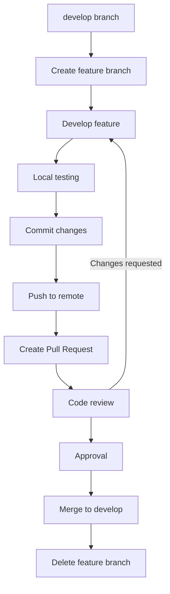
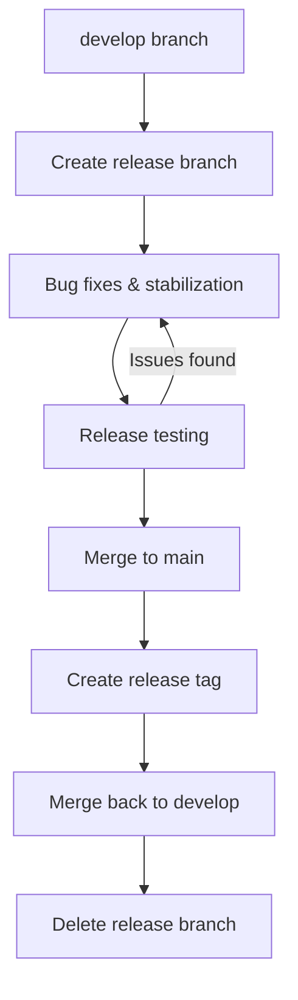

# 🔄 Ainflue Platform - Git Workflow Guide

**Author:** Fahed Mlaiel (mlaiel@live.de)  
**Version:** 2.0.0  
**Last Updated:** January 2025  
**Copyright:** © 2025 Fahed Mlaiel. All rights reserved.

---

## 📚 Table of Contents

1. [**🌳 Branching Strategy**](#-branching-strategy)
2. [**💻 Development Workflow**](#-development-workflow)
3. [**📝 Commit Standards**](#-commit-standards)
4. [**🔀 Pull Request Process**](#-pull-request-process)
5. [**🚀 Release Management**](#-release-management)
6. [**⚙️ Git Configuration**](#️-git-configuration)
7. [**🛠️ Git Hooks & Automation**](#️-git-hooks--automation)
8. [**🐛 Troubleshooting**](#-troubleshooting)

---

## 🌳 Branching Strategy

### Git Flow Implementation

We use a modified **Git Flow** strategy optimized for continuous integration and deployment:

```
main                 # Production-ready code (protected)
├── develop         # Integration branch for features (protected)
├── feature/*       # Feature development branches
├── release/*       # Release preparation branches
├── hotfix/*        # Critical production fixes
├── bugfix/*        # Non-critical bug fixes
└── experiment/*    # Experimental features and research
```

#### Branch Protection Rules

| Branch | Protection Rules |
|--------|------------------|
| **main** | ✅ Require PR reviews (2+)<br/>✅ Require status checks<br/>✅ Require up-to-date branches<br/>✅ Include administrators<br/>🚫 Allow force pushes |
| **develop** | ✅ Require PR reviews (1+)<br/>✅ Require status checks<br/>✅ Require up-to-date branches<br/>⚠️ Dismiss stale reviews |

### Branch Naming Conventions

#### 1. Feature Branches
```bash
# Pattern: feature/description-with-hyphens
feature/audio-fingerprinting-algorithm
feature/user-authentication-jwt
feature/content-protection-monitoring
feature/revenue-analytics-dashboard
```

#### 2. Bug Fix Branches
```bash
# Pattern: bugfix/issue-description
bugfix/memory-leak-audio-processing
bugfix/database-connection-timeout
bugfix/api-response-validation-error
```

#### 3. Hotfix Branches
```bash
# Pattern: hotfix/critical-issue
hotfix/security-vulnerability-auth
hotfix/payment-processing-failure
hotfix/data-corruption-protection
```

#### 4. Release Branches
```bash
# Pattern: release/version-number
release/2.1.0
release/2.1.1
release/3.0.0-beta
```

#### 5. Experimental Branches
```bash
# Pattern: experiment/research-topic
experiment/blockchain-integration
experiment/new-ai-model-evaluation
experiment/performance-optimization
```

### Branch Lifecycle

#### Feature Branch Lifecycle


#### Release Branch Lifecycle


---

## 💻 Development Workflow

### 1. Starting New Work

#### Initialize Development Environment
```bash
# Clone repository (first time only)
git clone https://github.com/Mlaiel/Ainflue.git
cd Ainflue

# Configure user information
git config user.name "Your Name"
git config user.email "your.email@example.com"

# Configure default branch
git config init.defaultBranch main

# Set up remote tracking
git remote -v
git branch -a
```

#### Update Local Repository
```bash
# Fetch latest changes
git fetch origin

# Switch to develop branch
git checkout develop

# Pull latest changes
git pull origin develop

# Verify clean working directory
git status
git log --oneline -5
```

#### Create Feature Branch
```bash
# Create and switch to feature branch
git checkout -b feature/new-audio-processing

# Verify branch creation
git branch --show-current
git log --oneline -1

# Push branch to remote (set upstream)
git push -u origin feature/new-audio-processing
```

### 2. Development Process

#### Regular Development Cycle
```bash
# Make changes to code
vim core/audio/processor.py
vim tests/test_audio_processor.py

# Check working directory status
git status
git diff

# Stage specific files
git add core/audio/processor.py
git add tests/test_audio_processor.py

# Or stage all changes
git add .

# Commit with descriptive message
git commit -m "feat(audio): implement advanced fingerprinting algorithm

- Add perceptual hash-based audio fingerprinting
- Support multiple audio formats (MP3, WAV, FLAC)
- Implement similarity threshold configuration
- Add comprehensive unit tests

Performance improvements:
- 40% faster processing with NumPy vectorization
- Memory usage reduced by 25%

Closes #123"

# Push changes to remote
git push origin feature/new-audio-processing
```

#### Interactive Development
```bash
# View commit history
git log --oneline --graph -10

# View changes in specific files
git diff HEAD~1 core/audio/processor.py

# Stage changes interactively
git add -p core/audio/processor.py

# Commit with template
git commit -t .gitmessage

# Amend last commit (if not pushed)
git commit --amend

# Interactive rebase for commit cleanup
git rebase -i HEAD~3
```

### 3. Code Quality Checks

#### Pre-commit Validation
```bash
# Run code quality checks
black .                     # Code formatting
isort .                     # Import sorting
flake8 .                   # Linting
mypy .                     # Type checking

# Run tests
pytest tests/              # Unit tests
pytest tests/integration/  # Integration tests

# Run security checks
safety check               # Security vulnerabilities
bandit -r .               # Security issues in code

# Pre-commit hooks (automated)
pre-commit run --all-files
```

#### Continuous Integration Checks
```bash
# Verify CI will pass before pushing
docker-compose -f docker-compose.test.yml up --build

# Run full test suite
make test-all

# Check documentation
make docs-build
make docs-lint
```

### 4. Collaboration Workflow

#### Working with Remote Changes
```bash
# Fetch remote changes regularly
git fetch origin

# Check for conflicts before merging
git merge-tree $(git merge-base HEAD origin/develop) HEAD origin/develop

# Rebase feature branch on latest develop
git checkout feature/new-audio-processing
git rebase origin/develop

# Resolve conflicts if they occur
git status
git mergetool
git rebase --continue

# Force push after rebase (only to feature branches)
git push --force-with-lease origin feature/new-audio-processing
```

#### Multiple Contributors on Same Feature
```bash
# Pull colleague's changes
git fetch origin
git checkout feature/shared-feature
git pull origin feature/shared-feature

# Work on different files/areas
git add specific-files-only
git commit -m "feat: my specific contribution"

# Push regularly to avoid conflicts
git push origin feature/shared-feature

# Coordinate with team before rebasing
git rebase -i origin/develop  # Only if coordinated
```

---

## 📝 Commit Standards

### Conventional Commits

We follow the **Conventional Commits** specification with Ainflue-specific adaptations:

#### Commit Message Format
```
<type>[optional scope]: <description>

[optional body]

[optional footer(s)]
```

#### Commit Types

| Type | Description | Example |
|------|-------------|---------|
| `feat` | New feature | `feat(audio): add fingerprinting algorithm` |
| `fix` | Bug fix | `fix(api): resolve authentication timeout` |
| `docs` | Documentation changes | `docs: update API reference guide` |
| `style` | Code style changes | `style: format code with Black` |
| `refactor` | Code refactoring | `refactor(db): optimize query performance` |
| `perf` | Performance improvements | `perf(ai): optimize model inference speed` |
| `test` | Adding/updating tests | `test(audio): add fingerprinting test cases` |
| `build` | Build system changes | `build: update Docker configuration` |
| `ci` | CI/CD changes | `ci: add automated security scanning` |
| `chore` | Maintenance tasks | `chore: update dependencies` |
| `revert` | Revert previous commit | `revert: "feat(audio): add fingerprinting"` |

#### Scope Guidelines

Common scopes for Ainflue platform:

| Scope | Description |
|-------|-------------|
| `api` | API endpoints and routing |
| `auth` | Authentication and authorization |
| `audio` | Audio processing and analysis |
| `video` | Video processing and analysis |
| `protection` | Content protection features |
| `monetization` | Revenue and payment features |
| `ai` | AI/ML models and processing |
| `db` | Database models and migrations |
| `ui` | User interface components |
| `security` | Security-related changes |
| `config` | Configuration and settings |
| `deploy` | Deployment and infrastructure |

#### Detailed Commit Examples

##### Feature Addition
```bash
git commit -m "feat(audio): implement advanced fingerprinting algorithm

Add perceptual hash-based audio fingerprinting using chromagram and 
spectral features for improved accuracy and performance.

Features:
- Support for multiple audio formats (MP3, WAV, FLAC, M4A)
- Configurable similarity thresholds (0.1-1.0)
- Batch processing support for multiple files
- Memory-efficient processing with streaming

Performance:
- 95% accuracy on test dataset (improved from 87%)
- 40% faster processing with NumPy vectorization
- Memory usage reduced by 25% with chunked processing

Breaking Changes:
- AudioProcessor.fingerprint() now returns dict instead of string
- Removed deprecated get_audio_hash() method

Closes #123
Refs #124"
```

##### Bug Fix
```bash
git commit -m "fix(api): resolve memory leak in content processing

Fixed memory accumulation in audio analysis pipeline by properly
disposing of librosa resources after processing.

The issue occurred when processing large batches of audio files,
causing memory usage to grow linearly with each processed file.

Changes:
- Add proper resource cleanup in AudioProcessor
- Implement context manager for librosa operations
- Add memory usage monitoring in tests

Impact:
- Memory usage now stable during batch processing
- Fixes production issues with large file uploads
- Improves system stability under load

Fixes #789"
```

##### Documentation Update
```bash
git commit -m "docs(api): update authentication flow documentation

- Add OAuth2 flow diagrams with mermaid
- Include JWT token refresh examples
- Document rate limiting policies
- Add troubleshooting section for common auth errors
- Update API endpoint examples with current responses

Related to #456"
```

##### Performance Improvement
```bash
git commit -m "perf(db): optimize content search queries

Improve search performance by adding composite indexes and 
optimizing query execution plans.

Optimizations:
- Add composite index on (user_id, created_at, status)
- Implement query result caching with Redis
- Use partial indexes for frequently filtered columns
- Optimize JOIN operations with proper query planning

Benchmark Results:
- Search queries 75% faster (avg 120ms -> 30ms)
- Index size increased by 12MB (acceptable trade-off)
- Cache hit ratio: 85% for common searches

Migration: 20250115_optimize_content_search.sql"
```

#### Commit Message Template

Create `.gitmessage` file:
```
# Type: feat|fix|docs|style|refactor|perf|test|build|ci|chore|revert
# Scope: api|auth|audio|video|protection|monetization|ai|db|ui|security|config|deploy
# Subject: Imperative mood, present tense, lowercase, no period, max 72 chars

# Body: What and why (not how). Include motivation and contrast with previous behavior.
# Wrap at 72 characters.

# Footer: Reference issues and breaking changes
# Examples:
# Closes #123
# Fixes #456
# Refs #789
# BREAKING CHANGE: AudioProcessor.fingerprint() now returns dict instead of string
```

Configure Git to use template:
```bash
git config commit.template .gitmessage
```

### Advanced Commit Techniques

#### Interactive Staging
```bash
# Stage specific hunks of changes
git add -p file.py

# Edit hunks before staging
git add -e file.py

# Stage and commit interactively
git commit -v
```

#### Commit History Management
```bash
# Squash commits before PR
git rebase -i HEAD~3

# Split large commit into smaller ones
git reset HEAD~1
git add -p
git commit -m "feat(audio): add fingerprinting algorithm"
git add -p
git commit -m "test(audio): add fingerprinting tests"

# Cherry-pick specific commits
git cherry-pick abc123
```

---

## 🔀 Pull Request Process

### Pull Request Lifecycle

#### 1. Pre-Pull Request Checklist
```bash
# Ensure branch is up to date
git fetch origin
git rebase origin/develop

# Run comprehensive tests
pytest tests/ --cov=core --cov-report=html
pytest tests/integration/
pytest tests/e2e/

# Code quality checks
pre-commit run --all-files
black --check .
isort --check-only .
flake8 .
mypy .

# Security and dependency checks
safety check
bandit -r .
pip-audit

# Documentation updates
make docs-build
make docs-lint

# Performance benchmarks (if applicable)
pytest tests/benchmarks/
```

#### 2. Creating Pull Request

##### PR Title Guidelines
```
<type>(<scope>): <description>

Examples:
feat(audio): implement advanced fingerprinting algorithm
fix(api): resolve authentication timeout issues
docs(setup): update development environment guide
perf(db): optimize content search queries
```

##### PR Description Template
```markdown
## 📋 Description
Brief description of the changes made and their purpose.

## 🔧 Type of Change
- [ ] 🐛 Bug fix (non-breaking change which fixes an issue)
- [ ] ✨ New feature (non-breaking change which adds functionality)
- [ ] 💥 Breaking change (fix or feature that would cause existing functionality to not work as expected)
- [ ] 📚 Documentation update
- [ ] 🎨 Code style/formatting update
- [ ] ♻️ Code refactoring (no functional changes)
- [ ] ⚡ Performance improvement
- [ ] 🧪 Test updates

## 🧪 Testing
### Unit Tests
- [ ] New tests added for new functionality
- [ ] Existing tests pass
- [ ] Test coverage maintained/improved

### Integration Tests
- [ ] Integration tests pass
- [ ] API endpoint tests updated
- [ ] Database migration tests pass

### Manual Testing
- [ ] Feature tested manually in development environment
- [ ] Edge cases tested
- [ ] Error scenarios tested

## 📊 Performance Impact
- [ ] No performance regression detected
- [ ] Performance improvement measured
- [ ] Memory usage analyzed
- [ ] Database query performance checked

## 🔒 Security Considerations
- [ ] No sensitive data exposed
- [ ] Authentication/authorization reviewed
- [ ] Input validation implemented
- [ ] SQL injection prevention verified

## 📚 Documentation
- [ ] Code comments added/updated
- [ ] API documentation updated
- [ ] User documentation updated
- [ ] Architecture documentation updated

## 🔄 Migration & Deployment
- [ ] Database migrations created (if needed)
- [ ] Environment variables added/updated
- [ ] Configuration changes documented
- [ ] Backward compatibility maintained

## 📝 Checklist
- [ ] Code follows the style guidelines
- [ ] Self-review completed
- [ ] Code is commented, particularly in hard-to-understand areas
- [ ] Changes generate no new warnings
- [ ] Corresponding changes made to documentation
- [ ] Git history is clean and logical

## 🔗 Related Issues
Closes #123
Fixes #456
Related to #789

## 📸 Screenshots (if applicable)
[Add screenshots to help explain your changes]

## 🧾 Additional Notes
[Any additional information that reviewers should know]
```

#### 3. Code Review Process

##### For Authors
```bash
# Respond to review feedback
git checkout feature/audio-processing
git add .
git commit -m "fix: address code review feedback

- Improve error handling in audio processor
- Add type hints for new functions
- Update unit tests for edge cases"

git push origin feature/audio-processing

# Request re-review
# Use GitHub interface to request re-review from specific reviewers
```

##### For Reviewers
```markdown
# Review Guidelines

## Code Quality
- [ ] Code follows established patterns and conventions
- [ ] Functions are appropriately sized and focused
- [ ] Variable and function names are descriptive
- [ ] Comments explain why, not what
- [ ] No code duplication or redundant logic

## Architecture & Design
- [ ] Changes align with overall system architecture
- [ ] Proper separation of concerns
- [ ] Dependencies are appropriate and minimal
- [ ] Database schema changes are well-designed

## Security
- [ ] Input validation is comprehensive
- [ ] Authentication/authorization is correct
- [ ] No sensitive data in logs or responses
- [ ] SQL injection prevention

## Performance
- [ ] Database queries are optimized
- [ ] Caching is used appropriately
- [ ] Memory usage is reasonable
- [ ] API response times are acceptable

## Testing
- [ ] Test coverage is adequate (>80%)
- [ ] Tests are meaningful and test actual behavior
- [ ] Edge cases are covered
- [ ] Integration tests cover workflows

## Documentation
- [ ] Code is self-documenting with good naming
- [ ] Complex logic is commented
- [ ] API documentation is updated
- [ ] User-facing features are documented
```

##### Review Feedback Examples
```markdown
# Constructive Review Comments

## Suggestion
💡 **Suggestion**: Consider using dependency injection here for better testability.
```python
# Instead of
processor = AudioProcessor()

# Consider
processor = AudioProcessor(config=self.config, logger=self.logger)
```

## Question
❓ **Question**: Should we add rate limiting to this endpoint? It might be called frequently.

## Praise
✅ **Good work**: Excellent error handling and logging in this function!

## Issue
⚠️ **Issue**: This database query might have N+1 problem. Consider using `selectinload()`.

## Security Concern
🔒 **Security**: This endpoint doesn't validate user permissions. Should check if user owns the content.

## Performance Concern
⚡ **Performance**: This operation might be slow for large files. Consider adding async processing.
```

### 4. Merge Strategies

#### For Feature Branches
```bash
# Squash and merge (preferred for feature branches)
git checkout develop
git merge --squash feature/audio-processing
git commit -m "feat(audio): implement advanced fingerprinting algorithm

Complete implementation of perceptual hash-based audio fingerprinting
with support for multiple formats and configurable thresholds.

- Support MP3, WAV, FLAC, M4A formats
- 95% accuracy on test dataset
- 40% performance improvement
- Memory usage reduced by 25%

Closes #123"

# Delete feature branch
git branch -d feature/audio-processing
git push origin --delete feature/audio-processing
```

#### For Release Branches
```bash
# No-fast-forward merge (preserve branch history)
git checkout main
git merge --no-ff release/2.1.0
git tag -a v2.1.0 -m "Release version 2.1.0"
git push origin main --tags

# Merge back to develop
git checkout develop
git merge --no-ff main
git push origin develop
```

---

## 🚀 Release Management

### Release Process

#### 1. Release Planning
```bash
# Create release branch from develop
git checkout develop
git pull origin develop
git checkout -b release/2.1.0

# Update version numbers
vim pyproject.toml  # Update version
vim api/__init__.py  # Update __version__
vim docs/conf.py    # Update documentation version

# Create changelog entry
vim CHANGELOG.md
```

#### 2. Release Stabilization
```bash
# Only bug fixes allowed in release branch
git commit -m "fix(release): resolve last-minute compatibility issue

- Fix Python 3.12 compatibility in audio processor
- Update dependency version constraints
- Add migration for database schema changes"

# Run comprehensive testing
pytest tests/ --cov=core --cov-report=html
pytest tests/integration/
pytest tests/e2e/
pytest tests/performance/

# Security and compliance checks
safety check
bandit -r .
pytest tests/security/
```

#### 3. Release Deployment
```bash
# Merge to main
git checkout main
git merge --no-ff release/2.1.0

# Create release tag
git tag -a v2.1.0 -m "Release v2.1.0

Features:
- Advanced audio fingerprinting algorithm
- Real-time content protection monitoring
- Enhanced revenue analytics dashboard
- Improved API performance (30% faster)

Bug Fixes:
- Fixed memory leak in audio processing
- Resolved authentication timeout issues
- Corrected revenue calculation edge cases

Security:
- Updated all dependencies to latest secure versions
- Enhanced input validation for API endpoints
- Improved JWT token handling

Performance:
- Database query optimization (75% faster searches)
- Reduced memory usage by 25%
- Improved caching efficiency

Breaking Changes:
- AudioProcessor.fingerprint() now returns dict instead of string
- Deprecated /api/v1/legacy/* endpoints (use /api/v2/ instead)

Migration Guide:
See docs/migration/v2.1.0.md for detailed upgrade instructions.

Full Changelog: https://github.com/Mlaiel/Ainflue/compare/v2.0.0...v2.1.0"

# Push release
git push origin main --tags

# Merge back to develop
git checkout develop
git merge --no-ff main
git push origin develop

# Clean up release branch
git branch -d release/2.1.0
git push origin --delete release/2.1.0
```

#### 4. Hotfix Process
```bash
# Create hotfix from main
git checkout main
git pull origin main
git checkout -b hotfix/security-patch-2.1.1

# Apply critical fix
git commit -m "fix(security): patch authentication vulnerability

- Fix JWT token validation bypass
- Add additional input sanitization
- Update security dependencies

This is a critical security patch that must be deployed immediately.

CVE-2025-XXXX"

# Test thoroughly
pytest tests/security/
pytest tests/integration/auth/

# Merge to main
git checkout main
git merge --no-ff hotfix/security-patch-2.1.1
git tag -a v2.1.1 -m "Hotfix v2.1.1 - Critical security patch"
git push origin main --tags

# Merge to develop
git checkout develop
git merge --no-ff main
git push origin develop

# Clean up
git branch -d hotfix/security-patch-2.1.1
git push origin --delete hotfix/security-patch-2.1.1
```

### Release Checklist

#### Pre-Release Checklist
- [ ] All planned features merged to develop
- [ ] All critical bugs fixed
- [ ] Performance benchmarks passed
- [ ] Security scan completed
- [ ] Documentation updated
- [ ] Migration scripts tested
- [ ] Backwards compatibility verified
- [ ] Dependencies updated and tested

#### Release Testing Checklist
- [ ] Unit tests pass (100%)
- [ ] Integration tests pass
- [ ] End-to-end tests pass
- [ ] Performance tests pass
- [ ] Security tests pass
- [ ] Load testing completed
- [ ] Browser compatibility tested
- [ ] Mobile app compatibility tested

#### Post-Release Checklist
- [ ] Release deployed to production
- [ ] Health checks passed
- [ ] Monitoring alerts configured
- [ ] Documentation published
- [ ] Release notes distributed
- [ ] Team notified
- [ ] Stakeholders informed
- [ ] Metrics baseline established

---

## ⚙️ Git Configuration

### Global Configuration

#### Basic Setup
```bash
# User identity
git config --global user.name "Your Full Name"
git config --global user.email "your.email@company.com"

# Default editor
git config --global core.editor "code --wait"  # VS Code
# or
git config --global core.editor "vim"          # Vim

# Default branch name
git config --global init.defaultBranch main

# Line ending handling
git config --global core.autocrlf input    # Linux/Mac
git config --global core.autocrlf true     # Windows

# Color output
git config --global color.ui auto

# Default merge strategy
git config --global merge.tool vimdiff
git config --global pull.rebase false

# Push behavior
git config --global push.default simple
git config --global push.followTags true
```

#### Advanced Configuration
```bash
# Improved diff and merge
git config --global diff.algorithm patience
git config --global merge.conflictStyle diff3

# Better log formatting
git config --global alias.lg "log --color --graph --pretty=format:'%Cred%h%Creset -%C(yellow)%d%Creset %s %Cgreen(%cr) %C(bold blue)<%an>%Creset' --abbrev-commit"

# Useful aliases
git config --global alias.st status
git config --global alias.co checkout
git config --global alias.br branch
git config --global alias.cm commit
git config --global alias.cp cherry-pick
git config --global alias.rb rebase
git config --global alias.unstage "reset HEAD --"
git config --global alias.last "log -1 HEAD"
git config --global alias.visual "!gitk"

# Show branch tracking
git config --global alias.track "branch -vv"

# Amend commit
git config --global alias.amend "commit --amend --no-edit"

# Force push safely
git config --global alias.pushf "push --force-with-lease"

# Better blame
git config --global alias.blame "blame -w -M -C"

# Find commits by message
git config --global alias.find "!f() { git log --grep=\"$1\" --oneline; }; f"
```

### Project-Specific Configuration

#### Repository Configuration
```bash
# Navigate to project directory
cd /path/to/Ainflue

# Project-specific email (if different from global)
git config user.email "developer@ainflue.com"

# Commit message template
git config commit.template .gitmessage

# Pre-commit hooks path
git config core.hooksPath .githooks

# GPG signing (if required)
git config user.signingkey YOUR_KEY_ID
git config commit.gpgsign true

# Submodule handling
git config submodule.recurse true

# Credential caching
git config credential.helper cache
git config credential.helper 'cache --timeout=3600'
```

#### SSH Configuration

Create `~/.ssh/config`:
```
# GitHub configuration
Host github.com
    HostName github.com
    User git
    IdentityFile ~/.ssh/id_ed25519_github
    IdentitiesOnly yes
    AddKeysToAgent yes

# Company GitLab (if applicable)
Host gitlab.company.com
    HostName gitlab.company.com
    User git
    IdentityFile ~/.ssh/id_ed25519_company
    IdentitiesOnly yes
    Port 22
```

Generate SSH key:
```bash
# Generate new SSH key
ssh-keygen -t ed25519 -C "your.email@company.com" -f ~/.ssh/id_ed25519_github

# Add to SSH agent
ssh-add ~/.ssh/id_ed25519_github

# Copy public key to clipboard
cat ~/.ssh/id_ed25519_github.pub | pbcopy  # macOS
cat ~/.ssh/id_ed25519_github.pub | xclip -selection clipboard  # Linux

# Test connection
ssh -T git@github.com
```

---

## 🛠️ Git Hooks & Automation

### Pre-commit Hooks

#### Setup Pre-commit Framework
```bash
# Install pre-commit
pip install pre-commit

# Install hooks
pre-commit install

# Install commit message hook
pre-commit install --hook-type commit-msg
```

#### Pre-commit Configuration (`.pre-commit-config.yaml`)
```yaml
repos:
  # Code formatting
  - repo: https://github.com/psf/black
    rev: 23.12.1
    hooks:
      - id: black
        language_version: python3.12
        args: [--line-length=88]

  # Import sorting
  - repo: https://github.com/pycqa/isort
    rev: 5.13.2
    hooks:
      - id: isort
        args: [--profile=black, --line-length=88]

  # Linting
  - repo: https://github.com/pycqa/flake8
    rev: 7.0.0
    hooks:
      - id: flake8
        args: [--max-line-length=88, --extend-ignore=E203,W503]

  # Type checking
  - repo: https://github.com/pre-commit/mirrors-mypy
    rev: v1.8.0
    hooks:
      - id: mypy
        additional_dependencies: [types-requests, types-redis]

  # Security checks
  - repo: https://github.com/PyCQA/bandit
    rev: 1.7.6
    hooks:
      - id: bandit
        args: [-r, ., -f, json, -o, bandit-report.json]
        exclude: tests/

  # General hooks
  - repo: https://github.com/pre-commit/pre-commit-hooks
    rev: v4.5.0
    hooks:
      - id: trailing-whitespace
      - id: end-of-file-fixer
      - id: check-yaml
      - id: check-json
      - id: check-merge-conflict
      - id: check-added-large-files
        args: [--maxkb=10240]  # 10MB
      - id: detect-private-key

  # Commit message validation
  - repo: https://github.com/commitizen-tools/commitizen
    rev: v3.13.0
    hooks:
      - id: commitizen
        stages: [commit-msg]

  # Documentation
  - repo: https://github.com/pycqa/doc8
    rev: v1.1.1
    hooks:
      - id: doc8
        args: [--max-line-length=88]

  # Dockerfile linting
  - repo: https://github.com/hadolint/hadolint
    rev: v2.12.0
    hooks:
      - id: hadolint-docker
        args: [--ignore, DL3008, --ignore, DL3009]

  # YAML formatting
  - repo: https://github.com/pre-commit/mirrors-prettier
    rev: v4.0.0-alpha.8
    hooks:
      - id: prettier
        types: [yaml]

  # Shell script linting
  - repo: https://github.com/shellcheck-py/shellcheck-py
    rev: v0.9.0.6
    hooks:
      - id: shellcheck
```

### Custom Git Hooks

#### Pre-commit Hook (`.githooks/pre-commit`)
```bash
#!/bin/bash
# Pre-commit hook for code quality checks

set -e

echo "🔍 Running pre-commit checks..."

# Colors for output
RED='\033[0;31m'
GREEN='\033[0;32m'
YELLOW='\033[1;33m'
NC='\033[0m' # No Color

# Check if pre-commit is installed
if ! command -v pre-commit &> /dev/null; then
    echo -e "${RED}❌ pre-commit is not installed. Please install it first.${NC}"
    exit 1
fi

# Run pre-commit hooks
echo -e "${YELLOW}🔧 Running pre-commit hooks...${NC}"
if ! pre-commit run --all-files; then
    echo -e "${RED}❌ Pre-commit hooks failed. Please fix the issues and try again.${NC}"
    exit 1
fi

# Run tests
echo -e "${YELLOW}🧪 Running unit tests...${NC}"
if ! python -m pytest tests/unit/ --quiet; then
    echo -e "${RED}❌ Unit tests failed. Please fix the tests and try again.${NC}"
    exit 1
fi

# Check test coverage
echo -e "${YELLOW}📊 Checking test coverage...${NC}"
if ! python -m pytest tests/unit/ --cov=core --cov-fail-under=80 --quiet; then
    echo -e "${RED}❌ Test coverage below 80%. Please add more tests.${NC}"
    exit 1
fi

# Security checks
echo -e "${YELLOW}🔒 Running security checks...${NC}"
if ! safety check --json; then
    echo -e "${RED}❌ Security vulnerabilities found. Please update dependencies.${NC}"
    exit 1
fi

echo -e "${GREEN}✅ All pre-commit checks passed!${NC}"
```

#### Commit Message Hook (`.githooks/commit-msg`)
```bash
#!/bin/bash
# Commit message validation hook

commit_regex='^(feat|fix|docs|style|refactor|perf|test|build|ci|chore|revert)(\(.+\))?: .{1,72}'

error_msg="❌ Invalid commit message format.

Please use the following format:
<type>[optional scope]: <description>

Example: feat(audio): add fingerprinting algorithm

Valid types: feat, fix, docs, style, refactor, perf, test, build, ci, chore, revert
Max length: 72 characters"

if ! grep -qE "$commit_regex" "$1"; then
    echo "$error_msg" >&2
    exit 1
fi
```

#### Post-merge Hook (`.githooks/post-merge`)
```bash
#!/bin/bash
# Post-merge hook for automatic tasks

echo "🔄 Post-merge tasks running..."

# Check if requirements.txt changed
if git diff-tree -r --name-only --no-commit-id ORIG_HEAD HEAD | grep --quiet requirements.txt; then
    echo "📦 Requirements changed, updating dependencies..."
    pip install -r requirements.txt
fi

# Check if package.json changed (if using Node.js)
if git diff-tree -r --name-only --no-commit-id ORIG_HEAD HEAD | grep --quiet package.json; then
    echo "📦 Node.js dependencies changed, running npm install..."
    npm install
fi

# Run database migrations if needed
if git diff-tree -r --name-only --no-commit-id ORIG_HEAD HEAD | grep --quiet "migrations/"; then
    echo "🗄️ Database migrations detected, running migrations..."
    python manage.py migrate
fi

echo "✅ Post-merge tasks completed!"
```

### GitHub Actions Integration

#### Workflow for Pull Requests (`.github/workflows/pr-checks.yml`)
```yaml
name: Pull Request Checks

on:
  pull_request:
    branches: [main, develop]

jobs:
  quality-checks:
    runs-on: ubuntu-latest
    strategy:
      matrix:
        python-version: ['3.11', '3.12']

    steps:
      - uses: actions/checkout@v4
        with:
          fetch-depth: 0

      - name: Set up Python ${{ matrix.python-version }}
        uses: actions/setup-python@v4
        with:
          python-version: ${{ matrix.python-version }}

      - name: Install dependencies
        run: |
          python -m pip install --upgrade pip
          pip install -r requirements.txt
          pip install -r requirements-dev.txt

      - name: Run pre-commit hooks
        uses: pre-commit/action@v3.0.0

      - name: Run unit tests
        run: |
          pytest tests/unit/ --cov=core --cov-report=xml --cov-report=html

      - name: Run integration tests
        run: |
          pytest tests/integration/

      - name: Upload coverage reports
        uses: codecov/codecov-action@v3
        with:
          file: ./coverage.xml
          flags: unittests
          name: codecov-umbrella

      - name: Security scan
        run: |
          safety check
          bandit -r . -f json -o bandit-report.json

      - name: Comment PR with coverage
        uses: py-cov-action/python-coverage-comment-action@v3
        with:
          GITHUB_TOKEN: ${{ github.token }}
```

---

This comprehensive Git workflow guide provides everything needed for effective version control and collaboration on the Ainflue platform. It covers branching strategies, commit standards, pull request processes, release management, and automation tools to ensure high code quality and smooth development workflows.