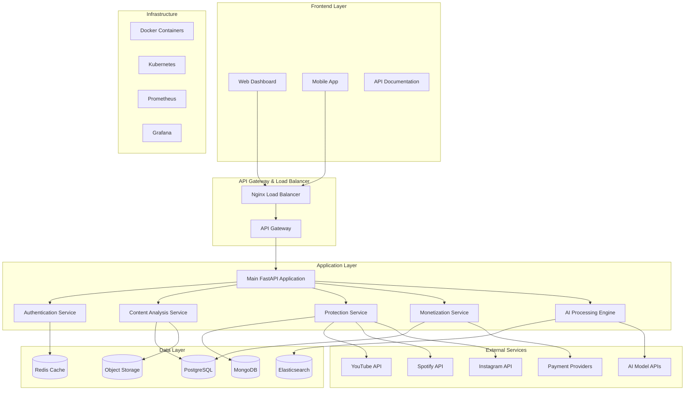
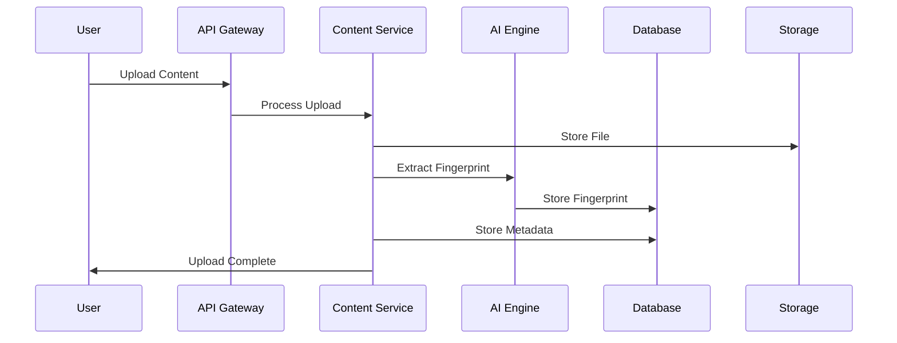
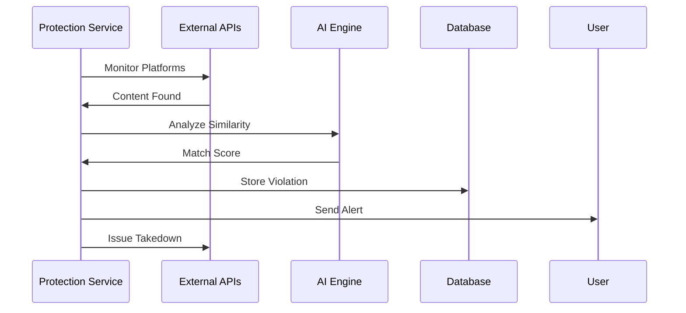

# 🏗️ Ainflue Platform Architecture

## Overview

Ainflue is an AI-powered content protection and monetization platform built with modern microservices architecture. The platform provides comprehensive content analysis, protection, and revenue optimization capabilities for digital creators across multiple platforms.

**Author:** Fahed Mlaiel (mlaiel@live.de)  
**Copyright:** © 2025 Fahed Mlaiel. All rights reserved.  
**Version:** 2.0.0  
**Last Updated:** September 2025

---

## System Architecture

## Core Components

### 1. API Layer

**FastAPI Application**
- RESTful API design with OpenAPI 3.0 specification
- Automatic documentation generation
- Request/response validation
- Rate limiting and authentication middleware

**API Gateway**
- Load balancing and traffic routing
- Authentication and authorization
- Rate limiting and quota management
- Request/response transformation

### 2. Business Logic Layer

**Content Analysis Service**
- Multi-format content fingerprinting
- AI-powered similarity detection
- Metadata extraction and analysis
- Content quality assessment

**Protection Service**
- Real-time monitoring across platforms
- Automated violation detection
- DMCA takedown automation
- Copyright protection workflows

**Monetization Service**
- Revenue tracking and optimization
- Multi-platform integration
- Payment processing
- Analytics and reporting

### 3. Data Layer

**PostgreSQL (Primary Database)**
- User accounts and profiles
- Content metadata
- Financial transactions
- System configuration

**MongoDB (AI/ML Data)**
- AI model training data
- Content fingerprints
- Analytics data
- Cache optimization data

**Redis (Cache & Sessions)**
- Session management
- API response caching
- Real-time data storage
- Message queuing

**Elasticsearch (Search & Analytics)**
- Full-text search
- Log aggregation
- Real-time analytics
- Performance monitoring

## Technology Stack

### Backend
- **Runtime**: Python 3.11+
- **Framework**: FastAPI 0.104+
- **Database**: PostgreSQL 14+, MongoDB 5+, Redis 6+
- **Search**: Elasticsearch 8+
- **Queue**: Celery with Redis
- **AI/ML**: TensorFlow, PyTorch, OpenAI APIs

### Frontend
- **Framework**: Next.js 14+
- **Language**: TypeScript 5+
- **Styling**: Tailwind CSS 3+
- **State Management**: Zustand
- **UI Components**: Custom component library

### AI/ML
- **Fingerprinting**: Custom neural networks
- **Content Analysis**: Multi-modal AI models
- **Similarity Detection**: Vector embeddings
- **Recommendation Engine**: Collaborative filtering

### Infrastructure
- **Containerization**: Docker
- **Orchestration**: Kubernetes
- **Load Balancer**: Nginx
- **Monitoring**: Prometheus + Grafana
- **Logging**: ELK Stack

### Development Tools
- **Version Control**: Git
- **CI/CD**: GitHub Actions
- **Testing**: Pytest, Jest
- **Code Quality**: ESLint, Black, mypy
- **Documentation**: OpenAPI, Storybook

## Data Flow

### Content Upload and Analysis

### Content Protection Workflow

## Security Architecture

### Authentication & Authorization
- JWT-based authentication
- Role-based access control (RBAC)
- Multi-factor authentication (MFA)
- OAuth2 integration

### Data Protection
- AES-256 encryption at rest
- TLS 1.3 encryption in transit
- Field-level encryption for sensitive data
- Key rotation and management

### Network Security
- VPC with private subnets
- Security groups and NACLs
- WAF (Web Application Firewall)
- DDoS protection

### Application Security
- Input validation and sanitization
- SQL injection prevention
- XSS protection
- CSRF protection

## Scalability & Performance

### Horizontal Scaling
- Microservices architecture
- Kubernetes auto-scaling
- Load balancing across instances
- Database read replicas

### Performance Optimization
- Redis caching layer
- CDN for static assets
- Database query optimization
- Async processing with Celery

### Monitoring & Observability
- Application metrics with Prometheus
- Log aggregation with ELK Stack
- Distributed tracing
- Health checks and alerting

## Deployment Architecture

### Production Environment
- Multi-zone Kubernetes cluster
- Blue-green deployments
- Database clustering
- Automated backups

### Development Environment
- Docker Compose setup
- Local development tools
- Testing environment
- CI/CD pipelines

## API Design Principles

### RESTful Design
- Resource-based URLs
- HTTP verbs for actions
- Consistent response formats
- Proper status codes

### Documentation
- OpenAPI 3.0 specification
- Interactive Swagger UI
- Code examples in multiple languages
- Versioning strategy

### Error Handling
- Standardized error responses
- Detailed error codes
- Localized error messages
- Graceful degradation

## Development Workflow

### Local Development
1. Clone repository
2. Run `./scripts/dev/setup.sh`
3. Start with `docker-compose up`
4. Access docs at http://localhost:8000/docs

### Testing Strategy
- Unit tests for business logic
- Integration tests for API endpoints
- End-to-end tests for critical workflows
- Performance tests for scalability

### Code Quality
- Automated code formatting
- Static type checking
- Security vulnerability scanning
- Test coverage requirements

## Future Enhancements

### Planned Features
- Enhanced AI models for better accuracy
- Blockchain integration for provenance
- Advanced analytics dashboard
- Mobile application improvements

### Scalability Roadmap
- Global CDN deployment
- Multi-region architecture
- Enhanced caching strategies
- Performance optimizations

---

**For detailed technical specifications, see:**
- [API Reference](../api/API_REFERENCE.md)
- [Deployment Guide](../deployment/DEPLOYMENT_GUIDE.md)
- [Security Guide](../security/SECURITY_GUIDE.md)

**Contact:** mlaiel@live.de  
**Documentation:** This architecture document is part of the comprehensive Ainflue platform documentation suite.