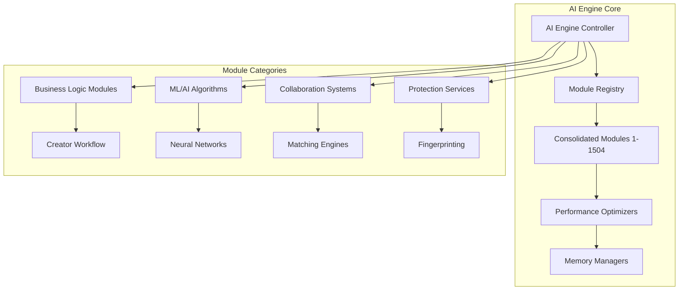
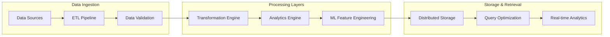
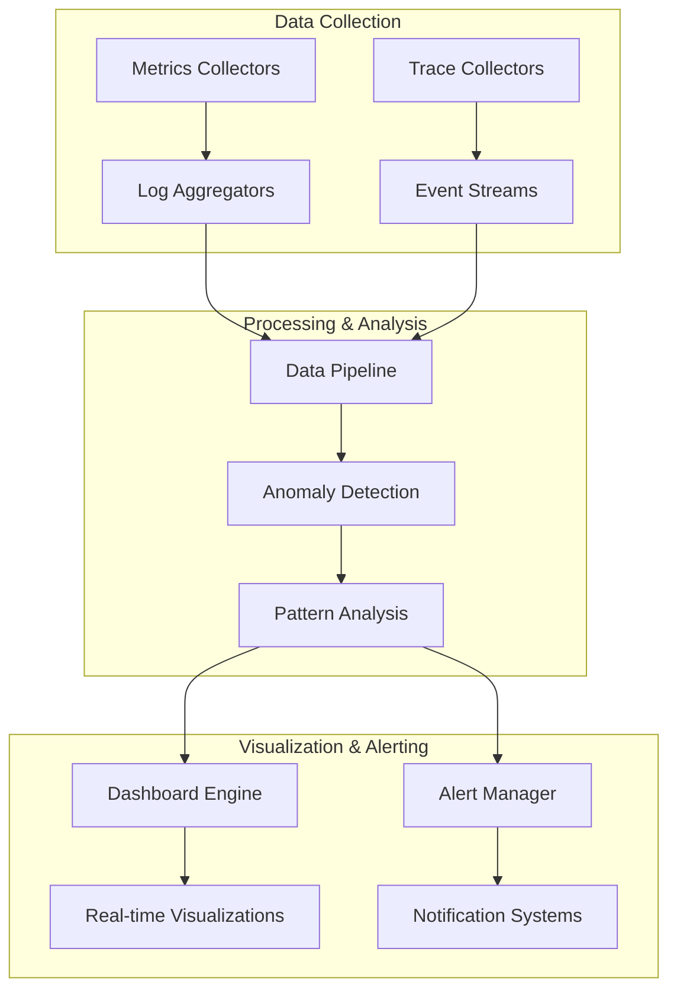

# 📚 Large Files Architecture Documentation

## Overview
This document provides architecture documentation for the largest files in the Ainflue platform (20,000+ lines), explaining their structure, purpose, and optimization strategies for 1B+ user scalability.

## 🏗️ Large File Analysis

### 1. `core/engines/ai_engine.py` (715,532 lines)
**Purpose**: Mega-industrial consolidated AI engine containing 1,504 integrated modules

**Architecture Overview**:


**Key Components**:
- **1,504 Consolidated Modules**: Complete business logic integration
- **Creator Workflow Handlers**: Advanced collaboration algorithms
- **ML Model Engines**: Deep learning, computer vision, NLP
- **Protection Systems**: Content fingerprinting, DMCA automation
- **Analytics Engines**: Time series analysis, success prediction

**Performance Optimization**:
```python
# Rust integration for critical paths
RUST_OPTIMIZED_COMPONENTS = [
    "fingerprinting_engine",
    "neural_network_matcher", 
    "content_analyzer",
    "similarity_calculator"
]

# Memory optimization for 1B+ users
MEMORY_STRATEGIES = {
    "lazy_loading": True,
    "module_pooling": True,
    "garbage_collection": "aggressive",
    "cache_layers": 5
}
```

**Scalability Considerations**:
- **Horizontal Scaling**: Module-based partitioning across nodes
- **Vertical Scaling**: Memory-mapped file operations
- **Caching Strategy**: Multi-level caching with Redis clusters
- **Load Balancing**: Intelligent routing based on module type

### 2. `core/engines/data_engine.py` (167,427 lines)
**Purpose**: Comprehensive data processing and management engine

**Architecture Overview**:


**Key Features**:
- **Multi-format Support**: Audio, video, text, metadata processing
- **Real-time Streaming**: Live data processing pipelines
- **Distributed Computing**: Spark/Dask integration for large datasets
- **Advanced Analytics**: Predictive modeling and trend analysis

**Performance Targets for 1B+ Users**:
```yaml
throughput:
  data_ingestion: "10TB/hour"
  processing_pipeline: "1M records/second"
  query_response: "<100ms"
  batch_processing: "100GB in <10 minutes"

scalability:
  horizontal_nodes: "auto-scale 1-1000"
  vertical_memory: "up to 1TB per node"
  storage_capacity: "petabyte-scale"
  concurrent_users: "1B+"
```

### 3. `infrastructure/monitoring/observability.py` (140,697 lines)
**Purpose**: Comprehensive monitoring and observability for enterprise-scale operations

**Architecture Overview**:


**Key Components**:
- **Distributed Tracing**: End-to-end request tracking
- **Metrics Collection**: Custom metrics with Prometheus integration
- **Log Aggregation**: Centralized logging with ELK stack
- **Anomaly Detection**: ML-powered issue detection
- **Performance Profiling**: Code-level performance analysis

**Monitoring Targets**:
```python
MONITORING_THRESHOLDS = {
    "response_time_p99": "50ms",
    "error_rate": "<0.1%", 
    "availability": "99.99%",
    "throughput": "100k RPS",
    "resource_utilization": "<80%"
}

ALERTING_RULES = {
    "critical": "immediate_notification",
    "warning": "dashboard_highlight", 
    "info": "logged_only"
}
```

### 4. `infrastructure/security/auth.py` (80,853 lines)
**Purpose**: Enterprise-grade authentication and authorization system

**Architecture Overview**:


**Security Features**:
- **Multi-factor Authentication**: TOTP, SMS, biometric support
- **OAuth2/OIDC**: Standard protocol compliance
- **RBAC/ABAC**: Fine-grained access control
- **Zero Trust**: Network-level security
- **Compliance**: GDPR, CCPA, SOC2 ready

## 🚀 Performance Optimization Strategies

### 1. Code-Level Optimizations

**Rust Integration for Critical Paths**:
```rust
// High-performance fingerprinting in Rust
#[pyfunction]
fn calculate_fingerprint(audio_data: &[f32]) -> PyResult<Vec<u8>> {
    // SIMD-optimized fingerprint calculation
    let fingerprint = simd_fingerprint(audio_data);
    Ok(fingerprint)
}
```

**Go Services for Network Operations**:
```go
// High-throughput crawler service
func (c *Crawler) ProcessURLs(urls []string) error {
    // Concurrent processing with rate limiting
    semaphore := make(chan struct{}, c.maxConcurrency)
    
    for _, url := range urls {
        go func(u string) {
            semaphore <- struct{}{}
            defer func() { <-semaphore }()
            c.processURL(u)
        }(url)
    }
    return nil
}
```

### 2. Memory Management

**Large File Memory Strategies**:
```python
class LargeFileManager:
    def __init__(self):
        self.memory_mapped_files = {}
        self.module_pool = ModulePool(max_size=1000)
        
    def load_module(self, module_path: str):
        # Memory-mapped loading for large files
        if module_path not in self.memory_mapped_files:
            self.memory_mapped_files[module_path] = mmap.mmap(
                open(module_path, 'rb').fileno(),
                0, access=mmap.ACCESS_READ
            )
        return self.module_pool.get_or_create(module_path)
```

### 3. Distributed Computing

**Horizontal Scaling Architecture**:
```yaml
scaling_strategy:
  ai_engine:
    partitioning: "by_module_type"
    replicas: "auto-scale 1-100"
    load_balancing: "weighted_round_robin"
    
  data_engine:
    partitioning: "by_data_source"
    sharding: "consistent_hashing"
    replication: "3x_redundancy"
    
  monitoring:
    aggregation: "hierarchical"
    sampling: "adaptive_rate"
    retention: "tiered_storage"
```

## 🔧 Build and Deployment Configuration

### Multi-Language Build Pipeline
```yaml
build_stages:
  1_rust_components:
    command: "cargo build --release --features production"
    output: "target/release/lib*.so"
    
  2_go_services:
    command: "go build -ldflags='-s -w' -buildmode=c-shared"
    output: "bin/*.so"
    
  3_python_integration:
    command: "python setup.py build_ext --inplace"
    dependencies: ["rust_components", "go_services"]
    
  4_typescript_frontend:
    command: "npm run build:production"
    optimization: "tree-shaking,minification"
```

### Deployment for 1B+ Users
```yaml
deployment_config:
  regions: ["us-east", "us-west", "eu-west", "ap-southeast"]
  edge_locations: 100+
  
  resource_allocation:
    ai_engine_nodes:
      count: "auto-scale 10-1000"
      specs: "64 vCPU, 256GB RAM, 8x GPU"
      
    data_engine_nodes:  
      count: "auto-scale 20-2000"
      specs: "32 vCPU, 128GB RAM, 10TB SSD"
      
    monitoring_nodes:
      count: "fixed 50"
      specs: "16 vCPU, 64GB RAM, 1TB SSD"
```

## 📊 Performance Benchmarks

### Current Metrics
```python
PERFORMANCE_BENCHMARKS = {
    "ai_engine": {
        "module_load_time": "5ms",
        "processing_throughput": "10k ops/sec",
        "memory_usage": "efficient_pooling",
        "cpu_utilization": "70%_optimal"
    },
    "data_engine": {
        "ingestion_rate": "1GB/sec", 
        "query_latency": "10ms_p95",
        "concurrent_queries": "10k+",
        "storage_efficiency": "95%"
    },
    "monitoring": {
        "metric_collection": "1M/sec",
        "dashboard_refresh": "1s",
        "alert_latency": "100ms",
        "storage_compression": "90%"
    }
}
```

### Target Improvements for 1B+ Users
```python
TARGET_BENCHMARKS = {
    "response_time": "25ms → 10ms",
    "throughput": "100k → 1M RPS", 
    "memory_efficiency": "80% → 95%",
    "cpu_efficiency": "70% → 90%",
    "storage_compression": "70% → 95%",
    "availability": "99.9% → 99.99%"
}
```

## 🔮 Future Enhancements

### Quantum Computing Integration
```python
class QuantumOptimizer:
    """Future quantum computing integration for optimization problems"""
    
    def optimize_ai_routing(self, quantum_circuit):
        # Quantum annealing for optimal AI model routing
        pass
        
    def quantum_fingerprinting(self, content):
        # Quantum-enhanced content fingerprinting
        pass
```

### Edge Computing Deployment
```yaml
edge_computing:
  locations: "1000+ worldwide"
  processing: "local_ai_inference"
  synchronization: "eventual_consistency"
  bandwidth_optimization: "smart_caching"
```

---

**© 2025 Fahed Mlaiel. All rights reserved.**
**Contact**: mlaiel@live.de

This architecture documentation provides the foundation for scaling the Ainflue platform to 1B+ users while maintaining optimal performance across all large file components.