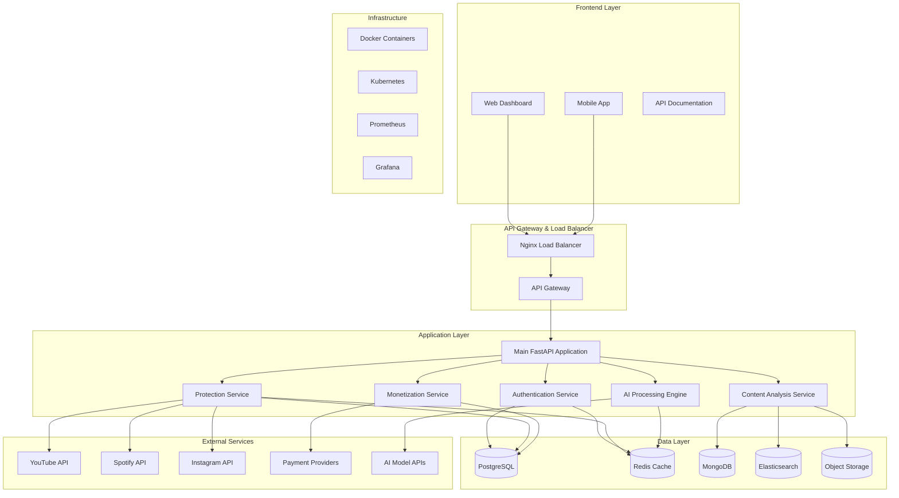
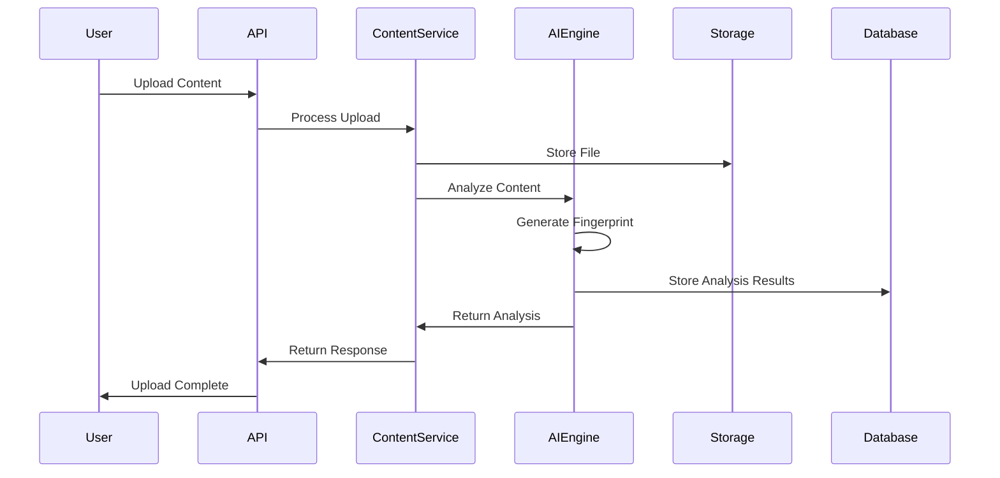
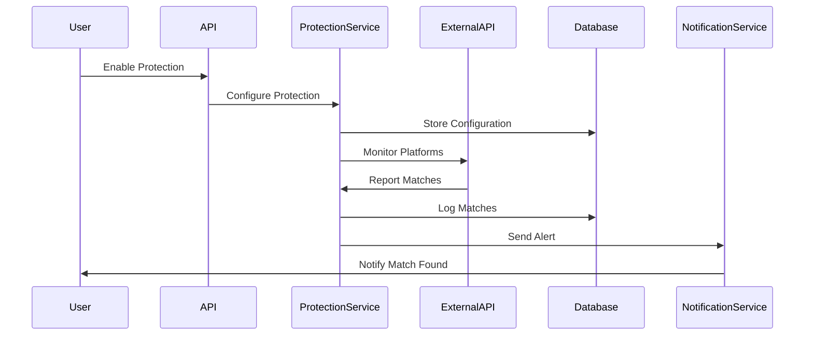

# Ainflue Platform Architecture

## Overview

Ainflue is an AI-powered content protection and monetization platform built with modern microservices architecture. The platform provides comprehensive content analysis, protection, and revenue optimization capabilities.

## System Architecture



## Core Components

### 1. API Layer

- **FastAPI Application**: Main REST API with OpenAPI documentation
- **Authentication Service**: JWT-based authentication and authorization
- **Rate Limiting**: Redis-based rate limiting for API endpoints
- **CORS Middleware**: Cross-origin resource sharing configuration

### 2. Business Logic Layer

#### Content Analysis Service
- AI-powered content fingerprinting
- Multi-format content support (audio, video, text, images)
- Metadata extraction and enrichment
- Content similarity detection

#### Protection Service
- Multi-platform content monitoring
- Automated takedown request generation
- Real-time infringement detection
- Custom protection rules engine

#### Monetization Service
- Dynamic pricing algorithms
- License management system
- Revenue tracking and analytics
- Payment processing integration

#### AI Engine
- Machine learning model orchestration
- Content classification and tagging
- Sentiment analysis and trend detection
- Predictive analytics for content performance

### 3. Data Layer

#### PostgreSQL (Primary Database)
- User accounts and authentication
- Content metadata and relationships
- Financial transactions and licensing
- System configuration and settings

#### Redis (Cache & Session Store)
- Session management
- API response caching
- Real-time data caching
- Background job queues

#### MongoDB (Document Store)
- Content fingerprints and signatures
- AI model outputs and predictions
- Large-scale analytics data
- Log aggregation

#### Elasticsearch (Search Engine)
- Full-text content search
- Advanced analytics queries
- Real-time monitoring dashboards
- Audit log searching

#### Object Storage (S3-compatible)
- Original content files
- Processed media assets
- Backup archives
- Static assets and thumbnails

## Technology Stack

### Backend
- **Framework**: FastAPI (Python 3.12+)
- **ASGI Server**: Uvicorn with Gunicorn workers
- **Task Queue**: Celery with Redis broker
- **ORM**: SQLAlchemy with Alembic migrations
- **Caching**: Redis with async support
- **Validation**: Pydantic v2 with type hints

### AI/ML
- **ML Framework**: PyTorch / TensorFlow
- **NLP**: spaCy, transformers, OpenAI GPT
- **Computer Vision**: OpenCV, PIL, scikit-image
- **Audio Processing**: librosa, pydub
- **Vector Database**: FAISS, Pinecone

### Infrastructure
- **Containerization**: Docker with multi-stage builds
- **Orchestration**: Docker Compose (dev), Kubernetes (prod)
- **Web Server**: Nginx (reverse proxy, static files)
- **Monitoring**: Prometheus + Grafana
- **Logging**: Structured logging with ELK stack

### Development Tools
- **Testing**: pytest with async support
- **Code Quality**: Black, isort, flake8, mypy
- **Documentation**: MkDocs with OpenAPI integration
- **CI/CD**: GitHub Actions
- **Pre-commit Hooks**: Automated code quality checks

## Data Flow

### Content Upload and Analysis


### Content Protection Workflow


## Security Architecture

### Authentication & Authorization
- JWT-based authentication with refresh tokens
- Role-based access control (RBAC)
- API key authentication for third-party integrations
- OAuth2 integration with major platforms

### Data Protection
- Encryption at rest using AES-256
- TLS 1.3 for data in transit
- Personal data anonymization
- GDPR compliance measures

### API Security
- Rate limiting per user and endpoint
- Input validation and sanitization
- SQL injection prevention
- CORS configuration for web clients

## Scalability & Performance

### Horizontal Scaling
- Stateless application design
- Database read replicas
- Redis cluster for high availability
- CDN for static asset delivery

### Caching Strategy
- Multi-level caching (Redis, application, CDN)
- Cache invalidation strategies
- Content-aware caching policies
- Edge caching for global performance

### Background Processing
- Async task processing with Celery
- Priority-based job queues
- Retry mechanisms with exponential backoff
- Dead letter queues for failed jobs

## Monitoring & Observability

### Application Monitoring
- Health check endpoints
- Performance metrics with Prometheus
- Custom business metrics
- Real-time alerting with Grafana

### Logging
- Structured JSON logging
- Centralized log aggregation
- Error tracking with Sentry
- Audit trails for compliance

### Tracing
- Distributed tracing with OpenTelemetry
- Request correlation IDs
- Performance bottleneck identification
- Service dependency mapping

## Deployment Architecture

### Development Environment
```yaml
Environment: Docker Compose
Services: All-in-one local setup
Database: Local PostgreSQL, Redis, MongoDB
Monitoring: Local Prometheus/Grafana
```

### Staging Environment
```yaml
Environment: Kubernetes (minikube/kind)
Services: Microservices with service discovery
Database: Managed cloud databases
Monitoring: Full observability stack
```

### Production Environment
```yaml
Environment: Kubernetes cluster
Services: Auto-scaling microservices
Database: High-availability clusters
Monitoring: Enterprise monitoring solution
CDN: Global content delivery
```

## API Design Principles

### RESTful Design
- Resource-based URLs
- HTTP verbs for actions
- Consistent response formats
- Proper status codes

### Documentation
- OpenAPI 3.0 specification
- Interactive Swagger UI
- Code examples in multiple languages
- Versioning strategy

### Error Handling
- Standardized error responses
- Detailed error codes
- Localized error messages
- Graceful degradation

## Development Workflow

### Local Development
1. Clone repository
2. Run `./scripts/dev/setup.sh`
3. Start with `docker-compose up`
4. Access docs at http://localhost:8000/docs

### Testing Strategy
- Unit tests for business logic
- Integration tests for API endpoints
- End-to-end tests for critical workflows
- Performance tests for scalability

### Code Quality
- Automated code formatting
- Static type checking
- Security vulnerability scanning
- Test coverage requirements

## Future Enhancements

### Planned Features
- GraphQL API support
- Real-time WebSocket connections
- Blockchain-based licensing
- Advanced AI model training
- Mobile SDK development

### Scalability Improvements
- Microservices decomposition
- Event-driven architecture
- CQRS pattern implementation
- Multi-region deployment

---

**Last Updated**: 2024-01-01  
**Version**: 2.0.0  
**Author**: Fahed Mlaiel (mlaiel@live.de)