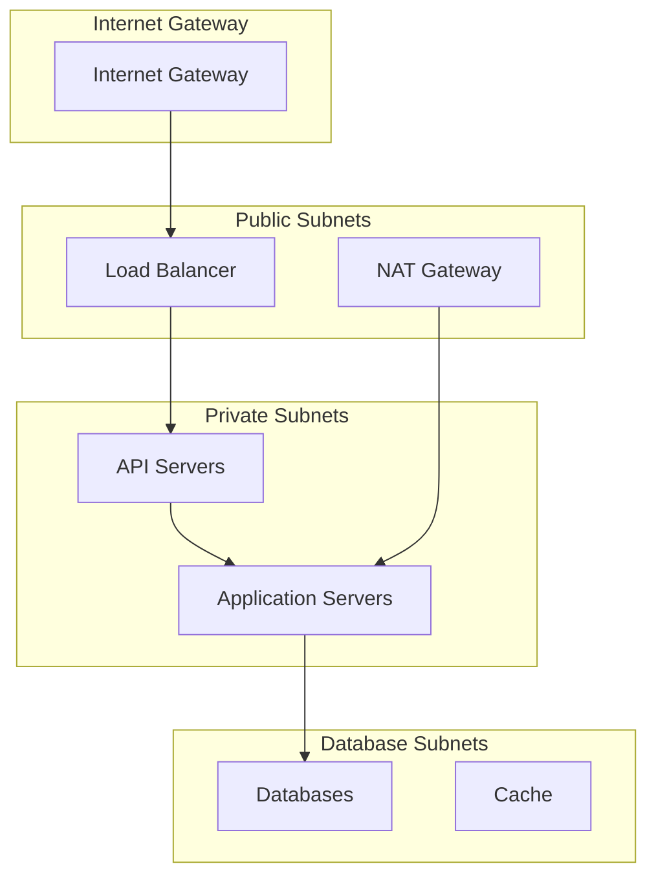

# 🔒 Ainflue Platform Security Guide

## Comprehensive Security Framework

**Version:** 2.0.0  
**Author:** Fahed Mlaiel (mlaiel@live.de)  
**Classification:** Enterprise Security Standards  
**Last Updated:** September 2025

---

## 📋 Executive Summary

This document establishes the comprehensive security framework for the Ainflue AI-powered content protection and monetization platform. Our security policy ensures the protection of creator content, user data, and platform integrity through enterprise-grade security controls and industry best practices.

## 🎯 Security Objectives

### Primary Security Goals
1. **Confidentiality**: Protect sensitive creator content and user data
2. **Integrity**: Ensure data accuracy and prevent unauthorized modifications
3. **Availability**: Maintain 99.99% platform uptime and service accessibility
4. **Compliance**: Meet GDPR, CCPA, SOC2, and ISO27001 requirements
5. **Creator Protection**: Safeguard intellectual property and revenue streams

### Security Metrics
- **Zero Data Breaches**: No unauthorized access to user or content data
- **< 15 seconds**: Incident detection and initial response time
- **99.99% Uptime**: Security system availability guarantee
- **100% Encryption**: All data encrypted in transit and at rest
- **Continuous Monitoring**: 24/7 security operations center (SOC)

## 🏗️ Security Architecture

### Defense in Depth Strategy
```
┌─────────────────────────────────────────────────────────────┐
│                    USER ACCESS LAYER                       │
│              Multi-Factor Authentication                    │
├─────────────────────────────────────────────────────────────┤
│                   APPLICATION LAYER                        │
│         JWT/OAuth2 + API Rate Limiting + WAF              │
├─────────────────────────────────────────────────────────────┤
│                   NETWORK LAYER                            │
│           VPC + Security Groups + Load Balancers          │
├─────────────────────────────────────────────────────────────┤
│                    DATA LAYER                              │
│         AES-256 Encryption + Access Controls + Audit      │
├─────────────────────────────────────────────────────────────┤
│                 INFRASTRUCTURE LAYER                       │
│        Container Security + OS Hardening + Monitoring     │
└─────────────────────────────────────────────────────────────┘
```

### Security Components

**1. Identity & Access Management (IAM)**
- Multi-factor authentication (MFA)
- Role-based access control (RBAC)
- OAuth2 and JWT token management
- Session management and timeout controls

**2. Network Security**
- Virtual Private Cloud (VPC) isolation
- Security groups and network ACLs
- Web Application Firewall (WAF)
- DDoS protection and rate limiting

**3. Data Protection**
- AES-256 encryption at rest
- TLS 1.3 encryption in transit
- Field-level encryption for sensitive data
- Key management and rotation

**4. Application Security**
- Input validation and sanitization
- SQL injection prevention
- Cross-site scripting (XSS) protection
- Cross-site request forgery (CSRF) protection

## 🔐 Authentication & Authorization

### Multi-Factor Authentication (MFA)

**Required for:**
- All user accounts
- Administrative access
- API key generation
- Sensitive operations

**Supported Methods:**
- TOTP authenticator apps (Google Authenticator, Authy)
- SMS-based verification
- Email-based verification
- Hardware security keys (FIDO2/WebAuthn)

```python
# MFA Implementation Example
@require_mfa
async def upload_content(user: User, content: ContentData):
    """Content upload requires MFA verification"""
    if not user.mfa_verified:
        raise AuthenticationError("MFA verification required")
    
    return await process_content_upload(content)
```

### Role-Based Access Control (RBAC)

**User Roles:**
- **Creator**: Upload content, manage protection, view analytics
- **Brand**: Access collaboration features, campaign management
- **Admin**: Platform administration, user management
- **Support**: Customer support functions, limited data access

**Permission Matrix:**
```yaml
creator:
  - content:read,write,delete
  - protection:read,write
  - analytics:read
  - collaboration:read,write

brand:
  - collaboration:read,write
  - campaigns:read,write
  - analytics:read

admin:
  - users:read,write,delete
  - system:read,write
  - audit:read

support:
  - users:read
  - tickets:read,write
  - logs:read
```

### JWT Token Security

**Token Configuration:**
- **Access Token Lifetime**: 1 hour
- **Refresh Token Lifetime**: 30 days
- **Algorithm**: RS256 (RSA + SHA-256)
- **Key Rotation**: Every 90 days

```python
# JWT Security Implementation
JWT_SETTINGS = {
    "algorithm": "RS256",
    "access_token_expire_minutes": 60,
    "refresh_token_expire_days": 30,
    "issuer": "api.ainflue.com",
    "audience": "ainflue-platform"
}
```

## 🛡️ Data Protection

### Encryption Standards

**Data at Rest:**
- **Algorithm**: AES-256-GCM
- **Key Management**: AWS KMS / Azure Key Vault
- **Scope**: Database, file storage, backups

**Data in Transit:**
- **Protocol**: TLS 1.3
- **Cipher Suites**: ECDHE-RSA-AES256-GCM-SHA384
- **Certificate**: RSA 2048-bit or ECDSA P-256

**Field-Level Encryption:**
```python
# Sensitive data encryption
class EncryptedField:
    def __init__(self, value: str):
        self.encrypted_value = encrypt_aes_256(value, get_field_key())
    
    def decrypt(self) -> str:
        return decrypt_aes_256(self.encrypted_value, get_field_key())

# Usage for sensitive fields
class User(BaseModel):
    email: str
    payment_info: EncryptedField  # Encrypted at field level
    api_keys: EncryptedField      # Encrypted at field level
```

### Data Classification

**Public Data:**
- Marketing content
- Public documentation
- General platform information

**Internal Data:**
- User analytics (aggregated)
- System metrics
- Internal documentation

**Confidential Data:**
- User personal information
- Content fingerprints
- Revenue data
- API keys and tokens

**Restricted Data:**
- Payment information
- Authentication credentials
- Audit logs
- Security configurations

### Privacy Controls

**GDPR Compliance:**
- Data minimization principles
- Purpose limitation
- Consent management
- Right to be forgotten
- Data portability

**Data Retention:**
- User data: Retained while account is active + 30 days
- Content data: Retained per user settings (default: 2 years)
- Audit logs: 7 years retention
- Backups: 90 days retention

## 🌐 Network Security

### VPC Architecture



### Security Groups Configuration

**Web Tier Security Group:**
```yaml
ingress:
  - port: 443
    protocol: HTTPS
    source: 0.0.0.0/0
  - port: 80
    protocol: HTTP
    source: 0.0.0.0/0 (redirect to HTTPS)

egress:
  - port: all
    protocol: all
    destination: app-tier-sg
```

**Application Tier Security Group:**
```yaml
ingress:
  - port: 8000
    protocol: HTTP
    source: web-tier-sg
  - port: 22
    protocol: SSH
    source: bastion-sg

egress:
  - port: 5432
    protocol: TCP
    destination: db-tier-sg
  - port: 6379
    protocol: TCP
    destination: cache-tier-sg
```

### Web Application Firewall (WAF)

**Protection Rules:**
- SQL injection protection
- Cross-site scripting (XSS) protection
- Rate limiting (1000 requests/hour per IP)
- Geographic blocking (if required)
- Known bad IP blocking

```yaml
# WAF Configuration
waf_rules:
  - name: SQLInjectionRule
    type: sql_injection
    action: block
    
  - name: XSSRule
    type: xss
    action: block
    
  - name: RateLimitRule
    type: rate_limit
    limit: 1000
    window: 3600
    action: throttle
```

## 🔒 Application Security

### Input Validation

**Validation Framework:**
```python
from pydantic import BaseModel, validator
from typing import Optional

class ContentUpload(BaseModel):
    title: str
    description: Optional[str] = None
    tags: List[str] = []
    
    @validator('title')
    def validate_title(cls, v):
        if not v or len(v.strip()) == 0:
            raise ValueError('Title cannot be empty')
        if len(v) > 200:
            raise ValueError('Title too long')
        # Sanitize HTML/script tags
        return sanitize_html(v)
    
    @validator('tags')
    def validate_tags(cls, v):
        if len(v) > 10:
            raise ValueError('Too many tags')
        return [sanitize_html(tag) for tag in v]
```

### SQL Injection Prevention

**Parameterized Queries:**
```python
# Safe database queries
async def get_user_content(user_id: str, content_type: str):
    query = """
    SELECT id, title, created_at 
    FROM content 
    WHERE user_id = $1 AND content_type = $2
    """
    return await database.fetch_all(query, user_id, content_type)

# Never use string formatting for queries
# BAD: f"SELECT * FROM users WHERE id = {user_id}"
# GOOD: "SELECT * FROM users WHERE id = $1", user_id
```

### Cross-Site Scripting (XSS) Protection

**Content Security Policy (CSP):**
```http
Content-Security-Policy: 
  default-src 'self';
  script-src 'self' 'unsafe-inline' https://trusted-cdn.com;
  style-src 'self' 'unsafe-inline';
  img-src 'self' data: https:;
  connect-src 'self' https://api.ainflue.com;
  frame-ancestors 'none';
```

**Output Encoding:**
```python
import html
from markupsafe import escape

def safe_render(content: str) -> str:
    """Safely render user content"""
    return escape(content)

def safe_html(content: str) -> str:
    """Sanitize HTML content"""
    allowed_tags = ['p', 'br', 'strong', 'em']
    return bleach.clean(content, tags=allowed_tags)
```

## 🚨 Incident Response Framework

### Response Team Structure
- **Incident Commander**: Overall coordination and decision-making
- **Security Analyst**: Technical investigation and threat analysis
- **System Administrator**: System isolation and recovery
- **Communications Lead**: Internal and external communications
- **Legal Counsel**: Compliance and regulatory guidance

### Incident Classification

**Severity Levels:**

**P0 - Critical:**
- Data breach affecting user data
- Complete system compromise
- Ransomware attack
- Payment system compromise

**P1 - High:**
- Service disruption affecting >50% of users
- Unauthorized access to admin systems
- DDoS attack causing service degradation

**P2 - Medium:**
- Isolated security vulnerability
- Suspicious activity detected
- Failed intrusion attempt

**P3 - Low:**
- Policy violations
- Non-critical security findings
- Awareness and training issues

### Response Procedures

**Immediate Response (0-15 minutes):**
1. Detect and confirm incident
2. Activate incident response team
3. Initial containment measures
4. Document all actions

**Short-term Response (15 minutes - 4 hours):**
1. Full system assessment
2. Evidence preservation
3. Communication with stakeholders
4. Continue containment efforts

**Recovery Phase (4-24 hours):**
1. System restoration
2. Security patches application
3. Monitoring enhancement
4. Post-incident review

## 🔍 Security Monitoring & Logging

### Security Information and Event Management (SIEM)

**Log Sources:**
- Application logs
- System logs
- Network traffic logs
- Database audit logs
- Authentication logs

**Alert Rules:**
```yaml
security_alerts:
  - name: "Multiple Failed Logins"
    condition: "failed_login_count > 5 in 10 minutes"
    severity: "medium"
    action: "lock_account"
  
  - name: "Unusual API Usage"
    condition: "api_requests > 1000 in 1 minute"
    severity: "high"
    action: "rate_limit"
  
  - name: "Admin Access"
    condition: "admin_login = true"
    severity: "low"
    action: "notify"
```

### Audit Logging

**Audit Events:**
- User authentication and authorization
- Data access and modifications
- Administrative actions
- System configuration changes
- Security events

**Log Format:**
```json
{
  "timestamp": "2025-09-03T10:00:00Z",
  "event_type": "user_login",
  "user_id": "uuid",
  "ip_address": "192.168.1.100",
  "user_agent": "Mozilla/5.0...",
  "outcome": "success",
  "risk_score": 1,
  "additional_data": {
    "mfa_used": true,
    "location": "Germany"
  }
}
```

### Threat Detection

**Behavioral Analytics:**
- Unusual login patterns
- Abnormal data access patterns
- Suspicious API usage
- Geographic anomalies

**Machine Learning Models:**
- User behavior profiling
- Anomaly detection
- Risk scoring
- Threat classification

## 🛠️ Security Tools & Technologies

### Security Stack

**Identity & Access Management:**
- Auth0 / AWS Cognito
- OAuth2 / OpenID Connect
- JWT token management
- MFA providers

**Vulnerability Management:**
- OWASP ZAP
- Nessus / Qualys
- Static code analysis (SonarQube)
- Dependency scanning (Snyk)

**Monitoring & Detection:**
- Splunk / ELK Stack
- Prometheus + Grafana
- AWS CloudTrail
- Custom alerting systems

**Encryption & Key Management:**
- AWS KMS / Azure Key Vault
- HashiCorp Vault
- Let's Encrypt
- Custom encryption libraries

## 📋 Compliance Framework

### GDPR Compliance

**Data Processing Principles:**
- Lawfulness, fairness, and transparency
- Purpose limitation
- Data minimization
- Accuracy
- Storage limitation
- Integrity and confidentiality

**User Rights Implementation:**
- Right to access: User dashboard with data export
- Right to rectification: Profile update functionality
- Right to erasure: Account deletion with data purging
- Right to portability: Data export in machine-readable format

### SOC2 Compliance

**Trust Service Criteria:**
- **Security**: Protection against unauthorized access
- **Availability**: System operation as committed
- **Processing Integrity**: System processing completeness
- **Confidentiality**: Information designated as confidential
- **Privacy**: Personal information collection and use

## 🧪 Security Testing

### Penetration Testing

**Testing Schedule:**
- Annual external penetration testing
- Quarterly internal assessments
- Ad-hoc testing for major releases
- Continuous automated scanning

**Testing Scope:**
- Web application security
- API security testing
- Network infrastructure
- Social engineering resistance

### Vulnerability Assessment

**Automated Scanning:**
- Daily dependency vulnerability scans
- Weekly infrastructure scans
- Monthly full application scans
- Continuous code analysis

**Manual Testing:**
- Code review for security issues
- Configuration audits
- Access control testing
- Business logic testing

## 📞 Security Contacts

### Security Team

**Chief Security Officer:** Fahed Mlaiel  
**Email:** security@ainflue.com  
**Emergency Hotline:** +49-XXX-XXX-XXXX (24/7)

### Reporting Security Issues

**Security Bug Bounty:**
- Responsible disclosure policy
- Reward program for valid findings
- Coordinated vulnerability disclosure

**Contact Methods:**
- **Email:** security@ainflue.com
- **PGP Key:** Available on website
- **Response Time:** 24 hours for critical issues

---

## 🔄 Security Maintenance

### Regular Security Tasks

**Daily:**
- Security alert review
- Vulnerability scan analysis
- Incident response readiness check

**Weekly:**
- Security metrics review
- Access review audits
- Backup verification

**Monthly:**
- Security training updates
- Policy review and updates
- Risk assessment updates

**Quarterly:**
- Penetration testing
- Business continuity testing
- Security architecture review

**Annually:**
- Comprehensive security audit
- Policy and procedure overhaul
- Security awareness training

---

**© 2025 Fahed Mlaiel - All Rights Reserved**  
**Ainflue Platform - Enterprise Security Guide**

For security inquiries and incident reporting: security@ainflue.com