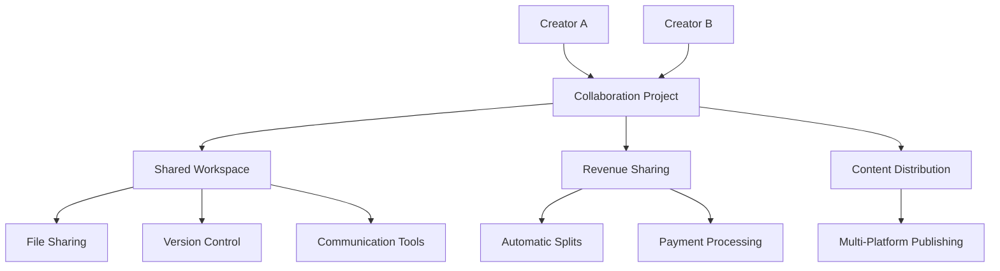

# 🤝 Ainflue Collaboration Guide

## Complete Guide to Creator Collaboration

**Platform:** Ainflue AI-Powered Collaboration Hub  
**Version:** 2.0.0  
**Author:** Fahed Mlaiel (mlaiel@live.de)  
**Last Updated:** September 2025

---

## 📋 Table of Contents

1. [Introduction to Collaboration](#introduction-to-collaboration)
2. [Types of Collaboration](#types-of-collaboration)
3. [Finding Collaboration Partners](#finding-collaboration-partners)
4. [Collaboration Workflow](#collaboration-workflow)
5. [Project Management Tools](#project-management-tools)
6. [Revenue Sharing & Contracts](#revenue-sharing--contracts)
7. [Communication & Coordination](#communication--coordination)
8. [Legal & Rights Management](#legal--rights-management)
9. [Success Strategies](#success-strategies)
10. [Troubleshooting](#troubleshooting)

---

## 🌟 Introduction to Collaboration

### Why Collaborate on Ainflue?

**Benefits for Creators:**
- **Expanded Reach**: Access to partner's audience
- **Skill Sharing**: Learn from other creators
- **Creative Synergy**: Combine unique talents
- **Resource Pooling**: Share tools and equipment
- **Revenue Growth**: Multiple monetization streams
- **Network Building**: Long-term professional relationships

**Ainflue's Collaboration Advantage:**
- AI-powered partner matching
- Automated revenue sharing
- Built-in project management
- Legal framework and contracts
- Real-time collaboration tools
- Cross-platform content distribution

### Collaboration Ecosystem



---

## 🎭 Types of Collaboration

### Music Collaborations

**1. Remixes & Reimaginations**
- Electronic music remixes
- Acoustic reimaginations
- Genre crossover versions
- Cultural fusion adaptations

**2. Featured Collaborations**
- Vocal features on tracks
- Instrumental contributions
- Producer collaborations
- Guest appearances

**3. Co-Creation Projects**
- Joint songwriting sessions
- Shared production work
- Concept album projects
- Cross-cultural music fusion

**Example Configuration:**
```python
music_collaboration = {
    "type": "remix",
    "original_content": "content_id_123",
    "collaboration_style": "electronic_remix",
    "contributors": [
        {
            "creator": "original_artist",
            "role": "songwriter",
            "contribution_percentage": 60
        },
        {
            "creator": "remix_artist", 
            "role": "producer",
            "contribution_percentage": 40
        }
    ],
    "timeline": {
        "start_date": "2025-09-15",
        "delivery_date": "2025-10-15",
        "release_date": "2025-11-01"
    }
}
```

### Video Content Collaborations

**1. Cross-Channel Features**
- Guest appearances
- Channel takeovers
- Interview series
- Reaction videos

**2. Joint Productions**
- Documentary projects
- Music video collaborations
- Educational content
- Entertainment series

**3. Live Streaming Collaborations**
- Joint live streams
- Gaming collaborations
- Talk show formats
- Interactive performances

### Creative Content Collaborations

**1. Visual Art Projects**
- Album artwork collaborations
- Promotional material design
- Merchandise creation
- Digital art series

**2. Writing Collaborations**
- Lyric writing partnerships
- Blog post collaborations
- Book writing projects
- Content creation

**3. Photography & Videography**
- Event documentation
- Promotional content
- Behind-the-scenes footage
- Professional photoshoots

---

## 🔍 Finding Collaboration Partners

### AI-Powered Partner Matching

**Compatibility Algorithm:**
```python
def calculate_collaboration_score(creator_a, creator_b):
    """
    AI algorithm for collaboration compatibility
    """
    scores = {
        "style_compatibility": analyze_content_similarity(creator_a, creator_b),
        "audience_overlap": calculate_audience_intersection(creator_a, creator_b),
        "collaboration_history": get_success_rate(creator_a, creator_b),
        "communication_compatibility": assess_work_styles(creator_a, creator_b),
        "schedule_alignment": check_availability_overlap(creator_a, creator_b)
    }
    
    weighted_score = (
        scores["style_compatibility"] * 0.25 +
        scores["audience_overlap"] * 0.20 +
        scores["collaboration_history"] * 0.25 +
        scores["communication_compatibility"] * 0.15 +
        scores["schedule_alignment"] * 0.15
    )
    
    return weighted_score
```

**Matching Criteria:**

**Musical Compatibility:**
- Genre preferences and styles
- Tempo and key preferences
- Production techniques
- Vocal range compatibility
- Instrumental skills

**Audience Analysis:**
- Geographic location overlap
- Age demographics
- Interest categories
- Platform preferences
- Engagement patterns

**Professional Compatibility:**
- Experience level
- Collaboration history
- Work schedule preferences
- Communication style
- Project commitment level

### Search and Discovery Tools

**Advanced Search Filters:**
```python
search_filters = {
    "genre": ["electronic", "indie", "jazz"],
    "location": {
        "radius": 50,  # miles
        "city": "Berlin",
        "remote_ok": True
    },
    "experience_level": ["intermediate", "professional"],
    "collaboration_type": ["remix", "feature", "co-write"],
    "availability": {
        "immediate": False,
        "within_month": True,
        "project_duration": "2-4 weeks"
    },
    "language": ["English", "German", "French"]
}
```

**Browse Recommendations:**
- **Trending Creators**: Popular collaboration partners
- **Similar Styles**: AI-curated matches based on your content
- **Local Creators**: Geographic proximity
- **Cross-Genre**: Opportunities for style fusion
- **Skill Complementary**: Partners with complementary skills

### Creator Profiles

**Collaboration Profile Elements:**
```yaml
creator_profile:
  basic_info:
    username: "MusicProducer123"
    display_name: "Alex Music"
    location: "Berlin, Germany"
    languages: ["English", "German"]
    
  collaboration_preferences:
    types: ["remix", "original", "feature"]
    genres: ["electronic", "ambient", "downtempo"]
    remote_collaboration: true
    equipment_sharing: false
    
  experience:
    years_active: 5
    collaboration_count: 23
    success_rate: 0.87
    average_project_duration: "3 weeks"
    
  portfolio:
    featured_tracks: ["track_id_1", "track_id_2"]
    collaboration_examples: ["collab_id_1", "collab_id_2"]
    
  availability:
    current_status: "available"
    next_available: "2025-09-20"
    preferred_timeline: "2-4 weeks"
```

---

## 🔄 Collaboration Workflow

### Project Initiation

**Step 1: Send Collaboration Request**
```python
collaboration_request = {
    "target_creator": "partner_username",
    "project_type": "remix",
    "content_reference": "original_content_id",
    "proposal": {
        "concept": "Electronic remix with atmospheric elements",
        "timeline": {
            "start_date": "2025-09-15",
            "milestone_dates": [
                {"phase": "draft", "date": "2025-09-25"},
                {"phase": "revision", "date": "2025-10-05"},
                {"phase": "final", "date": "2025-10-15"}
            ]
        },
        "revenue_split": 50,
        "creative_control": "shared",
        "credits": "Featured remix by [Partner Name]"
    },
    "message": "Hi! I love your atmospheric production style and think it would work perfectly with this track. Interested in collaborating?"
}
```

**Step 2: Negotiation & Agreement**
```python
negotiation_process = {
    "initial_proposal": collaboration_request,
    "counter_offers": [
        {
            "field": "revenue_split",
            "original": 50,
            "counter": 60,
            "reason": "Original composition contribution"
        },
        {
            "field": "timeline",
            "adjustment": "+1 week",
            "reason": "Quality assurance and additional mixing time"
        }
    ],
    "final_agreement": {
        "revenue_split": 55,  # Negotiated middle ground
        "timeline_adjustment": "+1 week",
        "additional_terms": "Both parties retain right to use in live performances"
    }
}
```

**Step 3: Contract Generation**
Smart contracts are automatically generated based on agreed terms:
```python
collaboration_contract = {
    "parties": ["creator_a_id", "creator_b_id"],
    "project_details": {
        "title": "Atmospheric Remix Project",
        "original_content": "content_id_123",
        "collaboration_type": "remix"
    },
    "terms": {
        "revenue_sharing": {
            "creator_a": 0.55,
            "creator_b": 0.45
        },
        "credit_sharing": {
            "primary_artist": "creator_a",
            "featured_artist": "creator_b",
            "credits_format": "Original by {creator_a}, Remix by {creator_b}"
        },
        "rights_management": {
            "copyright_owner": "shared",
            "licensing_rights": "both_parties",
            "termination_clause": "30_days_notice"
        }
    },
    "timeline": {
        "start_date": "2025-09-15",
        "milestones": [...],
        "final_delivery": "2025-10-22"
    }
}
```

### Project Phases

**Phase 1: Planning & Setup (Week 1)**
- Project workspace creation
- File sharing setup
- Communication channel establishment
- Milestone definition
- Resource allocation

**Phase 2: Creative Development (Weeks 2-3)**
- Initial draft creation
- Collaborative editing
- Feedback exchange
- Iterative improvements
- Version control management

**Phase 3: Finalization (Week 4)**
- Final mixing and mastering
- Quality assurance
- Metadata completion
- Distribution preparation
- Release coordination

---

## 🛠️ Project Management Tools

### Shared Workspace

**Features:**
- **File Storage**: Centralized project files
- **Version Control**: Track changes and revisions
- **Access Control**: Permission-based sharing
- **Backup & Recovery**: Automatic project backups
- **Integration**: Direct platform publishing

**Workspace Structure:**
```
Project: Atmospheric Remix
├── Audio Files/
│   ├── Stems/
│   │   ├── vocals.wav
│   │   ├── drums.wav
│   │   ├── bass.wav
│   │   └── melody.wav
│   ├── Work-in-Progress/
│   │   ├── draft_v1.mp3
│   │   ├── draft_v2.mp3
│   │   └── draft_final.mp3
│   └── Final/
│       ├── master.wav
│       └── master.mp3
├── Project Files/
│   ├── logic_project.logicx
│   ├── ableton_project.als
│   └── notes.txt
├── Artwork/
│   ├── cover_concepts/
│   └── final_artwork.jpg
└── Documentation/
    ├── collaboration_agreement.pdf
    ├── credits.txt
    └── release_notes.md
```

### Communication Tools

**Built-in Messaging:**
```python
message_system = {
    "real_time_chat": True,
    "file_attachments": True,
    "voice_messages": True,
    "video_calls": "integrated_jitsi",
    "screen_sharing": True,
    "message_history": "unlimited",
    "notification_settings": {
        "email": True,
        "push": True,
        "sms": False
    }
}
```

**Collaboration Features:**
- **Comments on Files**: Timestamped feedback on audio/video
- **Annotation Tools**: Visual markup for images and videos
- **Task Assignment**: Assign specific tasks to collaborators
- **Progress Tracking**: Visual project completion status
- **Deadline Reminders**: Automatic notifications

### Version Control

**Audio Version Management:**
```python
version_control = {
    "current_version": "v3.2",
    "version_history": [
        {
            "version": "v1.0",
            "date": "2025-09-15",
            "author": "creator_a",
            "changes": "Initial composition and arrangement"
        },
        {
            "version": "v2.0", 
            "date": "2025-09-20",
            "author": "creator_b",
            "changes": "Added atmospheric elements and ambient textures"
        },
        {
            "version": "v3.0",
            "date": "2025-09-25",
            "author": "creator_a",
            "changes": "Refined mixing and added vocal processing"
        },
        {
            "version": "v3.2",
            "date": "2025-09-27",
            "author": "creator_b", 
            "changes": "Final mastering and level adjustments"
        }
    ],
    "branching": {
        "main": "v3.2",
        "experimental": "v3.1-experimental",
        "backup": "v2.5-stable"
    }
}
```

---

## 💰 Revenue Sharing & Contracts

### Smart Revenue Sharing

**Automatic Distribution:**
```python
revenue_sharing_engine = {
    "calculation_method": "real_time",
    "distribution_frequency": "daily",
    "minimum_payout": 1.00,  # USD
    "supported_currencies": ["USD", "EUR", "GBP"],
    "platform_integration": [
        "youtube_ad_revenue",
        "spotify_streaming",
        "licensing_deals",
        "merchandise_sales"
    ]
}

def calculate_revenue_split(total_revenue, collaboration_terms):
    """
    Calculate revenue split based on collaboration agreement
    """
    splits = {}
    for creator_id, percentage in collaboration_terms["revenue_sharing"].items():
        creator_amount = total_revenue * percentage
        platform_fee = creator_amount * 0.05  # 5% platform fee
        final_amount = creator_amount - platform_fee
        
        splits[creator_id] = {
            "gross_amount": creator_amount,
            "platform_fee": platform_fee,
            "net_amount": final_amount
        }
    
    return splits
```

### Revenue Stream Types

**1. Streaming Revenue**
- **Spotify**: Per-stream royalties
- **Apple Music**: Subscription-based revenue
- **YouTube Music**: Ad and subscription revenue
- **SoundCloud**: Creator fund payments

**2. Licensing Revenue**
- **Sync Licensing**: TV, film, advertising
- **Commercial Use**: Brand partnerships
- **Sample Licensing**: Other creators using your work
- **Cover Licensing**: Cover versions and remixes

**3. Direct Sales**
- **Digital Downloads**: High-quality file sales
- **Merchandise**: Physical products
- **Concert Tickets**: Live performance revenue
- **Fan Support**: Patreon, tips, donations

### Contract Templates

**Standard Remix Collaboration:**
```yaml
remix_collaboration_contract:
  project_type: "remix"
  revenue_split:
    original_artist: 60%
    remix_artist: 40%
  
  rights:
    copyright: "shared"
    performance_rights: "both_parties"
    sync_licensing: "joint_approval_required"
    
  credits:
    format: "{original_title} (Remix by {remix_artist})"
    placement: "all_platforms"
    
  term_length: "perpetual"
  termination: "30_days_written_notice"
  
  distribution:
    platforms: "all_major_streaming_platforms"
    release_date: "mutually_agreed"
    promotional_requirements: "equal_effort"
```

**Co-Creation Partnership:**
```yaml
co_creation_contract:
  project_type: "original_collaboration"
  revenue_split:
    creator_a: 50%
    creator_b: 50%
    
  contribution_breakdown:
    songwriter: "both_parties"
    producer: "both_parties"
    performer: "both_parties"
    
  rights:
    copyright: "joint_ownership"
    publishing: "equal_share"
    master_recording: "joint_ownership"
    
  creative_control:
    final_approval: "both_parties_required"
    artistic_direction: "collaborative_decision"
    
  exclusivity:
    duration: "none"
    scope: "this_project_only"
```

---

## 💬 Communication & Coordination

### Communication Best Practices

**1. Clear Expectations**
```python
communication_guidelines = {
    "response_time": {
        "urgent": "within_2_hours",
        "normal": "within_24_hours",
        "non_urgent": "within_48_hours"
    },
    "preferred_channels": {
        "quick_questions": "chat",
        "detailed_feedback": "voice_message",
        "complex_discussions": "video_call",
        "file_reviews": "annotated_comments"
    },
    "timezone_consideration": True,
    "language_preferences": ["English", "German"]
}
```

**2. Structured Feedback**
```python
feedback_template = {
    "timestamp": "2:45 - 3:10",
    "type": "suggestion",
    "priority": "medium",
    "description": "The bass line in this section could use more emphasis",
    "suggestion": "Try boosting the low-mid frequencies around 200Hz",
    "reference": "Similar to the style in track XYZ",
    "category": "mixing"
}
```

**3. Regular Check-ins**
- **Weekly Progress Reviews**: Status updates and planning
- **Milestone Meetings**: Major phase completions
- **Creative Sessions**: Real-time collaborative work
- **Final Review**: Pre-release quality assurance

### Conflict Resolution

**Common Issues and Solutions:**

**Creative Differences:**
```python
creative_conflict_resolution = {
    "issue": "Different vision for final direction",
    "resolution_steps": [
        "Document both perspectives clearly",
        "Create test versions of both approaches", 
        "Get external feedback from trusted sources",
        "Find compromise solution or alternate approaches",
        "If unresolvable, establish decision-making authority"
    ],
    "prevention": "Detailed creative brief and mood boards upfront"
}
```

**Timeline Conflicts:**
```python
timeline_conflict_resolution = {
    "issue": "Missed deadlines affecting other commitments",
    "resolution_steps": [
        "Assess realistic completion timeline",
        "Identify bottlenecks and resource needs",
        "Adjust scope if necessary",
        "Communicate with all affected parties",
        "Implement buffer time in future projects"
    ],
    "prevention": "Conservative timeline estimates with built-in buffers"
}
```

### Multi-Language Support

**Language Features:**
- **Real-time Translation**: Chat message translation
- **Voice Message Transcription**: Speech-to-text in multiple languages
- **Document Translation**: Project documentation
- **Cultural Context Assistance**: AI-powered cultural sensitivity

---

## ⚖️ Legal & Rights Management

### Intellectual Property Protection

**Copyright Management:**
```python
copyright_framework = {
    "original_works": {
        "ownership": "creator",
        "collaboration_rights": "as_agreed_in_contract",
        "licensing": "creator_controlled"
    },
    "collaborative_works": {
        "ownership": "joint_or_split_as_agreed",
        "decision_making": "mutual_consent_required",
        "licensing": "joint_approval_required"
    },
    "derivative_works": {
        "original_artist_approval": "required",
        "revenue_sharing": "as_per_agreement",
        "attribution": "mandatory"
    }
}
```

**Digital Rights Management:**
- **Content Fingerprinting**: Automatic protection for collaborations
- **Usage Tracking**: Monitor where collaborative content appears
- **Takedown Automation**: Protect against unauthorized use
- **Licensing Verification**: Ensure proper usage permissions

### Legal Compliance

**Platform Compliance:**
- **YouTube Content ID**: Automatic registration
- **Spotify Rights Management**: Publishing metadata
- **Instagram Music Guidelines**: Commercial use compliance
- **TikTok Commercial Music**: Licensing requirements

**International Rights:**
- **Performance Rights Organizations**: BMI, ASCAP, PRS, GEMA
- **Mechanical Rights**: Digital distribution licensing
- **Sync Rights**: Audio-visual synchronization
- **Master Rights**: Recording ownership and control

### Dispute Resolution

**Built-in Mediation:**
```python
dispute_resolution_process = {
    "step_1": {
        "method": "direct_negotiation",
        "timeframe": "14_days",
        "platform_support": "mediation_tools"
    },
    "step_2": {
        "method": "professional_mediation",
        "timeframe": "30_days", 
        "cost": "shared_equally"
    },
    "step_3": {
        "method": "arbitration",
        "timeframe": "60_days",
        "binding": True,
        "jurisdiction": "agreed_upon_location"
    }
}
```

---

## 🚀 Success Strategies

### Building Long-term Partnerships

**1. Relationship Development**
```python
partnership_building = {
    "initial_projects": "small_scale_tests",
    "trust_building": "deliver_on_commitments",
    "communication": "regular_and_transparent",
    "mutual_benefit": "ensure_win_win_outcomes",
    "expansion": "gradually_increase_project_scope"
}
```

**2. Network Effect**
- **Reputation Building**: Successful collaborations improve matching
- **Referral Network**: Partners recommend you to their network
- **Cross-Pollination**: Diverse collaborations expand your style
- **Industry Connections**: Access to broader creative community

### Maximizing Collaboration Impact

**1. Audience Cross-Pollination**
```python
audience_strategy = {
    "pre_release": {
        "teaser_content": "behind_scenes_collaboration",
        "cross_promotion": "both_channels_announce",
        "audience_preparation": "introduce_collaborator"
    },
    "release": {
        "simultaneous_posting": "coordinated_launch",
        "shared_hashtags": "#collaborativeartist",
        "cross_platform_sharing": "all_social_media"
    },
    "post_release": {
        "collaboration_story": "process_documentation",
        "future_hints": "potential_ongoing_projects",
        "audience_integration": "encourage_cross_following"
    }
}
```

**2. Creative Growth**
- **Skill Development**: Learn new techniques from partners
- **Style Evolution**: Incorporate new influences
- **Technical Knowledge**: Share equipment and software expertise
- **Industry Insights**: Understand different market segments

### Scaling Collaboration Business

**1. Portfolio Approach**
```python
collaboration_portfolio = {
    "active_projects": 3,  # Maximum simultaneous projects
    "project_types": {
        "quick_remixes": 2,      # 1-2 week projects
        "major_collaborations": 1 # 4-6 week projects  
    },
    "partner_diversity": {
        "genre_variety": True,
        "experience_levels": "mix_of_beginner_and_expert",
        "geographic_distribution": "international"
    }
}
```

**2. Collaboration Specialization**
- **Niche Expertise**: Become known for specific collaboration types
- **Quality Standards**: Maintain high standards for partner selection
- **Brand Development**: Build reputation as collaborative artist
- **Educational Content**: Share collaboration knowledge and processes

---

## 🔧 Troubleshooting

### Common Collaboration Issues

**1. Communication Breakdowns**
```python
communication_issues = {
    "symptoms": [
        "delayed_responses",
        "misunderstood_requirements", 
        "conflicting_expectations"
    ],
    "solutions": [
        "establish_communication_schedule",
        "use_structured_feedback_templates",
        "clarify_expectations_in_writing",
        "schedule_regular_video_calls"
    ],
    "prevention": [
        "detailed_project_brief",
        "communication_style_discussion",
        "timezone_coordination",
        "backup_communication_methods"
    ]
}
```

**2. Creative Direction Conflicts**
```python
creative_conflicts = {
    "symptoms": [
        "disagreement_on_style",
        "conflicting_artistic_vision",
        "different_quality_standards"
    ],
    "solutions": [
        "create_multiple_versions",
        "seek_external_perspective",
        "compromise_on_elements",
        "define_decision_making_process"
    ],
    "prevention": [
        "detailed_creative_brief",
        "reference_track_sharing",
        "mood_board_creation",
        "test_collaboration_first"
    ]
}
```

**3. Technical Issues**
```python
technical_problems = {
    "file_compatibility": {
        "issue": "different_software_versions",
        "solution": "standardize_export_formats"
    },
    "quality_differences": {
        "issue": "varying_recording_quality",
        "solution": "establish_minimum_standards"
    },
    "workflow_mismatch": {
        "issue": "different_working_methods",
        "solution": "agree_on_common_process"
    }
}
```

### Getting Support

**Platform Support:**
- **Collaboration Specialists**: Expert guidance on partnership issues
- **Technical Support**: Help with workspace and tool issues
- **Legal Guidance**: Basic legal question assistance
- **Mediation Services**: Conflict resolution support

**Community Resources:**
- **Creator Forums**: Peer advice and support
- **Success Stories**: Learn from successful collaborations
- **Best Practices Guides**: Detailed how-to documentation
- **Webinar Series**: Regular educational content

**Emergency Procedures:**
```python
emergency_support = {
    "urgent_issues": {
        "response_time": "2_hours",
        "contact": "emergency@ainflue.com",
        "escalation": "automatic_to_senior_team"
    },
    "collaboration_disputes": {
        "immediate_mediation": "available",
        "temporary_project_pause": "if_necessary",
        "legal_consultation": "if_required"
    }
}
```

---

## 📈 Measuring Collaboration Success

### Key Performance Indicators (KPIs)

**Creative Metrics:**
```python
creative_success_metrics = {
    "project_completion_rate": 0.95,  # 95% of started projects completed
    "partner_satisfaction": 4.7,      # Average rating out of 5
    "creative_growth": "measurable_skill_development",
    "innovation_index": "new_techniques_learned_per_project"
}
```

**Business Metrics:**
```python
business_success_metrics = {
    "revenue_growth": {
        "collaborative_vs_solo": "+45%",
        "per_project_roi": "3.2x",
        "licensing_opportunities": "+200%"
    },
    "audience_metrics": {
        "cross_pollination_rate": "15%",
        "engagement_increase": "+30%",
        "follower_growth": "+25%"
    },
    "network_growth": {
        "partnership_network_size": 25,
        "repeat_collaboration_rate": "60%",
        "referral_rate": "40%"
    }
}
```

### Success Analytics Dashboard

**Real-time Collaboration Analytics:**
- Project completion rates
- Partner satisfaction scores
- Revenue attribution from collaborations
- Audience growth from partnerships
- Cross-platform performance metrics

---

## 🎉 Next Steps

### Getting Started with Collaboration
1. **Complete your collaboration profile** - Showcase your style and preferences
2. **Explore the partner directory** - Find creators that match your interests
3. **Start with a small project** - Test compatibility with a simple collaboration
4. **Build your reputation** - Complete projects successfully and gather reviews
5. **Scale your collaboration network** - Expand to multiple ongoing partnerships

### Advanced Collaboration Strategies
1. **Develop signature collaboration styles** - Build reputation for specific types
2. **Create collaboration series** - Ongoing partnerships with multiple releases
3. **Cross-industry partnerships** - Work with brands, media, and other industries
4. **Mentor new creators** - Build relationships while giving back to community
5. **Launch collaboration initiatives** - Organize multi-creator projects

---

**© 2025 Fahed Mlaiel - All Rights Reserved**  
**Ainflue Platform - Complete Collaboration Guide**

**Ready to start collaborating?**  
Join the Ainflue collaboration community at [https://app.ainflue.com/collaborate](https://app.ainflue.com/collaborate) or contact our collaboration specialists at mlaiel@live.de for personalized partnership guidance.