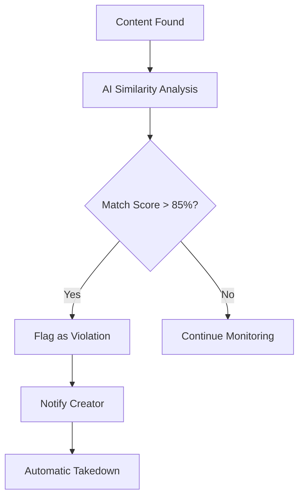

# 🎨 Ainflue Creator Guide

## Complete Guide for Digital Creators

**Platform:** Ainflue AI-Powered Content Protection & Monetization  
**Version:** 2.0.0  
**Author:** Fahed Mlaiel (mlaiel@live.de)  
**Last Updated:** September 2025

---

## 📋 Table of Contents

1. [Getting Started as a Creator](#getting-started-as-a-creator)
2. [Content Upload & Management](#content-upload--management)
3. [AI Content Protection](#ai-content-protection)
4. [Monetization Strategies](#monetization-strategies)
5. [Analytics & Insights](#analytics--insights)
6. [Collaboration Features](#collaboration-features)
7. [Creator Tools & Features](#creator-tools--features)
8. [Best Practices](#best-practices)
9. [Troubleshooting](#troubleshooting)
10. [Success Stories](#success-stories)

---

## 🚀 Getting Started as a Creator

### Account Setup

**1. Create Your Creator Account**
- Visit [https://app.ainflue.com/register](https://app.ainflue.com/register)
- Select "Creator" as your account type
- Complete email verification
- Set up multi-factor authentication (MFA)

**2. Complete Your Profile**
```
Profile Information:
✓ Creator name/stage name
✓ Bio and description
✓ Genre/category (music, video, art, writing, etc.)
✓ Social media links
✓ Location (optional)
✓ Profile picture and banner
```

**3. Choose Your Subscription Plan**

| Feature | Free | Premium | Enterprise |
|---------|------|---------|------------|
| Storage | 100MB | 10GB | Unlimited |
| Uploads/Month | 10 | Unlimited | Unlimited |
| Protection Monitoring | Basic | Advanced | Premium |
| Analytics | Basic | Detailed | Advanced |
| Revenue Tracking | ✓ | ✓ | ✓ |
| Priority Support | - | ✓ | ✓ |
| API Access | - | ✓ | ✓ |

### Creator Dashboard Overview

**Main Dashboard Sections:**
- **Overview**: Quick stats and recent activity
- **Content Library**: All your uploaded content
- **Protection Status**: Real-time monitoring results
- **Revenue Tracking**: Earnings and analytics
- **Collaboration Hub**: Partnership opportunities
- **Settings**: Account and preference management

---

## 📁 Content Upload & Management

### Supported Content Types

**Audio Content:**
- **Formats**: MP3, FLAC, WAV, AAC, OGG
- **Quality**: Up to 192kHz/32-bit
- **Max Size**: 500MB per file
- **Batch Upload**: Up to 20 files simultaneously

**Video Content:**
- **Formats**: MP4, WebM, AVI, MOV, MKV
- **Quality**: Up to 8K/60fps
- **Max Size**: 5GB per file
- **Streaming**: Direct platform integration

**Image Content:**
- **Formats**: JPEG, PNG, WebP, AVIF, TIFF
- **Quality**: Up to 100MP resolution
- **Max Size**: 50MB per file
- **Portfolios**: Organized galleries

**Text Content:**
- **Formats**: TXT, MD, PDF, DOCX
- **Features**: Rich text editor
- **Versioning**: Track changes and revisions
- **Collaboration**: Real-time editing

### Upload Process

**Step 1: Upload Your Content**
```bash
# Via Web Interface
1. Click "Upload Content" button
2. Drag & drop files or select from browser
3. Add metadata (title, description, tags)
4. Select protection level
5. Choose monetization options
6. Click "Process Upload"

# Via API (for developers)
curl -X POST "https://api.ainflue.com/v1/content/upload" \
  -H "Authorization: Bearer YOUR_TOKEN" \
  -F "file=@your_content.mp3" \
  -F "metadata={\"title\":\"My Song\",\"protection_level\":\"high\"}"
```

**Step 2: AI Analysis**
The system automatically:
- Generates unique content fingerprint
- Extracts metadata and tags
- Analyzes content quality
- Sets up protection monitoring
- Initializes revenue tracking

**Step 3: Content Management**
- Edit metadata and descriptions
- Update protection settings
- Configure monetization options
- Set collaboration permissions
- Schedule content releases

### Content Organization

**Folders and Collections:**
```
My Content/
├── Music/
│   ├── Albums/
│   │   ├── Summer 2025/
│   │   └── Collaborations/
│   └── Singles/
├── Videos/
│   ├── Music Videos/
│   └── Behind the Scenes/
└── Artwork/
    ├── Album Covers/
    └── Promotional/
```

**Tagging System:**
- **Genre tags**: #electronic #jazz #rock #hiphop
- **Mood tags**: #energetic #chill #romantic #dark
- **Instrument tags**: #guitar #piano #vocals #drums
- **Custom tags**: #original #remix #collaboration

---

## 🛡️ AI Content Protection

### How AI Protection Works

**1. Content Fingerprinting**
```
Original Content → AI Analysis → Unique Fingerprint
                                      ↓
                            Protected Database Storage
```

**2. Platform Monitoring**
- **YouTube**: Video and audio monitoring
- **Spotify**: Audio track monitoring
- **Instagram**: Image and video monitoring
- **TikTok**: Short-form video monitoring
- **SoundCloud**: Audio content monitoring

**3. Violation Detection**


### Protection Levels

**Basic Protection:**
- Platform monitoring every 24 hours
- 85% similarity threshold
- Manual takedown requests
- Email notifications

**Advanced Protection:**
- Platform monitoring every 6 hours
- 80% similarity threshold
- Automatic DMCA takedowns
- Real-time notifications
- Advanced analytics

**Premium Protection:**
- Platform monitoring every hour
- 75% similarity threshold
- Instant takedown automation
- Multi-platform coordination
- Legal support integration

### Setting Up Protection

**1. Enable Protection**
```python
# Protection configuration
protection_settings = {
    "monitoring_frequency": "hourly",  # hourly, 6hours, daily
    "similarity_threshold": 0.80,      # 0.75-0.95 range
    "auto_takedown": True,             # automatic or manual
    "platforms": [                     # select platforms
        "youtube",
        "spotify", 
        "instagram",
        "tiktok"
    ],
    "notifications": {
        "email": True,
        "sms": False,
        "webhook": "https://your-app.com/webhook"
    }
}
```

**2. Monitor Protection Status**
- Real-time dashboard updates
- Violation alerts and notifications
- Takedown success tracking
- Platform response monitoring

**3. Handle Violations**
```
Violation Detected → Creator Notified → Review Evidence → Take Action
                                           ↓
                    [Ignore] [Manual Takedown] [Automatic DMCA]
```

---

## 💰 Monetization Strategies

### Revenue Streams

**1. Direct Platform Monetization**
- **YouTube**: Ad revenue sharing
- **Spotify**: Streaming royalties
- **Instagram**: Creator fund
- **TikTok**: Creator fund
- **Patreon**: Subscription revenue

**2. Content Licensing**
- **Sync Licensing**: Music for media
- **Commercial Use**: Brand partnerships
- **Educational Use**: Platform licensing
- **Remix Rights**: Collaborative licensing

**3. Premium Content**
- **Exclusive Releases**: Fan subscriptions
- **Early Access**: Premium tier content
- **High-Quality Downloads**: Lossless formats
- **Behind-the-Scenes**: Bonus content

### Setting Up Monetization

**1. Connect Revenue Streams**
```python
# Revenue stream configuration
monetization_config = {
    "platforms": {
        "youtube": {
            "enabled": True,
            "channel_id": "your_channel_id",
            "revenue_share": 0.55  # YouTube's standard rate
        },
        "spotify": {
            "enabled": True,
            "artist_id": "your_artist_id",
            "estimated_per_stream": 0.003
        }
    },
    "licensing": {
        "sync_licensing": True,
        "commercial_use": True,
        "remix_rights": True,
        "base_rate": 50.00  # USD per license
    }
}
```

**2. Revenue Tracking**
- Real-time earnings dashboard
- Platform-specific breakdowns
- Growth trend analysis
- Payout schedule management

**3. Optimization Recommendations**
```
AI-Powered Suggestions:
✓ Best upload times for maximum reach
✓ Trending genres and styles
✓ Collaboration opportunities
✓ Pricing optimization for licensing
✓ Cross-platform promotion strategies
```

### Payment Processing

**Supported Payment Methods:**
- **Bank Transfer**: ACH (US), SEPA (EU)
- **PayPal**: Global instant transfers
- **Wise**: International transfers
- **Cryptocurrency**: Bitcoin, Ethereum

**Payout Schedule:**
- **Minimum Threshold**: $50 USD
- **Automatic Payouts**: Monthly (1st of each month)
- **Instant Payouts**: Available for Premium+ users
- **Tax Documentation**: Automatic 1099/tax forms

---

## 📊 Analytics & Insights

### Creator Analytics Dashboard

**Performance Metrics:**
- **Views/Plays**: Cross-platform aggregation
- **Engagement Rate**: Likes, shares, comments
- **Revenue Growth**: Month-over-month tracking
- **Audience Demographics**: Age, location, interests
- **Content Performance**: Top-performing content

**Protection Analytics:**
- **Violations Detected**: Count and trend analysis
- **Takedown Success Rate**: Platform-specific rates
- **Protection ROI**: Revenue protected vs. cost
- **Risk Assessment**: Vulnerability analysis

### AI-Powered Insights

**Content Optimization:**
```python
insights = {
    "best_upload_time": "Tuesday 2-4 PM EST",
    "trending_genres": ["lo-fi hip hop", "indie electronic"],
    "collaboration_opportunities": [
        {
            "creator": "ArtistName",
            "compatibility_score": 0.92,
            "estimated_reach_increase": "25%"
        }
    ],
    "monetization_suggestions": [
        "Enable sync licensing for increased revenue",
        "Consider premium tier for exclusive content"
    ]
}
```

**Audience Analysis:**
- **Geographic Distribution**: Top countries/regions
- **Device Usage**: Mobile vs. desktop consumption
- **Listening Habits**: Peak times and duration
- **Discovery Sources**: How users find your content

### Custom Reports

**Automated Reports:**
- Weekly performance summary
- Monthly revenue report
- Quarterly growth analysis
- Annual tax documentation

**Custom Dashboards:**
- Create personalized metric views
- Set up automated alerts
- Export data for external analysis
- Share reports with team members

---

## 🤝 Collaboration Features

### Finding Collaboration Partners

**AI-Powered Matching:**
```python
collaboration_match = {
    "recommended_creators": [
        {
            "name": "MusicProducer123",
            "genre_compatibility": 0.89,
            "audience_overlap": 0.34,
            "collaboration_history": "successful",
            "estimated_impact": "+15% reach"
        }
    ],
    "match_criteria": [
        "Similar music style",
        "Complementary audience",
        "High collaboration success rate"
    ]
}
```

**Search and Filter:**
- **Genre Preferences**: Find creators in your style
- **Geographic Location**: Local collaboration opportunities
- **Subscriber Count**: Match with similar-sized creators
- **Collaboration Type**: Remix, feature, co-write, etc.

### Collaboration Workflow

**1. Send Collaboration Request**
```json
{
  "target_creator": "creator_username",
  "collaboration_type": "remix",
  "content_reference": "content_id",
  "proposal": {
    "revenue_split": 50,
    "creative_control": "shared",
    "deadline": "2025-10-15",
    "terms": "Equal collaboration with shared credits"
  }
}
```

**2. Negotiate Terms**
- Revenue splitting (percentage-based)
- Creative control and credits
- Timeline and deadlines
- Promotional responsibilities
- Rights and licensing

**3. Manage Projects**
- Shared workspace creation
- File sharing and versioning
- Progress tracking milestones
- Communication tools
- Final delivery and distribution

### Revenue Sharing

**Smart Contracts:**
```python
collaboration_contract = {
    "parties": ["creator_a", "creator_b"],
    "revenue_split": {
        "creator_a": 0.60,
        "creator_b": 0.40
    },
    "split_method": "proportional_to_contribution",
    "automatic_distribution": True,
    "minimum_payout": 10.00
}
```

---

## 🛠️ Creator Tools & Features

### Content Creation Tools

**Audio Tools:**
- **AI Mastering**: Automatic audio enhancement
- **Noise Reduction**: Clean up recordings
- **Format Conversion**: Multi-format export
- **Metadata Editor**: Comprehensive tag management

**Video Tools:**
- **Thumbnail Generator**: AI-powered thumbnails
- **Video Optimization**: Platform-specific encoding
- **Subtitle Generation**: Automatic transcription
- **Preview Generator**: Social media previews

**Text Tools:**
- **Grammar Check**: AI-powered proofreading
- **SEO Optimization**: Keyword suggestions
- **Translation**: Multi-language support
- **Format Conversion**: Export to various formats

### Automation Features

**Smart Upload Scheduling:**
```python
upload_schedule = {
    "content_id": "new_song_id",
    "schedule": {
        "youtube": "2025-09-15T14:00:00Z",
        "spotify": "2025-09-15T12:00:00Z",
        "instagram": "2025-09-15T16:00:00Z"
    },
    "cross_promotion": True,
    "auto_protection": True
}
```

**Bulk Operations:**
- Batch upload processing
- Mass metadata updates
- Bulk protection enabling
- Group monetization settings

### API Integration

**Developer Access:**
```python
import ainflue

# Initialize API client
client = ainflue.Client(api_key="your_api_key")

# Upload content programmatically
upload_result = client.content.upload(
    file_path="my_song.mp3",
    metadata={
        "title": "My New Song",
        "genre": "electronic",
        "protection_level": "high"
    }
)

# Monitor protection status
protection_status = client.protection.get_status(
    content_id=upload_result.content_id
)
```

---

## ✨ Best Practices

### Content Strategy

**1. Consistent Branding**
- Use consistent naming conventions
- Maintain visual brand identity
- Develop signature style/sound
- Cross-platform brand consistency

**2. Quality Over Quantity**
- Focus on high-quality content
- Regular but sustainable upload schedule
- Professional metadata and descriptions
- Proper file organization

**3. Audience Engagement**
- Respond to comments and feedback
- Create behind-the-scenes content
- Share creation process insights
- Build community around your work

### Protection Best Practices

**1. Immediate Protection**
```
Upload Content → Enable Protection → Monitor Results
     ↓               ↓                    ↓
  (0 minutes)    (5 minutes)         (24 hours)
```

**2. Metadata Optimization**
- Detailed, accurate descriptions
- Comprehensive tagging
- Copyright information
- Original creation dates

**3. Regular Monitoring**
- Check protection dashboard weekly
- Review violation reports promptly
- Update protection settings as needed
- Maintain evidence documentation

### Monetization Optimization

**1. Diversify Revenue Streams**
- Multiple platform presence
- Various content types
- Licensing opportunities
- Collaboration projects

**2. Audience Development**
- Cross-platform promotion
- Engagement-focused content
- Community building
- Regular content schedule

**3. Data-Driven Decisions**
- Analyze performance metrics
- Test different content types
- Optimize upload timing
- Track ROI on protection

---

## 🔧 Troubleshooting

### Common Issues

**Upload Problems:**
```
Issue: "Upload failed - file too large"
Solution: 
1. Check file size limits for your plan
2. Compress file if possible
3. Upgrade plan for larger limits
4. Contact support for assistance
```

**Protection Issues:**
```
Issue: "False positive violation detected"
Solution:
1. Review violation details
2. Verify content ownership
3. Adjust similarity threshold
4. Contact support if needed
```

**Revenue Tracking:**
```
Issue: "Revenue not showing correctly"
Solution:
1. Verify platform connections
2. Check payout schedules
3. Review revenue sharing settings
4. Contact platform directly if needed
```

### Getting Help

**Self-Service Resources:**
- Knowledge base: [docs.ainflue.com](https://docs.ainflue.com)
- Video tutorials: [tutorials.ainflue.com](https://tutorials.ainflue.com)
- Community forum: [community.ainflue.com](https://community.ainflue.com)

**Direct Support:**
- **Email**: support@ainflue.com
- **Live Chat**: Available 9 AM - 6 PM EST
- **Priority Support**: Premium/Enterprise users
- **Emergency Contact**: For critical issues

---

## 🏆 Success Stories

### Case Study 1: Independent Musician

**Background:** Solo artist with 50K followers
**Challenge:** Widespread content theft affecting revenue
**Solution:** Implemented Ainflue protection + monetization
**Results:**
- 89% reduction in unauthorized content
- 340% increase in legitimate revenue
- 25% growth in audience reach

### Case Study 2: Content Creator Collective

**Background:** 5-person creative team
**Challenge:** Managing collaborative projects and revenue
**Solution:** Used Ainflue collaboration tools
**Results:**
- Streamlined project management
- Fair automatic revenue distribution
- 50% increase in collaborative projects

### Case Study 3: Brand Partnership

**Background:** Musician seeking brand collaborations
**Challenge:** Proving content authenticity and reach
**Solution:** Ainflue analytics and protection verification
**Results:**
- Secured 3 major brand partnerships
- 200% increase in licensing revenue
- Established industry credibility

---

## 📈 Next Steps

### Immediate Actions
1. **Complete your profile** - Fill out all creator information
2. **Upload your first content** - Start with your best work
3. **Enable protection** - Secure your intellectual property
4. **Set up monetization** - Connect revenue streams
5. **Explore collaborations** - Find creative partners

### Growth Strategy
1. **Analyze performance** - Use analytics to optimize
2. **Expand content types** - Diversify your portfolio
3. **Build audience** - Focus on engagement and community
4. **Scale protection** - Upgrade as your content grows
5. **Leverage partnerships** - Collaborate for mutual growth

### Advanced Features
1. **API integration** - Automate your workflow
2. **Custom branding** - White-label solutions
3. **Enterprise features** - Advanced analytics and support
4. **Global expansion** - Multi-language and region support

---

**© 2025 Fahed Mlaiel - All Rights Reserved**  
**Ainflue Platform - Creator Success Guide**

**Ready to start your creator journey?**  
Sign up at [https://app.ainflue.com](https://app.ainflue.com) or contact us at mlaiel@live.de for personalized guidance.