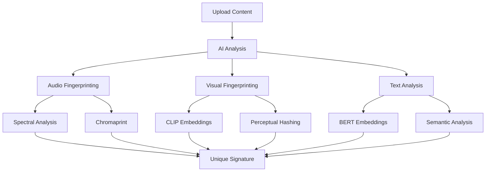

# 🎯 Ainflue Feature Guides

## Comprehensive Feature Documentation

**Platform:** Ainflue AI-Powered Content Protection & Monetization  
**Version:** 2.0.0  
**Author:** Fahed Mlaiel (mlaiel@live.de)  
**Last Updated:** September 2025

---

## 📋 Feature Guide Categories

### 🛡️ [AI Content Protection](#ai-content-protection)
### 📊 [Analytics & Insights](#analytics--insights)
### 🔍 [Platform Monitoring](#platform-monitoring)
### 💰 [Revenue Optimization](#revenue-optimization)
### 🤝 [Collaboration Tools](#collaboration-tools)
### 🌍 [Multi-Language Features](#multi-language-features)
### 📱 [Mobile Features](#mobile-features)
### 🔌 [API & Integrations](#api--integrations)
### 🎨 [Content Management](#content-management)
### 🔒 [Security Features](#security-features)

---

## 🛡️ AI Content Protection

### Advanced Fingerprinting Technology

**How It Works:**
Our AI creates unique digital signatures for your content using multiple algorithms:



**Audio Fingerprinting Features:**
- **Chromaprint Technology:** Industry-standard audio fingerprinting
- **Spectral Analysis:** Frequency domain signature creation
- **Tempo Independence:** Detects slowed/sped content
- **Quality Tolerance:** Works with compressed versions
- **Remix Detection:** Identifies modified versions

**Video Fingerprinting Features:**
- **Frame Analysis:** Per-frame signature generation
- **Object Detection:** Identifies key visual elements
- **Motion Tracking:** Temporal sequence analysis
- **Color Histogram:** Visual composition analysis
- **Scene Boundary Detection:** Segment-based protection

**Image Protection Features:**
- **Perceptual Hashing:** Robust to compression and resizing
- **CLIP Embeddings:** Deep learning visual understanding
- **Feature Extraction:** Key visual element identification
- **Transformation Resistance:** Detects rotated/cropped versions
- **Art Style Analysis:** Protects artistic compositions

**Text Content Protection:**
- **BERT Embeddings:** Semantic meaning preservation
- **Plagiarism Detection:** Paraphrasing and rewriting detection
- **Language Analysis:** Multi-language content protection
- **Style Fingerprinting:** Writing style identification
- **Citation Tracking:** Reference and attribution monitoring

### Protection Configuration

**Setting Up Protection:**

**1. Basic Protection Setup**
```
Steps:
1. Upload your content
2. Wait for fingerprinting completion
3. Enable monitoring toggle
4. Select platforms to monitor
5. Configure alert preferences
```

**2. Advanced Protection Settings**
```
Custom Fingerprinting:
- Sensitivity levels (High, Medium, Low)
- Quality thresholds (70%, 85%, 95%)
- Detection confidence scoring
- Platform-specific rules
- Content type optimization
```

**3. Whitelist Management**
```
Authorized Use Cases:
- Approved collaborators
- Licensed platforms
- Educational use
- Review and commentary
- Temporary permissions
```

### Real-Time Monitoring

**Monitoring Capabilities:**
- **24/7 Scanning:** Continuous platform monitoring
- **Real-Time Alerts:** Instant violation notifications
- **Evidence Collection:** Automatic screenshot capture
- **Metadata Preservation:** Timestamp and source tracking
- **Chain of Custody:** Legal evidence documentation

**Alert Configuration:**
```
Alert Types:
1. Immediate: SMS/Email for high-confidence matches
2. Daily Digest: Summary of all violations
3. Weekly Report: Comprehensive protection overview
4. Custom Triggers: Specific platform or content alerts
```

---

## 📊 Analytics & Insights

### Comprehensive Dashboard

**Key Metrics Overview:**
- **Protection Status:** Files protected vs. unprotected
- **Violation Trends:** Detection patterns over time
- **Platform Distribution:** Where violations occur most
- **Revenue Impact:** Financial effect of violations
- **Content Performance:** Most/least protected content

**Advanced Analytics Features:**

**1. Violation Pattern Analysis**
```
Insights Provided:
- Peak violation times
- Geographic violation distribution
- Platform-specific violation rates
- Content type vulnerability analysis
- Violator behavior patterns
```

**2. Revenue Impact Tracking**
```
Financial Analytics:
- Lost revenue calculations
- Protection ROI analysis
- Platform-specific earnings
- Violation cost assessment
- Recovery success rates
```

**3. Content Performance Metrics**
```
Performance Indicators:
- View/engagement ratios
- Viral potential scoring
- Platform optimization suggestions
- Audience demographics
- Content lifecycle analysis
```

### Custom Reporting

**Report Types Available:**
- **Executive Summary:** High-level overview for stakeholders
- **Detailed Analytics:** In-depth violation and revenue analysis
- **Platform-Specific:** Individual platform performance
- **Collaborative Reports:** Multi-creator project insights
- **Compliance Reports:** Legal and regulatory documentation

**Report Customization:**
```
Customizable Elements:
- Date ranges and time periods
- Platform selection
- Content categories
- Violation types
- Revenue streams
- Geographic regions
```

**Automated Reports:**
```
Scheduling Options:
- Daily morning summaries
- Weekly comprehensive reports
- Monthly business reviews
- Quarterly trend analysis
- Annual performance reports
```

---

## 🔍 Platform Monitoring

### Multi-Platform Coverage

**Social Media Platforms:**
- **YouTube:** Videos, shorts, live streams, community posts
- **Instagram:** Posts, stories, reels, IGTV
- **TikTok:** Videos, sounds, effects
- **Twitter:** Tweets, videos, images, spaces
- **Facebook:** Posts, videos, stories, marketplace
- **LinkedIn:** Articles, videos, posts, documents

**Music Platforms:**
- **Spotify:** Tracks, playlists, podcasts
- **Apple Music:** Songs, albums, playlists
- **SoundCloud:** Tracks, sets, playlists
- **Bandcamp:** Albums, tracks, merchandise
- **YouTube Music:** Official and user content
- **Amazon Music:** Streaming and purchase tracking

**Content Platforms:**
- **Vimeo:** Videos, live streams
- **Dailymotion:** Video content
- **Twitch:** Streams, clips, highlights
- **OnlyFans:** Subscriber content
- **Patreon:** Creator posts and content
- **Medium:** Articles and publications

### Custom Platform Integration

**Adding New Platforms:**
```
Integration Process:
1. Platform API analysis
2. Custom crawler development
3. Fingerprint matching implementation
4. Alert system integration
5. Testing and validation
```

**Enterprise Platform Support:**
- **Corporate Intranets:** Internal content monitoring
- **Educational Platforms:** Academic content protection
- **Gaming Platforms:** Gameplay and asset protection
- **Streaming Services:** Video and audio content
- **Marketplace Monitoring:** Product and description protection

---

## 💰 Revenue Optimization

### Multi-Stream Revenue Tracking

**Revenue Source Integration:**

**1. Advertising Revenue**
```
Supported Platforms:
- YouTube AdSense
- Facebook Creator Bonus
- Instagram monetization
- TikTok Creator Fund
- Twitter creator monetization
```

**2. Subscription Revenue**
```
Platform Tracking:
- Patreon subscriptions
- OnlyFans subscriptions
- YouTube memberships
- Twitch subscriptions
- Custom platform subscriptions
```

**3. Streaming Royalties**
```
Music Platform Royalties:
- Spotify: Per-stream payments
- Apple Music: Subscription revenue share
- YouTube Music: Ad revenue + subscriptions
- Amazon Music: Streaming and download royalties
- Radio airplay: Performance rights tracking
```

**4. Direct Sales**
```
Sales Channel Integration:
- Bandcamp purchases
- Digital download sales
- Physical merchandise
- Concert ticket sales
- Licensing deals
```

### Revenue Optimization Tools

**AI-Powered Insights:**
```
Optimization Suggestions:
- Best posting times for engagement
- Platform-specific content optimization
- Pricing strategy recommendations
- Collaboration opportunity identification
- Market trend analysis
```

**Performance Optimization:**
```
Revenue Enhancement:
- Cross-platform promotion strategies
- Content repurposing suggestions
- Audience growth recommendations
- Monetization feature activation
- Platform algorithm optimization
```

**Revenue Forecasting:**
```
Predictive Analytics:
- Monthly revenue projections
- Seasonal trend analysis
- Growth trajectory modeling
- Market opportunity assessment
- Investment ROI calculations
```

---

## 🤝 Collaboration Tools

### AI-Powered Creator Matching

**Matching Algorithm:**
The AI analyzes multiple factors to find ideal collaborators:

```
Compatibility Factors:
1. Content Style Analysis:
   - Musical genre compatibility
   - Visual style matching
   - Writing tone similarity
   - Production quality levels

2. Audience Analysis:
   - Demographic overlap
   - Geographic distribution
   - Interest alignment
   - Engagement patterns

3. Professional Metrics:
   - Follower count compatibility
   - Engagement rate analysis
   - Content frequency matching
   - Professional reliability scoring

4. Collaboration History:
   - Past project success rates
   - Communication effectiveness
   - Deadline compliance
   - Revenue sharing fairness
```

**Advanced Matching Features:**
- **Style Compatibility:** 95%+ accuracy in style matching
- **Audience Overlap:** Optimal audience intersection analysis
- **Success Prediction:** AI-predicted collaboration success rates
- **Geographic Matching:** Location-based collaboration opportunities
- **Language Preferences:** Multi-language creator matching

### Project Management System

**Collaborative Workspace Features:**

**1. File Management**
```
Collaborative Features:
- Real-time file sharing
- Version control system
- Comment and annotation tools
- Access permission management
- File synchronization across devices
```

**2. Communication Tools**
```
Built-in Communication:
- In-platform messaging
- Video call integration
- Voice note sharing
- Screen sharing capabilities
- Project timeline discussions
```

**3. Revenue Sharing**
```
Automated Revenue Distribution:
- Percentage-based splitting
- Performance-based allocation
- Custom agreement support
- Automatic payment processing
- Tax documentation handling
```

**4. Project Timeline**
```
Project Management:
- Milestone tracking
- Deadline management
- Task assignment
- Progress monitoring
- Completion verification
```

### Collaboration Analytics

**Success Metrics:**
```
Collaboration Performance:
- Combined audience reach
- Engagement improvement
- Revenue increase
- Long-term partnership potential
- Project completion rates
```

**Partnership Insights:**
```
Relationship Analytics:
- Communication effectiveness
- Creative compatibility
- Professional reliability
- Revenue fairness
- Future opportunity scoring
```

---

## 🌍 Multi-Language Features

### Language Support Coverage

**Supported Languages (350+):**

**Major Language Families:**
- **Indo-European:** English, Spanish, French, German, Italian, Portuguese, Russian, Hindi, Persian, Dutch, Swedish, Norwegian, Danish, Polish, Czech, Slovak, Croatian, Serbian, Bulgarian, Romanian, Greek, Albanian, Lithuanian, Latvian, Armenian, Irish, Welsh, Scottish Gaelic

**Sino-Tibetan Languages:**
- **Chinese:** Mandarin, Cantonese, Wu, Min, Hakka, Xiang, Gan
- **Tibetan Languages:** Standard Tibetan, Dzongkha, Sherpa
- **Other:** Burmese, Karen languages

**Afroasiatic Languages:**
- **Arabic Dialects:** Egyptian, Levantine, Gulf, Maghrebi, Sudanese, Iraqi
- **Amazigh/Berber:** Tamazight, Tarifit, Tashelhit, Kabyle, Chaouia, Mozabite, Tuareg variants
- **Hebrew:** Modern and Biblical Hebrew
- **Cushitic:** Amharic, Tigrinya, Oromo, Somali

**Niger-Congo Languages:**
- **Bantu:** Swahili, Zulu, Xhosa, Shona, Kikuyu, Luganda, Kinyarwanda
- **West African:** Yoruba, Igbo, Hausa, Wolof, Akan, Ewe, Fula

**Script Support:**
- **Latin Scripts:** Standard and extended Latin characters
- **Arabic Scripts:** Arabic, Persian, Urdu with proper RTL support
- **Tifinagh:** Traditional Amazigh/Berber script
- **Cyrillic:** Russian, Bulgarian, Serbian, Macedonian, Ukrainian
- **CJK Scripts:** Chinese characters (Simplified/Traditional), Japanese (Hiragana, Katakana, Kanji), Korean (Hangul)
- **Devanagari:** Hindi, Sanskrit, Marathi, Nepali
- **Other Scripts:** Thai, Hebrew, Armenian, Georgian, Malayalam, Tamil, Telugu, Kannada

### Automatic Language Detection

**Content Language Recognition:**
```
AI Detection Capabilities:
- Text language identification (99.2% accuracy)
- Audio language detection (96.8% accuracy)
- Mixed-language content handling
- Dialect recognition
- Code-switching detection
```

**Detection Features:**
- **Real-Time Detection:** Instant language identification during upload
- **Confidence Scoring:** Accuracy percentage for each detection
- **Manual Override:** User can correct automatic detection
- **Learning System:** AI improves accuracy based on user feedback
- **Multi-Language Content:** Supports content with multiple languages

### Cultural Adaptation

**Interface Localization:**
```
Cultural Elements:
- Color preferences by culture
- Layout adjustments (RTL/LTR)
- Date and time formats
- Number formatting
- Currency display
- Cultural symbols and icons
```

**Regional Features:**
- **Legal Compliance:** GDPR (EU), CCPA (California), PIPEDA (Canada)
- **Payment Methods:** Regional payment preference integration
- **Cultural Holidays:** Respect for cultural and religious observances
- **Local Business Hours:** Support schedules adapted to regions
- **Cultural Communication Styles:** Adapted notification and messaging tones

---

## 📱 Mobile Features

### iOS App Capabilities

**Core Features:**
- **Content Upload:** Camera integration, photo library access
- **Real-Time Monitoring:** Push notifications for violations
- **Revenue Tracking:** Mobile-optimized analytics dashboard
- **Collaboration:** In-app messaging and project management
- **Offline Mode:** Limited functionality without internet

**iOS-Specific Features:**
```
Apple Integration:
- Siri Shortcuts for quick actions
- Apple Watch companion app
- AirDrop content sharing
- iCloud synchronization
- Face ID/Touch ID authentication
- iOS widget for quick stats
```

**Advanced iOS Features:**
- **Background Upload:** Continue uploads when app is backgrounded
- **Live Photos Support:** Motion photo protection
- **HEIF/HEVC Support:** Modern Apple format compatibility
- **Shortcuts App Integration:** Custom workflow automation
- **Screen Time Integration:** Usage tracking and limits

### Android App Capabilities

**Core Features:**
- **Content Upload:** Camera integration, gallery access
- **Real-Time Monitoring:** Android notification system integration
- **Revenue Tracking:** Material Design analytics interface
- **Collaboration:** Native Android messaging integration
- **Offline Mode:** Cached data and limited functionality

**Android-Specific Features:**
```
Android Integration:
- Google Assistant integration
- Android Auto support
- Wear OS companion app
- Google Drive synchronization
- Biometric authentication
- Android widgets
```

**Advanced Android Features:**
- **Background Processing:** Optimized for Doze mode
- **Adaptive Battery:** Intelligent power management
- **Dynamic Shortcuts:** Context-aware quick actions
- **Picture-in-Picture:** Continue monitoring while using other apps
- **Android Share Sheet:** Native sharing integration

### Cross-Platform Synchronization

**Real-Time Sync Features:**
```
Synchronization Elements:
- Content uploads and metadata
- Protection settings and preferences
- Collaboration projects and messages
- Revenue data and analytics
- Notification settings
- Account preferences
```

**Conflict Resolution:**
```
Sync Conflict Handling:
- Timestamp-based resolution
- User preference prioritization
- Automatic merge when possible
- Manual conflict resolution UI
- Version history preservation
```

---

## 🔌 API & Integrations

### REST API Documentation

**Authentication Methods:**
```
API Authentication:
1. API Key Authentication:
   - Simple key-based access
   - Rate limiting by key
   - Scope-based permissions

2. OAuth 2.0:
   - User authorization flow
   - Refresh token support
   - Scope-based access control

3. JWT Tokens:
   - Stateless authentication
   - Custom claims support
   - Expiration handling
```

**Core Endpoints:**

**Content Management:**
```
POST /api/v2/content/upload
GET /api/v2/content/{id}
PUT /api/v2/content/{id}
DELETE /api/v2/content/{id}
GET /api/v2/content/search
```

**Protection Management:**
```
POST /api/v2/protection/enable
GET /api/v2/protection/status
GET /api/v2/violations
POST /api/v2/violations/{id}/action
```

**Revenue Tracking:**
```
GET /api/v2/revenue/summary
GET /api/v2/revenue/platforms
GET /api/v2/revenue/trends
POST /api/v2/revenue/manual-entry
```

**Collaboration:**
```
GET /api/v2/collaborators/suggestions
POST /api/v2/collaborations/invite
GET /api/v2/collaborations/{id}
PUT /api/v2/collaborations/{id}/revenue-split
```

### Webhook System

**Event Types:**
```
Available Webhooks:
- content.uploaded
- content.protected
- violation.detected
- violation.resolved
- revenue.updated
- collaboration.invited
- collaboration.accepted
- payout.processed
```

**Webhook Configuration:**
```
Setup Requirements:
1. HTTPS endpoint URL
2. Valid SSL certificate
3. Response within 30 seconds
4. Handle duplicate events
5. Verify webhook signatures
```

**Event Payload Example:**
```json
{
  "event": "violation.detected",
  "timestamp": "2025-09-03T10:30:00Z",
  "data": {
    "violation_id": "viol_123456",
    "content_id": "content_789",
    "platform": "youtube",
    "confidence": 0.95,
    "violator_url": "https://youtube.com/watch?v=abc123",
    "evidence": {
      "screenshot_url": "https://evidence.ainflue.com/screenshot_456.png",
      "metadata": {
        "upload_date": "2025-09-03T08:15:00Z",
        "views": 1250,
        "title": "Copied Content Title"
      }
    }
  },
  "signature": "sha256=abc123def456..."
}
```

### Third-Party Integrations

**Business Tools:**
```
Supported Integrations:
- Zapier: 500+ app connections
- Microsoft Power Automate: Office 365 integration
- IFTTT: Consumer automation platform
- Integromat/Make: Advanced workflow automation
- Custom integrations via API
```

**Creative Tools:**
```
Creative Software Integration:
- Adobe Creative Suite: Direct upload from Photoshop, Premiere
- Final Cut Pro: Export and protect workflow
- Logic Pro: Audio project protection
- Ableton Live: Music production integration
- Canva: Design asset protection
```

**Business Platforms:**
```
Enterprise Integration:
- Slack: Team notifications and collaboration
- Microsoft Teams: Business communication
- Google Workspace: Document and drive integration
- Dropbox Business: File sync and protection
- Box: Enterprise file management
```

---

## 🎨 Content Management

### Advanced File Organization

**Folder Structure:**
```
Organization Options:
- Hierarchical folder system
- Tag-based categorization
- Smart collections
- Date-based organization
- Project-based grouping
- Platform-specific folders
```

**Metadata Management:**
```
Content Metadata:
- Title and description
- Creation date and location
- Technical specifications
- Copyright information
- Licensing details
- Collaboration credits
- SEO optimization tags
```

**Search and Discovery:**
```
Advanced Search Features:
- Full-text search across metadata
- Filter by file type, date, size
- Tag-based filtering
- Collaboration history search
- Revenue performance search
- Protection status filtering
```

### Batch Operations

**Bulk Actions:**
```
Available Bulk Operations:
- Multi-file upload
- Batch protection enable/disable
- Bulk metadata editing
- Mass tag application
- Folder organization
- Batch deletion with safeguards
```

**Automation Rules:**
```
Automated Organization:
- Auto-tagging based on content
- Folder assignment rules
- Protection auto-enable
- Collaboration auto-invite
- Revenue split auto-setup
```

### Version Control

**File Versioning:**
```
Version Management:
- Automatic version creation on edit
- Manual version checkpoint creation
- Version comparison tools
- Rollback functionality
- Version-specific protection
- Collaboration version tracking
```

**Content Evolution Tracking:**
```
Change History:
- Edit timestamp logging
- Collaborator change attribution
- Metadata modification history
- Protection setting changes
- Revenue split modifications
```

---

## 🔒 Security Features

### Advanced Authentication

**Multi-Factor Authentication:**
```
Supported MFA Methods:
- TOTP authenticator apps (Google Authenticator, Authy)
- SMS-based verification
- Email-based verification
- Hardware security keys (FIDO2/WebAuthn)
- Biometric authentication (mobile apps)
- Backup codes for recovery
```

**Single Sign-On (SSO):**
```
Enterprise SSO Support:
- SAML 2.0 integration
- OAuth 2.0 providers
- Active Directory integration
- LDAP authentication
- Google Workspace SSO
- Microsoft Azure AD
- Custom identity providers
```

### Data Protection

**Encryption Standards:**
```
Encryption Implementation:
- AES-256 encryption at rest
- TLS 1.3 for data in transit
- End-to-end encryption for sensitive data
- Key rotation every 90 days
- Hardware security modules (HSMs)
- Zero-knowledge architecture options
```

**Privacy Controls:**
```
User Privacy Features:
- Granular data sharing controls
- Content visibility settings
- Collaboration privacy levels
- Analytics data anonymization
- Right to deletion (GDPR)
- Data portability tools
```

### Access Control

**Role-Based Permissions:**
```
Permission Levels:
- Owner: Full control over content and settings
- Collaborator: Edit and view access
- Viewer: Read-only access to specified content
- Analyst: Access to analytics without content
- Administrator: User management capabilities
```

**Content-Level Security:**
```
Granular Access Control:
- File-specific permissions
- Time-limited access grants
- IP address restrictions
- Geographic access controls
- Device-specific authentication
- Session management and timeout
```

### Compliance Features

**Regulatory Compliance:**
```
Compliance Standards:
- GDPR (General Data Protection Regulation)
- CCPA (California Consumer Privacy Act)
- PIPEDA (Personal Information Protection and Electronic Documents Act)
- SOC 2 Type II compliance
- ISO 27001 certification
- HIPAA compliance options (Enterprise)
```

**Audit and Logging:**
```
Security Auditing:
- Comprehensive access logging
- User activity tracking
- API request logging
- Security event monitoring
- Compliance report generation
- Third-party security audits
```

---

## 🎯 Feature Roadmap

### Upcoming Features (Q4 2025)

**AI Enhancements:**
- **Advanced Style Transfer Detection:** Identify AI-generated content based on your style
- **Deepfake Detection:** Video and audio deepfake identification
- **Content Authenticity Verification:** Blockchain-based provenance tracking
- **Predictive Violation Analytics:** AI-powered violation probability forecasting

**Platform Expansions:**
- **Web3 Platforms:** NFT marketplace monitoring (OpenSea, Foundation, SuperRare)
- **Gaming Platforms:** Roblox, Minecraft, Fortnite content protection
- **Podcast Platforms:** Comprehensive audio content monitoring
- **Educational Platforms:** Coursera, Udemy, Khan Academy integration

**Collaboration Enhancements:**
- **Virtual Reality Collaboration:** VR workspace for creative projects
- **AI-Powered Contract Generation:** Automated collaboration agreements
- **Real-Time Co-Creation Tools:** Simultaneous editing capabilities
- **Global Creator Marketplace:** Expanded international creator network

### Future Innovations (2026)

**Emerging Technologies:**
- **Quantum-Resistant Encryption:** Future-proof security implementation
- **AI Ethics Compliance:** Automated bias detection and mitigation
- **Metaverse Content Protection:** Virtual world asset protection
- **Sustainable Technology:** Carbon-neutral infrastructure initiatives

---

**© 2025 Fahed Mlaiel. All rights reserved.**  
**Proprietary and Confidential - Unauthorized use is strictly prohibited.**

*This feature guide is regularly updated with new capabilities and enhancements. Check [https://docs.ainflue.com/features](https://docs.ainflue.com/features) for the latest feature documentation.*