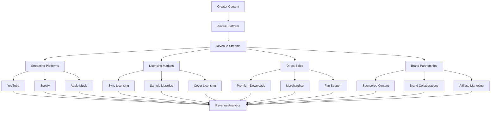

# 💰 Ainflue Monetization Guide

## Complete Revenue Optimization Guide for Creators

**Platform:** Ainflue AI-Powered Monetization Engine  
**Version:** 2.0.0  
**Author:** Fahed Mlaiel (mlaiel@live.de)  
**Last Updated:** September 2025

---

## 📋 Table of Contents

1. [Introduction to Monetization](#introduction-to-monetization)
2. [Revenue Stream Overview](#revenue-stream-overview)
3. [Platform Integration Setup](#platform-integration-setup)
4. [Direct Monetization Features](#direct-monetization-features)
5. [Content Licensing & Sync](#content-licensing--sync)
6. [Revenue Analytics & Optimization](#revenue-analytics--optimization)
7. [Payment Processing & Payouts](#payment-processing--payouts)
8. [Tax Management & Reporting](#tax-management--reporting)
9. [Advanced Monetization Strategies](#advanced-monetization-strategies)
10. [Troubleshooting & Support](#troubleshooting--support)

---

## 🌟 Introduction to Monetization

### Why Use Ainflue for Monetization?

**Comprehensive Revenue Tracking:**
- Multi-platform revenue aggregation
- Real-time earnings analytics
- Automated revenue optimization
- AI-powered monetization suggestions
- Transparent fee structure

**Advanced Features:**
- Cross-platform revenue attribution
- Collaborative revenue sharing
- Licensing opportunity matching
- Brand partnership facilitation
- Performance-based optimization

### Monetization Ecosystem



---

## 💸 Revenue Stream Overview

### Primary Revenue Streams

**1. Streaming Platform Revenue**
```python
streaming_revenue = {
    "youtube": {
        "revenue_type": "ad_revenue_sharing",
        "rate": "55% of ad revenue",
        "minimum_threshold": 1000,  # subscribers
        "payment_frequency": "monthly",
        "estimated_cpm": "$2-8 per 1000 views"
    },
    "spotify": {
        "revenue_type": "per_stream_royalties", 
        "rate": "$0.003-0.005 per stream",
        "minimum_threshold": None,
        "payment_frequency": "monthly",
        "additional_revenue": "spotify_for_artists_tools"
    },
    "apple_music": {
        "revenue_type": "per_stream_royalties",
        "rate": "$0.007-0.010 per stream", 
        "minimum_threshold": None,
        "payment_frequency": "monthly",
        "premium_features": "spatial_audio_bonus"
    }
}
```

**2. Content Licensing Revenue**
```python
licensing_revenue = {
    "sync_licensing": {
        "description": "Music for TV, film, ads, games",
        "rate_range": "$500-50000 per placement",
        "matching": "ai_powered_opportunity_matching",
        "contract_management": "automated"
    },
    "sample_licensing": {
        "description": "Loops and samples for other creators",
        "rate_range": "$10-500 per license",
        "volume_discounts": True,
        "exclusive_vs_non_exclusive": "both_options"
    },
    "cover_licensing": {
        "description": "Mechanical royalties from covers",
        "rate": "statutory_rate_plus_performance",
        "tracking": "automatic_detection",
        "collection": "global_collection_societies"
    }
}
```

**3. Direct Sales & Premium Content**
```python
direct_sales = {
    "premium_downloads": {
        "formats": ["FLAC", "WAV", "DSD"],
        "pricing": "$1-10 per track",
        "bundle_discounts": "album_pricing",
        "early_access": "subscriber_exclusive"
    },
    "merchandise": {
        "types": ["vinyl", "cds", "apparel", "posters"],
        "fulfillment": "print_on_demand_integration",
        "margin": "15-40% depending on item",
        "custom_designs": "ai_assisted_design_tools"
    },
    "fan_support": {
        "tips": "one_time_donations",
        "subscriptions": "monthly_fan_support",
        "crowdfunding": "project_based_funding",
        "exclusive_content": "subscriber_only_releases"
    }
}
```

### Revenue Potential Analysis

**Income Brackets by Creator Type:**

**Emerging Creator (0-10K followers):**
```python
emerging_creator_revenue = {
    "monthly_estimate": "$50-500",
    "primary_sources": ["streaming", "fan_support"],
    "growth_strategies": [
        "consistent_content_uploads",
        "social_media_engagement", 
        "collaboration_projects",
        "email_list_building"
    ],
    "recommended_focus": "audience_building"
}
```

**Established Creator (10K-100K followers):**
```python
established_creator_revenue = {
    "monthly_estimate": "$500-5000",
    "primary_sources": ["streaming", "licensing", "merchandise"],
    "growth_strategies": [
        "brand_partnerships",
        "premium_content_tiers",
        "live_performance_integration",
        "cross_platform_optimization"
    ],
    "recommended_focus": "revenue_diversification"
}
```

**Professional Creator (100K+ followers):**
```python
professional_creator_revenue = {
    "monthly_estimate": "$5000+",
    "primary_sources": ["all_revenue_streams"],
    "growth_strategies": [
        "enterprise_partnerships",
        "white_label_opportunities",
        "investment_in_other_creators",
        "platform_expansion"
    ],
    "recommended_focus": "business_scaling"
}
```

---

## 🔗 Platform Integration Setup

### Streaming Platform Connections

**YouTube Integration:**
```python
youtube_setup = {
    "requirements": {
        "youtube_channel": "required",
        "monetization_enabled": "required",
        "content_id_eligible": "recommended"
    },
    "connection_process": [
        "oauth_authentication",
        "channel_verification",
        "analytics_api_access_grant",
        "revenue_data_permissions"
    ],
    "data_syncing": {
        "frequency": "daily",
        "metrics": ["views", "ad_revenue", "cpm", "demographics"],
        "historical_data": "12_months"
    }
}
```

**Spotify for Artists Setup:**
```python
spotify_setup = {
    "requirements": {
        "spotify_artist_profile": "required",
        "verified_artist": "recommended",
        "distributor": "spotify_approved"
    },
    "integration_features": [
        "streaming_analytics",
        "playlist_placement_tracking",
        "fan_demographics",
        "revenue_attribution"
    ],
    "advanced_features": {
        "marquee_campaigns": "promotional_tool",
        "discovery_mode": "algorithm_boost",
        "artist_fundraising": "fan_support_integration"
    }
}
```

**Apple Music Connect:**
```python
apple_music_setup = {
    "requirements": {
        "apple_music_for_artists": "account_required",
        "itunes_connect": "access_needed"
    },
    "revenue_tracking": [
        "streaming_royalties",
        "download_sales",
        "spatial_audio_bonus",
        "regional_performance"
    ],
    "promotional_tools": [
        "artist_stories",
        "connect_posts",
        "premiere_features"
    ]
}
```

### Social Media Platform Integration

**Instagram & TikTok:**
```python
social_media_monetization = {
    "instagram": {
        "reels_play_bonus": "eligible_creators",
        "instagram_shop": "merchandise_integration",
        "branded_content": "partnership_facilitation",
        "live_badges": "fan_support_during_streams"
    },
    "tiktok": {
        "creator_fund": "view_based_payments",
        "live_gifts": "virtual_gift_monetization", 
        "brand_partnerships": "sponsored_content",
        "sound_licensing": "original_audio_usage_tracking"
    }
}
```

---

## 💎 Direct Monetization Features

### Premium Content Tiers

**Subscription Model Setup:**
```python
subscription_tiers = {
    "free_tier": {
        "price": 0,
        "features": [
            "basic_streaming_access",
            "standard_quality_downloads",
            "community_access"
        ]
    },
    "supporter_tier": {
        "price": 5.00,  # USD/month
        "features": [
            "high_quality_downloads",
            "early_access_releases", 
            "behind_scenes_content",
            "monthly_exclusive_track"
        ]
    },
    "vip_tier": {
        "price": 15.00,  # USD/month
        "features": [
            "lossless_quality_downloads",
            "exclusive_live_streams",
            "personal_shoutouts",
            "remix_stems_access",
            "priority_collaboration_requests"
        ]
    }
}
```

### Fan Engagement Monetization

**Interactive Revenue Features:**
```python
interactive_monetization = {
    "virtual_concerts": {
        "ticket_pricing": "$5-50 per event",
        "features": ["live_chat", "virtual_meet_greet", "exclusive_performances"],
        "platform_integration": "zoom_youtube_twitch",
        "merchandise_upsell": "concurrent_sales"
    },
    "personal_requests": {
        "custom_songs": "$100-1000 per request",
        "personalized_videos": "$25-200 per video", 
        "shoutouts": "$10-100 per shoutout",
        "collaboration_slots": "$500-5000 per project"
    },
    "educational_content": {
        "masterclasses": "$50-500 per course",
        "one_on_one_coaching": "$100-500 per hour",
        "production_tutorials": "$25-200 per tutorial",
        "songwriting_workshops": "$200-2000 per workshop"
    }
}
```

### Merchandise Integration

**Print-on-Demand Setup:**
```python
merchandise_system = {
    "product_types": {
        "apparel": ["t_shirts", "hoodies", "hats", "accessories"],
        "music_formats": ["vinyl", "cds", "cassettes", "usb_drives"],
        "artwork": ["posters", "album_art_prints", "custom_designs"],
        "digital": ["sample_packs", "preset_collections", "midi_files"]
    },
    "fulfillment_partners": {
        "printful": "apparel_and_accessories",
        "disc_makers": "vinyl_and_cd_production",
        "society6": "art_prints_and_home_goods",
        "bandcamp": "vinyl_pressing_services"
    },
    "profit_margins": {
        "apparel": "20-40%",
        "vinyl": "30-50%",
        "digital_products": "80-95%",
        "custom_items": "15-35%"
    }
}
```

---

## 🎵 Content Licensing & Sync

### Sync Licensing Opportunities

**AI-Powered Opportunity Matching:**
```python
sync_licensing_engine = {
    "content_analysis": {
        "mood_detection": "happy, sad, energetic, calm, dramatic",
        "genre_classification": "electronic, rock, jazz, classical, world",
        "tempo_analysis": "bpm_range_and_energy_level",
        "instrumental_vs_vocal": "content_type_categorization",
        "cultural_elements": "geographic_and_cultural_influences"
    },
    "opportunity_matching": {
        "tv_shows": "drama_comedy_reality_documentary",
        "films": "independent_studio_documentary_short",
        "advertising": "brand_campaigns_social_media_radio_tv",
        "games": "mobile_console_pc_vr_indie_aaa",
        "corporate": "presentations_training_events_branded_content"
    },
    "rate_estimation": {
        "tv_placement": "$500-15000",
        "film_placement": "$1000-50000",
        "advertising": "$2000-100000",
        "game_placement": "$500-25000",
        "corporate_use": "$200-5000"
    }
}
```

**Licensing Workflow:**
```python
licensing_workflow = {
    "content_submission": {
        "metadata_completion": "comprehensive_tagging",
        "quality_standards": "broadcast_ready_audio",
        "rights_clearance": "full_ownership_verification",
        "instrumental_versions": "required_for_most_placements"
    },
    "opportunity_notification": {
        "real_time_alerts": "matching_briefs_detected",
        "application_assistance": "ai_powered_pitch_generation",
        "deadline_management": "automated_reminder_system",
        "competition_analysis": "submission_strategy_optimization"
    },
    "contract_management": {
        "automated_negotiation": "standard_rate_acceptance",
        "custom_terms": "manual_review_and_approval",
        "rights_tracking": "usage_monitoring_and_reporting",
        "payment_processing": "direct_platform_payment"
    }
}
```

### Sample & Loop Licensing

**Creator Marketplace:**
```python
sample_marketplace = {
    "content_types": {
        "drum_loops": "acoustic_electronic_hybrid",
        "melodic_loops": "synth_guitar_piano_orchestral",
        "vocal_samples": "lead_vocals_harmonies_chops_phrases",
        "one_shots": "drums_bass_fx_stabs",
        "construction_kits": "full_song_components"
    },
    "pricing_structure": {
        "individual_samples": "$1-20 per sample",
        "sample_packs": "$10-100 per pack",
        "exclusive_licenses": "$50-500 per sample",
        "buyout_options": "$100-5000 per sample"
    },
    "usage_tracking": {
        "sample_detection": "ai_powered_usage_monitoring",
        "revenue_attribution": "performance_based_royalties",
        "credit_tracking": "automatic_attribution_system",
        "viral_tracking": "trending_sample_identification"
    }
}
```

### Global Rights Management

**Collection Society Integration:**
```python
rights_management = {
    "performance_royalties": {
        "us": ["ascap", "bmi", "sesac"],
        "uk": ["prs_for_music"],
        "germany": ["gema"],
        "france": ["sacem"],
        "global": ["cisac_affiliated_societies"]
    },
    "mechanical_royalties": {
        "us": ["harry_fox_agency", "music_reports"],
        "international": ["cmrra", "mcps", "mechanical_copyright"],
        "digital": ["spotify_apple_youtube_direct_deals"]
    },
    "neighboring_rights": {
        "soundexchange": "us_digital_radio",
        "ppca": "australia_performance_rights",
        "cpra": "canada_performance_rights",
        "international": ["scpp", "gvl", "related_rights_orgs"]
    }
}
```

---

## 📊 Revenue Analytics & Optimization

### Real-Time Revenue Dashboard

**Dashboard Components:**
```python
revenue_dashboard = {
    "overview_metrics": {
        "total_lifetime_earnings": "cumulative_all_sources",
        "monthly_recurring_revenue": "subscription_and_streaming",
        "growth_rate": "month_over_month_percentage",
        "top_performing_content": "highest_earning_tracks"
    },
    "platform_breakdown": {
        "streaming_platforms": {
            "youtube": {"views": 125000, "revenue": 450.75},
            "spotify": {"streams": 89000, "revenue": 267.50},
            "apple_music": {"streams": 34000, "revenue": 238.90}
        },
        "licensing_revenue": {
            "sync_placements": 2,
            "sync_revenue": 3500.00,
            "sample_sales": 45,
            "sample_revenue": 890.25
        },
        "direct_sales": {
            "premium_downloads": 67,
            "merchandise": 23,
            "fan_support": 156.75
        }
    },
    "trends_analysis": {
        "seasonal_patterns": "holiday_summer_trends",
        "content_performance": "track_by_track_analysis",
        "audience_behavior": "consumption_pattern_insights",
        "optimization_suggestions": "ai_powered_recommendations"
    }
}
```

### AI-Powered Revenue Optimization

**Smart Recommendations Engine:**
```python
optimization_engine = {
    "content_strategy": {
        "upload_timing": "optimal_release_windows",
        "genre_trends": "emerging_style_opportunities",
        "collaboration_suggestions": "high_roi_partnership_matches",
        "cross_promotion": "multi_platform_strategy_optimization"
    },
    "pricing_optimization": {
        "dynamic_pricing": "demand_based_adjustments",
        "bundle_strategies": "package_deal_optimization",
        "subscription_tiers": "feature_value_alignment",
        "licensing_rates": "market_rate_analysis"
    },
    "audience_development": {
        "demographic_targeting": "high_value_audience_segments",
        "retention_strategies": "engagement_improvement_tactics",
        "conversion_optimization": "free_to_paid_user_funnels",
        "lifetime_value": "subscriber_value_maximization"
    }
}
```

### Performance Benchmarking

**Industry Comparison Metrics:**
```python
benchmarking_system = {
    "peer_comparison": {
        "similar_artists": "genre_and_size_matched_creators",
        "revenue_percentiles": "industry_performance_ranking",
        "growth_rates": "comparative_trajectory_analysis",
        "monetization_efficiency": "revenue_per_follower_metrics"
    },
    "market_analysis": {
        "genre_performance": "style_specific_revenue_trends",
        "platform_optimization": "channel_specific_best_practices",
        "seasonal_adjustments": "time_based_strategy_recommendations",
        "emerging_opportunities": "new_revenue_stream_identification"
    }
}
```

---

## 💳 Payment Processing & Payouts

### Payment Methods & Schedules

**Supported Payment Options:**
```python
payment_methods = {
    "bank_transfer": {
        "regions": ["us_ach", "eu_sepa", "uk_faster_payments"],
        "processing_time": "1-3_business_days",
        "fees": "free_for_monthly_payouts",
        "minimum": 50.00  # USD equivalent
    },
    "digital_wallets": {
        "paypal": {
            "global_availability": True,
            "processing_time": "instant",
            "fees": "2.9% + $0.30 per transaction",
            "minimum": 1.00
        },
        "wise": {
            "international_focus": True,
            "processing_time": "1-2_business_days", 
            "fees": "transparent_mid_market_rates",
            "multi_currency_support": True
        }
    },
    "cryptocurrency": {
        "supported_coins": ["bitcoin", "ethereum", "usdc"],
        "processing_time": "network_dependent",
        "fees": "network_gas_fees_only",
        "minimum": 25.00  # USD equivalent
    }
}
```

**Payout Schedules:**
```python
payout_schedules = {
    "automatic_monthly": {
        "date": "1st_of_each_month",
        "minimum_threshold": 50.00,
        "fee": "free",
        "currency_conversion": "automatic_at_current_rates"
    },
    "bi_weekly": {
        "dates": ["1st_and_15th"],
        "minimum_threshold": 25.00,
        "fee": "$2.00_per_payout",
        "premium_feature": True
    },
    "instant_payout": {
        "availability": "24_7",
        "minimum_threshold": 5.00,
        "fee": "2.5%_of_payout_amount",
        "premium_plus_feature": True
    }
}
```

### Multi-Currency Support

**Global Revenue Management:**
```python
currency_management = {
    "supported_currencies": [
        "usd", "eur", "gbp", "cad", "aud", 
        "jpy", "chf", "sek", "nok", "dkk"
    ],
    "currency_conversion": {
        "rate_source": "mid_market_rates",
        "update_frequency": "real_time",
        "historical_tracking": "rate_change_impact_analysis",
        "hedging_options": "large_volume_protection"
    },
    "regional_optimization": {
        "local_payment_methods": "region_specific_options",
        "tax_considerations": "jurisdiction_specific_handling",
        "compliance": "local_financial_regulations",
        "reporting": "multi_currency_financial_statements"
    }
}
```

---

## 📋 Tax Management & Reporting

### Automated Tax Documentation

**Tax Document Generation:**
```python
tax_reporting = {
    "us_tax_forms": {
        "1099_nec": "non_employee_compensation",
        "1099_misc": "miscellaneous_income",
        "schedule_c": "business_income_expenses",
        "quarterly_estimates": "estimated_tax_calculations"
    },
    "international_compliance": {
        "withholding_tax": "source_country_requirements",
        "tax_treaties": "reduced_rate_applications",
        "vat_gst_handling": "regional_sales_tax_compliance",
        "reporting_requirements": "jurisdiction_specific_filings"
    },
    "expense_tracking": {
        "business_expenses": [
            "equipment_purchases",
            "software_subscriptions", 
            "marketing_costs",
            "collaboration_payments",
            "platform_fees"
        ],
        "categorization": "automatic_expense_classification",
        "receipt_management": "digital_receipt_storage",
        "deduction_optimization": "maximum_legal_deductions"
    }
}
```

### Financial Planning Tools

**Revenue Forecasting:**
```python
financial_planning = {
    "revenue_projections": {
        "ai_forecasting": "machine_learning_predictions",
        "seasonal_adjustments": "historical_pattern_analysis",
        "growth_scenarios": "conservative_optimistic_projections",
        "goal_tracking": "milestone_achievement_monitoring"
    },
    "budget_management": {
        "expense_budgets": "category_based_spending_limits",
        "investment_planning": "equipment_and_marketing_budgets",
        "emergency_fund": "revenue_volatility_protection",
        "reinvestment_strategy": "growth_focused_spending_plans"
    }
}
```

---

## 🚀 Advanced Monetization Strategies

### Creator Economy Scaling

**Business Model Evolution:**
```python
scaling_strategies = {
    "content_diversification": {
        "multi_format_content": "audio_video_written_visual",
        "audience_segmentation": "different_content_for_different_fans",
        "premium_content_ladders": "tiered_value_proposition",
        "cross_platform_synergy": "platform_specific_optimization"
    },
    "team_building": {
        "virtual_team": "remote_collaboration_specialists",
        "revenue_sharing": "team_member_equity_participation",
        "skill_specialization": "dedicated_roles_for_growth",
        "automation_investment": "tool_and_system_optimization"
    },
    "business_expansion": {
        "white_label_services": "branded_solution_offerings",
        "coaching_consulting": "monetize_expertise_and_experience",
        "investment_opportunities": "creator_fund_participation",
        "platform_development": "proprietary_tool_creation"
    }
}
```

### Brand Partnership Optimization

**Partnership Development Framework:**
```python
brand_partnerships = {
    "partnership_types": {
        "sponsored_content": {
            "rate_calculation": "$100-10000_per_10k_followers",
            "engagement_multiplier": "higher_engagement_premium_rates",
            "exclusivity_premiums": "category_exclusive_partnerships",
            "long_term_contracts": "annual_partnership_agreements"
        },
        "affiliate_marketing": {
            "commission_rates": "5-30%_depending_on_product",
            "tracking_integration": "automated_attribution_systems",
            "performance_bonuses": "volume_based_incentives",
            "exclusive_products": "creator_specific_offerings"
        },
        "co_branded_products": {
            "revenue_sharing": "50_50_split_typical",
            "creative_control": "collaborative_design_process",
            "marketing_support": "shared_promotional_responsibilities",
            "intellectual_property": "joint_ownership_agreements"
        }
    }
}
```

### Investment & Passive Income

**Creator Investment Opportunities:**
```python
investment_strategies = {
    "creator_fund_participation": {
        "peer_investment": "invest_in_other_creators",
        "revenue_share_agreements": "ongoing_passive_income",
        "portfolio_diversification": "risk_distribution_across_creators",
        "mentorship_programs": "value_add_beyond_capital"
    },
    "intellectual_property_licensing": {
        "catalog_licensing": "bulk_licensing_of_back_catalog",
        "exclusive_licensing_deals": "platform_or_brand_exclusives",
        "international_licensing": "geographic_market_expansion",
        "format_licensing": "adaptation_rights_for_different_media"
    },
    "platform_ownership": {
        "equity_participation": "ownership_stake_in_platforms",
        "advisory_roles": "strategic_input_for_equity",
        "product_development": "creator_focused_feature_development",
        "industry_influence": "policy_and_standard_setting_participation"
    }
}
```

---

## 🔧 Troubleshooting & Support

### Common Revenue Issues

**Payment Processing Problems:**
```python
payment_troubleshooting = {
    "delayed_payments": {
        "causes": [
            "banking_system_delays",
            "holiday_processing_schedules",
            "verification_requirements",
            "currency_conversion_delays"
        ],
        "solutions": [
            "verify_account_information",
            "check_minimum_thresholds",
            "contact_payment_support",
            "consider_alternative_payment_methods"
        ]
    },
    "missing_revenue": {
        "causes": [
            "platform_reporting_delays",
            "revenue_threshold_not_met",
            "account_disconnection",
            "tax_withholding_requirements"
        ],
        "solutions": [
            "check_platform_connections",
            "verify_revenue_thresholds",
            "review_tax_documentation",
            "contact_platform_support"
        ]
    }
}
```

**Revenue Optimization Issues:**
```python
optimization_troubleshooting = {
    "low_conversion_rates": {
        "analysis": [
            "audience_quality_assessment",
            "content_value_proposition_review",
            "pricing_strategy_evaluation",
            "user_experience_optimization"
        ],
        "improvements": [
            "a_b_test_pricing_strategies",
            "improve_content_quality",
            "enhance_fan_engagement",
            "optimize_conversion_funnels"
        ]
    },
    "platform_performance_decline": {
        "investigation": [
            "algorithm_change_impact",
            "competitive_landscape_shifts",
            "content_quality_analysis",
            "audience_behavior_changes"
        ],
        "strategies": [
            "diversify_platform_presence",
            "adapt_content_strategy",
            "increase_posting_frequency",
            "improve_seo_optimization"
        ]
    }
}
```

### Getting Monetization Support

**Support Channels:**
```python
support_resources = {
    "self_service": {
        "knowledge_base": "comprehensive_monetization_guides",
        "video_tutorials": "step_by_step_setup_instructions",
        "community_forums": "peer_advice_and_best_practices",
        "case_studies": "successful_creator_examples"
    },
    "direct_support": {
        "email_support": "support@ainflue.com",
        "live_chat": "business_hours_availability",
        "phone_support": "premium_enterprise_users",
        "dedicated_account_manager": "high_volume_creators"
    },
    "specialized_assistance": {
        "monetization_consultants": "strategy_development_services",
        "tax_advisory": "professional_tax_preparation_referrals",
        "legal_support": "contract_and_rights_guidance",
        "business_development": "partnership_opportunity_facilitation"
    }
}
```

### Revenue Optimization Consultation

**Professional Services:**
```python
consultation_services = {
    "monetization_audit": {
        "comprehensive_review": "current_revenue_stream_analysis",
        "optimization_recommendations": "specific_improvement_strategies",
        "implementation_roadmap": "prioritized_action_plan",
        "performance_benchmarking": "industry_comparison_analysis"
    },
    "custom_strategy_development": {
        "personalized_monetization_plan": "creator_specific_approach",
        "market_opportunity_analysis": "untapped_revenue_identification",
        "competitive_positioning": "differentiation_strategy_development",
        "growth_projection_modeling": "realistic_goal_setting"
    }
}
```

---

## 📈 Success Metrics & KPIs

### Revenue Performance Tracking

**Key Revenue Metrics:**
```python
revenue_kpis = {
    "primary_metrics": {
        "total_monthly_revenue": "all_sources_combined",
        "revenue_growth_rate": "month_over_month_percentage",
        "revenue_per_follower": "monetization_efficiency",
        "customer_lifetime_value": "fan_value_over_time"
    },
    "platform_specific_metrics": {
        "streaming_revenue_per_play": "efficiency_by_platform",
        "licensing_deal_success_rate": "opportunity_conversion",
        "merchandise_profit_margin": "product_line_profitability",
        "subscription_retention_rate": "fan_loyalty_measurement"
    },
    "advanced_metrics": {
        "revenue_diversification_index": "income_stream_balance",
        "seasonal_revenue_stability": "year_round_consistency",
        "passive_income_percentage": "effort_independent_revenue",
        "roi_on_monetization_efforts": "investment_effectiveness"
    }
}
```

### Business Health Indicators

**Financial Health Metrics:**
```python
business_health = {
    "cash_flow_management": {
        "monthly_recurring_revenue": "predictable_income_streams",
        "revenue_volatility": "income_stability_measurement",
        "payment_timing": "cash_flow_consistency",
        "emergency_fund_ratio": "financial_resilience"
    },
    "growth_indicators": {
        "fan_base_growth_rate": "audience_expansion_speed",
        "engagement_rate_trends": "fan_interaction_quality",
        "cross_platform_performance": "multi_channel_success",
        "brand_partnership_volume": "commercial_appeal_growth"
    }
}
```

---

## 🎯 Next Steps & Action Plan

### Immediate Monetization Actions
1. **Complete platform integrations** - Connect all revenue-generating accounts
2. **Set up payment processing** - Configure payout methods and schedules
3. **Enable content protection** - Protect revenue from unauthorized use
4. **Create premium content tiers** - Develop subscription-based offerings
5. **Optimize content for licensing** - Prepare tracks for sync opportunities

### 30-Day Revenue Acceleration Plan
1. **Week 1**: Platform setup and basic monetization activation
2. **Week 2**: Content optimization and premium tier launch
3. **Week 3**: Brand partnership outreach and licensing submissions
4. **Week 4**: Performance analysis and strategy refinement

### Long-term Monetization Strategy
1. **Months 1-3**: Build foundation and establish initial revenue streams
2. **Months 4-6**: Scale successful channels and explore new opportunities
3. **Months 7-12**: Develop advanced strategies and passive income sources
4. **Year 2+**: Business expansion and investment opportunities

---

**© 2025 Fahed Mlaiel - All Rights Reserved**  
**Ainflue Platform - Complete Monetization Guide**

**Ready to maximize your creative revenue?**  
Start your monetization journey at [https://app.ainflue.com/monetization](https://app.ainflue.com/monetization) or contact our monetization specialists at mlaiel@live.de for personalized revenue optimization strategies.