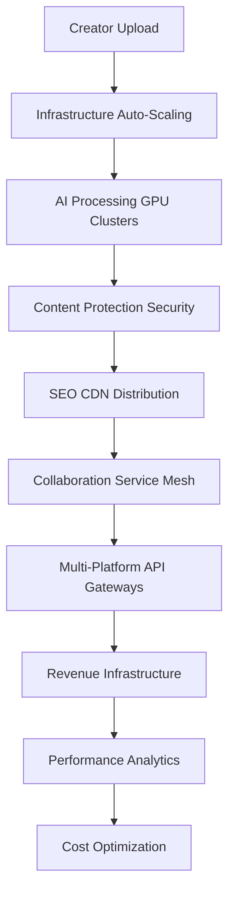

# 🏗️ Ainflue Infrastructure Architecture Documentation

**Author:** Fahed Mlaiel <mlaiel@live.de>  
**Team:** DevOps + Infrastructure Architect + Lead Developer  
**Version:** 1.0.0  
**Last Updated:** January 2025  

## 📋 Table of Contents

1. [Architecture Overview](#architecture-overview)
2. [Infrastructure Layers](#infrastructure-layers)
3. [Component Architecture](#component-architecture)
4. [Multi-Cloud Strategy](#multi-cloud-strategy)
5. [Security Architecture](#security-architecture)
6. [Scalability Design](#scalability-design)
7. [Business Logic Integration](#business-logic-integration)
8. [Compliance Framework](#compliance-framework)

---

## 🎯 Architecture Overview

### Enterprise Infrastructure Philosophy

The Ainflue infrastructure follows a **multi-cloud, microservices-based, AI-powered** architecture designed specifically for the creator economy. Our infrastructure supports the complete creator workflow from content upload to global distribution and monetization.

### Key Architectural Principles

- **Multi-Cloud First:** AWS, GCP, Azure orchestration for vendor independence
- **AI-Powered Operations:** Predictive scaling, intelligent monitoring, automated optimization
- **Security by Design:** Zero-trust architecture with comprehensive compliance
- **Creator-Centric:** Infrastructure optimized for creative workflows
- **Enterprise Scale:** 99.99% availability with global edge computing
- **Cost Optimization:** Intelligent resource management and cost awareness

---

## 🏗️ Infrastructure Layers

### Level 1: Platform Core (/platform_core/)
- User management and authentication
- Content processing pipelines
- API orchestration layer

### Level 2: Infrastructure (/infrastructure/)
- **Cloud Providers:** Multi-cloud orchestration (AWS, GCP, Azure)
- **Container Management:** Kubernetes clusters with service mesh
- **Database Infrastructure:** PostgreSQL, Redis, MongoDB clusters
- **Observability:** Prometheus, Grafana, ELK, Jaeger stack
- **Auto-Scaling:** AI-powered predictive scaling systems
- **Deployment:** Blue-green, canary deployment automation
- **Security:** Zero-trust security modules and compliance
- **Storage:** Multi-tier storage with global replication

### Level 3: Specialized Modules
- **API Management:** Gateway, rate limiting, versioning
- **External Integrations:** Social platforms, payment gateways
- **Security Modules:** Encryption, threat detection, compliance
- **Storage Systems:** Object storage, caching, content delivery

---

## 🔧 Component Architecture

### Core Infrastructure Components

#### 1. Infrastructure Orchestrator
```python
# /infrastructure/infrastructure_orchestrator.py
class InfrastructureOrchestrator:
    - Multi-cloud resource coordination
    - Cross-provider failover management
    - Global infrastructure state management
    - Automated disaster recovery
```

#### 2. Multi-Cloud Manager
```python
# /infrastructure/multi_cloud_manager.py
class MultiCloudManager:
    - AWS provider integration (EC2, S3, RDS, SageMaker)
    - GCP provider integration (Compute, GKE, Cloud SQL, AI Platform)
    - Azure provider integration (VMs, AKS, SQL, Cognitive Services)
    - Cross-cloud resource migration
    - Cost optimization across providers
```

#### 3. Performance Optimizer
```python
# /infrastructure/performance_optimizer.py
class PerformanceOptimizer:
    - AI-powered performance analysis
    - Predictive resource scaling
    - Database query optimization
    - CDN and edge computing optimization
    - Real-time performance monitoring
```

### Container Orchestration Architecture

#### Kubernetes Cluster Design
```yaml
# Multi-region Kubernetes setup
Regions:
  - us-east-1 (Primary)
  - eu-west-1 (Secondary)
  - ap-southeast-1 (Asia-Pacific)

Node Groups:
  - General Purpose: t3.large (2-10 nodes)
  - CPU Intensive: c5.xlarge (1-20 nodes)
  - GPU Workloads: p3.2xlarge (1-5 nodes)
  - Memory Optimized: r5.large (1-10 nodes)
```

#### Service Mesh Configuration
```yaml
# Istio service mesh setup
Components:
  - Envoy Proxy: L7 load balancing and traffic management
  - Pilot: Service discovery and traffic routing
  - Citadel: Certificate management and security
  - Galley: Configuration validation and distribution
```

### Database Architecture

#### Primary Databases
- **PostgreSQL Cluster:** User data, metadata, transactions
- **Redis Cluster:** Caching, session storage, real-time data
- **MongoDB Cluster:** Content metadata, analytics data
- **Elasticsearch:** Search indexing, logs, analytics

#### Database Topology
```
Production Environment:
├── PostgreSQL (Multi-AZ)
│   ├── Primary: Write operations
│   ├── Read Replicas: Read scaling (3 replicas)
│   └── Backup: Cross-region replication
├── Redis Cluster
│   ├── Master nodes: 3 (one per AZ)
│   ├── Replica nodes: 6 (two per master)
│   └── Sentinel: 3 (monitoring and failover)
└── MongoDB Replica Set
    ├── Primary: Write operations
    ├── Secondary: Read operations (2 replicas)
    └── Arbiter: Election participation
```

---

## ☁️ Multi-Cloud Strategy

### Cloud Provider Distribution

#### AWS (Primary - 60%)
```yaml
Services:
  Compute: EC2, ECS, Lambda
  Storage: S3, EBS, EFS
  Database: RDS, ElastiCache, DocumentDB
  AI/ML: SageMaker, Rekognition, Comprehend
  Networking: VPC, CloudFront, Route53
  Security: IAM, KMS, WAF
```

#### Google Cloud (Secondary - 25%)
```yaml
Services:
  Compute: Compute Engine, GKE, Cloud Functions
  Storage: Cloud Storage, Persistent Disk
  Database: Cloud SQL, Memorystore, Firestore
  AI/ML: AI Platform, Vision API, Natural Language
  Networking: VPC, Cloud CDN, Cloud DNS
  Security: IAM, Cloud KMS, Cloud Armor
```

#### Azure (Tertiary - 15%)
```yaml
Services:
  Compute: Virtual Machines, AKS, Functions
  Storage: Blob Storage, Managed Disks
  Database: Azure SQL, Redis Cache, Cosmos DB
  AI/ML: Azure ML, Cognitive Services
  Networking: Virtual Network, CDN, DNS
  Security: Azure AD, Key Vault, Security Center
```

### Cross-Cloud Communication
- **VPN Connections:** Site-to-site VPN between cloud providers
- **Private Connectivity:** AWS Direct Connect, GCP Interconnect, Azure ExpressRoute
- **API Gateway:** Unified API layer across all cloud providers
- **Data Replication:** Cross-cloud database replication for disaster recovery

---

## 🔒 Security Architecture

### Zero-Trust Security Model

#### Network Security
```yaml
Network Segmentation:
  DMZ: Public-facing services (Load balancers, CDN)
  Application Tier: Business logic services
  Data Tier: Database and storage services
  Management Tier: Administrative and monitoring services

Security Groups:
  Web Tier: 443/80 from Internet, 8080 from ALB
  App Tier: 8000-9000 from Web Tier only
  DB Tier: 5432/6379/27017 from App Tier only
  Mgmt Tier: 22/3389 from VPN only
```

#### Identity and Access Management
```yaml
Authentication:
  Multi-Factor Authentication: Required for all access
  SSO Integration: SAML 2.0 with corporate directory
  Service Accounts: Minimal privilege with rotation
  API Keys: Time-limited with scope restrictions

Authorization:
  RBAC: Role-based access control with least privilege
  ABAC: Attribute-based access control for fine-grained permissions
  Policy Engine: Centralized policy management and enforcement
```

#### Data Protection
```yaml
Encryption:
  In-Transit: TLS 1.3 for all communications
  At-Rest: AES-256 encryption for all storage
  Key Management: HSM-backed key rotation every 90 days
  Database: Transparent Data Encryption (TDE)

Data Classification:
  Public: Marketing materials, public documentation
  Internal: Business data, employee information
  Confidential: Financial data, customer PII
  Restricted: Security keys, compliance data
```

---

## 📈 Scalability Design

### Auto-Scaling Strategy

#### Horizontal Pod Autoscaler (HPA)
```yaml
apiVersion: autoscaling/v2
kind: HorizontalPodAutoscaler
metadata:
  name: ainflue-api-hpa
spec:
  scaleTargetRef:
    apiVersion: apps/v1
    kind: Deployment
    name: ainflue-api
  minReplicas: 3
  maxReplicas: 100
  metrics:
  - type: Resource
    resource:
      name: cpu
      target:
        type: Utilization
        averageUtilization: 70
  - type: Resource
    resource:
      name: memory
      target:
        type: Utilization
        averageUtilization: 80
```

#### Vertical Pod Autoscaler (VPA)
```yaml
apiVersion: autoscaling.k8s.io/v1
kind: VerticalPodAutoscaler
metadata:
  name: ainflue-api-vpa
spec:
  targetRef:
    apiVersion: apps/v1
    kind: Deployment
    name: ainflue-api
  updatePolicy:
    updateMode: "Auto"
  resourcePolicy:
    containerPolicies:
    - containerName: api
      minAllowed:
        cpu: 100m
        memory: 128Mi
      maxAllowed:
        cpu: 2
        memory: 4Gi
```

#### Cluster Autoscaler
```yaml
apiVersion: apps/v1
kind: Deployment
metadata:
  name: cluster-autoscaler
  namespace: kube-system
spec:
  template:
    spec:
      containers:
      - image: k8s.gcr.io/autoscaling/cluster-autoscaler:v1.21.0
        name: cluster-autoscaler
        command:
        - ./cluster-autoscaler
        - --v=4
        - --stderrthreshold=info
        - --cloud-provider=aws
        - --skip-nodes-with-local-storage=false
        - --expander=least-waste
        - --node-group-auto-discovery=asg:tag=k8s.io/cluster-autoscaler/enabled,k8s.io/cluster-autoscaler/ainflue-cluster
        - --balance-similar-node-groups
        - --scale-down-enabled=true
        - --scale-down-delay-after-add=10m
        - --scale-down-unneeded-time=10m
```

### Performance Optimization

#### CDN and Edge Computing
```yaml
Edge Locations:
  Primary CDN: AWS CloudFront (Global)
  Secondary CDN: Google Cloud CDN (Backup)
  Edge Computing: AWS Lambda@Edge, Cloudflare Workers

Caching Strategy:
  Static Assets: 1 year cache (CSS, JS, images)
  API Responses: 5 minutes cache (GET requests)
  Dynamic Content: No cache (POST/PUT/DELETE)
  Media Files: 30 days cache with versioning
```

#### Database Optimization
```sql
-- Read Replica Configuration
CREATE REPLICA ainflue_read_replica_1 
FROM ainflue_primary 
WITH REPLICATION_MODE = 'async',
     READ_ONLY = true,
     AUTO_FAILOVER = false;

-- Connection Pooling
PgBouncer Configuration:
  pool_mode = transaction
  max_client_conn = 1000
  default_pool_size = 100
  server_lifetime = 3600
  server_idle_timeout = 600
```

---

## 🎯 Business Logic Integration

### Creator Economy Workflow



### Infrastructure-Specific Features

#### Upload Infrastructure
```yaml
Upload Pipeline:
  Load Balancer: Application Load Balancer with sticky sessions
  Auto-Scaling: Scale based on upload queue length
  Storage: S3 with multipart upload and resumable uploads
  Processing: GPU-enabled containers for media processing
  CDN: Global edge locations for upload acceleration
```

#### AI Processing Infrastructure
```yaml
GPU Clusters:
  AWS: p3.2xlarge instances with NVIDIA V100
  GCP: n1-standard-4 with NVIDIA Tesla T4
  Kubernetes: GPU node pools with device plugins
  Scheduling: GPU-aware pod scheduling
  Monitoring: GPU utilization and memory metrics
```

#### Revenue Infrastructure
```yaml
Payment Processing:
  Primary: Stripe Connect for global payments
  Secondary: PayPal for alternative payment methods
  Crypto: Integration with blockchain payment systems
  Settlement: Real-time settlement with fraud detection
  Compliance: PCI-DSS Level 1 compliance
```

---

## 📊 Compliance Framework

### Regulatory Compliance

#### GDPR (EU General Data Protection Regulation)
```yaml
Data Protection:
  Data Minimization: Collect only necessary data
  Purpose Limitation: Use data only for stated purposes
  Storage Limitation: Retain data only as long as necessary
  Right to Erasure: Automated data deletion on request
  Data Portability: Export user data in machine-readable format
  Breach Notification: Automated notification within 72 hours
```

#### PCI-DSS (Payment Card Industry Data Security Standard)
```yaml
Security Requirements:
  Network Security: Firewall configuration and network segmentation
  Data Protection: Encryption of cardholder data in transit and at rest
  Vulnerability Management: Regular security testing and updates
  Access Control: Strong access control measures and monitoring
  Monitoring: Regular monitoring and testing of networks
  Information Security: Maintain an information security policy
```

#### SOC2 (Service Organization Control 2)
```yaml
Trust Principles:
  Security: Protection against unauthorized access
  Availability: System availability for operation and use
  Processing Integrity: System processing is complete and accurate
  Confidentiality: Information designated as confidential is protected
  Privacy: Personal information is collected and processed appropriately
```

### Compliance Monitoring

#### Automated Compliance Checks
```python
# /infrastructure/compliance_manager.py
compliance_checks = {
    "GDPR": {
        "data_encryption": "required",
        "breach_notification": "72_hours",
        "data_retention": "user_defined",
        "right_to_erasure": "automated"
    },
    "PCI_DSS": {
        "network_segmentation": "required",
        "encryption_in_transit": "tls_1_3",
        "encryption_at_rest": "aes_256",
        "vulnerability_scanning": "quarterly"
    },
    "SOC2": {
        "access_controls": "rbac_required",
        "monitoring": "24x7",
        "backup_procedures": "automated",
        "incident_response": "documented"
    }
}
```

---

## 🚀 Deployment Architecture

### Environment Strategy

#### Production Environment
```yaml
Production (PROD):
  Regions: us-east-1, eu-west-1, ap-southeast-1
  Clusters: 3 Kubernetes clusters (one per region)
  Databases: Multi-AZ with cross-region replicas
  CDN: Global CloudFront distribution
  Monitoring: Full observability stack
  Backup: Automated cross-region backups
```

#### Staging Environment
```yaml
Staging (STAGE):
  Regions: us-east-1
  Clusters: 1 Kubernetes cluster
  Databases: Single AZ with automated backups
  CDN: CloudFront distribution for testing
  Monitoring: Basic observability stack
  Data: Anonymized production data subset
```

#### Development Environment
```yaml
Development (DEV):
  Regions: us-east-1
  Clusters: 1 Kubernetes cluster (smaller nodes)
  Databases: Single instance with daily backups
  CDN: No CDN (direct access)
  Monitoring: Basic logging and metrics
  Data: Synthetic test data
```

### Deployment Strategy

#### Blue-Green Deployment
```yaml
Blue-Green Process:
  1. Deploy new version to Green environment
  2. Run automated tests against Green environment
  3. Switch traffic from Blue to Green (50/50 split)
  4. Monitor for 30 minutes
  5. Complete traffic switch if healthy
  6. Keep Blue environment for 24h for rollback
```

#### Canary Deployment
```yaml
Canary Process:
  1. Deploy new version to 5% of production traffic
  2. Monitor error rates and performance metrics
  3. Gradually increase traffic: 5% → 25% → 50% → 100%
  4. Rollback if error rate exceeds 0.5%
  5. Complete deployment if all metrics are healthy
```

---

## 📞 Support and Maintenance

### 24/7 Operations

#### On-Call Rotation
- **Tier 1:** Infrastructure Engineers (First response)
- **Tier 2:** Senior Infrastructure Engineers (Escalation)
- **Tier 3:** Infrastructure Architects (Complex issues)
- **Tier 4:** CTO/VP Engineering (Business critical)

#### Response Times
- **P0 (Critical):** 15 minutes (System down, data breach)
- **P1 (High):** 1 hour (Performance degradation)
- **P2 (Medium):** 4 hours (Feature impaired)
- **P3 (Low):** 24 hours (Enhancement request)

### Maintenance Windows

#### Scheduled Maintenance
- **Monthly:** Security patches and minor updates
- **Quarterly:** Major version upgrades and infrastructure changes
- **Annually:** Complete disaster recovery testing

#### Emergency Maintenance
- **Security Patches:** Applied within 24 hours
- **Critical Bugs:** Hotfix deployment within 2 hours
- **Infrastructure Issues:** Immediate response and resolution

---

**© 2025 Fahed Mlaiel. All rights reserved.**  
**Contact:** mlaiel@live.de  
**Legal Notice:** This documentation contains proprietary information and trade secrets.