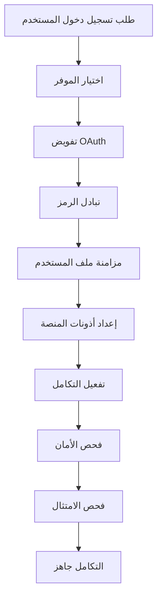

# 🔐 وحدة المصادقة - تكاملات أينفلو

**فريق الخبراء: مطور رئيسي ذكي + خلفية متقدمة + مهندس تعلم آلي + إدارة قواعد البيانات + أمان + خدمات مصغرة + صوت + DevOps + مهندس محفزات ذكية**

## ⚠️ الملكية الفكرية - فهد ملايل

> **🔒 تحذير قوي وواضح**  
> هذه الهندسة المعمارية هي الملكية الفكرية الحصرية لـ **فهد ملايل** (mlaiel@live.de). أي استنساخ أو تعديل أو توزيع أو سرقة فكرة/مفهوم/كود بدون إذن كتابي شخصي **محظور تماماً** وسيتم ملاحقته قانونياً. أنتم محذرون.

## 🎯 هدف الوحدة

توفر وحدة المصادقة إدارة أمان ومصادقة على مستوى المؤسسات لمنصة أينفلو. تقدم تكامل شامل لـ OAuth 2.0/OIDC، مصادقة متعددة العوامل، إدارة رموز JWT، فحص أمان متقدم والتحقق من الامتثال عبر 65+ منصة متكاملة.

### المكونات الأساسية

- **معالج المصادقة** - تنسيق مصادقة مركزي وإدارة الجلسات
- **مدير OAuth** - تكامل موفري OAuth 2.0/OIDC لـ 65+ منصة
- **نواة فاحص الأمان** - بنية تحتية لفحص الأمان وإدارة الثغرات
- **فاحص الثغرات** - اكتشاف متقدم للثغرات واختبار الأمان
- **فاحص الامتثال** - التحقق من امتثال GDPR، SOC2، PCI-DSS، OWASP

## 🏗️ هندسة التكاملات

### أنماط التصميم المركزة على الأمان

```yaml
هندسة المصادقة:
  الطبقة الأساسية:
    - تنسيق OAuth متعدد الموفرين
    - إدارة دورة حياة رموز JWT
    - أمان الجلسات والتحقق
    - دعم المصادقة البيومترية
    
  طبقة الأمان:
    - فحص الثغرات في الوقت الفعلي
    - اختبار تكوين SSL/TLS
    - التحقق من أمان نقاط النهاية API
    - مراقبة الشهادات والتنبيهات
    
  طبقة الامتثال:
    - التحقق من حماية البيانات GDPR
    - تدقيق ضوابط الأمان SOC2
    - امتثال أمان المدفوعات PCI-DSS
    - تقييم ثغرات OWASP Top 10
```

## 🚀 الاستخدام في الإنتاج

### إعداد المصادقة الأساسي

```python
from integrations.authentication import AuthenticationHandler, OAuthManager

# تهيئة نظام المصادقة
auth_handler = AuthenticationHandler(
    jwt_secret="مفتاح-jwt-الخاص-بك",
    session_timeout=3600,
    mfa_required=True
)

# تكوين موفري OAuth
oauth_manager = OAuthManager()
await oauth_manager.register_provider('google', {
    'client_id': 'معرف-عميل-جوجل',
    'client_secret': 'سر-عميل-جوجل',
    'scopes': ['profile', 'email']
})

# مصادقة المستخدم
auth_result = await auth_handler.authenticate_user(
    provider='google',
    credentials={'access_token': 'رمز-وصول-المستخدم'}
)
```

## 📊 المراقبة ومؤشرات الأداء الرئيسية

### لوحة مؤشرات الأمان

```yaml
مؤشرات الأمان في الوقت الفعلي:
  اكتشاف الثغرات:
    - الثغرات الحرجة: تنبيهات فورية
    - نقاط الأمان: تقييم لكل تكامل
    - حالة الامتثال: التحقق متعدد الأطر
    - انتهاء الشهادات: تحذيرات مسبقة 30 يوم
    
  مؤشرات المصادقة:
    - معدل نجاح تسجيل الدخول: هدف >99.5%
    - معدل اعتماد MFA: هدف >80%
    - نقاط أمان الجلسة: هدف >95%
    - معدل تحديث رمز OAuth: مراقبة آلية
```

## 🔐 الأمان وإدارة API

### ميزات الأمان للمؤسسات

```yaml
أمان المصادقة:
  المصادقة متعددة العوامل:
    - TOTP (Google Authenticator، Authy)
    - التحقق عبر SMS مع تحديد المعدل
    - الإشعارات الفورية عبر التطبيقات المحمولة
    - دعم الرموز المميزة للأجهزة (YubiKey)
    - المصادقة البيومترية (Face ID، Touch ID)
    
  إدارة الرموز:
    - JWT مع توقيع RS256
    - تدوير تلقائي للرموز
    - أمان رموز التحديث
    - قدرة إدراج الرموز في القائمة السوداء
    - رموز وصول قصيرة المدى (15 دقيقة)
```

## 🌍 دعم 65+ منصة

### تكامل موفري OAuth

```yaml
منصات وسائل التواصل الاجتماعي (29):
  الأساسية: Facebook، Google، Twitter، LinkedIn، GitHub
  المبدعين: Instagram، TikTok، YouTube، Snapchat، Pinterest
  المهنية: Microsoft، Slack، Discord، Zoom
  الناشئة: Threads، BeReal، Mastodon، BlueSky
  
منصات الموسيقى والصوت (20):
  البث: Spotify، Apple Music، YouTube Music، Deezer
  التوزيع: DistroKid، CD Baby، TuneCore، LANDR
  البودكاست: Anchor، Apple Podcasts، Google Podcasts
  
منصات اقتصاد المبدعين (16):
  تحقيق الربح: Patreon، Ko-fi، Buy Me a Coffee
  السوق: Etsy، Gumroad، OpenSea، Foundation
  المحتوى: OnlyFans، Substack، Medium
```

### سير عمل التكامل



---

**المالك التقني:** فهد ملايل (mlaiel@live.de)  
**اتصال المؤسسة:** فريق الهندسة المعمارية التقنية  
**اتصال الأمان:** مركز عمليات الأمان  
**الدعم:** دعم المؤسسات 24/7 متاح