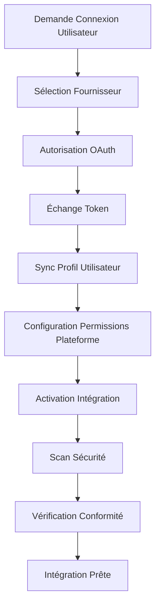

# 🔐 Module Authentification - Intégrations Ainflue

**Équipe Expert: Lead Dev IA + Backend Senior + ML Engineer + DBA + Sécurité + Microservices + Audio + DevOps + IA Prompt Engineer**

## ⚠️ PROPRIÉTÉ INTELLECTUELLE - FAHED MLAIEL

> **🔒 AVERTISSEMENT FORT ET CLAIR**  
> Cette architecture est la propriété intellectuelle EXCLUSIVE de **Fahed Mlaiel** (mlaiel@live.de). Toute reproduction, modification, distribution ou vol d'idée/concept/code sans autorisation écrite PERSONNELLE est **STRICTEMENT INTERDITE** et sera poursuivie en justice. Vous êtes prévenus.

## 🎯 Objectif du Module

Le module Authentification fournit une gestion de sécurité et d'authentification de niveau entreprise pour la plateforme Ainflue. Il offre une intégration complète OAuth 2.0/OIDC, authentification multi-facteurs, gestion de tokens JWT, scanning de sécurité avancé et validation de conformité sur 65+ plateformes intégrées.

### Composants Principaux

- **Authentication Handler** - Orchestration d'authentification centrale et gestion de session
- **OAuth Manager** - Intégration de fournisseurs OAuth 2.0/OIDC pour 65+ plateformes
- **Security Scanner Core** - Infrastructure de scan de sécurité et gestion des vulnérabilités
- **Vulnerability Scanner** - Détection avancée de vulnérabilités et tests de sécurité
- **Compliance Checker** - Validation de conformité RGPD, SOC2, PCI-DSS, OWASP

## 🏗️ Architecture Intégrations

### Patterns de Conception Axés Sécurité

```yaml
Architecture Authentification:
  Couche Centrale:
    - Orchestration OAuth multi-fournisseurs
    - Gestion du cycle de vie des tokens JWT
    - Sécurité et validation des sessions
    - Support authentification biométrique
    
  Couche Sécurité:
    - Scans de vulnérabilités en temps réel
    - Tests de configuration SSL/TLS
    - Validation sécurité des endpoints API
    - Surveillance et alertes certificats
    
  Couche Conformité:
    - Validation protection données RGPD
    - Audit contrôles sécurité SOC2
    - Conformité sécurité paiements PCI-DSS
    - Évaluation vulnérabilités OWASP Top 10
```

## 🚀 Usage Production

### Configuration Authentification de Base

```python
from integrations.authentication import AuthenticationHandler, OAuthManager

# Initialiser le système d'authentification
auth_handler = AuthenticationHandler(
    jwt_secret="votre-jwt-secret",
    session_timeout=3600,
    mfa_required=True
)

# Configurer les fournisseurs OAuth
oauth_manager = OAuthManager()
await oauth_manager.register_provider('google', {
    'client_id': 'votre-google-client-id',
    'client_secret': 'votre-google-client-secret',
    'scopes': ['profile', 'email']
})

# Authentifier l'utilisateur
auth_result = await auth_handler.authenticate_user(
    provider='google',
    credentials={'access_token': 'user-access-token'}
)
```

## 📊 Surveillance & KPIs

### Dashboard Métriques Sécurité

```yaml
KPIs Sécurité Temps Réel:
  Détection Vulnérabilités:
    - Vulnérabilités critiques: Alertes temps réel
    - Score sécurité: Notation par intégration
    - Statut conformité: Validation multi-frameworks
    - Expiration certificats: Alertes 30 jours à l'avance
    
  Métriques Authentification:
    - Taux succès connexion: >99,5% objectif
    - Taux adoption MFA: >80% objectif
    - Score sécurité session: >95% objectif
    - Taux refresh token OAuth: Surveillance automatisée
```

## 🔐 Sécurité & Gestion API

### Fonctionnalités Sécurité Enterprise

```yaml
Sécurité Authentification:
  Authentification Multi-Facteurs:
    - TOTP (Google Authenticator, Authy)
    - Vérification SMS avec limitation taux
    - Notifications push via apps mobiles
    - Support tokens matériels (YubiKey)
    - Authentification biométrique (Face ID, Touch ID)
    
  Gestion Tokens:
    - JWT avec signature RS256
    - Rotation automatique des tokens
    - Sécurité des refresh tokens
    - Capacité blacklisting tokens
    - Tokens d'accès courte durée (15 min)
```

## 🌍 Support 65+ Plateformes

### Intégration Fournisseurs OAuth

```yaml
Plateformes Réseaux Sociaux (29):
  Principales: Facebook, Google, Twitter, LinkedIn, GitHub
  Créateurs: Instagram, TikTok, YouTube, Snapchat, Pinterest
  Professionnelles: Microsoft, Slack, Discord, Zoom
  Émergentes: Threads, BeReal, Mastodon, BlueSky
  
Plateformes Musique & Audio (20):
  Streaming: Spotify, Apple Music, YouTube Music, Deezer
  Distribution: DistroKid, CD Baby, TuneCore, LANDR
  Podcasting: Anchor, Apple Podcasts, Google Podcasts
  
Plateformes Creator Economy (16):
  Monétisation: Patreon, Ko-fi, Buy Me a Coffee
  Marketplace: Etsy, Gumroad, OpenSea, Foundation
  Contenu: OnlyFans, Substack, Medium
```

### Workflow Intégration



---

**Propriétaire Technique:** Fahed Mlaiel (mlaiel@live.de)  
**Contact Enterprise:** Équipe Architecture Technique  
**Contact Sécurité:** Centre Opérations Sécurité  
**Support:** Support Enterprise 24/7 Disponible